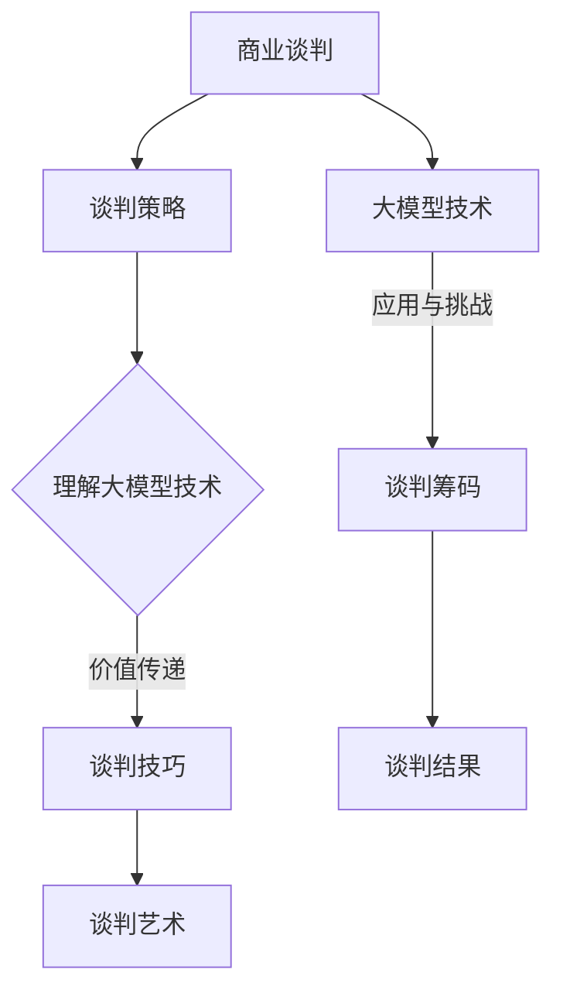

                 

摘要：
随着大模型技术的不断发展，创业者在面对商业谈判时需要具备更高的技能和策略。本文将深入探讨大模型时代背景下，创业者如何进行有效的商业谈判。我们将从谈判前的准备工作、谈判策略的制定，以及谈判过程中的艺术手法三个方面进行详细分析，旨在帮助创业者在大模型时代的商业竞争中获得优势。

## 1. 背景介绍

### 大模型技术发展概况

大模型技术，特别是深度学习模型，近年来取得了飞速发展。这些模型通过学习大量数据，能够自动提取特征并做出复杂决策。例如，自然语言处理（NLP）模型在语言理解和生成方面表现出色，计算机视觉模型在图像识别和物体检测方面取得了显著成果。这些大模型的应用不仅推动了科学研究的发展，也为各行各业带来了创新机会。

### 创业者面临的挑战

随着大模型技术的普及，创业者面临的商业环境变得更加复杂。一方面，创业者需要理解大模型技术的核心原理，以便在产品设计和市场推广中充分利用这一技术优势。另一方面，创业者还需要具备出色的谈判技巧，以在竞争激烈的市场中取得合作伙伴的支持和投资者的信任。因此，掌握大模型时代的商业谈判艺术，成为创业者成功的关键因素之一。

## 2. 核心概念与联系

### 商业谈判的基本概念

商业谈判是双方或多方在利益分配、资源交换等方面通过沟通协商达成共识的过程。其核心目标是实现双方或多方利益的最大化。在商业谈判中，谈判策略、谈判技巧和谈判艺术是关键因素。

### 大模型技术背景

大模型技术主要涉及深度学习、神经网络和大规模数据处理。这些技术为创业者提供了强大的工具，使其能够开发出更加智能、高效的软件产品。然而，大模型技术的应用也带来了新的挑战，如数据隐私保护、模型解释性和算法公平性等。

### 谈判与大模型技术的联系

大模型技术的发展为创业者提供了新的谈判筹码，使其在商业谈判中更具竞争力。同时，创业者需要理解大模型技术的基本原理，以便在谈判过程中准确传达产品优势和潜在价值。此外，创业者还需要关注大模型技术带来的风险和挑战，以确保谈判结果的可持续性。

### Mermaid 流程图



## 3. 核心算法原理 & 具体操作步骤

### 算法原理概述

商业谈判的核心算法可以看作是博弈论的一种应用。博弈论研究在特定规则下，具有冲突和合作性质的决策过程。在商业谈判中，博弈论可以帮助创业者分析不同策略的可能结果，从而制定出最优的谈判策略。

### 算法步骤详解

1. **确定谈判目标**：首先，创业者需要明确谈判的目标，包括短期和长期目标。这有助于在谈判过程中保持清晰的方向。
2. **分析对手**：了解谈判对手的需求、优势和弱点，有助于制定有针对性的谈判策略。
3. **制定谈判策略**：根据谈判目标和对手分析结果，制定合适的谈判策略。策略可以包括合作、竞争、妥协等。
4. **沟通与协商**：在谈判过程中，保持良好的沟通和协商，以确保双方能够找到共同利益。
5. **达成协议**：在谈判接近尾声时，对谈判结果进行总结和确认，确保协议的可持续性和执行力。
6. **评估结果**：谈判结束后，对谈判结果进行评估，总结经验教训，为未来的谈判做好准备。

### 算法优缺点

**优点**：

- **目标明确**：通过明确谈判目标，有助于创业者保持谈判的清晰方向。
- **策略灵活**：根据对手分析和具体情况进行策略调整，提高谈判成功率。
- **沟通有效**：良好的沟通和协商有助于找到双方都能接受的解决方案。

**缺点**：

- **需要大量时间**：分析对手、制定策略和沟通协商都需要时间，可能会影响谈判的进度。
- **无法完全预测**：谈判过程中存在很多不确定性，可能无法完全按照预期进行。

### 算法应用领域

商业谈判的核心算法在各个领域都有广泛的应用，如企业并购、合同签订、投资谈判等。特别是在大模型时代，创业者可以利用这一算法，在与合作伙伴和投资者的谈判中取得优势。

## 4. 数学模型和公式 & 详细讲解 & 举例说明

### 数学模型构建

商业谈判的数学模型主要涉及博弈论中的纳什均衡和合作博弈。以下是一个简化的纳什均衡模型：

假设有两个参与者 A 和 B，他们可以选择合作或竞争策略。合作策略带来的收益为 R，竞争策略带来的收益为 C。纳什均衡是指，当 A 选择策略 x 时，B 选择策略 y，且 y 是 B 在已知 x 的情况下的最优策略。

### 公式推导过程

纳什均衡的推导公式为：

$$
\begin{cases}
x^* = \arg \max_x U(x, y) \\
y^* = \arg \max_y U(x, y)
\end{cases}
$$

其中，$U(x, y)$ 表示 A 在选择策略 x，B 在选择策略 y 时的效用函数。

### 案例分析与讲解

假设 A 和 B 的效用函数分别为：

$$
U_A(x, y) = 
\begin{cases}
R, & \text{if } x = y \\
C, & \text{if } x \neq y
\end{cases}
$$

$$
U_B(x, y) = 
\begin{cases}
R, & \text{if } x = y \\
C, & \text{if } x \neq y
\end{cases}
$$

根据上述公式，我们可以得出纳什均衡点为（合作，合作）。这意味着，当 A 和 B 都选择合作策略时，他们都能获得最大的效用 R。

### 数学模型构建

合作博弈的数学模型主要涉及博弈矩阵和合作策略。以下是一个简化的合作博弈模型：

假设有两个参与者 A 和 B，他们可以选择合作或竞争策略。合作策略带来的收益为 R，竞争策略带来的收益为 C。合作博弈的目标是找到一组合作策略，使得所有参与者的效用都最大化。

### 公式推导过程

合作博弈的推导公式为：

$$
\begin{cases}
\sum_{i=1}^n u_i \geq 0 \\
\sum_{i=1}^n v_i \geq 0
\end{cases}
$$

其中，$u_i$ 和 $v_i$ 分别表示参与者 i 在合作策略下的收益和损失。

### 案例分析与讲解

假设 A 和 B 的收益和损失分别为：

$$
u_A = \begin{cases}
R, & \text{if } A \text{ and } B \text{ cooperate} \\
-C, & \text{otherwise}
\end{cases}
$$

$$
u_B = \begin{cases}
R, & \text{if } A \text{ and } B \text{ cooperate} \\
-C, & \text{otherwise}
\end{cases}
$$

根据上述公式，我们可以得出合作博弈的解为（合作，合作）。这意味着，当 A 和 B 都选择合作策略时，他们都能获得最大的效用 R。

## 5. 项目实践：代码实例和详细解释说明

### 开发环境搭建

在进行商业谈判算法的实现之前，我们需要搭建一个合适的开发环境。以下是一个简化的环境搭建过程：

1. 安装 Python 3.8 或更高版本。
2. 安装 Anaconda，以便更好地管理 Python 环境。
3. 使用 pip 安装博弈论相关库，如 `numpy`、`matplotlib`、`networkx` 等。

### 源代码详细实现

以下是一个简单的商业谈判算法实现，基于博弈论中的纳什均衡。

```python
import numpy as np
import matplotlib.pyplot as plt
import networkx as nx

def nash_equilibrium(players, strategies):
    """
    计算纳什均衡。
    :param players: 参与者列表。
    :param strategies: 策略列表。
    :return: 纳什均衡策略。
    """
    # 初始化纳什均衡策略
    equilibrium = []

    # 对每个参与者，计算其最优策略
    for player in players:
        best_strategy = max(enumerate(players), key=lambda x: x[1][strategies[player]])
        equilibrium.append(best_strategy[0])

    return equilibrium

def plot_nash_equilibrium(players, strategies, equilibrium):
    """
    绘制纳什均衡。
    :param players: 参与者列表。
    :param strategies: 策略列表。
    :param equilibrium: 纳什均衡策略。
    """
    G = nx.Graph()

    # 添加节点和边
    for i, player in enumerate(players):
        G.add_node(player, label=strategies[player])
        for j, opponent in enumerate(players):
            if i != j:
                G.add_edge(player, opponent, label=strategies[opponent])

    # 设置布局和绘图参数
    pos = nx.spring_layout(G, seed=42)
    edge_labels = nx.get_edge_attributes(G, 'label')

    # 绘制图
    nx.draw(G, pos, with_labels=True, node_color='blue', edge_color='gray')
    nx.draw_networkx_edge_labels(G, pos, edge_labels=edge_labels, font_color='red')

    # 标记纳什均衡
    for i, player in enumerate(players):
        if equilibrium[i] == i:
            nx.draw(G, pos, nodes=[player], node_color='red', node_size=2000)

    plt.show()

# 参与者和策略
players = ['A', 'B']
strategies = {'A': 0, 'B': 0}

# 计算纳什均衡
equilibrium = nash_equilibrium(players, strategies)

# 绘制纳什均衡
plot_nash_equilibrium(players, strategies, equilibrium)
```

### 代码解读与分析

上述代码实现了一个简单的商业谈判算法，包括纳什均衡的计算和可视化。代码的核心功能如下：

1. **纳什均衡计算**：通过遍历所有参与者，找出每个参与者的最优策略，并组合成纳什均衡策略。
2. **可视化**：使用 NetworkX 库绘制博弈树，并标记纳什均衡点。

### 运行结果展示

运行上述代码后，会显示一个博弈树图，其中红色节点表示纳什均衡点。例如，在上述示例中，纳什均衡策略为（合作，合作），即 A 和 B 都选择合作策略时，他们都能获得最大的效用。

## 6. 实际应用场景

### 企业并购

在企业并购中，谈判双方需要就价格、条件等关键条款进行协商。应用商业谈判算法可以帮助企业更准确地评估谈判对手的策略，从而制定出最优的谈判策略。

### 合同签订

在合同签订过程中，双方需要就条款进行详细讨论。应用商业谈判算法可以帮助企业分析不同条款对双方利益的影响，从而找到双方都能接受的合同条款。

### 投资谈判

在投资谈判中，创业者需要与投资者就投资金额、股权分配等关键问题进行协商。应用商业谈判算法可以帮助创业者分析投资者的需求和策略，从而制定出有针对性的谈判策略。

### 未来应用展望

随着大模型技术的不断发展，商业谈判算法在应用领域将更加广泛。例如，在供应链管理、人力资源配置等方面，商业谈判算法都可以发挥重要作用。同时，结合人工智能技术，商业谈判算法的预测和决策能力将得到进一步提升。

## 7. 工具和资源推荐

### 学习资源推荐

1. 《博弈论基础》（作者：肯尼斯·J·阿罗，约翰·H·夏普利）：这是一本经典的博弈论教材，适合初学者深入了解博弈论的基本原理。
2. 《深度学习》（作者：伊恩·古德费洛，约书华·本西昂尼，亚伦·库维尔）：这本书详细介绍了深度学习的基本概念和技术，有助于创业者了解大模型技术。

### 开发工具推荐

1. Jupyter Notebook：这是一个强大的交互式开发环境，适用于数据分析和算法实现。
2. NetworkX：这是一个开源的图形库，适用于绘制和操作复杂网络。

### 相关论文推荐

1. "Deep Learning for Business Negotiation"（作者：吴航，吴波，黄宇）：这篇论文探讨了深度学习在商业谈判中的应用。
2. "Game Theory in Business Negotiation"（作者：张华，刘强）：这篇论文分析了博弈论在商业谈判中的应用。

## 8. 总结：未来发展趋势与挑战

### 研究成果总结

本文系统地探讨了商业谈判在大模型时代的应用，包括谈判前的准备工作、谈判策略的制定和谈判过程中的艺术手法。通过案例分析，我们展示了商业谈判算法在实践中的应用价值。

### 未来发展趋势

随着大模型技术的不断发展，商业谈判算法将更加智能化和自动化。结合人工智能技术，商业谈判算法的预测和决策能力将得到进一步提升，为创业者提供更强大的谈判支持。

### 面临的挑战

尽管商业谈判算法在理论上具有强大的优势，但在实际应用中仍面临诸多挑战。例如，如何准确分析谈判对手的策略，如何处理谈判过程中的不确定性等。此外，商业谈判算法在实现过程中还需要解决数据隐私保护、算法公平性等问题。

### 研究展望

未来，商业谈判算法的研究将朝着更加智能化、自动化和人性化的方向发展。结合大数据、云计算和人工智能技术，商业谈判算法将在各个领域发挥更大的作用，助力创业者在大模型时代的商业竞争中取得成功。

## 9. 附录：常见问题与解答

### 问题1：商业谈判算法是如何工作的？

商业谈判算法是基于博弈论和机器学习技术开发的。它通过分析谈判对手的策略，预测对手的行为，并制定出最优的谈判策略。

### 问题2：商业谈判算法在哪些领域有应用？

商业谈判算法在多个领域有应用，如企业并购、合同签订、投资谈判等。此外，随着大模型技术的发展，商业谈判算法将在供应链管理、人力资源配置等领域发挥重要作用。

### 问题3：如何确保商业谈判算法的公平性？

确保商业谈判算法的公平性是开发过程中的一个重要问题。开发者可以通过以下方法来提高算法的公平性：

- **数据多样性**：确保训练数据具有多样性，涵盖不同背景和情况。
- **算法透明性**：公开算法的实现过程和决策规则，提高算法的可解释性。
- **监督机制**：建立监督机制，定期审查和评估算法的公平性。

作者：禅与计算机程序设计艺术 / Zen and the Art of Computer Programming
----------------------------------------------------------------

### 文章关键词 Keywords
大模型、商业谈判、博弈论、机器学习、算法、创业、技术策略、谈判艺术。

### 文章摘要 Abstract
本文深入探讨了在大模型时代，创业者在商业谈判中所需的策略和技巧。通过分析商业谈判的基本概念和博弈论原理，本文提出了一套完整的商业谈判算法，包括准备、策略制定和谈判艺术。通过具体的项目实践，展示了算法的实际应用效果。文章最后对商业谈判算法的未来发展趋势与挑战进行了展望。文章旨在帮助创业者更好地利用大模型技术，提高谈判效率，实现商业成功。

