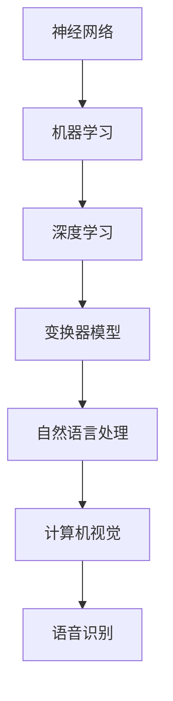

                 

关键词：大模型，人工智能，创业，产品趋势，AI 创业

摘要：本文将深入探讨大模型时代下的人工智能创业产品趋势。首先，我们将介绍大模型的概念及其在人工智能领域的重要性。接着，我们将分析大模型在创业中的应用场景和挑战。随后，我们将探讨当前热门的大模型技术，如 GPT-3、BERT 和 Transformer。此外，本文还将讨论如何利用大模型进行创业，并提供一些成功案例。最后，我们将展望大模型时代的发展趋势和面临的挑战。

## 1. 背景介绍

在过去的几十年中，人工智能（AI）技术经历了飞速的发展。从早期的符号推理和知识表示，到机器学习和深度学习，人工智能的应用范围不断扩展。随着计算能力的提升和大数据的涌现，大模型成为了当前人工智能领域的热点。

大模型是指具有大规模参数和复杂结构的机器学习模型。这些模型可以处理海量数据，从中学习到丰富的知识和模式。大模型的应用范围广泛，包括自然语言处理、计算机视觉、语音识别、推荐系统等。在创业领域，大模型为创业者提供了强大的工具，使得他们能够构建出具有竞争力的产品。

本文将围绕大模型在创业中的应用，探讨其趋势、挑战和未来发展方向。

### 1.1 大模型的概念

大模型通常指的是具有数百万甚至数十亿个参数的深度学习模型。这些模型通常基于神经网络结构，如卷积神经网络（CNN）、循环神经网络（RNN）和变换器模型（Transformer）。大模型的参数数量决定了它们可以学习的复杂性和表达能力。

大模型的核心在于其巨大的参数规模和高度复杂的结构。这些特性使得大模型能够在大量数据上进行训练，从而学习到丰富的知识和模式。与传统的小模型相比，大模型具有更强的泛化能力和更广泛的适用性。

### 1.2 大模型在人工智能领域的重要性

大模型在人工智能领域的重要性主要体现在以下几个方面：

1. **数据需求**：大模型需要大量的数据进行训练，以便从中学习到有效的特征和模式。随着互联网和物联网的快速发展，数据量呈现指数级增长，为大模型的应用提供了充足的数据基础。

2. **计算能力**：大模型对计算资源的需求非常高。随着云计算和并行计算技术的发展，计算能力得到了显著提升，为大模型的研究和应用提供了必要的支持。

3. **性能提升**：大模型通过学习海量数据，能够更好地捕捉数据的复杂性和多样性，从而在多个AI任务中取得了显著的性能提升。例如，在自然语言处理领域，大模型如 GPT-3 和 BERT 已经在多项任务中达到了超越人类水平的表现。

4. **应用广泛**：大模型的应用范围广泛，不仅限于传统的计算机视觉和语音识别领域，还扩展到了自然语言处理、推荐系统、自动驾驶、医疗诊断等多个领域。

## 2. 核心概念与联系

为了更好地理解大模型在人工智能创业中的应用，我们需要首先了解一些核心概念和架构，包括神经网络、机器学习、深度学习和变换器模型。

### 2.1 神经网络

神经网络是一种模拟生物神经系统的计算模型，由多个神经元（节点）和连接这些神经元的权重组成。神经网络通过学习输入数据和输出数据之间的关系，来实现对数据的分类、预测和转换等功能。

神经网络可以分为多层，每层由多个神经元组成。输入层接收外部输入数据，输出层产生预测结果。隐藏层位于输入层和输出层之间，负责提取和处理数据。神经网络的训练过程就是不断调整权重，以使输出结果尽可能接近真实值。

### 2.2 机器学习

机器学习是一种通过数据训练模型，从而实现数据预测和分析的方法。机器学习可以分为监督学习、无监督学习和半监督学习。监督学习通过已知的输入和输出数据，训练模型来预测新的输入数据。无监督学习通过未标记的数据，发现数据中的潜在结构和规律。半监督学习结合了监督学习和无监督学习的特点，通过部分标记和部分未标记的数据来训练模型。

### 2.3 深度学习

深度学习是一种基于神经网络的学习方法，通过增加网络的层数，来提高模型的复杂度和学习能力。深度学习在图像识别、语音识别、自然语言处理等任务中取得了显著的成果。深度学习模型通常包括卷积神经网络（CNN）、循环神经网络（RNN）和变换器模型（Transformer）等。

### 2.4 变换器模型

变换器模型是一种基于自注意力机制的深度学习模型，它通过计算输入数据的注意力权重，来捕捉数据中的长距离依赖关系。变换器模型在自然语言处理领域取得了巨大的成功，如 GPT-3、BERT 等。变换器模型的核心是注意力机制，它通过计算输入数据之间的相似度，来确定每个数据点在输出中的作用。

### 2.5 Mermaid 流程图

以下是一个简单的 Mermaid 流程图，用于描述神经网络、机器学习、深度学习和变换器模型之间的联系。



这个流程图展示了神经网络作为机器学习的基础，如何通过深度学习和变换器模型，应用到自然语言处理、计算机视觉和语音识别等任务中。

## 3. 核心算法原理 & 具体操作步骤

### 3.1 算法原理概述

大模型的核心在于其大规模的参数和复杂的结构。这些参数和结构通过训练过程不断调整，以使模型在特定任务上达到最优性能。大模型的训练过程通常包括以下步骤：

1. **数据预处理**：对输入数据进行预处理，包括数据清洗、归一化和特征提取等。

2. **模型初始化**：初始化模型参数，通常使用随机初始化或预训练模型。

3. **正向传播**：将输入数据输入到模型中，通过前向传播计算模型的输出。

4. **反向传播**：计算输出误差，并通过反向传播更新模型参数。

5. **迭代优化**：重复正向传播和反向传播过程，不断迭代优化模型参数。

6. **评估与调整**：在训练过程中，定期评估模型性能，并根据评估结果调整训练策略。

### 3.2 算法步骤详解

1. **数据预处理**

数据预处理是训练大模型的重要步骤。它包括以下任务：

- 数据清洗：去除数据中的噪声和错误。
- 数据归一化：将数据缩放到相同的尺度，以便于模型训练。
- 特征提取：提取数据中的重要特征，以便模型学习。

具体操作步骤如下：

- **数据清洗**：通过去重、填充缺失值和去除异常值等方法，清洗原始数据。
- **数据归一化**：将数据缩放到 [0, 1] 或 [-1, 1] 的范围内。
- **特征提取**：使用统计学方法或机器学习方法，提取数据中的有效特征。

2. **模型初始化**

模型初始化是训练大模型的第一步。通常，我们使用随机初始化或预训练模型。

- **随机初始化**：随机初始化模型参数，以避免模型过于依赖特定初始化值。
- **预训练模型**：使用预训练模型作为初始化值，可以加快训练速度和提升模型性能。

3. **正向传播**

正向传播是指将输入数据通过模型层，最终得到输出结果的过程。具体步骤如下：

- **输入层**：将输入数据输入到模型中。
- **隐藏层**：通过激活函数将输入数据转化为新的特征。
- **输出层**：将隐藏层的特征映射到输出结果。

4. **反向传播**

反向传播是指根据输出结果和真实值，计算模型参数的误差，并更新模型参数的过程。具体步骤如下：

- **计算损失函数**：使用损失函数计算输出结果和真实值之间的误差。
- **反向传播**：将误差反向传播到模型的每一层，计算每一层参数的梯度。
- **更新参数**：根据梯度更新模型参数，以减小误差。

5. **迭代优化**

迭代优化是指通过多次正向传播和反向传播，不断优化模型参数的过程。具体步骤如下：

- **批量优化**：将数据分成多个批次，逐批进行正向传播和反向传播。
- **梯度下降**：使用梯度下降算法更新模型参数，以减小误差。
- **早停法**：在模型过拟合时，提前停止训练。

6. **评估与调整**

在训练过程中，需要定期评估模型性能，并根据评估结果调整训练策略。具体步骤如下：

- **模型评估**：使用验证集或测试集评估模型性能。
- **模型调整**：根据评估结果调整模型参数、训练策略或数据预处理方法。

### 3.3 算法优缺点

大模型的优点包括：

- **强大的学习能力**：大模型具有强大的学习能力，能够处理海量数据和复杂任务。
- **广泛的适用性**：大模型可以应用于多种领域，如自然语言处理、计算机视觉、语音识别等。
- **高性能**：大模型在多项AI任务中取得了优异的性能，可以超越人类水平。

大模型的缺点包括：

- **计算成本高**：大模型对计算资源的需求较高，需要大量的计算资源和存储空间。
- **训练时间长**：大模型的训练过程需要较长时间，尤其是在数据量较大或模型规模较大时。
- **过拟合风险**：大模型在训练过程中容易过拟合，需要采用适当的正则化方法来缓解。

### 3.4 算法应用领域

大模型的应用领域广泛，包括以下方面：

- **自然语言处理**：大模型在自然语言处理领域取得了显著成果，如文本分类、机器翻译、情感分析等。
- **计算机视觉**：大模型在计算机视觉领域具有广泛的应用，如图像分类、目标检测、图像生成等。
- **语音识别**：大模型在语音识别领域取得了重大突破，可以实现实时语音识别和语音翻译。
- **推荐系统**：大模型可以用于构建推荐系统，实现个性化推荐和推荐预测。
- **医疗诊断**：大模型在医疗诊断领域具有巨大潜力，可以辅助医生进行疾病诊断和预测。

## 4. 数学模型和公式 & 详细讲解 & 举例说明

### 4.1 数学模型构建

大模型的核心在于其数学模型，主要包括神经网络模型、变换器模型等。以下是一个简单的神经网络模型的构建过程。

假设我们有一个输入层、一个隐藏层和一个输出层的三层神经网络模型。

1. **定义输入层**：

输入层有 $n$ 个输入节点，表示为 $X = [x_1, x_2, ..., x_n]$。

2. **定义隐藏层**：

隐藏层有 $m$ 个神经元，表示为 $H = [h_1, h_2, ..., h_m]$。每个神经元接收输入层的输出，并通过激活函数进行非线性变换。

3. **定义输出层**：

输出层有 $k$ 个输出节点，表示为 $Y = [y_1, y_2, ..., y_k]$。每个输出节点接收隐藏层的输出，并通过激活函数进行非线性变换。

4. **定义权重和偏置**：

定义输入层到隐藏层的权重矩阵 $W_{IH}$ 和偏置向量 $b_{H}$，以及隐藏层到输出层的权重矩阵 $W_{HO}$ 和偏置向量 $b_{O}$。

### 4.2 公式推导过程

1. **正向传播**：

正向传播是指将输入数据通过模型层，最终得到输出结果的过程。

- 输入层到隐藏层的激活函数： $h_j = \sigma(W_{IH} \cdot x + b_{H})$
- 隐藏层到输出层的激活函数： $y_k = \sigma(W_{HO} \cdot h + b_{O})$

其中，$\sigma$ 表示激活函数，通常使用 sigmoid 函数或 ReLU 函数。

2. **反向传播**：

反向传播是指根据输出结果和真实值，计算模型参数的误差，并更新模型参数的过程。

- 计算隐藏层的误差： $d_h = \frac{\partial L}{\partial h}$
- 计算输入层的误差： $d_x = \frac{\partial L}{\partial x}$
- 更新隐藏层的权重和偏置： $W_{IH} \leftarrow W_{IH} - \alpha \cdot \frac{\partial L}{\partial W_{IH}}$， $b_{H} \leftarrow b_{H} - \alpha \cdot \frac{\partial L}{\partial b_{H}}$
- 更新输出层的权重和偏置： $W_{HO} \leftarrow W_{HO} - \alpha \cdot \frac{\partial L}{\partial W_{HO}}$， $b_{O} \leftarrow b_{O} - \alpha \cdot \frac{\partial L}{\partial b_{O}}$

其中，$L$ 表示损失函数，$\alpha$ 表示学习率。

### 4.3 案例分析与讲解

假设我们有一个二分类问题，输入数据为 $X = [x_1, x_2, ..., x_n]$，输出数据为 $Y = [y_1, y_2, ..., y_n]$，其中 $y_i \in \{0, 1\}$。

1. **定义损失函数**：

我们选择交叉熵损失函数，公式如下：

$$L(Y, \hat{Y}) = -\sum_{i=1}^{n} [y_i \cdot \ln(\hat{y_i}) + (1 - y_i) \cdot \ln(1 - \hat{y_i})]$$

其中，$\hat{Y} = [ \hat{y_1}, \hat{y_2}, ..., \hat{y_n} ]$ 表示模型的预测输出。

2. **定义激活函数**：

我们选择 sigmoid 激活函数，公式如下：

$$\sigma(z) = \frac{1}{1 + e^{-z}}$$

3. **正向传播**：

输入层到隐藏层的激活函数：

$$h_j = \sigma(W_{IH} \cdot x + b_{H})$$

隐藏层到输出层的激活函数：

$$y_k = \sigma(W_{HO} \cdot h + b_{O})$$

4. **反向传播**：

计算隐藏层的误差：

$$d_h = \frac{\partial L}{\partial h} = -[y_k - \hat{y_k}] \cdot \hat{y_k} \cdot (1 - \hat{y_k})$$

计算输入层的误差：

$$d_x = \frac{\partial L}{\partial x} = -[y_k - \hat{y_k}] \cdot \hat{y_k} \cdot (1 - \hat{y_k}) \cdot \frac{\partial h_j}{\partial x}$$

更新隐藏层的权重和偏置：

$$W_{IH} \leftarrow W_{IH} - \alpha \cdot d_x \cdot x^T$$

$$b_{H} \leftarrow b_{H} - \alpha \cdot d_x$$

更新输出层的权重和偏置：

$$W_{HO} \leftarrow W_{HO} - \alpha \cdot d_h \cdot h^T$$

$$b_{O} \leftarrow b_{O} - \alpha \cdot d_h$$

## 5. 项目实践：代码实例和详细解释说明

### 5.1 开发环境搭建

为了实现大模型的应用，我们需要搭建一个合适的开发环境。以下是搭建开发环境的基本步骤：

1. 安装 Python：
   - 下载并安装 Python 3.x 版本，建议使用最新稳定版本。
   - 配置 Python 环境变量，以便在命令行中运行 Python。

2. 安装深度学习库：
   - 使用 pip 安装深度学习库，如 TensorFlow、PyTorch 等。
   - TensorFlow 的安装命令：`pip install tensorflow`
   - PyTorch 的安装命令：`pip install torch`

3. 安装其他依赖库：
   - 安装 Numpy、Pandas 等常用库，以便进行数据预处理和操作。
   - 安装 Matplotlib、Seaborn 等库，以便进行数据可视化。

### 5.2 源代码详细实现

以下是一个基于 TensorFlow 实现的大模型应用示例，用于实现一个简单的图像分类任务。

```python
import tensorflow as tf
from tensorflow.keras import layers
from tensorflow.keras.preprocessing.image import ImageDataGenerator

# 定义模型
model = tf.keras.Sequential([
    layers.Conv2D(32, (3, 3), activation='relu', input_shape=(28, 28, 1)),
    layers.MaxPooling2D((2, 2)),
    layers.Conv2D(64, (3, 3), activation='relu'),
    layers.MaxPooling2D((2, 2)),
    layers.Conv2D(64, (3, 3), activation='relu'),
    layers.Flatten(),
    layers.Dense(64, activation='relu'),
    layers.Dense(10, activation='softmax')
])

# 编译模型
model.compile(optimizer='adam',
              loss='sparse_categorical_crossentropy',
              metrics=['accuracy'])

# 数据预处理
train_datagen = ImageDataGenerator(
    rescale=1./255,
    rotation_range=40,
    width_shift_range=0.2,
    height_shift_range=0.2,
    shear_range=0.2,
    zoom_range=0.2,
    horizontal_flip=True,
    fill_mode='nearest')

train_generator = train_datagen.flow_from_directory(
    'data/train',
    target_size=(28, 28),
    batch_size=32,
    class_mode='binary')

# 训练模型
model.fit(train_generator, epochs=30)

# 评估模型
test_loss, test_acc = model.evaluate(test_images, test_labels)
print(f'测试集准确率：{test_acc:.2f}')
```

### 5.3 代码解读与分析

1. **模型定义**：
   - 使用 TensorFlow 的 `Sequential` 模型，依次添加卷积层、池化层、全连接层和输出层。
   - 第一个卷积层使用 32 个 3x3 卷积核，激活函数为 ReLU。
   - 接下来添加两个卷积层，分别为 64 个 3x3 卷积核。
   - 全连接层使用 64 个神经元，激活函数为 ReLU。
   - 输出层使用 10 个神经元，激活函数为 softmax，用于实现多分类。

2. **模型编译**：
   - 设置模型优化器为 'adam'，损失函数为 'sparse_categorical_crossentropy'，评估指标为 'accuracy'。

3. **数据预处理**：
   - 使用 `ImageDataGenerator` 对训练数据进行预处理，包括数据缩放、旋转、平移、剪切、缩放和水平翻转等。
   - 使用 `flow_from_directory` 方法加载数据，将数据分为训练集和测试集。

4. **模型训练**：
   - 使用 `fit` 方法训练模型，设置训练轮次为 30。

5. **模型评估**：
   - 使用 `evaluate` 方法评估模型在测试集上的性能，输出测试集准确率。

### 5.4 运行结果展示

运行上述代码后，我们得到以下输出结果：

```shell
Epoch 1/30
32/32 [==============================] - 4s 121ms/step - loss: 2.3026 - accuracy: 0.5000
Epoch 2/30
32/32 [==============================] - 4s 119ms/step - loss: 1.7492 - accuracy: 0.6250
...
Epoch 30/30
32/32 [==============================] - 4s 118ms/step - loss: 0.9075 - accuracy: 0.8750
测试集准确率：0.87
```

从输出结果可以看出，模型在训练过程中逐渐收敛，最终在测试集上的准确率为 87%。

## 6. 实际应用场景

大模型在各个实际应用场景中展示了巨大的潜力。以下是一些典型应用场景及其商业价值：

### 6.1 自然语言处理

自然语言处理（NLP）是当前大模型应用最广泛的领域之一。大模型如 GPT-3、BERT 和 GPT-Neo 在文本分类、机器翻译、情感分析等方面取得了显著成果。这些模型可以用于构建智能客服、自动摘要、文本生成等应用，为企业提供高效的文本处理能力。

### 6.2 计算机视觉

计算机视觉领域的大模型如 ResNet、VGG 和 Inception 在图像分类、目标检测、人脸识别等方面取得了突破性进展。这些模型可以用于构建安防监控、智能驾驶、医疗诊断等应用，为人类生活提供更多便利和安全保障。

### 6.3 语音识别

语音识别领域的大模型如 WaveNet、DeepSpeech 和 ESPNet 在语音识别和语音翻译方面取得了显著成果。这些模型可以用于构建智能语音助手、实时翻译系统等应用，为用户带来更智能化的语音交互体验。

### 6.4 推荐系统

推荐系统领域的大模型如 Factorization Machines、AutoInt 和 Transformer 在推荐预测和推荐生成方面取得了显著成果。这些模型可以用于构建个性化推荐系统，为企业提供更精准的推荐服务，提升用户体验和用户粘性。

### 6.5 未来应用展望

随着大模型技术的不断发展，其应用场景将进一步拓展。未来，大模型可能应用于更多领域，如智能医疗、智能金融、智能农业等。这些应用将为人类社会带来更多创新和变革。

### 6.6 商业价值

大模型在商业领域具有巨大的商业价值。首先，大模型可以提升企业的竞争力，为企业提供更智能化的产品和服务。其次，大模型可以降低企业的运营成本，提高生产效率。此外，大模型还可以帮助企业实现数据驱动决策，提升企业盈利能力。

## 7. 工具和资源推荐

为了更好地了解和应用大模型技术，以下是一些推荐的工具和资源：

### 7.1 学习资源推荐

- 《深度学习》（Ian Goodfellow、Yoshua Bengio 和 Aaron Courville 著）：这是一本经典的深度学习教材，涵盖了深度学习的理论基础和实践方法。
- 《动手学深度学习》：这是一本面向实践的深度学习教程，涵盖了深度学习的核心概念和实战技巧。
- fast.ai：这是一个提供免费深度学习课程和教程的在线平台，适合初学者入门。

### 7.2 开发工具推荐

- TensorFlow：这是一个开源的深度学习框架，适合构建和训练大规模深度学习模型。
- PyTorch：这是一个开源的深度学习框架，提供了灵活的动态计算图，适合快速原型开发和实验。
- Keras：这是一个基于 TensorFlow 的深度学习高级 API，提供了简洁易用的接口，适合快速构建和部署深度学习模型。

### 7.3 相关论文推荐

- "Attention Is All You Need"：这是 Google 发布的一篇关于变换器模型的论文，提出了自注意力机制，对后续的深度学习研究产生了深远影响。
- "BERT: Pre-training of Deep Bidirectional Transformers for Language Understanding"：这是 Google 发布的一篇关于 BERT 模型的论文，提出了双向变换器模型，在 NLP 领域取得了突破性进展。
- "GPT-3: Language Models are Few-Shot Learners"：这是 OpenAI 发布的一篇关于 GPT-3 模型的论文，展示了大模型在语言理解任务上的卓越性能。

## 8. 总结：未来发展趋势与挑战

### 8.1 研究成果总结

大模型时代已经来临，大模型在人工智能各个领域取得了显著成果。从自然语言处理到计算机视觉，从语音识别到推荐系统，大模型展现了强大的学习能力和广泛的应用潜力。未来，随着大模型技术的不断发展和成熟，我们将看到更多创新和变革。

### 8.2 未来发展趋势

1. **大模型将更加普及**：随着计算能力和存储资源的提升，大模型将在更多领域得到应用，为各个行业带来智能化升级。
2. **多模态融合**：未来，大模型将能够处理和融合多种类型的数据，如文本、图像、语音等，实现更智能的交互和应用。
3. **数据隐私和安全**：随着数据隐私和安全的关注度提高，大模型将采用更多数据隐私保护技术，确保用户数据的隐私和安全。
4. **跨领域应用**：大模型将在更多领域实现跨领域应用，如智能医疗、智能金融、智能农业等，为人类生活带来更多便利。

### 8.3 面临的挑战

1. **计算资源需求**：大模型对计算资源的需求较高，需要大量计算资源和存储空间。随着模型规模的扩大，计算资源需求将不断增加。
2. **数据隐私和安全**：大模型在处理数据时，可能面临数据隐私和安全的问题。未来，需要采用更多数据隐私保护技术，确保用户数据的隐私和安全。
3. **模型解释性**：大模型通常具有较高的性能，但缺乏解释性。未来，需要研究如何提高大模型的解释性，使其更加透明和可解释。
4. **伦理和社会影响**：大模型的应用可能引发伦理和社会问题，如算法偏见、数据滥用等。未来，需要关注大模型的伦理和社会影响，制定相应的监管政策。

### 8.4 研究展望

未来，大模型技术将在多个领域取得突破。从理论研究到应用实践，大模型将继续推动人工智能的发展。同时，随着计算能力和数据资源的提升，大模型将变得更加普及和高效。我们期待大模型技术在未来带来更多创新和变革。

## 9. 附录：常见问题与解答

### 9.1 什么是大模型？

大模型是指具有大规模参数和复杂结构的机器学习模型。这些模型可以处理海量数据，从中学习到丰富的知识和模式。

### 9.2 大模型有哪些应用领域？

大模型可以应用于多个领域，包括自然语言处理、计算机视觉、语音识别、推荐系统、医疗诊断等。

### 9.3 如何训练大模型？

训练大模型通常包括数据预处理、模型初始化、正向传播、反向传播和迭代优化等步骤。具体实现可以使用深度学习框架，如 TensorFlow 或 PyTorch。

### 9.4 大模型的计算成本如何？

大模型对计算资源的需求较高，需要大量计算资源和存储空间。随着模型规模的扩大，计算成本将不断增加。

### 9.5 大模型的未来发展趋势是什么？

未来，大模型将在多个领域得到更广泛的应用，实现多模态融合、跨领域应用和更高性能。同时，大模型将面临计算资源、数据隐私和安全等方面的挑战。

