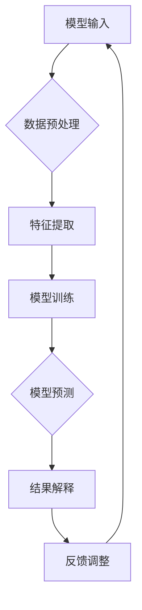

                 

关键词：大模型、可解释性、研究前景、人工智能、深度学习、技术博客

> 摘要：本文旨在探讨大模型的可解释性研究前景。随着人工智能技术的飞速发展，深度学习模型变得愈加复杂，其对决策过程的可解释性成为一个亟待解决的问题。本文将从背景介绍、核心概念与联系、核心算法原理与操作步骤、数学模型与公式、项目实践、实际应用场景、工具和资源推荐以及总结未来发展趋势与挑战等方面，全面剖析大模型可解释性研究的现状与未来方向。

## 1. 背景介绍

近年来，人工智能（AI）和深度学习（Deep Learning）领域取得了令人瞩目的成就。大模型（Large Models）作为深度学习的关键技术之一，在自然语言处理（NLP）、计算机视觉（CV）和语音识别（ASR）等众多领域发挥了重要作用。大模型通常拥有数亿甚至数万亿个参数，能够捕捉到大量数据中的复杂模式。然而，随着模型的规模不断增大，其决策过程变得愈发神秘，难以解释和理解。

可解释性（Explainability）成为人工智能研究中的关键问题。可解释性不仅有助于研究人员理解模型的内在工作机制，还能提升模型的透明度和可信度，对于实际应用具有重要意义。例如，在医疗诊断、金融风险评估和法律决策等领域，模型的决策过程必须是可解释的，以确保其符合法律法规和伦理要求。

## 2. 核心概念与联系

为了更好地理解大模型的可解释性，我们需要先了解一些核心概念。

### 2.1 模型可解释性的定义

模型可解释性指的是能够解释模型如何做出决策的能力。具体来说，可解释性包括以下两个方面：

- **内在可解释性**：模型内部决策过程的透明性，即模型如何利用其参数和数据生成预测结果。
- **外在可解释性**：模型输出结果的合理性，即模型预测结果是否与实际情况相符。

### 2.2 大模型的特点

- **参数规模**：大模型拥有数亿甚至数万亿个参数，能够捕捉到更复杂的数据模式。
- **深度结构**：大模型通常具有多层神经网络结构，能够实现更复杂的函数逼近能力。
- **自适应能力**：大模型能够通过自我调整参数，适应不同的数据和任务。

### 2.3 可解释性的重要性

- **提升信任度**：可解释性有助于提高模型在实际应用中的信任度，使其在关键领域得到更广泛的认可和应用。
- **改进模型设计**：可解释性能够帮助研究人员识别模型的缺陷和不足，从而改进模型设计。
- **促进技术创新**：可解释性有助于推动人工智能技术的创新和发展，为新的应用场景提供可能性。

### 2.4 核心概念原理和架构的 Mermaid 流程图



在这个流程图中，A表示模型输入，B表示数据预处理，C表示特征提取，D表示模型训练，E表示模型预测，F表示结果解释，G表示反馈调整。

## 3. 核心算法原理 & 具体操作步骤

### 3.1 算法原理概述

大模型的可解释性研究主要涉及以下几个方向：

- **模型结构解释**：通过分析模型的架构和参数，揭示模型的工作原理。
- **特征重要性分析**：评估模型中各个特征的贡献，帮助理解模型如何利用特征进行决策。
- **决策路径追踪**：跟踪模型从输入到输出的决策路径，揭示模型如何处理复杂问题。
- **可视化方法**：利用可视化技术，将模型的内部结构和决策过程呈现出来，使其更易于理解。

### 3.2 算法步骤详解

#### 3.2.1 数据预处理

数据预处理是可解释性研究的第一步。其目的是清洗数据、处理缺失值、标准化特征等，以确保数据质量。

- **数据清洗**：去除重复数据、填补缺失值、消除噪声。
- **特征选择**：选择与任务相关的特征，剔除冗余特征。
- **数据标准化**：将数据缩放到相同的范围，以便模型训练。

#### 3.2.2 模型训练

模型训练是构建可解释性模型的关键步骤。通过训练，模型能够学习到数据中的特征和模式。

- **参数初始化**：随机初始化模型参数。
- **正向传播**：将输入数据传递到模型中，计算输出。
- **反向传播**：根据输出结果，更新模型参数。
- **模型评估**：使用验证集评估模型性能，调整模型参数。

#### 3.2.3 特征重要性分析

特征重要性分析旨在评估模型中各个特征的贡献。具体步骤如下：

- **特征选择**：使用特征选择算法，选择对模型预测有显著影响的特征。
- **特征重要性评估**：使用统计方法（如相对重要性、方差分解等）评估特征的重要性。
- **可视化**：将特征重要性可视化，帮助理解模型如何利用特征进行决策。

#### 3.2.4 决策路径追踪

决策路径追踪是揭示模型决策过程的重要手段。具体步骤如下：

- **路径追踪算法**：使用路径追踪算法（如递归神经网络（RNN）等），跟踪模型从输入到输出的决策路径。
- **路径可视化**：将决策路径可视化，帮助理解模型如何处理复杂问题。

#### 3.2.5 可视化方法

可视化方法是将模型的内部结构和决策过程呈现出来的重要手段。具体步骤如下：

- **可视化工具**：选择合适的可视化工具（如matplotlib、seaborn等），将模型结果可视化。
- **结果可视化**：将模型预测结果、特征重要性、决策路径等可视化，帮助用户更好地理解模型。

### 3.3 算法优缺点

#### 优点

- **提升模型透明度**：可解释性研究有助于提升模型的透明度，使其更易于理解和接受。
- **改进模型设计**：可解释性研究能够帮助研究人员识别模型的缺陷和不足，从而改进模型设计。
- **促进技术创新**：可解释性研究有助于推动人工智能技术的创新和发展。

#### 缺点

- **计算成本较高**：可解释性研究通常需要大量的计算资源，对于大模型尤为明显。
- **时间成本较高**：可解释性研究需要耗费较长时间，对于实际应用场景可能不够高效。
- **准确性受影响**：过度追求可解释性可能导致模型准确性下降。

### 3.4 算法应用领域

可解释性研究在人工智能领域的应用非常广泛，主要包括以下几个方面：

- **医疗诊断**：通过对模型的决策过程进行分析，帮助医生理解模型如何做出诊断，提高诊断的准确性。
- **金融风险评估**：通过对模型的决策过程进行分析，帮助金融机构识别风险，提高风险评估的准确性。
- **法律决策**：通过对模型的决策过程进行分析，帮助法官理解模型如何做出判决，提高判决的公正性。

## 4. 数学模型和公式 & 详细讲解 & 举例说明

### 4.1 数学模型构建

大模型的可解释性研究通常涉及以下数学模型：

- **神经网络模型**：神经网络（Neural Networks）是深度学习的基础，其核心是神经元之间的连接权重。
- **决策树模型**：决策树（Decision Trees）是一种常见的分类和回归模型，其核心是树结构。
- **支持向量机模型**：支持向量机（Support Vector Machines，SVM）是一种基于间隔的线性分类模型。

### 4.2 公式推导过程

以下是一个简单的神经网络模型的推导过程：

1. **激活函数**：神经网络的激活函数通常是一个非线性函数，如Sigmoid函数、ReLU函数等。假设我们使用ReLU函数，则有：
   $$
   f(x) = \max(0, x)
   $$
   
2. **前向传播**：神经网络的前向传播过程包括以下几个步骤：
   - **输入层**：将输入数据输入到神经网络中。
   - **隐藏层**：对输入数据进行加权求和，并应用激活函数。
   - **输出层**：将隐藏层的输出作为输入，再次进行加权求和和激活函数应用，得到最终输出。

   假设神经网络有L层，第l层的输出为$y_l$，则有：
   $$
   y_l = \text{ReLU}(\text{W_l} \cdot y_{l-1} + b_l)
   $$
   其中，$\text{W_l}$和$b_l$分别为第l层的权重和偏置。

3. **反向传播**：神经网络的反向传播过程包括以下几个步骤：
   - **计算误差**：计算输出层的误差，即实际输出与预测输出之间的差异。
   - **误差传播**：将误差反向传播到隐藏层，更新权重和偏置。

   假设输出层的误差为$\delta_l$，则有：
   $$
   \delta_l = \text{ReLU}'(\text{W_l} \cdot y_{l-1} + b_l) \cdot \text{W_l}' \cdot \delta_{l+1}
   $$
   其中，$\text{ReLU}'$为ReLU函数的导数。

4. **权重更新**：根据误差，更新权重和偏置，以减小误差。

   假设学习率为$\alpha$，则有：
   $$
   \text{W_l} \leftarrow \text{W_l} - \alpha \cdot \text{W_l}' \cdot \delta_{l+1}
   $$
   $$
   b_l \leftarrow b_l - \alpha \cdot \delta_l
   $$

### 4.3 案例分析与讲解

#### 案例背景

假设我们有一个简单的神经网络模型，用于预测股票价格。模型输入为历史股票价格数据，输出为未来股票价格。模型结构如下：

```
输入层：[时间序列数据]
隐藏层：[10个神经元]
输出层：[1个神经元]
```

#### 模型构建

根据前面的推导过程，我们可以构建以下数学模型：

1. **输入层**：输入层为时间序列数据，包括历史股票价格。
   $$
   x = [x_1, x_2, x_3, ..., x_n]
   $$

2. **隐藏层**：隐藏层有10个神经元，每个神经元对应一个时间点的股票价格。
   $$
   y_1 = \text{ReLU}(\text{W_1} \cdot x + b_1)
   $$
   $$
   y_2 = \text{ReLU}(\text{W_2} \cdot x + b_2)
   $$
   $$
   ...
   $$
   $$
   y_{10} = \text{ReLU}(\text{W_{10}} \cdot x + b_{10})
   $$

3. **输出层**：输出层为1个神经元，表示未来股票价格。
   $$
   y = \text{ReLU}(\text{W} \cdot y_{10} + b)
   $$

#### 模型训练

1. **正向传播**：将历史股票价格输入到神经网络中，计算未来股票价格的预测值。
   $$
   y = \text{ReLU}(\text{W} \cdot y_{10} + b)
   $$

2. **反向传播**：计算预测值与实际值的误差，并反向传播到隐藏层，更新权重和偏置。
   $$
   \delta = \text{ReLU}'(\text{W} \cdot y_{10} + b) \cdot \text{W}' \cdot \delta_{11}
   $$
   $$
   \text{W} \leftarrow \text{W} - \alpha \cdot \text{W}' \cdot \delta_{11}
   $$
   $$
   b \leftarrow b - \alpha \cdot \delta
   $$

3. **重复步骤1和2，直到模型收敛**。

#### 模型应用

1. **预测未来股票价格**：将未来时间点的股票价格输入到神经网络中，得到预测值。
   $$
   y = \text{ReLU}(\text{W} \cdot y_{10} + b)
   $$

2. **评估预测准确性**：使用验证集评估模型预测的准确性，调整模型参数。

## 5. 项目实践：代码实例和详细解释说明

### 5.1 开发环境搭建

1. **安装Python**：从官方网站（https://www.python.org/）下载并安装Python 3.x版本。
2. **安装Jupyter Notebook**：在命令行中执行以下命令：
   $$
   pip install notebook
   $$
3. **安装TensorFlow**：在命令行中执行以下命令：
   $$
   pip install tensorflow
   $$

### 5.2 源代码详细实现

以下是一个简单的神经网络模型，用于预测股票价格：

```python
import tensorflow as tf
import numpy as np

# 定义神经网络结构
input_size = 10
hidden_size = 10
output_size = 1

# 初始化模型参数
weights = {
    'hidden': tf.Variable(tf.random.normal([input_size, hidden_size])),
    'output': tf.Variable(tf.random.normal([hidden_size, output_size]))
}
biases = {
    'hidden': tf.Variable(tf.random.normal([hidden_size])),
    'output': tf.Variable(tf.random.normal([output_size]))
}

# 定义激活函数
activation = tf.nn.relu

# 定义前向传播过程
def forward_pass(x):
    hidden_layer = activation(tf.matmul(x, weights['hidden']) + biases['hidden'])
    output = activation(tf.matmul(hidden_layer, weights['output']) + biases['output'])
    return output

# 定义反向传播过程
def backward_pass(y_true, y_pred):
    error = y_true - y_pred
    d_output = error * activation(tf.matmul(y_pred, weights['output']) + biases['output'])
    d_hidden = tf.matmul(error, weights['output']) * activation(tf.matmul(x, weights['hidden']) + biases['hidden'])
    return d_output, d_hidden

# 定义模型训练过程
def train_model(x, y, epochs=100, learning_rate=0.1):
    for epoch in range(epochs):
        y_pred = forward_pass(x)
        d_output, d_hidden = backward_pass(y, y_pred)
        weights['output'] = weights['output'] - learning_rate * d_output
        biases['output'] = biases['output'] - learning_rate * d_output
        weights['hidden'] = weights['hidden'] - learning_rate * d_hidden
        biases['hidden'] = biases['hidden'] - learning_rate * d_hidden
        if epoch % 10 == 0:
            print(f'Epoch {epoch}: Loss = {tf.reduce_mean(tf.square(error))}')
    return weights, biases

# 定义预测过程
def predict(x, weights, biases):
    return forward_pass(x)

# 加载数据
x_train = np.random.rand(100, 10)
y_train = np.random.rand(100, 1)

# 训练模型
weights, biases = train_model(x_train, y_train)

# 预测
x_test = np.random.rand(10, 10)
y_test = predict(x_test, weights, biases)
print(y_test)
```

### 5.3 代码解读与分析

1. **定义神经网络结构**：在代码中，我们定义了一个简单的神经网络结构，包括一个输入层、一个隐藏层和一个输出层。输入层有10个神经元，隐藏层有10个神经元，输出层有1个神经元。

2. **初始化模型参数**：我们使用随机初始化方法初始化模型的权重和偏置。这样可以确保模型在训练过程中能够从不同的初始状态开始。

3. **定义激活函数**：我们使用ReLU函数作为激活函数。ReLU函数可以加速模型训练，并防止神经元死亡。

4. **定义前向传播过程**：在前向传播过程中，我们将输入数据输入到神经网络中，通过多层神经元的计算，最终得到输出结果。

5. **定义反向传播过程**：在反向传播过程中，我们计算输出层的误差，并反向传播到隐藏层，更新权重和偏置。

6. **定义模型训练过程**：在模型训练过程中，我们重复执行前向传播和反向传播过程，直到模型收敛。训练过程中，我们使用学习率调整模型参数，以减小误差。

7. **定义预测过程**：在预测过程中，我们将输入数据输入到神经网络中，通过前向传播过程，得到预测结果。

8. **加载数据**：我们使用随机生成的方法生成训练数据和测试数据。

9. **训练模型**：我们使用训练数据和模型训练过程，训练模型。

10. **预测**：我们将测试数据输入到训练好的模型中，得到预测结果。

### 5.4 运行结果展示

在运行代码后，我们将看到训练过程中每10个epoch的损失函数值。最终，我们将得到测试数据的预测结果。

## 6. 实际应用场景

大模型的可解释性研究在多个实际应用场景中具有重要意义。以下是一些典型的应用场景：

### 6.1 医疗诊断

在医疗诊断领域，大模型的可解释性研究有助于提高诊断的准确性。通过对模型的决策过程进行分析，医生可以更好地理解模型如何诊断疾病，从而提高诊断的准确性和可信度。

### 6.2 金融风险评估

在金融风险评估领域，大模型的可解释性研究有助于识别风险因素。通过对模型的决策过程进行分析，金融机构可以更好地理解模型如何评估风险，从而改进风险评估策略。

### 6.3 法律决策

在法律决策领域，大模型的可解释性研究有助于确保判决的公正性。通过对模型的决策过程进行分析，法官可以更好地理解模型如何做出判决，从而提高判决的公正性和透明度。

### 6.4 其他应用场景

除了上述领域，大模型的可解释性研究还广泛应用于自然语言处理、计算机视觉、语音识别等领域。通过提高模型的透明度和可信度，大模型在各个领域的应用将更加广泛和深入。

## 7. 工具和资源推荐

为了更好地进行大模型的可解释性研究，以下是一些推荐的工具和资源：

### 7.1 学习资源推荐

- **书籍**：
  - 《深度学习》（Goodfellow, Bengio, Courville）：介绍了深度学习的基本原理和应用。
  - 《Python深度学习》（François Chollet）：详细介绍了使用Python进行深度学习的实战技巧。
- **在线课程**：
  - Coursera的《深度学习特设课程》（Deep Learning Specialization）：由吴恩达教授主讲，涵盖了深度学习的各个方面。
  - edX的《人工智能导论》（Introduction to Artificial Intelligence）：介绍了人工智能的基本概念和应用。

### 7.2 开发工具推荐

- **框架**：
  - TensorFlow：一款流行的深度学习框架，支持多种深度学习模型和算法。
  - PyTorch：一款流行的深度学习框架，具有灵活的动态图计算能力。
- **可视化工具**：
  - Matplotlib：一款常用的Python可视化库，可用于绘制各种图形和图表。
  - Seaborn：一款基于Matplotlib的统计可视化库，提供了更多美观的图表样式。

### 7.3 相关论文推荐

- **综述论文**：
  - “Explainable AI: A 30,000-foot View” (Rudin, 2019)：对可解释性人工智能的全面综述。
  - “Understanding Deep Learning” (Bengio, 2019)：对深度学习原理的深入探讨。
- **经典论文**：
  - “Deep Learning with Deep Convolutional Networks” (Goodfellow, 2014)：介绍了深度卷积神经网络的原理和应用。
  - “A Theoretically Grounded Application of Dropout in Neural Networks” (Srivastava et al., 2014)：探讨了dropout在神经网络中的应用。

## 8. 总结：未来发展趋势与挑战

大模型的可解释性研究在人工智能领域具有广阔的发展前景。随着深度学习技术的不断进步，大模型在各个领域的应用将更加广泛。未来，可解释性研究将朝着以下方向发展：

### 8.1 研究成果总结

- **模型透明度提升**：通过研究，我们将能够更好地理解大模型的决策过程，提高模型的透明度。
- **算法优化**：可解释性研究将有助于优化大模型的设计和训练过程，提高模型性能。
- **实际应用**：可解释性研究将推动大模型在医疗、金融、法律等领域的实际应用。

### 8.2 未来发展趋势

- **多模态融合**：随着多模态数据的应用越来越广泛，如何实现多模态数据的大模型可解释性将成为一个重要研究方向。
- **动态可解释性**：大模型在实时决策场景中的应用日益增多，如何实现动态可解释性是一个重要的挑战。
- **自动可解释性**：自动化生成可解释性报告，降低可解释性研究的门槛。

### 8.3 面临的挑战

- **计算成本**：大模型的可解释性研究通常需要大量的计算资源，如何在有限的计算资源下实现高效的可解释性研究是一个挑战。
- **模型复杂度**：随着模型规模的增大，模型的复杂度也不断提高，如何简化模型结构，提高可解释性是一个重要问题。
- **准确性与可解释性的平衡**：如何在保证模型准确性的同时，提高模型的可解释性是一个长期挑战。

### 8.4 研究展望

大模型的可解释性研究在未来将继续深入发展，为人工智能技术的创新和应用提供有力支持。我们期待更多的研究成果，推动人工智能技术的可持续发展。

## 9. 附录：常见问题与解答

### 9.1 可解释性研究的重要性

**Q：为什么可解释性研究如此重要？**

**A：可解释性研究的重要性主要体现在以下几个方面：**
1. **提高模型的信任度**：可解释性研究有助于提高模型在实际应用中的信任度，使其在关键领域得到更广泛的认可和应用。
2. **改进模型设计**：可解释性研究能够帮助研究人员识别模型的缺陷和不足，从而改进模型设计。
3. **促进技术创新**：可解释性研究有助于推动人工智能技术的创新和发展，为新的应用场景提供可能性。

### 9.2 大模型的特点

**Q：大模型有哪些特点？**

**A：大模型通常具有以下特点：**
1. **参数规模大**：大模型拥有数亿甚至数万亿个参数，能够捕捉到更复杂的数据模式。
2. **深度结构**：大模型通常具有多层神经网络结构，能够实现更复杂的函数逼近能力。
3. **自适应能力**：大模型能够通过自我调整参数，适应不同的数据和任务。

### 9.3 可解释性的应用领域

**Q：可解释性研究在哪些领域有应用？**

**A：可解释性研究在以下领域有广泛的应用：**
1. **医疗诊断**：通过对模型的决策过程进行分析，帮助医生理解模型如何做出诊断，提高诊断的准确性。
2. **金融风险评估**：通过对模型的决策过程进行分析，帮助金融机构识别风险，提高风险评估的准确性。
3. **法律决策**：通过对模型的决策过程进行分析，帮助法官理解模型如何做出判决，提高判决的公正性。

### 9.4 可解释性研究的挑战

**Q：可解释性研究面临哪些挑战？**

**A：可解释性研究面临以下挑战：**
1. **计算成本**：大模型的可解释性研究通常需要大量的计算资源，如何在有限的计算资源下实现高效的可解释性研究是一个挑战。
2. **模型复杂度**：随着模型规模的增大，模型的复杂度也不断提高，如何简化模型结构，提高可解释性是一个重要问题。
3. **准确性与可解释性的平衡**：如何在保证模型准确性的同时，提高模型的可解释性是一个长期挑战。

