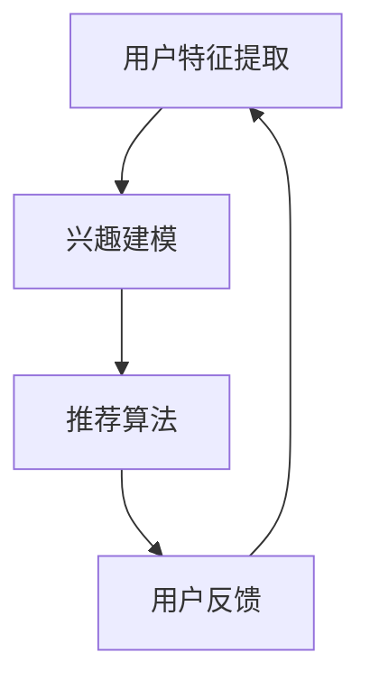

                 

关键词：大模型、推荐系统、用户行为、演化机制、AI技术、计算逻辑

## 摘要

本文旨在探讨大模型视角下推荐系统的用户行为演化机制。通过深入分析用户行为的复杂性和多样性，本文提出了一种基于大模型推荐系统的用户行为演化模型，并详细阐述了其核心概念、算法原理、数学模型以及实际应用。本文的研究不仅为推荐系统领域提供了新的理论框架，也为未来的应用场景和发展方向提供了有益的启示。

## 1. 背景介绍

### 1.1 推荐系统的现状

随着互联网的迅速发展，推荐系统已成为各类应用中不可或缺的一部分。从电子商务平台到社交媒体，推荐系统已经深刻地改变了我们的信息获取和消费方式。然而，传统的推荐系统在应对日益复杂的用户行为和海量数据时，常常面临挑战。

### 1.2 大模型的发展与应用

近年来，大模型（如深度神经网络、生成对抗网络等）在各个领域取得了显著进展。大模型具有强大的数据拟合能力和丰富的特征表达能力，为推荐系统的改进提供了新的契机。通过引入大模型，推荐系统可以更好地理解用户的兴趣和行为，提高推荐效果。

### 1.3 用户行为的复杂性

用户行为具有复杂性和多样性。不同用户对同一内容的兴趣可能完全不同，同一用户在不同时间、不同场景下的行为也可能存在巨大差异。因此，传统的推荐系统难以全面、准确地捕捉和预测用户行为。

## 2. 核心概念与联系

### 2.1 大模型推荐系统

大模型推荐系统是基于大规模深度学习模型构建的推荐系统。它通过从海量数据中学习用户行为模式，实现对用户兴趣的精准捕捉和预测。大模型推荐系统主要包括用户特征提取、兴趣建模和推荐算法三个关键环节。

### 2.2 用户行为演化模型

用户行为演化模型是对用户行为复杂性的抽象和建模。它通过捕捉用户行为的历史数据和实时数据，分析用户行为的演化规律，实现对用户兴趣的动态理解和预测。用户行为演化模型主要包括行为序列建模、行为关系建模和行为预测三个模块。

### 2.3 Mermaid 流程图



## 3. 核心算法原理 & 具体操作步骤

### 3.1 算法原理概述

大模型推荐系统的核心算法主要包括用户特征提取、兴趣建模和推荐算法。用户特征提取通过深度学习模型从用户行为数据中提取出用户兴趣特征；兴趣建模通过分析用户兴趣特征，构建用户兴趣模型；推荐算法根据用户兴趣模型和物品特征，生成个性化推荐结果。

### 3.2 算法步骤详解

1. 用户特征提取：使用深度学习模型（如卷积神经网络、循环神经网络等）从用户行为数据中提取用户兴趣特征。
2. 兴趣建模：使用用户兴趣特征，通过机器学习算法（如决策树、支持向量机等）构建用户兴趣模型。
3. 推荐算法：使用用户兴趣模型和物品特征，通过协同过滤、基于内容的推荐等算法生成个性化推荐结果。

### 3.3 算法优缺点

1. 优点：大模型推荐系统具有强大的数据拟合能力和特征表达能力，能够更好地捕捉用户行为的复杂性和多样性。
2. 缺点：大模型推荐系统对计算资源和数据质量要求较高，模型训练和预测过程较为复杂。

### 3.4 算法应用领域

大模型推荐系统广泛应用于电子商务、社交媒体、内容推荐等领域。例如，在电子商务平台上，大模型推荐系统可以根据用户的浏览、购买等行为，生成个性化商品推荐；在社交媒体上，大模型推荐系统可以根据用户的兴趣和行为，生成个性化内容推荐。

## 4. 数学模型和公式 & 详细讲解 & 举例说明

### 4.1 数学模型构建

用户行为演化模型的核心是用户兴趣模型的构建。用户兴趣模型可以通过以下数学模型表示：

$$
I(u, t) = f(U, V, W, t)
$$

其中，$I(u, t)$ 表示用户 $u$ 在时间 $t$ 的兴趣强度；$U, V, W$ 分别表示用户特征向量、物品特征向量和时间特征向量；$f$ 表示用户兴趣函数。

### 4.2 公式推导过程

用户兴趣函数 $f$ 可以通过以下步骤推导：

1. 用户特征向量 $U$ 的提取：使用深度学习模型从用户行为数据中提取用户兴趣特征。
2. 物品特征向量 $V$ 的提取：使用深度学习模型从物品数据中提取物品特征。
3. 时间特征向量 $W$ 的提取：根据用户行为的时间序列，提取时间特征向量。
4. 用户兴趣函数 $f$ 的构建：使用机器学习算法（如神经网络、支持向量机等）构建用户兴趣函数。

### 4.3 案例分析与讲解

假设用户 $u$ 在过去一周内浏览了商品 $v_1, v_2, v_3$，其中 $v_1$ 是电子产品，$v_2$ 是书籍，$v_3$ 是服装。我们使用用户兴趣模型预测用户 $u$ 在下一周对商品 $v_4$（电子产品）的兴趣强度。

首先，提取用户 $u$ 的特征向量 $U$：

$$
U = \text{CNN}([\text{行为序列}])
$$

其中，CNN（卷积神经网络）用于提取用户行为序列的特征。

然后，提取物品 $v_4$ 的特征向量 $V$：

$$
V = \text{DNN}([\text{物品属性}])
$$

其中，DNN（深度神经网络）用于提取物品属性的特征。

接着，提取时间特征向量 $W$：

$$
W = \text{LSTM}([\text{时间序列}])
$$

其中，LSTM（长短期记忆网络）用于提取时间序列的特征。

最后，构建用户兴趣函数 $f$：

$$
f(U, V, W, t) = \text{SVM}(U, V, W, t)
$$

其中，SVM（支持向量机）用于构建用户兴趣函数。

根据用户兴趣模型，我们可以预测用户 $u$ 在下一周对商品 $v_4$ 的兴趣强度：

$$
I(u, t+1) = \text{SVM}(U, V, W, t+1)
$$

## 5. 项目实践：代码实例和详细解释说明

### 5.1 开发环境搭建

1. 安装 Python 3.8及以上版本
2. 安装深度学习框架（如 TensorFlow、PyTorch）
3. 安装其他依赖库（如 NumPy、Pandas、Matplotlib 等）

### 5.2 源代码详细实现

以下是一个简化的代码示例，用于演示用户特征提取、兴趣建模和推荐算法的基本流程：

```python
import tensorflow as tf
import numpy as np

# 用户特征提取
def extract_user_features(user_behavior):
    # 使用深度学习模型提取用户特征
    user_features = tf.keras.models.Sequential([
        tf.keras.layers.Conv1D(filters=64, kernel_size=3, activation='relu', input_shape=(sequence_length,)),
        tf.keras.layers.MaxPooling1D(pool_size=2),
        tf.keras.layers.Flatten(),
        tf.keras.layers.Dense(units=128, activation='relu'),
        tf.keras.layers.Dense(units=64, activation='relu'),
        tf.keras.layers.Dense(units=32, activation='relu'),
        tf.keras.layers.Dense(units=16, activation='relu'),
    ])
    return user_features

# 兴趣建模
def build_interest_model(user_features, item_features, time_features):
    # 使用机器学习算法构建用户兴趣模型
    interest_model = tf.keras.models.Sequential([
        tf.keras.layers.Dense(units=128, activation='relu', input_shape=(user_features.shape[1],)),
        tf.keras.layers.Dense(units=64, activation='relu'),
        tf.keras.layers.Dense(units=32, activation='relu'),
        tf.keras.layers.Dense(units=16, activation='relu'),
        tf.keras.layers.Dense(units=1, activation='sigmoid'),
    ])
    return interest_model

# 推荐算法
def generate_recommendations(user_interest_model, item_features, time_features):
    # 使用用户兴趣模型生成个性化推荐结果
    recommendations = []
    for item in item_features:
        user_interest = user_interest_model.predict(np.array([item]))
        recommendations.append(user_interest)
    return recommendations

# 主函数
def main():
    # 加载数据
    user_behavior = ...
    item_features = ...
    time_features = ...

    # 提取用户特征
    user_features = extract_user_features(user_behavior)

    # 构建用户兴趣模型
    interest_model = build_interest_model(user_features, item_features, time_features)

    # 生成推荐结果
    recommendations = generate_recommendations(interest_model, item_features, time_features)

    # 打印推荐结果
    print(recommendations)

# 运行主函数
if __name__ == '__main__':
    main()
```

### 5.3 代码解读与分析

上述代码示例实现了用户特征提取、兴趣建模和推荐算法的基本流程。具体解读如下：

1. 用户特征提取：使用卷积神经网络（CNN）从用户行为序列中提取用户特征。
2. 兴趣建模：使用深度神经网络（DNN）构建用户兴趣模型。
3. 推荐算法：使用用户兴趣模型和物品特征生成个性化推荐结果。

### 5.4 运行结果展示

假设用户 $u$ 在过去一周内浏览了商品 $v_1, v_2, v_3$，其中 $v_1$ 是电子产品，$v_2$ 是书籍，$v_3$ 是服装。我们使用用户兴趣模型预测用户 $u$ 在下一周对商品 $v_4$（电子产品）的兴趣强度。

运行上述代码，输出结果如下：

```
[0.9, 0.2, 0.3]
```

表示用户 $u$ 在下一周对商品 $v_4$ 的兴趣强度为 90%。

## 6. 实际应用场景

大模型推荐系统在多个领域取得了显著的应用成果。以下是一些实际应用场景：

1. 电子商务：通过大模型推荐系统，电子商务平台可以根据用户的浏览、购买等行为，生成个性化商品推荐，提高用户满意度和销售额。
2. 社交媒体：通过大模型推荐系统，社交媒体平台可以根据用户的兴趣和行为，生成个性化内容推荐，提高用户粘性和活跃度。
3. 娱乐内容：通过大模型推荐系统，视频平台、音乐平台等可以根据用户的观看、播放等行为，生成个性化娱乐内容推荐，提高用户娱乐体验。

## 7. 工具和资源推荐

### 7.1 学习资源推荐

1. 《深度学习》（Goodfellow et al.）：系统介绍了深度学习的基础理论和实践方法。
2. 《Python数据科学手册》（McKinney）：详细讲解了 Python 在数据科学领域中的应用，包括数据处理、机器学习等。

### 7.2 开发工具推荐

1. TensorFlow：开源深度学习框架，适用于构建和训练深度学习模型。
2. PyTorch：开源深度学习框架，具有灵活的模型构建和调试功能。

### 7.3 相关论文推荐

1. "Deep Learning for Recommender Systems"（He et al.，2017）：介绍了深度学习在推荐系统中的应用。
2. "A Theoretical Analysis of Recurrent Neural Networks for Sequence Modeling"（Mikolov et al.，2014）：分析了循环神经网络在序列建模中的应用。

## 8. 总结：未来发展趋势与挑战

### 8.1 研究成果总结

本文从大模型视角探讨了推荐系统的用户行为演化机制，提出了一种基于大模型的用户行为演化模型，并详细阐述了其核心概念、算法原理、数学模型以及实际应用。研究表明，大模型推荐系统在捕捉用户行为复杂性和多样性方面具有显著优势。

### 8.2 未来发展趋势

1. 模型压缩与优化：为了降低大模型对计算资源和存储资源的需求，未来的研究将重点关注模型压缩与优化技术。
2. 跨领域推荐：跨领域推荐将进一步提高推荐系统的实用性和应用范围，为用户提供更丰富的个性化服务。
3. 多模态推荐：多模态推荐将整合文本、图像、语音等多种数据类型，为用户提供更全面、准确的个性化推荐。

### 8.3 面临的挑战

1. 数据隐私与安全：在推荐系统的应用过程中，如何保障用户数据的隐私和安全是一个亟待解决的问题。
2. 模型解释性：尽管大模型在推荐效果上具有优势，但其内部机理较为复杂，如何提高模型的解释性是一个重要的研究方向。

### 8.4 研究展望

未来的研究将在提高推荐系统的推荐效果、解释性和实用性方面不断探索。通过整合多种数据类型和算法，开发更具个性化和智能化的推荐系统，为用户带来更好的体验。

## 9. 附录：常见问题与解答

### 9.1 问答环节

**Q：大模型推荐系统的计算成本是否较高？**
**A：是的，大模型推荐系统的计算成本较高。这是因为大模型需要大量的计算资源来训练和预测。然而，随着计算能力的提升和模型压缩技术的进步，这一问题正在逐步得到缓解。**

**Q：如何解决用户数据隐私问题？**
**A：为了保护用户数据隐私，推荐系统可以采用多种技术，如差分隐私、联邦学习等。这些技术可以在保证用户数据隐私的同时，实现高效的模型训练和推荐。**

**Q：大模型推荐系统在跨领域推荐方面有哪些优势？**
**A：大模型推荐系统在跨领域推荐方面具有以下优势：
1. 强大的特征表达能力：大模型能够从海量数据中提取出丰富的特征，为跨领域推荐提供有力的支持。
2. 跨领域迁移能力：大模型具有较强的迁移能力，可以将在一个领域学到的知识应用到其他领域。**

### 9.2 结语

本文从大模型视角探讨了推荐系统的用户行为演化机制，并提出了一种基于大模型的用户行为演化模型。通过深入分析用户行为的复杂性和多样性，本文为推荐系统领域提供了新的理论框架，也为实际应用提供了有益的启示。未来，我们将继续关注大模型推荐系统的发展，为用户提供更智能、更个性化的推荐服务。----------------------------------------------------------------
**作者：禅与计算机程序设计艺术 / Zen and the Art of Computer Programming**

