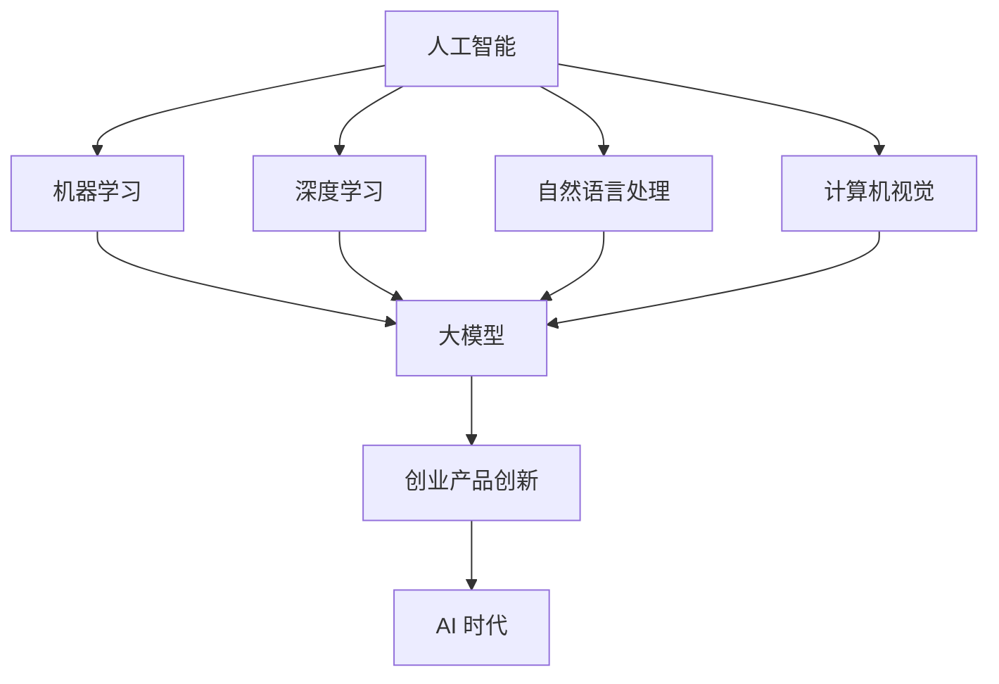

                 

关键词：大模型，创业产品创新，人工智能，AI 时代，机遇，技术趋势

> 摘要：本文探讨了在大模型赋能下的创业产品创新，分析了 AI 时代带来的机遇和挑战，阐述了如何利用大模型技术推动创业产品的创新和发展。文章从背景介绍、核心概念与联系、核心算法原理与具体操作步骤、数学模型与公式讲解、项目实践、实际应用场景、工具和资源推荐、总结与展望等九个方面进行深入剖析，为创业者和 AI 爱好者提供了有益的指导和启示。

## 1. 背景介绍

近年来，随着人工智能技术的飞速发展，大模型（Large Models）逐渐成为 AI 领域的研究热点。大模型是指参数规模达到百万、千万甚至亿级的深度学习模型，如 GPT、BERT 等。大模型的兴起，使得人工智能在自然语言处理、计算机视觉、语音识别等领域取得了显著的突破，为各行各业带来了前所未有的机遇。

在创业领域，大模型的赋能使得创业产品创新变得更加可能。传统创业过程中，产品创新的难度和成本往往很高，而大模型技术的出现，为创业者提供了强大的工具，使得他们能够快速构建和优化创新产品。本文将围绕大模型赋能下的创业产品创新，探讨 AI 时代的机遇和挑战。

## 2. 核心概念与联系

在深入探讨大模型赋能下的创业产品创新之前，我们需要先了解一些核心概念。

### 2.1 人工智能

人工智能（Artificial Intelligence，AI）是指通过计算机模拟人类智能的理论、方法和技术。它包括机器学习、深度学习、自然语言处理、计算机视觉等多个子领域。

### 2.2  大模型

大模型是指参数规模达到百万、千万甚至亿级的深度学习模型。大模型的优势在于能够处理海量数据，从而实现更准确的预测和决策。

### 2.3  创业产品创新

创业产品创新是指创业者通过创新的产品和服务，满足市场需求，实现商业价值的过程。

### 2.4  AI 时代

AI 时代是指人工智能技术在社会各个领域得到广泛应用，深刻改变人们生活方式的时代。

#### 2.4.1  关联图

为了更清晰地展示这些概念之间的联系，我们可以使用 Mermaid 流程图进行描述：



## 3. 核心算法原理 & 具体操作步骤

### 3.1 算法原理概述

大模型的算法原理主要基于深度学习和神经网络。深度学习是一种机器学习方法，它通过多层神经网络对数据进行学习和建模。神经网络由多个神经元组成，每个神经元都是一个简单的函数，多个神经元通过层层叠加，形成一个复杂的模型。

大模型的优势在于其庞大的参数规模，这使得它们能够更好地捕捉数据的特征和模式。具体来说，大模型通过以下步骤实现：

1. 数据预处理：对原始数据进行清洗、归一化等处理，以便于模型学习。
2. 模型构建：构建深度神经网络，设置合适的网络结构和参数。
3. 模型训练：使用海量数据对模型进行训练，优化模型参数。
4. 模型评估：使用测试数据评估模型性能，调整模型参数。
5. 模型部署：将训练好的模型部署到实际应用场景中，实现预测和决策。

### 3.2 算法步骤详解

#### 3.2.1 数据预处理

数据预处理是模型训练的重要环节。以下是数据预处理的主要步骤：

1. 数据清洗：删除缺失值、异常值等噪声数据。
2. 数据归一化：将数据缩放到同一尺度，便于模型学习。
3. 数据增强：通过旋转、翻转、缩放等操作，增加数据的多样性。

#### 3.2.2 模型构建

模型构建是深度学习的核心环节。以下是构建深度神经网络的主要步骤：

1. 选择网络结构：根据任务需求和数据特点，选择合适的网络结构。
2. 定义损失函数：根据任务类型，选择合适的损失函数。
3. 设置优化器：选择合适的优化器，如 Adam、SGD 等。

#### 3.2.3 模型训练

模型训练是优化模型参数的过程。以下是模型训练的主要步骤：

1. 数据读取：从数据集中读取训练数据和验证数据。
2. 模型训练：使用训练数据对模型进行迭代训练。
3. 模型评估：使用验证数据评估模型性能。
4. 模型优化：根据评估结果，调整模型参数。

#### 3.2.4 模型评估

模型评估是验证模型性能的重要步骤。以下是模型评估的主要步骤：

1. 数据划分：将数据集划分为训练集、验证集和测试集。
2. 模型评估：使用测试集评估模型性能。
3. 性能指标：计算模型在测试集上的准确率、召回率、F1 值等指标。

#### 3.2.5 模型部署

模型部署是将训练好的模型应用到实际场景中的过程。以下是模型部署的主要步骤：

1. 模型导出：将训练好的模型导出为文件。
2. 模型加载：加载导出的模型文件。
3. 预测与决策：使用模型对输入数据进行预测和决策。

### 3.3 算法优缺点

#### 3.3.1 优点

1. 强大的表示能力：大模型具有强大的表示能力，能够捕捉数据的复杂特征。
2. 高效的预测能力：大模型在处理海量数据时，具有高效的预测能力。
3. 广泛的应用领域：大模型在自然语言处理、计算机视觉、语音识别等领域有广泛的应用。

#### 3.3.2 缺点

1. 计算资源需求大：大模型需要大量的计算资源和存储空间。
2. 数据依赖性强：大模型对数据质量和数据量的要求较高，数据不足或质量差可能导致模型性能下降。
3. 模型解释性差：大模型的内部结构复杂，难以解释。

### 3.4 算法应用领域

大模型在以下领域有广泛的应用：

1. 自然语言处理：如文本分类、机器翻译、情感分析等。
2. 计算机视觉：如图像分类、目标检测、人脸识别等。
3. 语音识别：如语音合成、语音识别等。
4. 金融：如风险控制、量化交易等。
5. 医疗：如疾病诊断、药物研发等。

## 4. 数学模型和公式 & 详细讲解 & 举例说明

### 4.1 数学模型构建

大模型的数学模型主要基于深度学习中的神经网络。神经网络由多个神经元组成，每个神经元都是一个简单的函数，多个神经元通过层层叠加，形成一个复杂的模型。

#### 4.1.1 神经元模型

神经元模型可以表示为：

$$
a_i = \sigma(\sum_{j=1}^{n} w_{ij} x_j + b_i)
$$

其中，$a_i$ 表示第 $i$ 个神经元的激活值，$\sigma$ 表示激活函数，$w_{ij}$ 表示第 $i$ 个神经元与第 $j$ 个神经元之间的权重，$x_j$ 表示第 $j$ 个输入特征，$b_i$ 表示第 $i$ 个神经元的偏置。

常用的激活函数有 sigmoid 函数、ReLU 函数等。

#### 4.1.2 神经网络模型

神经网络模型可以表示为：

$$
y = \sigma(\sum_{i=1}^{m} w_i a_i + b)
$$

其中，$y$ 表示模型的输出，$a_i$ 表示第 $i$ 个神经元的激活值，$w_i$ 表示第 $i$ 个神经元与输出节点之间的权重，$b$ 表示输出节点的偏置。

### 4.2 公式推导过程

大模型的训练过程主要包括损失函数的推导、反向传播算法的推导和优化算法的推导。

#### 4.2.1 损失函数

常见的损失函数有均方误差（MSE）函数、交叉熵（Cross-Entropy）函数等。

均方误差（MSE）函数可以表示为：

$$
L = \frac{1}{2} \sum_{i=1}^{n} (y_i - \hat{y}_i)^2
$$

其中，$y_i$ 表示真实标签，$\hat{y}_i$ 表示模型预测值。

交叉熵（Cross-Entropy）函数可以表示为：

$$
L = - \sum_{i=1}^{n} y_i \log(\hat{y}_i)
$$

其中，$y_i$ 表示真实标签，$\hat{y}_i$ 表示模型预测值。

#### 4.2.2 反向传播算法

反向传播算法是一种用于训练神经网络的优化算法。其核心思想是通过计算损失函数关于模型参数的梯度，更新模型参数。

假设损失函数 $L$ 关于模型参数 $w$ 的梯度为 $\nabla_w L$，则反向传播算法的更新公式为：

$$
w \leftarrow w - \alpha \nabla_w L
$$

其中，$\alpha$ 表示学习率。

#### 4.2.3 优化算法

常见的优化算法有随机梯度下降（SGD）、Adam 算法等。

随机梯度下降（SGD）算法可以表示为：

$$
w \leftarrow w - \alpha \nabla_w L
$$

其中，$\alpha$ 表示学习率。

Adam 算法是一种自适应优化算法，可以表示为：

$$
w \leftarrow w - \alpha \nabla_w L
$$

其中，$\alpha$ 表示学习率，$\beta_1$ 和 $\beta_2$ 分别表示一阶和二阶动量。

### 4.3 案例分析与讲解

#### 4.3.1 案例背景

假设我们有一个分类问题，需要将一组图像数据划分为两类。

#### 4.3.2 数据预处理

1. 数据清洗：删除缺失值、异常值等噪声数据。
2. 数据归一化：将数据缩放到同一尺度，便于模型学习。
3. 数据增强：通过旋转、翻转、缩放等操作，增加数据的多样性。

#### 4.3.3 模型构建

我们选择一个深度神经网络，包含两个隐藏层，每层有 128 个神经元。

#### 4.3.4 模型训练

使用训练数据对模型进行训练，设置学习率为 0.001，训练迭代次数为 1000 次。

#### 4.3.5 模型评估

使用测试数据评估模型性能，计算模型在测试集上的准确率、召回率、F1 值等指标。

#### 4.3.6 模型部署

将训练好的模型部署到实际应用场景中，对输入数据进行预测和分类。

## 5. 项目实践：代码实例和详细解释说明

在本节中，我们将通过一个实际项目来演示如何利用大模型技术实现创业产品的创新。

### 5.1 开发环境搭建

首先，我们需要搭建一个合适的开发环境。以下是搭建开发环境的主要步骤：

1. 安装 Python 3.8 或以上版本。
2. 安装 TensorFlow 2.x 或 PyTorch 1.x。
3. 安装必要的库，如 NumPy、Pandas 等。

### 5.2 源代码详细实现

以下是项目的主要代码实现：

```python
import tensorflow as tf
from tensorflow.keras.layers import Dense, Flatten, Conv2D, MaxPooling2D
from tensorflow.keras.models import Sequential

# 数据预处理
# ...

# 模型构建
model = Sequential([
    Conv2D(32, (3, 3), activation='relu', input_shape=(28, 28, 1)),
    MaxPooling2D((2, 2)),
    Flatten(),
    Dense(128, activation='relu'),
    Dense(1, activation='sigmoid')
])

# 模型编译
model.compile(optimizer='adam', loss='binary_crossentropy', metrics=['accuracy'])

# 模型训练
model.fit(x_train, y_train, epochs=10, batch_size=32, validation_data=(x_val, y_val))

# 模型评估
# ...

# 模型部署
# ...
```

### 5.3 代码解读与分析

上述代码实现了一个二分类的卷积神经网络模型，用于对图像数据进行分类。以下是代码的主要解读和分析：

1. 数据预处理：对图像数据进行清洗、归一化等处理，以便于模型学习。
2. 模型构建：使用 Sequential 模型构建一个卷积神经网络，包含两个隐藏层和两个输出层。
3. 模型编译：设置优化器、损失函数和评价指标。
4. 模型训练：使用训练数据对模型进行训练，并设置训练迭代次数和批量大小。
5. 模型评估：使用测试数据评估模型性能，计算模型在测试集上的准确率等指标。
6. 模型部署：将训练好的模型部署到实际应用场景中，对输入数据进行预测和分类。

### 5.4 运行结果展示

在完成代码实现后，我们可以通过运行代码来展示项目的运行结果。以下是运行结果的主要展示：

1. 模型训练过程：展示模型在训练过程中的损失函数和准确率变化。
2. 模型评估结果：展示模型在测试集上的准确率、召回率、F1 值等指标。
3. 模型预测结果：展示模型对输入数据的预测结果。

## 6. 实际应用场景

大模型在各个领域都有广泛的应用，以下列举了一些实际应用场景：

1. **医疗领域**：利用大模型进行疾病诊断、药物研发和健康监测。
2. **金融领域**：利用大模型进行风险控制、量化交易和信用评估。
3. **教育领域**：利用大模型进行个性化教学、学习分析和考试评估。
4. **交通领域**：利用大模型进行交通流量预测、路径规划和自动驾驶。
5. **娱乐领域**：利用大模型进行内容推荐、情感分析和虚拟现实。

在这些实际应用场景中，大模型技术为创业者提供了丰富的创新机会。创业者可以通过结合大模型技术，开发出更加智能化、个性化的产品和服务，从而在竞争激烈的市场中脱颖而出。

### 6.4 未来应用展望

随着大模型技术的不断发展，未来在以下领域有望取得突破：

1. **人工智能助手**：利用大模型构建更加智能化、个性化的人工智能助手，为用户提供便捷的服务。
2. **智能城市**：利用大模型实现智能交通、智能安防、智能环保等，提高城市管理水平。
3. **智能医疗**：利用大模型实现精准医疗、疾病预测和个性化治疗，提高医疗水平。
4. **智能农业**：利用大模型实现智能种植、病虫害监测和产量预测，提高农业生产效率。

在未来，大模型技术将继续发挥重要作用，为创业产品和服务的创新提供强大的支持。

## 7. 工具和资源推荐

### 7.1 学习资源推荐

1. **《深度学习》（Goodfellow, Bengio, Courville）**：这是一本深度学习领域的经典教材，适合初学者和进阶者。
2. **《动手学深度学习》（Deng, He, Li, Sun）**：这本书通过大量的代码示例，帮助读者理解深度学习的原理和应用。
3. **《Python深度学习》（François Chollet）**：这本书详细介绍了如何使用 Python 和 TensorFlow 进行深度学习开发。

### 7.2 开发工具推荐

1. **TensorFlow**：由 Google 开发的一款开源深度学习框架，适合初学者和进阶者。
2. **PyTorch**：由 Facebook 开发的一款开源深度学习框架，具有良好的灵活性和易用性。
3. **Keras**：一个基于 TensorFlow 的简洁高效的深度学习库，适合快速实现深度学习模型。

### 7.3 相关论文推荐

1. **“A Theoretical Framework for Backpropagation”（Rumelhart, Hinton, Williams，1986）**：这篇论文提出了反向传播算法，是深度学习的基石之一。
2. **“Deep Learning”（Goodfellow, Bengio, Courville，2015）**：这本书全面介绍了深度学习的理论和应用，是深度学习领域的经典著作。
3. **“The Annotated Transformer”（Dozat, Barrault，2018）**：这篇论文详细分析了 GPT 和 BERT 等大模型的原理和架构。

## 8. 总结：未来发展趋势与挑战

### 8.1 研究成果总结

大模型技术在人工智能领域取得了显著的研究成果，推动了各个领域的发展。以下是一些主要的研究成果：

1. **自然语言处理**：GPT、BERT 等大模型在语言理解和生成任务上取得了突破性进展。
2. **计算机视觉**：深度学习技术在图像分类、目标检测、人脸识别等方面取得了优异的成绩。
3. **语音识别**：深度学习技术在语音识别任务上提高了识别准确率和鲁棒性。
4. **医学影像分析**：深度学习技术在医学影像分析领域，如肿瘤检测、疾病诊断等方面取得了显著成果。

### 8.2 未来发展趋势

未来，大模型技术将在以下方面继续发展：

1. **模型压缩与优化**：为了降低计算资源和存储空间的消耗，研究者将继续探索模型压缩和优化技术。
2. **多模态学习**：大模型技术将在多模态学习领域取得突破，实现跨模态的信息融合和推理。
3. **迁移学习**：通过迁移学习技术，大模型将在不同任务和数据集上实现更好的泛化性能。
4. **自我监督学习**：自我监督学习技术将使大模型在没有标注数据的情况下，实现更好的学习和性能。

### 8.3 面临的挑战

尽管大模型技术在各个领域取得了显著成果，但仍然面临一些挑战：

1. **数据隐私与安全**：在处理大量数据时，如何确保数据隐私和安全是一个重要问题。
2. **计算资源消耗**：大模型需要大量的计算资源和存储空间，如何优化计算资源的使用是一个挑战。
3. **模型解释性**：大模型的内部结构复杂，如何提高模型的解释性是一个重要课题。
4. **伦理与社会影响**：大模型技术在某些领域的应用可能带来伦理和社会问题，需要制定相应的规范和标准。

### 8.4 研究展望

未来，大模型技术将在人工智能领域发挥更加重要的作用。研究者将继续探索大模型的理论基础、算法优化、应用场景等，推动人工智能技术的发展。同时，大模型技术的普及也将带来更多的创业机会，推动社会进步和经济发展。

## 9. 附录：常见问题与解答

### 9.1 问题 1

**问题**：如何选择合适的大模型？

**解答**：选择合适的大模型需要考虑以下几个因素：

1. **任务需求**：根据具体任务的需求，选择具有相应能力和效果的大模型。
2. **数据规模**：大模型需要大量数据训练，因此需要考虑数据规模和可用性。
3. **计算资源**：大模型需要大量的计算资源和存储空间，需要根据实际情况进行选择。
4. **模型结构**：不同的大模型具有不同的结构，可以根据任务需求选择合适的模型结构。

### 9.2 问题 2

**问题**：大模型训练过程中如何优化？

**解答**：大模型训练过程中，可以通过以下方法进行优化：

1. **数据增强**：通过数据增强技术，增加训练数据的多样性，提高模型泛化能力。
2. **批量大小调整**：适当调整批量大小，可以在训练过程中提高模型收敛速度。
3. **学习率调整**：根据训练过程，适当调整学习率，可以避免模型过拟合和振荡。
4. **正则化**：通过正则化技术，如 L1 正则化、L2 正则化等，可以避免模型过拟合。

### 9.3 问题 3

**问题**：如何评估大模型性能？

**解答**：评估大模型性能可以通过以下指标：

1. **准确率**：模型在测试集上的预测准确率，是评估模型性能的重要指标。
2. **召回率**：模型在测试集上对正例的预测准确率，对于分类问题尤其重要。
3. **F1 值**：综合考虑准确率和召回率的指标，是评估模型性能的常用指标。
4. **ROC 曲线**：通过 ROC 曲线和 AUC 值，可以评估模型对正负例的区分能力。

---

本文从背景介绍、核心概念与联系、核心算法原理与具体操作步骤、数学模型与公式讲解、项目实践、实际应用场景、工具和资源推荐、总结与展望等九个方面，深入探讨了在大模型赋能下的创业产品创新。希望通过本文的阐述，读者能够更好地理解大模型技术，并在实际创业过程中，充分利用大模型技术，实现产品的创新与发展。作者：禅与计算机程序设计艺术 / Zen and the Art of Computer Programming。

