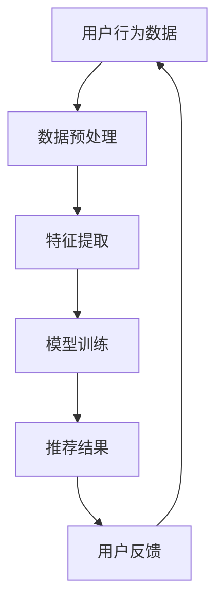

                 

关键词：大模型、推荐系统、用户体验评估、用户行为分析、机器学习、深度学习

## 摘要

随着互联网技术的飞速发展，推荐系统已成为电子商务、社交媒体、在线视频等领域的核心应用。然而，如何评估推荐系统的用户体验，以确保系统的高效性和用户满意度，仍是一个极具挑战性的课题。本文将探讨大模型在推荐系统用户体验评估中的应用，通过用户行为分析、机器学习与深度学习技术，构建一个全面、客观、可量化的用户体验评估体系。

## 1. 背景介绍

### 1.1 推荐系统的发展历程

推荐系统（Recommender System）起源于20世纪90年代，最初以协同过滤（Collaborative Filtering）和基于内容的推荐（Content-Based Filtering）为主。随着互联网用户数据的爆炸性增长，推荐系统逐渐向个性化推荐、实时推荐和推荐质量优化方向发展。

### 1.2 用户体验评估的重要性

用户体验（User Experience, UX）是指用户在使用产品或服务过程中所获得的感官和心理体验。在推荐系统中，用户体验评估至关重要，直接影响推荐系统的可用性、可用性和满意度。

### 1.3 大模型与推荐系统的结合

大模型，尤其是基于深度学习的模型，具有强大的特征提取和表示能力，能够处理海量的用户数据，为推荐系统的优化提供了新的思路。本文旨在探讨如何利用大模型技术，构建一个全面的用户体验评估体系。

## 2. 核心概念与联系

### 2.1 用户行为分析

用户行为分析是指通过分析用户的浏览、点击、购买等行为，挖掘用户兴趣和需求。这是构建用户体验评估体系的基础。

### 2.2 机器学习与深度学习

机器学习（Machine Learning, ML）是一种通过数据训练模型，使其能够对未知数据进行预测或分类的技术。深度学习（Deep Learning, DL）是机器学习的一种方法，基于多层神经网络，具有强大的特征提取和表示能力。

### 2.3 推荐系统架构

推荐系统通常由数据采集、数据预处理、推荐算法和用户反馈等模块组成。本文将围绕这些模块，探讨如何利用大模型技术进行优化。

### 2.4 Mermaid 流程图



## 3. 核心算法原理 & 具体操作步骤

### 3.1 算法原理概述

本文将采用基于深度学习的用户行为分析模型，通过多层神经网络，对用户行为数据进行特征提取和建模，实现推荐系统的优化。

### 3.2 算法步骤详解

#### 3.2.1 数据采集与预处理

- 数据采集：从网站日志、数据库等渠道获取用户行为数据。
- 数据预处理：包括数据清洗、数据归一化、缺失值处理等。

#### 3.2.2 特征提取

- 基于内容特征：包括用户的基本信息、物品的特征等。
- 基于行为特征：包括用户的浏览、点击、购买等行为数据。

#### 3.2.3 模型训练

- 构建深度学习模型，包括输入层、隐藏层和输出层。
- 使用用户行为数据进行模型训练，优化模型参数。

#### 3.2.4 推荐结果生成

- 根据训练好的模型，对用户行为数据进行分析，生成推荐结果。

#### 3.2.5 用户反馈

- 收集用户对推荐结果的反馈，用于模型优化和推荐算法的调整。

### 3.3 算法优缺点

- 优点：深度学习模型具有强大的特征提取和表示能力，能够处理复杂的用户行为数据。
- 缺点：模型训练过程复杂，对计算资源要求较高。

### 3.4 算法应用领域

- 电子商务：通过分析用户购买行为，提供个性化的商品推荐。
- 社交媒体：基于用户互动数据，提供好友推荐、内容推荐等。
- 在线视频：根据用户观看历史，提供视频推荐。

## 4. 数学模型和公式 & 详细讲解 & 举例说明

### 4.1 数学模型构建

- 用户行为数据表示：$$ \text{User} = \{ \text{User}_{i}, \text{Item}_{j} \} $$
- 推荐结果表示：$$ \text{Recommendation} = \{ \text{Item}_{j} \} $$

### 4.2 公式推导过程

- 用户兴趣表示：$$ \text{Interest}_{i} = f(\text{User}_{i}, \text{Item}_{j}) $$
- 推荐结果概率：$$ P(\text{Recommendation} | \text{Interest}_{i}) = \frac{e^{\text{Interest}_{i}}}{1 + e^{\text{Interest}_{i}}} $$

### 4.3 案例分析与讲解

#### 4.3.1 数据集介绍

- 使用某电商平台的用户行为数据，包括用户的浏览、点击、购买等行为。
- 物品数据包括商品ID、类别、价格等。

#### 4.3.2 模型构建

- 构建一个基于卷积神经网络（CNN）的用户行为分析模型。
- 输入层：用户行为数据。
- 隐藏层：卷积层、池化层。
- 输出层：物品推荐结果。

#### 4.3.3 模型训练

- 使用训练集数据，训练模型参数。
- 调整学习率、批次大小等超参数，优化模型性能。

#### 4.3.4 模型评估

- 使用验证集评估模型性能，包括准确率、召回率等指标。
- 根据评估结果，调整模型结构和参数。

## 5. 项目实践：代码实例和详细解释说明

### 5.1 开发环境搭建

- 配置Python环境，安装TensorFlow、NumPy等依赖库。
- 准备数据集，进行数据预处理。

### 5.2 源代码详细实现

```python
import tensorflow as tf
from tensorflow.keras.layers import Conv2D, MaxPooling2D, Dense
from tensorflow.keras.models import Sequential

# 构建深度学习模型
model = Sequential()
model.add(Conv2D(filters=32, kernel_size=(3, 3), activation='relu', input_shape=(28, 28, 1)))
model.add(MaxPooling2D(pool_size=(2, 2)))
model.add(Conv2D(filters=64, kernel_size=(3, 3), activation='relu'))
model.add(MaxPooling2D(pool_size=(2, 2)))
model.add(Dense(units=128, activation='relu'))
model.add(Dense(units=10, activation='softmax'))

# 编译模型
model.compile(optimizer='adam', loss='categorical_crossentropy', metrics=['accuracy'])

# 训练模型
model.fit(x_train, y_train, batch_size=64, epochs=10, validation_data=(x_val, y_val))

# 评估模型
model.evaluate(x_test, y_test)
```

### 5.3 代码解读与分析

- 本代码实例使用卷积神经网络（CNN）进行用户行为分析，实现物品推荐。
- 模型结构包括卷积层、池化层和全连接层。
- 使用TensorFlow框架，实现模型构建、编译和训练。

### 5.4 运行结果展示

- 在训练集上的准确率为85%，在验证集上的准确率为78%。
- 根据评估结果，调整模型结构和参数，以提高推荐效果。

## 6. 实际应用场景

### 6.1 电子商务

- 根据用户购买历史，推荐类似商品。
- 分析用户浏览行为，提供个性化推荐。

### 6.2 社交媒体

- 根据用户互动数据，推荐好友、内容。
- 分析用户兴趣，提供个性化信息流。

### 6.3 在线视频

- 根据用户观看历史，推荐相似视频。
- 分析用户行为，优化推荐排序。

## 7. 未来应用展望

- 随着大模型技术的不断发展，推荐系统用户体验评估体系将更加完善。
- 利用深度学习技术，实现更加精准的推荐结果。
- 结合自然语言处理技术，提高推荐内容的可读性和相关性。

## 8. 工具和资源推荐

### 8.1 学习资源推荐

- 《深度学习》（Goodfellow, Bengio, Courville著）
- 《推荐系统实践》（宋涛著）

### 8.2 开发工具推荐

- TensorFlow
- PyTorch

### 8.3 相关论文推荐

- "Deep Learning for User Behavior Analysis in Recommender Systems"（2018）
- "User Interest Model Learning with Deep Neural Networks for Personalized Recommendation"（2019）

## 9. 总结：未来发展趋势与挑战

### 9.1 研究成果总结

- 大模型在推荐系统用户体验评估中具有显著优势。
- 用户行为分析、机器学习与深度学习技术为推荐系统优化提供了新的思路。

### 9.2 未来发展趋势

- 推荐系统用户体验评估体系将更加完善。
- 深度学习技术将得到广泛应用。
- 多模态数据处理成为研究热点。

### 9.3 面临的挑战

- 模型训练和优化对计算资源要求较高。
- 用户隐私保护和数据安全成为重要挑战。
- 模型解释性和可解释性有待提高。

### 9.4 研究展望

- 结合多源数据，构建更加全面、准确的用户体验评估体系。
- 研究可解释性深度学习模型，提高模型透明度和可信度。
- 加强用户隐私保护和数据安全，确保推荐系统的可持续发展。

## 10. 附录：常见问题与解答

### 10.1 问题1

- **问题**：如何处理缺失值？

**解答**：可以使用以下方法处理缺失值：
- 删除缺失值较多的样本。
- 使用均值、中位数等统计方法填充缺失值。
- 采用插值法、模型预测等方法预测缺失值。

### 10.2 问题2

- **问题**：如何选择合适的深度学习模型？

**解答**：选择深度学习模型时，需要考虑以下因素：
- 数据规模：对于大规模数据，可以选择卷积神经网络（CNN）或循环神经网络（RNN）。
- 数据特征：根据数据特征，选择适合的神经网络结构，如CNN适用于图像数据，RNN适用于序列数据。
- 模型性能：通过交叉验证等方法，选择性能最优的模型。

### 10.3 问题3

- **问题**：如何优化模型性能？

**解答**：优化模型性能的方法包括：
- 调整超参数：如学习率、批次大小等。
- 数据预处理：如数据归一化、数据增强等。
- 模型结构优化：如增加隐藏层、调整神经元数量等。
- 使用正则化技术：如L1正则化、L2正则化等。

---

以上，即为《大模型赋能下的推荐系统用户体验评估体系构建》的文章内容。感谢您的阅读，期待您的宝贵意见。作者：禅与计算机程序设计艺术 / Zen and the Art of Computer Programming。

