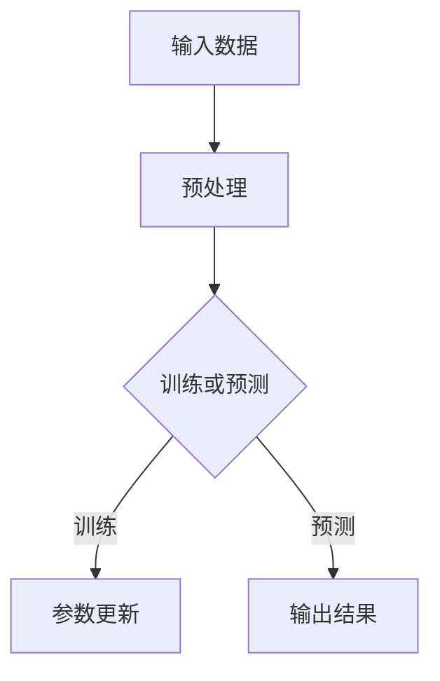

                 

关键词：大模型、传统行业、AI创业、数字化转型

摘要：随着人工智能技术的快速发展，大模型成为推动传统行业转型的重要力量。本文将探讨大模型在传统行业中的应用，分析其技术原理，并探讨AI创业的新蓝海。

## 1. 背景介绍

近年来，人工智能技术取得了显著进展，特别是在深度学习领域，大模型（如GPT、BERT等）的出现，极大地提高了机器学习模型的性能。传统行业如金融、医疗、制造等，开始意识到人工智能的巨大潜力，纷纷寻求数字化转型。

## 2. 核心概念与联系

### 2.1 大模型原理

大模型是指拥有数十亿甚至千亿参数的神经网络模型。通过大量的数据训练，大模型可以学习到复杂的特征，从而在各个领域实现高性能的预测和决策。

### 2.2 大模型架构


**Mermaid 流程图：**



## 3. 核心算法原理 & 具体操作步骤

### 3.1 算法原理概述

大模型的核心是深度神经网络，通过多层非线性变换，实现对数据的复杂映射。

### 3.2 算法步骤详解

1. **数据预处理**：对输入数据进行清洗、归一化等处理。
2. **模型构建**：选择合适的神经网络架构，如Transformer、CNN等。
3. **训练过程**：通过反向传播算法，更新模型参数，优化模型性能。
4. **预测过程**：使用训练好的模型，对新的数据进行预测。

### 3.3 算法优缺点

**优点**：

- **高精度**：大模型通过大量数据训练，可以学习到复杂特征，提高预测精度。
- **泛化能力**：大模型具有较好的泛化能力，可以应用于不同领域。

**缺点**：

- **计算资源消耗**：大模型需要大量计算资源，训练时间较长。
- **数据依赖**：大模型对数据质量有较高要求，数据不足或质量差会影响模型性能。

### 3.4 算法应用领域

大模型在图像识别、自然语言处理、推荐系统等领域具有广泛应用。

## 4. 数学模型和公式

### 4.1 数学模型构建

大模型的数学基础是深度神经网络，主要包括神经元、权重、激活函数等。

### 4.2 公式推导过程

$$
\text{输出} = \text{激活函数}(\sum_{i=1}^{n} w_i \cdot x_i)
$$

### 4.3 案例分析与讲解

以GPT-3为例，其数学模型可以表示为：

$$
\text{输出} = \text{激活函数}(\sum_{i=1}^{n} w_i \cdot \text{输入})
$$

其中，$w_i$为权重，$x_i$为输入特征。

## 5. 项目实践：代码实例

### 5.1 开发环境搭建

- Python环境
- TensorFlow或PyTorch框架

### 5.2 源代码详细实现

```python
import tensorflow as tf

model = tf.keras.Sequential([
    tf.keras.layers.Dense(units=128, activation='relu', input_shape=(784,)),
    tf.keras.layers.Dense(units=10, activation='softmax')
])

model.compile(optimizer='adam',
              loss='categorical_crossentropy',
              metrics=['accuracy'])

model.fit(x_train, y_train, epochs=5, batch_size=32)
```

### 5.3 代码解读与分析

以上代码实现了简单的深度神经网络，用于分类任务。通过训练，模型可以学会对新的数据进行分类。

### 5.4 运行结果展示

训练完成后，可以使用以下代码评估模型性能：

```python
test_loss, test_acc = model.evaluate(x_test, y_test)
print(f"Test accuracy: {test_acc}")
```

## 6. 实际应用场景

大模型在金融、医疗、制造等行业具有广泛应用。例如，在金融领域，大模型可以用于风险控制、信用评估；在医疗领域，大模型可以用于疾病诊断、药物研发。

## 7. 工具和资源推荐

### 7.1 学习资源推荐

- 《深度学习》（Goodfellow et al.）
- 《神经网络与深度学习》（邱锡鹏）

### 7.2 开发工具推荐

- TensorFlow
- PyTorch

### 7.3 相关论文推荐

- "Attention Is All You Need"
- "BERT: Pre-training of Deep Bidirectional Transformers for Language Understanding"

## 8. 总结：未来发展趋势与挑战

### 8.1 研究成果总结

大模型在各个领域取得了显著成果，推动了传统行业的数字化转型。

### 8.2 未来发展趋势

大模型将朝着更高精度、更高效、更泛化的方向发展。

### 8.3 面临的挑战

- **计算资源**：大模型对计算资源要求较高，需要优化算法和硬件。
- **数据隐私**：数据安全和隐私保护是重要挑战。

### 8.4 研究展望

大模型将继续在各个领域发挥重要作用，推动人工智能的发展。

## 9. 附录：常见问题与解答

### 9.1 大模型为什么需要大量数据？

大模型通过大量数据学习复杂的特征，提高模型的泛化能力。

### 9.2 大模型是否一定会导致过拟合？

适当的数据预处理和正则化方法可以降低过拟合的风险。

---

作者：禅与计算机程序设计艺术 / Zen and the Art of Computer Programming
----------------------------------------------------------------


