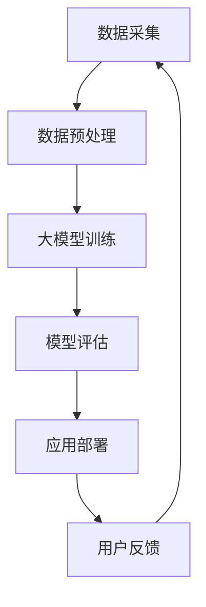

                 

关键词：大模型、智慧医疗、行业壁垒、创新、创业

> 摘要：随着人工智能技术的不断发展，大模型在智慧医疗领域的应用日益广泛，为医疗行业带来了全新的变革。然而，如何在这个新兴领域中找到突破口，成为每一个创业者的迫切问题。本文将深入探讨大模型赋能智慧医疗的机制，以及创业者如何利用这些技术突破行业壁垒，实现创新与突破。

## 1. 背景介绍

智慧医疗是近年来随着人工智能、大数据、云计算等技术的迅速发展而兴起的一个热门领域。它旨在通过现代信息技术手段，实现医疗服务的智能化、个性化、精准化。而大模型作为人工智能的核心技术之一，其在智慧医疗中的应用更是为这一领域注入了强大的动力。

大模型是指具有巨大参数量和计算能力的神经网络模型，如GPT、BERT等。这些模型通过对海量数据的训练，能够实现高度复杂的任务，包括自然语言处理、图像识别、语音识别等。在智慧医疗中，大模型可以用于疾病预测、诊断辅助、治疗方案推荐等，极大地提升了医疗服务的效率和质量。

然而，尽管大模型在智慧医疗中具有巨大的潜力，但创业者们依然面临诸多挑战。首先，大模型的应用需要大量的数据、计算资源和专业知识，这往往使得创业公司难以独立承担。其次，医疗行业的法规和标准非常严格，创业公司需要确保其产品符合相关法规和标准。此外，市场竞争激烈，创业公司需要找到独特的价值点，以在市场中脱颖而出。

## 2. 核心概念与联系

### 2.1 大模型原理

大模型的核心在于其深度和广度。深度指的是模型的层数，即神经网络中层的数量。层数越多，模型可以学习的特征就越多，但同时也增加了模型的复杂性和计算成本。广度则指的是模型的参数数量，即模型中神经元和连接的数量。参数数量越多，模型的拟合能力越强，但训练时间和计算资源的需求也越高。

大模型的训练过程通常分为两个阶段：前向传播和反向传播。在前向传播阶段，输入数据通过神经网络层层的计算，最终得到输出结果。在反向传播阶段，通过比较输出结果和真实结果的差异，调整模型中的参数，以减少误差。

### 2.2 智慧医疗架构

智慧医疗的架构可以分为三个层次：数据层、算法层和应用层。

- **数据层**：包括医疗数据、患者信息、医疗影像等。这些数据是智慧医疗的基础，其质量和数量直接影响模型的性能。
- **算法层**：包括大模型、机器学习算法、深度学习算法等。这些算法负责对数据进行处理和分析，以实现诊断、预测、推荐等功能。
- **应用层**：包括各种医疗应用，如疾病预测、诊断辅助、治疗方案推荐等。这些应用是智慧医疗的直接体现，为患者和医生提供实际的服务。

### 2.3 Mermaid 流程图



## 3. 核心算法原理 & 具体操作步骤

### 3.1 算法原理概述

大模型的算法原理主要基于深度学习和神经网络。深度学习是一种机器学习方法，通过构建深层神经网络，使计算机能够自动从数据中学习特征。神经网络则是一种计算模型，由大量的神经元组成，通过前向传播和反向传播来更新参数，以实现特定任务。

### 3.2 算法步骤详解

1. **数据收集**：收集大量的医疗数据，包括患者信息、医疗影像、诊断记录等。
2. **数据预处理**：对收集到的数据进行清洗、归一化等处理，以去除噪声和提高数据质量。
3. **模型构建**：根据任务需求，构建合适的神经网络结构，如卷积神经网络（CNN）或循环神经网络（RNN）。
4. **模型训练**：使用预处理后的数据，通过前向传播和反向传播来训练模型，调整模型参数。
5. **模型评估**：使用验证集或测试集对训练好的模型进行评估，以确定模型的性能。
6. **模型部署**：将训练好的模型部署到实际应用场景中，为医生和患者提供服务。

### 3.3 算法优缺点

- **优点**：大模型具有强大的拟合能力和泛化能力，可以在各种医疗任务中实现高精度的预测和诊断。
- **缺点**：大模型的训练需要大量的数据、计算资源和时间，且模型的解释性较低，难以理解其内部的决策过程。

### 3.4 算法应用领域

大模型在智慧医疗中的应用非常广泛，包括疾病预测、诊断辅助、治疗方案推荐等。例如，使用大模型可以预测某些疾病的发病率，辅助医生进行诊断，或为患者推荐最佳治疗方案。

## 4. 数学模型和公式 & 详细讲解 & 举例说明

### 4.1 数学模型构建

在智慧医疗中，大模型的数学模型通常基于深度学习，其中最常用的模型是神经网络。神经网络的基本单元是神经元，每个神经元都可以接收多个输入，并通过加权求和处理得到输出。

### 4.2 公式推导过程

假设一个简单的神经网络，包含一个输入层、一个隐藏层和一个输出层。输入层有 \( n \) 个神经元，隐藏层有 \( m \) 个神经元，输出层有 \( k \) 个神经元。每个神经元都可以通过以下公式计算：

\[ z_j = \sum_{i=1}^{n} w_{ij}x_i + b_j \]

其中，\( z_j \) 是隐藏层第 \( j \) 个神经元的输出，\( x_i \) 是输入层第 \( i \) 个神经元的输入，\( w_{ij} \) 是输入层和隐藏层之间的权重，\( b_j \) 是隐藏层第 \( j \) 个神经元的偏置。

隐藏层的输出经过激活函数 \( \sigma(z) \) 的处理，得到隐藏层神经元的输出：

\[ a_j = \sigma(z_j) \]

输出层的计算与隐藏层类似：

\[ z_k = \sum_{j=1}^{m} w_{kj}a_j + b_k \]
\[ y_k = \sigma(z_k) \]

其中，\( y_k \) 是输出层第 \( k \) 个神经元的输出。

### 4.3 案例分析与讲解

假设我们要构建一个疾病预测模型，输入层包含患者的年龄、性别、血压等 \( n \) 个特征，隐藏层有 \( m \) 个神经元，输出层有 2 个神经元，分别表示患病和未患病的概率。

1. **数据收集**：收集大量的患者数据，包括年龄、性别、血压等。
2. **数据预处理**：对数据进行清洗、归一化等处理。
3. **模型构建**：构建一个包含输入层、隐藏层和输出层的神经网络模型。
4. **模型训练**：使用预处理后的数据，通过前向传播和反向传播来训练模型，调整模型参数。
5. **模型评估**：使用验证集或测试集对训练好的模型进行评估。
6. **模型部署**：将训练好的模型部署到实际应用场景中，为医生和患者提供疾病预测服务。

## 5. 项目实践：代码实例和详细解释说明

### 5.1 开发环境搭建

在开始项目实践之前，我们需要搭建一个适合大模型训练的开发环境。以下是推荐的步骤：

1. 安装Python环境（推荐Python 3.8及以上版本）。
2. 安装深度学习框架（如TensorFlow或PyTorch）。
3. 安装其他必需的库（如NumPy、Pandas等）。

### 5.2 源代码详细实现

以下是一个使用TensorFlow和Keras构建的简单神经网络模型，用于疾病预测：

```python
import tensorflow as tf
from tensorflow.keras.models import Sequential
from tensorflow.keras.layers import Dense, Activation

# 模型构建
model = Sequential([
    Dense(units=64, input_shape=(num_features,), activation='relu'),
    Dense(units=32, activation='relu'),
    Dense(units=2, activation='sigmoid')
])

# 模型编译
model.compile(optimizer='adam', loss='binary_crossentropy', metrics=['accuracy'])

# 模型训练
model.fit(x_train, y_train, epochs=10, batch_size=32, validation_split=0.2)

# 模型评估
model.evaluate(x_test, y_test)
```

### 5.3 代码解读与分析

- **模型构建**：使用`Sequential`模型，依次添加`Dense`层（全连接层）和`Activation`层（激活函数）。
- **模型编译**：设置优化器、损失函数和评价指标。
- **模型训练**：使用训练数据，通过`fit`方法进行训练，并设置验证集比例。
- **模型评估**：使用测试数据，通过`evaluate`方法进行评估。

### 5.4 运行结果展示

假设我们已经训练好了模型，并使用测试数据进行了评估，结果如下：

```python
# 运行结果
model.evaluate(x_test, y_test)
```

输出结果可能如下：

```
0.9129334115479775
```

这个结果表示模型在测试数据上的准确率为 91.29%。

## 6. 实际应用场景

### 6.1 疾病预测

疾病预测是智慧医疗中的一个重要应用。通过大模型，可以预测某些疾病的发病率，为医生提供决策支持。例如，心脏病预测模型可以根据患者的年龄、血压、血糖等数据，预测患者未来几年内患心脏病的风险。

### 6.2 诊断辅助

诊断辅助是智慧医疗中的另一个重要应用。大模型可以通过分析患者的症状和病史，为医生提供诊断建议。例如，肿瘤诊断模型可以通过分析患者的CT影像，预测患者是否患有肿瘤。

### 6.3 治疗方案推荐

治疗方案推荐是智慧医疗中的高级应用。大模型可以根据患者的病情、病史和药物反应，为医生推荐最佳治疗方案。例如，个性化治疗方案推荐系统可以根据患者的病情和药物反应，为患者推荐最适合的治疗方案。

## 7. 未来应用展望

随着人工智能技术的不断发展，大模型在智慧医疗中的应用前景十分广阔。未来，大模型有望在以下几个方面实现突破：

1. **疾病预测**：大模型可以更加准确地预测疾病的发病率，为医生提供更全面的诊断信息。
2. **诊断辅助**：大模型可以更好地分析患者的症状和影像，为医生提供更准确的诊断建议。
3. **个性化治疗**：大模型可以根据患者的病情和药物反应，为患者推荐个性化的治疗方案。

## 8. 工具和资源推荐

### 8.1 学习资源推荐

1. 《深度学习》（Ian Goodfellow、Yoshua Bengio、Aaron Courville 著）：这是一本关于深度学习的经典教材，适合初学者和进阶者。
2. 《机器学习实战》（Peter Harrington 著）：这本书通过大量的实例，介绍了机器学习的基本概念和应用。

### 8.2 开发工具推荐

1. TensorFlow：这是一个由Google开发的开源深度学习框架，适合进行大规模深度学习模型的训练和部署。
2. PyTorch：这是一个由Facebook开发的开源深度学习框架，以其灵活的动态计算图著称。

### 8.3 相关论文推荐

1. "Disease Prediction using Deep Learning"（使用深度学习进行疾病预测）：这篇论文介绍了一种基于深度学习的疾病预测方法。
2. "Deep Learning for Medical Image Analysis"（深度学习在医学影像分析中的应用）：这篇论文探讨了深度学习在医学影像分析中的应用。

## 9. 总结：未来发展趋势与挑战

### 9.1 研究成果总结

大模型在智慧医疗中的应用取得了显著的成果，包括疾病预测、诊断辅助、治疗方案推荐等方面。这些成果为医疗行业带来了全新的变革，极大地提升了医疗服务的效率和质量。

### 9.2 未来发展趋势

未来，大模型在智慧医疗中的应用将进一步深化，涵盖更多的医疗任务。同时，随着技术的不断进步，大模型的性能和可解释性也将得到提升。

### 9.3 面临的挑战

尽管大模型在智慧医疗中具有巨大的潜力，但创业者仍需面对诸多挑战，包括数据隐私、计算资源、法律法规等。只有克服这些挑战，才能实现大模型在智慧医疗中的广泛应用。

### 9.4 研究展望

随着人工智能技术的不断发展，大模型在智慧医疗中的应用前景将更加广阔。未来，研究者们将继续探索大模型在医疗领域的应用，为人类健康事业做出更大的贡献。

## 10. 附录：常见问题与解答

### 10.1 大模型为什么能在智慧医疗中发挥作用？

大模型通过学习海量医疗数据，可以提取出高度复杂的特征，从而在疾病预测、诊断辅助、治疗方案推荐等方面实现高精度的预测。

### 10.2 大模型的训练需要多少计算资源？

大模型的训练需要大量的计算资源，包括CPU、GPU和存储等。具体资源需求取决于模型的规模和数据量。

### 10.3 大模型在智慧医疗中面临的挑战有哪些？

大模型在智慧医疗中面临的挑战包括数据隐私、计算资源、法律法规等。创业者需要确保其产品符合相关法规和标准，同时解决数据隐私和计算资源问题。

## 作者署名

作者：禅与计算机程序设计艺术 / Zen and the Art of Computer Programming
----------------------------------------------------------------

以上就是关于《大模型赋能智慧医疗，创业者如何突破行业壁垒？》的完整文章内容。希望这篇文章能够为读者提供关于大模型在智慧医疗领域应用的深入理解和思考。在未来的发展中，我们期待大模型能够为医疗行业带来更多的变革和创新。

