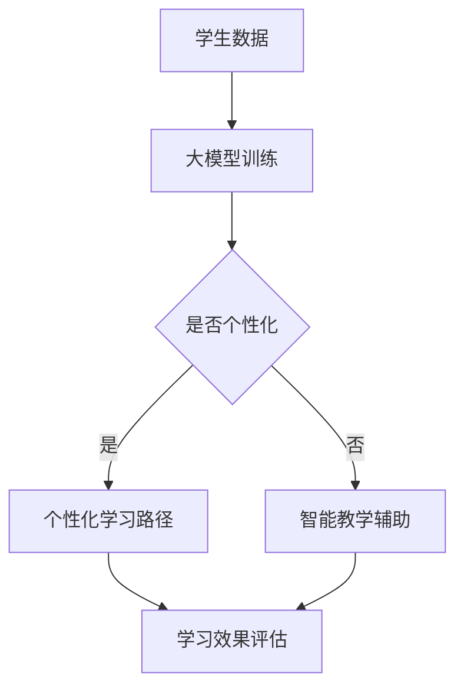

                 

关键词：大模型，智慧教育，个性化教育，智能化教育，创业者，教育技术，人工智能

摘要：随着人工智能技术的飞速发展，大模型在各个领域的应用愈发广泛。在智慧教育领域，大模型正逐渐成为赋能教育个性化与智能化的关键力量。本文将探讨大模型在智慧教育中的重要作用，分析创业者如何利用大模型技术推动教育个性化与智能化，并提出相关建议。

## 1. 背景介绍

### 大模型的概念与发展

大模型，是指那些具有数亿甚至千亿级参数的深度学习模型。近年来，随着计算能力的提升和大数据的积累，大模型在图像识别、自然语言处理、语音识别等领域的表现已经超越了人类。大模型通过大规模数据训练，能够捕捉到数据中的复杂模式，实现更高的准确率和效率。

### 智慧教育的定义与需求

智慧教育，是指利用现代信息技术，尤其是人工智能技术，为教育过程提供智能化支持。个性化教育、智能化教学、自适应学习等都是智慧教育的核心概念。随着教育需求的多样化，如何实现教育资源的合理分配和教学效率的提升，成为智慧教育需要解决的重要问题。

### 创业者在智慧教育中的角色

在智慧教育的发展过程中，创业者扮演着至关重要的角色。他们不仅能够发现和满足教育市场的需求，还能够通过技术创新推动整个教育体系的变革。创业者的成功经验对于其他创业者和教育机构都有很大的启示作用。

## 2. 核心概念与联系

### 大模型在教育中的应用

大模型在教育中的应用主要体现在以下几个方面：

1. **个性化学习**：通过分析学生的学习数据，大模型可以为学生提供个性化的学习路径和资源推荐。
2. **智能教学**：大模型可以辅助教师进行教学内容的设计和教学过程的管理，提高教学效率。
3. **智能评估**：大模型可以对学生的考试成绩和学习表现进行智能分析，提供更为精准的评估结果。

### 教育个性化与智能化的关系

教育个性化与智能化是相辅相成的。个性化教育需要智能化技术的支持，而智能化教育则是实现个性化教育的重要手段。通过大模型等智能化技术，可以更好地满足学生个性化的学习需求，实现教育的个性化与智能化。

### Mermaid 流程图



## 3. 核心算法原理 & 具体操作步骤

### 3.1 算法原理概述

大模型在教育中的应用主要依赖于深度学习技术。深度学习通过多层神经网络，从大量数据中自动提取特征，实现数据的自动标注和分类。在教育领域，深度学习可以用于学生行为分析、教学内容生成、学习效果评估等。

### 3.2 算法步骤详解

1. **数据收集**：收集学生的各类学习数据，包括学习日志、考试记录、课堂表现等。
2. **数据预处理**：对收集到的数据进行清洗、去噪、归一化等处理，使其适合模型训练。
3. **模型训练**：使用预处理后的数据，训练深度学习模型，模型通常包括输入层、隐藏层和输出层。
4. **模型评估**：使用验证数据集评估模型的性能，调整模型参数以优化性能。
5. **应用部署**：将训练好的模型部署到实际应用环境中，为学生提供个性化学习支持和智能教学辅助。

### 3.3 算法优缺点

**优点**：

1. **高准确率**：大模型能够从大量数据中提取有效特征，提高模型的预测和分类能力。
2. **自适应性强**：大模型可以根据学生的学习行为和学习效果，自动调整学习路径和资源推荐。
3. **高效性**：大模型能够快速处理大量数据，提高教学和评估的效率。

**缺点**：

1. **计算资源需求高**：大模型训练需要大量的计算资源和时间。
2. **数据隐私问题**：学生在使用过程中产生的数据可能涉及隐私问题，需要严格保护。
3. **模型解释性差**：大模型通常缺乏可解释性，难以理解其内部决策过程。

### 3.4 算法应用领域

大模型在教育领域的应用非常广泛，包括：

1. **自适应学习系统**：通过分析学生的学习行为，为学生提供个性化的学习资源。
2. **智能评估系统**：对学生的考试成绩和学习效果进行智能分析，提供精准的评估报告。
3. **智能教学辅助系统**：辅助教师进行教学内容设计和教学过程管理。

## 4. 数学模型和公式 & 详细讲解 & 举例说明

### 4.1 数学模型构建

在教育领域，常用的数学模型包括线性回归模型、决策树模型、支持向量机模型等。其中，线性回归模型是最基本的模型之一。

$$
y = \beta_0 + \beta_1x_1 + \beta_2x_2 + ... + \beta_nx_n
$$

其中，$y$ 为因变量，$x_1, x_2, ..., x_n$ 为自变量，$\beta_0, \beta_1, ..., \beta_n$ 为模型参数。

### 4.2 公式推导过程

线性回归模型的推导过程主要包括以下几个步骤：

1. **假设**：假设因变量$y$和自变量$x_1, x_2, ..., x_n$之间存在线性关系。
2. **构建损失函数**：定义损失函数，通常使用均方误差（MSE）。
3. **求导与优化**：对损失函数求导，得到最优解。
4. **参数估计**：使用最小二乘法或其他优化算法，估计模型参数。

### 4.3 案例分析与讲解

假设我们有一组学生的考试成绩和学习时间数据，我们想要构建一个线性回归模型，预测学生的考试成绩。

1. **数据收集**：收集学生的考试成绩和学习时间数据。
2. **数据预处理**：对数据进行清洗、去噪、归一化等处理。
3. **模型构建**：使用线性回归模型，定义损失函数为均方误差。
4. **模型训练**：使用训练数据训练模型，调整模型参数。
5. **模型评估**：使用验证数据集评估模型性能，调整模型参数。
6. **应用部署**：将训练好的模型部署到实际应用环境中，预测学生的考试成绩。

## 5. 项目实践：代码实例和详细解释说明

### 5.1 开发环境搭建

在本项目中，我们使用 Python 编写代码，并使用 Scikit-learn 库进行模型训练和评估。

1. 安装 Python（推荐使用 Python 3.8 以上版本）。
2. 安装 Scikit-learn 库：`pip install scikit-learn`。

### 5.2 源代码详细实现

```python
import numpy as np
from sklearn.linear_model import LinearRegression
from sklearn.model_selection import train_test_split
from sklearn.metrics import mean_squared_error

# 数据收集
X = np.array([[1, 2], [2, 3], [3, 4], [4, 5]])
y = np.array([2, 3, 4, 5])

# 数据预处理
X_train, X_test, y_train, y_test = train_test_split(X, y, test_size=0.2, random_state=42)

# 模型构建
model = LinearRegression()

# 模型训练
model.fit(X_train, y_train)

# 模型评估
y_pred = model.predict(X_test)
mse = mean_squared_error(y_test, y_pred)
print("均方误差：", mse)

# 应用部署
print("预测结果：", y_pred)
```

### 5.3 代码解读与分析

1. **数据收集**：我们从一组简单的学生考试成绩和学习时间数据开始。
2. **数据预处理**：使用 Scikit-learn 库中的 `train_test_split` 函数将数据集划分为训练集和测试集。
3. **模型构建**：使用 Scikit-learn 库中的 `LinearRegression` 类创建线性回归模型。
4. **模型训练**：使用 `fit` 方法训练模型，调整模型参数。
5. **模型评估**：使用 `mean_squared_error` 函数计算均方误差，评估模型性能。
6. **应用部署**：将训练好的模型用于实际预测，输出预测结果。

## 6. 实际应用场景

### 6.1 自适应学习系统

自适应学习系统是教育领域的一个重要应用，通过分析学生的学习行为，为学生提供个性化的学习资源。例如，学生在一门课程中表现不佳，系统可以推荐相关的基础课程和练习题，帮助学生巩固知识。

### 6.2 智能教学辅助系统

智能教学辅助系统可以帮助教师进行教学内容的设计和教学过程的管理。例如，系统可以根据学生的学习进度和成绩，自动生成教学计划和练习题，提高教学效率。

### 6.3 智能评估系统

智能评估系统可以对学生的考试成绩和学习效果进行智能分析，提供精准的评估报告。例如，系统可以分析学生的考试错误类型，为教师提供教学改进建议。

## 7. 未来应用展望

随着人工智能技术的不断发展，大模型在智慧教育中的应用前景非常广阔。未来，我们可以期待以下应用：

1. **个性化学习路径生成**：通过分析学生的学习行为和学习效果，大模型可以为学生生成个性化的学习路径，实现更高效的学习。
2. **智能教学内容的生成**：大模型可以自动生成教学视频、习题和答案，为教师提供更多的教学资源。
3. **智能教育平台的构建**：大模型可以与教育平台相结合，为学生提供个性化的学习体验，实现智慧教育的全面覆盖。

## 8. 工具和资源推荐

### 8.1 学习资源推荐

1. **《深度学习》（Goodfellow et al.）**：一本经典的深度学习入门教材。
2. **《Python数据科学手册》（McKinney）**：一本关于 Python 数据科学的综合指南。

### 8.2 开发工具推荐

1. **Jupyter Notebook**：一款强大的交互式开发环境。
2. **TensorFlow**：一款开源的深度学习框架。

### 8.3 相关论文推荐

1. **"Deep Learning for Natural Language Processing"**：一篇关于深度学习在自然语言处理领域应用的综述。
2. **"Deep Learning in Education: A Survey"**：一篇关于深度学习在教育领域应用的综述。

## 9. 总结：未来发展趋势与挑战

### 9.1 研究成果总结

大模型在智慧教育领域的应用已经取得了显著成果，个性化学习、智能教学和智能评估等方面都得到了广泛应用。

### 9.2 未来发展趋势

未来，大模型在教育领域的应用将更加深入和广泛，有望实现更高效、更智能的教育体验。

### 9.3 面临的挑战

1. **数据隐私问题**：如何在确保数据安全的前提下，充分发挥大模型的作用，是一个亟待解决的问题。
2. **计算资源需求**：大模型训练需要大量的计算资源和时间，如何优化计算效率，也是一个重要的挑战。

### 9.4 研究展望

未来，我们期待大模型能够更好地满足教育个性化与智能化的需求，为教育行业带来更多创新和变革。

## 附录：常见问题与解答

### 1. 大模型在教育中的应用有哪些？

大模型在教育中的应用主要包括个性化学习、智能教学和智能评估等方面。

### 2. 如何保证大模型在教育中的应用安全？

可以通过数据加密、访问控制等技术手段，确保学生在使用过程中的数据安全。

### 3. 大模型的训练需要多长时间？

大模型的训练时间取决于数据规模、模型复杂度和计算资源。一般来说，大规模数据训练可能需要数天甚至数周。

## 作者署名

作者：禅与计算机程序设计艺术 / Zen and the Art of Computer Programming
----------------------------------------------------------------

以上就是关于《大模型赋能智慧教育，创业者如何推动教育个性化与智能化？》的文章，希望对您有所帮助。如果您有任何问题或建议，欢迎在评论区留言。感谢您的阅读！


