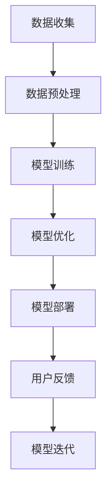

                 

关键词：大模型、智慧社区、AI、创业、技术应用、创新、数字化转型、人工智能赋能、可持续发展

> 摘要：随着人工智能技术的迅猛发展，大模型在各个领域的应用越来越广泛，特别是在智慧社区的建设中，大模型正成为推动社区数字化转型和提升居民生活质量的重要力量。本文将从大模型的核心概念、技术原理、应用案例等多个角度，探讨创业者如何利用大模型赋能智慧社区，实现美好生活的愿景。

## 1. 背景介绍

智慧社区是现代城市化进程中的一种新型社区形态，它以信息技术为支撑，通过物联网、云计算、大数据等先进技术，实现社区服务、治理、安全、环保等多个方面的智能化。智慧社区的建设，不仅能够提升居民的生活品质，还能有效提高社区管理效率，降低管理成本。

### 1.1 人工智能与智慧社区

人工智能（AI）作为当前科技发展的重要方向，正在深刻改变我们的生活和工作方式。大模型（Large Models）是人工智能领域的一个重要研究方向，它们具有强大的数据处理和分析能力，能够为智慧社区提供智能化的解决方案。

### 1.2  大模型的定义与作用

大模型指的是那些具有海量参数、可以处理大规模数据的人工神经网络模型。它们通常具有自学习、自适应和自优化能力，能够在没有明确编程的情况下，从海量数据中自动学习和发现规律。

在智慧社区中，大模型可以应用于多种场景，如智能安防、智慧家居、社区服务、环境监测等，通过提供个性化、智能化的服务，提升社区居民的生活质量。

## 2. 核心概念与联系

### 2.1  大模型的工作原理

大模型通常是基于深度学习（Deep Learning）技术构建的。深度学习是一种模拟人脑神经网络结构和学习方式的机器学习（Machine Learning）方法。大模型通过多层神经网络的结构，逐步提取数据中的特征，从而实现对复杂问题的建模和预测。

### 2.2  大模型在智慧社区中的应用架构

在智慧社区中，大模型的应用架构通常包括以下几个核心部分：

1. **数据收集与预处理**：通过传感器、摄像头等设备，收集社区的各种数据，并进行预处理，以便于模型训练。
2. **模型训练与优化**：使用收集到的数据，训练大模型，并进行优化，使其能够更好地适应社区的实际需求。
3. **模型部署与维护**：将训练好的模型部署到社区的服务器或边缘设备上，提供实时、高效的智能服务。
4. **用户反馈与迭代**：根据用户的反馈，持续优化模型，提高其性能和用户体验。

### 2.3  Mermaid 流程图



## 3. 核心算法原理 & 具体操作步骤

### 3.1  算法原理概述

大模型的算法原理主要基于深度学习和神经网络。深度学习通过多层神经网络结构，对输入数据进行特征提取和变换，从而实现复杂的预测和分类任务。

### 3.2  算法步骤详解

1. **数据收集**：收集社区的各种数据，如环境数据、行为数据、社会数据等。
2. **数据预处理**：对收集到的数据进行分析、清洗和标准化，为模型训练做好准备。
3. **模型训练**：使用预处理后的数据，对大模型进行训练，调整模型参数，使其能够对社区数据进行准确预测。
4. **模型优化**：根据训练结果，对模型进行优化，提高其预测准确性和效率。
5. **模型部署**：将训练好的模型部署到社区的服务器或边缘设备上，提供智能服务。
6. **用户反馈**：收集用户的反馈数据，对模型进行持续优化。

### 3.3  算法优缺点

**优点**：

- **强大的数据处理能力**：大模型能够处理大规模、复杂的数据，从而提供更准确的预测和决策。
- **自适应性强**：大模型能够根据用户反馈和数据变化，自动调整模型参数，提高性能。
- **高效性**：大模型通过并行计算和分布式训练，能够快速处理海量数据，提供实时服务。

**缺点**：

- **数据依赖性强**：大模型的训练和性能依赖于大量高质量的数据，数据缺乏或不准确会导致模型性能下降。
- **计算资源消耗大**：大模型的训练和部署需要大量的计算资源和存储空间。

### 3.4  算法应用领域

大模型在智慧社区的应用领域非常广泛，包括但不限于：

- **智能安防**：通过视频监控和传感器数据，实时监测社区安全状况，预防犯罪事件。
- **智慧家居**：为居民提供个性化的智能家居服务，如智能照明、智能安防、智能家电控制等。
- **社区服务**：提供智能化的社区服务，如在线医疗咨询、教育资源共享、社区活动推荐等。
- **环境监测**：通过传感器网络，实时监测社区环境质量，提供环保建议和措施。

## 4. 数学模型和公式 & 详细讲解 & 举例说明

### 4.1  数学模型构建

在构建大模型时，常用的数学模型包括神经网络模型、生成对抗网络（GAN）模型、强化学习模型等。

### 4.2  公式推导过程

以神经网络模型为例，其基本公式为：

$$
\text{Output} = \sigma(\text{Weight} \cdot \text{Input} + \text{Bias})
$$

其中，$\sigma$表示激活函数，$\text{Weight}$和$\text{Bias}$分别表示权重和偏置。

### 4.3  案例分析与讲解

以一个简单的智能安防系统为例，该系统通过摄像头监控社区安全状况，当检测到可疑行为时，系统会自动发出警报。

1. **数据收集**：收集社区视频数据，对视频进行预处理，提取关键帧和特征。
2. **模型训练**：使用预处理后的视频数据，训练神经网络模型，使其能够识别可疑行为。
3. **模型部署**：将训练好的模型部署到摄像头中，实时监控社区安全状况。
4. **用户反馈**：根据用户的反馈，对模型进行优化，提高其识别准确性。

## 5. 项目实践：代码实例和详细解释说明

### 5.1  开发环境搭建

1. **安装 Python 环境**：安装 Python 3.8 以上版本。
2. **安装深度学习库**：安装 TensorFlow 或 PyTorch 等深度学习库。
3. **准备数据集**：收集社区视频数据，并进行预处理。

### 5.2  源代码详细实现

以下是一个使用 TensorFlow 框架实现的智能安防系统的代码示例：

```python
import tensorflow as tf
from tensorflow.keras.models import Sequential
from tensorflow.keras.layers import Conv2D, MaxPooling2D, Flatten, Dense

# 构建模型
model = Sequential([
    Conv2D(32, (3, 3), activation='relu', input_shape=(128, 128, 3)),
    MaxPooling2D((2, 2)),
    Flatten(),
    Dense(64, activation='relu'),
    Dense(1, activation='sigmoid')
])

# 编译模型
model.compile(optimizer='adam', loss='binary_crossentropy', metrics=['accuracy'])

# 训练模型
model.fit(x_train, y_train, epochs=10, batch_size=32)

# 部署模型
model.save('security_system.h5')
```

### 5.3  代码解读与分析

这段代码首先导入了 TensorFlow 框架，并定义了一个简单的卷积神经网络（CNN）模型。该模型包括两个卷积层、一个池化层和一个全连接层。编译模型时，使用二进制交叉熵损失函数和 Adam 优化器。训练模型时，使用训练数据集进行 10 个周期的训练。

### 5.4  运行结果展示

在运行代码后，模型将被保存为“security_system.h5”文件。这个模型可以用于实时监控社区安全状况，并在检测到可疑行为时发出警报。

## 6. 实际应用场景

### 6.1  智能安防

智能安防是智慧社区中最常见的应用场景之一。通过摄像头和传感器，实时监控社区安全状况，预防犯罪事件。

### 6.2  智慧家居

智慧家居通过物联网技术，将家电设备连接起来，提供智能化的家居生活体验，如智能照明、智能安防、智能家电控制等。

### 6.3  社区服务

智慧社区提供智能化的社区服务，如在线医疗咨询、教育资源共享、社区活动推荐等，提升居民的生活质量。

### 6.4  未来应用展望

随着人工智能技术的不断发展，大模型在智慧社区中的应用将更加广泛。未来，大模型有望在社区治理、环境保护、社会服务等领域发挥更大的作用，为居民打造更加美好的生活环境。

## 7. 工具和资源推荐

### 7.1  学习资源推荐

- 《深度学习》（Goodfellow, Bengio, Courville 著）
- 《Python 深度学习》（François Chollet 著）
- 《TensorFlow 实战》（Michael Hennessy 著）

### 7.2  开发工具推荐

- TensorFlow
- PyTorch
- Keras

### 7.3  相关论文推荐

- "Deep Learning for Security Applications"
- "Generative Adversarial Nets"
- "Reinforcement Learning: An Introduction"

## 8. 总结：未来发展趋势与挑战

### 8.1  研究成果总结

随着人工智能技术的快速发展，大模型在智慧社区中的应用已经取得了显著成果。通过大模型，智慧社区能够提供更加智能化、个性化的服务，提升居民的生活质量。

### 8.2  未来发展趋势

未来，大模型在智慧社区的应用将更加广泛，包括但不限于社区治理、环境保护、社会服务等领域。同时，随着计算能力的提升和数据量的增加，大模型的性能和效果将得到进一步提升。

### 8.3  面临的挑战

尽管大模型在智慧社区中具有巨大的应用潜力，但仍然面临着一些挑战，如数据隐私保护、计算资源消耗、算法可解释性等。

### 8.4  研究展望

未来，研究者需要关注大模型的算法优化、应用拓展、隐私保护等方面，以推动大模型在智慧社区中的应用，为居民打造更加美好的生活环境。

## 9. 附录：常见问题与解答

### 9.1  什么是大模型？

大模型指的是那些具有海量参数、可以处理大规模数据的人工神经网络模型。它们通常具有自学习、自适应和自优化能力，能够从海量数据中自动学习和发现规律。

### 9.2  大模型有哪些应用领域？

大模型在多个领域具有广泛应用，包括但不限于智能安防、智慧家居、社区服务、环境监测等。

### 9.3  大模型的优缺点是什么？

大模型优点包括强大的数据处理能力、自适应性强和高效性；缺点包括数据依赖性强和计算资源消耗大。

### 9.4  如何实现大模型的部署？

实现大模型的部署需要以下几个步骤：数据收集与预处理、模型训练与优化、模型部署与维护、用户反馈与迭代。

## 10. 结论

大模型作为人工智能领域的重要研究方向，正在为智慧社区的建设提供强有力的支持。创业者可以通过运用大模型，实现社区服务智能化、个性化，为居民打造美好生活。同时，我们也要关注大模型应用中的挑战，不断优化算法和模型，推动智慧社区的发展。

### 作者署名

本文作者：禅与计算机程序设计艺术 / Zen and the Art of Computer Programming

----------------------------------------------------------------

