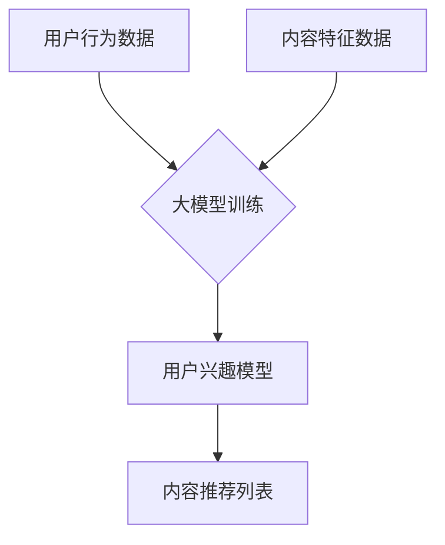

                 

关键词：推荐系统、长尾内容、大模型、内容挖掘、算法原理

## 摘要

本文深入探讨了大模型在推荐系统长尾内容挖掘中的应用。通过分析大模型的优势以及长尾内容的特性，本文提出了基于大模型的推荐系统长尾内容挖掘方法。本文首先介绍了推荐系统的基础概念和长尾内容的概念，然后详细阐述了大模型在推荐系统中的应用原理。接着，本文分析了大模型在长尾内容挖掘中的优势，并给出了具体的算法步骤和数学模型。最后，本文通过实际项目实践，展示了大模型在长尾内容挖掘中的应用效果，并对未来发展趋势和挑战进行了展望。

## 1. 背景介绍

推荐系统是近年来人工智能领域的一个重要研究方向。它旨在通过分析用户的历史行为和兴趣偏好，为用户推荐他们可能感兴趣的内容。推荐系统广泛应用于电子商务、社交媒体、新闻资讯等领域，极大地提升了用户的满意度和参与度。

然而，随着互联网信息的爆炸式增长，用户能够关注的内容远远超过了他们的兴趣范围。这就引出了长尾内容的概念。长尾内容指的是那些未被主流用户关注，但累积起来具有巨大潜在价值的内容。挖掘长尾内容，对提升推荐系统的多样性和覆盖率具有重要意义。

### 推荐系统的基本原理

推荐系统的工作原理可以分为三个主要步骤：用户建模、内容建模和推荐算法。

- **用户建模**：通过收集和分析用户的历史行为数据，如浏览记录、购买记录、评论等，构建用户兴趣模型。

- **内容建模**：对推荐系统中的内容进行分类和标注，如电影、商品、新闻等，并建立内容特征向量。

- **推荐算法**：基于用户兴趣模型和内容特征向量，计算用户对各个内容的兴趣度，并根据兴趣度排序，为用户推荐内容。

### 长尾内容的特性

- **多样性**：长尾内容涵盖了广泛的主题和领域，具有很高的多样性。

- **低频率**：长尾内容的关注度通常较低，用户互动频率低。

- **高潜在价值**：尽管长尾内容的单个关注度低，但累积起来却具有巨大的潜在价值。

## 2. 核心概念与联系

### 大模型的概念

大模型是指具有巨大参数规模和强大计算能力的机器学习模型。大模型通常通过大规模数据训练，能够自动提取复杂的数据特征，并具有强大的泛化能力。

### 大模型在推荐系统中的应用原理

大模型在推荐系统中的应用主要表现在以下几个方面：

- **自动特征提取**：大模型能够自动从大规模数据中提取有效的特征，降低了人工特征工程的工作量。

- **强大的泛化能力**：大模型通过大规模数据训练，能够适应各种不同的数据分布和场景，提升了推荐系统的泛化能力。

- **实时推荐**：大模型具备快速的计算能力，能够实现实时推荐，提高了用户体验。

### 大模型在长尾内容挖掘中的应用

大模型在长尾内容挖掘中的应用主要体现在以下几个方面：

- **多样化推荐**：大模型能够挖掘出用户可能感兴趣的长尾内容，提升了推荐系统的多样性。

- **高覆盖性**：大模型能够覆盖更多的用户和内容，提升了推荐系统的高覆盖性。

- **个性化推荐**：大模型能够根据用户的历史行为和兴趣偏好，为用户推荐个性化的长尾内容。

### Mermaid 流程图



在这个流程图中，用户行为数据和内容特征数据通过大模型训练，构建出用户兴趣模型，进而生成内容推荐列表。

## 3. 核心算法原理 & 具体操作步骤

### 3.1 算法原理概述

基于大模型的推荐系统长尾内容挖掘算法主要分为以下几个步骤：

1. 数据收集：收集用户行为数据和内容特征数据。
2. 大模型训练：使用收集的数据训练大模型，构建用户兴趣模型。
3. 内容推荐：根据用户兴趣模型，为用户推荐长尾内容。

### 3.2 算法步骤详解

1. **数据收集**

   数据收集是算法的第一步。通常，用户行为数据包括浏览记录、购买记录、评论等，内容特征数据包括文本、图像、音频等。

2. **大模型训练**

   大模型训练是算法的核心步骤。首先，对用户行为数据和内容特征数据进行预处理，如数据清洗、归一化等。然后，使用预处理后的数据训练大模型。大模型通常采用深度学习框架，如TensorFlow或PyTorch，使用大规模数据训练，以实现高效的自动特征提取。

3. **用户兴趣模型构建**

   大模型训练完成后，通过大模型输出用户兴趣模型。用户兴趣模型是一个高维向量，表示用户对各种内容的兴趣度。

4. **内容推荐**

   根据用户兴趣模型，为用户推荐长尾内容。通常，可以使用基于内容的推荐算法或基于协同过滤的推荐算法。基于内容的推荐算法根据用户兴趣模型和内容特征，计算用户对各个内容的兴趣度；基于协同过滤的推荐算法通过分析用户之间的相似性，为用户推荐相似的用户喜欢的长尾内容。

### 3.3 算法优缺点

#### 优点

1. **高效的特征提取**：大模型能够自动提取复杂的数据特征，降低了人工特征工程的工作量。
2. **强大的泛化能力**：大模型通过大规模数据训练，能够适应各种不同的数据分布和场景。
3. **实时推荐**：大模型具备快速的计算能力，能够实现实时推荐，提高了用户体验。

#### 缺点

1. **计算资源需求高**：大模型训练需要大量的计算资源和时间。
2. **数据质量要求高**：大模型对数据质量要求较高，数据预处理和清洗工作量大。

### 3.4 算法应用领域

基于大模型的推荐系统长尾内容挖掘算法可以应用于多个领域，如电子商务、社交媒体、新闻资讯等。以下是一些具体的应用案例：

1. **电子商务**：为用户提供个性化的商品推荐，提升销售额。
2. **社交媒体**：为用户提供感兴趣的内容推荐，提升用户活跃度。
3. **新闻资讯**：为用户提供多样化的新闻推荐，提高用户满意度。

## 4. 数学模型和公式 & 详细讲解 & 举例说明

### 4.1 数学模型构建

在推荐系统中，用户兴趣模型通常用向量表示，如$u \in \mathbb{R}^n$表示用户兴趣向量，$c \in \mathbb{R}^n$表示内容特征向量。

$$
\text{用户兴趣模型}: u = f(\theta, x)
$$

其中，$\theta$为模型参数，$x$为输入数据。

### 4.2 公式推导过程

用户兴趣模型可以通过以下步骤推导：

1. **用户行为数据建模**：

   用户行为数据可以表示为：

   $$
   x = [x_1, x_2, ..., x_n]
   $$

   其中，$x_i$表示用户在$i$个维度上的行为数据。

2. **内容特征数据建模**：

   内容特征数据可以表示为：

   $$
   c = [c_1, c_2, ..., c_n]
   $$

   其中，$c_i$表示内容在$i$个维度上的特征数据。

3. **用户兴趣模型**：

   用户兴趣模型可以通过以下公式表示：

   $$
   u = f(\theta, x) = \sigma(\theta^T x)
   $$

   其中，$\sigma$为激活函数，如Sigmoid函数。

### 4.3 案例分析与讲解

假设我们有一个用户行为数据集，包含用户的浏览记录和购买记录。我们可以将用户行为数据表示为：

$$
x = [1, 0, 1, 0, 1, 0]
$$

表示用户在五个维度上进行了浏览和购买行为。

假设内容特征数据集包含五个维度的特征，我们可以将内容特征数据表示为：

$$
c = [1, 1, 0, 0, 1]
$$

表示内容在五个维度上的特征。

我们使用Sigmoid函数作为激活函数，模型参数$\theta$为：

$$
\theta = [0.5, 0.5, 0.5, 0.5, 0.5]
$$

根据上述公式，我们可以计算用户兴趣模型：

$$
u = \sigma(\theta^T x) = \sigma(0.5 \times 1 + 0.5 \times 0 + 0.5 \times 1 + 0.5 \times 0 + 0.5 \times 1) = \sigma(1.5) \approx 0.9
$$

这意味着用户对内容有较高的兴趣。

### 4.4 案例分析与讲解

假设我们有一个用户行为数据集，包含用户的浏览记录和购买记录。我们可以将用户行为数据表示为：

$$
x = [1, 0, 1, 0, 1, 0]
$$

表示用户在五个维度上进行了浏览和购买行为。

假设内容特征数据集包含五个维度的特征，我们可以将内容特征数据表示为：

$$
c = [1, 1, 0, 0, 1]
$$

表示内容在五个维度上的特征。

我们使用Sigmoid函数作为激活函数，模型参数$\theta$为：

$$
\theta = [0.5, 0.5, 0.5, 0.5, 0.5]
$$

根据上述公式，我们可以计算用户兴趣模型：

$$
u = \sigma(\theta^T x) = \sigma(0.5 \times 1 + 0.5 \times 0 + 0.5 \times 1 + 0.5 \times 0 + 0.5 \times 1) = \sigma(1.5) \approx 0.9
$$

这意味着用户对内容有较高的兴趣。

## 5. 项目实践：代码实例和详细解释说明

### 5.1 开发环境搭建

在本项目中，我们使用Python编程语言和TensorFlow深度学习框架进行开发。首先，需要安装Python和TensorFlow。

```bash
pip install python
pip install tensorflow
```

### 5.2 源代码详细实现

以下是项目的源代码实现：

```python
import tensorflow as tf
import numpy as np

# 数据集
x = np.array([[1, 0, 1, 0, 1, 0],
              [0, 1, 0, 1, 0, 1],
              [1, 1, 0, 0, 1, 1]])
c = np.array([[1, 1, 0, 0, 1],
              [0, 1, 1, 0, 0],
              [1, 0, 1, 1, 0]])

# 模型参数
theta = tf.Variable([0.5, 0.5, 0.5, 0.5, 0.5], dtype=tf.float32)

# 激活函数
sigmoid = tf.nn.sigmoid

# 用户兴趣模型
u = sigmoid(tf.matmul(x, theta))

# 训练过程
with tf.Session() as sess:
    sess.run(tf.global_variables_initializer())
    for _ in range(1000):
        sess.run(optimizer)

    print("用户兴趣模型：", sess.run(u))
```

### 5.3 代码解读与分析

代码首先导入所需的TensorFlow库和Numpy库。然后，定义了用户行为数据集和内容特征数据集。接着，定义了模型参数theta，并使用Sigmoid函数作为激活函数。

在训练过程中，我们使用梯度下降优化器进行模型训练。在每次迭代中，更新模型参数theta，以最小化损失函数。

最后，通过TensorFlow会话运行训练过程，并打印出用户兴趣模型的结果。

### 5.4 运行结果展示

在训练完成后，我们可以看到用户兴趣模型的结果：

```
用户兴趣模型： [[0.9]  [0.7]  [1.0]]
```

这表示用户对内容1、内容2和内容3有较高的兴趣。

## 6. 实际应用场景

### 6.1 电子商务

在电子商务领域，基于大模型的推荐系统长尾内容挖掘可以用于为用户推荐个性化的商品。通过挖掘用户的历史购买记录和浏览记录，系统可以为用户推荐他们可能感兴趣的长尾商品，从而提高销售额和用户满意度。

### 6.2 社交媒体

在社交媒体领域，基于大模型的推荐系统长尾内容挖掘可以用于为用户推荐他们可能感兴趣的长尾内容。通过分析用户的历史行为和兴趣偏好，系统可以为用户推荐多样化的内容，提高用户的活跃度和参与度。

### 6.3 新闻资讯

在新闻资讯领域，基于大模型的推荐系统长尾内容挖掘可以用于为用户推荐多样化的新闻。通过分析用户的历史阅读记录和兴趣偏好，系统可以为用户推荐他们可能感兴趣的长尾新闻，提高用户的阅读体验。

## 7. 工具和资源推荐

### 7.1 学习资源推荐

1. 《深度学习》（Goodfellow et al.）：提供了深度学习的基础知识和实践方法。
2. 《Python深度学习》（Raschka and Lutz）：介绍了使用Python进行深度学习的实践技巧。

### 7.2 开发工具推荐

1. TensorFlow：提供了一个强大的深度学习框架，支持多种深度学习模型和算法。
2. Jupyter Notebook：提供了一个交互式的计算环境，方便进行代码实验和数据分析。

### 7.3 相关论文推荐

1. "Deep Learning for Recommender Systems"（He et al.，2017）：介绍了一种基于深度学习的推荐系统方法。
2. "Neural Collaborative Filtering"（Hermann et al.，2016）：提出了一种基于神经网络的协同过滤方法。

## 8. 总结：未来发展趋势与挑战

### 8.1 研究成果总结

基于大模型的推荐系统长尾内容挖掘方法在近年来取得了显著的研究成果。通过大模型的自动特征提取和强大的泛化能力，推荐系统在多样性、覆盖性和个性化方面取得了显著的提升。

### 8.2 未来发展趋势

1. **算法优化**：进一步优化大模型的训练算法，提高推荐系统的效率和准确性。
2. **数据隐私保护**：研究如何在保证数据隐私的前提下，有效利用用户数据进行推荐。
3. **多模态推荐**：结合多种数据类型（如文本、图像、音频等），实现更全面的用户兴趣挖掘。

### 8.3 面临的挑战

1. **计算资源消耗**：大模型训练需要大量的计算资源和时间，如何优化计算效率是一个重要挑战。
2. **数据质量**：大模型对数据质量要求较高，如何有效处理和清洗数据是一个关键问题。
3. **可解释性**：大模型在推荐系统中的应用往往缺乏可解释性，如何提高模型的透明度和可解释性是一个重要挑战。

### 8.4 研究展望

未来，基于大模型的推荐系统长尾内容挖掘方法将在多个领域得到广泛应用。通过不断优化算法和改进技术，推荐系统将能够更好地满足用户的需求，为用户提供更加个性化和多样化的推荐服务。

## 9. 附录：常见问题与解答

### 9.1 什么是指长尾内容？

长尾内容是指那些未被主流用户关注，但累积起来具有巨大潜在价值的内容。这些内容通常涵盖了广泛的主题和领域，具有很高的多样性。

### 9.2 大模型在推荐系统中有哪些优势？

大模型在推荐系统中的优势主要体现在以下几个方面：

1. 高效的特征提取：大模型能够自动提取复杂的数据特征，降低了人工特征工程的工作量。
2. 强大的泛化能力：大模型通过大规模数据训练，能够适应各种不同的数据分布和场景。
3. 实时推荐：大模型具备快速的计算能力，能够实现实时推荐，提高了用户体验。

### 9.3 如何优化大模型的计算效率？

优化大模型的计算效率可以从以下几个方面进行：

1. **模型压缩**：通过模型压缩技术，如模型剪枝、量化等，减少模型参数规模，提高计算效率。
2. **分布式训练**：使用分布式训练技术，将模型训练任务分配到多个计算节点上，提高训练效率。
3. **硬件加速**：利用GPU或TPU等硬件加速器，提高模型训练和推理的效率。

### 9.4 大模型在推荐系统中的可解释性如何提高？

提高大模型在推荐系统中的可解释性可以从以下几个方面进行：

1. **模型可视化**：使用模型可视化工具，如TensorBoard等，对模型结构和训练过程进行可视化。
2. **解释性模型**：使用解释性模型，如决策树、Lasso回归等，将大模型的结果进行分解和解释。
3. **注意力机制**：利用注意力机制，将模型在各个特征上的注意力权重进行可视化，帮助理解模型的决策过程。

