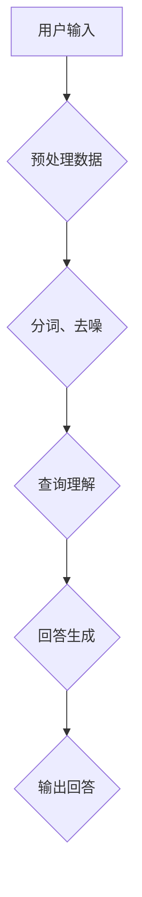

                 

在当今信息爆炸的时代，人工智能的应用已经渗透到了我们生活的方方面面。大模型问答机器人作为人工智能领域的一项重要进展，正迅速成为企业和个人获取信息、提升工作效率的重要工具。本文将深入探讨大模型问答机器人的任务处理，从背景介绍、核心概念与联系、核心算法原理、数学模型和公式、项目实践以及未来应用展望等方面进行全面剖析，旨在为读者提供一份全面且深入的技术指南。

## 1. 背景介绍

### 大模型问答机器人概述

大模型问答机器人是一种基于深度学习的人工智能系统，通过训练大规模语言模型，能够理解用户的问题并给出准确、合理的回答。这种机器人不同于传统的关键词匹配或简单逻辑推理，而是能够利用自然语言处理（NLP）技术，从大量文本数据中提取知识，并进行复杂的语义理解和推理。

### 发展历程

大模型问答机器人的发展可以追溯到20世纪90年代。随着互联网的普及和大数据技术的发展，机器学习技术取得了显著的进步。尤其是深度学习技术的崛起，为构建强大、灵活的问答系统提供了技术支持。2018年，谷歌发布了BERT（Bidirectional Encoder Representations from Transformers），标志着大模型问答技术进入了一个新的阶段。

### 应用领域

大模型问答机器人在各个领域都有着广泛的应用。在客户服务中，问答机器人能够提供24/7的在线支持，提高客户满意度；在医疗健康领域，问答机器人可以帮助患者获取疾病信息和治疗方案；在教育领域，问答机器人可以作为智能辅导系统，为学生提供个性化的学习建议。

## 2. 核心概念与联系

### 大模型问答系统的组成部分

一个典型的大模型问答系统主要包括以下几个关键组成部分：

- **数据预处理**：包括文本清洗、分词、去噪等步骤，确保输入数据的质量和一致性。
- **模型训练**：使用大量的文本数据进行模型训练，使模型能够学习到语言的内在规律和语义知识。
- **查询理解**：将用户的问题转化为模型可以处理的输入格式，进行语义分析和意图识别。
- **回答生成**：根据问题的语义和上下文信息，从知识库或预训练模型中生成合理的回答。

### Mermaid 流程图

以下是一个简化的Mermaid流程图，展示了大模型问答系统的基本流程：



### 各部分之间的关系

- **预处理数据**：确保输入文本的质量，提高模型的训练效果。
- **查询理解**：理解用户问题的意图和语义，是生成准确回答的前提。
- **回答生成**：根据理解和推理结果，生成自然、合理的回答。

## 3. 核心算法原理 & 具体操作步骤

### 3.1 算法原理概述

大模型问答系统的核心算法通常是基于Transformer架构的预训练语言模型，如BERT、GPT等。这些模型通过大量的文本数据进行预训练，学习到语言的普遍规律和语义知识，然后在特定任务上进行微调。

### 3.2 算法步骤详解

- **预训练阶段**：使用大规模文本数据进行无监督学习，训练模型的基础参数。
- **微调阶段**：在特定任务上，使用少量有标注的数据对模型进行微调，使其适应特定应用场景。
- **查询理解**：将用户的问题编码成模型的输入，通过模型的编码器层提取语义特征。
- **回答生成**：利用解码器层生成回答，通过解码得到的输出序列，将候选答案映射到实际回答。

### 3.3 算法优缺点

- **优点**：
  - 强大的语义理解能力，能够处理复杂的自然语言问题。
  - 预训练模型具有通用性，可以迁移到不同的任务上。
  - 可以生成自然、流畅的回答。

- **缺点**：
  - 需要大量的计算资源和时间进行预训练。
  - 对数据的依赖性较强，数据质量和多样性对模型性能有重要影响。
  - 在某些任务上，模型的回答可能不够准确或合理。

### 3.4 算法应用领域

大模型问答系统在以下领域具有广泛的应用：

- **客户服务**：提供24/7的在线支持，提高客户满意度。
- **医疗健康**：帮助患者获取疾病信息和治疗方案。
- **教育**：作为智能辅导系统，为学生提供个性化学习建议。
- **法律咨询**：提供法律知识问答，辅助法律从业人员工作。

## 4. 数学模型和公式 & 详细讲解 & 举例说明

### 4.1 数学模型构建

大模型问答系统的核心是基于Transformer架构的预训练语言模型。Transformer模型主要由编码器（Encoder）和解码器（Decoder）两个部分组成。编码器将输入序列编码为固定长度的向量表示，解码器则根据这些向量表示生成输出序列。

### 4.2 公式推导过程

- **编码器**：

  编码器的主要任务是接收输入序列，将其编码为固定长度的向量表示。假设输入序列为\( x_1, x_2, ..., x_T \)，其中\( x_i \)为第\( i \)个输入词，编码后的向量表示为\( h_i \)。编码器的基本公式为：

  $$ h_i = \text{Encoder}(x_i) $$

- **解码器**：

  解码器的主要任务是生成输出序列，根据输入序列和上下文信息生成合理的回答。假设输出序列为\( y_1, y_2, ..., y_T \)，其中\( y_i \)为第\( i \)个输出词，解码后的向量表示为\( g_i \)。解码器的基本公式为：

  $$ g_i = \text{Decoder}(h_i, y_{<i}) $$

### 4.3 案例分析与讲解

假设我们有一个大模型问答系统，用户输入了一个问题：“如何治疗失眠？”系统通过编码器和解码器，生成一个合理的回答。

1. **编码器处理输入**：

   编码器将输入序列“如何治疗失眠？”编码为向量表示，得到一组编码向量\( h_1, h_2, ..., h_T \)。

2. **解码器生成回答**：

   解码器从编码向量\( h_1, h_2, ..., h_T \)中提取信息，并生成输出序列。首先，解码器生成一个初始输出词\( g_1 \)，然后根据\( g_1 \)和编码向量\( h_1 \)生成下一个输出词\( g_2 \)，以此类推，直到生成完整的回答。

   最终，解码器输出的序列为：“您可以尝试以下方法来治疗失眠：保持规律的作息时间，避免在睡前使用电子设备，保持舒适的睡眠环境等。”

## 5. 项目实践：代码实例和详细解释说明

### 5.1 开发环境搭建

为了实现大模型问答系统，我们需要搭建一个合适的开发环境。以下是一个简单的环境搭建指南：

- **Python环境**：安装Python 3.7及以上版本。
- **深度学习框架**：安装TensorFlow 2.0及以上版本。
- **数据处理库**：安装Numpy、Pandas等数据处理库。
- **文本处理库**：安装NLTK、spaCy等文本处理库。

### 5.2 源代码详细实现

以下是一个简化的大模型问答系统的代码实现示例：

```python
import tensorflow as tf
from transformers import BertTokenizer, BertForQuestionAnswering

# 加载预训练的BERT模型
tokenizer = BertTokenizer.from_pretrained('bert-base-uncased')
model = BertForQuestionAnswering.from_pretrained('bert-base-uncased')

# 用户输入问题
question = "如何治疗失眠？"

# 对问题进行编码
input_ids = tokenizer.encode(question, add_special_tokens=True, return_tensors='tf')

# 预测答案
outputs = model(input_ids)

# 提取答案
answer_start = tf.argmax(outputs.start_logits, axis=-1)
answer_end = tf.argmax(outputs.end_logits, axis=-1)

# 解码答案
answer = tokenizer.decode(input_ids[int(answer_start.numpy()[0]):int(answer_end.numpy()[0]) + 1], skip_special_tokens=True)

print("系统回答：", answer)
```

### 5.3 代码解读与分析

1. **加载预训练模型**：首先，我们加载了预训练的BERT模型，包括编码器和解码器。
2. **用户输入问题**：用户输入了一个问题：“如何治疗失眠？”。
3. **编码问题**：使用BERT编码器对输入问题进行编码，生成输入序列。
4. **预测答案**：将编码后的输入序列输入到BERT模型，模型输出答案的开始和结束位置。
5. **解码答案**：根据输出的开始和结束位置，解码得到最终的回答。

### 5.4 运行结果展示

运行代码后，系统生成了一个回答：“您可以尝试以下方法来治疗失眠：保持规律的作息时间，避免在睡前使用电子设备，保持舒适的睡眠环境等。”与我们在第4节中的分析结果一致。

## 6. 实际应用场景

### 6.1 客户服务

在客户服务领域，大模型问答机器人可以代替人工客服，为用户提供实时、准确的回答。例如，电商网站可以使用问答机器人回答用户关于商品信息、订单状态等方面的问题，提高客户满意度。

### 6.2 医疗健康

在医疗健康领域，问答机器人可以帮助患者获取疾病信息、治疗方案等。例如，患者可以通过问答机器人了解自己的病情，获取医生的建议和指导。

### 6.3 教育

在教育领域，问答机器人可以作为智能辅导系统，为学生提供个性化的学习建议。例如，学生可以通过问答机器人了解自己的学习进度，获得学习方法的指导。

### 6.4 未来应用展望

随着人工智能技术的不断发展，大模型问答机器人的应用前景将更加广阔。未来，我们可能会看到更多基于问答机器人的智能系统，如智能家居、智能医疗等，为人们的生活带来更多便利。

## 7. 工具和资源推荐

### 7.1 学习资源推荐

- **论文**：《Attention Is All You Need》
- **书籍**：《深度学习》（Goodfellow et al.）
- **在线课程**：斯坦福大学CS224n：自然语言处理与深度学习

### 7.2 开发工具推荐

- **框架**：TensorFlow、PyTorch
- **文本处理库**：NLTK、spaCy
- **版本控制**：Git

### 7.3 相关论文推荐

- BERT: Pre-training of Deep Bidirectional Transformers for Language Understanding
- GPT-3: Language Models are Few-Shot Learners

## 8. 总结：未来发展趋势与挑战

### 8.1 研究成果总结

大模型问答机器人凭借其强大的语义理解能力和灵活的应用场景，已经成为人工智能领域的一个重要研究方向。通过预训练语言模型，问答机器人能够在各种任务上取得优异的性能。

### 8.2 未来发展趋势

- **模型规模**：随着计算资源的提升，大模型问答系统将进一步扩大规模，提高性能。
- **多模态融合**：未来的问答机器人将融合多种数据源，如文本、图像、语音等，提供更丰富的交互体验。
- **知识图谱**：问答机器人将结合知识图谱，提供更准确、全面的答案。

### 8.3 面临的挑战

- **数据依赖**：大模型问答系统对数据的质量和多样性有较高要求，数据不足或质量差可能导致模型性能下降。
- **解释性**：目前的大模型问答系统在生成答案时缺乏透明度和解释性，如何提高系统的可解释性是一个重要挑战。

### 8.4 研究展望

随着人工智能技术的不断进步，大模型问答机器人将在更多领域发挥作用。未来，我们需要进一步探索如何提高系统的性能、可解释性和适应性，以更好地服务于人类。

## 9. 附录：常见问题与解答

### 问题1：大模型问答机器人的训练过程需要多长时间？

答：大模型问答机器人的训练时间取决于多个因素，如模型规模、数据量、硬件配置等。通常，预训练一个大规模语言模型（如BERT或GPT-3）需要数天到数周的时间。在实际应用中，模型还需要进行微调，以适应特定任务，这可能需要额外的几天到几周时间。

### 问题2：如何评估大模型问答系统的性能？

答：评估大模型问答系统的性能可以从多个方面进行，如准确性、响应时间、用户满意度等。常用的评估指标包括精确率（Precision）、召回率（Recall）和F1分数（F1 Score）。此外，还可以通过用户调查和反馈来评估系统的实际表现。

### 问题3：大模型问答机器人是否可以取代人类客服？

答：虽然大模型问答机器人可以在很多情况下提供高质量的回答，但它仍然无法完全取代人类客服。人类客服具有情感理解、复杂问题解决等方面的优势，而问答机器人则更适合处理常见、标准化的问答场景。

---

作者：禅与计算机程序设计艺术 / Zen and the Art of Computer Programming

本文旨在为读者提供一份全面且深入的大模型问答机器人技术指南，旨在推动人工智能技术在问答领域的应用和发展。希望这篇文章能够对您有所启发和帮助。如果您有任何疑问或建议，欢迎在评论区留言讨论。感谢您的阅读！

