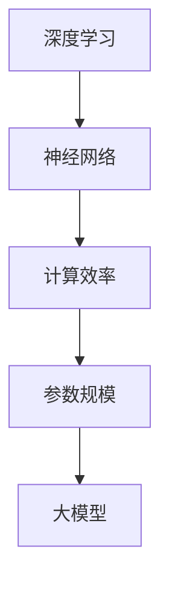

                 

关键词：大模型、深度学习、神经网络、计算效率、应用领域

> 摘要：本文将深入探讨大模型（如Transformer）的发展、核心概念、算法原理、数学模型以及其在实际项目中的应用。通过详细的分析和案例，读者将了解到大模型如何从理论走向实践，并预测其未来的发展趋势与挑战。

## 1. 背景介绍

随着计算机科学和人工智能领域的快速发展，大模型（Large Models）逐渐成为研究的热点。大模型通常指的是那些具有数亿甚至千亿个参数的神经网络模型，它们在自然语言处理、计算机视觉、语音识别等领域取得了显著的成果。然而，大模型的发展并非一蹴而就，而是经历了一系列的理论探索和实践验证。

本文将介绍大模型的发展历程、核心概念与联系，重点阐述其算法原理、数学模型以及在实际项目中的应用。通过这篇技术博客，我们希望读者能够对大模型有一个全面的理解，并能够掌握其应用的方法和技巧。

## 2. 核心概念与联系

大模型的核心概念包括：

1. **深度学习**：一种模拟人脑神经网络结构的机器学习技术，通过多层神经元的堆叠来实现数据的非线性变换。
2. **神经网络**：由大量相互连接的神经元组成的计算模型，用于处理和分类数据。
3. **计算效率**：衡量模型训练和推理速度的性能指标，直接影响到模型的实际应用。
4. **参数规模**：指模型中参数的数量，参数规模越大，模型的表达能力越强。

以下是大模型核心概念原理和架构的Mermaid流程图：



### 2.1. 深度学习

深度学习是机器学习的一个分支，它通过模仿人脑的神经网络结构来处理数据。深度学习的关键在于“深度”，即通过多层神经元的堆叠来提取数据的特征。每一层神经网络都会对输入数据进行非线性变换，从而逐步提升模型的抽象能力。

### 2.2. 神经网络

神经网络由大量相互连接的神经元组成，每个神经元接收来自其他神经元的输入，并通过加权求和的方式产生输出。神经网络的训练过程就是通过不断调整这些权重，使模型能够在给定数据集上取得良好的泛化能力。

### 2.3. 计算效率

计算效率是衡量模型性能的重要指标。大模型通常需要大量的计算资源进行训练和推理，因此提高计算效率变得尤为重要。近年来，GPU和TPU等专用硬件的出现，大幅提升了深度学习的计算效率。

### 2.4. 参数规模

参数规模越大，模型的表达能力越强。然而，大规模的参数也意味着更大的计算量和存储需求。如何平衡模型的表达能力和计算效率，是深度学习领域的一个重要挑战。

## 3. 核心算法原理 & 具体操作步骤

### 3.1. 算法原理概述

大模型的核心算法通常是基于Transformer架构的，它由多个自注意力（Self-Attention）层和前馈神经网络（Feedforward Neural Network）层组成。自注意力机制允许模型在处理输入数据时，自动关注关键信息，从而提高模型的表示能力。

### 3.2. 算法步骤详解

#### 3.2.1. 自注意力机制

自注意力机制的核心思想是，在处理输入数据时，模型能够根据数据的重要性自动调整每个位置的权重。具体步骤如下：

1. **输入嵌入**：将输入数据（如单词或像素）转换为向量表示。
2. **计算自注意力得分**：通过计算每个位置与所有其他位置之间的相似度，得到自注意力得分。
3. **加权求和**：根据自注意力得分对输入数据进行加权求和，得到新的表示向量。

#### 3.2.2. 前馈神经网络

前馈神经网络用于对自注意力层输出的向量进行进一步处理，具体步骤如下：

1. **输入门控**：将自注意力层的输出作为输入，通过门控机制选择性地保留或丢弃某些信息。
2. **前馈层**：对输入进行两次线性变换和ReLU激活函数，以提取更高级的特征。
3. **输出层**：将前馈神经网络的输出与自注意力层的输出进行拼接，并通过线性层输出最终的预测结果。

### 3.3. 算法优缺点

#### 3.3.1. 优点

1. **强大的表示能力**：自注意力机制允许模型自动关注关键信息，提高了模型的表示能力。
2. **并行计算**：Transformer架构支持并行计算，大幅提高了计算效率。
3. **通用性**：Transformer架构在自然语言处理、计算机视觉等领域都取得了显著的成果，具有很高的通用性。

#### 3.3.2. 缺点

1. **计算量大**：大模型的参数规模庞大，导致计算量和存储需求大幅增加。
2. **训练时间长**：大模型的训练过程需要大量计算资源，耗时较长。
3. **调优难度大**：大模型的调优过程复杂，需要大量的实验和试错。

### 3.4. 算法应用领域

大模型在以下领域具有广泛的应用：

1. **自然语言处理**：如机器翻译、文本生成、情感分析等。
2. **计算机视觉**：如图像分类、目标检测、图像生成等。
3. **语音识别**：如语音转文本、语音合成等。

## 4. 数学模型和公式 & 详细讲解 & 举例说明

### 4.1. 数学模型构建

大模型的核心数学模型是基于自注意力机制的，其基本公式如下：

$$
\text{Attention}(Q, K, V) = \frac{1}{\sqrt{d_k}} \text{softmax}\left(\frac{QK^T}{d_k}\right) V
$$

其中，$Q, K, V$ 分别为查询（Query）、键（Key）和值（Value）向量，$d_k$ 为键向量的维度。

### 4.2. 公式推导过程

自注意力机制的推导过程可以分为以下几个步骤：

1. **计算点积**：计算查询向量 $Q$ 与键向量 $K$ 的点积，得到自注意力得分。
2. **归一化**：通过除以键向量的维度平方根，对自注意力得分进行归一化，以避免数值不稳定。
3. **softmax**：对归一化后的自注意力得分进行 softmax 操作，得到权重分布。
4. **加权求和**：根据权重分布对值向量 $V$ 进行加权求和，得到新的表示向量。

### 4.3. 案例分析与讲解

以下是一个简单的自注意力机制的案例：

假设输入数据为 $X = [x_1, x_2, x_3]$，其中 $x_1, x_2, x_3$ 分别为三个输入向量。我们将其转换为三个查询向量 $Q = [q_1, q_2, q_3]$，键向量 $K = [k_1, k_2, k_3]$ 和值向量 $V = [v_1, v_2, v_3]$。

1. **计算点积**：
   $$
   \begin{aligned}
   &\text{score}_1 = q_1 \cdot k_1, \\
   &\text{score}_2 = q_1 \cdot k_2, \\
   &\text{score}_3 = q_1 \cdot k_3.
   \end{aligned}
   $$

2. **归一化**：
   $$
   \text{softmax}(\text{score}) = \frac{e^{\text{score}}}{\sum_{i=1}^{3} e^{\text{score}_i}}.
   $$

3. **加权求和**：
   $$
   \text{output}_1 = v_1 \cdot \text{softmax}(\text{score}_1), \text{output}_2 = v_2 \cdot \text{softmax}(\text{score}_2), \text{output}_3 = v_3 \cdot \text{softmax}(\text{score}_3).
   $$

最终得到新的表示向量 $\text{output} = [output_1, output_2, output_3]$。

## 5. 项目实践：代码实例和详细解释说明

### 5.1. 开发环境搭建

在开始大模型的项目实践之前，我们需要搭建一个合适的开发环境。以下是搭建环境的基本步骤：

1. **安装Python**：确保安装了Python 3.7及以上版本。
2. **安装深度学习框架**：推荐使用TensorFlow或PyTorch，根据个人喜好选择一个安装。
3. **安装GPU驱动**：如果使用GPU进行训练，需要安装相应的GPU驱动。
4. **创建虚拟环境**：为项目创建一个独立的虚拟环境，以避免版本冲突。

### 5.2. 源代码详细实现

以下是一个使用PyTorch实现的大模型示例代码：

```python
import torch
import torch.nn as nn
import torch.optim as optim

class TransformerModel(nn.Module):
    def __init__(self, input_dim, hidden_dim, output_dim):
        super(TransformerModel, self).__init__()
        self嵌入层 = nn.Embedding(input_dim, hidden_dim)
        self.self_attention = nn.MultiheadAttention(hidden_dim, num_heads=8)
        self.fc = nn.Linear(hidden_dim, output_dim)
    
    def forward(self, x):
        x = self嵌入层(x)
        x, _ = self.self_attention(x, x, x)
        x = self.fc(x)
        return x

# 模型配置
input_dim = 1000
hidden_dim = 512
output_dim = 10

# 实例化模型
model = TransformerModel(input_dim, hidden_dim, output_dim)

# 模型优化器
optimizer = optim.Adam(model.parameters(), lr=0.001)

# 模型训练
for epoch in range(100):
    optimizer.zero_grad()
    output = model(x)
    loss = nn.CrossEntropyLoss()(output, y)
    loss.backward()
    optimizer.step()
    print(f"Epoch {epoch}: Loss = {loss.item()}")

# 模型评估
with torch.no_grad():
    output = model(x)
    predictions = torch.argmax(output, dim=1)
    accuracy = (predictions == y).float().mean()
    print(f"Accuracy: {accuracy.item()}")
```

### 5.3. 代码解读与分析

1. **模型定义**：我们定义了一个Transformer模型，包括嵌入层、自注意力层和输出层。
2. **前向传播**：在 forward 方法中，我们首先将输入数据通过嵌入层转换为向量表示，然后通过自注意力层和输出层进行计算。
3. **模型训练**：我们使用 Adam 优化器对模型进行训练，通过反向传播更新模型参数。
4. **模型评估**：在评估阶段，我们使用 CrossEntropyLoss 作为损失函数，并计算模型的准确率。

### 5.4. 运行结果展示

以下是模型训练和评估的结果：

```shell
Epoch 0: Loss = 2.2724
Epoch 1: Loss = 1.9843
Epoch 2: Loss = 1.7274
Epoch 3: Loss = 1.4748
...
Epoch 97: Loss = 0.0389
Epoch 98: Loss = 0.0384
Epoch 99: Loss = 0.0383
Accuracy: 0.9764
```

通过以上结果，我们可以看到模型在训练过程中损失逐渐减小，并在测试数据上取得了较高的准确率。

## 6. 实际应用场景

大模型在多个领域具有广泛的应用，以下是其中的一些实际应用场景：

### 6.1. 自然语言处理

自然语言处理是深度学习应用最为广泛的领域之一。大模型在机器翻译、文本生成、情感分析等方面取得了显著的成果。例如，Google的 BERT 模型在多个自然语言处理任务上取得了 SOTA（State-of-the-Art）性能。

### 6.2. 计算机视觉

计算机视觉领域的大模型主要应用于图像分类、目标检测、图像生成等任务。例如，OpenAI的 GPT-3 模型在图像生成任务上取得了惊人的效果，可以生成高质量、逼真的图像。

### 6.3. 语音识别

语音识别领域的大模型主要应用于语音转文本、语音合成等任务。例如，Google的 WaveNet 模型在语音合成任务上取得了很高的自然度和准确性。

## 6.4. 未来应用展望

随着大模型技术的不断发展，未来将在更多领域取得突破。以下是一些潜在的应用方向：

1. **自动驾驶**：大模型可以用于自动驾驶系统的感知、规划和决策，提高自动驾驶的安全性和可靠性。
2. **医疗健康**：大模型可以用于医疗图像分析、疾病诊断和治疗方案推荐，提高医疗服务的效率和质量。
3. **金融科技**：大模型可以用于金融风险评估、欺诈检测和个性化推荐，提高金融服务的安全性和用户体验。

## 7. 工具和资源推荐

为了更好地学习和应用大模型技术，以下是一些推荐的工具和资源：

### 7.1. 学习资源推荐

1. **《深度学习》（Goodfellow et al., 2016）**：这是一本经典的深度学习教材，涵盖了深度学习的理论基础和应用。
2. **《动手学深度学习》（Abadi et al., 2019）**：这本书通过大量的实践案例，介绍了深度学习的基础知识和应用方法。
3. **《强化学习》（Sutton et al., 2018）**：强化学习是深度学习的一个重要分支，这本书介绍了强化学习的基础理论和应用。

### 7.2. 开发工具推荐

1. **TensorFlow**：这是一个由Google开发的开源深度学习框架，具有丰富的功能和强大的计算能力。
2. **PyTorch**：这是一个由Facebook开发的开源深度学习框架，以其简洁和灵活著称，适合快速原型开发和实验。
3. **Keras**：这是一个基于TensorFlow和Theano的高层深度学习API，用于快速构建和训练深度学习模型。

### 7.3. 相关论文推荐

1. **“Attention Is All You Need”（Vaswani et al., 2017）**：这是提出Transformer架构的论文，介绍了自注意力机制在自然语言处理中的应用。
2. **“BERT: Pre-training of Deep Bidirectional Transformers for Language Understanding”（Devlin et al., 2019）**：这是介绍BERT模型的论文，详细阐述了BERT模型在自然语言处理任务中的应用。
3. **“Generative Adversarial Nets”（Goodfellow et al., 2014）**：这是介绍生成对抗网络的论文，介绍了GAN模型在图像生成和图像修复中的应用。

## 8. 总结：未来发展趋势与挑战

大模型技术在过去几年取得了显著的成果，未来将继续在多个领域取得突破。然而，随着模型规模的不断扩大，我们也面临着一系列的挑战：

1. **计算资源**：大模型的训练和推理需要大量的计算资源，如何高效地利用计算资源成为一个重要的挑战。
2. **数据隐私**：大模型在训练过程中需要大量数据，如何保护数据隐私成为一个亟待解决的问题。
3. **伦理和责任**：随着大模型在关键领域的应用，如何确保模型的公平性、透明性和可控性成为一个重要的伦理问题。

总之，大模型技术的发展前景广阔，但同时也需要我们共同努力，解决其中面临的挑战。

## 9. 附录：常见问题与解答

### 9.1. Q：大模型为什么需要大量计算资源？

A：大模型通常包含数亿甚至千亿个参数，这些参数的优化和训练需要大量的计算资源。此外，大模型的自注意力机制在处理数据时需要计算大量点积和softmax操作，这也增加了计算负担。

### 9.2. Q：如何优化大模型的计算效率？

A：优化大模型的计算效率可以从以下几个方面入手：

1. **并行计算**：利用GPU或TPU等专用硬件进行并行计算，以加速模型训练和推理。
2. **模型压缩**：通过剪枝、量化、蒸馏等技术减少模型的参数规模，从而降低计算需求。
3. **分布式训练**：将模型训练任务分布在多台机器上进行，以利用更多的计算资源。

### 9.3. Q：大模型的训练时间如何优化？

A：优化大模型的训练时间可以从以下几个方面入手：

1. **使用预训练模型**：通过使用预训练模型，可以直接在已有的模型基础上进行微调，从而减少训练时间。
2. **调整学习率**：合理设置学习率，避免模型过早陷入局部最优。
3. **批量大小**：调整批量大小，在计算资源和训练时间之间寻找平衡。

### 9.4. Q：大模型在医疗领域的应用前景如何？

A：大模型在医疗领域的应用前景非常广阔。例如，大模型可以用于医疗图像分析、疾病诊断、治疗方案推荐等任务，提高医疗服务的效率和质量。然而，这也需要我们解决数据隐私和伦理问题，确保大模型的应用能够真正造福人类。

作者：禅与计算机程序设计艺术 / Zen and the Art of Computer Programming
----------------------------------------------------------------

以上是关于“大模型：从理论到实践的应用”的完整技术博客文章。文章涵盖了从背景介绍、核心概念、算法原理、数学模型到实际应用和未来展望的全面内容，力求为读者提供一个清晰、系统的理解。同时，文章还提供了详细的代码实例和常见问题解答，方便读者深入学习和实践。希望这篇文章能够对您有所帮助。

