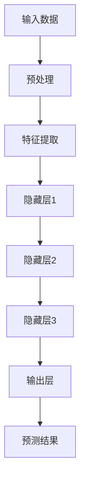

                 

关键词：商业智能、大模型、机器学习、算法、深度学习、神经网络、数据分析、技术创新

摘要：本文将探讨大模型在现代商业智能中的重要性，以及它们如何改变商业决策的过程。我们将深入分析大模型的定义、核心概念、算法原理，并探讨其在实际应用中的优点和挑战。通过数学模型和具体案例，我们将展示大模型在商业领域的广泛应用，并展望其未来的发展趋势。

## 1. 背景介绍

### 1.1 商业智能的演变

商业智能（Business Intelligence，BI）是指通过数据、信息技术的应用，实现企业内部信息的集成和分析，从而支持企业决策的一种技术。随着信息技术的快速发展，商业智能经历了从最初的数据报表，到多维数据分析，再到现在的数据驱动决策的演变过程。

### 1.2 大模型的出现

大模型（Big Model）是指在数据规模、参数数量、计算能力上超越传统模型的复杂模型。随着深度学习技术的发展，大模型逐渐在图像识别、自然语言处理、语音识别等领域取得了突破性进展，展示了强大的数据处理和预测能力。大模型的出现，为商业智能带来了新的动力。

## 2. 核心概念与联系

### 2.1 大模型的定义

大模型是指那些能够处理大规模数据集、拥有大量参数的复杂模型。这些模型通常使用深度学习技术，包括神经网络、循环神经网络（RNN）和变换器（Transformer）等。

### 2.2 大模型的架构

大模型的架构通常包括以下几个部分：

- **输入层**：接收外部数据。
- **隐藏层**：对输入数据进行特征提取和处理。
- **输出层**：产生预测或分类结果。

下面是一个简单的大模型架构的Mermaid流程图：



## 3. 核心算法原理 & 具体操作步骤

### 3.1 算法原理概述

大模型的算法原理基于深度学习，特别是神经网络。神经网络由多个相互连接的神经元组成，通过学习大量数据，能够自动提取特征并进行预测。

### 3.2 算法步骤详解

- **数据收集**：收集大规模、高质量的数据。
- **数据预处理**：对数据进行清洗、归一化等处理，以便模型更好地学习。
- **模型构建**：根据任务需求，构建合适的神经网络结构。
- **训练模型**：使用数据对模型进行训练，通过反向传播算法不断优化模型参数。
- **评估模型**：使用验证集评估模型性能，调整模型参数。
- **部署模型**：将训练好的模型部署到生产环境中，进行实际应用。

### 3.3 算法优缺点

**优点**：
- **强大的数据处理能力**：能够处理大规模、复杂的数据集。
- **自动特征提取**：通过多层神经网络，能够自动提取数据中的有效特征。
- **高精度预测**：在图像识别、自然语言处理等领域取得了极高的准确率。

**缺点**：
- **计算资源消耗大**：大模型通常需要大量的计算资源和时间进行训练。
- **数据质量要求高**：数据质量对模型性能有重要影响。

### 3.4 算法应用领域

大模型在商业智能领域有广泛的应用，包括：

- **客户行为预测**：通过分析客户的历史行为数据，预测其未来的行为。
- **风险控制**：通过分析大量数据，识别潜在的风险，并提前采取措施。
- **个性化推荐**：根据用户的兴趣和行为，提供个性化的产品或服务推荐。

## 4. 数学模型和公式 & 详细讲解 & 举例说明

### 4.1 数学模型构建

大模型的数学基础是神经网络。神经网络的数学模型可以表示为：

$$
\text{输出} = \sigma(\text{权重} \cdot \text{输入} + \text{偏置})
$$

其中，$\sigma$ 是激活函数，常用的有 sigmoid、ReLU 和 tanh 等。

### 4.2 公式推导过程

神经网络的训练过程是通过反向传播算法来优化模型参数的。反向传播算法的推导过程涉及梯度下降、链式法则等数学原理。

### 4.3 案例分析与讲解

以客户行为预测为例，假设我们有一个包含客户购买历史数据的表格。我们可以通过训练一个神经网络，预测客户是否会购买某产品。

首先，我们需要对数据进行预处理，包括数据清洗、归一化等步骤。然后，构建一个多层神经网络，输入层包含客户历史购买数据，隐藏层用于特征提取，输出层用于预测。

接下来，使用训练数据对模型进行训练，通过反向传播算法不断调整模型参数，直到模型性能达到预期。

最后，使用验证集评估模型性能，如果模型性能不理想，可以调整网络结构或增加训练数据。

## 5. 项目实践：代码实例和详细解释说明

### 5.1 开发环境搭建

首先，我们需要搭建一个适合大模型训练的开发环境。可以使用 Python 的 TensorFlow 或 PyTorch 库。

### 5.2 源代码详细实现

以下是使用 TensorFlow 实现的客户行为预测代码示例：

```python
import tensorflow as tf
from tensorflow.keras.models import Sequential
from tensorflow.keras.layers import Dense, Dropout

# 数据预处理
# ...

# 构建模型
model = Sequential()
model.add(Dense(128, input_dim=data.shape[1], activation='relu'))
model.add(Dropout(0.5))
model.add(Dense(64, activation='relu'))
model.add(Dropout(0.5))
model.add(Dense(1, activation='sigmoid'))

# 编译模型
model.compile(optimizer='adam', loss='binary_crossentropy', metrics=['accuracy'])

# 训练模型
model.fit(X_train, y_train, epochs=10, batch_size=32)

# 评估模型
loss, accuracy = model.evaluate(X_test, y_test)
print('Test accuracy:', accuracy)
```

### 5.3 代码解读与分析

这段代码首先导入了 TensorFlow 库，然后对数据进行预处理，包括归一化和数据集划分。接着，构建了一个包含两个隐藏层的神经网络模型，并使用 sigmoid 激活函数。模型使用 Adam 优化器和二进制交叉熵损失函数进行编译。最后，使用训练数据进行训练，并在测试集上进行评估。

## 6. 实际应用场景

大模型在商业智能领域有广泛的应用，包括：

- **客户行为预测**：通过分析客户的历史行为数据，预测其未来的行为，为企业提供决策支持。
- **风险控制**：通过分析大量数据，识别潜在的风险，并提前采取措施。
- **个性化推荐**：根据用户的兴趣和行为，提供个性化的产品或服务推荐。

## 7. 未来应用展望

随着大模型技术的不断发展，未来其在商业智能领域的应用将更加广泛和深入。例如，通过结合物联网技术，大模型可以实现实时数据分析，为企业提供更及时、更准确的决策支持。同时，大模型也将面临更多的挑战，如数据隐私保护、算法公平性等。

## 8. 总结：未来发展趋势与挑战

在未来，大模型将继续推动商业智能的发展，带来更多的机会和挑战。一方面，企业需要充分利用大模型的技术优势，提高数据分析能力和决策水平；另一方面，也需要关注数据隐私、算法公平性等伦理问题，确保技术应用的可持续发展。

## 9. 附录：常见问题与解答

### 9.1 什么是大模型？

大模型是指那些能够处理大规模数据集、拥有大量参数的复杂模型，通常使用深度学习技术。

### 9.2 大模型有哪些优点？

大模型具有强大的数据处理能力、自动特征提取和高精度预测等优点。

### 9.3 大模型在商业智能中有什么应用？

大模型在商业智能领域有广泛的应用，包括客户行为预测、风险控制和个性化推荐等。

作者：禅与计算机程序设计艺术 / Zen and the Art of Computer Programming

---

以上是一篇关于大模型在商业智能领域应用的详细技术博客文章。希望对您有所帮助！

