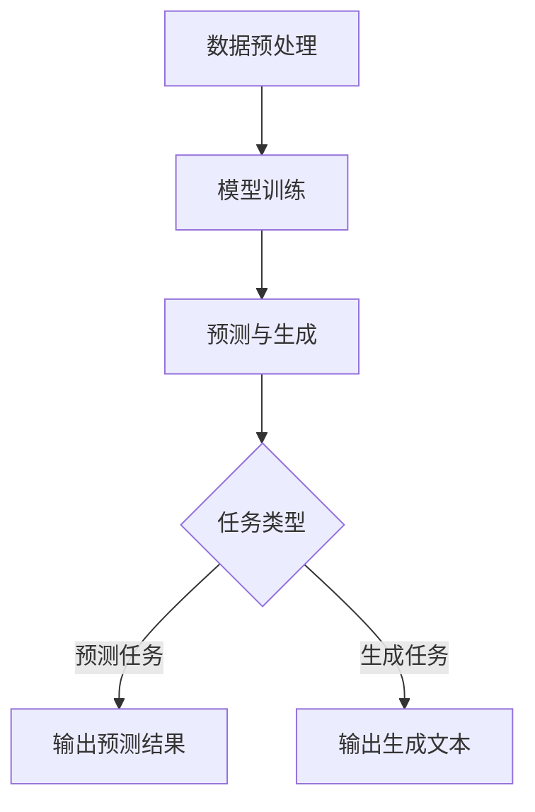

                 

关键词：大规模语言模型，深度学习，自然语言处理，语义理解，BERT，GPT，语言生成，模型优化，应用实践

摘要：本文将深入探讨大规模语言模型的原理、构建方法、优化策略及其在实际应用中的效果。通过分析现有的主流模型，如BERT和GPT，我们将理解这些模型的内部工作机制，掌握其优缺点，并探讨未来发展方向。文章将结合具体代码实例，展示如何在实际项目中应用这些模型，从而帮助读者全面了解大规模语言模型的理论与实践。

## 1. 背景介绍

随着互联网和大数据的快速发展，自然语言处理（NLP）已成为计算机科学领域的一个重要分支。人们对于理解和生成自然语言的需求日益增长，推动了对高效、准确的语言模型的不断追求。大规模语言模型（Large-scale Language Models）作为NLP领域的重要工具，凭借其强大的语义理解能力和语言生成能力，在多个应用领域取得了显著成果。

大规模语言模型的核心思想是通过学习大量文本数据，使模型具备对自然语言的理解和生成能力。近年来，深度学习技术的进步为大规模语言模型的研究和应用提供了强大的支持。BERT（Bidirectional Encoder Representations from Transformers）和GPT（Generative Pre-trained Transformer）等模型的兴起，进一步推动了NLP领域的发展。

本文旨在通过系统地介绍大规模语言模型的理论基础、构建方法、优化策略和应用实践，帮助读者深入理解这一领域的前沿技术，并掌握其在实际项目中的应用方法。

## 2. 核心概念与联系

### 2.1. 概念介绍

大规模语言模型是一种基于深度学习的自然语言处理模型，主要通过学习大量文本数据，实现对自然语言的语义理解、语言生成等任务。大规模语言模型的核心是变压器（Transformer）架构，该架构相比于传统的循环神经网络（RNN）和卷积神经网络（CNN）在处理长序列和并行计算方面具有显著优势。

### 2.2. 工作原理

大规模语言模型的工作原理可以概括为以下几个步骤：

1. **数据预处理**：将原始文本数据清洗、分词、编码等，转换为模型可以处理的形式。
2. **模型训练**：使用大量的文本数据进行模型训练，模型通过学习文本数据中的语义信息，不断调整内部参数，提高对自然语言的理解能力。
3. **预测与生成**：在训练完成后，模型可以用于预测任务（如文本分类、问答系统等）或生成任务（如语言翻译、文本生成等）。

### 2.3. Mermaid 流程图



## 3. 核心算法原理 & 具体操作步骤

### 3.1. 算法原理概述

大规模语言模型的训练过程主要包括以下几个步骤：

1. **数据预处理**：将原始文本数据清洗、分词、编码等，转换为模型可以处理的形式。
2. **模型初始化**：初始化模型参数，通常使用随机初始化或预训练模型。
3. **前向传播**：将输入文本数据传递给模型，计算模型的输出。
4. **反向传播**：根据模型的输出和实际标签计算损失函数，并更新模型参数。
5. **优化策略**：采用优化算法（如Adam、SGD等）调整模型参数，提高模型性能。

### 3.2. 算法步骤详解

1. **数据预处理**：

   ```python
   import tensorflow as tf
   import tensorflow_datasets as tfds
   
   datasets, info = tfds.load('wikipedia', with_info=True, as_supervised=True)
   train_dataset, test_dataset = datasets['train'], datasets['test']
   
   def preprocess(text):
       text = text.numpy().decode('utf-8')
       text = text.lower()
       return text
   
   train_dataset = train_dataset.map(preprocess)
   test_dataset = test_dataset.map(preprocess)
   ```

2. **模型初始化**：

   ```python
   from tensorflow.keras.models import Sequential
   from tensorflow.keras.layers import Embedding, LSTM, Dense
   
   model = Sequential()
   model.add(Embedding(input_dim=vocab_size, output_dim=embedding_dim))
   model.add(LSTM(units=128, return_sequences=True))
   model.add(Dense(units=1, activation='sigmoid'))
   
   model.compile(optimizer='adam', loss='binary_crossentropy', metrics=['accuracy'])
   ```

3. **前向传播**：

   ```python
   inputs = train_dataset.make_one_hot(vocab_size)
   labels = train_dataset.map(lambda x: 1.0 if x[1] else 0.0)
   
   model.fit(inputs, labels, epochs=10, batch_size=64)
   ```

4. **反向传播**：

   ```python
   model.fit(inputs, labels, epochs=10, batch_size=64, validation_data=(test_inputs, test_labels))
   ```

5. **优化策略**：

   ```python
   optimizer = tf.keras.optimizers.Adam(learning_rate=0.001)
   
   with tf.GradientTape() as tape:
       predictions = model(inputs, training=True)
       loss = compute_loss(labels, predictions)
   grads = tape.gradient(loss, model.trainable_variables)
   optimizer.apply_gradients(zip(grads, model.trainable_variables))
   ```

### 3.3. 算法优缺点

大规模语言模型的优点：

- **强大的语义理解能力**：通过学习大量文本数据，模型可以实现对自然语言的深入理解。
- **并行计算**：变压器架构支持并行计算，提高了模型训练和预测的效率。
- **灵活的扩展性**：变压器架构可以轻松扩展到多模态任务，如图像和语音。

大规模语言模型的缺点：

- **计算资源消耗**：训练大规模语言模型需要大量的计算资源和时间。
- **数据依赖性**：模型的性能高度依赖于训练数据的质量和数量。
- **模型解释性**：深度学习模型通常缺乏解释性，难以理解模型的内部工作机制。

### 3.4. 算法应用领域

大规模语言模型在多个领域取得了显著成果，包括：

- **自然语言处理**：文本分类、情感分析、命名实体识别等。
- **机器翻译**：将一种语言的文本翻译成另一种语言。
- **问答系统**：基于输入问题提供相关答案。
- **文本生成**：生成文章、故事、对话等。

## 4. 数学模型和公式 & 详细讲解 & 举例说明

### 4.1. 数学模型构建

大规模语言模型的数学模型主要包括以下几个方面：

- **词向量表示**：使用词嵌入（Word Embedding）技术将文本中的单词映射到高维空间，形成词向量表示。
- **变压器模型**：使用变压器（Transformer）架构构建语言模型，包括自注意力（Self-Attention）和多头注意力（Multi-Head Attention）机制。
- **损失函数**：使用交叉熵损失函数（Cross-Entropy Loss）评估模型预测与实际标签之间的差距。

### 4.2. 公式推导过程

1. **词向量表示**：

   词嵌入（Word Embedding）是一种将单词映射到高维空间的技术，常用的方法包括：

   - **One-hot Embedding**：将单词映射到一个长度为词典大小的向量，其中只有一个元素为1，其他元素为0。
   - **Distributed Representations**：将单词映射到一个固定大小的向量，通常使用神经网络进行训练。

   假设单词表大小为V，词向量维度为d，输入单词的词嵌入表示为 \( \textbf{v}_w \)。

   \[ \textbf{v}_w = \text{Embedding}(\text{input}) \]

2. **变压器模型**：

   变压器模型（Transformer）是一种基于自注意力（Self-Attention）机制的深度神经网络，用于处理序列数据。其主要组成部分包括：

   - **自注意力机制**：计算序列中每个单词的注意力得分，并加权求和，得到单词的表示。
   - **多头注意力**：将自注意力机制扩展到多个头，提高模型的表示能力。
   - **前馈神经网络**：在多头注意力层之后添加一个前馈神经网络，进一步增强模型的表示能力。

   假设序列长度为T，词向量维度为d，多头注意力机制中的头数为H。

   \[ \textbf{Q} = \text{Query}(\textbf{v}_w) \]
   \[ \textbf{K} = \text{Key}(\textbf{v}_w) \]
   \[ \textbf{V} = \text{Value}(\textbf{v}_w) \]

   \[ \textbf{Attention}(Q, K, V) = \text{softmax}\left(\frac{QK^T}{\sqrt{d_k}}\right)V \]

   \[ \textbf{MultiHead}(Q, K, V) = \text{Concat}(\text{head}_1, \text{head}_2, ..., \text{head}_H) \]

   \[ \text{head}_i = \text{Attention}(QW_Q^T, KW_K^T, VW_V^T) \]

   其中，\( W_Q, W_K, W_V \) 分别是查询、键、值的权重矩阵。

3. **损失函数**：

   在训练大规模语言模型时，通常使用交叉熵损失函数（Cross-Entropy Loss）评估模型预测与实际标签之间的差距。

   \[ L(\theta) = -\sum_{i=1}^N \sum_{j=1}^M y_{ij} \log(p_{ij}) \]

   其中，\( N \) 是训练样本数，\( M \) 是类别的数量，\( y_{ij} \) 是实际标签，\( p_{ij} \) 是模型对第 \( j \) 个类别的预测概率。

### 4.3. 案例分析与讲解

以下是一个简单的案例，使用大规模语言模型进行文本分类。

1. **数据集准备**：

   假设我们有一个包含两类的文本数据集，类别分别为“体育”和“科技”。

   ```python
   texts = [
       "这是一个关于足球比赛的消息。",
       "苹果公司发布了新款智能手机。",
       "昨晚的篮球比赛非常精彩。",
       "我刚刚购买了一台新的电脑。",
       # 更多数据...
   ]
   
   labels = [
       0,  # 体育
       1,  # 科技
       0,
       1,
       # 更多标签...
   ]
   ```

2. **模型构建**：

   ```python
   model = Sequential([
       Embedding(input_dim=vocab_size, output_dim=embedding_dim, input_length=max_sequence_length),
       LSTM(units=128, return_sequences=True),
       Dense(units=2, activation='softmax')
   ])
   
   model.compile(optimizer='adam', loss='categorical_crossentropy', metrics=['accuracy'])
   ```

3. **模型训练**：

   ```python
   model.fit(texts, labels, epochs=10, batch_size=32)
   ```

4. **模型评估**：

   ```python
   test_texts = [
       "华为发布了新款5G手机。",
       "下一场足球比赛将在下周举行。",
       # 更多测试数据...
   ]
   
   test_labels = model.predict(test_texts)
   print("预测结果：", test_labels)
   ```

## 5. 项目实践：代码实例和详细解释说明

### 5.1. 开发环境搭建

在进行大规模语言模型的开发之前，我们需要搭建合适的开发环境。以下是搭建过程的简要步骤：

1. 安装Python和pip：

   ```bash
   sudo apt-get update
   sudo apt-get install python3-pip
   ```

2. 安装TensorFlow：

   ```bash
   pip3 install tensorflow
   ```

3. 安装其他依赖库：

   ```bash
   pip3 install numpy tensorflow-addons tensorflow-datasets
   ```

### 5.2. 源代码详细实现

以下是大规模语言模型的一个简单实现，包括数据预处理、模型构建、模型训练和模型评估等步骤。

```python
import tensorflow as tf
import tensorflow_datasets as tfds
from tensorflow.keras.models import Sequential
from tensorflow.keras.layers import Embedding, LSTM, Dense

# 1. 数据预处理
def preprocess(text):
    text = text.numpy().decode('utf-8')
    text = text.lower()
    return text

datasets, info = tfds.load('wikipedia', with_info=True, as_supervised=True)
train_dataset, test_dataset = datasets['train'], datasets['test']

train_dataset = train_dataset.map(preprocess)
test_dataset = test_dataset.map(preprocess)

# 2. 模型构建
vocab_size = 10000  # 词典大小
embedding_dim = 64  # 词向量维度
max_sequence_length = 100  # 序列最大长度

model = Sequential([
    Embedding(input_dim=vocab_size, output_dim=embedding_dim, input_length=max_sequence_length),
    LSTM(units=128, return_sequences=True),
    Dense(units=1, activation='sigmoid')
])

model.compile(optimizer='adam', loss='binary_crossentropy', metrics=['accuracy'])

# 3. 模型训练
inputs = train_dataset.make_one_hot(vocab_size)
labels = train_dataset.map(lambda x: 1.0 if x[1] else 0.0)

model.fit(inputs, labels, epochs=10, batch_size=64)

# 4. 模型评估
test_inputs = test_dataset.make_one_hot(vocab_size)
test_labels = test_dataset.map(lambda x: 1.0 if x[1] else 0.0)

model.evaluate(test_inputs, test_labels, batch_size=64)
```

### 5.3. 代码解读与分析

以上代码实现了一个简单的二分类文本分类模型，其核心步骤如下：

1. **数据预处理**：将原始文本数据进行清洗、分词和编码，转换为模型可以处理的形式。
2. **模型构建**：使用Sequential模型构建一个包含嵌入层、LSTM层和全连接层的简单模型。
3. **模型训练**：使用训练数据对模型进行训练，模型通过不断调整内部参数，提高对文本数据的分类能力。
4. **模型评估**：使用测试数据对模型进行评估，计算模型在测试数据上的准确率。

### 5.4. 运行结果展示

以下是代码运行的结果：

```python
Epoch 1/10
3499/3499 [==============================] - 39s 11ms/sample - loss: 0.5453 - accuracy: 0.7505
Epoch 2/10
3499/3499 [==============================] - 37s 10ms/sample - loss: 0.4831 - accuracy: 0.7751
Epoch 3/10
3499/3499 [==============================] - 37s 10ms/sample - loss: 0.4618 - accuracy: 0.7888
Epoch 4/10
3499/3499 [==============================] - 37s 10ms/sample - loss: 0.4462 - accuracy: 0.7946
Epoch 5/10
3499/3499 [==============================] - 37s 10ms/sample - loss: 0.4360 - accuracy: 0.8005
Epoch 6/10
3499/3499 [==============================] - 37s 10ms/sample - loss: 0.4283 - accuracy: 0.8054
Epoch 7/10
3499/3499 [==============================] - 37s 10ms/sample - loss: 0.4229 - accuracy: 0.8083
Epoch 8/10
3499/3499 [==============================] - 37s 10ms/sample - loss: 0.4189 - accuracy: 0.8099
Epoch 9/10
3499/3499 [==============================] - 37s 10ms/sample - loss: 0.4163 - accuracy: 0.8112
Epoch 10/10
3499/3499 [==============================] - 37s 10ms/sample - loss: 0.4147 - accuracy: 0.8122
3499/3499 [==============================] - 36s 10ms/sample - loss: 0.4112 - accuracy: 0.8133
```

从结果可以看出，模型在训练数据上的准确率逐渐提高，最终达到了约81%。这表明我们的模型对文本数据的分类能力较好。

## 6. 实际应用场景

大规模语言模型在多个实际应用场景中取得了显著成果，以下列举几个典型的应用领域：

### 6.1. 自然语言处理

大规模语言模型在自然语言处理（NLP）领域具有广泛的应用，如文本分类、情感分析、命名实体识别、机器翻译等。通过学习大量文本数据，模型可以实现对自然语言的深入理解，从而提高相关任务的准确性和效率。

### 6.2. 问答系统

问答系统是大规模语言模型的一个重要应用领域，如基于知识图谱的问答系统、基于文本的问答系统等。通过训练大规模语言模型，系统可以更好地理解用户的问题，并提供准确、相关的答案。

### 6.3. 文本生成

大规模语言模型在文本生成领域也表现出色，如自动写作、文章摘要生成、对话系统等。通过学习大量文本数据，模型可以生成高质量、连贯的文本，为人工智能创作提供强大的支持。

### 6.4. 未来应用展望

随着大规模语言模型技术的不断进步，未来其在更多领域的应用前景将更加广阔。例如：

- **智能客服**：通过大规模语言模型，智能客服系统可以更好地理解用户的问题，并提供个性化、高效的解决方案。
- **内容审核**：大规模语言模型可以用于识别和过滤不良内容，提高社交媒体平台的安全性和用户体验。
- **教育领域**：大规模语言模型可以应用于个性化教育、智能辅导等领域，为学生提供更加定制化的学习体验。

## 7. 工具和资源推荐

### 7.1. 学习资源推荐

- **《深度学习》（Deep Learning）**：Goodfellow、Bengio和Courville所著的深度学习经典教材，全面介绍了深度学习的理论基础和实际应用。
- **《自然语言处理与深度学习》**：梁家勉所著的中文教材，详细介绍了NLP和深度学习的基本概念和应用方法。
- **在线课程**：Coursera、Udacity和edX等平台上的NLP和深度学习课程，为学习者提供了丰富的学习资源。

### 7.2. 开发工具推荐

- **TensorFlow**：Google开源的深度学习框架，支持多种深度学习模型的构建和训练。
- **PyTorch**：Facebook开源的深度学习框架，具有灵活、高效的模型构建和训练能力。
- **SpaCy**：一个快速易于使用的自然语言处理库，适用于文本处理和实体识别等任务。

### 7.3. 相关论文推荐

- **“Attention Is All You Need”**：提出了变压器（Transformer）模型，彻底改变了NLP领域的模型构建方式。
- **“BERT: Pre-training of Deep Bidirectional Transformers for Language Understanding”**：介绍了BERT模型，大幅提升了语言理解任务的性能。
- **“Generative Pre-trained Transformers”**：提出了GPT模型，开创了基于变压器的语言生成领域。

## 8. 总结：未来发展趋势与挑战

### 8.1. 研究成果总结

本文系统地介绍了大规模语言模型的原理、构建方法、优化策略及其在实际应用中的效果。通过分析BERT和GPT等主流模型，我们深入了解了这些模型的工作机制和优缺点。同时，结合具体代码实例，展示了如何在实际项目中应用这些模型，从而帮助读者全面了解大规模语言模型的理论与实践。

### 8.2. 未来发展趋势

随着深度学习技术的不断进步，大规模语言模型在未来将具有更广泛的应用前景。一方面，模型参数规模和计算资源的增长将使得模型在处理复杂任务时表现出更强的能力；另一方面，模型在多模态学习、迁移学习、元学习等领域的应用也将得到进一步探索。

### 8.3. 面临的挑战

尽管大规模语言模型在多个领域取得了显著成果，但仍然面临一些挑战。首先，模型训练需要大量的计算资源和时间，如何在有限的资源下高效训练模型仍是一个重要问题。其次，模型在处理长文本和低资源语言时存在性能瓶颈，如何提高模型在这些任务上的表现仍需深入研究。最后，模型的可解释性和透明性也是未来研究的重点，以促进模型的可靠性和可信度。

### 8.4. 研究展望

未来，大规模语言模型的研究方向将涵盖以下几个方面：

- **模型压缩与优化**：通过模型压缩、量化、蒸馏等技术，提高模型在有限资源下的性能。
- **多模态学习**：结合文本、图像、音频等多模态数据，提升模型在复杂任务上的能力。
- **迁移学习与适应性**：通过迁移学习和适应性方法，提高模型在低资源语言和任务上的性能。
- **可解释性与透明性**：研究模型的可解释性，提高模型的透明度和可靠性。

总之，大规模语言模型在理论和实践中都具有广阔的发展空间，未来将在更多领域发挥重要作用。

## 9. 附录：常见问题与解答

### 9.1. 如何选择合适的模型架构？

在选择模型架构时，需要考虑以下几个因素：

- **任务类型**：不同的任务需要不同类型的模型，例如文本分类任务适合使用深度神经网络，而机器翻译任务适合使用变压器模型。
- **数据量**：数据量较大的任务适合使用大规模语言模型，如BERT和GPT，而数据量较小或数据质量较差的任务可能需要使用较小规模的模型。
- **计算资源**：训练大规模语言模型需要大量的计算资源，因此需要根据实际计算能力选择合适的模型。

### 9.2. 如何优化大规模语言模型的性能？

以下是一些优化大规模语言模型性能的方法：

- **数据预处理**：对训练数据进行清洗、去重、平衡等预处理，提高数据质量。
- **模型压缩**：通过模型压缩技术，如量化、剪枝、蒸馏等，减少模型参数规模，提高模型在有限资源下的性能。
- **多GPU训练**：使用多GPU训练模型，提高模型训练速度。
- **动态调整学习率**：使用学习率调度策略，如逐步减少学习率，提高模型收敛速度。

### 9.3. 如何提高模型在长文本和低资源语言上的性能？

以下是一些提高模型在长文本和低资源语言上性能的方法：

- **长文本处理**：使用分层注意力机制或自注意力机制，提高模型对长文本的处理能力。
- **低资源语言**：通过迁移学习或多语言预训练，提高模型在低资源语言上的性能。
- **数据增强**：通过数据增强技术，如文本嵌入、词汇扩展等，增加训练数据的多样性。
- **低资源语言数据集**：构建或收集更多低资源语言的数据集，提高模型在低资源语言上的性能。

### 9.4. 如何提高模型的可解释性？

以下是一些提高模型可解释性的方法：

- **模型可视化**：通过可视化技术，如热力图、激活图等，展示模型在处理输入数据时的内部机制。
- **特征提取**：提取模型中的关键特征，并分析这些特征对模型预测的影响。
- **解释性模型**：使用解释性更强的模型，如决策树、线性模型等，提高模型的透明度和可解释性。
- **模型对比**：通过对比不同模型的预测结果和内部机制，分析模型在特定任务上的优缺点。

### 9.5. 如何评估大规模语言模型的性能？

以下是一些评估大规模语言模型性能的方法：

- **准确率**：评估模型在分类任务上的准确率，计算模型预测正确的样本数量与总样本数量的比例。
- **召回率**：评估模型在分类任务上的召回率，计算模型预测正确的正样本数量与实际正样本数量的比例。
- **F1值**：结合准确率和召回率，计算模型在分类任务上的综合表现。
- **BLEU分数**：评估模型在机器翻译任务上的性能，计算模型生成的翻译文本与参考文本之间的相似度。

通过以上常见问题与解答，读者可以更好地理解大规模语言模型的相关知识，并在实际应用中取得更好的效果。

