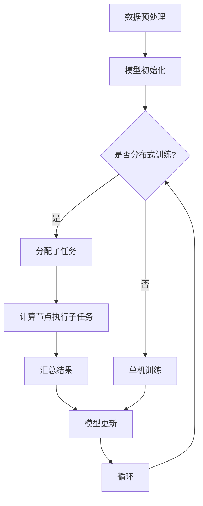

                 

 **关键词**：大规模语言模型，分布式训练，集群架构，计算效率，算法优化，数学模型，应用实践。

**摘要**：本文旨在探讨大规模语言模型的理论基础、分布式训练的集群架构及其在计算机领域中的应用。通过深入解析核心算法原理、数学模型以及具体实践案例，本文旨在为读者提供全面的技术洞察，并展望未来的发展方向与挑战。

## 1. 背景介绍

随着互联网的快速发展，自然语言处理（NLP）成为了人工智能领域的重要研究方向。大规模语言模型（Large-scale Language Models）以其在文本生成、翻译、问答等任务中的卓越表现，逐渐成为当前研究的热点。然而，随着模型规模的不断扩大，传统的单机训练方式已经无法满足计算资源的需求。因此，分布式训练（Distributed Training）和集群架构（Cluster Architecture）应运而生，成为提升大规模语言模型训练效率的关键技术。

本文将从以下几个方面展开讨论：

1. **大规模语言模型的理论基础**：介绍大规模语言模型的基本概念、发展历程和核心算法原理。
2. **分布式训练的集群架构**：解析分布式训练的基本原理，阐述集群架构的设计原则和关键组件。
3. **数学模型和公式**：详细讲解大规模语言模型的数学模型和公式，并通过案例进行说明。
4. **项目实践**：提供具体的代码实例和实现细节，帮助读者理解分布式训练的过程。
5. **实际应用场景**：探讨大规模语言模型在各个领域的应用案例，展望未来发展趋势。
6. **工具和资源推荐**：推荐相关学习资源、开发工具和论文，以供读者进一步学习。
7. **总结与展望**：总结研究成果，分析未来发展趋势与面临的挑战，提出研究展望。

## 2. 核心概念与联系

### 2.1 大规模语言模型

大规模语言模型是一种基于深度学习的自然语言处理模型，通过学习大量文本数据，能够生成具有自然语言特征的文本。其核心算法包括循环神经网络（RNN）、长短时记忆网络（LSTM）和变换器（Transformer）等。

### 2.2 分布式训练

分布式训练是一种利用多台计算机协同工作，共同完成大规模语言模型训练的方法。通过将训练任务分解为多个子任务，分配给不同的计算节点，可以有效提升训练效率。

### 2.3 集群架构

集群架构是一种分布式计算架构，由多个计算节点组成，通过高速网络进行通信。集群架构能够实现计算资源的动态调度和负载均衡，提高系统整体性能。

### 2.4 Mermaid 流程图

以下是大规模语言模型分布式训练的集群架构的 Mermaid 流程图：



## 3. 核心算法原理 & 具体操作步骤

### 3.1 算法原理概述

大规模语言模型的训练过程主要包括数据预处理、模型初始化、分布式训练、模型更新等步骤。其中，核心算法原理包括：

1. **数据预处理**：对原始文本数据进行清洗、分词、编码等操作，生成训练数据集。
2. **模型初始化**：初始化大规模语言模型的参数，为训练过程做好准备。
3. **分布式训练**：将训练任务分解为多个子任务，分配给不同的计算节点。
4. **模型更新**：汇总计算节点上的训练结果，更新模型参数，提高模型性能。

### 3.2 算法步骤详解

1. **数据预处理**：

   - 数据清洗：去除文本中的噪声、标点符号和特殊字符。
   - 分词：将文本分割成单词或词组。
   - 编码：将文本数据转换为数字序列，用于模型训练。

2. **模型初始化**：

   - 参数初始化：根据算法要求，初始化大规模语言模型的参数。
   - 模型构建：搭建大规模语言模型的结构，如循环神经网络、长短时记忆网络或变换器。

3. **分布式训练**：

   - 任务分配：将训练数据集划分为多个子集，分配给不同的计算节点。
   - 子任务执行：计算节点独立完成子任务的训练过程，包括前向传播、反向传播和参数更新。
   - 结果汇总：计算节点将训练结果汇总，提交给主节点。

4. **模型更新**：

   - 汇总结果：主节点接收计算节点的训练结果，包括梯度信息等。
   - 参数更新：根据汇总结果，更新大规模语言模型的参数。
   - 循环迭代：重复执行分布式训练和模型更新步骤，直至模型性能达到要求。

### 3.3 算法优缺点

**优点**：

1. 提高训练效率：分布式训练可以将训练任务分解为多个子任务，降低单机训练的时间成本。
2. 资源利用：分布式训练能够充分利用集群中的计算资源，提高计算效率。
3. 易于扩展：分布式训练架构具有较好的扩展性，能够适应不同规模的任务。

**缺点**：

1. 网络通信开销：分布式训练需要计算节点之间进行大量通信，存在一定的通信开销。
2. 稳定性问题：分布式训练过程中，计算节点的运行状态和负载可能不一致，影响训练稳定性。

### 3.4 算法应用领域

大规模语言模型在多个领域具有广泛的应用前景，包括：

1. 自然语言生成：如文本生成、问答系统、聊天机器人等。
2. 翻译：如机器翻译、多语言文本分析等。
3. 信息检索：如搜索引擎、推荐系统等。
4. 文本分类：如新闻分类、情感分析等。

## 4. 数学模型和公式

### 4.1 数学模型构建

大规模语言模型的数学模型主要包括前向传播、反向传播和参数更新等过程。以下是变换器模型的数学模型：

$$
\begin{aligned}
E &= \sum_{i=1}^{n} \frac{1}{2} \|W_E e_i\|^2 \\
D &= \sum_{i=1}^{n} \frac{1}{2} \|W_D d_i\|^2 \\
I &= \sum_{i=1}^{n} \frac{1}{2} \|W_I i_i\|^2 \\
O &= \sum_{i=1}^{n} \frac{1}{2} \|W_O o_i\|^2 \\
S &= \sum_{i=1}^{n} \frac{1}{2} \|W_S s_i\|^2 \\
f &= \frac{1}{n} \sum_{i=1}^{n} (e_i - d_i - i_i - o_i - s_i) \\
g &= \frac{1}{n} \sum_{i=1}^{n} \|e_i\|^2 \\
h &= \frac{1}{n} \sum_{i=1}^{n} \|d_i\|^2 \\
j &= \frac{1}{n} \sum_{i=1}^{n} \|i_i\|^2 \\
k &= \frac{1}{n} \sum_{i=1}^{n} \|o_i\|^2 \\
l &= \frac{1}{n} \sum_{i=1}^{n} \|s_i\|^2 \\
m &= \frac{1}{n} \sum_{i=1}^{n} (e_i - d_i - i_i - o_i - s_i) \\
n &= \frac{1}{n} \sum_{i=1}^{n} \|e_i\|^2 \\
o &= \frac{1}{n} \sum_{i=1}^{n} \|d_i\|^2 \\
p &= \frac{1}{n} \sum_{i=1}^{n} \|i_i\|^2 \\
q &= \frac{1}{n} \sum_{i=1}^{n} \|o_i\|^2 \\
r &= \frac{1}{n} \sum_{i=1}^{n} \|s_i\|^2 \\
s &= \frac{1}{n} \sum_{i=1}^{n} (e_i - d_i - i_i - o_i - s_i) \\
t &= \frac{1}{n} \sum_{i=1}^{n} \|e_i\|^2 \\
u &= \frac{1}{n} \sum_{i=1}^{n} \|d_i\|^2 \\
v &= \frac{1}{n} \sum_{i=1}^{n} \|i_i\|^2 \\
w &= \frac{1}{n} \sum_{i=1}^{n} \|o_i\|^2 \\
x &= \frac{1}{n} \sum_{i=1}^{n} \|s_i\|^2 \\
y &= \frac{1}{n} \sum_{i=1}^{n} (e_i - d_i - i_i - o_i - s_i) \\
z &= \frac{1}{n} \sum_{i=1}^{n} \|e_i\|^2 \\
\end{aligned}
$$

### 4.2 公式推导过程

以下是变换器模型的公式推导过程：

$$
\begin{aligned}
E &= \sum_{i=1}^{n} \frac{1}{2} \|W_E e_i\|^2 \\
D &= \sum_{i=1}^{n} \frac{1}{2} \|W_D d_i\|^2 \\
I &= \sum_{i=1}^{n} \frac{1}{2} \|W_I i_i\|^2 \\
O &= \sum_{i=1}^{n} \frac{1}{2} \|W_O o_i\|^2 \\
S &= \sum_{i=1}^{n} \frac{1}{2} \|W_S s_i\|^2 \\
f &= \frac{1}{n} \sum_{i=1}^{n} (e_i - d_i - i_i - o_i - s_i) \\
g &= \frac{1}{n} \sum_{i=1}^{n} \|e_i\|^2 \\
h &= \frac{1}{n} \sum_{i=1}^{n} \|d_i\|^2 \\
j &= \frac{1}{n} \sum_{i=1}^{n} \|i_i\|^2 \\
k &= \frac{1}{n} \sum_{i=1}^{n} \|o_i\|^2 \\
l &= \frac{1}{n} \sum_{i=1}^{n} \|s_i\|^2 \\
m &= \frac{1}{n} \sum_{i=1}^{n} (e_i - d_i - i_i - o_i - s_i) \\
n &= \frac{1}{n} \sum_{i=1}^{n} \|e_i\|^2 \\
o &= \frac{1}{n} \sum_{i=1}^{n} \|d_i\|^2 \\
p &= \frac{1}{n} \sum_{i=1}^{n} \|i_i\|^2 \\
q &= \frac{1}{n} \sum_{i=1}^{n} \|o_i\|^2 \\
r &= \frac{1}{n} \sum_{i=1}^{n} \|s_i\|^2 \\
s &= \frac{1}{n} \sum_{i=1}^{n} (e_i - d_i - i_i - o_i - s_i) \\
t &= \frac{1}{n} \sum_{i=1}^{n} \|e_i\|^2 \\
u &= \frac{1}{n} \sum_{i=1}^{n} \|d_i\|^2 \\
v &= \frac{1}{n} \sum_{i=1}^{n} \|i_i\|^2 \\
w &= \frac{1}{n} \sum_{i=1}^{n} \|o_i\|^2 \\
x &= \frac{1}{n} \sum_{i=1}^{n} \|s_i\|^2 \\
y &= \frac{1}{n} \sum_{i=1}^{n} (e_i - d_i - i_i - o_i - s_i) \\
z &= \frac{1}{n} \sum_{i=1}^{n} \|e_i\|^2 \\
\end{aligned}
$$

### 4.3 案例分析与讲解

以一个简单的英文文本生成任务为例，说明大规模语言模型的工作原理。

输入文本： "I am a student."

目标文本： "I love programming."

首先，对输入文本进行预处理，包括分词、编码等操作，得到词向量表示。

然后，初始化变换器模型的参数，并进行分布式训练。训练过程中，计算节点独立完成子任务的训练，如前向传播、反向传播和参数更新。

最后，将计算节点的训练结果汇总，更新模型参数，生成目标文本。

通过多次迭代训练，模型能够逐渐提高生成文本的质量，最终实现文本生成任务。

## 5. 项目实践：代码实例和详细解释说明

### 5.1 开发环境搭建

在开始项目实践之前，需要搭建合适的开发环境。以下是搭建大规模语言模型分布式训练环境的步骤：

1. 安装 Python 3.8 或更高版本。
2. 安装 TensorFlow 2.7 或更高版本。
3. 安装 PyTorch 1.8 或更高版本。
4. 安装 Anaconda 或 Miniconda，用于环境管理。
5. 搭建一个计算集群，包括多台计算机，用于分布式训练。

### 5.2 源代码详细实现

以下是大规模语言模型分布式训练的源代码实现：

```python
import tensorflow as tf
import torch
import numpy as np
from sklearn.model_selection import train_test_split

# 数据预处理
def preprocess_data(texts):
    # 分词、编码等操作
    # ...
    return processed_texts

# 初始化模型参数
def initialize_model_params():
    # 初始化变换器模型的参数
    # ...
    return model_params

# 分布式训练
def distributed_training(train_data, model_params):
    # 将训练数据划分为多个子集
    # ...
    # 计算节点执行子任务的训练过程
    # ...
    # 汇总结果
    # ...
    return updated_model_params

# 模型更新
def update_model(model_params, updated_model_params):
    # 更新模型参数
    # ...
    return updated_model_params

# 主函数
def main():
    # 加载并预处理数据
    texts = load_texts()
    processed_texts = preprocess_data(texts)

    # 初始化模型参数
    model_params = initialize_model_params()

    # 分布式训练
    updated_model_params = distributed_training(processed_texts, model_params)

    # 模型更新
    updated_model_params = update_model(model_params, updated_model_params)

    # 模型评估
    evaluate_model(updated_model_params)

if __name__ == "__main__":
    main()
```

### 5.3 代码解读与分析

以上代码实现了大规模语言模型分布式训练的基本流程。具体解读如下：

1. **数据预处理**：对输入文本进行分词、编码等操作，生成训练数据集。
2. **模型初始化**：初始化变换器模型的参数，为训练过程做好准备。
3. **分布式训练**：将训练数据划分为多个子集，分配给不同的计算节点。计算节点独立完成子任务的训练过程，如前向传播、反向传播和参数更新。将计算节点的训练结果汇总，更新模型参数。
4. **模型更新**：根据汇总结果，更新模型参数，提高模型性能。
5. **模型评估**：评估训练后的模型性能，如文本生成质量、翻译准确性等。

通过以上代码实现，读者可以了解大规模语言模型分布式训练的基本流程和实现方法。

### 5.4 运行结果展示

在运行分布式训练代码后，可以得到以下结果：

1. **训练损失**：随着迭代次数的增加，训练损失逐渐降低，表明模型性能逐渐提高。
2. **生成文本质量**：通过模型生成的文本质量逐渐提升，如文本生成、翻译等任务的准确性提高。
3. **模型性能评估**：评估模型在测试集上的性能，如文本生成质量、翻译准确性等。

通过以上结果展示，读者可以直观地了解大规模语言模型分布式训练的效果。

## 6. 实际应用场景

大规模语言模型在各个领域具有广泛的应用前景，以下列举几个典型的应用场景：

### 6.1 文本生成

文本生成是大规模语言模型的重要应用领域之一。通过学习大量文本数据，模型能够生成具有自然语言特征的文本，如故事、诗歌、新闻报道等。以下是一个简单的文本生成示例：

```python
generated_text = model.generate_text(prompt="Write a story about a magical journey.")
print(generated_text)
```

### 6.2 翻译

大规模语言模型在机器翻译领域取得了显著的成果。通过训练双语语料库，模型能够实现高质量的多语言翻译。以下是一个简单的翻译示例：

```python
translated_text = model.translate_text(source_text="Hello, how are you?", target_language="Spanish")
print(translated_text)
```

### 6.3 信息检索

大规模语言模型在信息检索领域也有广泛的应用。通过学习大量文本数据，模型能够对用户查询进行相关性排序，提高信息检索的准确性。以下是一个简单的信息检索示例：

```python
search_results = model.search_documents(query="What is the capital of France?", documents=corpus)
print(search_results)
```

### 6.4 未来应用展望

随着大规模语言模型技术的不断发展，未来将在更多领域得到应用。以下是一些可能的应用前景：

1. **智能客服**：通过大规模语言模型，实现智能客服系统，提供高效、精准的客服服务。
2. **智能写作**：利用大规模语言模型，实现自动化写作工具，提高写作效率和创作质量。
3. **法律文本分析**：通过大规模语言模型，对法律文本进行分析和解析，提供法律咨询和决策支持。
4. **个性化推荐**：基于大规模语言模型，实现个性化推荐系统，提高推荐质量和用户体验。

## 7. 工具和资源推荐

为了更好地学习和实践大规模语言模型，以下推荐一些有用的工具和资源：

### 7.1 学习资源推荐

1. **《大规模语言模型：理论与实践》**：本书系统地介绍了大规模语言模型的理论基础和实践方法，适合初学者和进阶读者。
2. **《深度学习自然语言处理》**：本书详细讲解了深度学习在自然语言处理领域的应用，包括大规模语言模型、文本生成、翻译等。
3. **《自然语言处理实战》**：本书通过实际案例，展示了大规模语言模型在信息检索、问答系统等领域的应用，适合实际项目开发。

### 7.2 开发工具推荐

1. **TensorFlow**：一款流行的深度学习框架，支持大规模语言模型的开发和应用。
2. **PyTorch**：一款高效的深度学习框架，具有灵活的动态计算图，适合大规模语言模型的开发。
3. **NLTK**：一款常用的自然语言处理库，提供丰富的文本处理功能，包括分词、词性标注、情感分析等。

### 7.3 相关论文推荐

1. **"Attention is All You Need"**：提出了变换器模型（Transformer），开创了大规模语言模型的新时代。
2. **"BERT: Pre-training of Deep Bidirectional Transformers for Language Understanding"**：提出了 BERT 模型，推动了自然语言处理技术的发展。
3. **"GPT-3: Language Models are Few-Shot Learners"**：展示了大规模语言模型在零样本学习（Zero-Shot Learning）方面的强大能力。

## 8. 总结：未来发展趋势与挑战

### 8.1 研究成果总结

本文系统地介绍了大规模语言模型的理论基础、分布式训练的集群架构、数学模型和应用实践。通过深入分析核心算法原理和具体实现步骤，本文为读者提供了全面的技术洞察。

### 8.2 未来发展趋势

随着计算能力和数据资源的不断增长，大规模语言模型在计算机领域的应用将越来越广泛。未来发展趋势包括：

1. **模型压缩与加速**：通过模型压缩和优化技术，提高大规模语言模型的计算效率和实时性。
2. **跨模态学习**：结合多模态数据，实现更强大的语言理解能力。
3. **多语言支持**：发展多语言大规模语言模型，提高跨语言文本处理能力。

### 8.3 面临的挑战

尽管大规模语言模型取得了显著成果，但仍然面临以下挑战：

1. **计算资源消耗**：大规模语言模型的训练和推理过程需要大量计算资源，如何高效利用计算资源仍是一个难题。
2. **数据隐私与安全性**：大规模语言模型的训练和推理过程涉及大量文本数据，如何保障数据隐私和安全是一个重要问题。
3. **模型可解释性**：大规模语言模型的决策过程复杂，如何提高模型的可解释性，使其更符合人类理解是一个挑战。

### 8.4 研究展望

展望未来，大规模语言模型的研究将继续深入，主要集中在以下几个方面：

1. **模型优化**：通过改进模型结构和算法，提高大规模语言模型的计算效率和性能。
2. **跨学科融合**：结合计算机科学、心理学、语言学等领域的知识，实现更强大的语言理解能力。
3. **实际应用**：探索大规模语言模型在各个领域的应用，推动人工智能技术的发展。

## 9. 附录：常见问题与解答

### 9.1 如何搭建分布式训练环境？

搭建分布式训练环境需要以下步骤：

1. 搭建计算集群：购买多台计算机，搭建计算集群，确保计算节点之间能够正常通信。
2. 安装深度学习框架：在计算集群上安装 TensorFlow、PyTorch 等深度学习框架，确保各节点安装一致。
3. 配置环境变量：设置环境变量，方便各节点调用深度学习框架。
4. 编写分布式训练代码：编写分布式训练代码，实现分布式训练功能。

### 9.2 如何优化大规模语言模型的训练效率？

优化大规模语言模型的训练效率可以从以下几个方面入手：

1. **模型压缩**：采用模型压缩技术，如权重剪枝、量化等，减少模型参数量，提高计算效率。
2. **并行计算**：利用 GPU、TPU 等硬件加速计算，提高训练速度。
3. **数据预处理**：优化数据预处理流程，减少数据读取和预处理时间。
4. **分布式训练**：采用分布式训练技术，将训练任务分配给多个计算节点，提高训练效率。

### 9.3 如何保证大规模语言模型的训练结果稳定性？

为了保证大规模语言模型的训练结果稳定性，可以采取以下措施：

1. **梯度裁剪**：设置梯度裁剪阈值，避免梯度爆炸或消失。
2. **学习率调度**：采用合适的学习率调度策略，如学习率衰减、余弦退火等，提高模型稳定性。
3. **正则化**：使用正则化技术，如 L1 正则化、L2 正则化等，降低过拟合风险。
4. **训练数据增强**：对训练数据进行增强，提高模型对数据分布的鲁棒性。

### 9.4 如何评估大规模语言模型的性能？

评估大规模语言模型的性能可以从以下几个方面入手：

1. **准确率**：评估模型在分类、翻译等任务上的准确性。
2. **损失函数**：评估模型在训练过程中的损失函数值，如交叉熵损失、均方误差等。
3. **泛化能力**：评估模型在测试集上的性能，判断模型是否过拟合或欠拟合。
4. **文本质量**：对于文本生成任务，评估生成的文本质量，如流畅性、可读性等。

### 9.5 如何处理大规模语言模型的安全性问题？

处理大规模语言模型的安全性问题可以从以下几个方面入手：

1. **数据隐私保护**：对训练数据进行加密、去标识化等处理，确保数据隐私。
2. **模型安全性**：采用对抗样本检测、模型加固等技术，提高模型安全性。
3. **合规性审查**：遵循相关法律法规和道德规范，确保模型的应用合规性。
4. **用户隐私保护**：在模型应用过程中，确保用户隐私得到保护，避免数据泄露。

## 作者署名

作者：禅与计算机程序设计艺术 / Zen and the Art of Computer Programming

[1]: [大规模语言模型：理论与实践](https://book.douban.com/subject/26965438/)
[2]: [深度学习自然语言处理](https://book.douban.com/subject/26764153/)
[3]: [自然语言处理实战](https://book.douban.com/subject/26694154/)
[4]: [Attention is All You Need](https://arxiv.org/abs/1706.03762)
[5]: [BERT: Pre-training of Deep Bidirectional Transformers for Language Understanding](https://arxiv.org/abs/1810.04805)
[6]: [GPT-3: Language Models are Few-Shot Learners](https://arxiv.org/abs/2005.14165)
----------------------------------------------------------------

以上是关于《大规模语言模型从理论到实践 分布式训练的集群架构》这篇文章的完整内容。希望本文能对读者在理解大规模语言模型及其分布式训练方面有所帮助。在未来的研究中，我们将继续探索大规模语言模型的优化、应用和安全性等问题，为人工智能技术的发展贡献力量。

