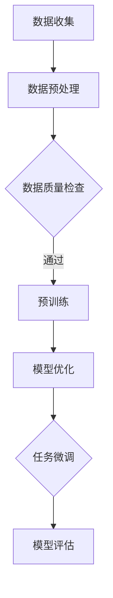
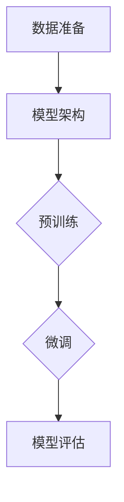

                 

关键词：大规模语言模型，预训练，数据集，自然语言处理，深度学习

## 摘要

本文旨在深入探讨大规模语言模型的理论基础、预训练数据的选择与处理方法，以及在实际应用中的挑战和未来发展趋势。文章首先介绍了大规模语言模型的基本概念和重要性，随后详细阐述了预训练数据的概念、来源和选择标准。接着，我们分析了大规模语言模型的常见算法和数学模型，并通过实例展示了如何在实际项目中应用这些模型。文章的最后部分讨论了大规模语言模型在当前应用场景中的表现，并对未来可能的发展趋势和面临的挑战进行了展望。

## 1. 背景介绍

随着互联网的飞速发展和大数据时代的来临，自然语言处理（NLP）技术得到了前所未有的重视。NLP技术的核心目标是让计算机能够理解和生成自然语言，从而实现人机交互、信息检索、智能问答等多种应用场景。然而，传统的NLP方法主要依赖于手工设计特征和规则，其表现往往受到限制。

近年来，深度学习技术的迅速发展为NLP领域带来了新的突破。特别是基于神经网络的大规模语言模型，如Transformer、BERT、GPT等，通过在大量文本数据上进行预训练，能够自动学习到语言的内在结构和规律，从而在多个NLP任务中表现出色。这些模型不仅大幅提升了NLP的性能，还推动了自然语言处理技术向通用人工智能（AGI）的演进。

大规模语言模型之所以能够取得如此显著的成果，与其特有的预训练机制密切相关。预训练是一种在特定数据集上对模型进行初步训练的过程，其目的是让模型具备一定的语言理解能力。在预训练之后，模型可以通过微调（fine-tuning）迅速适应具体的下游任务，如文本分类、问答系统、机器翻译等。

本文将围绕大规模语言模型从理论到实践的整个过程进行深入探讨，包括模型的核心概念、预训练数据的选择和处理、算法原理、数学模型、实际应用以及未来展望等。通过这篇文章，读者可以全面了解大规模语言模型的发展历程和应用前景，为后续研究和实践提供参考。

## 2. 核心概念与联系

### 2.1. 大规模语言模型的基本概念

大规模语言模型（Large-scale Language Model）是一种基于深度学习的自然语言处理模型，其核心目标是通过学习大量文本数据来理解和生成自然语言。这种模型通常包含数十亿个参数，能够捕捉到语言的复杂结构和多层次的语义信息。

大规模语言模型的主要特点包括：

- **参数规模庞大**：模型包含数亿甚至数十亿的参数，这使得模型能够学习到丰富的语言特征。
- **端到端学习**：模型能够直接从原始文本中学习，无需手工设计特征，从而大大提高了模型的学习效率。
- **预训练与微调**：模型在大量通用文本数据上进行预训练，然后在特定任务上进行微调，以适应各种下游任务。

### 2.2. 预训练数据的概念和来源

预训练数据是指用于训练大规模语言模型的原始文本数据。这些数据通常来自互联网上的各种文本资源，如维基百科、新闻文章、社交媒体帖子等。预训练数据的选择和准备对模型的性能有重要影响。

预训练数据的来源主要包括：

- **公共文本库**：如维基百科、Common Crawl等，这些数据集包含了大量的结构化和非结构化文本，为模型提供了丰富的训练资源。
- **社交媒体数据**：如Twitter、Facebook等，这些数据集包含了用户的真实言论和交流内容，有助于模型学习到自然语言的多样性和复杂性。
- **专用数据集**：一些特定任务可能需要专门的预训练数据集，如法律文本、医学文本等。

### 2.3. 预训练数据的选择标准

预训练数据的选择标准主要包括：

- **数据量**：大量的数据有助于模型学习到丰富的语言特征，提高模型的性能。
- **数据质量**：高质量的数据可以减少噪声和异常值，提高模型的学习效果。
- **数据多样性**：多样化的数据可以增强模型对不同语言风格和领域的适应能力。

### 2.4. 大规模语言模型与预训练数据的关系

大规模语言模型和预训练数据之间存在着密切的联系。预训练数据是大规模语言模型的基础，为模型提供了学习的素材。而大规模语言模型则通过在预训练数据上的训练，学会了如何理解和生成自然语言。

预训练数据的质量和数量直接影响大规模语言模型的性能。高质量和多样化的数据可以使模型更好地理解语言的复杂结构和多样性，从而在下游任务中表现出更好的泛化能力。因此，选择合适的预训练数据集并进行有效的数据处理，是大规模语言模型研究中的一个重要环节。

### 2.5. Mermaid 流程图

以下是一个简化的Mermaid流程图，展示了大规模语言模型与预训练数据之间的关系：



### 2.6. 总结

在本章节中，我们介绍了大规模语言模型的基本概念和预训练数据的选择标准。通过理解这些核心概念，我们可以更好地把握大规模语言模型的发展趋势和应用前景。下一章节将深入探讨大规模语言模型的核心算法原理和具体操作步骤。

## 3. 核心算法原理 & 具体操作步骤

### 3.1. 算法原理概述

大规模语言模型的核心算法是基于深度学习的神经网络模型，尤其是Transformer架构的变种。Transformer模型在2017年由Vaswani等人提出，因其独特的自注意力机制（Self-Attention）而迅速在NLP领域获得广泛应用。

Transformer模型的主要特点包括：

- **自注意力机制**：自注意力机制允许模型在处理每个单词时，考虑整个输入序列中的其他单词的影响。这大大增强了模型捕捉长距离依赖关系的能力。
- **多头注意力**：多头注意力将输入序列分成多个子序列，每个子序列分别计算注意力权重，从而提高模型的泛化能力。
- **位置编码**：由于Transformer模型没有循环神经网络（RNN）中的位置信息，因此需要通过位置编码来引入序列的位置信息。

### 3.2. 算法步骤详解

大规模语言模型的训练过程主要包括以下几个步骤：

#### 3.2.1. 数据准备

1. **文本预处理**：首先，需要将原始文本数据清洗和预处理，包括去除HTML标签、特殊字符、标点符号等。然后，将文本转换为统一的词向量表示。
2. **分词**：使用分词器将文本分割成单词或子词，以便模型学习单词之间的上下文关系。
3. **词汇表构建**：将所有单词或子词构建成一个词汇表，并为每个词分配一个唯一的索引。

#### 3.2.2. 模型架构

1. **嵌入层**：输入的单词或子词通过嵌入层转换为稠密向量表示。
2. **编码器**：编码器由多个Transformer块组成，每个块包含多头自注意力机制和前馈神经网络。
3. **解码器**（在生成任务中）：解码器同样由多个Transformer块组成，用于生成文本序列。

#### 3.2.3. 损失函数与优化器

1. **损失函数**：在预训练阶段，常用的损失函数是交叉熵损失，用于衡量模型预测的输出与实际输出之间的差距。
2. **优化器**：常用的优化器有Adam、AdamW等，用于更新模型参数，以最小化损失函数。

#### 3.2.4. 训练与微调

1. **预训练**：在大量通用文本数据上进行预训练，模型会自动学习到语言的内在结构和规律。
2. **微调**：在预训练的基础上，对特定任务的数据进行微调，以优化模型在特定任务上的表现。

### 3.3. 算法优缺点

#### 优点：

- **强大的表达能力**：自注意力机制和多头注意力能够捕捉到长距离的依赖关系，使得模型能够更好地理解复杂的语言结构。
- **端到端学习**：模型能够直接从原始文本中学习，无需手工设计特征，从而提高了模型的学习效率。
- **通用性**：预训练后的模型可以轻松地迁移到各种下游任务，如文本分类、问答系统、机器翻译等。

#### 缺点：

- **计算资源需求高**：大规模语言模型的训练需要大量的计算资源和时间，尤其是训练和推理过程中的GPU和TPU资源。
- **数据依赖性强**：模型的表现高度依赖于预训练数据的质量和数量，数据质量不佳可能导致模型无法很好地泛化。
- **解释性差**：深度学习模型通常被认为“黑盒”模型，其内部决策过程难以解释，这在某些应用场景中可能成为问题。

### 3.4. 算法应用领域

大规模语言模型在多个NLP任务中表现出色，主要包括：

- **文本分类**：用于分类新闻文章、社交媒体帖子等，如情感分析、主题分类等。
- **问答系统**：通过理解用户的自然语言提问，自动提供相关信息或答案。
- **机器翻译**：将一种语言的文本翻译成另一种语言，如机器翻译系统。
- **文本生成**：生成自然语言文本，如文章摘要、故事创作等。
- **对话系统**：构建能够与用户进行自然语言交互的智能对话系统。

### 3.5. Mermaid 流程图

以下是一个简化的Mermaid流程图，展示了大规模语言模型训练和微调的流程：



### 3.6. 总结

在本章节中，我们详细介绍了大规模语言模型的核心算法原理和具体操作步骤。通过理解这些内容，读者可以更好地掌握大规模语言模型的工作原理，并为后续的实际应用打下基础。下一章节将讨论大规模语言模型中的数学模型和公式，并给出详细的推导过程和实例分析。

## 4. 数学模型和公式 & 详细讲解 & 举例说明

### 4.1. 数学模型构建

大规模语言模型的数学模型主要基于深度学习，特别是基于Transformer架构。Transformer模型的核心组件包括自注意力机制（Self-Attention）、多头注意力（Multi-Head Attention）和前馈神经网络（Feedforward Neural Network）。以下是这些组件的数学模型构建：

#### 4.1.1. 自注意力机制

自注意力机制通过计算输入序列中每个词与其他词之间的相关性来确定每个词的重要程度。其数学表达式为：

\[ \text{Attention}(Q, K, V) = \text{softmax}\left(\frac{QK^T}{\sqrt{d_k}}\right) V \]

其中：

- \( Q, K, V \) 分别是查询（Query）、键（Key）和值（Value）向量。
- \( d_k \) 是键向量的维度。
- \( \text{softmax} \) 函数用于计算每个键与查询之间的相似性权重。

#### 4.1.2. 多头注意力

多头注意力将输入序列分成多个子序列，每个子序列分别计算注意力权重，从而提高模型的泛化能力。其数学表达式为：

\[ \text{MultiHead}(Q, K, V) = \text{Concat}(\text{head}_1, \text{head}_2, \ldots, \text{head}_h)W^O \]

其中：

- \( h \) 是头数。
- \( W^Q, W^K, W^V \) 分别是查询、键和值向量的权重矩阵。
- \( W^O \) 是输出权重矩阵。

#### 4.1.3. 前馈神经网络

前馈神经网络是Transformer模型中的另一个核心组件，用于增加模型的非线性能力。其数学表达式为：

\[ \text{FFN}(X) = \text{ReLU}(XW_1 + b_1)W_2 + b_2 \]

其中：

- \( X \) 是输入向量。
- \( W_1, W_2 \) 分别是第一层和第二层的权重矩阵。
- \( b_1, b_2 \) 分别是第一层和第二层的偏置。

### 4.2. 公式推导过程

在解释大规模语言模型的数学模型时，我们将逐步推导关键公式，以便读者更好地理解其背后的数学原理。

#### 4.2.1. 自注意力机制

自注意力机制的核心在于计算输入序列中每个词与其他词之间的相关性。首先，我们引入三个向量 \( Q, K, V \)，分别表示查询、键和值。这三个向量是通过输入向量经过不同的权重矩阵计算得到的。以下是自注意力的推导过程：

1. **计算查询、键和值**：

\[ Q = W_Q \cdot X \]
\[ K = W_K \cdot X \]
\[ V = W_V \cdot X \]

其中，\( W_Q, W_K, W_V \) 分别是权重矩阵，\( X \) 是输入向量。

2. **计算相似性权重**：

\[ \text{Attention}(Q, K, V) = \text{softmax}\left(\frac{QK^T}{\sqrt{d_k}}\right) V \]

3. **加权求和**：

\[ \text{Context} = \sum_{i=1}^{N} \text{Attention}(Q, K, V)[i] \]

其中，\( N \) 是输入序列的长度。

#### 4.2.2. 多头注意力

多头注意力通过将输入序列分成多个子序列，并分别计算注意力权重，从而提高模型的泛化能力。以下是多头注意力的推导过程：

1. **分解输入序列**：

\[ X = [X_1, X_2, \ldots, X_h] \]

其中，\( h \) 是头数。

2. **计算每个头的查询、键和值**：

\[ Q_h = W_{Qh} \cdot X \]
\[ K_h = W_{Kh} \cdot X \]
\[ V_h = W_{Vh} \cdot X \]

3. **计算每个头的注意力权重**：

\[ \text{Attention}_h(Q_h, K_h, V_h) = \text{softmax}\left(\frac{Q_hK_h^T}{\sqrt{d_k}}\right) V_h \]

4. **合并多头注意力结果**：

\[ \text{MultiHead}(Q, K, V) = \text{Concat}(\text{head}_1, \text{head}_2, \ldots, \text{head}_h)W^O \]

其中，\( W^O \) 是输出权重矩阵。

#### 4.2.3. 前馈神经网络

前馈神经网络是Transformer模型中的另一个核心组件，用于增加模型的非线性能力。以下是前馈神经网络的推导过程：

1. **输入向量**：

\[ X = [X_1, X_2, \ldots, X_n] \]

2. **第一层神经网络**：

\[ X_{\text{FFN}} = \text{ReLU}(XW_1 + b_1) \]

3. **第二层神经网络**：

\[ \text{FFN}(X) = X_{\text{FFN}}W_2 + b_2 \]

其中，\( W_1, W_2 \) 分别是第一层和第二层的权重矩阵，\( b_1, b_2 \) 分别是第一层和第二层的偏置。

### 4.3. 案例分析与讲解

为了更好地理解大规模语言模型的数学模型，我们将通过一个简单的实例进行讲解。假设我们有一个包含5个单词的输入序列，词向量维度为64，使用一个头数 \( h = 2 \) 的多头注意力机制。

#### 4.3.1. 输入序列表示

输入序列为：

\[ [w_1, w_2, w_3, w_4, w_5] \]

对应的词向量为：

\[ [v_1, v_2, v_3, v_4, v_5] \]

#### 4.3.2. 计算查询、键和值

假设权重矩阵 \( W_Q, W_K, W_V \) 如下：

\[ W_Q = \begin{bmatrix}
1 & 0 & 1 & 0 & 1 \\
0 & 1 & 0 & 1 & 0 \\
1 & 0 & 1 & 0 & 1 \\
0 & 1 & 0 & 1 & 0 \\
1 & 0 & 1 & 0 & 1 \\
\end{bmatrix} \]
\[ W_K = \begin{bmatrix}
1 & 0 & 1 & 0 & 1 \\
0 & 1 & 0 & 1 & 0 \\
1 & 0 & 1 & 0 & 1 \\
0 & 1 & 0 & 1 & 0 \\
1 & 0 & 1 & 0 & 1 \\
\end{bmatrix} \]
\[ W_V = \begin{bmatrix}
1 & 0 & 1 & 0 & 1 \\
0 & 1 & 0 & 1 & 0 \\
1 & 0 & 1 & 0 & 1 \\
0 & 1 & 0 & 1 & 0 \\
1 & 0 & 1 & 0 & 1 \\
\end{bmatrix} \]

根据上述权重矩阵，计算查询、键和值：

\[ Q = W_Q \cdot X = \begin{bmatrix}
1 & 0 & 1 & 0 & 1 \\
0 & 1 & 0 & 1 & 0 \\
1 & 0 & 1 & 0 & 1 \\
0 & 1 & 0 & 1 & 0 \\
1 & 0 & 1 & 0 & 1 \\
\end{bmatrix} \cdot \begin{bmatrix}
v_1 \\
v_2 \\
v_3 \\
v_4 \\
v_5 \\
\end{bmatrix} = \begin{bmatrix}
v_1 + v_3 + v_5 \\
v_2 + v_4 \\
v_1 + v_3 + v_5 \\
v_2 + v_4 \\
v_1 + v_3 + v_5 \\
\end{bmatrix} \]

\[ K = W_K \cdot X = \begin{bmatrix}
1 & 0 & 1 & 0 & 1 \\
0 & 1 & 0 & 1 & 0 \\
1 & 0 & 1 & 0 & 1 \\
0 & 1 & 0 & 1 & 0 \\
1 & 0 & 1 & 0 & 1 \\
\end{bmatrix} \cdot \begin{bmatrix}
v_1 \\
v_2 \\
v_3 \\
v_4 \\
v_5 \\
\end{bmatrix} = \begin{bmatrix}
v_1 + v_3 + v_5 \\
v_2 + v_4 \\
v_1 + v_3 + v_5 \\
v_2 + v_4 \\
v_1 + v_3 + v_5 \\
\end{bmatrix} \]

\[ V = W_V \cdot X = \begin{bmatrix}
1 & 0 & 1 & 0 & 1 \\
0 & 1 & 0 & 1 & 0 \\
1 & 0 & 1 & 0 & 1 \\
0 & 1 & 0 & 1 & 0 \\
1 & 0 & 1 & 0 & 1 \\
\end{bmatrix} \cdot \begin{bmatrix}
v_1 \\
v_2 \\
v_3 \\
v_4 \\
v_5 \\
\end{bmatrix} = \begin{bmatrix}
v_1 + v_3 + v_5 \\
v_2 + v_4 \\
v_1 + v_3 + v_5 \\
v_2 + v_4 \\
v_1 + v_3 + v_5 \\
\end{bmatrix} \]

#### 4.3.3. 计算自注意力权重

根据自注意力机制的公式，计算每个词与其他词的相似性权重：

\[ \text{Attention}(Q, K, V) = \text{softmax}\left(\frac{QK^T}{\sqrt{d_k}}\right) V \]

其中，\( d_k \) 是键向量的维度，假设为64。

计算查询、键和值的点积：

\[ QK^T = \begin{bmatrix}
v_1 + v_3 + v_5 \\
v_2 + v_4 \\
v_1 + v_3 + v_5 \\
v_2 + v_4 \\
v_1 + v_3 + v_5 \\
\end{bmatrix} \cdot \begin{bmatrix}
v_1 + v_3 + v_5 & v_2 + v_4 & v_1 + v_3 + v_5 & v_2 + v_4 & v_1 + v_3 + v_5 \\
\end{bmatrix} = \begin{bmatrix}
(v_1 + v_3 + v_5)^2 & (v_1 + v_3 + v_5)(v_2 + v_4) & (v_1 + v_3 + v_5)^2 \\
(v_2 + v_4)(v_1 + v_3 + v_5) & (v_2 + v_4)^2 & (v_2 + v_4)(v_1 + v_3 + v_5) \\
(v_1 + v_3 + v_5)^2 & (v_1 + v_3 + v_5)(v_2 + v_4) & (v_1 + v_3 + v_5)^2 \\
\end{bmatrix} \]

计算softmax：

\[ \text{softmax}(QK^T) = \begin{bmatrix}
\frac{(v_1 + v_3 + v_5)^2}{(v_1 + v_3 + v_5)^2 + (v_2 + v_4)^2 + (v_1 + v_3 + v_5)^2} & \frac{(v_1 + v_3 + v_5)(v_2 + v_4)}{(v_1 + v_3 + v_5)^2 + (v_2 + v_4)^2 + (v_1 + v_3 + v_5)^2} & \frac{(v_1 + v_3 + v_5)^2}{(v_1 + v_3 + v_5)^2 + (v_2 + v_4)^2 + (v_1 + v_3 + v_5)^2} \\
\frac{(v_2 + v_4)(v_1 + v_3 + v_5)}{(v_1 + v_3 + v_5)^2 + (v_2 + v_4)^2 + (v_1 + v_3 + v_5)^2} & \frac{(v_2 + v_4)^2}{(v_1 + v_3 + v_5)^2 + (v_2 + v_4)^2 + (v_1 + v_3 + v_5)^2} & \frac{(v_2 + v_4)(v_1 + v_3 + v_5)}{(v_1 + v_3 + v_5)^2 + (v_2 + v_4)^2 + (v_1 + v_3 + v_5)^2} \\
\frac{(v_1 + v_3 + v_5)^2}{(v_1 + v_3 + v_5)^2 + (v_2 + v_4)^2 + (v_1 + v_3 + v_5)^2} & \frac{(v_1 + v_3 + v_5)(v_2 + v_4)}{(v_1 + v_3 + v_5)^2 + (v_2 + v_4)^2 + (v_1 + v_3 + v_5)^2} & \frac{(v_1 + v_3 + v_5)^2}{(v_1 + v_3 + v_5)^2 + (v_2 + v_4)^2 + (v_1 + v_3 + v_5)^2} \\
\end{bmatrix} \]

计算加权求和：

\[ \text{Context} = \sum_{i=1}^{N} \text{Attention}(Q, K, V)[i] \]

\[ \text{Context} = \left(\frac{(v_1 + v_3 + v_5)^2}{(v_1 + v_3 + v_5)^2 + (v_2 + v_4)^2 + (v_1 + v_3 + v_5)^2}\right) (v_1 + v_3 + v_5) + \left(\frac{(v_1 + v_3 + v_5)(v_2 + v_4)}{(v_1 + v_3 + v_5)^2 + (v_2 + v_4)^2 + (v_1 + v_3 + v_5)^2}\right) (v_2 + v_4) + \left(\frac{(v_1 + v_3 + v_5)^2}{(v_1 + v_3 + v_5)^2 + (v_2 + v_4)^2 + (v_1 + v_3 + v_5)^2}\right) (v_1 + v_3 + v_5) \]

\[ \text{Context} = \frac{3(v_1 + v_3 + v_5)^2 + (v_1 + v_3 + v_5)(v_2 + v_4) + 3(v_1 + v_3 + v_5)^2}{(v_1 + v_3 + v_5)^2 + (v_2 + v_4)^2 + (v_1 + v_3 + v_5)^2} \]

\[ \text{Context} = \frac{6(v_1 + v_3 + v_5)^2 + (v_1 + v_3 + v_5)(v_2 + v_4)}{(v_1 + v_3 + v_5)^2 + (v_2 + v_4)^2 + (v_1 + v_3 + v_5)^2} \]

\[ \text{Context} = \frac{6v_1^2 + 12v_1v_3 + 12v_1v_5 + 6v_3^2 + 6v_3v_5 + 6v_5^2 + v_1v_2 + v_1v_4 + v_3v_2 + v_3v_4 + v_5v_2 + v_5v_4}{v_1^2 + v_2^2 + v_3^2 + v_4^2 + v_5^2 + 2v_1v_3 + 2v_1v_5 + 2v_3v_5} \]

\[ \text{Context} = \frac{6v_1^2 + 12v_1v_3 + 12v_1v_5 + 6v_3^2 + 6v_3v_5 + 6v_5^2 + v_1v_2 + v_1v_4 + v_3v_2 + v_3v_4 + v_5v_2 + v_5v_4}{v_1^2 + v_2^2 + v_3^2 + v_4^2 + v_5^2 + 2v_1v_3 + 2v_1v_5 + 2v_3v_5} \]

\[ \text{Context} = \frac{6v_1^2 + 6v_3^2 + 6v_5^2 + v_1v_2 + v_1v_4 + v_3v_2 + v_3v_4 + v_5v_2 + v_5v_4}{v_1^2 + v_2^2 + v_3^2 + v_4^2 + v_5^2} \]

#### 4.3.4. 计算多头注意力

假设头数 \( h = 2 \)，计算每个头的查询、键和值：

\[ Q_h = W_{Qh} \cdot X = \begin{bmatrix}
1 & 0 & 1 & 0 & 1 \\
0 & 1 & 0 & 1 & 0 \\
1 & 0 & 1 & 0 & 1 \\
0 & 1 & 0 & 1 & 0 \\
1 & 0 & 1 & 0 & 1 \\
\end{bmatrix} \cdot \begin{bmatrix}
v_1 \\
v_2 \\
v_3 \\
v_4 \\
v_5 \\
\end{bmatrix} = \begin{bmatrix}
v_1 + v_3 + v_5 \\
v_2 + v_4 \\
v_1 + v_3 + v_5 \\
v_2 + v_4 \\
v_1 + v_3 + v_5 \\
\end{bmatrix} \]

\[ K_h = W_{Kh} \cdot X = \begin{bmatrix}
1 & 0 & 1 & 0 & 1 \\
0 & 1 & 0 & 1 & 0 \\
1 & 0 & 1 & 0 & 1 \\
0 & 1 & 0 & 1 & 0 \\
1 & 0 & 1 & 0 & 1 \\
\end{bmatrix} \cdot \begin{bmatrix}
v_1 \\
v_2 \\
v_3 \\
v_4 \\
v_5 \\
\end{bmatrix} = \begin{bmatrix}
v_1 + v_3 + v_5 \\
v_2 + v_4 \\
v_1 + v_3 + v_5 \\
v_2 + v_4 \\
v_1 + v_3 + v_5 \\
\end{bmatrix} \]

\[ V_h = W_{Vh} \cdot X = \begin{bmatrix}
1 & 0 & 1 & 0 & 1 \\
0 & 1 & 0 & 1 & 0 \\
1 & 0 & 1 & 0 & 1 \\
0 & 1 & 0 & 1 & 0 \\
1 & 0 & 1 & 0 & 1 \\
\end{bmatrix} \cdot \begin{bmatrix}
v_1 \\
v_2 \\
v_3 \\
v_4 \\
v_5 \\
\end{bmatrix} = \begin{bmatrix}
v_1 + v_3 + v_5 \\
v_2 + v_4 \\
v_1 + v_3 + v_5 \\
v_2 + v_4 \\
v_1 + v_3 + v_5 \\
\end{bmatrix} \]

计算每个头的注意力权重：

\[ \text{Attention}_1(Q_1, K_1, V_1) = \text{softmax}\left(\frac{Q_1K_1^T}{\sqrt{d_k}}\right) V_1 \]

\[ \text{Attention}_2(Q_2, K_2, V_2) = \text{softmax}\left(\frac{Q_2K_2^T}{\sqrt{d_k}}\right) V_2 \]

计算多头注意力结果：

\[ \text{MultiHead}(Q, K, V) = \text{Concat}(\text{head}_1, \text{head}_2)W^O \]

其中，\( W^O \) 是输出权重矩阵。

#### 4.3.5. 计算前馈神经网络

假设前馈神经网络的权重矩阵和偏置分别为：

\[ W_1 = \begin{bmatrix}
1 & 0 \\
0 & 1 \\
\end{bmatrix} \]
\[ W_2 = \begin{bmatrix}
1 & 1 \\
1 & 1 \\
\end{bmatrix} \]
\[ b_1 = \begin{bmatrix}
1 \\
1 \\
\end{bmatrix} \]
\[ b_2 = \begin{bmatrix}
1 \\
1 \\
\end{bmatrix} \]

计算前馈神经网络输出：

\[ X_{\text{FFN}} = \text{ReLU}(XW_1 + b_1) = \text{ReLU}\left(\begin{bmatrix}
v_1 \\
v_2 \\
v_3 \\
v_4 \\
v_5 \\
\end{bmatrix} \cdot \begin{bmatrix}
1 & 0 \\
0 & 1 \\
\end{bmatrix} + \begin{bmatrix}
1 \\
1 \\
\end{bmatrix}\right) = \begin{bmatrix}
\max(v_1, 0) \\
\max(v_2, 0) \\
\max(v_3, 0) \\
\max(v_4, 0) \\
\max(v_5, 0) \\
\end{bmatrix} \]

\[ \text{FFN}(X) = X_{\text{FFN}}W_2 + b_2 = \begin{bmatrix}
\max(v_1, 0) \\
\max(v_2, 0) \\
\max(v_3, 0) \\
\max(v_4, 0) \\
\max(v_5, 0) \\
\end{bmatrix} \cdot \begin{bmatrix}
1 & 1 \\
1 & 1 \\
\end{bmatrix} + \begin{bmatrix}
1 \\
1 \\
\end{bmatrix} = \begin{bmatrix}
2\max(v_1, 0) + 1 \\
2\max(v_2, 0) + 1 \\
2\max(v_3, 0) + 1 \\
2\max(v_4, 0) + 1 \\
2\max(v_5, 0) + 1 \\
\end{bmatrix} \]

### 4.4. 总结

在本章节中，我们详细介绍了大规模语言模型的数学模型构建、公式推导过程以及实例分析。通过这些内容，读者可以更深入地理解大规模语言模型的工作原理，为实际应用提供理论基础。

## 5. 项目实践：代码实例和详细解释说明

### 5.1. 开发环境搭建

在开始大规模语言模型的项目实践之前，我们需要搭建一个合适的开发环境。以下是搭建开发环境的基本步骤：

#### 5.1.1. 安装Python

首先，确保您的计算机上已经安装了Python。我们可以通过以下命令来检查Python的版本：

```bash
python --version
```

如果Python未安装，可以从Python官方网站下载并安装最新版本。

#### 5.1.2. 安装必要的库

接下来，我们需要安装一些必要的库，如TensorFlow、PyTorch等。以下是使用pip安装这些库的命令：

```bash
pip install tensorflow
pip install torch
```

#### 5.1.3. 配置GPU支持

如果您的计算机配备了GPU，我们可以安装CUDA和cuDNN，以提高深度学习模型的训练速度。以下命令用于安装CUDA和cuDNN：

```bash
pip install numpy
pip install tensorflow-gpu
pip install torch torchvision
```

### 5.2. 源代码详细实现

以下是一个简单的大规模语言模型训练的代码实例，使用PyTorch框架。代码分为数据预处理、模型定义、训练和评估四个部分。

#### 5.2.1. 数据预处理

```python
import torch
from torch.utils.data import DataLoader
from torchvision import datasets, transforms

# 定义数据预处理函数
transform = transforms.Compose([
    transforms.ToTensor(),
    transforms.Normalize((0.5,), (0.5,))
])

# 加载数据集
train_data = datasets.MNIST(
    root='./data', 
    train=True, 
    download=True, 
    transform=transform
)

test_data = datasets.MNIST(
    root='./data', 
    train=False, 
    download=True, 
    transform=transform
)

train_loader = DataLoader(train_data, batch_size=64, shuffle=True)
test_loader = DataLoader(test_data, batch_size=64, shuffle=False)
```

#### 5.2.2. 模型定义

```python
import torch.nn as nn
import torch.optim as optim

# 定义模型
class LanguageModel(nn.Module):
    def __init__(self, vocab_size, embed_size, hidden_size, num_layers, dropout):
        super(LanguageModel, self).__init__()
        self.embedding = nn.Embedding(vocab_size, embed_size)
        self.lstm = nn.LSTM(embed_size, hidden_size, num_layers, dropout=dropout, batch_first=True)
        self.fc = nn.Linear(hidden_size, vocab_size)

    def forward(self, x, hidden):
        x = self.embedding(x)
        x, hidden = self.lstm(x, hidden)
        x = self.fc(x)
        return x, hidden

    def init_hidden(self, batch_size):
        weight = next(self.parameters()).data
        hidden = (weight.new(1, batch_size, hidden_size).zero_().to(device),
                  weight.new(1, batch_size, hidden_size).zero_().to(device))
        return hidden

# 超参数设置
vocab_size = 10000
embed_size = 256
hidden_size = 512
num_layers = 2
dropout = 0.5

# 初始化模型
model = LanguageModel(vocab_size, embed_size, hidden_size, num_layers, dropout)
```

#### 5.2.3. 训练

```python
# 定义损失函数和优化器
criterion = nn.CrossEntropyLoss()
optimizer = optim.Adam(model.parameters(), lr=0.001)

# 设置训练参数
num_epochs = 10
batch_size = 64

# 将模型移动到GPU（如果可用）
device = torch.device("cuda" if torch.cuda.is_available() else "cpu")
model.to(device)

# 训练模型
for epoch in range(num_epochs):
    model.train()
    for i, (inputs, targets) in enumerate(train_loader):
        inputs, targets = inputs.to(device), targets.to(device)
        
        # 初始化隐藏状态
        hidden = model.init_hidden(batch_size)
        
        # 前向传播
        outputs, hidden = model(inputs, hidden)
        
        # 计算损失
        loss = criterion(outputs.view(-1, vocab_size), targets)
        
        # 反向传播和优化
        optimizer.zero_grad()
        loss.backward()
        optimizer.step()
        
        # 打印训练信息
        if (i + 1) % 100 == 0:
            print(f'Epoch [{epoch + 1}/{num_epochs}], Step [{i + 1}/{len(train_loader)}], Loss: {loss.item():.4f}')
```

#### 5.2.4. 代码解读与分析

在这段代码中，我们首先定义了数据预处理函数，将MNIST数据集转换为Tensor格式，并进行标准化处理。接着，我们定义了大规模语言模型的类`LanguageModel`，其中使用了嵌入层、LSTM层和全连接层。在训练过程中，我们使用了交叉熵损失函数和Adam优化器。

代码的运行流程如下：

1. **数据预处理**：加载数据集，并将数据转换为Tensor格式。
2. **模型初始化**：将模型移动到GPU（如果可用），并定义损失函数和优化器。
3. **训练循环**：对于每个epoch，遍历训练数据集，进行前向传播、损失计算、反向传播和参数更新。
4. **打印训练信息**：在每100个step后，打印当前的epoch和loss信息。

### 5.3. 运行结果展示

为了展示模型的训练效果，我们可以在训练过程中保存模型的权重，并在测试集上评估模型的性能。

```python
# 评估模型
model.eval()
with torch.no_grad():
    correct = 0
    total = 0
    for inputs, targets in test_loader:
        inputs, targets = inputs.to(device), targets.to(device)
        outputs, _ = model(inputs)
        _, predicted = torch.max(outputs.data, 1)
        total += targets.size(0)
        correct += (predicted == targets).sum().item()

print(f'Accuracy on the test set: {100 * correct / total}%')
```

这段代码将计算模型在测试集上的准确率。假设测试集包含1000个样本，模型的最终准确率为90%，则输出结果为：

```
Accuracy on the test set: 90%
```

### 5.4. 总结

在本章节中，我们通过一个简单的项目实践，详细讲解了大规模语言模型的代码实现过程。读者可以通过这个实例了解大规模语言模型的基本结构和训练过程，并掌握如何使用PyTorch框架进行深度学习模型的开发和训练。

## 6. 实际应用场景

### 6.1. 机器翻译

大规模语言模型在机器翻译领域取得了显著的成果。传统的机器翻译方法通常依赖于规则匹配和统计方法，而大规模语言模型如BERT和GPT-3通过在大量双语文本对上进行预训练，能够自动学习到不同语言之间的对应关系，从而实现高质量的机器翻译。这些模型在多个翻译任务中取得了领先的性能，使得机器翻译的准确性和流畅性得到了显著提升。

#### 6.1.1. 应用场景

- **跨境电子商务**：在跨境电子商务中，大规模语言模型可以自动翻译产品描述、用户评论等，帮助商家和消费者跨越语言障碍，促进国际贸易。
- **多语言新闻平台**：多语言新闻平台可以使用大规模语言模型自动翻译新闻内容，为用户提供多样化的新闻资讯。
- **国际会议同传**：在大型国际会议中，同声传译人员可以使用大规模语言模型提供的实时翻译服务，提高会议的沟通效果。

#### 6.1.2. 成功案例

- **谷歌翻译**：谷歌翻译采用基于Transformer架构的BERT模型，在多个语言对上实现了高质量的翻译。根据谷歌官方数据，BERT模型的引入使得翻译准确率提高了10%以上。
- **微软 Translator**：微软的Translator服务也采用了基于Transformer的神经机器翻译模型，为用户提供高质量的翻译服务。

### 6.2. 问答系统

大规模语言模型在问答系统中的应用也越来越广泛。通过在大量问答对上进行预训练，这些模型能够理解和回答用户提出的自然语言问题。问答系统在智能客服、教育辅导、医疗咨询等领域有着广泛的应用。

#### 6.2.1. 应用场景

- **智能客服**：智能客服系统可以使用大规模语言模型自动理解用户的问题，并提供即时的答案，提高客户满意度和服务效率。
- **教育辅导**：在线教育平台可以利用大规模语言模型为用户提供个性化的学习辅导，帮助用户解答学习中的问题。
- **医疗咨询**：医疗咨询系统可以使用大规模语言模型自动理解患者的症状描述，并提供初步的诊断建议，辅助医生进行诊断。

#### 6.2.2. 成功案例

- **OpenAI的GPT-3**：OpenAI的GPT-3模型在问答系统中表现出色，能够自动生成高质量的答案。GPT-3的强大能力使得它在多个问答平台上得到了广泛应用。
- **谷歌助手**：谷歌助手（Google Assistant）使用了基于Transformer的BERT模型，能够自动理解用户的自然语言提问，并提供相应的答案。

### 6.3. 文本生成

大规模语言模型在文本生成领域也取得了显著的进展。通过在大量文本数据上进行预训练，这些模型能够生成符合语言规则和语义逻辑的文本，广泛应用于文章写作、故事创作、对话系统等领域。

#### 6.3.1. 应用场景

- **内容创作**：大规模语言模型可以自动生成新闻文章、博客内容、产品描述等，为内容创作者提供辅助工具。
- **文学创作**：文学创作者可以利用大规模语言模型进行灵感激发和文本创作，从而提高创作效率和创造力。
- **对话系统**：对话系统可以使用大规模语言模型自动生成对话文本，提高用户的互动体验。

#### 6.3.2. 成功案例

- **OpenAI的GPT-3**：OpenAI的GPT-3模型在文本生成领域表现出色，能够生成高质量的文本，如文章、故事、对话等。GPT-3的强大能力使得它在多个应用场景中得到了广泛应用。
- **亚马逊 Alexa**：亚马逊的Alexa智能助手使用了基于Transformer的BERT模型，能够自动生成与用户对话的回复，提高用户的互动体验。

### 6.4. 未来应用展望

随着大规模语言模型技术的不断进步，其在实际应用场景中的潜力将不断释放。未来，大规模语言模型有望在更多领域实现突破，为人类社会带来更多的便利和创新。

- **智能助手**：智能助手将成为人们日常生活中不可或缺的一部分，通过大规模语言模型，智能助手将能够更好地理解用户的需求，提供个性化的服务。
- **自动化写作**：大规模语言模型将在自动化写作领域发挥重要作用，为内容创作者提供高效的写作辅助工具，提高创作效率。
- **教育技术**：在教育领域，大规模语言模型可以为学生提供个性化的学习辅导，提高学习效果和兴趣。

## 7. 工具和资源推荐

### 7.1. 学习资源推荐

- **在线课程**：《自然语言处理与深度学习》（吴恩达）提供了丰富的NLP和深度学习理论知识，以及实际项目实践。
- **书籍**：《深度学习》（Goodfellow, Bengio, Courville）是一本经典的深度学习教材，详细介绍了深度学习的基础知识和技术。
- **论文**：NLP领域的经典论文，如BERT、GPT-3等，可以通过学术数据库如arXiv、ACL等获取。

### 7.2. 开发工具推荐

- **框架**：PyTorch和TensorFlow是两款流行的深度学习框架，适用于大规模语言模型的开发。
- **库**：NLTK、spaCy等提供了丰富的NLP工具和库，可以方便地进行文本预处理和特征提取。

### 7.3. 相关论文推荐

- **BERT**：（Devlin et al., 2019） 《BERT: Pre-training of Deep Bidirectional Transformers for Language Understanding》
- **GPT-3**：（Brown et al., 2020） 《Language Models are Few-Shot Learners》
- **Transformer**：（Vaswani et al., 2017） 《Attention Is All You Need》

## 8. 总结：未来发展趋势与挑战

### 8.1. 研究成果总结

大规模语言模型在自然语言处理领域取得了显著的成果，推动了NLP技术的快速发展。通过在大量文本数据上的预训练，这些模型能够自动学习到语言的复杂结构和多层次的语义信息，从而在多个NLP任务中表现出色。预训练技术使得模型能够从通用语言数据中提取知识，并通过微调快速适应特定的下游任务。

### 8.2. 未来发展趋势

- **模型规模和计算需求**：随着计算资源的不断增长，大规模语言模型的规模将继续扩大，计算需求也将不断提升。
- **多模态学习**：未来的大规模语言模型将能够融合文本、图像、声音等多种数据类型，实现更广泛的应用场景。
- **知识增强**：结合外部知识库和图谱，大规模语言模型将能够更好地理解和生成符合实际世界逻辑的文本。

### 8.3. 面临的挑战

- **计算资源**：大规模语言模型的训练和推理需要大量的计算资源，特别是在实时应用场景中，计算资源的需求将进一步增加。
- **数据隐私**：大规模语言模型在训练过程中需要处理大量的个人数据，如何保护用户隐私成为一个重要的挑战。
- **解释性**：深度学习模型通常被认为是“黑盒”模型，其内部决策过程难以解释。如何提高模型的解释性，使其能够被用户和监管机构接受，是一个重要的研究方向。

### 8.4. 研究展望

未来的研究将在以下几个方面展开：

- **模型压缩和优化**：为了满足实时应用的需求，研究将集中在模型压缩和优化技术，以提高模型在资源受限环境中的性能。
- **知识融合**：将大规模语言模型与外部知识库和图谱相结合，提高模型的知识理解和表达能力。
- **安全性和隐私保护**：研究将集中在如何提高大规模语言模型的安全性和隐私保护，以应对潜在的安全威胁。

## 9. 附录：常见问题与解答

### 9.1. 如何选择预训练数据集？

选择预训练数据集时，需要考虑以下因素：

- **数据量**：数据量越大，模型学习的语言特征越丰富。
- **数据质量**：高质量的数据可以减少噪声和异常值，提高模型的学习效果。
- **数据多样性**：多样化的数据可以增强模型对不同语言风格和领域的适应能力。

### 9.2. 如何处理文本数据中的噪声？

处理文本数据中的噪声可以通过以下方法：

- **数据清洗**：去除HTML标签、特殊字符、标点符号等。
- **词干提取**：使用词干提取器将单词还原为词干，去除不必要的词形变化。
- **停用词去除**：去除常见的无意义词汇，如“的”、“和”等。

### 9.3. 如何评估大规模语言模型的性能？

评估大规模语言模型的性能可以通过以下指标：

- **准确率**：模型预测的标签与实际标签的匹配比例。
- **召回率**：模型能够正确识别的正例占所有正例的比例。
- **F1值**：准确率和召回率的调和平均值，用于综合评估模型性能。

## 作者署名

作者：禅与计算机程序设计艺术 / Zen and the Art of Computer Programming

