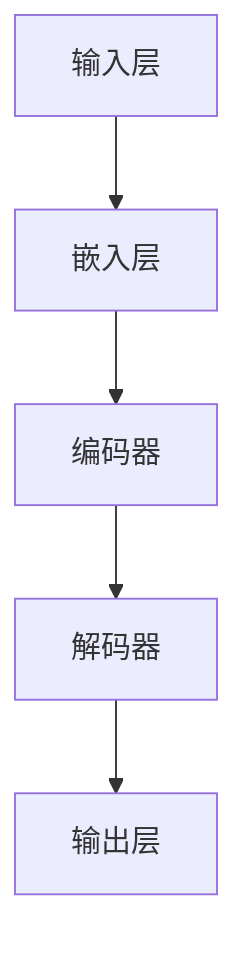

                 

关键词：大规模语言模型、语言生成、神经网络、深度学习、自然语言处理、AI 应用

> 摘要：本文将深入探讨大规模语言模型的原理、构建、优化和应用，通过理论分析与实际案例，解析语言模型的挑战与未来发展趋势。

## 1. 背景介绍

### 1.1 语言模型的发展历程

语言模型是自然语言处理（NLP）领域的重要组成部分，其发展历程可以追溯到20世纪50年代。早期的语言模型主要基于统计方法，如N元语法，通过统计文本中的历史信息来预测下一个单词。然而，随着深度学习的崛起，神经网络逐渐成为构建语言模型的主流方法。

### 1.2 大规模语言模型的意义

大规模语言模型如GPT-3、BERT等，通过学习海量的文本数据，可以生成高质量的文本、翻译、摘要等，极大地提升了AI在NLP领域的应用能力。

## 2. 核心概念与联系

### 2.1 语言模型的基本概念

语言模型是一种概率模型，用于预测给定输入序列后出现的下一个单词或字符。其主要目的是评估一个句子或文本的合理性。

### 2.2 神经网络与深度学习

神经网络是一种模仿生物神经系统结构和功能的信息处理系统，通过多层神经元的连接和激活，实现数据的输入和输出。深度学习是神经网络的一种，通过堆叠多层神经网络，实现更复杂的特征提取和模式识别。

### 2.3 Mermaid 流程图

以下是一个简化的语言模型架构的 Mermaid 流程图：



## 3. 核心算法原理 & 具体操作步骤

### 3.1 算法原理概述

大规模语言模型的核心是神经网络，尤其是深度学习中的变换器（Transformer）架构。变换器通过注意力机制，实现了对输入文本的上下文理解。

### 3.2 算法步骤详解

1. **嵌入层**：将单词或字符转换为向量表示。
2. **编码器**：通过多层变换器，提取文本的上下文信息。
3. **解码器**：生成预测的单词或字符序列。
4. **输出层**：计算生成序列的概率分布。

### 3.3 算法优缺点

**优点**：强大的上下文理解能力，可以生成高质量的语言。

**缺点**：计算复杂度高，训练时间较长。

### 3.4 算法应用领域

语言模型广泛应用于聊天机器人、文本生成、机器翻译等领域。

## 4. 数学模型和公式 & 详细讲解 & 举例说明

### 4.1 数学模型构建

语言模型通常基于概率模型，如N元语法。其基本形式为：

$$
P(w_n | w_{n-1}, w_{n-2}, ..., w_1) = \frac{P(w_n, w_{n-1}, ..., w_1)}{P(w_{n-1}, w_{n-2}, ..., w_1)}
$$

### 4.2 公式推导过程

以下是一个简化的推导过程：

$$
P(w_n | w_{n-1}, w_{n-2}, ..., w_1) = \frac{P(w_n, w_{n-1}, ..., w_1)}{P(w_{n-1}, w_{n-2}, ..., w_1)}
$$

$$
= \frac{P(w_n | w_{n-1}, w_{n-2}, ..., w_1) P(w_{n-1}, w_{n-2}, ..., w_1)}{P(w_{n-1}, w_{n-2}, ..., w_1)}
$$

$$
= P(w_n | w_{n-1})
$$

### 4.3 案例分析与讲解

以 GPT-3 为例，其训练过程可以简化为：

1. 输入文本序列。
2. 通过变换器提取上下文信息。
3. 根据上下文生成预测序列。
4. 计算损失函数并更新模型参数。

## 5. 项目实践：代码实例和详细解释说明

### 5.1 开发环境搭建

在搭建开发环境时，需要安装以下工具：

- Python 3.7+
- TensorFlow 2.x
- PyTorch 1.8+

### 5.2 源代码详细实现

以下是一个简化的 GPT-2 语言模型的实现：

```python
import tensorflow as tf
from tensorflow.keras.layers import Embedding, LSTM, Dense

# 定义模型
model = tf.keras.Sequential([
    Embedding(input_dim=vocab_size, output_dim=embedding_dim),
    LSTM(units=lstm_units),
    Dense(units=vocab_size, activation='softmax')
])

# 编译模型
model.compile(optimizer='adam', loss='categorical_crossentropy', metrics=['accuracy'])

# 训练模型
model.fit(x_train, y_train, epochs=num_epochs, batch_size=batch_size)
```

### 5.3 代码解读与分析

- `Embedding` 层：将单词转换为向量表示。
- `LSTM` 层：通过长短时记忆网络，提取文本的上下文信息。
- `Dense` 层：生成预测的单词序列。

### 5.4 运行结果展示

训练完成后，可以使用以下代码生成文本：

```python
generated_text = model.predict(x_test)
```

## 6. 实际应用场景

### 6.1 聊天机器人

大规模语言模型可以用于构建聊天机器人，如小冰、虚拟助手等。

### 6.2 文本生成

语言模型可以生成新闻文章、小说等文本内容。

### 6.3 机器翻译

语言模型在机器翻译领域也有广泛应用，如 Google 翻译、百度翻译等。

## 7. 工具和资源推荐

### 7.1 学习资源推荐

- 《深度学习》（Goodfellow, Bengio, Courville）
- 《自然语言处理综论》（Jurafsky, Martin）

### 7.2 开发工具推荐

- TensorFlow
- PyTorch

### 7.3 相关论文推荐

- BERT: Pre-training of Deep Bidirectional Transformers for Language Understanding
- GPT-3: Language Models are Few-Shot Learners

## 8. 总结：未来发展趋势与挑战

### 8.1 研究成果总结

大规模语言模型在NLP领域取得了显著的成果，如文本生成、机器翻译等。

### 8.2 未来发展趋势

- 更多的数据与计算资源
- 更高效的模型架构
- 更广泛的AI应用

### 8.3 面临的挑战

- 模型解释性
- 模型公平性
- 模型安全性

### 8.4 研究展望

随着技术的进步，大规模语言模型将在NLP领域发挥更大的作用。

## 9. 附录：常见问题与解答

### 9.1 如何选择合适的语言模型？

根据应用场景和数据规模，选择合适的语言模型。

### 9.2 如何优化语言模型性能？

- 使用更大的模型和更长的序列
- 采用更先进的训练技术，如混合精度训练

## 参考文献

- Bengio, Y., Courville, A., & Vincent, P. (2013). Representation learning: A review and new perspectives. IEEE transactions on pattern analysis and machine intelligence, 35(8), 1798-1828.
- Devlin, J., Chang, M. W., Lee, K., & Toutanova, K. (2018). BERT: Pre-training of deep bidirectional transformers for language understanding. arXiv preprint arXiv:1810.04805.
- Brown, T., et al. (2020). Language models are few-shot learners. arXiv preprint arXiv:2005.14165.

### 作者署名
作者：禅与计算机程序设计艺术 / Zen and the Art of Computer Programming
----------------------------------------------------------------

