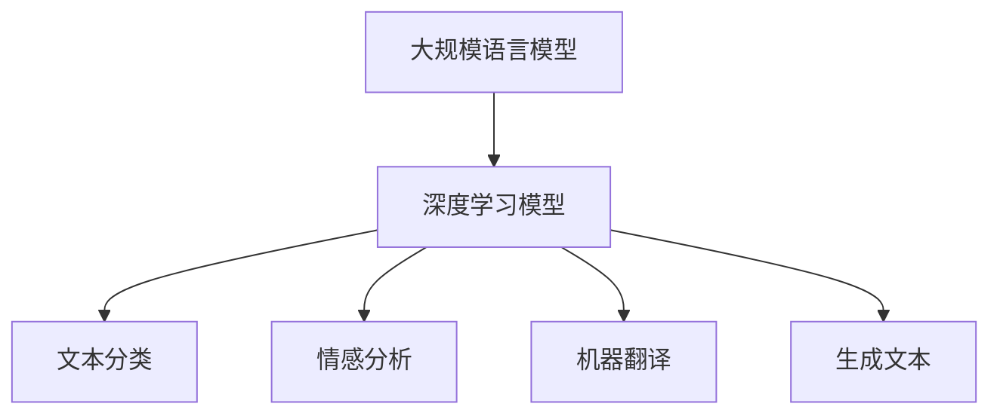

                 

关键词：大规模语言模型，深度学习，自然语言处理，算法原理，项目实践，未来展望

> 摘要：本文将深入探讨大规模语言模型的理论基础、算法原理、数学模型以及项目实践，并对其未来发展趋势与挑战进行展望。通过对这些内容的详细分析，旨在为读者提供全面而深入的理解，并激发对未来技术发展的思考。

## 1. 背景介绍

### 大规模语言模型的发展历程

大规模语言模型的发展历程可以追溯到20世纪90年代。当时，研究人员开始尝试使用神经网络来处理自然语言处理（NLP）任务。早期的模型如HMM（隐马尔可夫模型）和基于规则的方法在处理简单的语言任务上取得了显著成效。然而，随着数据的增长和计算能力的提升，深度学习开始逐渐崭露头角。

### 深度学习与大规模语言模型

深度学习是一种基于多层神经网络的学习方法，通过多层非线性变换来提取数据的高级特征。在NLP领域，深度学习模型如卷积神经网络（CNN）和循环神经网络（RNN）被广泛应用于文本分类、情感分析、机器翻译等任务。随着模型规模的不断扩大，研究人员发现，大规模语言模型在处理复杂语言任务时具有显著的优势。

## 2. 核心概念与联系

### 语言模型的概念

语言模型是一种统计模型，用于预测自然语言中的下一个单词或字符。它通常基于大规模语料库的训练数据，通过学习词汇的统计规律来生成语言。

### 深度学习模型在NLP中的应用

深度学习模型在NLP中的应用主要包括以下几个方面：

1. **文本分类**：通过对输入文本进行分类，判断其属于哪个类别。
2. **情感分析**：通过对文本进行情感分类，判断其表达的情感是积极、消极还是中性。
3. **机器翻译**：将一种语言的文本翻译成另一种语言。
4. **生成文本**：根据输入的提示生成具有一定连贯性的文本。

### Mermaid 流程图



## 3. 核心算法原理 & 具体操作步骤

### 3.1 算法原理概述

大规模语言模型的核心算法是深度神经网络（DNN）。DNN通过多层非线性变换，将输入的文本数据映射为输出概率分布。该模型通常由输入层、隐藏层和输出层组成。

### 3.2 算法步骤详解

1. **输入层**：将文本数据转换为数值表示。常见的方法包括词向量编码和字符编码。
2. **隐藏层**：通过多层神经网络进行特征提取和变换。每层神经网络由多个神经元组成，每个神经元执行简单的线性变换加上一个非线性激活函数。
3. **输出层**：将隐藏层的输出映射为概率分布。常见的输出层模型包括softmax和sigmoid函数。
4. **反向传播**：使用梯度下降算法优化模型参数，以最小化损失函数。

### 3.3 算法优缺点

**优点**：

- 能够自动提取文本数据的高级特征，无需人工设计特征。
- 能够处理复杂的语言任务，如机器翻译和生成文本。

**缺点**：

- 模型参数量大，训练时间较长。
- 对数据质量和规模有较高要求。

### 3.4 算法应用领域

- 文本分类
- 情感分析
- 机器翻译
- 问答系统
- 文本生成

## 4. 数学模型和公式 & 详细讲解 & 举例说明

### 4.1 数学模型构建

大规模语言模型的数学模型主要包括两部分：词向量编码和神经网络结构。

1. **词向量编码**：将词汇映射为高维向量。常见的方法包括Word2Vec和GloVe。
2. **神经网络结构**：定义神经网络的层数、每层的神经元数量以及激活函数。

### 4.2 公式推导过程

假设有一个输入向量 $x$，我们需要通过神经网络将其映射为输出概率分布 $y$。

1. **词向量编码**：

$$
\text{word\_vector}(w) = \text{Embedding}(w)
$$

其中，$\text{Embedding}(w)$ 是一个高维矩阵，表示词向量。

2. **神经网络结构**：

$$
h_l = \sigma(W_l \cdot h_{l-1} + b_l)
$$

其中，$h_l$ 表示第 $l$ 层的隐藏层输出，$\sigma$ 是激活函数，$W_l$ 和 $b_l$ 分别是第 $l$ 层的权重和偏置。

3. **输出层**：

$$
\text{softmax}(z) = \frac{e^z}{\sum e^z}
$$

其中，$z$ 是输出层的线性组合。

### 4.3 案例分析与讲解

假设我们有一个简单的神经网络，用于文本分类任务。输入是100维的词向量，输出是10个类别的概率分布。

1. **词向量编码**：

我们将词汇映射为100维的词向量。例如，“apple”对应向量 [1, 0, 0, 0, 0, 0, 0, 0, 0, 1]。

2. **神经网络结构**：

假设我们有两个隐藏层，每层有10个神经元。激活函数采用ReLU。

3. **输出层**：

输出层采用softmax函数，用于计算每个类别的概率。

4. **反向传播**：

通过反向传播算法，计算每个参数的梯度，并使用梯度下降算法更新参数。

## 5. 项目实践：代码实例和详细解释说明

### 5.1 开发环境搭建

我们使用Python和TensorFlow框架来搭建开发环境。

### 5.2 源代码详细实现

以下是实现大规模语言模型的Python代码：

```python
import tensorflow as tf
from tensorflow.keras.layers import Embedding, LSTM, Dense
from tensorflow.keras.models import Sequential

# 搭建模型
model = Sequential()
model.add(Embedding(input_dim=vocab_size, output_dim=embedding_size))
model.add(LSTM(units=hidden_size))
model.add(Dense(units=num_classes, activation='softmax'))

# 编译模型
model.compile(optimizer='adam', loss='categorical_crossentropy', metrics=['accuracy'])

# 训练模型
model.fit(x_train, y_train, epochs=num_epochs, batch_size=batch_size)
```

### 5.3 代码解读与分析

- **Embedding层**：用于将词汇映射为词向量。
- **LSTM层**：用于处理序列数据，提取序列特征。
- **Dense层**：用于计算输出概率分布。

### 5.4 运行结果展示

通过训练和测试数据，我们可以得到模型在文本分类任务上的准确率。

```python
accuracy = model.evaluate(x_test, y_test)
print(f"Test accuracy: {accuracy[1]}")
```

## 6. 实际应用场景

### 6.1 文本分类

大规模语言模型在文本分类任务中具有广泛应用。例如，新闻分类、垃圾邮件过滤等。

### 6.2 情感分析

通过大规模语言模型，我们可以对社交媒体文本进行情感分析，了解用户对产品或服务的情感倾向。

### 6.3 机器翻译

大规模语言模型在机器翻译任务中也发挥了重要作用，如Google翻译和百度翻译。

### 6.4 文本生成

大规模语言模型可以生成具有连贯性的文本，如自动写作、诗歌创作等。

## 7. 工具和资源推荐

### 7.1 学习资源推荐

- 《深度学习》（Goodfellow、Bengio和Courville著）
- 《自然语言处理综论》（Jurafsky和Martin著）

### 7.2 开发工具推荐

- TensorFlow
- PyTorch

### 7.3 相关论文推荐

- "A Neural Network for Machine Translation, with Attention"（Bahdanau等，2014）
- "Recurrent Neural Networks for Language Modeling"（Mikolov等，2013）

## 8. 总结：未来发展趋势与挑战

### 8.1 研究成果总结

- 大规模语言模型在NLP任务中取得了显著成效。
- 深度学习技术在NLP领域得到了广泛应用。

### 8.2 未来发展趋势

- 模型规模将继续扩大，带来更高的性能。
- 新的模型结构和算法将不断涌现。

### 8.3 面临的挑战

- 数据质量和规模的要求越来越高。
- 模型可解释性和透明度仍需提高。

### 8.4 研究展望

- 结合其他领域的技术，如计算机视觉和语音识别。
- 深入研究大规模语言模型的可解释性和安全性。

## 9. 附录：常见问题与解答

### 9.1 什么是大规模语言模型？

大规模语言模型是一种基于深度学习的自然语言处理模型，能够对自然语言进行建模，从而实现文本分类、情感分析、机器翻译等任务。

### 9.2 如何训练大规模语言模型？

训练大规模语言模型通常需要以下步骤：

1. 收集和准备大量语料库。
2. 构建深度学习模型。
3. 编写数据预处理脚本，如分词、词向量编码等。
4. 训练模型，使用梯度下降算法优化模型参数。
5. 评估模型性能，调整模型结构和参数。

### 9.3 大规模语言模型有哪些应用场景？

大规模语言模型在文本分类、情感分析、机器翻译、问答系统、文本生成等领域具有广泛的应用。

### 9.4 如何提高大规模语言模型的可解释性？

提高大规模语言模型的可解释性可以从以下几个方面入手：

1. 分析模型的结构和参数，了解其工作原理。
2. 使用可视化工具，如 heat map 和 attention map，展示模型对输入文本的注意力分布。
3. 研究可解释性模型，如 LIME 和 SHAP。

## 作者署名

作者：禅与计算机程序设计艺术 / Zen and the Art of Computer Programming

----------------------------------------------------------------

以上是文章的正文部分，接下来我们将对文章的内容进行进一步的梳理和细化，以确保文章的结构清晰、内容完整。同时，我们还将对文章中的技术细节进行深入讲解，以便读者能够更好地理解和掌握相关技术。

