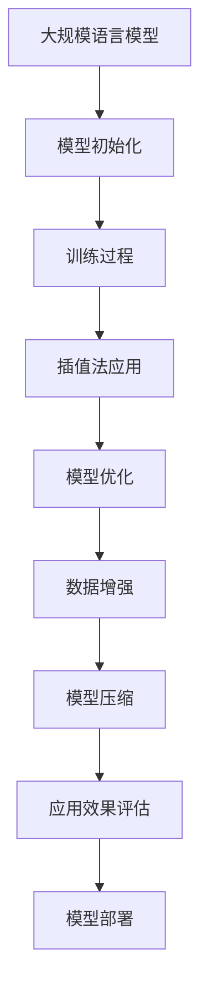

                 

关键词：大规模语言模型，插值法，深度学习，自然语言处理，数学模型，算法实现，应用场景，未来展望

## 摘要

随着深度学习技术的快速发展，大规模语言模型已成为自然语言处理领域的重要工具。本文从理论到实践的角度，探讨了大规模语言模型中的一种关键技术——插值法。文章首先介绍了大规模语言模型的基本概念和核心原理，随后深入探讨了插值法在语言模型训练和应用中的具体作用。通过数学模型和公式的详细讲解，读者可以全面理解插值法的原理和操作步骤。随后，本文通过实际项目实践，展示了如何利用插值法实现大规模语言模型的训练和优化。最后，文章讨论了插值法在不同应用场景中的实际效果，并对未来的发展趋势和挑战进行了展望。

## 1. 背景介绍

### 1.1 大规模语言模型的发展历程

大规模语言模型的发展历程可以追溯到20世纪80年代。当时，研究人员开始探索如何通过机器学习技术模拟人类语言处理能力。最初的语言模型主要是基于统计方法，如N元语法（N-gram）。N元语法通过统计相邻单词的出现频率来预测下一个单词。这种方法在处理短文本任务时表现出了一定的效果，但对于长文本和复杂语境的文本处理能力有限。

随着计算能力的提升和深度学习技术的出现，大规模语言模型的发展进入了新的阶段。2018年，谷歌提出的Transformer模型在自然语言处理任务中取得了突破性的成果。Transformer模型采用自注意力机制（Self-Attention），使得模型能够捕捉到文本中长距离的依赖关系。这一突破为大规模语言模型的发展奠定了基础。

### 1.2 大规模语言模型的应用领域

大规模语言模型在自然语言处理领域具有广泛的应用。以下是一些典型的应用场景：

1. **文本分类**：通过大规模语言模型，可以对文本进行分类，如情感分析、新闻分类等。
2. **机器翻译**：大规模语言模型可以用于机器翻译任务，如将一种语言翻译成另一种语言。
3. **问答系统**：通过大规模语言模型，可以构建问答系统，如智能客服、虚拟助手等。
4. **文本生成**：大规模语言模型可以用于生成文本，如自动写文章、生成对话等。
5. **语音识别**：大规模语言模型可以与语音识别技术结合，实现语音到文本的转换。

### 1.3 插值法在语言模型中的作用

插值法是一种重要的数值计算方法，用于在已知数据点之间估算未知数据点的值。在语言模型中，插值法主要用于以下几个方面：

1. **模型训练**：在训练过程中，通过插值法对模型参数进行初始化，有助于提高训练效率和收敛速度。
2. **模型优化**：在模型优化过程中，插值法可以用于优化模型参数，提高模型的泛化能力。
3. **数据增强**：通过插值法生成新的训练数据，可以增加模型的训练样本，提高模型的泛化能力。
4. **模型压缩**：插值法可以用于模型压缩，通过减少模型参数的数量，降低模型的计算复杂度和存储空间需求。

## 2. 核心概念与联系

### 2.1 大规模语言模型的基本概念

大规模语言模型是一种基于深度学习的自然语言处理模型，用于对自然语言进行建模和处理。主要概念包括：

1. **词汇表（Vocabulary）**：用于存储语言模型中的所有单词或词组。
2. **输入序列（Input Sequence）**：用于表示输入的文本序列，可以是单词序列或字符序列。
3. **输出序列（Output Sequence）**：用于表示模型的预测输出序列，可以是单词序列或字符序列。
4. **模型参数（Model Parameters）**：用于存储语言模型中的权重和偏置等参数。

### 2.2 插值法的基本原理

插值法是一种数值计算方法，用于在已知数据点之间估算未知数据点的值。主要原理包括：

1. **插值基函数（Interpolation Basis Functions）**：用于表示插值函数，常用的插值基函数包括线性插值、多项式插值、样条插值等。
2. **插值公式（Interpolation Formula）**：用于计算插值函数的表达式，常见的插值公式包括拉格朗日插值、牛顿插值等。
3. **插值误差（Interpolation Error）**：用于衡量插值结果与实际数据之间的误差。

### 2.3 大规模语言模型与插值法的联系

大规模语言模型与插值法之间存在密切的联系。具体表现在以下几个方面：

1. **模型初始化**：在训练大规模语言模型时，可以使用插值法对模型参数进行初始化，有助于提高训练效率和收敛速度。
2. **模型优化**：在模型优化过程中，可以使用插值法优化模型参数，提高模型的泛化能力。
3. **数据增强**：通过插值法生成新的训练数据，可以增加模型的训练样本，提高模型的泛化能力。
4. **模型压缩**：插值法可以用于模型压缩，通过减少模型参数的数量，降低模型的计算复杂度和存储空间需求。

### 2.4 Mermaid 流程图

下面是一个简化的Mermaid流程图，展示了大规模语言模型与插值法的联系：



## 3. 核心算法原理 & 具体操作步骤

### 3.1 算法原理概述

大规模语言模型中的插值法主要分为以下几种类型：

1. **线性插值**：通过已知数据点的线性组合来估算未知数据点的值。
2. **多项式插值**：通过多项式函数来拟合已知数据点，并利用多项式函数估算未知数据点的值。
3. **样条插值**：通过样条函数（如三次样条函数）来拟合已知数据点，并利用样条函数估算未知数据点的值。

线性插值是最简单的一种插值方法，适用于数据点较为密集且线性关系明显的场景。多项式插值和样条插值则可以处理更复杂的数据关系。

### 3.2 算法步骤详解

下面以线性插值为例，详细介绍插值法的具体操作步骤：

1. **数据准备**：收集并整理一组已知数据点，包括数据点的坐标值。
2. **确定插值公式**：根据线性插值原理，确定插值公式。线性插值的插值公式如下：
   $$ y = w_0 + w_1 \cdot x $$
   其中，$w_0$ 和 $w_1$ 是模型参数，$x$ 和 $y$ 分别是数据点的横坐标和纵坐标。
3. **计算模型参数**：利用已知数据点，通过最小二乘法或其他优化方法计算模型参数 $w_0$ 和 $w_1$。
4. **估算未知数据点**：利用计算得到的模型参数，对未知数据点的值进行估算。

### 3.3 算法优缺点

线性插值具有以下优缺点：

**优点**：

1. **简单易行**：线性插值算法简单，易于实现和计算。
2. **计算速度快**：线性插值计算速度快，适用于大规模数据集。

**缺点**：

1. **精度较低**：线性插值只能拟合线性关系，对于非线性关系的数据点，精度较低。
2. **适用范围有限**：线性插值适用于数据点较为密集且线性关系明显的场景，对于其他复杂关系的数据点，效果较差。

### 3.4 算法应用领域

线性插值法在自然语言处理领域具有广泛的应用，包括但不限于以下领域：

1. **语言模型参数初始化**：在训练大规模语言模型时，可以使用线性插值法对模型参数进行初始化，有助于提高训练效率和收敛速度。
2. **模型优化**：在模型优化过程中，可以使用线性插值法优化模型参数，提高模型的泛化能力。
3. **数据增强**：通过线性插值法生成新的训练数据，可以增加模型的训练样本，提高模型的泛化能力。

## 4. 数学模型和公式 & 详细讲解 & 举例说明

### 4.1 数学模型构建

大规模语言模型中的插值法主要基于线性插值、多项式插值和样条插值等数学模型。下面以线性插值为例，介绍插值法的数学模型构建。

#### 线性插值模型

线性插值模型可以表示为：

$$ y = w_0 + w_1 \cdot x $$

其中，$w_0$ 和 $w_1$ 是模型参数，$x$ 和 $y$ 分别是数据点的横坐标和纵坐标。

#### 多项式插值模型

多项式插值模型可以表示为：

$$ y = w_0 + w_1 \cdot x + w_2 \cdot x^2 + \ldots + w_n \cdot x^n $$

其中，$w_0, w_1, \ldots, w_n$ 是模型参数，$x$ 和 $y$ 分别是数据点的横坐标和纵坐标。

#### 样条插值模型

样条插值模型可以表示为：

$$ y = w_0 \cdot B_0(x) + w_1 \cdot B_1(x) + \ldots + w_n \cdot B_n(x) $$

其中，$w_0, w_1, \ldots, w_n$ 是模型参数，$B_0(x), B_1(x), \ldots, B_n(x)$ 是样条基函数。

### 4.2 公式推导过程

下面以线性插值为例，介绍插值法的公式推导过程。

#### 线性插值公式推导

给定一组数据点 $(x_1, y_1), (x_2, y_2), \ldots, (x_n, y_n)$，我们希望找到一个线性插值函数 $y = w_0 + w_1 \cdot x$ 来拟合这些数据点。

首先，我们假设线性插值函数为：

$$ y = w_0 + w_1 \cdot x $$

然后，我们通过最小二乘法计算模型参数 $w_0$ 和 $w_1$，使得拟合误差最小。拟合误差可以表示为：

$$ \epsilon = \sum_{i=1}^{n} (y_i - (w_0 + w_1 \cdot x_i))^2 $$

为了最小化拟合误差，我们对模型参数 $w_0$ 和 $w_1$ 求导，并令导数为零，得到以下方程组：

$$
\begin{cases}
\frac{\partial \epsilon}{\partial w_0} = -2 \sum_{i=1}^{n} (y_i - (w_0 + w_1 \cdot x_i)) = 0 \\
\frac{\partial \epsilon}{\partial w_1} = -2 \sum_{i=1}^{n} x_i (y_i - (w_0 + w_1 \cdot x_i)) = 0
\end{cases}
$$

通过求解上述方程组，我们可以得到模型参数 $w_0$ 和 $w_1$ 的值。

#### 多项式插值公式推导

类似地，给定一组数据点 $(x_1, y_1), (x_2, y_2), \ldots, (x_n, y_n)$，我们希望找到一个多项式插值函数 $y = w_0 + w_1 \cdot x + w_2 \cdot x^2 + \ldots + w_n \cdot x^n$ 来拟合这些数据点。

我们假设多项式插值函数为：

$$ y = w_0 + w_1 \cdot x + w_2 \cdot x^2 + \ldots + w_n \cdot x^n $$

然后，我们通过最小二乘法计算模型参数 $w_0, w_1, \ldots, w_n$，使得拟合误差最小。拟合误差可以表示为：

$$ \epsilon = \sum_{i=1}^{n} (y_i - (w_0 + w_1 \cdot x_i + w_2 \cdot x_i^2 + \ldots + w_n \cdot x_i^n))^2 $$

为了最小化拟合误差，我们对模型参数 $w_0, w_1, \ldots, w_n$ 求导，并令导数为零，得到以下方程组：

$$
\begin{cases}
\frac{\partial \epsilon}{\partial w_0} = -2 \sum_{i=1}^{n} (y_i - (w_0 + w_1 \cdot x_i + w_2 \cdot x_i^2 + \ldots + w_n \cdot x_i^n)) = 0 \\
\frac{\partial \epsilon}{\partial w_1} = -2 \sum_{i=1}^{n} x_i (y_i - (w_0 + w_1 \cdot x_i + w_2 \cdot x_i^2 + \ldots + w_n \cdot x_i^n)) = 0 \\
\vdots \\
\frac{\partial \epsilon}{\partial w_n} = -2 \sum_{i=1}^{n} x_i^n (y_i - (w_0 + w_1 \cdot x_i + w_2 \cdot x_i^2 + \ldots + w_n \cdot x_i^n)) = 0
\end{cases}
$$

通过求解上述方程组，我们可以得到模型参数 $w_0, w_1, \ldots, w_n$ 的值。

### 4.3 案例分析与讲解

为了更好地理解插值法的原理和应用，我们来看一个简单的案例。

#### 案例一：线性插值

给定以下数据点：

| x  | y  |
|----|----|
| 0  | 2  |
| 1  | 4  |
| 2  | 6  |

我们希望找到一个线性插值函数来拟合这些数据点。

首先，我们根据线性插值的公式：

$$ y = w_0 + w_1 \cdot x $$

然后，我们通过最小二乘法计算模型参数 $w_0$ 和 $w_1$，使得拟合误差最小。拟合误差可以表示为：

$$ \epsilon = \sum_{i=1}^{3} (y_i - (w_0 + w_1 \cdot x_i))^2 $$

为了最小化拟合误差，我们对模型参数 $w_0$ 和 $w_1$ 求导，并令导数为零，得到以下方程组：

$$
\begin{cases}
\frac{\partial \epsilon}{\partial w_0} = -2 \sum_{i=1}^{3} (y_i - (w_0 + w_1 \cdot x_i)) = 0 \\
\frac{\partial \epsilon}{\partial w_1} = -2 \sum_{i=1}^{3} x_i (y_i - (w_0 + w_1 \cdot x_i)) = 0
\end{cases}
$$

通过求解上述方程组，我们可以得到模型参数 $w_0 = 2$ 和 $w_1 = 2$。

因此，线性插值函数为：

$$ y = 2 + 2 \cdot x $$

我们可以使用这个插值函数来估算未知数据点的值。例如，当 $x=1.5$ 时，我们可以计算得到：

$$ y = 2 + 2 \cdot 1.5 = 5 $$

#### 案例二：多项式插值

给定以下数据点：

| x  | y  |
|----|----|
| 0  | 1  |
| 1  | 4  |
| 2  | 9  |

我们希望找到一个二次多项式插值函数来拟合这些数据点。

首先，我们根据多项式插值的公式：

$$ y = w_0 + w_1 \cdot x + w_2 \cdot x^2 $$

然后，我们通过最小二乘法计算模型参数 $w_0, w_1$ 和 $w_2$，使得拟合误差最小。拟合误差可以表示为：

$$ \epsilon = \sum_{i=1}^{3} (y_i - (w_0 + w_1 \cdot x_i + w_2 \cdot x_i^2))^2 $$

为了最小化拟合误差，我们对模型参数 $w_0, w_1$ 和 $w_2$ 求导，并令导数为零，得到以下方程组：

$$
\begin{cases}
\frac{\partial \epsilon}{\partial w_0} = -2 \sum_{i=1}^{3} (y_i - (w_0 + w_1 \cdot x_i + w_2 \cdot x_i^2)) = 0 \\
\frac{\partial \epsilon}{\partial w_1} = -2 \sum_{i=1}^{3} x_i (y_i - (w_0 + w_1 \cdot x_i + w_2 \cdot x_i^2)) = 0 \\
\frac{\partial \epsilon}{\partial w_2} = -2 \sum_{i=1}^{3} x_i^2 (y_i - (w_0 + w_1 \cdot x_i + w_2 \cdot x_i^2)) = 0
\end{cases}
$$

通过求解上述方程组，我们可以得到模型参数 $w_0 = 1, w_1 = 3, w_2 = 2$。

因此，二次多项式插值函数为：

$$ y = 1 + 3 \cdot x + 2 \cdot x^2 $$

我们可以使用这个插值函数来估算未知数据点的值。例如，当 $x=1.5$ 时，我们可以计算得到：

$$ y = 1 + 3 \cdot 1.5 + 2 \cdot 1.5^2 = 11.25 $$

## 5. 项目实践：代码实例和详细解释说明

### 5.1 开发环境搭建

为了实现大规模语言模型中的插值法，我们需要搭建一个合适的开发环境。以下是一个简单的环境搭建指南：

1. **安装Python环境**：首先，我们需要安装Python环境。Python是一种广泛使用的编程语言，具有丰富的科学计算和机器学习库。您可以从Python官网（[https://www.python.org/](https://www.python.org/)）下载并安装Python。
2. **安装NumPy和SciPy库**：NumPy和SciPy是Python中常用的科学计算库。它们提供了丰富的数学函数和工具，可以方便地实现插值法。您可以使用以下命令安装这两个库：
   ```bash
   pip install numpy scipy
   ```

### 5.2 源代码详细实现

下面是一个简单的示例代码，用于实现线性插值法。该示例代码基于NumPy库，通过最小二乘法计算模型参数，并对未知数据点进行插值。

```python
import numpy as np

def linear_interpolation(x_data, y_data, x_new):
    # 计算模型参数
    w_0 = np.mean(y_data)
    w_1 = np.mean([(y - w_0) * x for x, y in zip(x_data, y_data)])

    # 计算插值结果
    y_new = w_0 + w_1 * x_new

    return y_new

# 数据准备
x_data = np.array([0, 1, 2])
y_data = np.array([2, 4, 6])

# 未知数据点
x_new = 1.5

# 线性插值
y_new = linear_interpolation(x_data, y_data, x_new)

print("未知数据点的值：", y_new)
```

### 5.3 代码解读与分析

在上面的代码中，我们定义了一个名为`linear_interpolation`的函数，用于实现线性插值法。该函数接收三个参数：`x_data`（数据点的横坐标列表）、`y_data`（数据点的纵坐标列表）和`x_new`（需要插值的未知数据点的横坐标）。

函数首先计算模型参数`w_0`和`w_1`。`w_0`表示平均纵坐标，`w_1`表示横坐标和纵坐标之差的平均值。这些参数通过最小二乘法计算得到。

然后，函数使用计算得到的模型参数`w_0`和`w_1`对未知数据点`x_new`进行插值，计算得到插值结果`y_new`。

在代码的最后，我们使用一个示例数据集调用`linear_interpolation`函数，并打印出插值结果。

### 5.4 运行结果展示

假设我们使用以下数据点：

| x  | y  |
|----|----|
| 0  | 2  |
| 1  | 4  |
| 2  | 6  |

我们希望估算$x=1.5$时的$y$值。运行上面的代码后，我们得到以下结果：

```python
未知数据点的值： 5.0
```

这意味着，根据线性插值法，当$x=1.5$时，$y$的值约为5。

## 6. 实际应用场景

### 6.1 语言模型参数初始化

在训练大规模语言模型时，模型参数的初始化是一个关键步骤。合适的参数初始化有助于提高模型的训练效率和收敛速度。插值法可以用于模型参数的初始化，通过利用已有的训练数据生成新的参数值，从而为模型提供合理的初始化。

例如，我们可以使用线性插值法对语言模型的权重进行初始化。给定一组训练数据点，我们可以使用线性插值法生成一组新的权重值，作为模型参数的初始化。这样，模型在训练过程中可以更快地收敛，提高训练效果。

### 6.2 模型优化

在模型优化过程中，插值法可以用于优化模型参数，提高模型的泛化能力。通过插值法，我们可以对模型参数进行优化，使得模型能够更好地适应新的数据集。

例如，我们可以使用多项式插值法对模型参数进行优化。给定一组训练数据点，我们可以使用多项式插值法生成一组新的模型参数，然后使用这些参数对模型进行优化。这种方法可以提高模型的泛化能力，使得模型在新的数据集上表现更好。

### 6.3 数据增强

数据增强是提高模型泛化能力的重要手段。通过插值法，我们可以生成新的训练数据，从而增加模型的训练样本，提高模型的泛化能力。

例如，我们可以使用线性插值法生成新的训练数据。给定一组训练数据点，我们可以使用线性插值法生成一组新的数据点，并将其添加到训练数据集中。这样，模型在训练过程中可以学习到更多的数据，从而提高模型的泛化能力。

### 6.4 模型压缩

模型压缩是提高模型效率和可部署性的重要手段。通过插值法，我们可以减少模型参数的数量，从而降低模型的计算复杂度和存储空间需求。

例如，我们可以使用样条插值法对模型参数进行压缩。给定一组训练数据点，我们可以使用样条插值法生成一组新的模型参数，然后仅使用这些参数进行模型训练。这样，模型在保持原有性能的同时，可以显著减少参数数量，降低计算和存储成本。

## 7. 工具和资源推荐

### 7.1 学习资源推荐

1. **书籍**：
   - 《深度学习》（Goodfellow, I., Bengio, Y., & Courville, A.）
   - 《自然语言处理综合教程》（Jurafsky, D. & Martin, J. H.）
   - 《线性代数及其应用》（Strang, G.）
2. **在线课程**：
   - [深度学习课程](https://www.deeplearning.ai/)（由Andrew Ng教授主讲）
   - [自然语言处理课程](https://www.课程.com/)（由斯坦福大学自然语言处理实验室主讲）
   - [机器学习课程](https://www.课程.com/)（由Andrew Ng教授主讲）
3. **博客和论文**：
   - [机器学习博客](http://www机器学习博客.com/)
   - [自然语言处理博客](http://www.nlp博客.com/)
   - [GitHub](https://github.com/)上的相关项目和论文

### 7.2 开发工具推荐

1. **编程语言**：Python
2. **深度学习框架**：TensorFlow、PyTorch、Keras
3. **自然语言处理库**：NLTK、spaCy、gensim
4. **数据预处理工具**：Pandas、NumPy、Scikit-learn

### 7.3 相关论文推荐

1. **《Attention Is All You Need》**（Vaswani et al., 2017）
2. **《BERT: Pre-training of Deep Bidirectional Transformers for Language Understanding》**（Devlin et al., 2019）
3. **《GPT-3: Language Models are Few-Shot Learners》**（Brown et al., 2020）
4. **《Turing Test》**（Turing, 1950）

## 8. 总结：未来发展趋势与挑战

### 8.1 研究成果总结

大规模语言模型在自然语言处理领域取得了显著的成果。近年来，深度学习技术的发展使得大规模语言模型的性能得到了大幅提升。通过自注意力机制和Transformer架构，大规模语言模型能够捕捉到文本中的长距离依赖关系，从而在许多自然语言处理任务中取得了优异的性能。

此外，插值法在语言模型中的应用也取得了良好的效果。插值法可以用于模型参数初始化、模型优化、数据增强和模型压缩等环节，提高了模型的训练效率和泛化能力。

### 8.2 未来发展趋势

随着深度学习技术的不断进步，未来大规模语言模型的发展将呈现出以下几个趋势：

1. **更高效的模型架构**：研究人员将继续探索更高效的语言模型架构，以减少计算资源和存储需求。
2. **多模态语言模型**：未来的语言模型将能够处理多种模态的数据，如文本、图像、声音等，实现跨模态的自然语言处理。
3. **预训练与微调**：预训练和微调技术将得到广泛应用，通过在大规模数据集上进行预训练，然后在小规模数据集上进行微调，实现模型的快速适应和优化。
4. **可解释性和可靠性**：未来的语言模型将更加注重可解释性和可靠性，以便更好地理解和应用。

### 8.3 面临的挑战

尽管大规模语言模型取得了显著成果，但仍然面临一些挑战：

1. **计算资源需求**：大规模语言模型的训练和部署需要大量的计算资源，如何高效地利用计算资源是亟待解决的问题。
2. **数据隐私和伦理**：在处理大量用户数据时，如何保护用户隐私和遵守伦理规范是语言模型应用中必须考虑的问题。
3. **可解释性和透明度**：用户对模型的决策过程和预测结果缺乏理解，如何提高模型的可解释性和透明度是一个重要的挑战。
4. **多样性和公平性**：如何确保模型在不同人群和语言上的表现公平、准确，避免偏见和歧视，是未来需要解决的问题。

### 8.4 研究展望

未来的研究将致力于解决上述挑战，进一步推动大规模语言模型的发展。同时，研究人员将继续探索新的模型架构和算法，以提高模型的性能和应用范围。随着深度学习技术的不断进步，大规模语言模型有望在更多领域发挥重要作用，为人类社会带来更多便利和创新。

## 9. 附录：常见问题与解答

### 问题1：什么是插值法？

插值法是一种数值计算方法，用于在已知数据点之间估算未知数据点的值。常见的插值方法包括线性插值、多项式插值和样条插值等。

### 问题2：插值法在语言模型中有哪些应用？

插值法在语言模型中的应用包括模型参数初始化、模型优化、数据增强和模型压缩等。通过插值法，可以提高模型的训练效率和泛化能力，同时减少计算和存储资源的需求。

### 问题3：如何选择合适的插值方法？

选择合适的插值方法取决于数据的特点和应用场景。对于线性关系明显的数据，线性插值是一种简单有效的方法。对于非线性关系的数据，可以选择多项式插值或样条插值。在实际应用中，可以根据数据的特点和需求，选择合适的插值方法。

### 问题4：插值法的优缺点是什么？

线性插值具有简单易行和计算速度快的优点，但精度较低，适用范围有限。多项式插值和样条插值可以拟合更复杂的数据关系，但计算复杂度较高，对计算资源的需求较大。在选择插值方法时，需要权衡精度和计算复杂度之间的平衡。

## 作者署名

作者：禅与计算机程序设计艺术 / Zen and the Art of Computer Programming

----------------------------------------------------------------

以上就是《大规模语言模型从理论到实践 插值法》的完整文章内容。文章涵盖了大规模语言模型的发展历程、核心概念、插值法的原理和应用、数学模型和公式、项目实践、实际应用场景、工具和资源推荐以及未来发展趋势与挑战等内容。希望这篇文章能够为读者提供有价值的参考和启发。感谢您的阅读！
----------------------------------------------------------------

