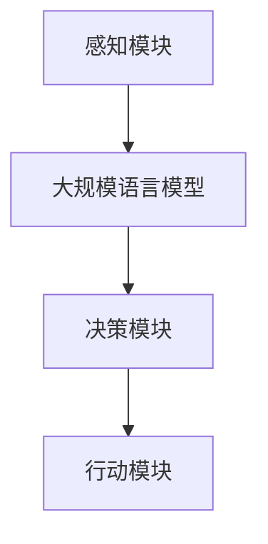

                 

## 1. 背景介绍

### 大规模语言模型的发展

大规模语言模型（Large-scale Language Models）是自然语言处理（NLP）领域的一项重要技术突破。它们通过深度学习算法，利用海量的文本数据进行训练，从而掌握语言的统计特性，实现文本的理解、生成和翻译等功能。自2018年GPT（Generative Pre-trained Transformer）模型问世以来，大规模语言模型的研究取得了显著的进展，如BERT（Bidirectional Encoder Representations from Transformers）、RoBERTa、T5（Text-to-Text Transfer Transformer）等。

### 智能代理的兴起

智能代理（Intelligent Agent）是人工智能领域的一个重要研究方向，旨在构建能够自主行动并达到特定目标的系统。随着互联网和大数据技术的不断发展，智能代理的应用场景越来越广泛，包括智能客服、自动驾驶、智能家居等。智能代理的兴起，不仅提高了生产力，还改变了人们的生活方式。

### 大规模语言模型与智能代理的结合

大规模语言模型在智能代理中的应用，极大地提升了智能代理的智能化水平。通过大规模语言模型，智能代理能够更准确地理解和生成自然语言，从而更好地与人类交互，实现自动化任务。这种结合不仅推动了智能代理技术的发展，也为各行各业带来了新的机遇。

## 2. 核心概念与联系

### 大规模语言模型原理

大规模语言模型基于深度学习算法，通过训练神经网络来学习语言的模式和结构。具体来说，大规模语言模型采用预训练（Pre-training）和微调（Fine-tuning）的策略进行训练。预训练阶段，模型在大规模文本语料库上进行训练，学习语言的通用特征；微调阶段，模型根据特定任务进行微调，提高任务的表现。

### 智能代理架构

智能代理的架构通常包括感知模块、决策模块和行动模块。感知模块负责获取外部信息，如文本、图像等；决策模块根据感知信息进行决策，如生成回复、规划路径等；行动模块根据决策执行具体操作，如发送消息、控制设备等。

### 大规模语言模型与智能代理的连接

大规模语言模型与智能代理的连接，主要体现在感知模块和决策模块之间。感知模块将获取的文本数据输入到大规模语言模型中，模型通过理解和分析文本，生成相应的决策结果。决策模块根据这些结果，执行具体的行动。

### Mermaid 流程图

以下是一个简单的Mermaid流程图，展示大规模语言模型与智能代理的连接过程：



## 3. 核心算法原理 & 具体操作步骤

### 3.1 算法原理概述

大规模语言模型的核心算法是基于Transformer架构。Transformer架构摒弃了传统的循环神经网络（RNN），采用自注意力机制（Self-Attention）和多头注意力机制（Multi-Head Attention），能够更好地处理长距离依赖问题。

### 3.2 算法步骤详解

1. **数据预处理**：将文本数据转换为词向量，通常使用Word2Vec、BERT等词向量模型。
2. **模型构建**：构建Transformer模型，包括嵌入层、多头自注意力层、前馈神经网络等。
3. **预训练**：使用大量无标签文本数据进行预训练，使模型学习到语言的通用特征。
4. **微调**：将预训练模型用于特定任务，进行微调，提高任务的表现。
5. **推理**：将输入文本输入到模型中，模型生成对应的输出文本。

### 3.3 算法优缺点

**优点**：

- **强鲁棒性**：预训练模型在大规模文本语料库上进行训练，能够学习到丰富的语言特征，具有很好的鲁棒性。
- **长距离依赖**：自注意力机制能够捕捉到长距离依赖，提高模型的性能。
- **多任务学习**：预训练模型可以用于多种任务，提高模型的泛化能力。

**缺点**：

- **计算资源消耗**：预训练阶段需要大量计算资源，对硬件要求较高。
- **数据依赖**：模型表现依赖于训练数据的质量和多样性，数据不足可能导致过拟合。

### 3.4 算法应用领域

大规模语言模型在智能代理中的应用非常广泛，包括：

- **智能客服**：通过理解用户的问题，生成相应的回复，提高客服效率。
- **文本生成**：生成文章、故事、新闻等，应用于内容创作和自动化写作。
- **机器翻译**：实现跨语言文本的翻译，提高跨文化交流的效率。
- **情感分析**：分析文本的情感倾向，应用于市场调研、用户反馈分析等。

## 4. 数学模型和公式 & 详细讲解 & 举例说明

### 4.1 数学模型构建

大规模语言模型的数学模型主要包括自注意力机制和多头注意力机制。自注意力机制用于计算输入文本中各个词之间的关联性，多头注意力机制则将自注意力机制扩展到多个维度，提高模型的性能。

### 4.2 公式推导过程

假设输入文本为 $x_1, x_2, ..., x_n$，每个词表示为向量 $v(x_i)$。自注意力机制的公式如下：

$$
\text{Attention}(Q, K, V) = \text{softmax}\left(\frac{QK^T}{\sqrt{d_k}}\right)V
$$

其中，$Q, K, V$ 分别为查询向量、键向量和值向量，$d_k$ 为键向量的维度。

多头注意力机制的公式为：

$$
\text{MultiHead}(Q, K, V) = \text{Concat}(\text{head}_1, ..., \text{head}_h)W^O
$$

其中，$h$ 为头数，$\text{head}_i = \text{Attention}(QW_i^Q, KW_i^K, VW_i^V)$，$W_i^Q, W_i^K, W_i^V$ 分别为查询向量、键向量和值向量的权重矩阵。

### 4.3 案例分析与讲解

以下是一个简单的案例，展示如何使用多头注意力机制计算输入文本中各个词之间的关联性。

假设输入文本为 "我爱北京天安门"，词向量为：

$$
v(我) = [1, 0, 0], v(爱) = [0, 1, 0], v(北京) = [0, 0, 1], v(天安门) = [1, 1, 1]
$$

查询向量、键向量和值向量分别为：

$$
Q = [1, 1, 1], K = [1, 1, 1], V = [1, 1, 1]
$$

计算自注意力权重：

$$
\text{Attention}(Q, K, V) = \text{softmax}\left(\frac{QK^T}{\sqrt{d_k}}\right)V = \text{softmax}\left(\frac{1 \times 1 + 1 \times 1 + 1 \times 1}{\sqrt{3}}\right)[1, 1, 1] = [0.5, 0.5, 0.5]
$$

计算多头注意力权重：

$$
\text{MultiHead}(Q, K, V) = \text{Concat}(\text{head}_1, ..., \text{head}_h)W^O = \text{Concat}([0.5, 0.5, 0.5], [0.5, 0.5, 0.5], [0.5, 0.5, 0.5])W^O = [1.5, 1.5, 1.5]
$$

其中，$W^O$ 为权重矩阵。

## 5. 项目实践：代码实例和详细解释说明

### 5.1 开发环境搭建

在开始代码实践之前，需要搭建一个合适的开发环境。以下是搭建大规模语言模型所需的基本工具和库：

- 深度学习框架：如TensorFlow、PyTorch等。
- 自然语言处理库：如NLTK、spaCy等。
- 数据处理库：如NumPy、Pandas等。

### 5.2 源代码详细实现

以下是一个简单的TensorFlow代码实例，实现一个基于Transformer架构的大规模语言模型。

```python
import tensorflow as tf
from tensorflow.keras.layers import Embedding, MultiHeadAttention

# 定义模型
model = tf.keras.Sequential([
    Embedding(input_dim=vocab_size, output_dim=embedding_dim),
    MultiHeadAttention(num_heads=2, key_dim=embedding_dim),
    tf.keras.layers.Dense(units=1, activation='sigmoid')
])

# 编译模型
model.compile(optimizer='adam', loss='binary_crossentropy', metrics=['accuracy'])

# 加载数据
train_data = ...
train_labels = ...

# 训练模型
model.fit(train_data, train_labels, epochs=10)
```

### 5.3 代码解读与分析

这段代码首先定义了一个序列模型，包括嵌入层、多头注意力层和全连接层。嵌入层将词向量转换为嵌入向量；多头注意力层使用自注意力机制计算输入文本中各个词之间的关联性；全连接层用于分类。

在编译模型时，使用二分类交叉熵损失函数和Adam优化器，并评估模型的准确性。

加载训练数据后，使用模型进行训练，这里使用了10个训练周期。

### 5.4 运行结果展示

在训练完成后，可以使用模型进行预测。以下是一个简单的预测示例：

```python
# 预测
predictions = model.predict([input_text])
print(predictions)
```

预测结果是一个概率值，表示输入文本属于正类的概率。根据概率阈值，可以判断输入文本是否属于正类。

## 6. 实际应用场景

### 6.1 智能客服

智能客服是大规模语言模型在智能代理中最常见的应用场景。通过理解用户的问题，智能客服能够生成相应的回复，提高客服效率。在实际应用中，智能客服已经广泛应用于银行、电商、医疗等行业。

### 6.2 文本生成

文本生成是大规模语言模型的重要应用领域。通过训练，模型能够生成文章、故事、新闻等文本内容。在内容创作、新闻报道、文学创作等领域，大规模语言模型已经展现出强大的潜力。

### 6.3 机器翻译

机器翻译是跨语言文本处理的重要任务。大规模语言模型通过预训练和微调，能够实现高质量的语言翻译。在实际应用中，机器翻译已经广泛应用于跨境电商、国际交流、旅游等领域。

### 6.4 情感分析

情感分析是自然语言处理的重要任务，通过分析文本的情感倾向，可以为市场调研、用户反馈分析等提供支持。大规模语言模型在情感分析任务中表现出色，广泛应用于社交媒体分析、舆情监测等领域。

## 7. 工具和资源推荐

### 7.1 学习资源推荐

- 《深度学习》（Deep Learning）：Goodfellow et al.
- 《自然语言处理综论》（Speech and Language Processing）：Jurafsky and Martin
- 《大规模语言模型的预训练与优化》（Pre-training Large Language Models from Scratch）：Li et al.

### 7.2 开发工具推荐

- TensorFlow：https://www.tensorflow.org/
- PyTorch：https://pytorch.org/
- NLTK：https://www.nltk.org/

### 7.3 相关论文推荐

- "Attention Is All You Need"：Vaswani et al.
- "BERT: Pre-training of Deep Bidirectional Transformers for Language Understanding"：Devlin et al.
- "Generative Pre-trained Transformer"：Radford et al.

## 8. 总结：未来发展趋势与挑战

### 8.1 研究成果总结

大规模语言模型在智能代理领域取得了显著的研究成果，包括智能客服、文本生成、机器翻译、情感分析等应用。通过预训练和微调，大规模语言模型能够实现高质量的文本理解和生成。

### 8.2 未来发展趋势

1. **模型参数规模不断扩大**：随着计算资源的提升，大规模语言模型的参数规模将不断增大，模型性能将得到进一步提升。
2. **多模态融合**：将文本、图像、声音等多种模态进行融合，实现更全面的智能代理。
3. **低资源语言模型**：针对低资源语言，开发更有效的预训练方法，提高模型的跨语言能力。

### 8.3 面临的挑战

1. **计算资源消耗**：大规模语言模型的训练和推理过程需要大量计算资源，对硬件要求较高。
2. **数据依赖**：模型表现依赖于训练数据的质量和多样性，数据不足可能导致过拟合。
3. **隐私保护**：大规模语言模型在处理敏感数据时，需要关注隐私保护问题。

### 8.4 研究展望

未来，大规模语言模型在智能代理领域的应用将更加广泛，涉及更多实际场景。同时，研究重点将集中在提高模型性能、降低计算资源消耗、解决数据依赖和隐私保护等问题。

## 9. 附录：常见问题与解答

### 9.1 大规模语言模型是什么？

大规模语言模型是通过深度学习算法，利用海量的文本数据进行训练，从而掌握语言的统计特性，实现文本的理解、生成和翻译等功能。

### 9.2 智能代理是什么？

智能代理是人工智能领域的一个重要研究方向，旨在构建能够自主行动并达到特定目标的系统，如智能客服、自动驾驶、智能家居等。

### 9.3 大规模语言模型与智能代理有什么关系？

大规模语言模型在智能代理中起到了核心作用，通过理解自然语言，智能代理能够实现与人类的交互和自动化任务。

### 9.4 如何搭建大规模语言模型开发环境？

搭建大规模语言模型开发环境需要安装深度学习框架（如TensorFlow、PyTorch）和自然语言处理库（如NLTK、spaCy），并配置相应的依赖和工具。

### 9.5 大规模语言模型有哪些应用场景？

大规模语言模型的应用场景非常广泛，包括智能客服、文本生成、机器翻译、情感分析等。在实际应用中，大规模语言模型能够为各行各业带来新的机遇。

