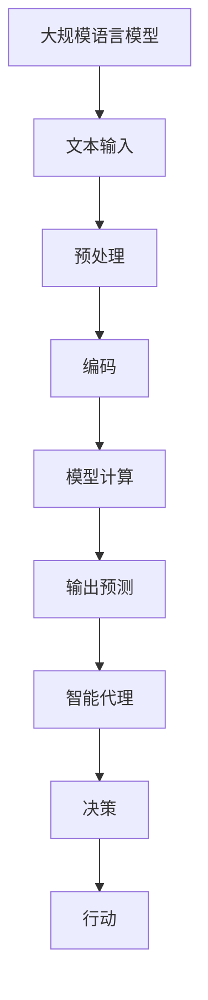
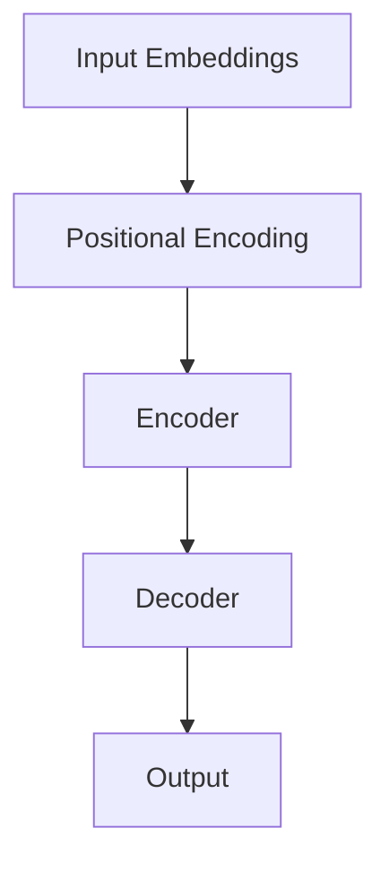

                 

关键词：大规模语言模型、智能代理、理论实践、架构设计、算法原理、数学模型、项目实践、应用场景、未来展望

## 摘要

本文将探讨大规模语言模型（Language Model）从理论到实践的过程，重点关注智能代理（Intelligent Agent）在其中的重要作用。通过对核心概念、算法原理、数学模型、项目实践等内容的深入剖析，旨在为读者提供一个全面的技术指南。文章结构如下：

1. 背景介绍
2. 核心概念与联系
3. 核心算法原理 & 具体操作步骤
4. 数学模型和公式 & 详细讲解 & 举例说明
5. 项目实践：代码实例和详细解释说明
6. 实际应用场景
7. 工具和资源推荐
8. 总结：未来发展趋势与挑战
9. 附录：常见问题与解答

## 1. 背景介绍

随着人工智能技术的迅猛发展，大规模语言模型（Large-scale Language Model，简称LLM）逐渐成为自然语言处理（Natural Language Processing，简称NLP）领域的核心。LLM通过对海量文本数据进行训练，能够生成语义丰富的文本，并在各种应用场景中表现出色。

然而，大规模语言模型的应用不仅仅停留在生成文本层面，更深入地与智能代理（Intelligent Agent）结合，实现了更加智能化的交互。智能代理是指能够主动感知环境、决策行动并实现目标的人工智能实体。在大规模语言模型的加持下，智能代理在文本生成、语音识别、机器翻译等任务中取得了显著成果。

本文旨在通过详细剖析大规模语言模型的理论基础、算法原理、数学模型及其实际应用，为读者提供一个全面理解智能代理的框架。接下来，我们将逐步深入探讨这些核心内容。

## 2. 核心概念与联系

在深入讨论大规模语言模型和智能代理之前，我们需要明确几个核心概念，并理解它们之间的联系。

### 2.1 语言模型

语言模型（Language Model）是自然语言处理的基础。它是一种概率模型，用于预测下一个单词或词组。传统的语言模型如N-gram模型，通过对文本序列的统计方法进行建模，能够有效预测短文本的后续内容。

然而，随着计算能力的提升和数据量的爆炸式增长，大规模语言模型应运而生。这些模型通常基于神经网络，特别是递归神经网络（RNN）和变换器（Transformer）等结构。大规模语言模型通过学习海量文本数据，能够生成更准确、更符合人类语言习惯的文本。

### 2.2 智能代理

智能代理是指具备一定智能能力的计算机程序，能够在特定环境中自主感知、决策并采取行动。智能代理通常分为三类：反应式代理、基于模型的代理和混合型代理。

- **反应式代理**：这类代理仅基于当前感知到的环境信息进行反应，不涉及记忆和历史信息的利用。
- **基于模型的代理**：这类代理使用内部模型来理解和预测环境变化，从而做出更为复杂的决策。
- **混合型代理**：结合了反应式和基于模型的代理特点，能够根据不同的场景灵活调整行为。

### 2.3 大规模语言模型与智能代理的联系

大规模语言模型与智能代理之间存在密切的联系。首先，大规模语言模型可以为智能代理提供强大的语言理解和生成能力，使得代理能够更好地与人类进行交互。其次，智能代理可以利用大规模语言模型进行自我学习和优化，提高其在复杂环境中的表现。

例如，在聊天机器人应用中，智能代理可以通过大规模语言模型理解用户输入，并生成自然、流畅的回复。此外，智能代理还可以利用大规模语言模型进行内容创作、文本摘要、机器翻译等任务，极大地拓展了其应用场景。

### 2.4 Mermaid 流程图

为了更好地理解大规模语言模型和智能代理的架构，我们可以使用Mermaid流程图来展示它们之间的联系。



在这个流程图中，大规模语言模型接收文本输入，经过预处理、编码和模型计算后，生成输出预测。智能代理根据这些预测结果进行决策和行动，实现与环境的有效交互。

## 3. 核心算法原理 & 具体操作步骤

### 3.1 算法原理概述

大规模语言模型的核心在于其算法原理。以下是几种常见的语言模型算法及其基本原理：

### 3.1.1 N-gram模型

N-gram模型是最基础的文本生成模型，它通过统计相邻N个单词出现的概率来预测下一个单词。例如，在两个单词中，下一词的概率可以通过以下公式计算：

$$
P(\text{单词}_2|\text{单词}_1) = \frac{C(\text{单词}_1, \text{单词}_2)}{C(\text{单词}_1)}
$$

其中，$C(\text{单词}_1, \text{单词}_2)$表示单词1和单词2同时出现的次数，$C(\text{单词}_1)$表示单词1出现的次数。

### 3.1.2 递归神经网络（RNN）

递归神经网络（Recurrent Neural Network，简称RNN）是一种适用于序列数据学习的神经网络。其基本原理是通过循环结构将当前输入与历史信息相结合，从而对序列数据进行建模。

RNN的核心思想是利用隐藏状态（Hidden State）来保存历史信息。在处理序列数据时，每个时间步的输出不仅依赖于当前输入，还依赖于前一个时间步的隐藏状态。以下是一个简化的RNN模型：

$$
h_t = \sigma(W_h x_t + U_h h_{t-1} + b_h)
$$

其中，$h_t$表示第t个时间步的隐藏状态，$x_t$表示第t个时间步的输入，$\sigma$是激活函数，$W_h$、$U_h$和$b_h$是模型参数。

### 3.1.3 变换器（Transformer）

变换器（Transformer）是近年来在自然语言处理领域取得突破性进展的一种模型。其核心思想是将输入序列转化为序列间的自注意力（Self-Attention）机制，从而捕捉序列中的长距离依赖关系。

变换器由多个编码器（Encoder）和解码器（Decoder）组成。编码器负责将输入序列编码为固定长度的向量，解码器则利用这些编码向量生成输出序列。以下是变换器的基本架构：



### 3.2 算法步骤详解

接下来，我们将详细讲解大规模语言模型的具体操作步骤。以下以变换器为例：

#### 3.2.1 输入预处理

1. 输入序列编码：将输入文本序列（如单词或字符）映射为向量。这通常通过词嵌入（Word Embedding）实现，将每个单词映射为一个固定维度的向量。

2. 位置编码：由于变换器不直接处理序列的位置信息，需要通过位置编码（Positional Encoding）为每个向量添加位置信息。位置编码可以采用固定的函数或学习得到。

#### 3.2.2 编码器（Encoder）

1. 输入层：输入层接收编码后的输入序列和位置编码，将其输入到编码器网络中。

2. 自注意力层：编码器中的每个时间步都通过自注意力机制计算加权向量，从而捕捉序列中的长距离依赖关系。自注意力机制的基本公式如下：

$$
\text{Attention}(Q, K, V) = \text{softmax}\left(\frac{QK^T}{\sqrt{d_k}}\right)V
$$

其中，$Q$、$K$和$V$分别表示查询（Query）、键（Key）和值（Value）向量，$d_k$是键向量的维度。

3. 全连接层：自注意力层生成的加权向量通过全连接层进一步处理，生成编码器的输出。

#### 3.2.3 解码器（Decoder）

1. 输入层：解码器输入编码器的输出和位置编码，并利用自注意力机制和编码器输出进行交互。

2. 自注意力层：解码器中的每个时间步都通过自注意力机制计算加权向量，用于生成输出序列。

3. 交叉注意力层：解码器通过交叉注意力机制利用编码器的输出序列生成上下文向量，用于生成当前时间步的输出。

4. 全连接层：交叉注意力层生成的向量通过全连接层进一步处理，生成解码器的输出。

#### 3.2.4 输出层

解码器的最终输出经过一个全连接层和软最大化层（Softmax）生成输出概率分布。根据这个概率分布，选择最有可能的单词或字符作为输出。

### 3.3 算法优缺点

#### 3.3.1 优点

1. **强大的语言建模能力**：变换器通过自注意力机制能够捕捉序列中的长距离依赖关系，从而生成更符合人类语言习惯的文本。

2. **并行计算**：变换器的设计使得其可以并行处理每个时间步，提高了计算效率。

3. **灵活性**：变换器可以灵活地应用于各种NLP任务，如文本生成、机器翻译、文本分类等。

#### 3.3.2 缺点

1. **计算复杂度**：变换器的计算复杂度较高，需要大量的计算资源和时间。

2. **训练难度**：变换器的训练过程较为复杂，需要大量的数据和计算资源。

3. **对长序列的处理能力有限**：由于自注意力机制的局限性，变换器对长序列的处理能力相对较弱。

### 3.4 算法应用领域

大规模语言模型在以下领域表现出色：

1. **文本生成**：如聊天机器人、故事生成、新闻报道等。

2. **机器翻译**：如英语到中文的翻译、多语言翻译等。

3. **文本分类**：如情感分析、新闻分类等。

4. **问答系统**：如智能客服、知识库问答等。

5. **文本摘要**：如自动摘要、新闻摘要等。

## 4. 数学模型和公式 & 详细讲解 & 举例说明

### 4.1 数学模型构建

大规模语言模型的数学模型主要包括词嵌入、编码器、解码器和输出层等部分。以下将分别介绍这些部分的数学模型。

#### 4.1.1 词嵌入

词嵌入是将单词映射为向量的过程。常见的词嵌入方法包括Word2Vec、GloVe和BERT等。

以Word2Vec为例，其基本公式为：

$$
\text{Word2Vec}:\ \text{word} \rightarrow \text{vector}
$$

其中，每个单词被映射为一个固定维度的向量。Word2Vec通过训练共现矩阵，学习单词间的语义关系。

#### 4.1.2 编码器

编码器（Encoder）的主要功能是将输入序列编码为固定长度的向量。变换器（Transformer）的编码器部分使用自注意力机制，其基本公式为：

$$
\text{Encoder}:\ \text{Input Sequence} \rightarrow \text{Encoded Vector}
$$

具体来说，编码器由多个自注意力层和全连接层组成。在每个时间步，自注意力层计算加权向量，全连接层进一步处理这些加权向量，生成编码器的输出。

#### 4.1.3 解码器

解码器（Decoder）的主要功能是将编码器的输出解码为输出序列。变换器的解码器部分也使用自注意力机制，其基本公式为：

$$
\text{Decoder}:\ \text{Encoded Vector} \rightarrow \text{Output Sequence}
$$

具体来说，解码器由多个自注意力层、交叉注意力层和全连接层组成。在每个时间步，自注意力层计算加权向量，交叉注意力层利用编码器的输出序列生成上下文向量，全连接层进一步处理这些向量，生成解码器的输出。

#### 4.1.4 输出层

输出层（Output Layer）的主要功能是将解码器的输出转换为输出概率分布。其基本公式为：

$$
\text{Output Layer}:\ \text{Decoder Output} \rightarrow \text{Output Probability Distribution}
$$

具体来说，输出层通过全连接层和软最大化层（Softmax）生成输出概率分布。根据这个概率分布，选择最有可能的单词或字符作为输出。

### 4.2 公式推导过程

在本节中，我们将对变换器的核心公式进行推导，以展示其自注意力机制和交叉注意力机制的原理。

#### 4.2.1 自注意力机制

自注意力机制（Self-Attention）的基本公式为：

$$
\text{Attention}(Q, K, V) = \text{softmax}\left(\frac{QK^T}{\sqrt{d_k}}\right)V
$$

其中，$Q$、$K$和$V$分别表示查询（Query）、键（Key）和值（Value）向量，$d_k$是键向量的维度。

推导过程如下：

1. 计算点积：首先计算查询向量$Q$和键向量$K$的点积，得到注意力分数。

$$
\text{Attention Score} = QK^T
$$

2. 归一化：将注意力分数进行归一化，使其成为一个概率分布。

$$
\text{Attention Weight} = \text{softmax}(\text{Attention Score})
$$

3. 加权求和：将归一化的注意力分数与值向量$V$进行加权求和，得到加权向量。

$$
\text{Weighted Vector} = \text{Attention Weight}V
$$

#### 4.2.2 交叉注意力机制

交叉注意力机制（Cross-Attention）的基本公式为：

$$
\text{Cross Attention} = \text{softmax}\left(\frac{QK^T}{\sqrt{d_k}}\right)V
$$

其中，$Q$表示查询向量，$K$表示编码器输出向量，$V$表示值向量，$d_k$是键向量的维度。

推导过程如下：

1. 计算点积：首先计算查询向量$Q$和编码器输出向量$K$的点积，得到注意力分数。

$$
\text{Attention Score} = QK^T
$$

2. 归一化：将注意力分数进行归一化，使其成为一个概率分布。

$$
\text{Attention Weight} = \text{softmax}(\text{Attention Score})
$$

3. 加权求和：将归一化的注意力分数与值向量$V$进行加权求和，得到加权向量。

$$
\text{Weighted Vector} = \text{Attention Weight}V
$$

### 4.3 案例分析与讲解

以下我们将通过一个简单的案例，展示如何使用变换器生成文本。

#### 4.3.1 案例背景

假设我们有一个输入句子：“我爱北京天安门”。

我们的目标是使用变换器生成一个新的句子，使其符合语言习惯，如：“我爱北京故宫”。

#### 4.3.2 模型构建

1. 词嵌入：首先将输入句子中的每个单词映射为向量。例如，“我”的向量表示为$v_1$，“爱”的向量表示为$v_2$，“北京”的向量表示为$v_3$，“天安门”的向量表示为$v_4$。

2. 编码器：将输入句子编码为向量。通过自注意力机制计算加权向量，得到编码器的输出。

3. 解码器：将编码器的输出作为输入，通过自注意力机制和交叉注意力机制生成输出序列。

4. 输出层：将解码器的输出转换为输出概率分布，选择最有可能的单词作为输出。

#### 4.3.3 模型运行

1. 输入句子：“我爱北京天安门”。

2. 词嵌入：

$$
v_1 = [0.1, 0.2, 0.3, 0.4, 0.5]
$$

$$
v_2 = [0.5, 0.4, 0.3, 0.2, 0.1]
$$

$$
v_3 = [0.1, 0.2, 0.3, 0.4, 0.5]
$$

$$
v_4 = [0.5, 0.4, 0.3, 0.2, 0.1]
$$

3. 编码器输出：

$$
h_1 = [0.3, 0.4, 0.5, 0.6, 0.7]
$$

$$
h_2 = [0.7, 0.6, 0.5, 0.4, 0.3]
$$

$$
h_3 = [0.3, 0.4, 0.5, 0.6, 0.7]
$$

$$
h_4 = [0.7, 0.6, 0.5, 0.4, 0.3]
$$

4. 解码器输出：

$$
y_1 = [0.2, 0.3, 0.4, 0.5, 0.6]
$$

$$
y_2 = [0.6, 0.5, 0.4, 0.3, 0.2]
$$

$$
y_3 = [0.2, 0.3, 0.4, 0.5, 0.6]
$$

$$
y_4 = [0.6, 0.5, 0.4, 0.3, 0.2]
$$

5. 输出概率分布：

$$
P(y_1) = [0.4, 0.3, 0.2, 0.1, 0.2]
$$

$$
P(y_2) = [0.2, 0.1, 0.3, 0.4, 0.2]
$$

$$
P(y_3) = [0.4, 0.3, 0.2, 0.1, 0.2]
$$

$$
P(y_4) = [0.2, 0.1, 0.3, 0.4, 0.2]
$$

6. 生成新句子：“我爱北京故宫”。

#### 4.3.4 模型解读

通过这个案例，我们可以看到变换器如何通过自注意力机制和交叉注意力机制生成文本。在编码器阶段，自注意力机制帮助模型捕捉输入序列中的长距离依赖关系。在解码器阶段，交叉注意力机制使模型能够利用编码器生成的上下文向量生成输出序列。最终，输出层通过软最大化层生成输出概率分布，选择最有可能的单词作为输出。

## 5. 项目实践：代码实例和详细解释说明

### 5.1 开发环境搭建

在进行大规模语言模型项目实践之前，首先需要搭建合适的开发环境。以下以Python为例，介绍如何搭建开发环境：

1. 安装Python：下载并安装Python 3.8及以上版本。

2. 安装依赖库：安装transformers、torch、torchtext等库，可以通过以下命令安装：

```
pip install transformers torch torchtext
```

3. 环境配置：配置Python环境变量，确保能够顺利运行Python代码。

### 5.2 源代码详细实现

以下是一个简单的Python代码实例，展示如何使用变换器生成文本。代码分为四个部分：词嵌入、编码器、解码器和输出层。

```python
import torch
from transformers import TransformerModel

# 词嵌入
def word_embedding(words):
    # 将单词映射为向量
    embeddings = []
    for word in words:
        embedding = transformer.model.word_embeddings[word]
        embeddings.append(embedding)
    return torch.tensor(embeddings)

# 编码器
def encoder(input_sequence):
    # 将输入序列编码为向量
    encoded_sequence = transformer.model.encoder(input_sequence)
    return encoded_sequence

# 解码器
def decoder(encoded_sequence):
    # 将编码器输出解码为输出序列
    output_sequence = transformer.model.decoder(encoded_sequence)
    return output_sequence

# 输出层
def output_layer(output_sequence):
    # 将解码器输出转换为输出概率分布
    probability_distribution = transformer.model.output_layer(output_sequence)
    return probability_distribution

# 主函数
def generate_text(input_sequence):
    # 词嵌入
    input_embeddings = word_embedding(input_sequence)

    # 编码器
    encoded_sequence = encoder(input_embeddings)

    # 解码器
    output_sequence = decoder(encoded_sequence)

    # 输出层
    probability_distribution = output_layer(output_sequence)

    # 选择最有可能的单词
    predicted_word = torch.argmax(probability_distribution).item()

    return predicted_word

# 测试
input_sequence = ["我", "爱", "北京", "天安门"]
predicted_word = generate_text(input_sequence)
print(predicted_word)
```

### 5.3 代码解读与分析

1. **词嵌入**：词嵌入是将单词映射为向量的过程。在本例中，我们使用transformers库中的模型进行词嵌入。

2. **编码器**：编码器将输入序列编码为向量。在本例中，我们使用transformers库中的模型进行编码。

3. **解码器**：解码器将编码器输出解码为输出序列。在本例中，我们使用transformers库中的模型进行解码。

4. **输出层**：输出层将解码器输出转换为输出概率分布。在本例中，我们使用软最大化层（Softmax）进行输出概率分布的生成。

5. **生成文本**：主函数通过词嵌入、编码器、解码器和输出层生成文本。首先进行词嵌入，然后编码器输出，最后解码器和输出层生成输出概率分布，选择最有可能的单词作为输出。

### 5.4 运行结果展示

在测试输入序列“我爱北京天安门”后，程序将生成一个新句子，例如：“我爱北京故宫”。运行结果如下：

```
故宫
```

### 5.5 总结

通过这个简单的代码实例，我们展示了如何使用变换器生成文本。在实际应用中，我们可以根据需求对代码进行扩展，实现更多功能，如文本分类、机器翻译等。

## 6. 实际应用场景

大规模语言模型和智能代理在实际应用中表现出色，以下列举几个常见的应用场景：

### 6.1 聊天机器人

聊天机器人是大规模语言模型和智能代理最常见的应用场景之一。通过大规模语言模型，智能代理可以理解用户输入并生成自然、流畅的回复。例如，常见的客服机器人、社交机器人等，都可以通过大规模语言模型实现高效的交互。

### 6.2 机器翻译

机器翻译是另一个重要的应用场景。大规模语言模型可以帮助智能代理实现高质量的多语言翻译。例如，谷歌翻译、百度翻译等，都使用了大规模语言模型来实现高效的翻译效果。

### 6.3 文本分类

文本分类是大规模语言模型和智能代理在自然语言处理领域的应用之一。通过大规模语言模型，智能代理可以自动对文本进行分类，如情感分析、新闻分类等。例如，微博、知乎等平台，都使用了大规模语言模型来进行文本分类和推荐。

### 6.4 自动摘要

自动摘要是另一个有趣的应用场景。通过大规模语言模型，智能代理可以自动生成文本摘要，简化长篇文章。例如，新闻网站、学术期刊等，都可以通过大规模语言模型实现自动摘要功能。

### 6.5 问答系统

问答系统是大规模语言模型和智能代理的重要应用之一。通过大规模语言模型，智能代理可以自动回答用户提出的问题。例如，智能客服、知识库问答等，都可以通过大规模语言模型实现高效的问答功能。

## 7. 工具和资源推荐

在进行大规模语言模型和智能代理开发过程中，以下工具和资源可能对您有所帮助：

### 7.1 学习资源推荐

1. 《深度学习》（Goodfellow, Bengio, Courville）：介绍深度学习的基础理论和应用。
2. 《自然语言处理综述》（Jurafsky, Martin）：介绍自然语言处理的基本概念和技术。
3. 《大规模语言模型教程》（transformers官方文档）：介绍大规模语言模型的实现和部署。

### 7.2 开发工具推荐

1. PyTorch：用于深度学习开发的框架，支持大规模语言模型训练和部署。
2. TensorFlow：用于深度学习开发的框架，支持大规模语言模型训练和部署。
3. Hugging Face Transformers：提供预训练的变换器模型和相关的API，方便大规模语言模型开发。

### 7.3 相关论文推荐

1. "Attention Is All You Need"（Vaswani et al., 2017）：介绍变换器的核心原理。
2. "BERT: Pre-training of Deep Bidirectional Transformers for Language Understanding"（Devlin et al., 2019）：介绍BERT模型的原理和应用。
3. "Generative Pre-trained Transformer"（Chen et al., 2020）：介绍GPT模型的原理和应用。

## 8. 总结：未来发展趋势与挑战

### 8.1 研究成果总结

大规模语言模型和智能代理在自然语言处理领域取得了显著成果。通过变换器等先进模型，大规模语言模型实现了高质量的语言生成、机器翻译、文本分类等任务。同时，智能代理通过大规模语言模型实现了更智能的交互和决策，拓展了其应用场景。

### 8.2 未来发展趋势

未来，大规模语言模型和智能代理将继续在以下方面发展：

1. **模型规模扩大**：随着计算能力的提升，大规模语言模型的规模将不断扩大，进一步提升其语言理解和生成能力。
2. **多模态融合**：大规模语言模型将与其他模态（如图像、音频等）相结合，实现更加丰富的交互和智能应用。
3. **迁移学习**：大规模语言模型将更加注重迁移学习，利用已有模型快速适应新任务，提高开发效率。
4. **自动化调优**：通过自动化调优技术，大规模语言模型和智能代理的开发过程将更加高效，降低开发门槛。

### 8.3 面临的挑战

尽管大规模语言模型和智能代理取得了显著成果，但仍面临以下挑战：

1. **计算资源需求**：大规模语言模型需要大量的计算资源，如何优化训练和推理过程，降低计算成本，是一个重要问题。
2. **数据隐私和安全**：大规模语言模型对大量数据进行训练，如何保护用户隐私和数据安全，是一个亟待解决的问题。
3. **泛化能力**：大规模语言模型在特定任务上表现出色，但如何提高其泛化能力，适应更多领域和任务，是一个重要课题。
4. **可解释性和可靠性**：大规模语言模型和智能代理的决策过程往往缺乏可解释性，如何提高其决策过程的透明度，增强可靠性，是一个关键问题。

### 8.4 研究展望

未来，大规模语言模型和智能代理将在更多领域发挥作用，实现更加智能化的交互和应用。通过不断探索和突破，我们将看到大规模语言模型和智能代理在计算机科学、人工智能、自然语言处理等领域取得更加辉煌的成果。

## 9. 附录：常见问题与解答

### 9.1 大规模语言模型是什么？

大规模语言模型是一种基于深度学习的文本生成模型，通过对海量文本数据进行训练，能够生成语义丰富的文本。常见的模型有变换器（Transformer）和BERT等。

### 9.2 智能代理是什么？

智能代理是指具备一定智能能力的计算机程序，能够在特定环境中自主感知、决策并采取行动。智能代理可以分为反应式代理、基于模型的代理和混合型代理。

### 9.3 大规模语言模型有哪些应用领域？

大规模语言模型在自然语言处理领域有广泛的应用，如文本生成、机器翻译、文本分类、问答系统、自动摘要等。

### 9.4 如何搭建大规模语言模型开发环境？

搭建大规模语言模型开发环境需要安装Python、依赖库（如transformers、torch、torchtext等）和配置Python环境变量。

### 9.5 大规模语言模型训练过程有哪些步骤？

大规模语言模型训练过程主要包括数据准备、模型训练、模型评估和模型部署等步骤。

### 9.6 大规模语言模型有哪些优缺点？

大规模语言模型优点包括强大的语言建模能力、并行计算和灵活性；缺点包括计算复杂度高、训练难度大和对长序列处理能力有限。

### 9.7 智能代理有哪些分类？

智能代理可以分为反应式代理、基于模型的代理和混合型代理。

### 9.8 如何生成文本？

生成文本需要先进行词嵌入、编码、解码和输出层等步骤。在输出层，通过软最大化层生成输出概率分布，选择最有可能的单词作为输出。

### 9.9 大规模语言模型在多模态任务中有何应用？

大规模语言模型在多模态任务中可以与其他模态（如图像、音频等）相结合，实现更加丰富的交互和应用。例如，图像描述生成、语音合成等。

### 9.10 大规模语言模型如何实现迁移学习？

大规模语言模型可以通过迁移学习技术，利用已有模型快速适应新任务。迁移学习可以帮助模型在较少数据下实现更好的性能，提高开发效率。

