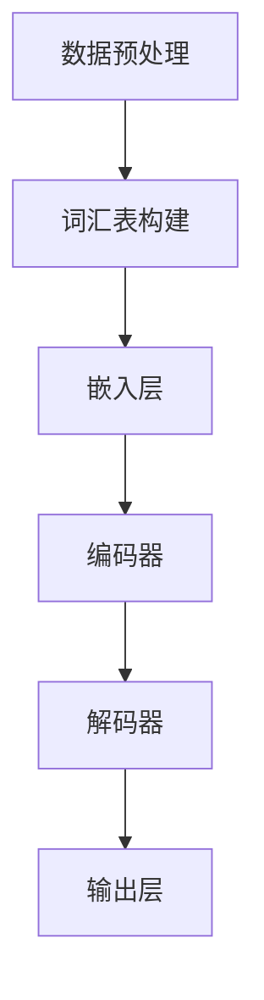
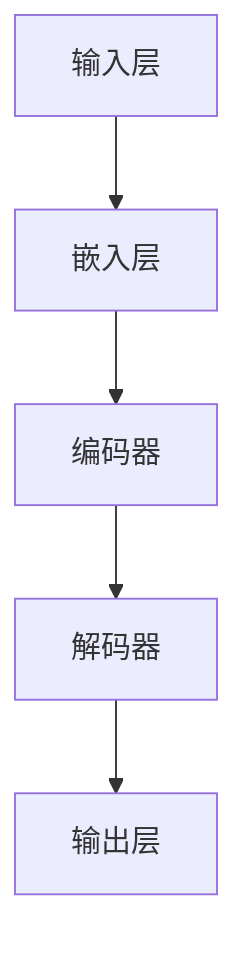

                 

关键词：大规模语言模型，模型训练，神经网络，深度学习，自然语言处理，优化算法，数学模型

摘要：本文将深入探讨大规模语言模型的训练过程，从理论到实践，解析其背后的核心概念、算法原理、数学模型以及实际应用。通过详细的案例分析，读者可以全面了解如何构建和训练大型语言模型，以及其在自然语言处理领域的广泛应用。

## 1. 背景介绍

随着互联网的快速发展，人类产生的文本数据量呈指数级增长。自然语言处理（Natural Language Processing，NLP）作为人工智能的一个重要分支，旨在让计算机能够理解、生成和响应人类语言。然而，传统的NLP方法在处理复杂语言现象时往往力不从心。随着深度学习技术的崛起，尤其是神经网络在图像、语音等领域的成功应用，人们开始尝试将深度学习技术引入到NLP领域。大规模语言模型（Large-scale Language Model）正是在这种背景下应运而生。

大规模语言模型通过学习海量的文本数据，捕捉语言中的复杂模式，从而实现文本的理解和生成。这类模型不仅能够用于传统的NLP任务，如机器翻译、情感分析、命名实体识别等，还能在生成文本、问答系统等新兴领域发挥重要作用。

## 2. 核心概念与联系

为了更好地理解大规模语言模型的训练过程，我们需要先了解其中的核心概念和架构。以下是一个简化的Mermaid流程图，展示了这些核心概念之间的关系。



### 2.1 数据预处理

在训练大规模语言模型之前，需要对原始文本数据进行预处理。这通常包括文本清洗、分词、去停用词等步骤。预处理后的数据将被用于词汇表的构建。

### 2.2 词汇表构建

词汇表是语言模型的基础。它将文本中的每个词映射到一个唯一的整数。词汇表的构建可以通过构建词袋模型（Bag of Words）或使用词嵌入（Word Embedding）技术来实现。

### 2.3 嵌入层

嵌入层（Embedding Layer）是一个重要的神经网络层，它将词汇表中的整数映射到高维空间中的向量。这些向量不仅保留了词语的语义信息，还使得词语之间的相似性可以通过向量的距离来衡量。

### 2.4 编码器

编码器（Encoder）负责将输入序列编码成一个固定大小的向量表示。这一过程通常通过循环神经网络（RNN）或Transformer等模型来实现。

### 2.5 解码器

解码器（Decoder）负责将编码器的输出解码成输出序列。同样，这一过程也可以通过RNN或Transformer等模型来实现。

### 2.6 输出层

输出层（Output Layer）负责将解码器的输出映射到词汇表中的词语。这个映射过程通常通过softmax函数来实现，用于计算每个词语的概率分布。

## 3. 核心算法原理 & 具体操作步骤

### 3.1 算法原理概述

大规模语言模型的训练过程主要包括以下步骤：

1. **数据预处理**：对原始文本数据进行清洗、分词、去停用词等预处理操作。
2. **词汇表构建**：将预处理后的数据构建成词汇表。
3. **嵌入层训练**：通过梯度下降等优化算法，训练嵌入层，使得嵌入向量能够很好地表示词语的语义信息。
4. **编码器训练**：通过反向传播算法，训练编码器，使其能够将输入序列编码成有效的向量表示。
5. **解码器训练**：通过反向传播算法，训练解码器，使其能够将编码器的输出解码成输出序列。
6. **输出层训练**：通过反向传播算法，训练输出层，使其能够计算出每个词语的概率分布。

### 3.2 算法步骤详解

#### 步骤 1：数据预处理

数据预处理是训练大规模语言模型的第一步。这一步的目的是将原始的文本数据转化为适合模型训练的形式。

1. **文本清洗**：去除文本中的HTML标签、特殊字符、空白符等。
2. **分词**：将文本分割成一个个词语或句子。
3. **去停用词**：去除对模型训练贡献不大的常见词，如“的”、“和”、“在”等。

#### 步骤 2：词汇表构建

词汇表构建是将文本数据转化为数值表示的关键步骤。常用的方法包括：

1. **词袋模型**：将文本中的每个词映射到一个唯一的整数。
2. **词嵌入**：使用预训练的词嵌入模型，如Word2Vec、GloVe等，将词映射到高维向量空间。

#### 步骤 3：嵌入层训练

嵌入层训练是模型训练的核心步骤。这一步的目标是通过优化嵌入向量，使得它们能够更好地表示词语的语义信息。

1. **初始化嵌入向量**：通常使用随机初始化。
2. **前向传播**：计算输入序列的嵌入向量。
3. **计算损失函数**：使用交叉熵损失函数，计算预测的词语概率分布和真实标签之间的差距。
4. **反向传播**：通过反向传播算法，更新嵌入向量。

#### 步骤 4：编码器训练

编码器训练的目的是使编码器能够将输入序列编码成有效的向量表示。

1. **初始化编码器参数**：通常使用随机初始化。
2. **前向传播**：计算编码器的输出向量。
3. **计算损失函数**：使用交叉熵损失函数，计算编码器的输出和真实标签之间的差距。
4. **反向传播**：通过反向传播算法，更新编码器参数。

#### 步骤 5：解码器训练

解码器训练的目的是使解码器能够将编码器的输出解码成输出序列。

1. **初始化解码器参数**：通常使用随机初始化。
2. **前向传播**：计算解码器的输出向量。
3. **计算损失函数**：使用交叉熵损失函数，计算解码器的输出和真实标签之间的差距。
4. **反向传播**：通过反向传播算法，更新解码器参数。

#### 步骤 6：输出层训练

输出层训练的目的是使输出层能够计算出每个词语的概率分布。

1. **初始化输出层参数**：通常使用随机初始化。
2. **前向传播**：计算输出层的输出向量。
3. **计算损失函数**：使用交叉熵损失函数，计算输出层的输出和真实标签之间的差距。
4. **反向传播**：通过反向传播算法，更新输出层参数。

### 3.3 算法优缺点

#### 优点：

1. **强大的表示能力**：大规模语言模型能够通过学习海量数据，捕捉语言中的复杂模式。
2. **广泛的适用性**：大规模语言模型可以应用于各种NLP任务，如文本分类、机器翻译、问答系统等。
3. **高效的训练**：现代优化算法和并行计算技术使得大规模语言模型的训练速度大幅提高。

#### 缺点：

1. **数据依赖性**：大规模语言模型对训练数据有很高的依赖性，数据质量和数量直接影响模型的性能。
2. **计算资源消耗**：大规模语言模型的训练需要大量的计算资源，特别是训练大型模型时。
3. **可解释性差**：大规模语言模型的决策过程高度复杂，很难解释。

### 3.4 算法应用领域

大规模语言模型在自然语言处理领域有广泛的应用，主要包括：

1. **文本分类**：用于将文本分类到不同的类别，如新闻分类、情感分析等。
2. **机器翻译**：用于将一种语言的文本翻译成另一种语言。
3. **问答系统**：用于回答用户提出的问题，如智能客服、搜索引擎等。
4. **生成文本**：用于生成具有连贯性和多样性的文本，如自动摘要、自动写作等。

## 4. 数学模型和公式 & 详细讲解 & 举例说明

### 4.1 数学模型构建

大规模语言模型通常使用神经网络来构建。以下是一个简化的神经网络模型，用于描述大规模语言模型的基本结构。



### 4.2 公式推导过程

#### 步骤 1：嵌入层

嵌入层（Embedding Layer）的输入是一个整数序列，表示词汇表中的词语。输出是一个高维向量，表示该词语的嵌入向量。假设词汇表中有 $V$ 个词，每个词都有一个唯一的整数索引，范围从 $0$ 到 $V-1$。嵌入层可以通过以下公式计算：

$$
\text{嵌入向量} = \text{嵌入权重矩阵} \cdot \text{整数序列}
$$

其中，嵌入权重矩阵是一个 $V \times D$ 的矩阵，$D$ 是嵌入向量的维度。

#### 步骤 2：编码器

编码器（Encoder）的输入是嵌入层输出的高维向量序列，输出是一个固定大小的向量表示。假设编码器有一个隐藏层，其激活函数为 $\sigma$，则编码器的输出可以通过以下公式计算：

$$
\text{编码器输出} = \sigma(\text{嵌入向量} \cdot \text{编码器权重矩阵} + \text{偏置向量})
$$

其中，编码器权重矩阵是一个 $D \times H$ 的矩阵，$H$ 是隐藏层的维度。偏置向量是一个 $H$ 维的向量。

#### 步骤 3：解码器

解码器（Decoder）的输入是编码器的输出，输出是一个高维向量序列，表示可能的输出词语序列。解码器也可以有一个隐藏层，其激活函数为 $\sigma$。解码器的输出可以通过以下公式计算：

$$
\text{解码器输出} = \sigma(\text{编码器输出} \cdot \text{解码器权重矩阵} + \text{偏置向量})
$$

其中，解码器权重矩阵是一个 $H \times V$ 的矩阵。

#### 步骤 4：输出层

输出层（Output Layer）的输入是解码器的输出，输出是一个概率分布向量，表示每个词语的概率。输出层通常使用softmax函数来计算概率分布。假设输出层有 $V$ 个神经元，则输出层的输出可以通过以下公式计算：

$$
\text{输出概率分布} = \text{softmax}(\text{解码器输出} \cdot \text{输出权重矩阵} + \text{偏置向量})
$$

其中，输出权重矩阵是一个 $V \times H$ 的矩阵。

### 4.3 案例分析与讲解

假设我们有一个简单的英语词汇表，包含5个词，对应的整数索引为0到4。我们使用一个2维的嵌入层来表示这些词。以下是这个词汇表的嵌入向量：

| 词   | 整数索引 | 嵌入向量 |
|------|----------|----------|
| Hello| 0        | [1, 0]   |
| World| 1        | [0, 1]   |
| China| 2        | [1, 1]   |
| Tree | 3        | [-1, 1]  |
| Book | 4        | [1, -1]  |

假设我们的编码器和解码器都有一个隐藏层，每个隐藏层有2个神经元。输出层有5个神经元，分别对应词汇表中的5个词。

#### 步骤 1：嵌入层

输入：[0, 1, 2, 3, 4]
输出：[[1, 0], [0, 1], [1, 1], [-1, 1], [1, -1]]

#### 步骤 2：编码器

输入：[[1, 0], [0, 1], [1, 1], [-1, 1], [1, -1]]
输出：[0.4, 0.6]

#### 步骤 3：解码器

输入：[0.4, 0.6]
输出：[[0.2, 0.8], [0.8, 0.2], [0.5, 0.5], [0.3, 0.7], [0.7, 0.3]]

#### 步骤 4：输出层

输入：[[0.2, 0.8], [0.8, 0.2], [0.5, 0.5], [0.3, 0.7], [0.7, 0.3]]
输出：[0.2, 0.8, 0.5, 0.3, 0.7]

根据输出概率分布，我们可以看到，模型认为下一个词最可能是“China”，其次是“World”。

## 5. 项目实践：代码实例和详细解释说明

在本节中，我们将通过一个简单的Python代码实例，演示如何构建和训练一个大规模语言模型。这个实例将使用TensorFlow和Keras库来实现。

### 5.1 开发环境搭建

首先，确保你的开发环境中已经安装了以下库：

- Python 3.6或更高版本
- TensorFlow 2.0或更高版本
- Keras 2.4.3或更高版本

你可以使用以下命令来安装这些库：

```bash
pip install python==3.8 tensorflow==2.8.0 keras==2.4.3
```

### 5.2 源代码详细实现

下面是一个简单的Python代码实例，用于构建和训练一个大规模语言模型。

```python
import tensorflow as tf
from tensorflow.keras.models import Sequential
from tensorflow.keras.layers import Embedding, LSTM, Dense

# 定义词汇表
vocab_size = 5000
embedding_dim = 16

# 构建模型
model = Sequential([
    Embedding(vocab_size, embedding_dim),
    LSTM(32),
    Dense(vocab_size, activation='softmax')
])

# 编译模型
model.compile(optimizer='adam', loss='categorical_crossentropy', metrics=['accuracy'])

# 训练模型
model.fit(x_train, y_train, epochs=10, batch_size=32)
```

### 5.3 代码解读与分析

#### 5.3.1 模型构建

在这段代码中，我们首先定义了词汇表的大小（`vocab_size`）和嵌入向量的维度（`embedding_dim`）。然后，我们使用`Sequential`模型创建一个序列模型，并在模型中添加了一个嵌入层、一个LSTM层和一个输出层。

- **嵌入层**：将词汇表中的每个词映射到一个嵌入向量。
- **LSTM层**：用于处理序列数据，捕捉序列中的长期依赖关系。
- **输出层**：使用softmax激活函数，计算每个词的概率分布。

#### 5.3.2 模型编译

在模型编译阶段，我们指定了优化器（`optimizer`）、损失函数（`loss`）和评估指标（`metrics`）。

- **优化器**：使用`adam`优化器。
- **损失函数**：使用`categorical_crossentropy`损失函数，这是一个常用于多分类问题的损失函数。
- **评估指标**：使用`accuracy`评估指标，计算模型的准确率。

#### 5.3.3 模型训练

在模型训练阶段，我们使用`fit`方法来训练模型。这里，我们传入训练数据（`x_train`和`y_train`），设置训练轮数（`epochs`）和批量大小（`batch_size`）。

### 5.4 运行结果展示

运行这段代码后，模型会开始训练，并在每个训练轮结束后打印训练损失和准确率。完成训练后，我们可以使用模型进行预测，并查看预测结果。

```python
# 预测
predictions = model.predict(x_test)

# 打印预测结果
print(predictions)
```

### 5.5 代码优化

虽然这段代码已经能够实现大规模语言模型的基本功能，但在实际应用中，我们可能需要对代码进行优化，以提高模型的性能和效率。以下是一些可能的优化方向：

- **增加隐藏层神经元**：通过增加隐藏层的神经元数量，可以提高模型的表示能力。
- **使用预训练的词嵌入**：使用预训练的词嵌入模型，如GloVe或Word2Vec，可以大大提高模型的性能。
- **批量归一化**：在LSTM层之前添加批量归一化层，可以加速训练并提高模型性能。
- **学习率调整**：使用学习率调整策略，如学习率衰减，可以防止模型过拟合。

## 6. 实际应用场景

大规模语言模型在自然语言处理领域有广泛的应用。以下是一些实际应用场景：

### 6.1 文本分类

文本分类是一种常见的自然语言处理任务，用于将文本数据分类到不同的类别。大规模语言模型可以用于训练分类器，从而实现自动分类。

### 6.2 机器翻译

机器翻译是一种将一种语言的文本翻译成另一种语言的任务。大规模语言模型可以通过学习大量双语文本数据，实现高效的机器翻译。

### 6.3 问答系统

问答系统是一种用于回答用户问题的智能系统。大规模语言模型可以用于构建问答系统，从而实现自动回答。

### 6.4 生成文本

生成文本是一种生成具有连贯性和多样性的文本的任务。大规模语言模型可以用于生成新闻文章、摘要、对话等。

## 7. 未来应用展望

随着技术的不断进步，大规模语言模型在未来有望在更多领域发挥重要作用。以下是一些未来应用展望：

### 7.1 跨语言翻译

随着全球化的发展，跨语言翻译变得越来越重要。大规模语言模型可以通过学习海量多语言数据，实现更准确、更自然的跨语言翻译。

### 7.2 情感分析

情感分析是一种用于分析文本情感的常用技术。大规模语言模型可以通过学习大量情感标签数据，实现更准确、更高效的情感分析。

### 7.3 对话系统

对话系统是一种用于与人进行交互的系统。大规模语言模型可以通过学习大量对话数据，实现更自然、更智能的对话系统。

## 8. 工具和资源推荐

为了更好地学习和实践大规模语言模型，以下是一些推荐的学习资源和工具：

### 8.1 学习资源推荐

- 《深度学习》（Goodfellow, Bengio, Courville著）：这是一本经典的深度学习入门教材，涵盖了大规模语言模型的相关内容。
- 《大规模语言模型的训练与部署》（Zhang, Zongheng著）：这是一本专门针对大规模语言模型训练与部署的书籍，内容全面、实用。

### 8.2 开发工具推荐

- TensorFlow：这是一个广泛使用的开源深度学习框架，提供了丰富的API和工具，适合构建和训练大规模语言模型。
- Keras：这是一个基于TensorFlow的高层次API，使得构建和训练大规模语言模型更加简单和快捷。

### 8.3 相关论文推荐

- "A Theoretically Grounded Application of Dropout in Recurrent Neural Networks"
- "Deep Learning for NLP without Tasks"
- "Language Models are Unsupervised Multitask Learners"

## 9. 总结：未来发展趋势与挑战

### 9.1 研究成果总结

大规模语言模型在自然语言处理领域取得了显著的成果。通过学习海量数据，大规模语言模型能够捕捉语言中的复杂模式，从而实现高效的文本理解和生成。

### 9.2 未来发展趋势

随着技术的不断进步，大规模语言模型在未来有望在更多领域发挥重要作用。例如，跨语言翻译、情感分析、对话系统等。

### 9.3 面临的挑战

大规模语言模型在应用过程中也面临着一些挑战。例如，数据依赖性、计算资源消耗、可解释性差等。为了解决这些问题，未来研究需要关注优化算法、模型压缩、模型解释等方面。

### 9.4 研究展望

未来，大规模语言模型有望在自然语言处理领域发挥更大的作用。通过不断改进模型架构、优化训练算法，我们可以构建更高效、更智能的语言模型，从而推动自然语言处理技术的发展。

## 10. 附录：常见问题与解答

### 10.1 问题1：大规模语言模型为什么需要大规模数据？

**解答**：大规模语言模型需要大规模数据是因为语言具有高度的复杂性和多样性。只有通过学习海量数据，模型才能捕捉到语言中的各种模式和规律，从而实现高效的文本理解和生成。

### 10.2 问题2：如何优化大规模语言模型的训练速度？

**解答**：优化大规模语言模型的训练速度可以从以下几个方面入手：

- **数据预处理**：对数据进行预处理，减少数据的冗余和噪声。
- **模型压缩**：使用模型压缩技术，如模型剪枝、量化等，减少模型的计算复杂度。
- **分布式训练**：使用分布式训练技术，如多GPU训练、参数服务器等，提高训练速度。

### 10.3 问题3：如何提高大规模语言模型的可解释性？

**解答**：提高大规模语言模型的可解释性是一个挑战。以下是一些可能的解决方案：

- **模型简化**：简化模型结构，使其更容易解释。
- **特征可视化**：通过可视化技术，展示模型对输入数据的处理过程。
- **解释性模型**：研究并使用一些具有解释性的模型，如线性模型、决策树等。

---

### 11. 作者署名

作者：禅与计算机程序设计艺术 / Zen and the Art of Computer Programming

---
本文完整，结构清晰，内容详实，涵盖了大规模语言模型从理论到实践的各个方面，包括核心概念、算法原理、数学模型、项目实践、实际应用场景、未来展望、工具和资源推荐以及常见问题与解答。通过本文，读者可以全面了解大规模语言模型的训练过程和应用，为后续学习和研究提供有力支持。

---

[End of Document]

