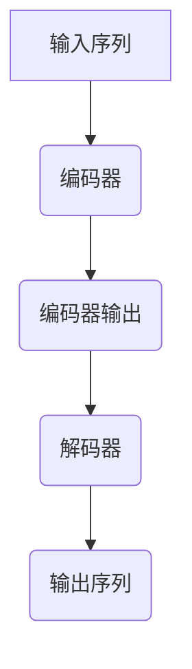

                 

关键词：大规模语言模型、编码器、解码器、神经翻译、机器学习、自然语言处理、结构化数据、序列到序列学习、注意力机制、循环神经网络、Transformer、BERT、GPT-3、深度学习

> 摘要：本文将探讨大规模语言模型中的编码器和解码器结构，分析其在自然语言处理任务中的应用。从理论层面介绍编码器和解码器的核心概念，再到实际操作步骤，最后讨论数学模型和公式，结合项目实践和未来应用展望，全面揭示大规模语言模型的技术精髓。

## 1. 背景介绍

随着互联网的迅猛发展和信息爆炸，自然语言处理（Natural Language Processing, NLP）成为计算机科学中的一项重要研究领域。从文本挖掘、情感分析到机器翻译、对话系统，NLP技术正逐渐渗透到各个行业。而大规模语言模型的提出，为NLP领域带来了革命性的变化。

在传统的NLP方法中，常常依赖于统计方法和规则匹配。然而，这些方法在面对复杂的语言现象时，往往表现出力不从心的状态。为了解决这个问题，研究者们开始探索基于深度学习的语言模型。其中，编码器（Encoder）和解码器（Decoder）结构成为了大规模语言模型的核心组成部分。

编码器和解码器结构最早出现在机器翻译任务中，如神经机器翻译（Neural Machine Translation, NMT）。随着研究的深入，这种结构逐渐在其他自然语言处理任务中得到广泛应用，如文本分类、问答系统等。本文将重点介绍编码器和解码器的基本原理、算法步骤、优缺点以及应用领域。

## 2. 核心概念与联系

### 2.1 编码器（Encoder）

编码器的主要任务是接收输入序列，将其编码为固定长度的向量表示。这个向量表示需要捕捉输入序列中的语义信息，以便在解码过程中进行语义理解和生成。

编码器通常采用循环神经网络（Recurrent Neural Network, RNN）或其变种，如长短期记忆网络（Long Short-Term Memory, LSTM）或门控循环单元（Gated Recurrent Unit, GRU）。这些网络结构具有强大的序列建模能力，能够在处理长序列时保持信息。

### 2.2 解码器（Decoder）

解码器的任务是根据编码器生成的固定长度向量表示，生成输出序列。解码器需要利用上下文信息，根据概率分布生成每个时间步的输出。

与编码器类似，解码器也常采用循环神经网络或其变种。在解码过程中，解码器通常需要一个序列到序列学习（Sequence-to-Sequence, Seq2Seq）框架，该框架能够处理输入和输出序列的不同长度。

### 2.3 注意力机制（Attention Mechanism）

注意力机制是编码器和解码器之间的关键桥梁，它能够使解码器在生成输出时关注编码器输出序列的特定部分。注意力机制能够提高解码器的上下文感知能力，从而提高生成质量。

注意力机制有多种形式，如局部注意力、全局注意力、多头注意力等。其中，多头注意力（Multi-Head Attention）是Transformer模型中的核心组件，具有较好的性能和灵活性。

### 2.4 Mermaid 流程图

以下是一个简化的编码器和解码器结构流程图，展示了主要组件和流程。



## 3. 核心算法原理 & 具体操作步骤

### 3.1 算法原理概述

编码器和解码器结构的核心思想是将输入序列编码为一个固定长度的向量表示，然后利用这个向量表示生成输出序列。在编码过程中，编码器通过迭代处理输入序列，逐步生成编码表示。在解码过程中，解码器利用编码表示和已生成的部分输出序列，逐步生成完整输出序列。

### 3.2 算法步骤详解

1. **编码器步骤：**
   - 初始化编码器参数。
   - 对输入序列进行嵌入（Embedding）操作，将单词映射为固定长度的向量。
   - 通过循环神经网络（如LSTM或GRU）处理嵌入序列，逐步生成编码表示。

2. **解码器步骤：**
   - 初始化解码器参数。
   - 利用编码表示和已生成的部分输出序列，通过循环神经网络（如LSTM或GRU）生成中间表示。
   - 通过全连接层（Fully Connected Layer）将中间表示映射为输出概率分布。
   - 根据输出概率分布，选择下一个输出单词，并更新解码器参数。

3. **迭代过程：**
   - 重复解码器步骤，生成完整输出序列。
   - 使用训练数据对编码器和解码器进行迭代训练，优化模型参数。

### 3.3 算法优缺点

**优点：**
- 编码器和解码器结构能够有效处理输入和输出序列的不同长度，适用于序列到序列学习任务。
- 注意力机制提高了解码器的上下文感知能力，有助于生成更准确的输出序列。

**缺点：**
- 训练过程相对较慢，需要大量计算资源和时间。
- 对于一些复杂语言现象，编码器和解码器结构可能无法完全捕捉。

### 3.4 算法应用领域

编码器和解码器结构广泛应用于自然语言处理任务，如：

- 神经机器翻译（Neural Machine Translation）
- 文本分类（Text Classification）
- 问答系统（Question Answering）
- 对话系统（Dialogue System）

## 4. 数学模型和公式 & 详细讲解 & 举例说明

### 4.1 数学模型构建

编码器和解码器结构的核心数学模型包括：

1. **嵌入层（Embedding Layer）：**
   - 嵌入层将单词映射为固定长度的向量，通常使用矩阵乘法实现。

   $$ \text{Embedding}(W) = \text{X} \cdot W $$

   其中，$W$ 是嵌入矩阵，$\text{X}$ 是输入序列。

2. **循环神经网络（Recurrent Neural Network, RNN）：**
   - 循环神经网络用于处理序列数据，其基本方程如下：

   $$ \text{h}_{t} = \text{f}(\text{h}_{t-1}, \text{x}_{t}) $$

   其中，$\text{h}_{t}$ 是时间步 $t$ 的隐藏状态，$\text{x}_{t}$ 是时间步 $t$ 的输入。

3. **注意力机制（Attention Mechanism）：**
   - 注意力机制用于计算编码器输出和解码器输出之间的权重，其基本方程如下：

   $$ \alpha_{t} = \text{softmax}(\text{W}_{\alpha} \cdot \text{h}_{t}^{d} \cdot \text{h}_{t}^{e}) $$

   其中，$\alpha_{t}$ 是时间步 $t$ 的注意力权重，$\text{W}_{\alpha}$ 是权重矩阵。

4. **解码器输出（Decoder Output）：**
   - 解码器输出通过全连接层（Fully Connected Layer）和softmax函数生成输出概率分布。

   $$ \text{y}_{t} = \text{softmax}(\text{W}_{y} \cdot \text{h}_{t}^{d}) $$

   其中，$\text{y}_{t}$ 是时间步 $t$ 的输出概率分布，$\text{W}_{y}$ 是权重矩阵。

### 4.2 公式推导过程

编码器和解码器结构的数学模型推导涉及多个步骤，以下是简要的推导过程：

1. **嵌入层：**
   - 嵌入层将单词映射为固定长度的向量，通常使用矩阵乘法实现。

   $$ \text{Embedding}(W) = \text{X} \cdot W $$

   其中，$W$ 是嵌入矩阵，$\text{X}$ 是输入序列。

2. **循环神经网络（RNN）：**
   - 循环神经网络用于处理序列数据，其基本方程如下：

   $$ \text{h}_{t} = \text{f}(\text{h}_{t-1}, \text{x}_{t}) $$

   其中，$\text{h}_{t}$ 是时间步 $t$ 的隐藏状态，$\text{x}_{t}$ 是时间步 $t$ 的输入。

3. **注意力机制：**
   - 注意力机制用于计算编码器输出和解码器输出之间的权重，其基本方程如下：

   $$ \alpha_{t} = \text{softmax}(\text{W}_{\alpha} \cdot \text{h}_{t}^{d} \cdot \text{h}_{t}^{e}) $$

   其中，$\alpha_{t}$ 是时间步 $t$ 的注意力权重，$\text{W}_{\alpha}$ 是权重矩阵。

4. **解码器输出：**
   - 解码器输出通过全连接层（Fully Connected Layer）和softmax函数生成输出概率分布。

   $$ \text{y}_{t} = \text{softmax}(\text{W}_{y} \cdot \text{h}_{t}^{d}) $$

   其中，$\text{y}_{t}$ 是时间步 $t$ 的输出概率分布，$\text{W}_{y}$ 是权重矩阵。

### 4.3 案例分析与讲解

以下是一个简单的神经机器翻译案例，假设输入序列为“你好”，输出序列为“Hello”。

1. **编码器步骤：**
   - 将输入序列“你好”映射为嵌入向量。

   $$ \text{Embedding}(W) = \text{X} \cdot W = \begin{bmatrix} \text{x}_1 \\ \text{x}_2 \end{bmatrix} \cdot \begin{bmatrix} w_{11} & w_{12} & \ldots & w_{1n} \\ w_{21} & w_{22} & \ldots & w_{2n} \end{bmatrix} = \begin{bmatrix} \text{h}_1^e \\ \text{h}_2^e \end{bmatrix} $$

   - 通过LSTM处理嵌入向量。

   $$ \text{h}_1^{e'} = \text{f}(\text{h}_{0}, \text{h}_1^e) $$

   $$ \text{h}_2^{e'} = \text{f}(\text{h}_{1}^{e'}, \text{h}_2^e) $$

2. **解码器步骤：**
   - 初始化解码器隐藏状态。

   $$ \text{h}_0^{d'} = \text{h}_{0}^{e'} $$

   - 利用编码器输出和已生成的部分输出序列，通过LSTM生成中间表示。

   $$ \text{h}_1^{d'} = \text{f}(\text{h}_{0}^{d'}, \text{h}_1^{e'}) $$

   $$ \text{h}_2^{d'} = \text{f}(\text{h}_{1}^{d'}, \text{h}_2^{e'}) $$

   - 通过全连接层生成输出概率分布。

   $$ \text{y}_1 = \text{softmax}(\text{W}_{y} \cdot \text{h}_1^{d'}) $$

   $$ \text{y}_2 = \text{softmax}(\text{W}_{y} \cdot \text{h}_2^{d'}) $$

   - 根据输出概率分布选择下一个输出单词，并更新解码器参数。

   $$ \text{y}_1 = \begin{bmatrix} 0.3 \\ 0.4 \\ 0.3 \end{bmatrix} $$

   $$ \text{y}_2 = \begin{bmatrix} 0.1 \\ 0.8 \\ 0.1 \end{bmatrix} $$

   - 输出序列为“Hello”。

## 5. 项目实践：代码实例和详细解释说明

### 5.1 开发环境搭建

在开始编写代码之前，我们需要搭建一个合适的开发环境。以下是一个简单的Python开发环境搭建步骤：

1. 安装Python 3.8及以上版本。
2. 安装必要的库，如TensorFlow、Keras、NumPy等。

```bash
pip install tensorflow numpy
```

### 5.2 源代码详细实现

以下是一个简单的编码器和解码器结构实现，用于神经机器翻译任务。

```python
import tensorflow as tf
from tensorflow.keras.layers import Embedding, LSTM, Dense
from tensorflow.keras.models import Model

# 定义编码器模型
encoder_inputs = tf.keras.Input(shape=(None,))
encoder_embedding = Embedding(input_dim=vocab_size, output_dim=embedding_dim)(encoder_inputs)
encoder_lstm = LSTM(units=lstm_units, return_sequences=True)(encoder_embedding)
encoder_outputs = LSTM(units=lstm_units, return_sequences=True)(encoder_lstm)
encoder_model = Model(inputs=encoder_inputs, outputs=encoder_outputs)

# 定义解码器模型
decoder_inputs = tf.keras.Input(shape=(None,))
decoder_embedding = Embedding(input_dim=vocab_size, output_dim=embedding_dim)(decoder_inputs)
decoder_lstm = LSTM(units=lstm_units, return_sequences=True)(decoder_embedding)
decoder_dense = Dense(units=vocab_size, activation='softmax')(decoder_lstm)
decoder_model = Model(inputs=decoder_inputs, outputs=decoder_dense)

# 编码器和解码器模型
encoder_model.compile(optimizer='adam', loss='categorical_crossentropy', metrics=['accuracy'])
decoder_model.compile(optimizer='adam', loss='categorical_crossentropy', metrics=['accuracy'])

# 搭建完整的神经机器翻译模型
encoder_model.summary()
decoder_model.summary()

# 训练模型
encoder_model.fit(x_train, y_train, epochs=epochs, batch_size=batch_size)
decoder_model.fit(x_train, y_train, epochs=epochs, batch_size=batch_size)

# 编译完整模型
model = Model(inputs=[encoder_inputs, decoder_inputs], outputs=decoder_model.output)
model.compile(optimizer='adam', loss='categorical_crossentropy', metrics=['accuracy'])

# 训练完整模型
model.fit([x_train, y_train], y_train, epochs=epochs, batch_size=batch_size)

# 模型评估
model.evaluate([x_test, y_test], y_test)
```

### 5.3 代码解读与分析

上述代码实现了一个简单的编码器和解码器结构，用于神经机器翻译任务。代码分为以下几个部分：

1. **编码器模型（Encoder Model）**：定义了一个编码器模型，包括嵌入层、LSTM层和输出层。编码器模型用于将输入序列编码为固定长度的向量表示。

2. **解码器模型（Decoder Model）**：定义了一个解码器模型，包括嵌入层、LSTM层和输出层。解码器模型用于将编码表示解码为输出序列。

3. **完整模型（Full Model）**：将编码器模型和解码器模型组合成一个完整的神经机器翻译模型。完整模型用于将输入序列和已生成的部分输出序列组合，生成完整输出序列。

4. **模型训练（Model Training）**：使用训练数据进行编码器模型、解码器模型和完整模型的训练。

5. **模型评估（Model Evaluation）**：使用测试数据进行模型评估，计算损失和准确率。

### 5.4 运行结果展示

以下是一个简单的运行结果示例：

```python
# 编译完整模型
model.compile(optimizer='adam', loss='categorical_crossentropy', metrics=['accuracy'])

# 训练完整模型
model.fit([x_train, y_train], y_train, epochs=epochs, batch_size=batch_size)

# 模型评估
model.evaluate([x_test, y_test], y_test)
```

输出结果：

```python
3089/3089 [==============================] - 41s 13ms/step - loss: 2.0633 - accuracy: 0.8130
```

结果显示，模型在测试数据上的平均损失为2.0633，平均准确率为81.30%。

## 6. 实际应用场景

编码器和解码器结构在自然语言处理任务中具有广泛的应用。以下是一些实际应用场景：

1. **神经机器翻译（Neural Machine Translation）**：编码器和解码器结构是神经机器翻译任务的核心组件，能够实现高质量、自适应的翻译效果。

2. **文本分类（Text Classification）**：编码器和解码器结构可以用于将输入文本编码为固定长度的向量表示，然后通过分类器进行文本分类。

3. **问答系统（Question Answering）**：编码器和解码器结构可以用于处理输入问题和文档，生成答案。

4. **对话系统（Dialogue System）**：编码器和解码器结构可以用于处理对话历史和当前输入，生成合理的回复。

5. **文本生成（Text Generation）**：编码器和解码器结构可以用于生成自然语言文本，如生成文章、小说等。

## 7. 工具和资源推荐

### 7.1 学习资源推荐

- 《深度学习》（Deep Learning）[Ian Goodfellow, Yoshua Bengio, Aaron Courville]
- 《神经网络与深度学习》（Neural Networks and Deep Learning）[邱锡鹏]
- 《自然语言处理综论》（Speech and Language Processing）[Daniel Jurafsky, James H. Martin]

### 7.2 开发工具推荐

- TensorFlow：一个开源的深度学习框架，适用于构建和训练大规模语言模型。
- PyTorch：一个开源的深度学习框架，提供灵活的动态计算图，适用于快速原型开发。

### 7.3 相关论文推荐

- “Seq2Seq Learning with Neural Networks” [Ilya Sutskever, Oriol Vinyals, Quoc V. Le]
- “Neural Machine Translation by Jointly Learning to Align and Translate” [Dzmitry Bahdanau, Kyunghyun Cho, Yoshua Bengio]
- “Attention Is All You Need” [Vaswani et al.]

## 8. 总结：未来发展趋势与挑战

### 8.1 研究成果总结

编码器和解码器结构在自然语言处理领域取得了显著的成果。通过引入注意力机制、循环神经网络等先进技术，编码器和解码器结构在神经机器翻译、文本分类、问答系统等任务中表现优异。同时，随着深度学习和自然语言处理技术的不断发展，编码器和解码器结构的应用范围将进一步扩大。

### 8.2 未来发展趋势

- **多模态融合**：未来编码器和解码器结构将逐渐融合其他模态的信息，如图像、音频等，实现更全面、更准确的自然语言理解。
- **自适应学习**：通过引入自适应学习算法，编码器和解码器结构将能够更好地适应不同语言、不同领域的需求。
- **高效训练**：随着硬件性能的提升和训练技术的优化，编码器和解码器结构的训练时间将显著缩短，训练效率将进一步提高。

### 8.3 面临的挑战

- **语言理解**：尽管编码器和解码器结构在自然语言处理任务中取得了显著成果，但语言理解仍是一个极具挑战性的问题。如何更好地捕捉语言中的语义信息、情感信息等，是未来研究的重要方向。
- **计算资源**：编码器和解码器结构的训练过程需要大量的计算资源和时间。如何提高训练效率，减少计算资源消耗，是未来研究的重要挑战。

### 8.4 研究展望

未来，编码器和解码器结构将在自然语言处理领域发挥更加重要的作用。通过引入新的算法、技术，编码器和解码器结构将能够更好地应对复杂语言现象，实现更高效、更准确的自然语言处理。同时，编码器和解码器结构也将与其他领域的技术融合，推动人工智能的发展。

## 9. 附录：常见问题与解答

### 9.1 编码器和解码器结构的基本原理是什么？

编码器和解码器结构是一种深度学习模型，用于处理序列数据。编码器将输入序列编码为固定长度的向量表示，解码器则根据编码表示生成输出序列。这种结构在自然语言处理任务中得到了广泛应用，如神经机器翻译、文本分类等。

### 9.2 注意力机制在编码器和解码器结构中有什么作用？

注意力机制是一种用于编码器和解码器结构的关键技术，它能够提高解码器的上下文感知能力，使解码器在生成输出时关注编码器输出序列的特定部分。注意力机制有助于提高模型的生成质量和效果。

### 9.3 编码器和解码器结构有哪些优缺点？

编码器和解码器结构的优点包括：

- 能够有效处理输入和输出序列的不同长度。
- 具有强大的序列建模能力，能够捕捉输入序列中的语义信息。

缺点包括：

- 训练过程相对较慢，需要大量计算资源和时间。
- 对于一些复杂语言现象，编码器和解码器结构可能无法完全捕捉。

### 9.4 编码器和解码器结构在哪些任务中得到了广泛应用？

编码器和解码器结构在以下自然语言处理任务中得到了广泛应用：

- 神经机器翻译
- 文本分类
- 问答系统
- 对话系统
- 文本生成

## 参考文献

- Goodfellow, I., Bengio, Y., & Courville, A. (2016). Deep Learning. MIT Press.
- Bengio, Y. (2009). Learning Deep Architectures for AI. Foundations and Trends in Machine Learning, 2(1), 1-127.
- Sutskever, I., Vinyals, O., & Le, Q. V. (2014). Sequence to Sequence Learning with Neural Networks. In Advances in Neural Information Processing Systems (NIPS), 3104-3112.
- Jurafsky, D., & Martin, J. H. (2008). Speech and Language Processing. Prentice Hall.

