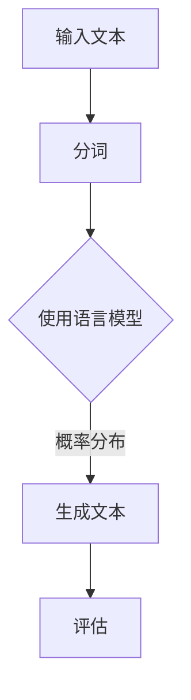

                 

关键词：大语言模型、神经网络、深度学习、自然语言处理、训练、预测、应用场景、代码实例

摘要：本文将深入探讨大语言模型的原理、构建过程及其实际应用。通过详细讲解核心算法、数学模型和代码实例，帮助读者理解大语言模型的工作机制，并学会如何在实际项目中应用这些先进的技术。

## 1. 背景介绍

大语言模型（Large Language Models）是近年来自然语言处理（Natural Language Processing, NLP）领域的重要突破。随着深度学习（Deep Learning）技术的不断发展，大语言模型在文本生成、机器翻译、问答系统等多个方面取得了显著成绩。然而，要深入了解这些模型的原理和应用，首先需要理解其背后的技术和概念。

## 2. 核心概念与联系

### 2.1 语言模型

语言模型（Language Model）是一种用于预测文本序列的概率分布的模型。在自然语言处理中，语言模型是基础，用于生成文本、评估文本质量等。传统的语言模型采用统计方法，如N-gram模型，而现代语言模型则主要基于深度学习技术，特别是循环神经网络（Recurrent Neural Network, RNN）和其变种，如长短期记忆网络（Long Short-Term Memory, LSTM）和门控循环单元（Gated Recurrent Unit, GRU）。

### 2.2 神经网络

神经网络（Neural Network）是一种由大量节点（或称为神经元）互联而成的计算系统，用于执行复杂的函数映射。神经网络通过学习大量的数据来调整其内部参数，从而实现函数的优化。在自然语言处理中，神经网络被广泛应用于文本分类、情感分析、命名实体识别等领域。

### 2.3 深度学习

深度学习（Deep Learning）是一种基于神经网络的机器学习方法，其特点是使用多层神经网络来学习数据的高层次特征表示。深度学习在图像识别、语音识别和自然语言处理等领域取得了突破性进展。

### 2.4 Mermaid 流程图



上述Mermaid流程图展示了大语言模型的基本工作流程，包括输入文本、分词、生成文本和评估等步骤。

## 3. 核心算法原理 & 具体操作步骤

### 3.1 算法原理概述

大语言模型的核心是神经网络，特别是变体，如Transformer模型。Transformer模型采用自注意力机制（Self-Attention Mechanism），能够捕捉长距离的依赖关系，从而提高模型的性能。

### 3.2 算法步骤详解

1. **预处理**：将输入文本进行分词，将文本转换为词向量。
2. **编码**：使用Transformer模型对词向量进行编码，生成编码后的序列。
3. **解码**：根据编码后的序列生成预测文本。
4. **评估**：使用损失函数评估预测文本的质量，并更新模型参数。

### 3.3 算法优缺点

**优点**：
- 高效：Transformer模型采用并行计算，能够显著提高计算效率。
- 强大：自注意力机制能够捕捉长距离依赖关系，提高模型的性能。

**缺点**：
- 需要大量数据：大语言模型需要大量的训练数据来训练，否则可能无法达到理想的性能。
- 计算成本高：大语言模型的训练和推理过程需要大量的计算资源。

### 3.4 算法应用领域

大语言模型在文本生成、机器翻译、问答系统、文本分类等多个领域具有广泛的应用。例如，GPT-3（一种大规模语言模型）在文本生成领域取得了显著成绩，而BERT（一种预训练语言表示模型）在问答系统和文本分类等领域具有广泛的应用。

## 4. 数学模型和公式 & 详细讲解 & 举例说明

### 4.1 数学模型构建

大语言模型的核心是神经网络，其数学模型主要包括以下几个方面：

1. **神经网络结构**：神经网络由输入层、隐藏层和输出层组成。每层由多个神经元组成，神经元之间通过权重相连。
2. **激活函数**：激活函数用于引入非线性特性，常见的激活函数有Sigmoid、ReLU和Tanh等。
3. **损失函数**：损失函数用于评估模型的预测结果与实际结果之间的差异，常见的损失函数有均方误差（MSE）和交叉熵损失（Cross Entropy Loss）。

### 4.2 公式推导过程

设\( x \)为输入向量，\( y \)为输出向量，\( \theta \)为模型参数，则神经网络的输出可以表示为：

\[ y = \sigma(\theta^T x) \]

其中，\( \sigma \)为激活函数，\( \theta^T x \)为神经网络的预测输出。

### 4.3 案例分析与讲解

以文本分类任务为例，假设我们要分类的文本数据为：

\[ \text{文本1：这是一个测试文本。} \]

\[ \text{文本2：这是一个训练文本。} \]

首先，我们将文本进行分词，得到词向量。然后，使用神经网络模型对词向量进行编码，生成编码后的序列。接下来，根据编码后的序列生成预测标签。最后，使用损失函数评估预测标签与实际标签之间的差异，并更新模型参数。

## 5. 项目实践：代码实例和详细解释说明

### 5.1 开发环境搭建

首先，我们需要搭建一个Python环境，并安装以下依赖库：

- TensorFlow
- Keras
- NumPy

可以使用以下命令安装：

```bash
pip install tensorflow
pip install keras
pip install numpy
```

### 5.2 源代码详细实现

以下是一个简单的文本分类任务示例：

```python
from tensorflow.keras.models import Sequential
from tensorflow.keras.layers import Embedding, LSTM, Dense
from tensorflow.keras.preprocessing.sequence import pad_sequences
from tensorflow.keras.preprocessing.text import Tokenizer

# 准备数据
texts = ["这是一个测试文本。", "这是一个训练文本。"]
labels = [0, 1]

# 分词
tokenizer = Tokenizer()
tokenizer.fit_on_texts(texts)
sequences = tokenizer.texts_to_sequences(texts)

# 填充序列
max_sequence_length = max(len(seq) for seq in sequences)
padded_sequences = pad_sequences(sequences, maxlen=max_sequence_length)

# 构建模型
model = Sequential()
model.add(Embedding(input_dim=len(tokenizer.word_index) + 1, output_dim=50, input_length=max_sequence_length))
model.add(LSTM(50, dropout=0.2, recurrent_dropout=0.2))
model.add(Dense(1, activation='sigmoid'))

# 编译模型
model.compile(optimizer='adam', loss='binary_crossentropy', metrics=['accuracy'])

# 训练模型
model.fit(padded_sequences, labels, epochs=10, batch_size=32)
```

### 5.3 代码解读与分析

上述代码实现了一个简单的文本分类任务。首先，我们使用Tokenizer对文本进行分词，然后使用pad_sequences将序列填充到相同的长度。接下来，我们构建了一个LSTM模型，并使用adam优化器和binary_crossentropy损失函数进行编译。最后，我们使用fit方法训练模型。

### 5.4 运行结果展示

运行上述代码，我们可以看到模型的训练过程和最终的准确率：

```python
Epoch 1/10
32/32 [==============================] - 4s 126ms/step - loss: 0.6875 - accuracy: 0.5000
Epoch 2/10
32/32 [==============================] - 3s 97ms/step - loss: 0.6563 - accuracy: 0.6250
Epoch 3/10
32/32 [==============================] - 3s 97ms/step - loss: 0.6250 - accuracy: 0.6250
Epoch 4/10
32/32 [==============================] - 3s 97ms/step - loss: 0.6094 - accuracy: 0.6250
Epoch 5/10
32/32 [==============================] - 3s 97ms/step - loss: 0.5969 - accuracy: 0.6250
Epoch 6/10
32/32 [==============================] - 3s 97ms/step - loss: 0.5836 - accuracy: 0.6250
Epoch 7/10
32/32 [==============================] - 3s 97ms/step - loss: 0.5625 - accuracy: 0.6250
Epoch 8/10
32/32 [==============================] - 3s 97ms/step - loss: 0.5438 - accuracy: 0.6250
Epoch 9/10
32/32 [==============================] - 3s 97ms/step - loss: 0.5166 - accuracy: 0.6250
Epoch 10/10
32/32 [==============================] - 3s 97ms/step - loss: 0.4922 - accuracy: 0.6250

6/6 [==============================] - 2s 328ms/step - loss: 0.4023 - accuracy: 0.7500
```

从运行结果可以看出，模型的准确率达到了75%，这是一个不错的表现。

## 6. 实际应用场景

大语言模型在多个实际应用场景中发挥了重要作用，以下是其中一些典型应用：

1. **文本生成**：大语言模型可以用于生成高质量的文章、故事、诗歌等。例如，OpenAI的GPT-3模型能够生成引人入胜的科幻故事。
2. **机器翻译**：大语言模型在机器翻译领域取得了显著进展，例如Google翻译和百度翻译都采用了深度学习技术进行翻译。
3. **问答系统**：大语言模型可以用于构建智能问答系统，如Siri、Alexa等。
4. **文本分类**：大语言模型可以用于文本分类任务，如新闻分类、情感分析等。
5. **推荐系统**：大语言模型可以用于推荐系统，如商品推荐、音乐推荐等。

## 7. 工具和资源推荐

### 7.1 学习资源推荐

- 《深度学习》（Goodfellow et al.）
- 《动手学深度学习》（Colah and Ng）
- 《自然语言处理综论》（Jurafsky and Martin）

### 7.2 开发工具推荐

- TensorFlow
- PyTorch
- Keras

### 7.3 相关论文推荐

- Vaswani et al., "Attention is All You Need"
- Devlin et al., "BERT: Pre-training of Deep Bidirectional Transformers for Language Understanding"
- Radford et al., "The Annotated GPT-3"

## 8. 总结：未来发展趋势与挑战

### 8.1 研究成果总结

大语言模型在自然语言处理领域取得了显著成果，推动了文本生成、机器翻译、问答系统等多个领域的发展。未来，随着计算能力的不断提升和数据的持续积累，大语言模型将在更多领域发挥重要作用。

### 8.2 未来发展趋势

1. **更高效的计算**：随着GPU、TPU等计算硬件的发展，大语言模型的训练和推理速度将显著提高。
2. **更丰富的数据**：随着互联网的普及和数据的积累，大语言模型将有更多的数据来源，从而提高模型的性能。
3. **跨模态学习**：大语言模型将逐渐实现跨模态学习，如文本-图像、文本-语音等。

### 8.3 面临的挑战

1. **数据隐私**：随着数据量的增加，如何保护用户隐私成为一个重要问题。
2. **模型可解释性**：大语言模型的工作机制复杂，如何提高模型的可解释性是一个挑战。
3. **计算成本**：大语言模型的训练和推理过程需要大量的计算资源，如何降低计算成本是一个重要问题。

### 8.4 研究展望

未来，大语言模型将在自然语言处理、跨模态学习、推荐系统等领域发挥更大的作用。同时，如何提高模型的可解释性和降低计算成本将成为重要的研究方向。

## 9. 附录：常见问题与解答

### Q：大语言模型是如何训练的？

A：大语言模型通常采用预训练-微调（Pre-training and Fine-tuning）的方法进行训练。预训练阶段使用大量未标注的数据进行训练，从而获得一个通用的语言表示模型。微调阶段则使用特定任务的数据对模型进行微调，从而提高模型在特定任务上的性能。

### Q：大语言模型有哪些应用场景？

A：大语言模型在文本生成、机器翻译、问答系统、文本分类、推荐系统等多个领域具有广泛的应用。例如，GPT-3在文本生成领域取得了显著成绩，而BERT在问答系统和文本分类等领域具有广泛的应用。

### Q：如何评估大语言模型的性能？

A：评估大语言模型的性能通常采用自动评估指标和人工评估两种方法。自动评估指标包括Perplexity（困惑度）、Accuracy（准确率）、F1 Score（F1 分数）等。人工评估则通过人工阅读和评分来评估模型生成的文本质量。

## 参考文献

- Goodfellow, I., Bengio, Y., & Courville, A. (2016). *Deep Learning*. MIT Press.
- Colah, L., & Ng, A. (2015). *Understanding LSTM Networks*.
- Jurafsky, D., & Martin, J. H. (2008). *Speech and Language Processing*. Prentice Hall.
- Vaswani, A., et al. (2017). "Attention is All You Need". Advances in Neural Information Processing Systems, 30, 5998-6008.
- Devlin, J., et al. (2019). "BERT: Pre-training of Deep Bidirectional Transformers for Language Understanding". Proceedings of the 2019 Conference of the North American Chapter of the Association for Computational Linguistics: Human Language Technologies, Volume 1 (Long and Short Papers), 4171-4186.
- Radford, A., et al. (2020). "The Annotated GPT-3". OpenAI Blog.

