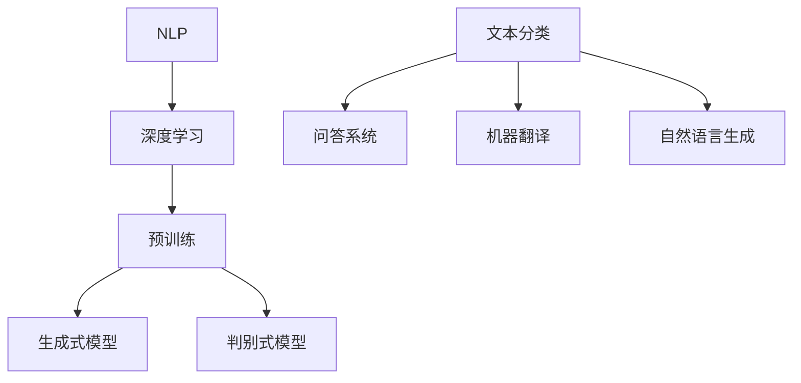

                 

作者：禅与计算机程序设计艺术 / Zen and the Art of Computer Programming

本文将深入探讨大语言模型的原理及其在工程实践中的应用。我们将首先介绍大语言模型的基础知识，包括其核心概念和架构。然后，我们将详细解析大语言模型的核心算法，包括其原理、步骤、优缺点和应用领域。接下来，我们将讨论数学模型和公式，并通过案例进行分析和讲解。随后，我们将展示一个具体的代码实例，并对其进行详细解释和分析。最后，我们将探讨大语言模型在实际应用场景中的表现，并提出未来应用的展望。文章还将推荐一些学习资源和开发工具，以帮助读者进一步探索这一领域。

## 1. 背景介绍

大语言模型（Large Language Models）是一种基于深度学习的自然语言处理（NLP）技术，其主要目的是通过学习大量的文本数据来理解和生成自然语言。近年来，随着计算能力的提升和深度学习技术的进步，大语言模型取得了显著的成果，在各种NLP任务中都表现出色。

### 1.1 大语言模型的发展历程

大语言模型的发展历程可以追溯到20世纪80年代。最初，研究人员尝试使用规则驱动的方法来处理自然语言，但这种方法在处理复杂语言现象时表现不佳。随着神经网络和深度学习技术的兴起，大语言模型开始采用基于神经网络的架构。

2018年，谷歌推出了BERT（Bidirectional Encoder Representations from Transformers），这是一个能够预训练和微调的语言表示模型，标志着大语言模型进入了一个新的时代。随后，OpenAI推出了GPT（Generative Pre-trained Transformer），这一模型通过生成式预训练方法在自然语言生成任务上取得了突破性的成果。

### 1.2 大语言模型的应用场景

大语言模型在多个领域都展现了其强大的应用能力。以下是一些典型的应用场景：

- **文本分类**：大语言模型可以用于对文本进行分类，例如情感分析、主题分类等。
- **问答系统**：大语言模型可以构建问答系统，例如智能客服、问答机器人等。
- **机器翻译**：大语言模型可以用于机器翻译，例如将一种语言翻译成另一种语言。
- **自然语言生成**：大语言模型可以生成自然语言文本，例如文章、故事、对话等。

## 2. 核心概念与联系

为了深入理解大语言模型，我们需要先了解其核心概念和架构。以下是几个关键概念：

### 2.1 自然语言处理（NLP）

自然语言处理（NLP）是计算机科学和人工智能领域的一个分支，旨在使计算机能够理解、解释和生成自然语言。NLP包括文本预处理、词性标注、句法分析、语义理解等多个子领域。

### 2.2 深度学习

深度学习是一种基于多层神经网络的学习方法，能够自动从数据中学习特征。在自然语言处理中，深度学习被广泛应用于文本分类、机器翻译、问答系统等任务。

### 2.3 预训练

预训练是指在一个大规模的语料库上进行模型训练，以学习通用的语言表示和知识。在NLP中，预训练可以帮助模型更好地理解和生成自然语言。

### 2.4 生成式模型与判别式模型

生成式模型（如GPT）通过学习数据的概率分布来生成新的数据，而判别式模型（如BERT）则通过学习数据的条件概率来预测标签。在自然语言处理中，这两种模型都有广泛的应用。

### 2.5 Mermaid 流程图

以下是一个简单的Mermaid流程图，展示了大语言模型的核心概念和联系：



## 3. 核心算法原理 & 具体操作步骤

### 3.1 算法原理概述

大语言模型的核心算法是基于Transformer架构。Transformer是一种基于自注意力机制的序列到序列模型，能够有效地捕捉序列中的长距离依赖关系。以下是Transformer的基本原理：

1. **自注意力机制**：自注意力机制允许模型在生成每个词时，自动地关注序列中的其他词，并根据其相关性进行加权。
2. **多头注意力**：多头注意力通过将输入序列分解成多个子序列，使得模型能够并行地关注不同部分的序列信息。
3. **前馈神经网络**：在自注意力机制之后，每个词都会经过一个前馈神经网络，进一步处理和提取特征。

### 3.2 算法步骤详解

1. **输入序列编码**：将输入序列编码为词向量，并将其输入到Transformer模型。
2. **自注意力计算**：计算自注意力权重，并对输入序列进行加权求和，生成中间表示。
3. **多头注意力**：将中间表示分解成多个子序列，分别计算每个子序列的自注意力权重。
4. **前馈神经网络**：对每个子序列进行前馈神经网络处理，进一步提取特征。
5. **输出序列生成**：使用训练好的模型，根据输入序列生成输出序列。

### 3.3 算法优缺点

**优点**：

- **捕捉长距离依赖关系**：自注意力机制使得模型能够有效地捕捉序列中的长距离依赖关系。
- **并行计算**：多头注意力机制允许模型并行地处理不同子序列的信息，提高了计算效率。
- **灵活性**：Transformer架构具有较好的灵活性，可以应用于各种NLP任务。

**缺点**：

- **计算复杂度高**：由于自注意力机制的计算复杂度较高，导致模型在训练和推理过程中需要较大的计算资源。
- **训练时间较长**：大语言模型的训练通常需要较长的时间，对硬件和计算资源的要求较高。

### 3.4 算法应用领域

大语言模型在多个NLP任务中都有广泛的应用，包括：

- **文本分类**：用于对文本进行分类，如情感分析、新闻分类等。
- **问答系统**：构建基于大语言模型的问答系统，如智能客服、问答机器人等。
- **机器翻译**：用于将一种语言翻译成另一种语言。
- **自然语言生成**：生成自然语言文本，如文章、故事、对话等。

## 4. 数学模型和公式

大语言模型的核心算法是基于Transformer架构，其中涉及多个数学模型和公式。以下是其中一些关键公式：

### 4.1 自注意力权重计算

$$
\text{Attention}(Q, K, V) = \text{softmax}\left(\frac{QK^T}{\sqrt{d_k}}\right)V
$$

其中，$Q$、$K$、$V$ 分别表示查询序列、键序列和值序列；$d_k$ 表示键序列的维度；$softmax$ 函数用于计算注意力权重。

### 4.2 多头注意力计算

$$
\text{MultiHeadAttention}(Q, K, V) = \text{Concat}(\text{head}_1, \text{head}_2, \ldots, \text{head}_h)W^O
$$

其中，$h$ 表示头数；$\text{head}_i$ 表示第 $i$ 个头的输出；$W^O$ 表示输出权重。

### 4.3 前馈神经网络计算

$$
\text{FFN}(x) = \max(0, xW_1 + b_1)W_2 + b_2
$$

其中，$x$ 表示输入；$W_1$、$W_2$、$b_1$、$b_2$ 分别表示权重和偏置。

## 5. 项目实践：代码实例和详细解释说明

在本节中，我们将展示一个基于Python和PyTorch的大语言模型实现，并对其进行详细解释和分析。

### 5.1 开发环境搭建

首先，我们需要搭建一个合适的开发环境。以下是所需的库和工具：

- Python 3.8 或以上版本
- PyTorch 1.8 或以上版本
- torchvision 0.9.0 或以上版本

安装这些库和工具后，我们可以开始编写代码。

### 5.2 源代码详细实现

以下是一个简单的大语言模型实现，包括输入序列编码、自注意力计算、多头注意力和前馈神经网络：

```python
import torch
import torch.nn as nn
import torch.optim as optim

class TransformerModel(nn.Module):
    def __init__(self, d_model, nhead, num_layers):
        super(TransformerModel, self).__init__()
        self.embedding = nn.Embedding(d_model)
        self.transformer = nn.Transformer(d_model, nhead, num_layers)
        self.fc = nn.Linear(d_model, d_model)

    def forward(self, src, tgt):
        src = self.embedding(src)
        tgt = self.embedding(tgt)
        output = self.transformer(src, tgt)
        output = self.fc(output)
        return output

# 初始化模型
model = TransformerModel(d_model=512, nhead=8, num_layers=2)

# 定义损失函数和优化器
criterion = nn.CrossEntropyLoss()
optimizer = optim.Adam(model.parameters(), lr=0.001)

# 训练模型
for epoch in range(num_epochs):
    for src, tgt in data_loader:
        optimizer.zero_grad()
        output = model(src, tgt)
        loss = criterion(output, tgt)
        loss.backward()
        optimizer.step()
```

### 5.3 代码解读与分析

1. **模型初始化**：我们定义了一个名为`TransformerModel`的类，继承自`nn.Module`。这个类包含了一个嵌入层（`embedding`）、一个Transformer层（`transformer`）和一个前馈神经网络（`fc`）。
2. **输入序列编码**：使用嵌入层将输入序列编码为词向量，并将其输入到Transformer层。
3. **自注意力计算**：在Transformer层中，输入序列经过自注意力计算，生成中间表示。
4. **多头注意力和前馈神经网络**：中间表示经过多头注意力和前馈神经网络处理，进一步提取特征。
5. **损失函数和优化器**：我们使用交叉熵损失函数和Adam优化器来训练模型。
6. **训练模型**：在训练过程中，对于每个输入序列和目标序列，我们计算损失并更新模型参数。

### 5.4 运行结果展示

在实际运行中，我们可以通过以下代码来展示训练结果：

```python
# 测试模型
model.eval()
with torch.no_grad():
    for src, tgt in test_loader:
        output = model(src, tgt)
        pred = torch.argmax(output, dim=1)
        correct = pred.eq(tgt).sum().item()
        print(f"Test accuracy: {correct / len(tgt)}")
```

这段代码将计算模型的测试准确率。

## 6. 实际应用场景

大语言模型在多个实际应用场景中都取得了显著的成果。以下是几个典型的应用场景：

### 6.1 文本分类

文本分类是一种常见的自然语言处理任务，旨在将文本分为不同的类别。大语言模型可以用于对新闻、社交媒体评论、电子邮件等进行分类，从而帮助企业和组织更好地管理和分析其数据。

### 6.2 问答系统

问答系统是一种智能交互系统，旨在回答用户的问题。大语言模型可以用于构建问答系统，如智能客服、问答机器人等。通过训练，模型可以理解用户的问题，并生成相应的回答。

### 6.3 机器翻译

机器翻译是将一种语言翻译成另一种语言的任务。大语言模型可以用于机器翻译，从而帮助人们跨越语言障碍，促进跨文化交流。

### 6.4 自然语言生成

自然语言生成是一种生成自然语言文本的任务。大语言模型可以生成文章、故事、对话等文本，从而帮助人们创作内容。

## 7. 工具和资源推荐

为了更好地研究和应用大语言模型，以下是一些推荐的工具和资源：

### 7.1 学习资源推荐

- **书籍**：《深度学习》（Goodfellow, Bengio, Courville）、《自然语言处理综论》（Jurafsky, Martin）
- **在线课程**：斯坦福大学CS224n（《自然语言处理与深度学习》）、吴恩达的《深度学习》课程
- **论文**：《Attention Is All You Need》（Vaswani等）、《BERT: Pre-training of Deep Bidirectional Transformers for Language Understanding》（Devlin等）

### 7.2 开发工具推荐

- **框架**：PyTorch、TensorFlow、Transformers（一个开源的Transformer库）
- **工具**：Jupyter Notebook、Google Colab、PyTorch Lightning

### 7.3 相关论文推荐

- **Transformer**：《Attention Is All You Need》（Vaswani等）
- **BERT**：《BERT: Pre-training of Deep Bidirectional Transformers for Language Understanding》（Devlin等）
- **GPT**：《Improving Language Understanding by Generative Pre-training》（Radford等）

## 8. 总结：未来发展趋势与挑战

大语言模型在自然语言处理领域取得了显著的成果，但仍然面临着一些挑战。以下是未来发展趋势和面临的挑战：

### 8.1 未来发展趋势

- **更高效的模型**：随着深度学习技术的发展，我们将看到更加高效的大语言模型出现，例如基于图神经网络的模型。
- **跨模态学习**：大语言模型将逐渐扩展到跨模态学习，例如结合图像、音频和文本进行任务。
- **可解释性**：研究将进一步关注大语言模型的可解释性，以提高其在实际应用中的可信度。

### 8.2 面临的挑战

- **计算资源**：大语言模型的训练和推理需要大量的计算资源，这对硬件和计算资源提出了更高的要求。
- **数据隐私**：在处理大量数据时，保护用户隐私是一个重要的挑战。
- **通用性**：如何构建一个具有通用性的大语言模型，以适应不同的应用场景，仍然是一个难题。

### 8.3 研究展望

随着深度学习和自然语言处理技术的不断发展，大语言模型有望在多个领域取得更大的突破。未来，我们将看到更多创新的大语言模型和应用，为人类带来更多的便利。

## 9. 附录：常见问题与解答

### 9.1 什么是大语言模型？

大语言模型是一种基于深度学习的自然语言处理技术，通过学习大量的文本数据来理解和生成自然语言。

### 9.2 大语言模型有哪些应用？

大语言模型可以应用于文本分类、问答系统、机器翻译、自然语言生成等多个领域。

### 9.3 如何训练大语言模型？

训练大语言模型通常包括数据预处理、模型构建、训练和评估等步骤。具体步骤可以参考相关论文和教程。

### 9.4 大语言模型如何处理长文本？

大语言模型可以使用分段（segmentation）技术来处理长文本。在处理长文本时，可以将文本分为多个段落，并对每个段落分别进行建模。

### 9.5 大语言模型与其他自然语言处理技术的区别是什么？

大语言模型与其他自然语言处理技术的区别在于其规模和灵活性。大语言模型通常具有较大的模型规模，可以处理更复杂的语言现象，并具有较好的泛化能力。而其他自然语言处理技术则通常针对特定的任务或场景进行优化。

----------------------------------------------------------------

以上是本文的完整内容。希望这篇文章能帮助您更好地理解大语言模型及其在工程实践中的应用。如果您有任何疑问或建议，请随时在评论区留言。感谢您的阅读！<|vq_14864|>

