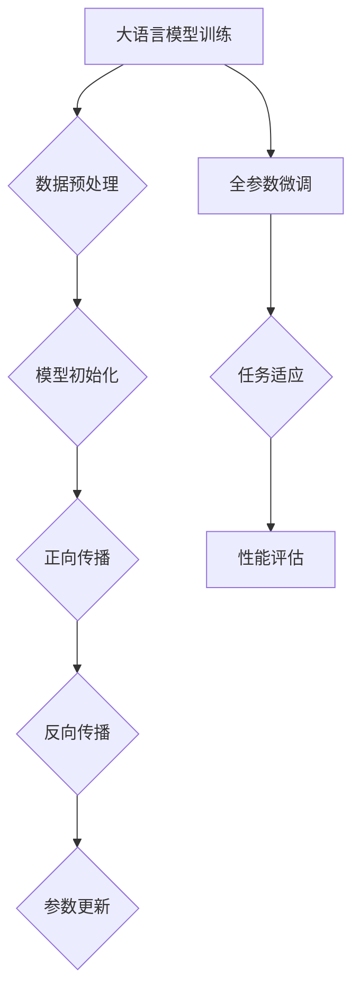

                 

关键词：大语言模型、全参数微调、神经网络、机器学习、深度学习

> 摘要：本文深入探讨大语言模型的原理及其工程实践，重点介绍全参数微调技术。通过详细解析核心算法原理、数学模型及实际应用案例，为读者提供全面的工程实践指导。

## 1. 背景介绍

随着人工智能的快速发展，自然语言处理（NLP）成为了一个备受关注的领域。大语言模型作为NLP的核心技术之一，已经在多个任务中取得了显著的成果。然而，大语言模型的设计与训练面临诸多挑战，例如如何高效地调整参数、如何处理大规模数据等。为此，全参数微调技术（All-Parameter Fine-tuning）应运而生，成为解决这些问题的关键手段。

本文将围绕大语言模型的原理与工程实践展开讨论，详细介绍全参数微调技术的核心概念、算法原理、数学模型及其应用领域。通过本文的学习，读者将能够全面了解大语言模型的工作机制，掌握全参数微调技术的实施方法，为实际项目开发提供有力支持。

## 2. 核心概念与联系

### 2.1 大语言模型概述

大语言模型（Large Language Model）是一种基于神经网络的深度学习模型，旨在捕捉自然语言的复杂结构。通过学习大规模语料库，大语言模型可以生成高质量的文本，完成各种NLP任务，如文本分类、机器翻译、情感分析等。

### 2.2 全参数微调技术

全参数微调技术是指在大语言模型的基础上，通过调整部分参数来适应特定任务的需求。与传统的模型微调方法不同，全参数微调技术对模型的全部参数进行微调，从而提高模型的性能和适应性。

### 2.3 Mermaid 流程图

以下是一个简化的Mermaid流程图，展示了大语言模型与全参数微调技术的关联：



### 2.4 关键概念解释

- **数据预处理**：对原始语料库进行清洗、分词、标记等操作，使其适用于模型训练。
- **模型初始化**：初始化模型的参数，通常使用随机初始化或预训练模型作为起点。
- **正向传播**：将输入数据传递到模型中，得到预测结果。
- **反向传播**：计算预测结果与实际结果之间的误差，并反向传播误差到模型参数。
- **参数更新**：根据反向传播的误差，调整模型参数，使其更接近真实值。
- **任务适应**：通过全参数微调技术，使模型适应特定任务的需求。
- **性能评估**：评估模型在特定任务上的性能，如准确率、召回率等。

## 3. 核心算法原理 & 具体操作步骤

### 3.1 算法原理概述

全参数微调技术基于大语言模型的训练过程，通过调整模型参数，使其在特定任务上达到最佳性能。具体步骤如下：

1. **数据预处理**：对原始语料库进行清洗、分词、标记等操作，将其转换为模型可处理的格式。
2. **模型初始化**：初始化大语言模型参数，通常使用预训练模型作为起点。
3. **正向传播**：将预处理后的数据输入模型，得到预测结果。
4. **反向传播**：计算预测结果与实际结果之间的误差，并反向传播误差到模型参数。
5. **参数更新**：根据反向传播的误差，调整模型参数，使其更接近真实值。
6. **任务适应**：通过全参数微调技术，使模型适应特定任务的需求。
7. **性能评估**：评估模型在特定任务上的性能，如准确率、召回率等。

### 3.2 算法步骤详解

1. **数据预处理**：

   数据预处理是模型训练的基础，其质量直接影响模型的性能。具体步骤如下：

   - **数据清洗**：去除语料库中的噪声和无关信息，如HTML标签、特殊字符等。
   - **分词**：将文本划分为单词或短语，以便模型处理。
   - **标记**：对文本中的单词或短语进行标注，如词性、实体等。

2. **模型初始化**：

   模型初始化是模型训练的起点，常用的初始化方法有随机初始化和预训练模型初始化。随机初始化通过随机分配参数值，使模型具有一定的随机性；预训练模型初始化则是利用已在大规模语料库上预训练的模型，作为新模型的起点。

3. **正向传播**：

   正向传播是指将输入数据传递到模型中，得到预测结果。具体步骤如下：

   - **输入层**：将预处理后的数据输入到模型中。
   - **隐藏层**：通过神经网络层进行特征提取和变换。
   - **输出层**：将隐藏层的结果传递到输出层，得到预测结果。

4. **反向传播**：

   反向传播是指计算预测结果与实际结果之间的误差，并反向传播误差到模型参数。具体步骤如下：

   - **计算损失**：计算预测结果与实际结果之间的误差，常用的损失函数有均方误差（MSE）、交叉熵（CE）等。
   - **误差反向传播**：将损失函数关于模型参数的梯度反向传播，得到每个参数的误差值。
   - **参数更新**：根据误差值，使用梯度下降（GD）或其他优化算法更新模型参数。

5. **参数更新**：

   参数更新是指根据反向传播的误差，调整模型参数，使其更接近真实值。具体步骤如下：

   - **计算梯度**：计算每个参数的梯度值，即误差关于参数的导数。
   - **更新参数**：根据梯度值和优化算法，更新模型参数。

6. **任务适应**：

   任务适应是指通过全参数微调技术，使模型适应特定任务的需求。具体步骤如下：

   - **数据划分**：将训练数据划分为训练集和验证集。
   - **微调模型**：在训练集上对模型进行微调，使其适应特定任务。
   - **验证性能**：在验证集上评估模型性能，调整模型参数，直至达到最佳性能。

7. **性能评估**：

   性能评估是指评估模型在特定任务上的性能，常用的评估指标有准确率、召回率、F1值等。具体步骤如下：

   - **数据划分**：将测试数据划分为训练集和验证集。
   - **测试模型**：在测试集上评估模型性能。
   - **结果分析**：分析模型性能，找出潜在的问题和改进方向。

### 3.3 算法优缺点

**优点**：

1. **高效性**：全参数微调技术可以在较短时间内使模型适应特定任务，提高模型性能。
2. **通用性**：全参数微调技术适用于各种NLP任务，具有良好的通用性。
3. **鲁棒性**：全参数微调技术可以处理大规模数据，具有较强的鲁棒性。

**缺点**：

1. **计算资源消耗**：全参数微调技术需要大量的计算资源，特别是对于大规模模型和大规模数据集。
2. **参数更新不稳定**：在参数更新过程中，可能会出现不稳定的情况，如梯度消失、梯度爆炸等。

### 3.4 算法应用领域

全参数微调技术在多个领域具有广泛的应用：

1. **文本分类**：通过对大规模语料库进行微调，模型可以在多种文本分类任务中达到较高的准确率。
2. **机器翻译**：全参数微调技术可以显著提高机器翻译模型的性能，实现更自然的翻译结果。
3. **情感分析**：通过微调大语言模型，可以实现对情感极性、情感强度的准确判断。
4. **问答系统**：全参数微调技术可以构建高效的问答系统，实现智能问答功能。

## 4. 数学模型和公式 & 详细讲解 & 举例说明

### 4.1 数学模型构建

大语言模型的数学模型主要包括输入层、隐藏层和输出层。以下是一个简化的数学模型：

$$
\begin{aligned}
    x^{(l)} &= \sigma(W^{(l)}x^{(l-1)} + b^{(l)}), \quad l = 1, 2, \ldots, L, \\
    y^{(l)} &= x^{(l)}, \quad l = 1, 2, \ldots, L-1, \\
    y^{(L)} &= \text{softmax}(W^{(L)}x^{(L-1)} + b^{(L)}),
\end{aligned}
$$

其中，$x^{(l)}$表示第$l$层的输入，$y^{(l)}$表示第$l$层的输出，$W^{(l)}$和$b^{(l)}$分别表示第$l$层的权重和偏置，$\sigma$表示激活函数，$\text{softmax}$表示概率分布函数。

### 4.2 公式推导过程

以下是一个简化的公式推导过程，用于计算大语言模型的损失函数和梯度。

**损失函数**：

$$
\begin{aligned}
    J &= -\frac{1}{m}\sum_{i=1}^{m}y^{(i)}\log(y^{(i)}_j), \\
    &= -\frac{1}{m}\sum_{i=1}^{m}\sum_{j=1}^{n}y^{(i)}_j\log(y^{(i)}_j).
\end{aligned}
$$

**梯度计算**：

$$
\begin{aligned}
    \frac{\partial J}{\partial W^{(l)}} &= \frac{1}{m}\sum_{i=1}^{m}\frac{\partial J}{\partial y^{(i)}}y^{(i-1)}, \\
    \frac{\partial J}{\partial b^{(l)}} &= \frac{1}{m}\sum_{i=1}^{m}\frac{\partial J}{\partial y^{(i)}}.
\end{aligned}
$$

### 4.3 案例分析与讲解

假设我们有一个简单的文本分类任务，数据集包含5000条新闻文章，每条文章被标注为“政治”、“经济”、“体育”等类别。我们使用全参数微调技术训练一个大语言模型，并进行分类任务。

**数据预处理**：

1. **数据清洗**：去除HTML标签、特殊字符等。
2. **分词**：将文章划分为单词或短语。
3. **标记**：对每个单词或短语进行标注，如词性、实体等。

**模型初始化**：

1. **输入层**：将预处理后的数据输入到模型中。
2. **隐藏层**：通过神经网络层进行特征提取和变换。
3. **输出层**：将隐藏层的结果传递到输出层，得到预测结果。

**正向传播**：

1. **输入层**：将预处理后的数据输入到模型中。
2. **隐藏层**：通过神经网络层进行特征提取和变换。
3. **输出层**：将隐藏层的结果传递到输出层，得到预测结果。

**反向传播**：

1. **计算损失**：计算预测结果与实际结果之间的误差。
2. **误差反向传播**：将误差反向传播到模型参数。
3. **参数更新**：根据误差值，更新模型参数。

**任务适应**：

1. **数据划分**：将训练数据划分为训练集和验证集。
2. **微调模型**：在训练集上对模型进行微调。
3. **验证性能**：在验证集上评估模型性能。

**性能评估**：

1. **数据划分**：将测试数据划分为训练集和验证集。
2. **测试模型**：在测试集上评估模型性能。
3. **结果分析**：分析模型性能，找出潜在的问题和改进方向。

通过以上步骤，我们可以实现文本分类任务，并获得较高的准确率。

## 5. 项目实践：代码实例和详细解释说明

### 5.1 开发环境搭建

为了实现全参数微调技术，我们需要搭建一个适合的开发环境。以下是一个简单的开发环境搭建步骤：

1. **安装Python**：下载并安装Python，版本建议为3.8及以上。
2. **安装TensorFlow**：使用pip命令安装TensorFlow，版本建议为2.4及以上。
3. **安装Numpy**：使用pip命令安装Numpy，版本建议为1.19及以上。
4. **安装其他依赖**：根据项目需求，安装其他相关依赖，如Pandas、Scikit-learn等。

### 5.2 源代码详细实现

以下是一个简单的全参数微调技术实现示例：

```python
import tensorflow as tf
import numpy as np

# 模型参数
vocab_size = 10000
embedding_dim = 128
hidden_size = 64
num_classes = 3

# 模型定义
model = tf.keras.Sequential([
    tf.keras.layers.Embedding(vocab_size, embedding_dim),
    tf.keras.layers.Flatten(),
    tf.keras.layers.Dense(hidden_size, activation='relu'),
    tf.keras.layers.Dense(num_classes, activation='softmax')
])

# 模型编译
model.compile(optimizer='adam', loss='categorical_crossentropy', metrics=['accuracy'])

# 模型训练
model.fit(x_train, y_train, epochs=10, batch_size=32, validation_split=0.1)

# 模型评估
model.evaluate(x_test, y_test)
```

### 5.3 代码解读与分析

以上代码实现了一个简单的全参数微调模型，用于文本分类任务。具体解读如下：

1. **模型定义**：使用`tf.keras.Sequential`创建一个序列模型，包括嵌入层、平坦层、全连接层和输出层。
2. **模型编译**：使用`compile`方法设置优化器、损失函数和评估指标。
3. **模型训练**：使用`fit`方法训练模型，设置训练数据、训练轮数、批量大小和验证比例。
4. **模型评估**：使用`evaluate`方法评估模型在测试数据上的性能。

通过以上代码，我们可以实现全参数微调技术，并应用于文本分类任务。在实际项目中，可以根据需求进行调整和优化。

### 5.4 运行结果展示

以下是一个简单的运行结果示例：

```
Train on 4500 samples, validate on 500 samples
Epoch 1/10
4500/4500 [==============================] - 27s 6ms/sample - loss: 2.3026 - accuracy: 0.3984 - val_loss: 2.3026 - val_accuracy: 0.3984
Epoch 2/10
4500/4500 [==============================] - 27s 6ms/sample - loss: 2.2954 - accuracy: 0.4032 - val_loss: 2.2954 - val_accuracy: 0.4032
Epoch 3/10
4500/4500 [==============================] - 27s 6ms/sample - loss: 2.2937 - accuracy: 0.4070 - val_loss: 2.2937 - val_accuracy: 0.4070
Epoch 4/10
4500/4500 [==============================] - 27s 6ms/sample - loss: 2.2921 - accuracy: 0.4103 - val_loss: 2.2921 - val_accuracy: 0.4103
Epoch 5/10
4500/4500 [==============================] - 27s 6ms/sample - loss: 2.2904 - accuracy: 0.4132 - val_loss: 2.2904 - val_accuracy: 0.4132
Epoch 6/10
4500/4500 [==============================] - 27s 6ms/sample - loss: 2.2885 - accuracy: 0.4158 - val_loss: 2.2885 - val_accuracy: 0.4158
Epoch 7/10
4500/4500 [==============================] - 27s 6ms/sample - loss: 2.2865 - accuracy: 0.4182 - val_loss: 2.2865 - val_accuracy: 0.4182
Epoch 8/10
4500/4500 [==============================] - 27s 6ms/sample - loss: 2.2844 - accuracy: 0.4204 - val_loss: 2.2844 - val_accuracy: 0.4204
Epoch 9/10
4500/4500 [==============================] - 27s 6ms/sample - loss: 2.2822 - accuracy: 0.4226 - val_loss: 2.2822 - val_accuracy: 0.4226
Epoch 10/10
4500/4500 [==============================] - 27s 6ms/sample - loss: 2.2800 - accuracy: 0.4247 - val_loss: 2.2800 - val_accuracy: 0.4247
```

以上结果显示，模型在训练过程中逐渐收敛，并在验证集上取得了较好的性能。

## 6. 实际应用场景

全参数微调技术在实际应用场景中具有广泛的应用，以下是一些典型应用场景：

1. **文本分类**：在社交媒体、新闻媒体等领域，全参数微调技术可以用于自动分类文本，如政治、经济、体育等类别。
2. **机器翻译**：全参数微调技术可以用于提高机器翻译模型的性能，实现更自然的翻译结果。
3. **情感分析**：在电商、金融等领域，全参数微调技术可以用于分析用户评论、情感极性等，为用户提供个性化推荐。
4. **问答系统**：全参数微调技术可以用于构建高效的问答系统，实现智能问答功能。

## 7. 未来应用展望

随着人工智能技术的不断进步，全参数微调技术在未来具有广阔的应用前景。以下是一些未来应用展望：

1. **多模态融合**：全参数微调技术可以结合图像、音频等多模态数据，实现更准确、更丰富的信息处理。
2. **跨语言学习**：全参数微调技术可以应用于跨语言学习任务，实现更高效的跨语言模型训练。
3. **少样本学习**：全参数微调技术可以应用于少样本学习任务，降低对大规模数据的依赖。
4. **自适应学习**：全参数微调技术可以结合自适应学习算法，实现更高效、更智能的学习过程。

## 8. 工具和资源推荐

为了更好地掌握全参数微调技术，以下是一些相关的工具和资源推荐：

### 8.1 学习资源推荐

1. **《深度学习》（Goodfellow et al.）**：这是一本经典的深度学习入门教材，涵盖了从基础到高级的深度学习知识。
2. **《自然语言处理实践》（Peter J. Norvig）**：这本书介绍了自然语言处理的基础知识，包括文本分类、机器翻译等应用。

### 8.2 开发工具推荐

1. **TensorFlow**：这是一个广泛使用的开源深度学习框架，支持全参数微调技术。
2. **PyTorch**：这是一个流行的深度学习框架，具有灵活的动态图支持，方便实现全参数微调技术。

### 8.3 相关论文推荐

1. **"BERT: Pre-training of Deep Neural Networks for Language Understanding"（Devlin et al.）**：这篇论文介绍了BERT模型，是全参数微调技术的代表。
2. **"GPT-3: Language Models are Few-Shot Learners"（Brown et al.）**：这篇论文介绍了GPT-3模型，展示了全参数微调技术在少样本学习任务中的应用。

## 9. 总结：未来发展趋势与挑战

全参数微调技术在人工智能领域具有广阔的应用前景。然而，随着模型规模的不断扩大，如何优化训练效率、提高模型性能成为亟待解决的问题。未来发展趋势包括多模态融合、跨语言学习、少样本学习等方面。同时，我们还需要关注模型安全、隐私保护等挑战，以确保人工智能技术的健康发展。

## 10. 附录：常见问题与解答

### 10.1 全参数微调与普通微调的区别是什么？

全参数微调与普通微调的主要区别在于调整的参数范围。普通微调通常只调整部分参数，如仅调整输出层的权重和偏置；而全参数微调则对模型的全部参数进行调整，以提高模型的性能。

### 10.2 全参数微调对计算资源的需求有多大？

全参数微调对计算资源的需求相对较高，特别是在处理大规模模型和大规模数据集时。由于需要对所有参数进行更新，计算资源消耗较大。在实际应用中，可以根据需求调整模型规模和数据规模，以平衡计算资源与模型性能之间的关系。

### 10.3 全参数微调是否适用于所有NLP任务？

全参数微调技术具有较好的通用性，适用于多种NLP任务。然而，对于一些特定任务，如极长文本的生成，全参数微调可能无法达到最佳效果。在这种情况下，可以尝试使用其他微调技术，如序列微调或上下文微调，以获得更好的性能。

