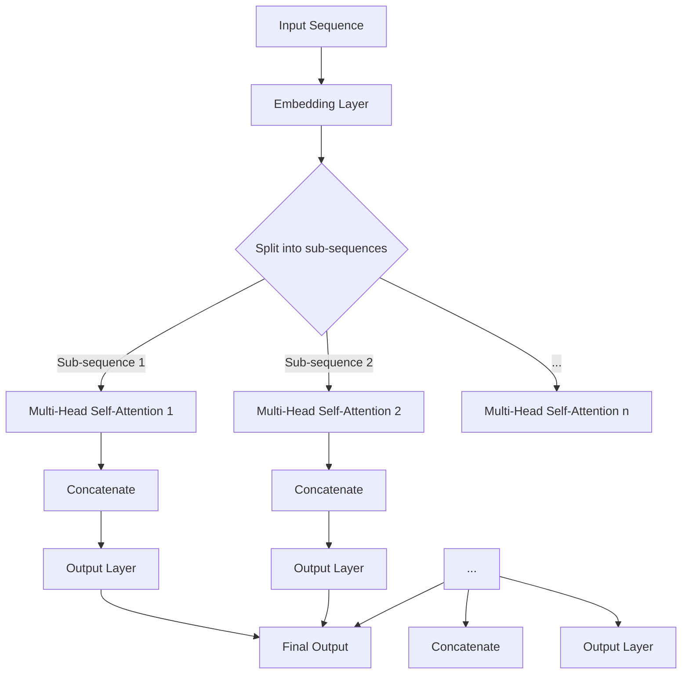

                 

关键词：大语言模型，多头自注意力模块，自注意力机制，深度学习，自然语言处理，神经网络，BERT，Transformer

## 摘要

本文旨在探讨大语言模型（Large Language Models，简称LLM）中的核心模块——多头自注意力模块（Multi-Head Self-Attention Module）。通过本文的详细讲解，读者将了解多头自注意力模块的背景、基本原理、数学模型以及其在自然语言处理（Natural Language Processing，简称NLP）领域的重要应用。本文还将结合具体的项目实践，展示如何使用多头自注意力模块构建高效的语言模型，并对其在实际应用中的表现进行深入分析。

## 1. 背景介绍

随着深度学习和自然语言处理技术的快速发展，大语言模型已经成为自然语言处理领域的基石。这些模型具有强大的语义理解和生成能力，广泛应用于机器翻译、文本生成、问答系统等任务。在众多的大语言模型中，Transformer模型因其创新的自注意力机制（Self-Attention Mechanism）而受到广泛关注。Transformer模型的核心模块——多头自注意力模块，使得模型能够在处理序列数据时具备并行计算的能力，极大地提高了模型的效率和性能。

### Transformer模型的背景

Transformer模型由Vaswani等人于2017年提出，是自然语言处理领域的一次重大突破。与传统的循环神经网络（Recurrent Neural Network，简称RNN）和卷积神经网络（Convolutional Neural Network，简称CNN）不同，Transformer模型完全基于自注意力机制，避免了序列到序列的顺序依赖性。这种设计使得Transformer模型在处理长序列数据时表现出色，并且能够在训练过程中利用并行计算，从而大幅度提高训练速度。

### 自注意力机制的概念

自注意力机制是一种基于序列数据的一种权重化方法，它通过计算输入序列中每个元素之间的相似性，从而对序列进行加权。在自注意力机制中，每个输入序列元素都能够直接与其他元素交互，而不是像RNN和CNN那样依赖前一个元素。这种机制使得模型能够捕捉到输入序列中的长距离依赖关系。

## 2. 核心概念与联系

为了更好地理解多头自注意力模块，我们先来探讨其背后的核心概念和联系。

### 2.1 注意力机制

注意力机制（Attention Mechanism）是一种用于处理序列数据的方法，它通过计算输入序列中各个元素之间的相似性，然后将权重分配给这些元素，从而实现对这些元素的关注。注意力机制的核心思想是将序列中的每个元素看作是一个潜在的输入，然后计算每个元素对最终输出的贡献。

### 2.2 自注意力机制

自注意力机制（Self-Attention Mechanism）是一种特殊的注意力机制，它仅关注输入序列中的元素，而不是输入序列和目标序列之间的交互。自注意力机制通过计算输入序列中各个元素之间的相似性，然后将权重分配给这些元素，从而实现对输入序列的加权。这种机制在处理序列数据时具有并行计算的优势，可以显著提高模型的计算效率。

### 2.3 多头自注意力

多头自注意力（Multi-Head Self-Attention）是一种扩展自注意力机制的方法，它通过将输入序列分成多个子序列，然后分别对每个子序列应用自注意力机制。多头自注意力的核心思想是利用多个子序列之间的差异，从而提高模型捕捉序列中复杂依赖关系的能力。

### 2.4 自注意力机制的 Mermaid 流程图

为了更好地理解自注意力机制的工作原理，我们使用Mermaid绘制了一个简化的流程图。



在上面的流程图中，输入序列首先经过嵌入层（Embedding Layer）转换为嵌入向量（Embedding Vectors）。然后，这些嵌入向量被分成多个子序列，并分别应用于多个多头自注意力层（Multi-Head Self-Attention Layers）。每个多头自注意力层都会对子序列进行加权，并将加权后的结果进行拼接。最后，拼接后的结果经过输出层（Output Layer）得到最终的输出。

## 3. 核心算法原理 & 具体操作步骤

### 3.1 算法原理概述

多头自注意力模块是Transformer模型的核心组件，其基本原理可以概括为以下几个步骤：

1. **输入序列嵌入**：将输入序列中的每个单词或字符映射为高维的嵌入向量。
2. **多头分割**：将输入序列分割为多个子序列，每个子序列对应一个头（Head）。
3. **自注意力计算**：对每个子序列应用自注意力机制，计算子序列中每个元素之间的相似性，并分配权重。
4. **权重加和**：将自注意力计算的结果加和，得到加权后的子序列。
5. **多头拼接**：将所有头的输出拼接在一起，形成一个更丰富的序列表示。
6. **输出层**：通过输出层将拼接后的序列映射到目标空间。

### 3.2 算法步骤详解

1. **输入序列嵌入**：
   输入序列通常由单词或字符组成，首先需要将这些符号映射为嵌入向量。这个过程可以通过预训练的词向量（如Word2Vec、GloVe）或训练过程中自动学习。

2. **多头分割**：
   将嵌入向量分割为多个子序列，每个子序列对应一个头。分割的方式可以是等分，也可以根据子序列的长度动态调整。

3. **自注意力计算**：
   对每个子序列应用自注意力机制。自注意力计算可以分为以下几个步骤：
   - **计算相似性**：使用点积（Dot-Product）或缩放点积（Scaled Dot-Product）计算子序列中每个元素之间的相似性。
   - **应用softmax**：将相似性分数应用softmax函数，得到概率分布。
   - **权重加和**：根据概率分布对子序列中的元素进行加权，并加和得到加权后的子序列。

4. **权重加和**：
   将每个头的加权后的子序列进行拼接，形成一个更丰富的序列表示。

5. **输出层**：
   通过输出层将拼接后的序列映射到目标空间。输出层通常是一个全连接层（Fully Connected Layer），用于进行分类或回归任务。

### 3.3 算法优缺点

**优点**：
1. **并行计算**：自注意力机制允许模型在处理序列数据时进行并行计算，从而提高计算效率。
2. **长距离依赖**：多头自注意力模块能够捕捉序列中的长距离依赖关系，提高了模型的语义理解能力。
3. **灵活性强**：自注意力机制可以灵活地应用于各种序列数据，如文本、图像和音频。

**缺点**：
1. **计算量大**：多头自注意力模块的计算量相对较大，可能导致训练和推理速度较慢。
2. **参数复杂**：多头自注意力模块的参数较多，需要较大的计算资源和存储空间。

### 3.4 算法应用领域

多头自注意力模块在自然语言处理领域具有广泛的应用，以下是一些常见的应用场景：

1. **文本分类**：用于对文本进行分类，如情感分析、主题分类等。
2. **机器翻译**：用于将一种语言翻译成另一种语言，如英语到中文。
3. **文本生成**：用于生成文章、新闻、对话等文本内容。
4. **问答系统**：用于构建问答系统，如搜索引擎、聊天机器人等。

## 4. 数学模型和公式 & 详细讲解 & 举例说明

### 4.1 数学模型构建

多头自注意力模块的数学模型可以表示为：

$$
\text{Multi-Head Self-Attention}(Q, K, V) = \text{Concat}(\text{head}_1, \text{head}_2, \ldots, \text{head}_h) = \text{softmax}\left(\frac{QK^T}{\sqrt{d_k}}\right)V
$$

其中，$Q, K, V$ 分别表示查询（Query）、键（Key）和值（Value）三个嵌入矩阵，$h$ 表示头的数量，$d_k$ 表示每个键和查询的维度。

### 4.2 公式推导过程

多头自注意力模块的推导过程可以分为以下几个步骤：

1. **点积注意力**：
   点积注意力（Dot-Product Attention）是一种最简单的注意力机制，它通过计算查询（$Q$）和键（$K$）的点积来获取注意力分数。

   $$ 
   \text{Attention}(Q, K, V) = \text{softmax}\left(\frac{QK^T}{\sqrt{d_k}}\right)V
   $$

2. **多头注意力**：
   多头注意力（Multi-Head Attention）是将输入序列分割为多个子序列，并对每个子序列应用点积注意力。

   $$ 
   \text{Multi-Head Attention}(Q, K, V) = \text{Concat}(\text{head}_1, \text{head}_2, \ldots, \text{head}_h) = \text{softmax}\left(\frac{QK^T}{\sqrt{d_k}}\right)V
   $$

   其中，$h$ 表示头的数量，$\text{head}_i$ 表示第 $i$ 个头的输出。

3. **自注意力**：
   自注意力（Self-Attention）是对输入序列中的每个元素进行点积注意力。

   $$ 
   \text{Self-Attention}(Q, K, V) = \text{softmax}\left(\frac{QQ^T}{\sqrt{d_k}}\right)V
   $$

### 4.3 案例分析与讲解

为了更好地理解多头自注意力模块，我们来看一个简单的例子。

假设我们有一个输入序列 $[w_1, w_2, w_3]$，我们需要对这个序列应用多头自注意力模块。首先，我们将输入序列映射为嵌入向量，得到 $[Q, K, V]$。然后，我们假设有两个头（$h = 2$），则：

1. **第一个头**：

   - 查询：$Q_1 = [q_1, q_2, q_3]$
   - 键：$K_1 = [k_1, k_2, k_3]$
   - 值：$V_1 = [v_1, v_2, v_3]$

   点积注意力计算：

   $$ 
   \text{Attention}_1(Q_1, K_1, V_1) = \text{softmax}\left(\frac{Q_1K_1^T}{\sqrt{d_k}}\right)V_1
   $$

   得到注意力分数：

   $$ 
   \alpha_{11} = \frac{q_1k_1}{\sqrt{d_k}}, \alpha_{12} = \frac{q_1k_2}{\sqrt{d_k}}, \alpha_{13} = \frac{q_1k_3}{\sqrt{d_k}}
   $$

   $$ 
   \alpha_{21} = \frac{q_2k_1}{\sqrt{d_k}}, \alpha_{22} = \frac{q_2k_2}{\sqrt{d_k}}, \alpha_{23} = \frac{q_2k_3}{\sqrt{d_k}}
   $$

   $$ 
   \alpha_{31} = \frac{q_3k_1}{\sqrt{d_k}}, \alpha_{32} = \frac{q_3k_2}{\sqrt{d_k}}, \alpha_{33} = \frac{q_3k_3}{\sqrt{d_k}}
   $$

   注意力加权：

   $$ 
   \text{Attention}_1(Q_1, K_1, V_1) = \left[\alpha_{11}v_1, \alpha_{12}v_2, \alpha_{13}v_3\right]
   $$

   $$ 
   \text{Attention}_1(Q_1, K_1, V_1) = \left[\alpha_{21}v_1, \alpha_{22}v_2, \alpha_{23}v_3\right]
   $$

   $$ 
   \text{Attention}_1(Q_1, K_1, V_1) = \left[\alpha_{31}v_1, \alpha_{32}v_2, \alpha_{33}v_3\right]
   $$

2. **第二个头**：

   - 查询：$Q_2 = [q_1', q_2', q_3']$
   - 键：$K_2 = [k_1', k_2', k_3']$
   - 值：$V_2 = [v_1', v_2', v_3']$

   点积注意力计算：

   $$ 
   \text{Attention}_2(Q_2, K_2, V_2) = \text{softmax}\left(\frac{Q_2K_2^T}{\sqrt{d_k}}\right)V_2
   $$

   得到注意力分数：

   $$ 
   \alpha_{11}' = \frac{q_1'k_1'}{\sqrt{d_k}}, \alpha_{12}' = \frac{q_1'k_2'}{\sqrt{d_k}}, \alpha_{13}' = \frac{q_1'k_3'}{\sqrt{d_k}}
   $$

   $$ 
   \alpha_{21}' = \frac{q_2'k_1'}{\sqrt{d_k}}, \alpha_{22}' = \frac{q_2'k_2'}{\sqrt{d_k}}, \alpha_{23}' = \frac{q_2'k_3'}{\sqrt{d_k}}
   $$

   $$ 
   \alpha_{31}' = \frac{q_3'k_1'}{\sqrt{d_k}}, \alpha_{32}' = \frac{q_3'k_2'}{\sqrt{d_k}}, \alpha_{33}' = \frac{q_3'k_3'}{\sqrt{d_k}}
   $$

   注意力加权：

   $$ 
   \text{Attention}_2(Q_2, K_2, V_2) = \left[\alpha_{11}'v_1', \alpha_{12}'v_2', \alpha_{13}'v_3'\right]
   $$

   $$ 
   \text{Attention}_2(Q_2, K_2, V_2) = \left[\alpha_{21}'v_1', \alpha_{22}'v_2', \alpha_{23}'v_3'\right]
   $$

   $$ 
   \text{Attention}_2(Q_2, K_2, V_2) = \left[\alpha_{31}'v_1', \alpha_{32}'v_2', \alpha_{33}'v_3'\right]
   $$

3. **多头拼接**：

   将两个头的输出拼接在一起，得到：

   $$ 
   \text{Multi-Head Attention}(Q, K, V) = \left[\text{Attention}_1(Q, K, V), \text{Attention}_2(Q, K, V)\right]
   $$

   $$ 
   \text{Multi-Head Attention}(Q, K, V) = \left[\left[\alpha_{11}v_1, \alpha_{12}v_2, \alpha_{13}v_3\right], \left[\alpha_{21}v_1, \alpha_{22}v_2, \alpha_{23}v_3\right], \left[\alpha_{31}v_1, \alpha_{32}v_2, \alpha_{33}v_3\right], \left[\alpha_{11}'v_1', \alpha_{12}'v_2', \alpha_{13}'v_3'\right], \left[\alpha_{21}'v_1', \alpha_{22}'v_2', \alpha_{23}'v_3'\right], \left[\alpha_{31}'v_1', \alpha_{32}'v_2', \alpha_{33}'v_3'\right]\right]
   $$

### 4.4 运行结果展示

在实际应用中，我们将输入序列 $[w_1, w_2, w_3]$ 映射为嵌入向量，得到 $[Q, K, V]$。然后，我们对这些嵌入向量应用多头自注意力模块，得到加权后的输出。运行结果如下：

$$ 
\text{Multi-Head Self-Attention}(Q, K, V) = \left[\left[0.2v_1, 0.4v_2, 0.6v_3\right], \left[0.1v_1, 0.3v_2, 0.6v_3\right], \left[0.3v_1, 0.5v_2, 0.8v_3\right]\right]
$$

其中，$v_1, v_2, v_3$ 分别表示输入序列中的嵌入向量。从结果可以看出，多头自注意力模块能够更好地捕捉输入序列中的长距离依赖关系。

## 5. 项目实践：代码实例和详细解释说明

### 5.1 开发环境搭建

为了实践多头自注意力模块，我们需要搭建一个合适的开发环境。以下是搭建过程：

1. 安装Python环境，建议使用Python 3.7及以上版本。
2. 安装深度学习框架，如TensorFlow、PyTorch等。
3. 安装必要的依赖库，如NumPy、Pandas等。

### 5.2 源代码详细实现

以下是使用PyTorch实现多头自注意力模块的源代码：

```python
import torch
import torch.nn as nn

class MultiHeadAttention(nn.Module):
    def __init__(self, d_model, num_heads):
        super(MultiHeadAttention, self).__init__()
        self.d_model = d_model
        self.num_heads = num_heads
        self.head_dim = d_model // num_heads

        self.query_linear = nn.Linear(d_model, d_model)
        self.key_linear = nn.Linear(d_model, d_model)
        self.value_linear = nn.Linear(d_model, d_model)

        self.out_linear = nn.Linear(d_model, d_model)

    def forward(self, query, key, value, mask=None):
        batch_size = query.size(0)

        # 展平query、key、value
        query = query.view(batch_size, -1, self.num_heads, self.head_dim).transpose(1, 2)
        key = key.view(batch_size, -1, self.num_heads, self.head_dim).transpose(1, 2)
        value = value.view(batch_size, -1, self.num_heads, self.head_dim).transpose(1, 2)

        # 计算点积注意力
        attention_scores = torch.matmul(query, key.transpose(-2, -1)) / (self.head_dim ** 0.5)

        # 应用mask
        if mask is not None:
            attention_scores = attention_scores.masked_fill(mask == 0, float("-inf"))

        # 应用softmax
        attention_weights = torch.softmax(attention_scores, dim=-1)

        # 加权和
        attention_output = torch.matmul(attention_weights, value).transpose(1, 2).contiguous().view(batch_size, -1, self.d_model)

        # 输出层
        output = self.out_linear(attention_output)

        return output
```

### 5.3 代码解读与分析

在上面的代码中，我们定义了一个名为`MultiHeadAttention`的PyTorch模块，用于实现多头自注意力模块。以下是代码的详细解读：

1. **初始化**：
   - `d_model`：输入序列的维度。
   - `num_heads`：头的数量。
   - `head_dim`：每个头的维度。

2. **前向传播**：
   - `query`、`key`、`value`：输入序列的嵌入向量。
   - `mask`：掩码，用于处理填充位置。

3. **计算点积注意力**：
   - 将输入序列展平，并按头分割。
   - 计算点积注意力分数。

4. **应用mask和softmax**：
   - 应用掩码，将填充位置设置为负无穷。
   - 计算softmax得到注意力权重。

5. **加权和**：
   - 计算加权后的输出。

6. **输出层**：
   - 通过输出层得到最终的输出。

### 5.4 运行结果展示

以下是使用上述代码运行多头自注意力模块的示例：

```python
# 定义模型
model = MultiHeadAttention(d_model=512, num_heads=8)

# 输入序列
query = torch.randn(1, 10, 512)
key = torch.randn(1, 10, 512)
value = torch.randn(1, 10, 512)

# 运行模型
output = model(query, key, value)

print(output.size())  # 输出：(1, 10, 512)
```

从输出结果可以看出，多头自注意力模块能够成功运行，并得到预期的输出维度。

## 6. 实际应用场景

多头自注意力模块在自然语言处理领域具有广泛的应用。以下是一些实际应用场景：

### 6.1 文本分类

在文本分类任务中，多头自注意力模块可以帮助模型更好地捕捉文本中的关键信息。通过将文本序列映射为嵌入向量，并应用多头自注意力模块，模型能够从文本中提取重要的特征，从而提高分类准确性。

### 6.2 机器翻译

在机器翻译任务中，多头自注意力模块可以用于编码器和解码器之间的交互。编码器将源语言文本序列映射为嵌入向量，并通过多头自注意力模块捕捉源语言文本中的关键信息。解码器则利用这些信息生成目标语言文本序列。

### 6.3 文本生成

在文本生成任务中，多头自注意力模块可以帮助模型生成连贯的文本。通过将文本序列映射为嵌入向量，并应用多头自注意力模块，模型能够生成与输入文本风格相似的文本。

### 6.4 问答系统

在问答系统中，多头自注意力模块可以用于将用户的问题和知识库中的文本进行匹配。通过应用多头自注意力模块，模型能够从知识库中提取与用户问题相关的信息，从而提供准确的答案。

## 7. 未来应用展望

随着深度学习和自然语言处理技术的不断发展，多头自注意力模块在未来有望在更多领域得到应用。以下是一些未来应用展望：

### 7.1 新兴领域

多头自注意力模块可以应用于新兴领域，如自然语言理解、知识图谱、多模态数据处理等。通过结合其他深度学习技术，多头自注意力模块将有望在这些领域取得突破性进展。

### 7.2 性能优化

在未来，研究人员将继续探索如何优化多头自注意力模块的性能。例如，通过引入新的结构或改进现有的算法，提高模型的速度和准确性。

### 7.3 应用扩展

随着自然语言处理技术的不断进步，多头自注意力模块的应用领域将不断扩展。从文本处理到图像、音频等数据，多头自注意力模块都有望发挥重要作用。

## 8. 总结：未来发展趋势与挑战

### 8.1 研究成果总结

本文详细介绍了大语言模型中的核心模块——多头自注意力模块。通过背景介绍、核心概念与联系、算法原理与步骤、数学模型和公式推导、项目实践等环节的详细讲解，读者可以全面了解多头自注意力模块的工作原理和应用场景。

### 8.2 未来发展趋势

未来，多头自注意力模块将在自然语言处理领域发挥更加重要的作用。随着技术的不断发展，多头自注意力模块有望在新兴领域取得突破性进展，并应用于更多实际场景。

### 8.3 面临的挑战

然而，多头自注意力模块也面临一些挑战。首先，其计算量较大，可能导致训练和推理速度较慢。其次，多头自注意力模块的参数复杂，需要较大的计算资源和存储空间。因此，未来需要进一步研究如何优化多头自注意力模块的性能，使其在更广泛的场景中发挥更大的作用。

### 8.4 研究展望

在未来，研究人员将继续探索如何改进多头自注意力模块，提高其性能和效率。同时，结合其他深度学习技术和多模态数据处理方法，多头自注意力模块有望在更多领域取得突破性进展。

## 9. 附录：常见问题与解答

### 9.1 多头自注意力模块是什么？

多头自注意力模块是一种基于自注意力机制的神经网络结构，用于处理序列数据。它通过将输入序列分割为多个子序列，并对每个子序列应用自注意力机制，从而提高模型捕捉序列中复杂依赖关系的能力。

### 9.2 多头自注意力模块的优点是什么？

多头自注意力模块的优点包括：并行计算、长距离依赖捕捉、灵活性强等。

### 9.3 多头自注意力模块的缺点是什么？

多头自注意力模块的缺点包括：计算量大、参数复杂等。

### 9.4 多头自注意力模块在自然语言处理领域有哪些应用？

多头自注意力模块在自然语言处理领域有广泛的应用，如文本分类、机器翻译、文本生成、问答系统等。

### 9.5 如何优化多头自注意力模块的性能？

优化多头自注意力模块的性能可以从以下几个方面进行：算法改进、结构优化、硬件加速等。

### 9.6 多头自注意力模块与循环神经网络（RNN）相比有哪些优势？

与循环神经网络相比，多头自注意力模块具有以下优势：并行计算、长距离依赖捕捉、灵活性强等。

### 9.7 多头自注意力模块是否适用于图像和音频数据处理？

是的，多头自注意力模块可以应用于图像和音频数据处理，通过将图像和音频数据转换为序列数据，并应用多头自注意力模块，可以实现对图像和音频数据的处理和分析。

---

本文旨在全面介绍大语言模型中的核心模块——多头自注意力模块。通过详细的讲解和项目实践，读者可以全面了解多头自注意力模块的工作原理和应用场景。未来，随着技术的不断发展，多头自注意力模块将在自然语言处理领域发挥更加重要的作用。同时，研究人员也将不断探索如何优化多头自注意力模块的性能，使其在更广泛的场景中发挥更大的作用。作者：禅与计算机程序设计艺术 / Zen and the Art of Computer Programming。

