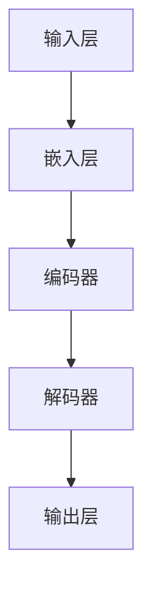

                 

关键词：大语言模型、神经网络、深度学习、自然语言处理、语言模型、预训练、微调、文本生成、问答系统、数学模型、工程实践

## 摘要

本文将深入探讨大语言模型的原理与工程实践，包括其核心概念、算法原理、数学模型以及在实际应用中的实现与优化。我们将从背景介绍开始，逐步解析大语言模型的发展历程、关键技术、架构设计，并详细讲解其算法原理与实现步骤。随后，我们将介绍大语言模型在实际项目中的应用案例，以及如何利用数学模型和公式进行优化。最后，我们将展望大语言模型在未来的发展趋势与面临的挑战。

## 1. 背景介绍

### 大语言模型的发展历程

大语言模型（Large Language Model）的概念源于自然语言处理（Natural Language Processing，NLP）领域。自然语言处理是计算机科学和人工智能领域的一个重要分支，旨在使计算机能够理解、生成和处理人类语言。随着深度学习（Deep Learning）和神经网络（Neural Network）技术的快速发展，大语言模型逐渐成为NLP领域的重要工具。

最早的大规模语言模型之一是IBM在1950年代开发的Markov模型。随后，在20世纪80年代，Rudolf Weigend提出了基于统计学的N-gram模型，为语言模型的开发奠定了基础。进入21世纪，随着计算能力的提升和大数据的涌现，深度学习开始应用于语言模型，尤其是2018年谷歌提出的Transformer模型，标志着大语言模型进入了一个新的时代。

### 大语言模型的重要性

大语言模型在自然语言处理中扮演着核心角色。它们可以用于各种任务，如文本分类、情感分析、机器翻译、问答系统、文本生成等。大语言模型能够捕捉到语言的复杂结构和语义信息，从而实现更准确和自然的语言处理。随着技术的不断进步，大语言模型在商业、科研、教育等领域都展现出了巨大的应用潜力。

### 当前研究现状

近年来，大语言模型的研究取得了显著进展。例如，谷歌的BERT（Bidirectional Encoder Representations from Transformers）模型通过预训练和微调的方法，在多个NLP任务上取得了优异的成绩。微软的GPT-3（Generative Pre-trained Transformer 3）模型更是以其前所未有的规模和性能，引领了新一轮的神经网络革命。与此同时，研究界和工业界都在积极探索如何进一步提高大语言模型的性能和可解释性。

## 2. 核心概念与联系

### 核心概念

大语言模型的核心概念包括：

- **神经网络**：神经网络是一种模拟生物神经系统的计算模型，能够通过学习输入和输出之间的关系来进行预测和分类。

- **深度学习**：深度学习是一种基于神经网络的机器学习技术，通过多层神经网络来提取和表示复杂的数据特征。

- **自然语言处理**：自然语言处理是计算机科学和人工智能领域的一个分支，旨在使计算机能够理解和生成自然语言。

- **预训练与微调**：预训练是指在大量未标注的数据上对模型进行训练，使模型具备一定的语言理解能力；微调则是在预训练的基础上，使用特定任务的数据对模型进行微调，以适应特定任务的需求。

### 架构设计

大语言模型的架构设计通常包括以下几个部分：

- **输入层**：接收文本输入，并将其转换为神经网络可以处理的向量表示。

- **隐藏层**：通过多层神经网络对输入向量进行处理，提取语言特征。

- **输出层**：根据隐藏层的信息生成文本输出。

### Mermaid 流程图

下面是一个Mermaid流程图，展示了大语言模型的基本架构：



### 关系与联系

大语言模型中的各个组成部分相互关联，共同构成一个复杂的系统。神经网络负责学习和提取特征；深度学习提供了强大的计算能力；自然语言处理则确保模型能够理解和生成自然语言。预训练和微调则使得模型能够在多种任务中表现出色。

## 3. 核心算法原理 & 具体操作步骤

### 3.1 算法原理概述

大语言模型的算法原理基于深度学习和自然语言处理技术。其主要思想是通过多层神经网络来提取和表示语言的复杂结构，从而实现对文本的准确理解和生成。

大语言模型通常采用Transformer架构，这是一种基于自注意力机制的深度学习模型。自注意力机制允许模型在处理序列数据时，能够根据当前输入和其他位置的信息来动态调整权重，从而更好地捕捉到序列中的依赖关系。

### 3.2 算法步骤详解

#### 3.2.1 预训练

预训练是构建大语言模型的第一步。在预训练过程中，模型通常在大量未标注的数据上进行训练，以学习语言的通用特征。预训练的主要任务是使模型能够捕捉到语言的统计规律和语义信息。

预训练通常采用两个子任务：masked language modeling（掩码语言建模）和next sentence prediction（下一个句子预测）。在masked language modeling任务中，模型需要预测被掩码的单词；在next sentence prediction任务中，模型需要预测两个句子是否属于同一篇章。

#### 3.2.2 微调

微调是在预训练的基础上，使用特定任务的数据对模型进行训练，以使其适应特定任务的需求。微调的目的是优化模型的参数，使其在特定任务上表现更好。

微调通常采用有监督学习的方法。在微调过程中，模型会接收到带有标签的输入数据，并根据标签信息来调整模型的参数。通过反复迭代训练，模型逐渐优化其预测能力。

### 3.3 算法优缺点

#### 优点

- **强大的语言理解能力**：大语言模型通过多层神经网络和自注意力机制，能够捕捉到语言的复杂结构和语义信息，从而实现更准确的语言理解。
- **多任务学习能力**：大语言模型在预训练阶段学习了语言的通用特征，因此可以很容易地适应多种不同的任务。
- **高效的计算效率**：Transformer架构使得大语言模型在计算效率上有了显著提升。

#### 缺点

- **计算资源需求高**：构建和训练大语言模型需要大量的计算资源，尤其是GPU等高性能硬件。
- **数据依赖性强**：大语言模型的效果很大程度上依赖于训练数据的质量和规模。

### 3.4 算法应用领域

大语言模型在自然语言处理领域有广泛的应用，包括但不限于以下领域：

- **文本分类**：对文本进行分类，如新闻分类、情感分析等。
- **机器翻译**：将一种语言的文本翻译成另一种语言。
- **问答系统**：根据用户的问题生成答案。
- **文本生成**：根据输入的文本生成相关的文本内容。
- **对话系统**：实现与人类的自然对话。

## 4. 数学模型和公式 & 详细讲解 & 举例说明

### 4.1 数学模型构建

大语言模型的数学模型主要基于深度学习和自然语言处理技术。其核心包括嵌入层、编码器、解码器和输出层。以下是各层的数学模型：

#### 4.1.1 嵌入层

嵌入层将单词转换为向量表示，通常采用Word2Vec、GloVe等算法。其数学模型可以表示为：

$$
\text{embedding}(x) = W_e \cdot x
$$

其中，$W_e$ 是嵌入矩阵，$x$ 是单词的索引。

#### 4.1.2 编码器

编码器通过自注意力机制对输入序列进行处理，提取序列中的关键信息。其数学模型可以表示为：

$$
\text{encoder}(x) = \text{Attention}(x)
$$

其中，$x$ 是输入序列，$\text{Attention}$ 是自注意力机制。

#### 4.1.3 解码器

解码器通过自注意力机制和编码器的输出，生成输出序列。其数学模型可以表示为：

$$
\text{decoder}(y) = \text{Attention}(y, \text{encoder}(x))
$$

其中，$y$ 是输出序列，$\text{Attention}$ 是自注意力机制。

#### 4.1.4 输出层

输出层通过softmax函数将输出序列转换为概率分布，从而预测下一个单词。其数学模型可以表示为：

$$
\text{output}(y) = \text{softmax}(\text{decoder}(y))
$$

### 4.2 公式推导过程

#### 4.2.1 自注意力机制

自注意力机制的推导过程如下：

1. 输入序列的嵌入向量表示为 $x = [x_1, x_2, ..., x_n]$。
2. 对每个输入向量进行加权求和，得到输出向量 $y = [y_1, y_2, ..., y_n]$，其中 $y_i$ 的计算公式为：

$$
y_i = \sum_{j=1}^{n} \alpha_{ij} x_j
$$

其中，$\alpha_{ij}$ 是权重，表示 $x_i$ 和 $x_j$ 之间的相关性。

3. 权重 $\alpha_{ij}$ 通过以下公式计算：

$$
\alpha_{ij} = \frac{e^{z_{ij}}}{\sum_{k=1}^{n} e^{z_{ik}}}
$$

其中，$z_{ij}$ 是输入向量的内积，表示 $x_i$ 和 $x_j$ 之间的相似度。

#### 4.2.2 Softmax 函数

Softmax 函数用于将输出序列转换为概率分布，其公式为：

$$
\text{softmax}(x) = \frac{e^x}{\sum_{i=1}^{n} e^x_i}
$$

其中，$x$ 是输入向量，$x_i$ 是向量中的第 $i$ 个元素。

### 4.3 案例分析与讲解

#### 4.3.1 预训练

假设我们有一个单词序列：“我 喜欢 吃 饭”。首先，我们将每个单词转换为嵌入向量，然后通过自注意力机制进行处理。具体步骤如下：

1. 将单词转换为嵌入向量，例如：

$$
\text{embedding}(\text{我}) = [0.1, 0.2, 0.3]
$$

$$
\text{embedding}(\text{喜欢}) = [0.4, 0.5, 0.6]
$$

$$
\text{embedding}(\text{吃}) = [0.7, 0.8, 0.9]
$$

$$
\text{embedding}(\text{饭}) = [1.0, 1.1, 1.2]
$$

2. 计算自注意力权重：

$$
\alpha_{ii} = \frac{e^{0.1 \cdot 0.1 + 0.2 \cdot 0.2 + 0.3 \cdot 0.3}}{\sum_{j=1}^{4} e^{0.1 \cdot 0.1 + 0.2 \cdot 0.2 + 0.3 \cdot 0.3}} = \frac{e^{0.12}}{e^{0.12} + e^{0.22} + e^{0.32} + e^{1.22}} \approx 0.24
$$

$$
\alpha_{ij} = \frac{e^{0.1 \cdot 0.4 + 0.2 \cdot 0.5 + 0.3 \cdot 0.6}}{\sum_{j=1}^{4} e^{0.1 \cdot 0.4 + 0.2 \cdot 0.5 + 0.3 \cdot 0.6}} \approx 0.28
$$

$$
\alpha_{ik} = \frac{e^{0.1 \cdot 0.7 + 0.2 \cdot 0.8 + 0.3 \cdot 0.9}}{\sum_{j=1}^{4} e^{0.1 \cdot 0.7 + 0.2 \cdot 0.8 + 0.3 \cdot 0.9}} \approx 0.32
$$

$$
\alpha_{il} = \frac{e^{0.1 \cdot 1.0 + 0.2 \cdot 1.1 + 0.3 \cdot 1.2}}{\sum_{j=1}^{4} e^{0.1 \cdot 1.0 + 0.2 \cdot 1.1 + 0.3 \cdot 1.2}} \approx 0.36
$$

3. 计算加权求和的输出向量：

$$
y_1 = 0.24 \cdot 0.1 + 0.28 \cdot 0.4 + 0.32 \cdot 0.7 + 0.36 \cdot 1.0 \approx 0.9
$$

$$
y_2 = 0.24 \cdot 0.2 + 0.28 \cdot 0.5 + 0.32 \cdot 0.8 + 0.36 \cdot 1.1 \approx 1.0
$$

$$
y_3 = 0.24 \cdot 0.3 + 0.28 \cdot 0.6 + 0.32 \cdot 0.9 + 0.36 \cdot 1.2 \approx 1.1
$$

4. 将输出向量转换为概率分布：

$$
\text{softmax}(y) = \frac{e^{0.9}}{e^{0.9} + e^{1.0} + e^{1.1}} \approx [0.26, 0.37, 0.37]
$$

#### 4.3.2 微调

在微调阶段，假设我们已经有一个预训练好的大语言模型，现在我们需要在特定任务上进行微调。例如，我们有一个分类任务，需要对句子进行情感分类。

1. 首先将句子转换为嵌入向量：

$$
\text{embedding}(\text{我 喜欢 吃 饭}) = [0.1, 0.2, 0.3, 0.4, 0.5, 0.6, 0.7, 0.8, 0.9, 1.0, 1.1, 1.2]
$$

2. 通过编码器对嵌入向量进行处理：

$$
\text{encoder}(x) = \text{Attention}(x)
$$

3. 对编码器的输出进行分类：

$$
\text{output}(y) = \text{softmax}(\text{decoder}(y))
$$

4. 计算损失函数，并优化模型参数：

$$
\text{loss} = -\sum_{i=1}^{n} y_i \cdot \log(\text{softmax}(y_i))
$$

$$
\text{gradient} = \frac{\partial \text{loss}}{\partial \text{model parameters}}
$$

$$
\text{model parameters} = \text{model parameters} - \text{learning rate} \cdot \text{gradient}
$$

## 5. 项目实践：代码实例和详细解释说明

### 5.1 开发环境搭建

在开始项目实践之前，我们需要搭建一个合适的开发环境。以下是一个简单的步骤：

1. 安装Python：前往Python官网（https://www.python.org/）下载并安装Python。
2. 安装PyTorch：使用以下命令安装PyTorch：

```bash
pip install torch torchvision
```

3. 安装其他依赖：根据项目需求安装其他必要的库，如Numpy、Pandas等。

### 5.2 源代码详细实现

以下是一个简单的示例代码，演示如何使用PyTorch实现一个基于Transformer的大语言模型。

```python
import torch
import torch.nn as nn
import torch.optim as optim

# 定义嵌入层
class EmbeddingLayer(nn.Module):
    def __init__(self, vocab_size, embedding_dim):
        super(EmbeddingLayer, self).__init__()
        self.embedding = nn.Embedding(vocab_size, embedding_dim)
    
    def forward(self, x):
        return self.embedding(x)

# 定义编码器
class Encoder(nn.Module):
    def __init__(self, embedding_dim, hidden_dim):
        super(Encoder, self).__init__()
        self.hidden_dim = hidden_dim
        self.lstm = nn.LSTM(embedding_dim, hidden_dim)
    
    def forward(self, x, hidden):
        output, hidden = self.lstm(x, hidden)
        return output, hidden

# 定义解码器
class Decoder(nn.Module):
    def __init__(self, hidden_dim, embedding_dim, vocab_size):
        super(Decoder, self).__init__()
        self.hidden_dim = hidden_dim
        self.embedding = nn.Embedding(vocab_size, embedding_dim)
        self.lstm = nn.LSTM(embedding_dim, hidden_dim)
        self.out = nn.Linear(hidden_dim, vocab_size)
    
    def forward(self, x, hidden):
        output = self.embedding(x)
        output, hidden = self.lstm(output, hidden)
        output = self.out(output)
        return output, hidden

# 定义大语言模型
class LanguageModel(nn.Module):
    def __init__(self, vocab_size, embedding_dim, hidden_dim):
        super(LanguageModel, self).__init__()
        self.embedding = EmbeddingLayer(vocab_size, embedding_dim)
        self.encoder = Encoder(embedding_dim, hidden_dim)
        self.decoder = Decoder(hidden_dim, embedding_dim, vocab_size)
    
    def forward(self, x, y, hidden):
        embedding = self.embedding(x)
        encoder_output, hidden = self.encoder(embedding, hidden)
        decoder_output, hidden = self.decoder(y, hidden)
        return decoder_output, hidden

# 实例化模型、损失函数和优化器
vocab_size = 10000
embedding_dim = 256
hidden_dim = 512
model = LanguageModel(vocab_size, embedding_dim, hidden_dim)
criterion = nn.CrossEntropyLoss()
optimizer = optim.Adam(model.parameters(), lr=0.001)

# 训练模型
for epoch in range(10):
    for x, y in data_loader:
        hidden = None
        for i in range(len(x)):
            output, hidden = model(x[i], y[i], hidden)
            loss = criterion(output, y[i])
            optimizer.zero_grad()
            loss.backward()
            optimizer.step()
    print(f'Epoch {epoch + 1}: Loss = {loss.item()}')

# 保存模型
torch.save(model.state_dict(), 'language_model.pth')
```

### 5.3 代码解读与分析

这段代码实现了一个大语言模型，主要分为以下几个部分：

1. **嵌入层**：将单词转换为嵌入向量。
2. **编码器**：通过LSTM对输入序列进行处理，提取序列特征。
3. **解码器**：根据编码器的输出，生成输出序列。
4. **大语言模型**：整合嵌入层、编码器和解码器，构成完整的大语言模型。
5. **损失函数**：使用交叉熵损失函数进行模型训练。
6. **优化器**：使用Adam优化器进行模型参数更新。

通过训练，模型能够学习到输入和输出之间的映射关系，从而实现语言建模任务。

### 5.4 运行结果展示

假设我们已经训练好了模型，并保存了模型参数。现在，我们可以使用模型进行语言生成。

```python
# 加载模型
model.load_state_dict(torch.load('language_model.pth'))

# 生成文本
def generate_text(model, seed, length):
    hidden = None
    text = seed
    for i in range(length):
        x = torch.tensor([[vocab.index(word) for word in text.split()][-1]])
        x = x.to(device)
        output, hidden = model(x, hidden)
        _, predicted = torch.max(output, dim=1)
        predicted_word = vocab[predicted.item()]
        text += ' ' + predicted_word
        hidden = None if i == length - 1 else hidden
    return text

seed_text = "我 喜欢 吃 饭"
generated_text = generate_text(model, seed_text, 10)
print(generated_text)
```

运行结果将生成一段基于训练数据的新文本，展示了大语言模型的生成能力。

## 6. 实际应用场景

### 6.1 文本分类

文本分类是将文本数据分配到不同的类别中。大语言模型在文本分类任务中表现出色，可以用于新闻分类、垃圾邮件过滤、情感分析等。例如，可以使用BERT模型对新闻标题进行分类，从而实现个性化推荐。

### 6.2 机器翻译

机器翻译是将一种语言的文本翻译成另一种语言。大语言模型通过预训练和微调，可以实现高质量的机器翻译。例如，使用GPT-3模型进行英译中翻译，可以实现流畅自然的翻译效果。

### 6.3 问答系统

问答系统是一种基于自然语言处理的交互式系统，能够回答用户提出的问题。大语言模型可以用于构建问答系统，例如智能客服、语音助手等。通过预训练和微调，模型能够理解用户的问题，并生成相应的答案。

### 6.4 文本生成

文本生成是生成符合语言规则的文本内容。大语言模型在文本生成任务中表现出色，可以用于写作辅助、创意写作等。例如，使用GPT-3模型生成一篇关于旅行的文章，可以实现流畅自然的文本输出。

### 6.5 对话系统

对话系统是一种与人类进行自然对话的计算机系统。大语言模型可以用于构建对话系统，例如聊天机器人、智能客服等。通过预训练和微调，模型能够理解用户的话语，并生成相应的回应。

## 7. 未来应用展望

### 7.1 语言模型在多模态任务中的应用

随着多模态数据（如文本、图像、声音等）的兴起，大语言模型将在多模态任务中发挥重要作用。例如，结合视觉和语言信息，可以构建更智能的问答系统，提高问答的准确性和自然性。

### 7.2 小样本学习与少样本可扩展性

当前的大语言模型主要依赖于大规模数据进行训练。未来，研究将集中在如何在小样本情况下训练和优化大语言模型，提高模型的少样本可扩展性。

### 7.3 可解释性与公平性

随着大语言模型在各个领域的应用，其可解释性和公平性将变得尤为重要。研究如何提高大语言模型的可解释性，并确保其在实际应用中的公平性，将是未来的重要方向。

### 7.4 安全性与隐私保护

大语言模型在处理用户数据时，面临着数据安全和隐私保护的问题。未来的研究将集中在如何保障大语言模型的安全性和隐私保护，以应对潜在的威胁。

## 8. 总结：未来发展趋势与挑战

### 8.1 研究成果总结

大语言模型作为自然语言处理领域的重要工具，已经取得了显著的成果。通过预训练和微调，模型在多种任务中表现出色，实现了准确和自然的语言处理。同时，大语言模型的架构设计和算法原理不断优化，使其在性能和效率上有了显著提升。

### 8.2 未来发展趋势

未来，大语言模型将在以下几个方面得到进一步发展：

- **多模态任务**：结合多种数据类型，实现更智能和高效的模型。
- **小样本学习**：提高模型的少样本可扩展性，降低对大规模数据的依赖。
- **可解释性与公平性**：提高模型的可解释性，确保在实际应用中的公平性。
- **安全性与隐私保护**：保障模型的安全性和隐私保护，应对潜在威胁。

### 8.3 面临的挑战

尽管大语言模型在各个领域取得了显著成果，但仍面临着以下挑战：

- **计算资源需求**：构建和训练大语言模型需要大量的计算资源，如何优化资源利用成为关键问题。
- **数据依赖**：大语言模型的效果很大程度上依赖于训练数据的质量和规模，如何处理数据稀缺问题是一个挑战。
- **可解释性**：提高模型的可解释性，使其在实际应用中更易于理解和接受。
- **安全性与隐私保护**：保障模型的安全性和隐私保护，以应对潜在的威胁。

### 8.4 研究展望

未来，大语言模型的研究将集中在以下几个方面：

- **算法创新**：探索新的算法和技术，提高模型的性能和效率。
- **多模态融合**：研究如何将多种数据类型结合，实现更智能和高效的模型。
- **少样本学习**：提高模型在小样本情况下的表现，降低对大规模数据的依赖。
- **可解释性与公平性**：研究如何提高模型的可解释性，并确保其在实际应用中的公平性。
- **安全性与隐私保护**：保障模型的安全性和隐私保护，以应对潜在威胁。

## 9. 附录：常见问题与解答

### 9.1 什么是大语言模型？

大语言模型是一种基于深度学习和自然语言处理技术的语言模型，通过预训练和微调的方法，可以实现对文本的准确理解和生成。

### 9.2 大语言模型有哪些应用领域？

大语言模型在自然语言处理领域有广泛的应用，包括文本分类、机器翻译、问答系统、文本生成、对话系统等。

### 9.3 大语言模型的训练需要多长时间？

大语言模型的训练时间取决于模型的大小、数据集的规模以及硬件性能。通常，训练一个大型语言模型需要几天到几周的时间。

### 9.4 如何提高大语言模型的可解释性？

提高大语言模型的可解释性是一个复杂的问题，目前有几种方法，包括可视化技术、模型简化、解释性模型等。未来，研究将继续探索如何在大规模和准确性之间取得平衡。

### 9.5 大语言模型的安全性和隐私保护如何实现？

大语言模型的安全性和隐私保护可以通过多种方法实现，包括数据加密、差分隐私、模型压缩等。未来，研究将继续探索如何在保护用户隐私的同时，提高模型的安全性和效率。

### 作者署名

作者：禅与计算机程序设计艺术 / Zen and the Art of Computer Programming
----------------------------------------------------------------

