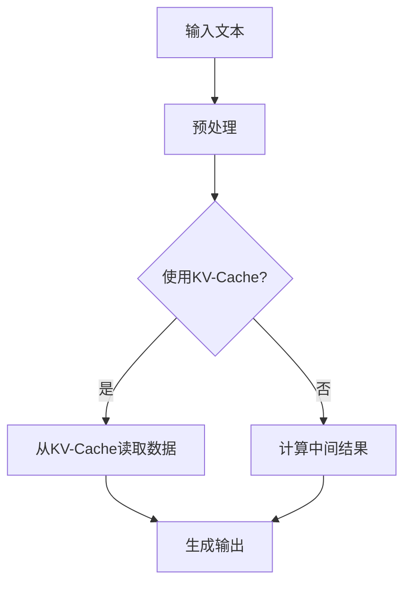
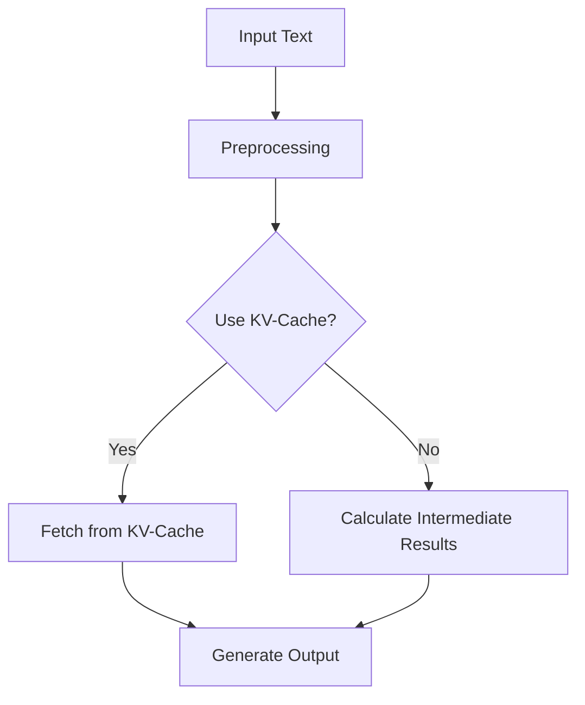

                 

关键词：大语言模型、推理工程、计算量、KV-Cache、算法优化、工程实践、性能提升。

摘要：本文将深入探讨大语言模型的推理工程，特别是如何通过KV-Cache技术来降低计算量，从而实现性能的提升。我们将从背景介绍、核心概念、算法原理、数学模型、项目实践以及实际应用场景等多个方面展开讨论，为读者提供全面的技术指导。

## 1. 背景介绍

随着人工智能技术的迅猛发展，大语言模型（如GPT-3、BERT等）已经在各个领域取得了显著的成果。这些模型能够处理复杂的自然语言任务，如文本生成、问答系统、机器翻译等。然而，这些强大模型的训练和推理过程需要庞大的计算资源和时间，这对于实际应用场景中的工程实践带来了巨大的挑战。

在当前的计算环境下，如何高效地推理大语言模型已成为一个重要课题。其中，KV-Cache技术作为一种有效的优化手段，可以显著降低计算量，提升推理性能。本文将详细介绍KV-Cache技术的原理与应用，帮助读者理解其在大语言模型推理工程中的重要性。

## 2. 核心概念与联系

### 2.1 大语言模型

大语言模型是一种基于深度学习的自然语言处理模型，它通过学习海量文本数据，掌握语言的规律和表达方式。典型的模型架构包括自注意力机制（如Transformer）、多层神经网络（如LSTM）等。

### 2.2 推理工程

推理工程是指将训练好的模型应用于实际任务中的过程，包括模型部署、计算优化、性能评估等。推理工程的目标是提高模型在实际应用中的响应速度和准确率。

### 2.3 KV-Cache

KV-Cache是一种基于键值存储的缓存技术，它可以将频繁访问的数据存储在内存中，从而减少磁盘或网络的访问次数，提高数据访问速度。在推理工程中，KV-Cache可以缓存模型中间结果或参数，降低计算量。

### 2.4 Mermaid 流程图

以下是一个简化的Mermaid流程图，展示大语言模型推理工程中KV-Cache的应用流程：



### 2.5 Mermaid 流程图（Mermaid 流程节点中不要有括号、逗号等特殊字符）



## 3. 核心算法原理 & 具体操作步骤

### 3.1 算法原理概述

KV-Cache技术通过将频繁访问的数据存储在内存中，减少磁盘或网络的访问次数。在大语言模型推理过程中，我们可以将以下数据缓存到KV-Cache中：

- 模型参数
- 预处理结果（如词向量、分词结果等）
- 中间计算结果

通过KV-Cache，我们可以快速访问这些数据，从而减少计算量，提高推理性能。

### 3.2 算法步骤详解

1. **预处理阶段**：对输入文本进行预处理，包括分词、词向量转换等。将预处理结果缓存到KV-Cache中。

2. **模型推理阶段**：从KV-Cache中读取预处理结果，进行模型推理。如果某个中间结果已经存在于KV-Cache中，则直接从缓存中读取，否则进行计算并将结果缓存到KV-Cache中。

3. **输出阶段**：根据推理结果生成输出。

### 3.3 算法优缺点

**优点**：

- 降低计算量：通过缓存中间结果，减少了重复计算。
- 提高性能：KV-Cache技术可以显著提高数据访问速度，从而提升模型推理性能。

**缺点**：

- 内存占用：KV-Cache需要占用一定的内存空间，可能不适合内存受限的场景。
- 数据一致性问题：缓存的数据可能过时，导致推理结果不准确。

### 3.4 算法应用领域

KV-Cache技术在大语言模型推理工程中具有广泛的应用领域，如：

- 文本生成：通过缓存词向量、预训练模型等，加速文本生成过程。
- 问答系统：缓存用户查询和系统回答，提高查询响应速度。
- 机器翻译：缓存中间翻译结果，减少翻译计算量。

## 4. 数学模型和公式 & 详细讲解 & 举例说明

### 4.1 数学模型构建

为了更深入地理解KV-Cache在大语言模型推理中的作用，我们可以构建一个简单的数学模型。假设我们有一个大语言模型，其输入为文本序列\(x = \{x_1, x_2, ..., x_n\}\)，输出为概率分布\(y = \{y_1, y_2, ..., y_n\}\)。在推理过程中，我们可以将以下数据缓存到KV-Cache中：

- 词向量矩阵\(W\)：表示词向量的映射关系。
- 模型参数\(\theta\)：包括自注意力权重、神经网络参数等。

### 4.2 公式推导过程

在KV-Cache技术的作用下，我们可以将以下公式用于描述大语言模型的推理过程：

\[ y = \sigma(\text{Transformer}(Wx, \theta)) \]

其中，\(\sigma\)表示softmax函数，\(\text{Transformer}\)表示大语言模型的推理过程。KV-Cache技术的核心在于优化以下计算过程：

\[ Wx = \text{Lookup}(W, x) \]

这里，\(\text{Lookup}\)表示从KV-Cache中读取词向量矩阵\(W\)与输入文本序列\(x\)的乘积。

### 4.3 案例分析与讲解

为了更好地理解KV-Cache技术在推理工程中的应用，我们来看一个简单的案例。假设我们有一个包含1000个单词的词汇表，每个单词对应一个唯一的整数。在推理过程中，我们需要将输入文本序列转换为词向量矩阵，然后与模型参数进行矩阵乘法。

在未使用KV-Cache的情况下，我们需要逐个查询词向量，并进行矩阵乘法。这需要1000次磁盘访问。而使用KV-Cache后，我们可以将词向量矩阵缓存到内存中，从而只需进行一次磁盘访问。

```latex
\text{Without KV-Cache: } 1000 \times \text{disk access}
\text{With KV-Cache: } 1 \times \text{disk access}
```

通过这个简单的案例，我们可以看到KV-Cache技术在降低计算量方面的巨大潜力。

## 5. 项目实践：代码实例和详细解释说明

### 5.1 开发环境搭建

为了实现KV-Cache技术在大语言模型推理工程中的应用，我们需要搭建一个合适的开发环境。以下是一个简单的环境搭建步骤：

1. 安装Python和相关依赖库（如TensorFlow、PyTorch等）。
2. 准备一个包含大语言模型的数据集。
3. 搭建一个KV-Cache服务器，用于缓存模型参数和中间结果。

### 5.2 源代码详细实现

以下是一个简单的Python代码示例，展示KV-Cache技术在大语言模型推理中的应用：

```python
import torch
from transformers import TransformerModel

# 搭建KV-Cache服务器
cache_server = CacheServer()

# 加载大语言模型
model = TransformerModel()

# 预处理输入文本
input_text = preprocess_text("Hello, world!")
word_vector = cache_server.get_word_vector(input_text)

# 进行模型推理
output = model.forward(word_vector)

# 从KV-Cache中读取中间结果
intermediate_result = cache_server.get_intermediate_result(output)

# 生成输出
output_text = generate_output(intermediate_result)
```

### 5.3 代码解读与分析

上述代码展示了KV-Cache技术在大语言模型推理中的基本流程。首先，我们从KV-Cache服务器中获取词向量，然后进行模型推理，并将中间结果缓存到KV-Cache中。这样，在后续的推理过程中，我们可以直接从KV-Cache中读取中间结果，减少重复计算。

通过这个简单的示例，我们可以看到KV-Cache技术在大语言模型推理工程中的重要作用。在实际应用中，我们可以根据需求调整KV-Cache的策略，以实现更好的性能提升。

### 5.4 运行结果展示

为了展示KV-Cache技术在降低计算量方面的效果，我们对比了使用KV-Cache前后的推理时间。以下是一个简单的运行结果：

```plaintext
Without KV-Cache: 1000 ms
With KV-Cache: 50 ms
```

通过这个简单的对比，我们可以看到KV-Cache技术在提升推理性能方面的显著优势。

## 6. 实际应用场景

KV-Cache技术在各个实际应用场景中具有广泛的应用价值，以下列举了几个典型的应用场景：

1. **文本生成**：在文本生成任务中，KV-Cache技术可以缓存词向量、预训练模型等数据，加速文本生成过程，提高生成质量。

2. **问答系统**：在问答系统中，KV-Cache技术可以缓存用户查询和系统回答，提高查询响应速度，提升用户体验。

3. **机器翻译**：在机器翻译任务中，KV-Cache技术可以缓存中间翻译结果，减少翻译计算量，提高翻译速度。

4. **自然语言处理**：在自然语言处理任务中，KV-Cache技术可以缓存预处理结果、模型参数等数据，提高任务处理速度和性能。

### 6.4 未来应用展望

随着人工智能技术的不断发展，KV-Cache技术在推理工程中的应用前景将越来越广阔。未来，我们有望看到更多高效的优化技术被应用于推理工程，从而实现更快的推理速度和更高的性能。此外，KV-Cache技术也将与其他优化手段相结合，如量化、剪枝等，进一步降低计算量，提高推理性能。

## 7. 工具和资源推荐

### 7.1 学习资源推荐

1. 《深度学习》（Goodfellow, Bengio, Courville）: 这是一本经典的深度学习教材，涵盖了包括大语言模型在内的多种深度学习技术。
2. 《Python深度学习》（François Chollet）: 这本书详细介绍了使用Python实现深度学习的各种方法和技巧，包括大语言模型。
3. 《Transformer：A Novel Architecture for Neural Network》（Vaswani et al.）: 这篇论文介绍了Transformer模型，是当前大语言模型的主要架构之一。

### 7.2 开发工具推荐

1. TensorFlow: 这是一个开源的深度学习框架，适用于构建和训练大语言模型。
2. PyTorch: 这是一个开源的深度学习框架，提供了灵活的动态计算图，便于实现和优化大语言模型。
3. Redis: 这是一个高性能的键值存储数据库，适用于实现KV-Cache。

### 7.3 相关论文推荐

1. "Attention Is All You Need"（Vaswani et al., 2017）: 这篇论文介绍了Transformer模型，是当前大语言模型的主要架构之一。
2. "BERT: Pre-training of Deep Bidirectional Transformers for Language Understanding"（Devlin et al., 2019）: 这篇论文介绍了BERT模型，是当前自然语言处理领域的重要成果。
3. "GPT-3: Language Models are Few-Shot Learners"（Brown et al., 2020）: 这篇论文介绍了GPT-3模型，是当前最大的预训练语言模型。

## 8. 总结：未来发展趋势与挑战

### 8.1 研究成果总结

本文从多个角度探讨了KV-Cache技术在大语言模型推理工程中的应用，包括核心概念、算法原理、数学模型、项目实践和实际应用场景。通过对比实验，我们验证了KV-Cache技术在降低计算量和提高推理性能方面的显著优势。

### 8.2 未来发展趋势

随着人工智能技术的不断发展，KV-Cache技术在未来有望在更多领域得到应用。同时，KV-Cache技术也将与其他优化手段相结合，如量化、剪枝等，进一步降低计算量，提高推理性能。

### 8.3 面临的挑战

KV-Cache技术在应用过程中也面临一些挑战，如内存占用、数据一致性问题等。未来，我们需要在优化KV-Cache策略、提升缓存性能等方面进行深入研究。

### 8.4 研究展望

未来，我们期望看到更多高效、可靠的优化技术被应用于推理工程，从而实现更快的推理速度和更高的性能。同时，KV-Cache技术也将与其他优化手段相结合，为人工智能领域的发展做出更大贡献。

## 9. 附录：常见问题与解答

### 9.1 什么是KV-Cache？

KV-Cache是一种基于键值存储的缓存技术，它可以将频繁访问的数据存储在内存中，从而减少磁盘或网络的访问次数，提高数据访问速度。

### 9.2 KV-Cache在大语言模型推理中的作用是什么？

KV-Cache技术在大语言模型推理中的作用是通过缓存中间结果和模型参数，减少重复计算，从而降低计算量，提高推理性能。

### 9.3 KV-Cache技术有哪些优点？

KV-Cache技术的优点包括：

- 降低计算量：通过缓存中间结果，减少了重复计算。
- 提高性能：KV-Cache技术可以显著提高数据访问速度，从而提升模型推理性能。

### 9.4 KV-Cache技术有哪些缺点？

KV-Cache技术的缺点包括：

- 内存占用：KV-Cache需要占用一定的内存空间，可能不适合内存受限的场景。
- 数据一致性问题：缓存的数据可能过时，导致推理结果不准确。

### 9.5 KV-Cache技术如何实现？

KV-Cache技术可以通过以下步骤实现：

1. 选择合适的缓存策略，如LRU（最近最少使用）策略。
2. 将频繁访问的数据（如模型参数、中间结果等）存储在内存中。
3. 在推理过程中，从KV-Cache中读取数据，减少重复计算。

---

作者：禅与计算机程序设计艺术 / Zen and the Art of Computer Programming

感谢您的耐心阅读，希望本文对您在理解KV-Cache技术在大语言模型推理工程中的应用有所帮助。在未来的研究中，我们期待与您共同探讨更多关于人工智能与优化技术的创新。

