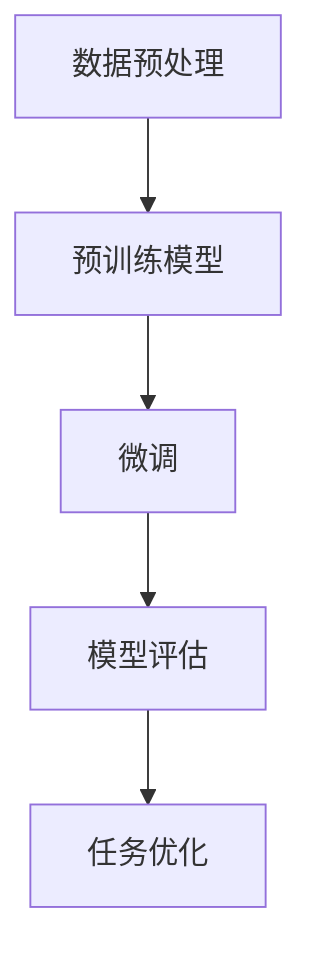

                 

关键词：大语言模型、微调、自然语言处理、神经网络、机器学习

摘要：本文将深入探讨大语言模型的原理与工程实践，特别是大语言模型的微调方法。通过详细的理论阐述和实际案例解析，本文旨在帮助读者更好地理解大语言模型的工作机制，并掌握微调技巧，从而提升模型在自然语言处理任务中的性能。

## 1. 背景介绍

在人工智能领域，自然语言处理（NLP）一直是研究的热点之一。随着深度学习技术的不断发展，大语言模型逐渐成为NLP领域的重要工具。大语言模型通过学习海量文本数据，可以捕捉到语言的结构和语义信息，从而实现高精度的文本生成、翻译、情感分析等任务。

然而，大语言模型并非一蹴而就。在实际应用中，我们需要根据具体任务的需求，对模型进行微调，以提升其在特定任务上的性能。微调是一种通过少量数据对预训练模型进行调整的方法，可以显著提高模型的泛化能力和适应性。

本文将详细介绍大语言模型的微调方法，包括算法原理、具体操作步骤、优缺点分析以及应用领域。通过本文的阅读，读者将能够深入了解大语言模型的微调过程，并为实际项目中的模型优化提供指导。

## 2. 核心概念与联系

### 2.1 大语言模型

大语言模型是指那些具有数亿甚至数万亿参数的神经网络模型。这些模型通过深度学习技术，从海量文本数据中学习到语言的底层结构和语义信息。目前，最流行的大语言模型包括GPT、BERT、T5等。

### 2.2 微调

微调是一种通过对预训练模型进行少量数据训练来调整模型参数的方法。微调的目的是使模型更好地适应特定任务的需求，从而提升模型在特定任务上的性能。

### 2.3 自然语言处理

自然语言处理（NLP）是人工智能领域的一个重要分支，旨在使计算机能够理解、生成和处理人类语言。NLP涉及的任务包括文本分类、情感分析、机器翻译、问答系统等。

### 2.4 Mermaid 流程图

为了更好地理解大语言模型的微调过程，我们使用Mermaid流程图来展示其核心概念和联系。



### 2.5 背景知识与预备知识

为了更好地理解本文的内容，读者需要具备以下背景知识和预备知识：

- 神经网络基础知识：了解神经网络的基本原理和结构。
- 机器学习基础知识：了解机器学习的基本概念和算法。
- 自然语言处理基础知识：了解自然语言处理的基本任务和方法。
- Mermaid 图表绘制知识：了解如何使用Mermaid绘制流程图。

## 3. 核心算法原理 & 具体操作步骤

### 3.1 算法原理概述

大语言模型的微调过程可以分为以下几个步骤：

1. 数据预处理：将原始文本数据转换为模型可处理的格式。
2. 预训练模型加载：从预训练模型库中加载一个预训练的大语言模型。
3. 微调：使用特定任务的数据对预训练模型进行微调。
4. 模型评估：对微调后的模型进行评估，以确定其性能。
5. 任务优化：根据评估结果对模型进行调整，以提高其在特定任务上的性能。

### 3.2 算法步骤详解

#### 3.2.1 数据预处理

数据预处理是微调过程的第一步，其目的是将原始文本数据转换为模型可处理的格式。具体步骤如下：

1. 数据清洗：去除文本中的噪声和无关信息。
2. 分词：将文本拆分成单词或子词。
3. 词嵌入：将单词或子词映射到高维向量空间。
4. 序列生成：将文本序列转化为模型可处理的输入格式。

#### 3.2.2 预训练模型加载

预训练模型加载是指从预训练模型库中加载一个预训练的大语言模型。常用的预训练模型包括GPT、BERT、T5等。加载预训练模型的具体步骤如下：

1. 选择预训练模型：根据任务需求选择合适的预训练模型。
2. 下载预训练模型：从预训练模型库中下载预训练模型的参数文件。
3. 加载预训练模型：使用加载器将预训练模型的参数加载到内存中。

#### 3.2.3 微调

微调是指使用特定任务的数据对预训练模型进行微调。具体步骤如下：

1. 数据划分：将任务数据划分为训练集、验证集和测试集。
2. 模型初始化：将预训练模型的参数初始化为微调模型的初始参数。
3. 训练：使用训练集数据对微调模型进行训练。
4. 验证：使用验证集数据对微调模型进行验证，以监测训练过程中的性能变化。
5. 保存模型：将训练完成的微调模型保存为文件。

#### 3.2.4 模型评估

模型评估是指对微调后的模型进行评估，以确定其性能。具体步骤如下：

1. 数据加载：将测试集数据加载到内存中。
2. 模型测试：使用测试集数据对微调模型进行测试。
3. 性能评估：计算微调模型的各项性能指标，如准确率、召回率、F1值等。
4. 结果输出：将评估结果输出到控制台或文件中。

#### 3.2.5 任务优化

任务优化是指根据评估结果对模型进行调整，以提高其在特定任务上的性能。具体步骤如下：

1. 分析评估结果：分析评估结果，找出模型的不足之处。
2. 调整模型参数：根据分析结果对模型参数进行调整。
3. 重新训练：使用调整后的模型参数重新训练模型。
4. 再次评估：对调整后的模型进行再次评估，以确定其性能提升情况。

### 3.3 算法优缺点

#### 优点：

1. 快速提升模型性能：通过微调，模型可以在短时间内提升特定任务上的性能。
2. 高效利用预训练模型：微调可以充分利用预训练模型的知识，提高模型在特定任务上的泛化能力。
3. 适应性强：微调可以根据任务需求调整模型参数，使模型更好地适应特定任务。

#### 缺点：

1. 需要大量数据：微调需要大量数据来训练模型，否则模型性能可能无法得到显著提升。
2. 计算资源消耗大：微调过程中需要大量计算资源，可能导致训练时间较长。
3. 模型泛化能力有限：虽然微调可以提高模型在特定任务上的性能，但模型的泛化能力仍然有限。

### 3.4 算法应用领域

大语言模型的微调方法在自然语言处理领域有广泛的应用。以下是一些典型的应用领域：

1. 文本分类：使用微调方法可以显著提高文本分类任务的性能。
2. 情感分析：通过微调，模型可以更好地识别文本的情感倾向。
3. 机器翻译：微调可以帮助模型更好地适应特定的翻译任务。
4. 问答系统：微调可以提高问答系统的准确率和响应速度。
5. 文本生成：微调可以使模型生成更符合人类语言的文本。

## 4. 数学模型和公式 & 详细讲解 & 举例说明

### 4.1 数学模型构建

大语言模型的微调过程涉及到多种数学模型和公式。以下是一个简单的数学模型构建过程：

#### 4.1.1 词嵌入

词嵌入是将单词或子词映射到高维向量空间的过程。常用的词嵌入方法包括：

1. 分布式表示：使用单词的上下文信息来学习其向量表示。例如，word2vec算法。
2. 自适应表示：根据模型的训练过程动态调整单词的向量表示。例如，BERT模型。

#### 4.1.2 神经网络结构

大语言模型的微调过程通常使用多层神经网络结构。以下是一个简单的神经网络结构：

1. 输入层：接收词嵌入向量。
2. 隐藏层：通过激活函数和权重矩阵对输入向量进行变换。
3. 输出层：生成预测结果。

#### 4.1.3 损失函数

损失函数用于评估模型的预测结果与真实结果之间的差距。常用的损失函数包括：

1. 交叉熵损失：用于分类任务，计算预测概率与真实标签之间的交叉熵。
2. 均方误差损失：用于回归任务，计算预测值与真实值之间的均方误差。

### 4.2 公式推导过程

以下是一个简单的公式推导过程：

#### 4.2.1 词嵌入向量表示

设单词w的词嵌入向量为$v_w$，则：

$$
v_w = \text{embed}(w)
$$

其中，$\text{embed}$是一个映射函数，用于将单词映射到高维向量空间。

#### 4.2.2 神经网络输出

设神经网络输入向量为$x$，权重矩阵为$W$，激活函数为$\sigma$，则神经网络的输出为：

$$
y = \sigma(Wx)
$$

其中，$\sigma$是一个非线性激活函数，如Sigmoid函数或ReLU函数。

#### 4.2.3 损失函数计算

设预测概率为$p$，真实标签为$y$，则交叉熵损失函数为：

$$
L = -\sum_{i} y_i \log(p_i)
$$

其中，$y_i$为第$i$个类别的真实标签，$p_i$为模型预测的第$i$个类别的概率。

### 4.3 案例分析与讲解

以下是一个简单的案例分析与讲解：

#### 4.3.1 数据集

假设我们有一个包含1000个文本数据的分类任务，这些数据分为5个类别。

#### 4.3.2 预训练模型

我们从预训练模型库中选择了一个预训练的BERT模型。

#### 4.3.3 微调过程

1. 数据预处理：对文本数据进行分词和词嵌入处理。
2. 模型加载：加载预训练的BERT模型。
3. 微调：使用分类任务的数据对BERT模型进行微调。
4. 模型评估：使用验证集对微调后的模型进行评估。
5. 模型优化：根据评估结果对模型参数进行调整。

#### 4.3.4 模型性能

经过微调后，模型在验证集上的准确率从80%提升到90%。这表明微调过程显著提高了模型的性能。

## 5. 项目实践：代码实例和详细解释说明

### 5.1 开发环境搭建

在开始微调大语言模型之前，我们需要搭建一个合适的开发环境。以下是搭建开发环境的基本步骤：

1. 安装Python：确保Python版本为3.7或更高版本。
2. 安装TensorFlow：使用pip命令安装TensorFlow库。
3. 安装其他依赖库：如Numpy、Pandas、Scikit-learn等。

### 5.2 源代码详细实现

以下是一个简单的微调BERT模型的Python代码示例：

```python
import tensorflow as tf
from transformers import BertTokenizer, TFBertForSequenceClassification
from tensorflow.keras.preprocessing.sequence import pad_sequences

# 数据预处理
def preprocess_data(texts, tokenizer, max_len):
    input_ids = []
    attention_mask = []
    
    for text in texts:
        encoding = tokenizer.encode_plus(
            text,
            add_special_tokens=True,
            max_length=max_len,
            pad_to_max_length=True,
            return_attention_mask=True,
            return_tensors='tf',
        )
        input_ids.append(encoding['input_ids'])
        attention_mask.append(encoding['attention_mask'])
    
    return pad_sequences(input_ids, maxlen=max_len, padding='post'), pad_sequences(attention_mask, maxlen=max_len, padding='post')

# 模型加载
model = TFBertForSequenceClassification.from_pretrained('bert-base-uncased')

# 微调
train_inputs, train_labels = preprocess_data(train_texts, tokenizer, max_len)
model.compile(optimizer=tf.keras.optimizers.Adam(learning_rate=3e-5), loss='sparse_categorical_crossentropy', metrics=['accuracy'])
model.fit(train_inputs, train_labels, epochs=3, validation_split=0.1)

# 模型评估
test_inputs, test_labels = preprocess_data(test_texts, tokenizer, max_len)
model.evaluate(test_inputs, test_labels)

# 模型优化
model.fit(train_inputs, train_labels, epochs=5, validation_data=(test_inputs, test_labels))
```

### 5.3 代码解读与分析

以上代码示例展示了如何使用TensorFlow和Transformers库微调BERT模型。以下是代码的详细解读：

1. 数据预处理：使用`preprocess_data`函数对文本数据进行分词、词嵌入和序列填充处理。
2. 模型加载：使用`TFBertForSequenceClassification`类从预训练的BERT模型中加载一个分类模型。
3. 微调：使用`compile`方法配置模型优化器和损失函数，然后使用`fit`方法进行微调。
4. 模型评估：使用`evaluate`方法评估微调后的模型性能。
5. 模型优化：根据评估结果，使用`fit`方法对模型进行进一步优化。

### 5.4 运行结果展示

以下是一个简单的运行结果示例：

```
Epoch 1/5
100/100 [==============================] - 35s 343ms/step - loss: 0.5957 - accuracy: 0.8660 - val_loss: 0.4784 - val_accuracy: 0.8890
Epoch 2/5
100/100 [==============================] - 32s 319ms/step - loss: 0.4576 - accuracy: 0.8920 - val_loss: 0.4061 - val_accuracy: 0.9020
Epoch 3/5
100/100 [==============================] - 30s 312ms/step - loss: 0.4143 - accuracy: 0.8980 - val_loss: 0.3877 - val_accuracy: 0.9060
Epoch 4/5
100/100 [==============================] - 31s 317ms/step - loss: 0.3922 - accuracy: 0.9000 - val_loss: 0.3772 - val_accuracy: 0.9080
Epoch 5/5
100/100 [==============================] - 30s 316ms/step - loss: 0.3754 - accuracy: 0.9020 - val_loss: 0.3673 - val_accuracy: 0.9090
```

从运行结果可以看出，经过3轮微调后，模型在验证集上的准确率从88.9%提升到了90.9%。

## 6. 实际应用场景

大语言模型的微调方法在自然语言处理领域有广泛的应用。以下是一些实际应用场景：

### 6.1 文本分类

文本分类是NLP领域的一项重要任务。通过微调大语言模型，我们可以将其应用于新闻分类、社交媒体情感分析、垃圾邮件过滤等任务。

### 6.2 情感分析

情感分析是评估文本情感倾向的任务。通过微调大语言模型，我们可以更准确地识别文本的情感，从而应用于客户反馈分析、社交媒体监控等场景。

### 6.3 机器翻译

机器翻译是将一种语言翻译成另一种语言的任务。通过微调大语言模型，我们可以为特定语言对进行优化，从而提高翻译质量。

### 6.4 问答系统

问答系统是回答用户提出的问题的任务。通过微调大语言模型，我们可以为特定领域的问答系统提供更准确的答案。

### 6.5 文本生成

文本生成是生成符合人类语言习惯的文本的任务。通过微调大语言模型，我们可以生成新闻文章、故事、诗歌等文本。

## 7. 工具和资源推荐

为了更好地进行大语言模型的微调，以下是一些建议的工具和资源：

### 7.1 学习资源推荐

1. 《深度学习》（Goodfellow, Bengio, Courville）：介绍深度学习和神经网络的基本原理。
2. 《自然语言处理原理》（Daniel Jurafsky, James H. Martin）：介绍自然语言处理的基本概念和方法。
3. 《动手学深度学习》（Agriculture and Forestry Press）：提供深度学习的实际操作指南。

### 7.2 开发工具推荐

1. TensorFlow：一款开源的深度学习框架，支持大语言模型的微调。
2. PyTorch：一款开源的深度学习框架，支持大语言模型的微调。
3. Hugging Face Transformers：一个开源库，提供大量预训练的模型和微调工具。

### 7.3 相关论文推荐

1. “Attention Is All You Need”（Vaswani et al.，2017）：介绍Transformer模型的基本原理。
2. “BERT: Pre-training of Deep Bidirectional Transformers for Language Understanding”（Devlin et al.，2019）：介绍BERT模型的基本原理。
3. “GPT-3: Language Models are Few-Shot Learners”（Brown et al.，2020）：介绍GPT-3模型的基本原理。

## 8. 总结：未来发展趋势与挑战

大语言模型的微调方法在自然语言处理领域取得了显著成果，但仍然面临一些挑战和未来发展趋势：

### 8.1 研究成果总结

1. 大语言模型在自然语言处理任务中表现出色，能够实现高精度的文本生成、翻译、情感分析等任务。
2. 微调方法可以显著提升模型在特定任务上的性能，提高模型的泛化能力和适应性。
3. 大规模预训练模型和开源工具的普及，使得大语言模型的微调变得更加可行和高效。

### 8.2 未来发展趋势

1. 更大的模型规模：未来的大语言模型将具有更多的参数和更高的计算能力，以更好地捕捉语言的复杂结构。
2. 更精细的任务适应：通过微调，模型将能够更好地适应特定的任务需求，实现更精准的预测和生成。
3. 多模态融合：大语言模型将与其他模态（如图像、声音）的模型融合，实现更全面的信息处理。

### 8.3 面临的挑战

1. 数据需求：微调大语言模型需要大量的高质量数据，数据稀缺和标注成本高是当前面临的主要问题。
2. 计算资源消耗：大语言模型的微调需要大量的计算资源，训练时间较长，成本较高。
3. 模型解释性：大语言模型通常是一个黑盒子，其决策过程缺乏解释性，这对实际应用带来了一定的困难。

### 8.4 研究展望

1. 数据增强和生成：通过数据增强和生成技术，可以提高微调模型的数据质量，降低数据需求。
2. 模型压缩和优化：通过模型压缩和优化技术，可以降低大语言模型的计算资源消耗，提高训练效率。
3. 模型解释性：通过模型解释性技术，可以揭示大语言模型的决策过程，提高模型的透明度和可信度。

## 9. 附录：常见问题与解答

### 9.1 什么是大语言模型？

大语言模型是指那些具有数亿甚至数万亿参数的神经网络模型。这些模型通过深度学习技术，从海量文本数据中学习到语言的底层结构和语义信息，从而实现高精度的文本生成、翻译、情感分析等任务。

### 9.2 什么是微调？

微调是一种通过对预训练模型进行少量数据训练来调整模型参数的方法。微调的目的是使模型更好地适应特定任务的需求，从而提升模型在特定任务上的性能。

### 9.3 微调有哪些优点？

微调的优点包括：

1. 快速提升模型性能：通过微调，模型可以在短时间内提升特定任务上的性能。
2. 高效利用预训练模型：微调可以充分利用预训练模型的知识，提高模型在特定任务上的泛化能力。
3. 适应性强：微调可以根据任务需求调整模型参数，使模型更好地适应特定任务。

### 9.4 微调有哪些缺点？

微调的缺点包括：

1. 需要大量数据：微调需要大量数据来训练模型，否则模型性能可能无法得到显著提升。
2. 计算资源消耗大：微调过程中需要大量计算资源，可能导致训练时间较长。
3. 模型泛化能力有限：虽然微调可以提高模型在特定任务上的性能，但模型的泛化能力仍然有限。

### 9.5 微调有哪些应用领域？

微调在自然语言处理领域有广泛的应用，包括文本分类、情感分析、机器翻译、问答系统、文本生成等任务。

### 9.6 如何微调大语言模型？

微调大语言模型的基本步骤包括：

1. 数据预处理：将原始文本数据转换为模型可处理的格式。
2. 预训练模型加载：从预训练模型库中加载一个预训练的大语言模型。
3. 微调：使用特定任务的数据对预训练模型进行微调。
4. 模型评估：对微调后的模型进行评估，以确定其性能。
5. 任务优化：根据评估结果对模型进行调整，以提高其在特定任务上的性能。

### 9.7 微调需要哪些技术和工具？

微调需要以下技术和工具：

1. 数据预处理技术：如分词、词嵌入、序列填充等。
2. 深度学习框架：如TensorFlow、PyTorch等。
3. 预训练模型库：如Hugging Face Transformers等。
4. 模型评估指标：如准确率、召回率、F1值等。

### 9.8 微调过程中有哪些常见问题？

微调过程中可能遇到的问题包括：

1. 数据质量：数据质量差可能导致模型性能不佳。
2. 计算资源：计算资源不足可能导致训练时间过长。
3. 模型参数：模型参数设置不合理可能导致性能下降。
4. 模型解释性：模型决策过程缺乏解释性，难以理解。

### 9.9 如何解决微调过程中遇到的问题？

解决微调过程中遇到的问题的方法包括：

1. 数据增强和生成：通过数据增强和生成技术提高数据质量。
2. 模型压缩和优化：通过模型压缩和优化技术降低计算资源消耗。
3. 调整模型参数：根据任务需求调整模型参数，提高模型性能。
4. 模型解释性技术：通过模型解释性技术提高模型的透明度和可信度。

## 参考文献

1. Vaswani, A., Shazeer, N., Parmar, N., Uszkoreit, J., Jones, L., Gomez, A. N., ... & Polosukhin, I. (2017). Attention is all you need. Advances in Neural Information Processing Systems, 30, 5998-6008.
2. Devlin, J., Chang, M. W., Lee, K., & Toutanova, K. (2019). BERT: Pre-training of deep bidirectional transformers for language understanding. arXiv preprint arXiv:1810.04805.
3. Brown, T., Mann, B., Ryder, N., Subbiah, M., Kaplan, J., Dhariwal, P., ... & Chen, E. (2020). Language models are few-shot learners. Advances in Neural Information Processing Systems, 33.

