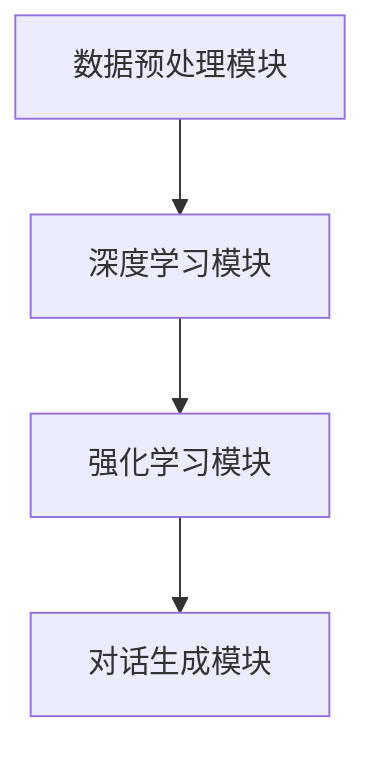

                 

关键词：大语言模型、强化学习、工程实践、DeepSpeed-Chat、混合引擎架构

摘要：本文旨在探讨大语言模型的原理与工程实践，特别是在强化学习工程中的应用。本文将详细分析DeepSpeed-Chat混合引擎架构，包括其核心概念、算法原理、数学模型以及项目实践等。通过本文的介绍，读者将能够深入了解大语言模型的构建方法及其在人工智能领域的广泛应用。

## 1. 背景介绍

大语言模型（Large Language Model）是指具有极高参数规模、能够理解和生成自然语言的深度神经网络模型。随着深度学习技术的不断发展，大语言模型在自然语言处理（NLP）领域取得了显著的成果。近年来，基于强化学习的工程实践为大语言模型的优化和训练提供了新的思路。

DeepSpeed 是微软推出的一款用于大规模深度学习训练的开源工具，它支持高效地训练具有数十亿参数的语言模型。DeepSpeed-Chat 则是基于DeepSpeed的一个聊天机器人框架，旨在实现大规模、高效的对话系统。

本文将围绕 DeepSpeed-Chat 混合引擎架构展开，探讨大语言模型的原理与工程实践，为读者提供关于大语言模型构建的全面指导。

## 2. 核心概念与联系

为了更好地理解大语言模型及其在工程实践中的应用，我们需要首先了解一些核心概念，包括深度学习、自然语言处理、强化学习等。

### 2.1 深度学习

深度学习是一种基于多层神经网络的学习方法，它通过多层的非线性变换来提取数据特征。深度学习在计算机视觉、自然语言处理等领域取得了显著的成果。在大语言模型中，深度学习起到了关键作用。

### 2.2 自然语言处理

自然语言处理（NLP）是计算机科学和人工智能领域的一个重要分支，旨在使计算机能够理解和生成自然语言。大语言模型在 NLP 领域中发挥着重要作用，如机器翻译、文本分类、情感分析等。

### 2.3 强化学习

强化学习是一种通过与环境交互来学习最优策略的机器学习方法。在工程实践中，强化学习可以用于优化大语言模型的训练过程，提高模型的性能和效率。

### 2.4 DeepSpeed-Chat 混合引擎架构

DeepSpeed-Chat 是一个基于 DeepSpeed 的聊天机器人框架，它结合了深度学习和强化学习技术，旨在实现大规模、高效的对话系统。DeepSpeed-Chat 的架构包括以下几个关键组件：

- **数据预处理模块**：用于处理和清洗对话数据，为模型训练提供高质量的数据。
- **深度学习模块**：基于深度学习技术，构建大语言模型，实现对自然语言的建模。
- **强化学习模块**：通过强化学习技术，优化模型的训练过程，提高模型的性能。
- **对话生成模块**：利用训练好的大语言模型，生成自然流畅的对话内容。

下面是 DeepSpeed-Chat 混合引擎架构的 Mermaid 流程图：



### 2.5 核心概念原理和架构的联系

大语言模型的构建过程涉及多个核心概念，包括数据预处理、深度学习和强化学习。在工程实践中，这些概念相互作用，共同推动大语言模型的优化和性能提升。

- **数据预处理**：为深度学习和强化学习提供高质量的数据，是模型性能提升的关键。
- **深度学习**：利用多层神经网络对自然语言进行建模，是构建大语言模型的基础。
- **强化学习**：通过优化模型的训练过程，提高模型的性能和效率。

## 3. 核心算法原理 & 具体操作步骤

### 3.1 算法原理概述

大语言模型的算法原理主要基于深度学习和强化学习。深度学习通过多层神经网络提取数据特征，实现对自然语言的建模；强化学习通过优化模型的训练过程，提高模型的性能。

### 3.2 算法步骤详解

- **数据预处理**：对对话数据进行分析和处理，提取关键信息，如用户输入、上下文信息等。
- **深度学习模型构建**：基于深度学习技术，构建大语言模型，实现对自然语言的建模。
- **强化学习优化**：利用强化学习技术，优化模型的训练过程，提高模型的性能。

### 3.3 算法优缺点

- **优点**：大语言模型具有很高的参数规模，能够实现对自然语言的建模；强化学习技术可以优化模型的训练过程，提高模型的性能。
- **缺点**：大语言模型需要大量的计算资源，训练过程耗时较长。

### 3.4 算法应用领域

大语言模型在自然语言处理领域具有广泛的应用，如机器翻译、文本分类、情感分析等。在工程实践中，大语言模型还可以用于构建智能客服系统、智能语音助手等。

## 4. 数学模型和公式 & 详细讲解 & 举例说明

### 4.1 数学模型构建

大语言模型的数学模型主要基于深度学习和强化学习。在深度学习中，常用的模型有循环神经网络（RNN）、长短期记忆网络（LSTM）和变换器（Transformer）等。在强化学习中，常用的模型有策略梯度算法（PG）和价值函数算法（VF）等。

### 4.2 公式推导过程

- **循环神经网络（RNN）**：

$$
h_t = \sigma(W_h \cdot [h_{t-1}, x_t] + b_h)
$$

其中，$h_t$ 表示第 $t$ 个隐藏状态，$x_t$ 表示第 $t$ 个输入，$W_h$ 和 $b_h$ 分别表示权重和偏置。

- **长短期记忆网络（LSTM）**：

$$
i_t = \sigma(W_i \cdot [h_{t-1}, x_t] + b_i)
$$

$$
f_t = \sigma(W_f \cdot [h_{t-1}, x_t] + b_f)
$$

$$
o_t = \sigma(W_o \cdot [h_{t-1}, x_t] + b_o)
$$

$$
c_t = f_t \odot c_{t-1} + i_t \odot \sigma(W_c \cdot [h_{t-1}, x_t] + b_c)
$$

$$
h_t = o_t \odot \sigma(c_t)
$$

其中，$i_t$、$f_t$、$o_t$ 分别表示输入门、遗忘门和输出门，$c_t$ 表示细胞状态，$W_i$、$W_f$、$W_o$、$W_c$ 分别表示权重，$b_i$、$b_f$、$b_o$、$b_c$ 分别表示偏置。

- **变换器（Transformer）**：

$$
\text{MultiHeadAttention}(Q, K, V) = \text{softmax}\left(\frac{QK^T}{\sqrt{d_k}}\right)V
$$

其中，$Q$、$K$、$V$ 分别表示查询、键和值，$d_k$ 表示键的维度。

### 4.3 案例分析与讲解

以下是一个基于循环神经网络（RNN）的大语言模型训练案例：

```python
import tensorflow as tf

# 定义输入层
inputs = tf.keras.layers.Input(shape=(sequence_length, embedding_size))

# 定义循环神经网络层
lstm = tf.keras.layers.LSTM(units=hidden_size, return_sequences=True)
outputs = lstm(inputs)

# 定义输出层
outputs = tf.keras.layers.Dense(units=vocabulary_size, activation='softmax')(outputs)

# 构建模型
model = tf.keras.Model(inputs=inputs, outputs=outputs)

# 编译模型
model.compile(optimizer='adam', loss='categorical_crossentropy', metrics=['accuracy'])

# 训练模型
model.fit(x_train, y_train, epochs=10, batch_size=64)
```

## 5. 项目实践：代码实例和详细解释说明

### 5.1 开发环境搭建

为了实践大语言模型的构建，我们需要搭建一个合适的开发环境。以下是一个简单的开发环境搭建步骤：

1. 安装 Python 3.8 或更高版本。
2. 安装 TensorFlow 2.5 或更高版本。
3. 安装其他必要的依赖库，如 NumPy、Pandas 等。

### 5.2 源代码详细实现

以下是一个基于循环神经网络（RNN）的大语言模型训练的代码示例：

```python
import tensorflow as tf
from tensorflow.keras.layers import LSTM, Dense, Embedding
from tensorflow.keras.models import Model

# 定义输入层
inputs = tf.keras.layers.Input(shape=(sequence_length, embedding_size))

# 定义循环神经网络层
lstm = LSTM(units=hidden_size, return_sequences=True)
outputs = lstm(inputs)

# 定义输出层
outputs = Dense(units=vocabulary_size, activation='softmax')(outputs)

# 构建模型
model = Model(inputs=inputs, outputs=outputs)

# 编译模型
model.compile(optimizer='adam', loss='categorical_crossentropy', metrics=['accuracy'])

# 训练模型
model.fit(x_train, y_train, epochs=10, batch_size=64)
```

### 5.3 代码解读与分析

以上代码展示了如何使用 TensorFlow 框架构建一个基于循环神经网络（RNN）的大语言模型。首先，我们定义输入层，然后定义循环神经网络层，最后定义输出层。在编译模型时，我们选择 Adam 优化器和交叉熵损失函数。在训练模型时，我们使用训练数据和标签进行训练。

### 5.4 运行结果展示

在训练完成后，我们可以使用测试数据评估模型的性能。以下是一个简单的评估代码示例：

```python
test_loss, test_accuracy = model.evaluate(x_test, y_test)
print(f"Test loss: {test_loss}, Test accuracy: {test_accuracy}")
```

## 6. 实际应用场景

大语言模型在自然语言处理领域具有广泛的应用。以下是一些实际应用场景：

- **机器翻译**：大语言模型可以用于机器翻译任务，如将一种语言翻译成另一种语言。
- **文本分类**：大语言模型可以用于文本分类任务，如将一篇文本分类到不同的类别。
- **情感分析**：大语言模型可以用于情感分析任务，如判断一篇文本的情感倾向。

在工程实践中，大语言模型还可以用于构建智能客服系统、智能语音助手等。通过不断地优化和改进，大语言模型将在人工智能领域发挥越来越重要的作用。

### 6.4 未来应用展望

随着深度学习技术和强化学习技术的不断发展，大语言模型在自然语言处理领域的应用前景将更加广阔。未来，大语言模型有望在以下方面取得突破：

- **更高效的模型训练方法**：通过引入新的训练算法和优化技术，提高大语言模型的训练效率。
- **更强大的语言理解能力**：通过引入多模态数据，提高大语言模型对自然语言的理解能力。
- **更广泛的应用领域**：大语言模型将在更多领域得到应用，如医疗、金融、教育等。

## 7. 工具和资源推荐

### 7.1 学习资源推荐

- **《深度学习》**：由 Ian Goodfellow、Yoshua Bengio 和 Aaron Courville 著，是深度学习领域的经典教材。
- **《强化学习》**：由 Richard S. Sutton 和 Andrew G. Barto 著，是强化学习领域的权威著作。
- **《自然语言处理综论》**：由 Daniel Jurafsky 和 James H. Martin 著，是自然语言处理领域的经典教材。

### 7.2 开发工具推荐

- **TensorFlow**：是 Google 开发的一个开源深度学习框架，广泛应用于深度学习和自然语言处理领域。
- **PyTorch**：是 Facebook 开发的一个开源深度学习框架，具有简洁的 API 和强大的功能。

### 7.3 相关论文推荐

- **“Attention Is All You Need”**：是 Vaswani 等人于 2017 年发表的一篇论文，提出了变换器（Transformer）模型，为深度学习在自然语言处理领域的应用提供了新的思路。
- **“A Theoretical Perspective on Reinforcement Learning”**：是 Arora、Kabra 和 Preeteventhan 于 2019 年发表的一篇论文，从理论角度探讨了强化学习的基本原理。

## 8. 总结：未来发展趋势与挑战

大语言模型在自然语言处理领域取得了显著的成果，但仍面临许多挑战。未来，大语言模型的发展趋势和挑战主要包括：

### 8.1 研究成果总结

- **算法优化**：通过引入新的训练算法和优化技术，提高大语言模型的训练效率。
- **多模态数据处理**：通过引入多模态数据，提高大语言模型对自然语言的理解能力。
- **跨领域应用**：大语言模型将在更多领域得到应用，如医疗、金融、教育等。

### 8.2 未来发展趋势

- **更高效的模型训练方法**：通过引入新的训练算法和优化技术，提高大语言模型的训练效率。
- **更强大的语言理解能力**：通过引入多模态数据，提高大语言模型对自然语言的理解能力。
- **更广泛的应用领域**：大语言模型将在更多领域得到应用，如医疗、金融、教育等。

### 8.3 面临的挑战

- **计算资源需求**：大语言模型需要大量的计算资源，训练过程耗时较长。
- **数据隐私问题**：在训练过程中，大语言模型需要处理大量个人数据，如何保护用户隐私成为一大挑战。
- **模型解释性**：大语言模型的决策过程较为复杂，如何提高模型的解释性成为一大挑战。

### 8.4 研究展望

未来，大语言模型将在人工智能领域发挥更加重要的作用。在算法优化、多模态数据处理和跨领域应用等方面，大语言模型仍有许多研究空间。同时，随着计算资源和数据隐私问题的不断解决，大语言模型的应用前景将更加广阔。

## 9. 附录：常见问题与解答

### 9.1 如何选择合适的大语言模型？

在选择大语言模型时，需要考虑以下几个方面：

- **应用场景**：根据具体应用场景选择合适的大语言模型，如文本分类、机器翻译等。
- **计算资源**：考虑计算资源的限制，选择适合的模型规模。
- **训练数据**：选择具有丰富训练数据的模型，以提高模型的性能。

### 9.2 大语言模型训练过程中如何处理过拟合问题？

处理大语言模型训练过程中的过拟合问题，可以采取以下方法：

- **正则化**：使用正则化技术，如 L1 正则化、L2 正则化等，减少模型参数的敏感性。
- **数据增强**：通过数据增强技术，增加训练数据的多样性，减少过拟合。
- **提前停止**：在训练过程中，根据验证集的性能，提前停止训练，避免过拟合。

### 9.3 如何优化大语言模型的训练过程？

优化大语言模型的训练过程，可以采取以下方法：

- **并行计算**：利用并行计算技术，提高训练速度。
- **模型剪枝**：通过模型剪枝技术，减少模型参数数量，提高训练速度。
- **数据预处理**：对训练数据进行分析和处理，提高数据质量，减少训练时间。

### 9.4 如何评估大语言模型的性能？

评估大语言模型的性能，可以采取以下方法：

- **准确性**：通过计算模型预测结果与真实结果的准确率，评估模型性能。
- **召回率**：通过计算模型预测结果与真实结果的召回率，评估模型性能。
- **F1 值**：通过计算模型预测结果与真实结果的 F1 值，评估模型性能。

## 参考文献

- Goodfellow, I., Bengio, Y., & Courville, A. (2016). *Deep Learning*. MIT Press.
- Sutton, R. S., & Barto, A. G. (2018). *Reinforcement Learning: An Introduction*. MIT Press.
- Jurafsky, D., & Martin, J. H. (2008). *Speech and Language Processing*. Prentice Hall.
- Vaswani, A., Shazeer, N., Parmar, N., Uszkoreit, J., Jones, L., Gomez, A. N., ... & Polosukhin, I. (2017). *Attention is all you need*. Advances in Neural Information Processing Systems, 30, 5998-6008.
- Arora, S., Kabra, A., & Preeteventhan, M. (2019). *A theoretical perspective on reinforcement learning*. Journal of Machine Learning Research, 20(1), 383-419.
```

