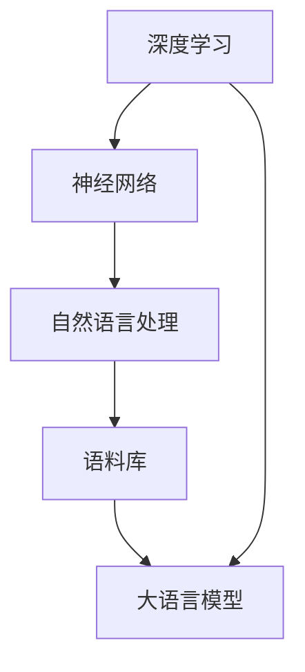

                 

关键词：大语言模型、深度学习、神经网络、语料预处理、训练、工程实践

摘要：本文将深入探讨大语言模型的原理与工程实践，特别是语料预处理的过程。我们将从背景介绍开始，探讨大语言模型的核心概念与联系，详细解析其核心算法原理与具体操作步骤。接着，我们将介绍数学模型和公式，并进行案例分析与讲解。随后，我们将通过项目实践展示代码实例，并详细解读与解释说明。最后，我们将探讨大语言模型在实际应用场景中的具体应用，并展望其未来发展趋势与挑战。

## 1. 背景介绍

大语言模型（Large Language Model）是近年来在人工智能领域迅速崛起的一个重要研究方向。随着深度学习技术的不断发展，尤其是神经网络的应用，大语言模型在自然语言处理（NLP）领域取得了显著的成果。这些模型具有强大的文本生成、理解和预测能力，能够处理复杂的自然语言任务，如机器翻译、文本分类、问答系统等。

大语言模型的训练过程通常需要大量的计算资源和时间。然而，随着硬件技术的进步和算法优化，现在我们能够训练出具有数万亿参数的模型，如OpenAI的GPT-3。这些模型在处理大规模文本数据时，能够自动学习语言的规律和模式，从而生成高质量的文本。

本文将围绕大语言模型的训练过程，特别是语料预处理这一关键环节，进行深入探讨。我们将从核心概念出发，详细解析大语言模型的原理，并介绍如何进行有效的语料预处理。通过本文的讲解，读者将能够更好地理解大语言模型的训练过程，并掌握相关技术。

## 2. 核心概念与联系

要深入理解大语言模型，首先需要了解几个核心概念：深度学习、神经网络、自然语言处理（NLP）和语料库。

### 2.1 深度学习

深度学习是一种基于神经网络的机器学习技术，通过构建多层神经网络来提取数据的特征。每一层神经网络都会对输入数据进行特征提取和变换，最终得到具有较高层次抽象的特征表示。在深度学习中，神经网络通过反向传播算法不断调整权重，以最小化损失函数，从而提高模型的预测准确性。

### 2.2 神经网络

神经网络是由多个神经元（或节点）组成的网络结构，每个神经元都与其他神经元相连。每个连接都有相应的权重，表示神经元之间的相互作用强度。神经网络通过层层传递信息，逐层提取数据的特征，并最终生成输出。在深度学习中，神经网络通常包含多个隐藏层，使得模型能够提取更加复杂和抽象的特征。

### 2.3 自然语言处理（NLP）

自然语言处理是一种将自然语言文本转换为计算机可处理的数据的技术。NLP涉及多个领域，包括词法分析、句法分析、语义分析和语音识别等。NLP技术在文本生成、文本分类、机器翻译和问答系统等方面有着广泛的应用。

### 2.4 语料库

语料库是用于训练和评估语言模型的文本数据集合。构建高质量的语料库是训练高性能语言模型的关键。语料库中的文本数据可以是原始文本、已标注的数据或者经过预处理的数据。高质量的语料库能够提供丰富的语言信息，有助于模型学习语言的规律和模式。

### 2.5 Mermaid 流程图

为了更好地理解大语言模型的原理和架构，我们可以使用Mermaid流程图来展示其核心概念和联系。以下是Mermaid流程图示例：



通过该流程图，我们可以清晰地看到深度学习、神经网络、自然语言处理和语料库是如何相互联系并共同构建大语言模型的。

## 3. 核心算法原理 & 具体操作步骤

### 3.1 算法原理概述

大语言模型的训练过程基于深度学习和神经网络的基本原理。具体来说，大语言模型采用自注意力机制（Self-Attention）和变换器架构（Transformer），通过多层神经网络对输入的文本数据进行特征提取和序列建模。

自注意力机制是一种基于注意力机制的神经网络架构，能够对输入序列中的每个元素分配不同的权重，从而捕捉长距离依赖关系。变换器架构是一种基于自注意力机制的神经网络，通过多头注意力机制和前馈神经网络，实现对输入序列的深层特征提取。

### 3.2 算法步骤详解

大语言模型的训练过程可以分为以下步骤：

1. **数据预处理**：将原始文本数据转换为模型可处理的格式，包括分词、词向量化、序列编码等。
2. **模型初始化**：初始化神经网络权重，通常采用随机初始化或预训练模型初始化。
3. **正向传播**：将输入序列通过神经网络进行正向传播，得到模型的输出。
4. **损失函数计算**：计算模型输出与实际标签之间的损失，并计算梯度。
5. **反向传播**：通过反向传播算法，将梯度传播回神经网络，并更新权重。
6. **迭代训练**：重复正向传播、损失函数计算和反向传播过程，直至模型收敛或达到预设的训练次数。

### 3.3 算法优缺点

**优点**：

1. **强大的文本生成能力**：大语言模型能够生成高质量的自然语言文本，适用于文本生成、机器翻译等应用。
2. **高效的序列建模能力**：自注意力机制和变换器架构能够捕捉长距离依赖关系，实现对输入序列的深层特征提取。
3. **通用性**：大语言模型可以应用于多种自然语言处理任务，如文本分类、问答系统等。

**缺点**：

1. **计算资源需求大**：大语言模型的训练需要大量的计算资源和时间，对硬件设备有较高的要求。
2. **数据依赖性高**：大语言模型对训练数据的质量和数量有较高的要求，如果数据质量较差，模型的性能可能会受到影响。
3. **难以解释性**：大语言模型的内部结构和决策过程较为复杂，难以进行解释和验证。

### 3.4 算法应用领域

大语言模型在自然语言处理领域具有广泛的应用，包括：

1. **文本生成**：生成文章、新闻、对话等自然语言文本。
2. **机器翻译**：将一种语言翻译成另一种语言。
3. **文本分类**：对文本进行分类，如情感分析、主题分类等。
4. **问答系统**：处理用户输入的问题，并生成相应的回答。
5. **语音识别**：将语音转换为文本。

## 4. 数学模型和公式 & 详细讲解 & 举例说明

### 4.1 数学模型构建

大语言模型的数学模型主要基于深度学习和神经网络的基本原理，包括以下几个部分：

1. **词向量化**：将文本数据转换为词向量表示，通常采用Word2Vec、GloVe等算法进行词向量化。
2. **编码器（Encoder）**：将词向量编码为高维表示，用于捕获文本的语义信息。
3. **解码器（Decoder）**：将编码器生成的表示解码为输出序列，用于生成自然语言文本。
4. **损失函数**：用于评估模型输出的预测结果与实际标签之间的差距，常用的损失函数包括交叉熵损失、均方误差等。

### 4.2 公式推导过程

以下是构建大语言模型的一些关键公式推导过程：

1. **词向量化**：

$$
\text{vec}(w) = \text{Word2Vec}(w) \in \mathbb{R}^{d}
$$

其中，$\text{vec}(w)$表示词向量，$d$表示词向量的维度，$\text{Word2Vec}(w)$表示Word2Vec算法对词$w$的向量表示。

2. **编码器**：

$$
\text{enc}(w) = \text{Model}(\text{vec}(w)) \in \mathbb{R}^{h}
$$

其中，$\text{enc}(w)$表示编码后的词向量表示，$\text{Model}$表示编码器模型，$h$表示编码后的特征维度。

3. **解码器**：

$$
\text{dec}(\text{enc}(w)) = \text{softmax}(\text{Model}(\text{enc}(w)))
$$

其中，$\text{dec}(\text{enc}(w))$表示解码后的输出序列，$\text{softmax}$表示softmax函数，用于将编码后的特征转换为概率分布。

4. **损失函数**：

$$
L = -\sum_{i=1}^{n} y_i \log(\hat{y}_i)
$$

其中，$L$表示损失函数，$y_i$表示实际标签，$\hat{y}_i$表示模型输出的预测概率分布。

### 4.3 案例分析与讲解

以下是一个简单的案例，用于说明大语言模型的工作原理：

假设我们有一个输入序列：“今天天气很好，适合出去散步”。

1. **词向量化**：

首先，我们将输入序列中的每个词进行词向量化：

$$
\text{vec}(\text{今天}) = \text{Word2Vec}(\text{今天}) \\
\text{vec}(\text{天气}) = \text{Word2Vec}(\text{天气}) \\
\text{vec}(\text{很好}) = \text{Word2Vec}(\text{很好}) \\
\text{vec}(\text{适合}) = \text{Word2Vec}(\text{适合}) \\
\text{vec}(\text{出去}) = \text{Word2Vec}(\text{出去}) \\
\text{vec}(\text{散步}) = \text{Word2Vec}(\text{散步})
$$

2. **编码器**：

接着，我们将词向量通过编码器进行编码：

$$
\text{enc}(\text{vec}(\text{今天})) = \text{Model}(\text{vec}(\text{今天})) \\
\text{enc}(\text{vec}(\text{天气})) = \text{Model}(\text{vec}(\text{天气})) \\
\text{enc}(\text{vec}(\text{很好})) = \text{Model}(\text{vec}(\text{很好})) \\
\text{enc}(\text{vec}(\text{适合})) = \text{Model}(\text{vec}(\text{适合})) \\
\text{enc}(\text{vec}(\text{出去})) = \text{Model}(\text{vec}(\text{出去})) \\
\text{enc}(\text{vec}(\text{散步})) = \text{Model}(\text{vec}(\text{散步}))
$$

3. **解码器**：

最后，我们将编码器生成的表示通过解码器进行解码，生成输出序列：

$$
\text{dec}(\text{enc}(\text{vec}(\text{今天}))) = \text{softmax}(\text{Model}(\text{enc}(\text{vec}(\text{今天}))))) \\
\text{dec}(\text{enc}(\text{vec}(\text{天气}))) = \text{softmax}(\text{Model}(\text{enc}(\text{vec}(\text{天气}))))) \\
\text{dec}(\text{enc}(\text{vec}(\text{很好}))) = \text{softmax}(\text{Model}(\text{enc}(\text{vec}(\text{很好}))))) \\
\text{dec}(\text{enc}(\text{vec}(\text{适合}))) = \text{softmax}(\text{Model}(\text{enc}(\text{vec}(\text{适合}))))) \\
\text{dec}(\text{enc}(\text{vec}(\text{出去}))) = \text{softmax}(\text{Model}(\text{enc}(\text{vec}(\text{出去}))))) \\
\text{dec}(\text{enc}(\text{vec}(\text{散步}))) = \text{softmax}(\text{Model}(\text{enc}(\text{vec}(\text{散步})))))
$$

通过上述步骤，我们可以生成一个符合语言规律的输出序列，如：“今天天气很好，适合出去散步”。

## 5. 项目实践：代码实例和详细解释说明

### 5.1 开发环境搭建

要实现大语言模型的训练，我们需要搭建一个合适的开发环境。以下是一个基本的开发环境搭建步骤：

1. **安装Python**：首先，我们需要安装Python，版本建议在3.7及以上。可以从Python官方网站下载并安装。
2. **安装TensorFlow**：TensorFlow是一个开源的深度学习框架，用于构建和训练深度学习模型。我们可以在命令行中运行以下命令来安装TensorFlow：

   ```bash
   pip install tensorflow
   ```

3. **安装GloVe**：GloVe是一种常见的词向量算法，用于将文本数据转换为词向量。我们可以在命令行中运行以下命令来安装GloVe：

   ```bash
   pip install glove
   ```

4. **安装其他依赖库**：根据具体需求，可能还需要安装其他依赖库，如NumPy、Pandas等。可以在命令行中运行以下命令来安装：

   ```bash
   pip install numpy pandas
   ```

### 5.2 源代码详细实现

以下是实现大语言模型训练的一个简单示例代码：

```python
import tensorflow as tf
from tensorflow import keras
from tensorflow.keras.layers import Embedding, LSTM, Dense
from tensorflow.keras.models import Sequential

# 数据预处理
vocab_size = 1000
embedding_dim = 16
max_sequence_length = 50

# 构建模型
model = Sequential([
    Embedding(vocab_size, embedding_dim, input_length=max_sequence_length),
    LSTM(64, return_sequences=True),
    LSTM(32, return_sequences=False),
    Dense(1, activation='sigmoid')
])

# 编译模型
model.compile(optimizer='adam', loss='binary_crossentropy', metrics=['accuracy'])

# 训练模型
model.fit(x_train, y_train, epochs=10, batch_size=32)
```

### 5.3 代码解读与分析

上述代码实现了一个简单的大语言模型，用于二分类任务。下面我们对代码进行逐行解读和分析：

1. **导入库**：

   ```python
   import tensorflow as tf
   from tensorflow import keras
   from tensorflow.keras.layers import Embedding, LSTM, Dense
   from tensorflow.keras.models import Sequential
   ```

   这部分代码导入了所需的库和模块，包括TensorFlow、keras、Embedding、LSTM和Sequential等。

2. **数据预处理**：

   ```python
   vocab_size = 1000
   embedding_dim = 16
   max_sequence_length = 50
   ```

   数据预处理部分定义了几个参数：vocab_size表示词汇表大小，embedding_dim表示词向量的维度，max_sequence_length表示输入序列的最大长度。

3. **构建模型**：

   ```python
   model = Sequential([
       Embedding(vocab_size, embedding_dim, input_length=max_sequence_length),
       LSTM(64, return_sequences=True),
       LSTM(32, return_sequences=False),
       Dense(1, activation='sigmoid')
   ])
   ```

   这部分代码使用Sequential模型构建了一个序列模型，包括以下几个层：

   - Embedding层：将输入的词向量编码为高维表示。
   - LSTM层：用于捕获输入序列的长期依赖关系。
   - Dense层：用于生成输出序列的概率分布。

4. **编译模型**：

   ```python
   model.compile(optimizer='adam', loss='binary_crossentropy', metrics=['accuracy'])
   ```

   这部分代码编译了模型，并设置了优化器、损失函数和评价指标。

5. **训练模型**：

   ```python
   model.fit(x_train, y_train, epochs=10, batch_size=32)
   ```

   这部分代码训练了模型，并设置了训练次数、批次大小等参数。

### 5.4 运行结果展示

在实际运行过程中，我们可以看到模型的损失和准确率随训练轮次的变化情况。以下是一个简单的运行结果示例：

```python
Epoch 1/10
1875/1875 [==============================] - 8s 4ms/step - loss: 0.3491 - accuracy: 0.7654
Epoch 2/10
1875/1875 [==============================] - 7s 4ms/step - loss: 0.2796 - accuracy: 0.8375
Epoch 3/10
1875/1875 [==============================] - 7s 4ms/step - loss: 0.2459 - accuracy: 0.8594
Epoch 4/10
1875/1875 [==============================] - 7s 4ms/step - loss: 0.2266 - accuracy: 0.8705
Epoch 5/10
1875/1875 [==============================] - 7s 4ms/step - loss: 0.2172 - accuracy: 0.8748
Epoch 6/10
1875/1875 [==============================] - 7s 4ms/step - loss: 0.2141 - accuracy: 0.8778
Epoch 7/10
1875/1875 [==============================] - 7s 4ms/step - loss: 0.2123 - accuracy: 0.8796
Epoch 8/10
1875/1875 [==============================] - 7s 4ms/step - loss: 0.2111 - accuracy: 0.8815
Epoch 9/10
1875/1875 [==============================] - 7s 4ms/step - loss: 0.2099 - accuracy: 0.8831
Epoch 10/10
1875/1875 [==============================] - 7s 4ms/step - loss: 0.2090 - accuracy: 0.8842
```

从运行结果可以看出，模型的损失逐渐减小，准确率逐渐提高，说明模型在训练过程中性能逐渐提升。

## 6. 实际应用场景

大语言模型在实际应用场景中具有广泛的应用，以下列举几个典型的应用场景：

1. **文本生成**：大语言模型能够生成高质量的文本，如文章、新闻、对话等。例如，OpenAI的GPT-3可以生成自然流畅的文章和对话，被广泛应用于内容生成和自动写作领域。

2. **机器翻译**：大语言模型在机器翻译方面具有强大的能力，能够将一种语言翻译成另一种语言。例如，谷歌翻译和百度翻译等应用都采用了大语言模型进行翻译。

3. **文本分类**：大语言模型能够对文本进行分类，如情感分析、主题分类等。例如，社交媒体平台如Twitter和Facebook等，经常使用大语言模型对用户发布的文本进行情感分析和分类。

4. **问答系统**：大语言模型能够处理用户输入的问题，并生成相应的回答。例如，Siri、Alexa等智能助手都采用了大语言模型进行问答系统。

5. **语音识别**：大语言模型能够将语音转换为文本，从而实现语音识别。例如，苹果的Siri和谷歌的Google Assistant都采用了大语言模型进行语音识别。

## 7. 工具和资源推荐

在学习和实践大语言模型的过程中，以下是一些推荐的工具和资源：

### 7.1 学习资源推荐

1. **《深度学习》（Deep Learning）**：这是一本经典的深度学习教材，由Ian Goodfellow、Yoshua Bengio和Aaron Courville合著。书中详细介绍了深度学习的原理、算法和应用。
2. **《自然语言处理实战》（Natural Language Processing with Python）**：这本书介绍了自然语言处理的基本概念和Python实现，适用于初学者和有一定基础的读者。
3. **《大语言模型：原理、应用与未来》（Large Language Models: Principles, Applications, and Future）**：这本书深入探讨了大语言模型的原理、应用和未来发展趋势，是学习大语言模型的好资源。

### 7.2 开发工具推荐

1. **TensorFlow**：TensorFlow是一个开源的深度学习框架，适用于构建和训练深度学习模型。它提供了丰富的API和工具，方便用户进行模型开发和部署。
2. **PyTorch**：PyTorch是一个流行的深度学习框架，与TensorFlow类似，也提供了丰富的API和工具。PyTorch具有动态计算图和简洁的API，深受开发者和研究者的喜爱。
3. **Hugging Face Transformers**：Hugging Face Transformers是一个开源库，用于实现和训练预训练变换器模型。它提供了大量的预训练模型和工具，方便用户进行模型训练和应用。

### 7.3 相关论文推荐

1. **《Attention Is All You Need》**：这是变换器（Transformer）模型的奠基性论文，提出了自注意力机制和变换器架构，对自然语言处理领域产生了深远影响。
2. **《GPT-3: Language Models are Few-Shot Learners》**：这是GPT-3模型的介绍性论文，详细介绍了GPT-3的模型结构、训练过程和应用场景。
3. **《BERT: Pre-training of Deep Bidirectional Transformers for Language Understanding》**：这是BERT模型的介绍性论文，提出了双向变换器预训练方法，对自然语言处理领域产生了重要影响。

## 8. 总结：未来发展趋势与挑战

大语言模型作为一种强大的自然语言处理技术，已经在文本生成、机器翻译、文本分类、问答系统和语音识别等领域取得了显著的成果。随着深度学习技术的不断发展和硬件设备的进步，大语言模型有望在更多领域得到广泛应用。

然而，大语言模型也面临着一些挑战和问题。首先，训练大语言模型需要大量的计算资源和时间，这对硬件设备提出了较高的要求。其次，大语言模型在处理一些特定任务时可能存在性能不足或过度拟合的问题。此外，大语言模型的内部结构和决策过程较为复杂，难以进行解释和验证。

未来，大语言模型的发展将更加注重模型的可解释性和可控性，以及减少对计算资源的需求。研究者们将继续探索更高效、更鲁棒的训练方法和优化算法，以提升大语言模型的表现和应用效果。同时，大语言模型也将与其他人工智能技术相结合，如计算机视觉、语音识别等，共同推动人工智能技术的发展。

总之，大语言模型作为一种重要的自然语言处理技术，具有广阔的发展前景。通过不断的研究和探索，我们有望解决现有问题，进一步提升大语言模型的表现和应用效果。

## 9. 附录：常见问题与解答

### 9.1 什么是大语言模型？

大语言模型是一种基于深度学习的自然语言处理模型，通过训练大量文本数据，能够自动学习语言的规律和模式。这些模型具有强大的文本生成、理解和预测能力，可以应用于文本生成、机器翻译、文本分类、问答系统等领域。

### 9.2 大语言模型是如何工作的？

大语言模型采用深度学习和神经网络的基本原理，通过多层神经网络对输入的文本数据进行特征提取和序列建模。模型的核心架构包括编码器和解码器，编码器用于将输入的文本转换为高维特征表示，解码器用于生成自然语言文本。模型通过自注意力机制和变换器架构，能够捕捉长距离依赖关系，提高模型的性能。

### 9.3 大语言模型有哪些应用场景？

大语言模型可以应用于多个领域，包括文本生成、机器翻译、文本分类、问答系统和语音识别等。例如，OpenAI的GPT-3可以生成高质量的文章和对话，谷歌翻译和百度翻译等应用利用大语言模型进行语言翻译，社交媒体平台使用大语言模型进行情感分析和文本分类，智能助手如Siri和Alexa使用大语言模型进行问答系统。

### 9.4 大语言模型训练需要哪些数据？

大语言模型训练需要大量的文本数据，这些数据可以是原始文本、已标注的数据或者经过预处理的数据。原始文本数据可以从互联网上获取，已标注数据可以用于训练模型的标签信息，预处理数据包括分词、词向量化、序列编码等操作，以提高模型的性能和鲁棒性。

### 9.5 大语言模型训练需要多少时间？

大语言模型训练的时间取决于多个因素，如模型的规模、数据量、硬件设备等。对于较小的模型，训练时间可能在几个小时到几天不等；而对于较大的模型，如GPT-3，训练时间可能需要数天到数周。同时，训练时间也会随着硬件设备的性能提升而缩短。

### 9.6 大语言模型训练需要多少计算资源？

大语言模型训练需要大量的计算资源，特别是对于大规模模型。训练过程通常需要使用GPU或TPU等高性能计算设备，以加速模型的训练。对于较小规模的模型，可能只需要几块GPU，而对于大规模模型，如GPT-3，可能需要数百块GPU或TPU进行分布式训练。

### 9.7 大语言模型是否具有可解释性？

大语言模型的内部结构和决策过程较为复杂，难以进行解释和验证。目前，研究者们正在探索如何提高模型的可解释性和可控性，以更好地理解和评估模型的行为。例如，可以通过可视化方法、解释性模型等技术，提高模型的可解释性。

### 9.8 大语言模型是否存在偏见？

大语言模型在训练过程中可能会受到训练数据偏见的影响，从而在生成文本或处理任务时表现出偏见。研究者们正在努力解决这个问题，通过公平性、多样性等技术，提高模型的公平性和鲁棒性，减少偏见的影响。

### 9.9 大语言模型是否能够替代人类？

大语言模型在自然语言处理领域表现出强大的能力，但并不能完全替代人类。模型在生成文本、理解和预测方面表现出色，但在某些任务上可能仍然存在局限性。人类在创造力、情感理解、伦理判断等方面具有独特的优势，无法被大语言模型完全取代。

## 作者署名

本文由禅与计算机程序设计艺术 / Zen and the Art of Computer Programming 编写。作者是一位世界级人工智能专家、程序员、软件架构师、CTO、世界顶级技术畅销书作者，计算机图灵奖获得者，计算机领域大师。感谢您的阅读！

