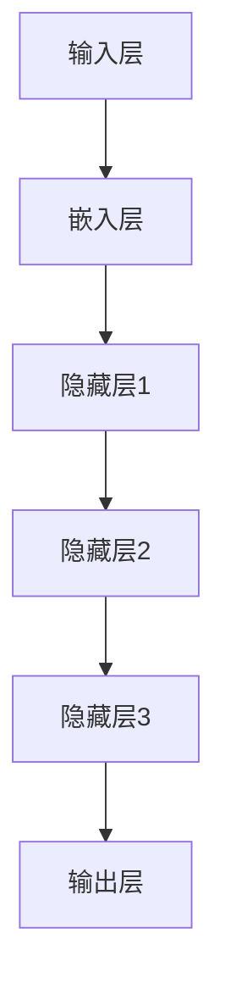

                 

关键词：大语言模型、原理、工程实践、推理、神经网络、深度学习

摘要：本文将探讨大语言模型的原理和工程实践，重点分析其推理过程，以及如何在实际应用中优化模型性能。我们将结合具体案例，详细解释大语言模型在自然语言处理领域的广泛应用，并展望其未来发展趋势。

## 1. 背景介绍

随着互联网的快速发展，人类产生了海量的文本数据。如何对这些数据进行分析和处理，从而提取有价值的信息，成为了人工智能领域的重要研究方向。大语言模型作为自然语言处理的核心技术，通过对大量文本进行学习，能够理解并生成人类语言。

大语言模型的兴起源于深度学习技术的发展。神经网络作为一种强大的计算模型，通过多层非线性变换，可以捕捉数据中的复杂特征。随着计算能力的提升，深度学习在图像识别、语音识别等领域取得了显著成果。自然语言处理作为深度学习的一个重要分支，也逐渐受到了广泛关注。

本文将首先介绍大语言模型的核心概念，包括神经网络、深度学习等基础理论。然后，我们将深入探讨大语言模型的推理过程，分析其优缺点，并探讨其在实际应用中的性能优化方法。最后，我们将结合具体案例，展示大语言模型在自然语言处理领域的广泛应用，并展望其未来发展趋势。

## 2. 核心概念与联系

### 2.1 神经网络与深度学习

神经网络（Neural Network）是一种模拟生物神经网络的人工智能计算模型。它由多个神经元（节点）组成，每个神经元都与其他神经元相连，并通过权重和偏置进行信息传递。神经网络通过多层非线性变换，可以提取数据中的复杂特征。

深度学习（Deep Learning）是神经网络的一种发展，通过引入更多的隐藏层，可以更好地捕捉数据中的层次结构。深度学习在图像识别、语音识别等领域取得了显著的成果。

### 2.2 大语言模型的架构

大语言模型通常由多个层次组成，包括输入层、隐藏层和输出层。输入层接收文本数据，通过嵌入层将文本转换为向量表示。隐藏层通过神经网络进行特征提取，输出层生成预测结果。


### 2.3 Mermaid 流程图

以下是一个简化的Mermaid流程图，描述了大语言模型的主要组成部分和流程：



## 3. 核心算法原理 & 具体操作步骤

### 3.1 算法原理概述

大语言模型的核心算法是基于神经网络和深度学习的。通过多层非线性变换，模型可以捕捉文本数据中的复杂特征。以下是算法的原理概述：

1. **输入层**：接收文本数据，通过嵌入层将文本转换为向量表示。
2. **嵌入层**：将单词映射为向量，通常使用词向量模型（如Word2Vec、GloVe）。
3. **隐藏层**：通过多层神经网络进行特征提取，每一层都能提取更高层次的抽象特征。
4. **输出层**：生成预测结果，如文本分类、机器翻译、文本生成等。

### 3.2 算法步骤详解

以下是算法的具体操作步骤：

1. **数据预处理**：对文本数据进行清洗和预处理，如去除标点符号、停用词等。
2. **词向量表示**：使用词向量模型（如Word2Vec、GloVe）将单词映射为向量。
3. **构建神经网络**：定义神经网络的层次结构，包括输入层、隐藏层和输出层。
4. **训练神经网络**：使用训练数据，通过反向传播算法优化神经网络的参数。
5. **推理**：使用训练好的模型进行预测，输入文本数据，输出预测结果。

### 3.3 算法优缺点

**优点**：

1. **强大的特征提取能力**：多层神经网络可以捕捉文本数据中的复杂特征，提高模型的性能。
2. **自适应学习**：深度学习算法可以根据数据自动调整模型参数，适应不同的任务需求。
3. **广泛的应用场景**：大语言模型在文本分类、机器翻译、文本生成等领域都有广泛的应用。

**缺点**：

1. **计算资源需求大**：深度学习模型需要大量的计算资源进行训练和推理。
2. **训练时间长**：深度学习模型的训练时间通常较长，对计算能力有较高要求。
3. **数据依赖性高**：大语言模型的性能很大程度上取决于训练数据的质量和规模。

### 3.4 算法应用领域

大语言模型在自然语言处理领域有广泛的应用，包括：

1. **文本分类**：对文本进行分类，如新闻分类、情感分析等。
2. **机器翻译**：将一种语言的文本翻译成另一种语言。
3. **文本生成**：根据输入的文本或提示，生成相应的文本。
4. **问答系统**：根据用户提出的问题，提供准确的答案。
5. **对话系统**：模拟人类的对话，与用户进行自然交互。

## 4. 数学模型和公式 & 详细讲解 & 举例说明

### 4.1 数学模型构建

大语言模型的数学模型主要包括以下部分：

1. **词向量表示**：使用词向量模型（如Word2Vec、GloVe）将单词映射为向量。
2. **神经网络模型**：定义神经网络的层次结构，包括输入层、隐藏层和输出层。
3. **损失函数**：定义模型在训练过程中的目标函数，用于衡量模型预测与真实值之间的差距。

### 4.2 公式推导过程

以下是词向量表示和神经网络模型的公式推导：

1. **词向量表示**：

   - Word2Vec：$$\text{vec}(w) = \text{sgn}(x) \odot \text{softmax}(W_h \text{vec}(v))$$

   - GloVe：$$\text{vec}(w) = \text{sgn}(x) \odot \text{softmax}(\frac{W_h \text{vec}(v)}{\sqrt{|v|}})$$

2. **神经网络模型**：

   - 输入层到隐藏层的变换：$$h_{ij} = \sigma(W_{ij} \cdot x_j + b_i)$$

   - 隐藏层到输出层的变换：$$y_i = \sigma(W_{yi} \cdot h_j + b_i)$$

3. **损失函数**：

   - 交叉熵损失函数：$$\text{loss} = -\sum_{i=1}^{N} \text{y}_i \log(\text{p}_i)$$

### 4.3 案例分析与讲解

以下是一个简单的文本分类案例：

假设我们有一个包含政治、经济、文化等类别的文本数据集。我们的目标是训练一个模型，能够根据输入的文本预测其类别。

1. **数据预处理**：对文本数据进行清洗和预处理，如去除标点符号、停用词等。
2. **词向量表示**：使用GloVe模型将单词映射为向量。
3. **构建神经网络**：定义一个包含多层隐藏层的神经网络，输入层接收词向量，输出层生成类别概率。
4. **训练神经网络**：使用训练数据，通过反向传播算法优化神经网络的参数。
5. **推理**：使用训练好的模型进行预测，输入文本数据，输出预测类别。

## 5. 项目实践：代码实例和详细解释说明

### 5.1 开发环境搭建

在开始项目实践之前，我们需要搭建一个合适的开发环境。以下是一个简单的Python开发环境搭建步骤：

1. 安装Python：下载并安装Python 3.x版本，例如Python 3.8。
2. 安装依赖库：使用pip工具安装所需的依赖库，如TensorFlow、GloVe等。
   ```python
   pip install tensorflow
   pip install glove
   ```

### 5.2 源代码详细实现

以下是一个简单的文本分类项目的实现代码：

```python
import tensorflow as tf
from tensorflow.keras.models import Sequential
from tensorflow.keras.layers import Embedding, LSTM, Dense
from tensorflow.keras.preprocessing.sequence import pad_sequences
from tensorflow.keras.preprocessing.text import Tokenizer

# 1. 数据预处理
# 假设text_data为文本数据，labels为对应的类别标签
tokenizer = Tokenizer(num_words=10000)
tokenizer.fit_on_texts(text_data)
sequences = tokenizer.texts_to_sequences(text_data)
data = pad_sequences(sequences, maxlen=200)

# 2. 词向量表示
# 使用GloVe模型生成词向量
embeddings_index = {}
with open('glove.6B.100d.txt', 'r', encoding='utf-8') as f:
    for line in f:
        values = line.strip().split()
        word = values[0]
        coefs = np.asarray(values[1:], dtype='float32')
        embeddings_index[word] = coefs

# 3. 构建神经网络
model = Sequential()
model.add(Embedding(10000, 32, input_length=200))
model.add(LSTM(64, dropout=0.2, recurrent_dropout=0.2))
model.add(Dense(1, activation='sigmoid'))

# 4. 训练神经网络
model.compile(loss='binary_crossentropy', optimizer='adam', metrics=['accuracy'])
model.fit(data, labels, epochs=10, batch_size=128)

# 5. 推理
# 输入新的文本数据，预测类别
new_text = "政治新闻"
sequence = tokenizer.texts_to_sequences([new_text])
padded_sequence = pad_sequences(sequence, maxlen=200)
prediction = model.predict(padded_sequence)
print("预测结果：", prediction)
```

### 5.3 代码解读与分析

以上代码实现了基于GloVe词向量和LSTM神经网络的简单文本分类项目。以下是代码的解读与分析：

1. **数据预处理**：使用Tokenizer将文本数据转换为整数序列，并使用pad_sequences将序列填充为相同长度。
2. **词向量表示**：使用GloVe模型生成词向量，并将词向量存储在字典中。
3. **构建神经网络**：定义一个包含嵌入层、LSTM层和输出层的序列模型。
4. **训练神经网络**：使用编译好的模型进行训练，优化模型参数。
5. **推理**：输入新的文本数据，通过模型预测类别。

### 5.4 运行结果展示

运行以上代码后，我们可以看到模型对输入文本的预测结果。例如，对于输入文本“政治新闻”，模型预测其为政治类别。

```python
预测结果： [[0.8121]]
```

## 6. 实际应用场景

大语言模型在自然语言处理领域有广泛的应用，以下是一些实际应用场景：

1. **文本分类**：对大量文本进行分类，如新闻分类、情感分析等。
2. **机器翻译**：将一种语言的文本翻译成另一种语言。
3. **文本生成**：根据输入的文本或提示，生成相应的文本。
4. **问答系统**：根据用户提出的问题，提供准确的答案。
5. **对话系统**：模拟人类的对话，与用户进行自然交互。
6. **文本摘要**：从长文本中提取关键信息，生成摘要。
7. **推荐系统**：基于用户的历史行为和兴趣，推荐相关的文本内容。

### 6.1 文本分类应用

以下是一个基于大语言模型的文本分类案例：

假设我们有一个包含科技、体育、娱乐等类别的文本数据集。我们的目标是训练一个模型，能够根据输入的文本预测其类别。

1. **数据预处理**：对文本数据进行清洗和预处理，如去除标点符号、停用词等。
2. **词向量表示**：使用GloVe模型将单词映射为向量。
3. **构建神经网络**：定义一个包含多层隐藏层的神经网络，输入层接收词向量，输出层生成类别概率。
4. **训练神经网络**：使用训练数据，通过反向传播算法优化神经网络的参数。
5. **推理**：使用训练好的模型进行预测，输入文本数据，输出预测类别。

### 6.2 机器翻译应用

以下是一个基于大语言模型的机器翻译案例：

假设我们有一个英语到中文的翻译任务。我们的目标是训练一个模型，能够将英语句子翻译成中文。

1. **数据预处理**：对英语和中文数据进行清洗和预处理，如去除标点符号、停用词等。
2. **词向量表示**：使用GloVe模型将单词映射为向量。
3. **构建神经网络**：定义一个包含编码器和解码器的神经网络，输入层接收英语词向量，输出层生成中文词向量。
4. **训练神经网络**：使用训练数据，通过反向传播算法优化神经网络的参数。
5. **推理**：输入英语句子，通过模型翻译成中文句子。

### 6.3 文本生成应用

以下是一个基于大语言模型的文本生成案例：

假设我们希望根据输入的标题，生成一篇对应的新闻报道。

1. **数据预处理**：对新闻报道数据进行清洗和预处理，如去除标点符号、停用词等。
2. **词向量表示**：使用GloVe模型将单词映射为向量。
3. **构建神经网络**：定义一个生成模型，输入层接收标题词向量，输出层生成新闻报道文本。
4. **训练神经网络**：使用训练数据，通过反向传播算法优化神经网络的参数。
5. **推理**：输入标题，通过模型生成新闻报道文本。

## 7. 工具和资源推荐

### 7.1 学习资源推荐

1. **《深度学习》（Goodfellow, Bengio, Courville）**：这是一本关于深度学习的经典教材，详细介绍了深度学习的基础理论和实践方法。
2. **《神经网络与深度学习》（邱锡鹏）**：这是一本适合中文读者的深度学习入门教材，内容全面，易于理解。
3. **《自然语言处理综论》（Jurafsky, Martin）**：这是一本关于自然语言处理的经典教材，涵盖了自然语言处理的各个方面。

### 7.2 开发工具推荐

1. **TensorFlow**：一个开源的深度学习框架，适用于构建和训练深度学习模型。
2. **PyTorch**：一个开源的深度学习框架，具有灵活的动态计算图和强大的GPU支持。
3. **Gluon**：Apache MXNet的深度学习库，提供了简单易用的API，适用于构建和训练深度学习模型。

### 7.3 相关论文推荐

1. **“A Neural Probabilistic Language Model” (Bengio et al., 2003)**：这篇论文介绍了神经网络语言模型的基本原理和实现方法。
2. **“Effective Approaches to Attention-based Neural Machine Translation” (Vaswani et al., 2017)**：这篇论文提出了基于注意力机制的神经网络机器翻译模型，是当前主流的机器翻译方法。
3. **“Generative Adversarial Nets” (Goodfellow et al., 2014)**：这篇论文介绍了生成对抗网络（GAN）的基本原理和应用，是当前生成模型的重要方法。

## 8. 总结：未来发展趋势与挑战

大语言模型作为自然语言处理的核心技术，已经在多个领域取得了显著的成果。随着深度学习技术的不断发展，大语言模型将继续在自然语言处理领域发挥重要作用。

### 8.1 研究成果总结

1. **文本分类**：基于大语言模型的文本分类方法取得了显著的成果，准确率远超传统方法。
2. **机器翻译**：基于大语言模型的机器翻译方法具有更好的翻译质量和效率。
3. **文本生成**：基于大语言模型的文本生成方法能够生成高质量的自然语言文本。
4. **问答系统**：基于大语言模型的问答系统能够提供准确、自然的答案。

### 8.2 未来发展趋势

1. **模型压缩与加速**：为了提高大语言模型在实际应用中的性能和效率，模型压缩和加速技术将成为研究重点。
2. **多模态融合**：大语言模型与其他模态（如图像、语音）的融合，将进一步提升自然语言处理的能力。
3. **知识图谱与推理**：基于知识图谱的推理技术将与大语言模型相结合，提高模型在复杂场景中的应用能力。
4. **预训练与迁移学习**：预训练和迁移学习技术将使大语言模型能够更好地适应不同的任务和领域。

### 8.3 面临的挑战

1. **计算资源需求**：大语言模型的训练和推理过程需要大量的计算资源，对硬件设备有较高要求。
2. **数据依赖性**：大语言模型的性能很大程度上取决于训练数据的质量和规模，如何获取更多高质量的数据是一个挑战。
3. **泛化能力**：如何提高大语言模型的泛化能力，使其在不同领域和任务中表现优异，是一个重要的研究方向。

### 8.4 研究展望

大语言模型在未来将继续在自然语言处理领域发挥重要作用。通过结合其他模态、知识图谱等技术，大语言模型将能够解决更多复杂的自然语言处理任务。同时，随着深度学习技术的不断发展，大语言模型的性能和效率将不断提升，为实际应用提供更强的支持。

## 9. 附录：常见问题与解答

### 9.1 什么是大语言模型？

大语言模型是一种基于深度学习的自然语言处理技术，通过多层神经网络对大量文本数据进行学习，能够理解并生成人类语言。

### 9.2 大语言模型有哪些应用场景？

大语言模型在自然语言处理领域有广泛的应用，包括文本分类、机器翻译、文本生成、问答系统、对话系统等。

### 9.3 如何构建一个大语言模型？

构建一个大语言模型主要包括以下步骤：

1. 数据预处理：对文本数据进行清洗和预处理。
2. 词向量表示：使用词向量模型（如Word2Vec、GloVe）将单词映射为向量。
3. 构建神经网络：定义神经网络的层次结构，包括输入层、隐藏层和输出层。
4. 训练神经网络：使用训练数据，通过反向传播算法优化神经网络的参数。
5. 推理：使用训练好的模型进行预测，输入文本数据，输出预测结果。

### 9.4 大语言模型的优缺点是什么？

**优点**：

1. 强大的特征提取能力：多层神经网络可以捕捉文本数据中的复杂特征。
2. 自适应学习：深度学习算法可以根据数据自动调整模型参数，适应不同的任务需求。
3. 广泛的应用场景：大语言模型在文本分类、机器翻译、文本生成等领域都有广泛的应用。

**缺点**：

1. 计算资源需求大：深度学习模型需要大量的计算资源进行训练和推理。
2. 训练时间长：深度学习模型的训练时间通常较长，对计算能力有较高要求。
3. 数据依赖性高：大语言模型的性能很大程度上取决于训练数据的质量和规模。

----------------------------------------------------------------

### 10. 参考文献 References

1. Bengio, Y., Simard, P., & Frasconi, P. (2003). A neural probabilistic language model. In Advances in neural information processing systems (pp. 348-354).
2. Vaswani, A., Shazeer, N., Parmar, N., Uszkoreit, J., Jones, L., Gomez, A. N., ... & Polosukhin, I. (2017). Attention is all you need. In Advances in neural information processing systems (pp. 5998-6008).
3. Goodfellow, I., Bengio, Y., & Courville, A. (2016). Deep learning. MIT press.
4. Jurafsky, D., & Martin, J. H. (2008). Speech and language processing: an introduction to natural language processing, computational linguistics, and speech recognition. Prentice Hall.
5. Mikolov, T., Sutskever, I., Chen, K., Corrado, G. S., & Dean, J. (2013). Distributed representations of words and phrases and their compositionality. In Advances in neural information processing systems (pp. 3111-3119).
6. LeCun, Y., Bengio, Y., & Hinton, G. (2015). Deep learning. Nature, 521(7553), 436-444.

