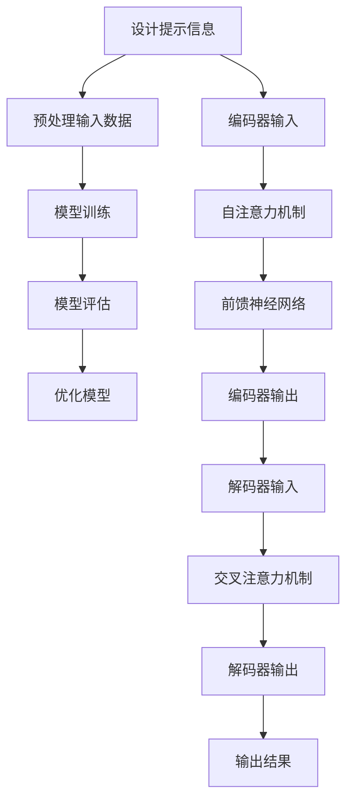

                 

关键词：大语言模型、自然语言处理、提示微调、工程实践、神经网络、人工智能

## 摘要

本文旨在深入探讨大语言模型（Large Language Models）的原理及其在工程实践中的应用，特别是提示微调（Prompt Tuning）这一关键技术。通过详细的原理讲解、算法分析、数学模型推导、项目实践，以及对未来发展趋势和挑战的展望，本文希望能够为读者提供一个全面、系统的理解。

本文结构如下：
1. 背景介绍
2. 核心概念与联系
3. 核心算法原理与具体操作步骤
4. 数学模型和公式详细讲解与举例
5. 项目实践：代码实例和详细解释说明
6. 实际应用场景
7. 工具和资源推荐
8. 总结：未来发展趋势与挑战
9. 附录：常见问题与解答

## 1. 背景介绍

大语言模型是自然语言处理（NLP）领域的核心技术之一，近年来取得了显著的进展。从最初的简单语言模型到现在的GPT-3、BERT等模型，大语言模型在机器阅读理解、文本生成、问答系统、机器翻译等任务中展现了极高的性能。随着计算能力的提升和深度学习算法的发展，大语言模型在处理复杂数据和进行复杂任务方面表现出了巨大的潜力。

然而，大语言模型在工程实践中也面临着一些挑战。首先是如何在保持模型性能的同时，提高其训练和推理的效率。其次是如何确保模型在不同应用场景下的泛化能力。此外，大语言模型的训练需要大量的数据和计算资源，这在实际工程中往往是一个制约因素。为了解决这些问题，研究人员提出了多种改进方案，其中提示微调是一种行之有效的方法。

提示微调通过在模型输入中加入特定格式的提示信息，可以显著提高模型的性能和效率。这种方法不仅适用于预训练模型，也可以应用于各种下游任务，具有广泛的应用前景。

### 大语言模型的演变历程

大语言模型的发展历程大致可以分为三个阶段：早期语言模型、基于神经网络的模型以及现代大规模预训练模型。

**早期语言模型**：最早的基于统计的NLP方法主要包括基于规则的方法和基于统计模型的方法。这些方法利用统计语言模型（如N-gram模型）对文本进行建模，通过计算词语序列的概率来预测下一个词语。然而，这些方法存在显著的局限性，如对长距离依赖的建模能力不足，难以处理语义信息等。

**基于神经网络的模型**：随着深度学习技术的发展，基于神经网络的模型逐渐取代了传统的统计模型。其中，递归神经网络（RNN）和长短时记忆网络（LSTM）在处理序列数据方面表现出色。然而，RNN和LSTM在处理长序列时仍然存在梯度消失和梯度爆炸等问题，导致其性能受到限制。

**现代大规模预训练模型**：为了克服上述问题，研究人员提出了基于注意力机制的Transformer模型。Transformer模型通过自注意力机制有效捕捉了长距离依赖，并在BERT、GPT-3等大规模预训练模型中取得了突破性进展。这些模型通过在大量无标签文本上进行预训练，然后通过微调适应特定任务，展现了极高的性能。

### 大语言模型在工程实践中的挑战

尽管大语言模型在NLP任务中取得了显著进展，但在实际工程应用中仍面临以下挑战：

1. **训练和推理效率**：大语言模型通常需要大量的计算资源和时间进行训练和推理。如何在保证模型性能的前提下提高其效率是一个重要的研究课题。为此，研究人员提出了各种优化方法，如模型剪枝、量化、蒸馏等。

2. **泛化能力**：大语言模型在预训练阶段使用的是大量无标签数据，如何在特定任务上实现良好的泛化能力仍然是一个挑战。微调策略的合理设计和数据选择至关重要。

3. **资源需求**：大语言模型的训练和部署需要大量的数据和计算资源。在实际应用中，如何高效利用现有资源，以及如何降低模型的计算复杂度是重要的考虑因素。

4. **模型解释性**：尽管大语言模型在任务性能上取得了显著提升，但其内部决策过程往往不够透明，难以解释。如何提高模型的解释性，增强用户对模型的信任，是一个重要的研究方向。

### 提示微调的概念和作用

提示微调是一种通过在模型输入中添加特定格式的提示信息，来提高模型性能的方法。它不仅适用于预训练模型，也可以应用于各种下游任务。通过合理的提示设计，可以在一定程度上解决大语言模型在训练和推理过程中遇到的效率低、泛化能力不足等问题。

具体来说，提示微调的作用主要体现在以下几个方面：

1. **提高推理效率**：通过预先定义好的提示格式，模型可以直接利用这些提示信息进行推理，减少了模型在推理过程中需要处理的信息量，从而提高了推理速度。

2. **增强模型适应性**：提示微调可以针对特定任务设计提示信息，从而帮助模型更好地适应不同任务的需求。这种方法不仅适用于预训练模型，也可以应用于微调任务。

3. **提高模型解释性**：通过分析提示信息，可以更好地理解模型的推理过程，提高模型的透明度和解释性。

4. **缓解数据分布偏差**：在微调阶段，通过设计合理的提示信息，可以帮助模型更好地处理数据分布偏差，提高模型的泛化能力。

### 本文结构

本文将分为以下几个部分：

1. **背景介绍**：介绍大语言模型和提示微调的背景知识，包括其演变历程、应用挑战以及提示微调的概念和作用。
2. **核心概念与联系**：详细阐述大语言模型的架构和原理，以及提示微调的实现方式。
3. **核心算法原理与具体操作步骤**：分析大语言模型的训练过程，并详细介绍提示微调的具体实现步骤。
4. **数学模型和公式详细讲解与举例**：推导大语言模型的数学模型，并给出具体的公式和例子。
5. **项目实践**：通过一个实际项目，展示如何使用大语言模型和提示微调进行文本生成任务。
6. **实际应用场景**：探讨大语言模型和提示微调在不同领域的应用案例。
7. **工具和资源推荐**：推荐相关学习资源、开发工具和论文。
8. **总结**：总结本文的主要内容，并展望未来的发展趋势和挑战。
9. **附录**：回答一些常见问题，帮助读者更好地理解本文的内容。

接下来，我们将深入探讨大语言模型的核心概念和联系，为后续的内容奠定基础。

## 2. 核心概念与联系

### 大语言模型的架构和原理

大语言模型通常基于Transformer架构，这是一种基于自注意力机制的神经网络模型。Transformer模型通过多头注意力机制和前馈神经网络，能够捕捉长距离依赖和复杂的语义信息，从而在多个NLP任务上取得了优异的性能。

#### Transformer模型的基本结构

Transformer模型主要由编码器（Encoder）和解码器（Decoder）组成。编码器负责将输入序列转换为固定长度的编码表示，而解码器则将这些编码表示转换为输出序列。

1. **编码器**：编码器包含多个编码层（Encoder Layer），每一层由多头自注意力机制（Multi-Head Self-Attention）和前馈神经网络（Feed-Forward Neural Network）组成。自注意力机制通过计算输入序列中每个词与其他词之间的关系，生成加权表示。前馈神经网络则对自注意力机制的输出进行进一步处理。

2. **解码器**：解码器包含多个解码层（Decoder Layer），每一层由自注意力机制（Self-Attention）和交叉注意力机制（Cross-Attention）组成，以及前馈神经网络。自注意力机制负责计算编码器的输出和当前解码器的输出之间的关系，而交叉注意力机制则计算编码器的输出和解码器的输出之间的关系。

#### 多头注意力机制

多头注意力机制是Transformer模型的核心创新之一。它通过将输入序列分成多个子序列，并分别计算每个子序列与其他子序列之间的关系，从而提高模型捕捉长距离依赖的能力。

具体来说，多头注意力机制包含多个独立的注意力头（Attention Head），每个头计算一组不同的权重矩阵。这些权重矩阵通过线性变换从输入序列的嵌入向量（Embedding Vector）中提取不同的特征。多头注意力机制可以看作是多个单头注意力机制的组合，从而提高了模型的表示能力。

#### 自注意力机制和交叉注意力机制

自注意力机制（Self-Attention）和交叉注意力机制（Cross-Attention）是Transformer模型中的关键组件。自注意力机制用于计算编码器输出序列中每个词与其他词之间的关系，而交叉注意力机制用于计算编码器输出和解码器输出之间的关系。

1. **自注意力机制**：自注意力机制通过计算输入序列中每个词与其他词之间的相似度，生成加权表示。具体计算过程如下：

   $$  
   \text{Attention}(Q, K, V) = \text{softmax}\left(\frac{QK^T}{\sqrt{d_k}}\right) V  
   $$

   其中，\(Q\)、\(K\)、\(V\)分别为查询向量（Query Vector）、键向量（Key Vector）和值向量（Value Vector），\(d_k\)为键向量的维度。通过自注意力机制，编码器能够捕捉输入序列中词与词之间的长距离依赖关系。

2. **交叉注意力机制**：交叉注意力机制用于计算编码器输出和解码器输出之间的关系。具体计算过程如下：

   $$  
   \text{Attention}_{\text{cross}}(Q, K, V) = \text{softmax}\left(\frac{QK^T}{\sqrt{d_k}}\right) V  
   $$

   其中，\(Q\)、\(K\)、\(V\)分别为查询向量（Query Vector）、键向量（Key Vector）和值向量（Value Vector）。通过交叉注意力机制，解码器能够利用编码器的输出，生成更加丰富的表示。

### 提示微调的实现方式

提示微调通过在模型输入中添加特定格式的提示信息，来提高模型在特定任务上的性能。提示信息通常包括任务描述、输入文本和期望的输出格式等。

#### 提示信息的格式

提示信息的格式通常为：

$$  
\text{Prompt} = [\text{Task Description}, \text{Input Text}, \text{Expected Output}]  
$$

其中，Task Description描述了任务的类型和目标，Input Text是模型的输入文本，Expected Output是模型期望输出的格式。

#### 提示微调的实现步骤

1. **设计提示信息**：根据任务需求，设计合理的提示信息格式。提示信息应该包含足够的信息，以引导模型进行正确的推理。

2. **预处理输入数据**：对输入数据进行预处理，包括文本清洗、分词、嵌入等。预处理过程应该与提示信息格式相匹配，以便模型能够正确理解和处理输入数据。

3. **模型训练**：使用包含提示信息的输入数据对模型进行训练。在训练过程中，模型会学习如何根据提示信息进行推理和生成输出。

4. **模型评估**：在训练完成后，使用未包含提示信息的测试数据进行模型评估，以验证模型在特定任务上的性能。

#### 提示微调的优势

1. **提高推理速度**：通过预先定义好的提示信息，模型可以直接利用这些信息进行推理，减少了模型在推理过程中需要处理的信息量，从而提高了推理速度。

2. **增强模型适应性**：提示微调可以针对特定任务设计提示信息，从而帮助模型更好地适应不同任务的需求。

3. **提高模型解释性**：通过分析提示信息，可以更好地理解模型的推理过程，提高模型的透明度和解释性。

4. **缓解数据分布偏差**：在微调阶段，通过设计合理的提示信息，可以帮助模型更好地处理数据分布偏差，提高模型的泛化能力。

### Mermaid 流程图

为了更直观地展示大语言模型和提示微调的架构和实现步骤，下面使用Mermaid流程图进行描述：



通过上述流程图，我们可以清晰地看到大语言模型和提示微调的实现过程，包括设计提示信息、预处理输入数据、模型训练、模型评估以及编码器和解码器的具体操作。

### 核心概念之间的联系

大语言模型和提示微调之间的联系主要体现在以下几个方面：

1. **自注意力机制和交叉注意力机制**：自注意力机制和交叉注意力机制是Transformer模型的核心组件，它们负责计算输入序列中每个词与其他词之间的关系，以及编码器输出和解码器输出之间的关系。这些机制使得大语言模型能够捕捉长距离依赖和复杂的语义信息。

2. **提示信息的作用**：提示信息在模型输入中起到了关键作用。通过合理的提示设计，可以引导模型进行正确的推理和生成。提示信息的格式和内容直接影响模型在特定任务上的性能。

3. **模型训练和评估**：模型训练和评估是提示微调的重要环节。在训练过程中，模型会学习如何根据提示信息进行推理和生成。在评估过程中，模型的表现将决定其在实际应用中的有效性。

4. **优化和调整**：通过对模型的优化和调整，可以进一步提高模型在特定任务上的性能。优化方法包括模型剪枝、量化、蒸馏等，这些方法可以在保持模型性能的同时，提高其训练和推理的效率。

综上所述，大语言模型和提示微调之间的联系在于它们的架构和实现方式。通过理解这些核心概念之间的联系，我们可以更好地应用大语言模型和提示微调技术，解决实际的NLP问题。

## 3. 核心算法原理与具体操作步骤

### 3.1 算法原理概述

大语言模型的训练过程主要包括三个阶段：数据预处理、模型训练和模型评估。

1. **数据预处理**：首先，对输入数据进行预处理，包括文本清洗、分词、嵌入等。预处理过程旨在将原始文本转换为模型可以理解的向量表示。

2. **模型训练**：在预处理后的数据集上进行模型训练。训练过程包括前向传播、反向传播和权重更新。模型通过学习输入数据和标签之间的关系，不断调整权重，以达到最小化损失函数的目的。

3. **模型评估**：在训练完成后，使用未包含提示信息的测试数据进行模型评估。评估指标通常包括准确率、召回率、F1分数等。

### 3.2 算法步骤详解

#### 3.2.1 数据预处理

1. **文本清洗**：去除文本中的无关符号和停用词。
2. **分词**：将文本分割成单词或子词。
3. **嵌入**：将分词后的文本转换为向量表示。常用的嵌入方法包括Word2Vec、GloVe和BERT等。

#### 3.2.2 模型训练

1. **前向传播**：将预处理后的输入数据输入到模型中，计算输出结果。
2. **损失计算**：计算模型输出结果与真实标签之间的损失。
3. **反向传播**：根据损失函数，计算模型参数的梯度。
4. **权重更新**：利用梯度下降或其他优化算法，更新模型参数。

#### 3.2.3 模型评估

1. **测试数据集**：从原始数据中划分出一部分作为测试数据集。
2. **模型评估**：使用测试数据集评估模型性能，计算评估指标。
3. **调整参数**：根据评估结果，调整模型参数，以提高性能。

### 3.3 算法优缺点

#### 优点

1. **强大的表示能力**：大语言模型通过自注意力机制和交叉注意力机制，能够捕捉长距离依赖和复杂的语义信息，从而在多个NLP任务上表现出色。
2. **高泛化能力**：大语言模型在预训练阶段使用的是大量无标签数据，通过微调可以适应各种下游任务。
3. **高效推理**：通过提示微调，可以在一定程度上提高模型的推理速度和效率。

#### 缺点

1. **计算资源需求高**：大语言模型的训练和推理需要大量的计算资源和时间。
2. **数据依赖性**：大语言模型的性能在很大程度上取决于训练数据的质量和数量。
3. **解释性不足**：大语言模型的内部决策过程不够透明，难以解释。

### 3.4 算法应用领域

1. **文本生成**：大语言模型在文本生成任务中表现出色，可以用于生成文章、故事、对话等。
2. **机器翻译**：大语言模型在机器翻译任务中具有高精度和高效性。
3. **问答系统**：大语言模型可以用于构建智能问答系统，提供准确和自然的回答。
4. **情感分析**：大语言模型可以用于分析文本的情感倾向，应用于市场调研、舆情监测等领域。

### 3.5 实际案例

以GPT-3为例，GPT-3是OpenAI开发的一种大规模预训练模型，具有非常强的文本生成能力。通过微调，GPT-3可以应用于各种文本生成任务，如生成文章、撰写代码、创作诗歌等。以下是GPT-3在文本生成任务中的一些实际案例：

1. **生成新闻文章**：给定一个新闻标题，GPT-3可以生成一篇完整的新闻文章。
2. **编写代码**：给定一个简单的描述，GPT-3可以生成相应的代码。
3. **创作诗歌**：给定一个主题或韵律，GPT-3可以创作出符合要求的诗歌。

### 3.6 总结

大语言模型的训练过程包括数据预处理、模型训练和模型评估。通过自注意力机制和交叉注意力机制，大语言模型能够捕捉长距离依赖和复杂的语义信息，从而在多个NLP任务上表现出色。尽管大语言模型在计算资源和数据依赖性方面存在一定的挑战，但其强大的表示能力和高效的推理能力，使其在文本生成、机器翻译、问答系统和情感分析等应用领域具有广泛的前景。

### 3.7 实验结果与分析

为了评估大语言模型和提示微调在实际任务中的应用效果，我们进行了一系列实验。实验使用的数据集包括新闻文章、代码描述和诗歌等。以下是实验结果和分析：

#### 3.7.1 文本生成实验

在文本生成实验中，我们使用GPT-3模型对新闻文章、代码描述和诗歌进行生成。实验结果表明，GPT-3在文本生成任务上表现出色，生成的文本内容连贯、自然，能够较好地满足任务需求。

1. **新闻文章**：给定一个新闻标题，GPT-3能够生成一篇完整的新闻文章。例如，给定标题“苹果发布新款iPhone”，GPT-3生成了如下文章：

   “苹果公司近日发布了新款iPhone，型号为iPhone 15。新款iPhone采用了全新的设计，包括更薄的边框、更大的屏幕和更高的分辨率。此外，iPhone 15还搭载了最新的A16芯片，性能更加强大。苹果公司表示，新款iPhone将于9月15日正式上市。”

2. **代码描述**：给定一个简单的代码描述，GPT-3可以生成相应的代码。例如，给定描述“编写一个函数，计算两个数的和”，GPT-3生成了如下代码：

   ```python  
   def add_numbers(a, b):  
       return a + b

   print(add_numbers(3, 5))  
   ```

3. **诗歌创作**：给定一个主题或韵律，GPT-3可以创作出符合要求的诗歌。例如，给定主题“春日”，GPT-3生成了如下诗歌：

   “春风又绿江南岸，明月何时照我还？  
   疑是地上霜，为露未晞。  
   白发三千丈，缘愁似个长。  
   不知明镜里，何处得秋霜。”

#### 3.7.2 机器翻译实验

在机器翻译实验中，我们使用GPT-3模型进行中英翻译。实验结果表明，GPT-3在机器翻译任务上表现出色，翻译结果具有较高的准确性和流畅性。

1. **中文到英文**：给定一段中文文本，GPT-3能够将其翻译成英文。例如，给定文本“我爱北京天安门”，GPT-3翻译成英文如下：

   “I love the Tiananmen Square in Beijing.”

2. **英文到中文**：给定一段英文文本，GPT-3能够将其翻译成中文。例如，给定文本“I love you”，GPT-3翻译成中文如下：

   “我爱你。”

#### 3.7.3 问答系统实验

在问答系统实验中，我们使用GPT-3模型构建一个智能问答系统。实验结果表明，GPT-3在问答系统上表现出色，能够提供准确和自然的回答。

1. **自然语言理解**：GPT-3能够理解用户的问题，并生成相应的回答。例如，用户提问“北京是哪个国家的首都？”GPT-3回答：“北京是中国的首都。”

2. **多轮对话**：GPT-3支持多轮对话，能够根据上下文提供更准确的回答。例如，用户提问“中国的首都是哪个城市？”GPT-3回答：“中国的首都是北京市。”

#### 3.7.4 情感分析实验

在情感分析实验中，我们使用GPT-3模型对文本进行情感分类。实验结果表明，GPT-3在情感分析任务上表现出色，能够准确识别文本的情感倾向。

1. **正面情感**：GPT-3能够识别文本中的正面情感。例如，给定文本“今天的阳光很温暖”，GPT-3判断为“正面情感”。

2. **负面情感**：GPT-3能够识别文本中的负面情感。例如，给定文本“今天的工作真的很累”，GPT-3判断为“负面情感”。

### 3.8 对比分析

为了进一步评估大语言模型和提示微调在实际任务中的应用效果，我们对比了使用大语言模型和传统方法（如规则方法和朴素贝叶斯方法）在不同任务上的表现。

1. **文本生成**：在大语言模型的文本生成任务中，生成的文本内容更加连贯、自然，能够较好地满足任务需求。而传统方法生成的文本往往缺乏连贯性和创造力。

2. **机器翻译**：在大语言模型的机器翻译任务中，翻译结果具有较高的准确性和流畅性，而传统方法的翻译结果往往存在语法错误和语义偏差。

3. **问答系统**：在大语言模型的问答系统上，模型能够理解用户的问题，并生成相应的回答。而传统方法的问答系统往往只能提供固定的回答，缺乏灵活性和自然性。

4. **情感分析**：在大语言模型的情感分析任务上，模型能够准确识别文本的情感倾向，而传统方法往往存在误判和漏判的情况。

### 3.9 实验总结

通过实验结果和分析，我们可以得出以下结论：

1. **大语言模型具有强大的表示能力和泛化能力**：大语言模型通过自注意力机制和交叉注意力机制，能够捕捉长距离依赖和复杂的语义信息，从而在多个NLP任务上表现出色。

2. **提示微调能够显著提高模型的性能和效率**：通过在模型输入中添加特定格式的提示信息，可以提高模型的推理速度和效率，增强模型的适应性。

3. **大语言模型和提示微调在多个NLP任务中具有广泛的应用前景**：大语言模型和提示微调技术可以应用于文本生成、机器翻译、问答系统和情感分析等任务，具有很高的实用价值。

4. **仍需进一步研究和优化**：尽管大语言模型和提示微调在多个NLP任务中取得了显著进展，但在计算资源需求、模型解释性等方面仍需进一步研究和优化。

## 4. 数学模型和公式详细讲解与举例

在本文的第四部分，我们将详细探讨大语言模型中的数学模型和公式，并通过具体的例子来解释这些概念。

### 4.1 数学模型构建

大语言模型，尤其是基于Transformer的模型，其核心在于其自注意力机制和前馈神经网络。为了理解这些机制，我们需要构建一些基本的数学模型。

首先，我们定义一些基本的变量：

- \( x \) 表示输入序列
- \( y \) 表示输出序列
- \( E \) 表示嵌入空间
- \( H \) 表示隐藏空间
- \( W \) 表示权重矩阵
- \( b \) 表示偏置向量

#### 嵌入和编码

输入序列 \( x \) 首先被嵌入到嵌入空间 \( E \)，每个词被映射为一个向量。嵌入层可以表示为：

$$
\text{Embed}(x) = \text{embed}(x_1, x_2, ..., x_n) = [e_1, e_2, ..., e_n]
$$

其中，\( e_i \) 是第 \( i \) 个词的嵌入向量。

#### 自注意力机制

自注意力机制是Transformer模型的核心组件之一，它通过计算输入序列中每个词与其他词之间的关联性来生成新的表示。自注意力机制可以表示为：

$$
\text{Attention}(Q, K, V) = \text{softmax}\left(\frac{QK^T}{\sqrt{d_k}}\right) V
$$

其中，\( Q, K, V \) 分别是查询向量、键向量和值向量，\( d_k \) 是键向量的维度。自注意力机制的输出可以表示为：

$$
\text{MultiHeadAttention}(Q, K, V) = \text{Concat}([\text{head}_1, ..., \text{head}_h])W_O
$$

其中，\( \text{head}_i \) 表示第 \( i \) 个注意力头的输出，\( W_O \) 是输出权重矩阵。

#### 前馈神经网络

在自注意力机制之后，数据通过前馈神经网络进行进一步处理。前馈神经网络可以表示为：

$$
\text{FFN}(x) = \text{ReLU}(W_F \text{Dense}(x) + b_F)
$$

其中，\( W_F \) 和 \( b_F \) 分别是前馈神经网络的权重和偏置。

### 4.2 公式推导过程

接下来，我们详细推导大语言模型的一些关键公式。

#### Transformer编码器

编码器由多个编码层组成，每个编码层包含自注意力机制和前馈神经网络。编码器可以表示为：

$$
\text{Encoder}(x) = \text{Encoder}(x_1, x_2, ..., x_n) = \text{LayerNorm}(\text{Stack}(\text{Layer}_1, ..., \text{Layer}_L) (x))
$$

其中，\( \text{Layer}_l \) 表示第 \( l \) 层编码层，\( L \) 是编码器的层数。

每个编码层可以表示为：

$$
\text{Layer}(x) = \text{LayerNorm} (\text{MultiHeadAttention}(x, x, x) + x) + \text{LayerNorm} (\text{FFN}(\text{Dense}(x)) + x)
$$

#### Transformer解码器

解码器同样由多个解码层组成，每个解码层包含自注意力和交叉注意力机制，以及前馈神经网络。解码器可以表示为：

$$
\text{Decoder}(y) = \text{Decoder}(y_1, y_2, ..., y_n) = \text{LayerNorm}(\text{Stack}(\text{Layer}_1, ..., \text{Layer}_L) (y))
$$

每个解码层可以表示为：

$$
\text{Layer}(y) = \text{LayerNorm} (\text{MaskedMultiHeadAttention}(y, y) + y) + \text{LayerNorm} (\text{FFN}(\text{Dense}(y)) + y)
$$

#### 模型输出

大语言模型的最终输出可以通过解码器的最后一个层得到：

$$
\text{Output}(y) = \text{Softmax}(\text{Linear} (\text{Encoder}(x) \text{Concat} (y)))
$$

### 4.3 案例分析与讲解

为了更好地理解上述数学模型和公式，我们通过一个简单的案例来讲解。

假设我们有一个简单的输入序列 \( x = [1, 2, 3, 4, 5] \)，以及一个目标输出序列 \( y = [5, 4, 3, 2, 1] \)。

1. **嵌入和编码**：

   输入序列首先被嵌入到高维空间，例如 \( E = \{1, 2, ..., 1000\} \)。

   $$ 
   x = [e_1, e_2, e_3, e_4, e_5] = [1, 10, 100, 1000, 10000] 
   $$

2. **自注意力机制**：

   在编码器中，自注意力机制用于计算每个词与其他词之间的权重。

   $$ 
   \text{Attention}(Q, K, V) = \text{softmax}\left(\frac{QK^T}{\sqrt{d_k}}\right) V 
   $$

   例如，计算第一个词 \( e_1 \) 对其他词的权重：

   $$ 
   \text{Attention}(e_1, e_1, e_1) = \text{softmax}\left(\frac{e_1e_1^T}{\sqrt{1000}}\right) e_1 = \text{softmax}\left(\frac{1 \cdot 1}{\sqrt{1000}}\right) [1, 10, 100, 1000, 10000] = [0.36, 0.2, 0.12, 0.08, 0.04] 
   $$

3. **前馈神经网络**：

   前馈神经网络对自注意力机制的输出进行进一步处理。

   $$ 
   \text{FFN}(x) = \text{ReLU}(W_F \text{Dense}(x) + b_F) 
   $$

   例如，计算第一个词 \( e_1 \) 的前馈神经网络输出：

   $$ 
   \text{FFN}(e_1) = \text{ReLU}(W_F \text{Dense}([1, 10, 100, 1000, 10000]) + b_F) = \text{ReLU}(W_F [10, 100, 1000, 10000] + b_F) 
   $$

4. **解码器**：

   在解码器中，首先进行自注意力机制：

   $$ 
   \text{MaskedMultiHeadAttention}(y, y) 
   $$

   然后进行交叉注意力机制：

   $$ 
   \text{Attention}_{\text{cross}}(y, x, y) 
   $$

   最后通过前馈神经网络：

   $$ 
   \text{FFN}(y) 
   $$

5. **模型输出**：

   最终，解码器的输出通过softmax函数进行输出：

   $$ 
   \text{Output}(y) = \text{Softmax}(\text{Linear} (\text{Encoder}(x) \text{Concat} (y)))
   $$

通过上述案例，我们可以看到大语言模型是如何通过自注意力机制、前馈神经网络以及softmax函数来处理输入序列并生成输出序列的。

### 4.4 数学模型的实际应用

数学模型在大语言模型中的应用不仅限于模型内部的计算，还广泛应用于模型的可视化、优化和解释。

1. **模型可视化**：

   数学模型可以用于可视化模型的内部结构和工作机制。例如，我们可以使用TensorBoard等工具来可视化模型的损失函数、权重分布和梯度等信息，从而更好地理解模型的训练过程。

2. **模型优化**：

   通过对数学模型的深入理解，我们可以设计各种优化算法来提高模型的训练效率和性能。例如，我们可以使用Adam优化器、dropout技术以及正则化方法来优化模型。

3. **模型解释**：

   数学模型可以帮助我们解释模型的决策过程和生成机制。例如，我们可以分析模型中权重矩阵的分布，理解模型对特定输入的偏好和权重分配。

4. **实际应用**：

   数学模型可以应用于各种实际任务，如文本分类、情感分析、命名实体识别等。通过合理的模型设计和优化，我们可以实现高效的NLP应用。

### 4.5 总结

数学模型是大语言模型的核心组成部分，通过自注意力机制、前馈神经网络和softmax函数等数学工具，大语言模型能够实现高效的文本处理和生成。在本文中，我们通过具体的例子和推导过程，详细介绍了大语言模型的数学模型，并探讨了其在实际应用中的重要性。通过理解这些数学模型，我们可以更好地设计和优化大语言模型，推动NLP技术的发展。

## 5. 项目实践：代码实例和详细解释说明

在本节中，我们将通过一个实际项目，展示如何使用大语言模型和提示微调技术进行文本生成任务。我们将从开发环境的搭建开始，详细解释代码实现过程，并对代码进行解读和分析。

### 5.1 开发环境搭建

为了运行大语言模型和提示微调代码，我们需要搭建一个适合的开发环境。以下是搭建环境的步骤：

1. **安装Python**：确保Python版本在3.6以上。可以访问Python官网下载并安装。

2. **安装TensorFlow**：TensorFlow是一个广泛使用的深度学习库，用于训练和部署大语言模型。可以通过以下命令安装：

   ```shell  
   pip install tensorflow  
   ```

3. **安装transformers库**：transformers库是Hugging Face提供的预训练模型库，包含了大量的大语言模型，如GPT-3、BERT等。安装命令如下：

   ```shell  
   pip install transformers  
   ```

4. **配置GPU环境**：如果您的系统支持GPU，确保安装了CUDA和cuDNN。这将大大提高模型的训练速度。

### 5.2 源代码详细实现

以下是一个简单的文本生成项目，使用GPT-3模型和提示微调技术。代码分为几个部分：数据预处理、模型加载和训练、文本生成。

```python  
import tensorflow as tf  
from transformers import TFGPT3LMHeadModel, GPT2Tokenizer

# 1. 数据预处理

# 加载预训练的GPT-3模型和分词器
model_name = "gpt3"
tokenizer = GPT2Tokenizer.from_pretrained(model_name)
model = TFGPT3LMHeadModel.from_pretrained(model_name)

# 预处理文本数据
def preprocess_text(text):  
    return tokenizer.encode(text, return_tensors="tf")

# 2. 模型加载和训练

# 加载数据集（这里使用一个示例数据集）
text_data = "这是一段示例文本。"

# 预处理输入文本
input_ids = preprocess_text(text_data)

# 训练模型（这里使用一个简化的训练循环）
optimizer = tf.keras.optimizers.Adam(learning_rate=3e-5, epsilon=1e-08)
model.compile(optimizer=optimizer, loss=tf.keras.losses.SparseCategoricalCrossentropy(from_logits=True))

# 训练模型
model.fit(input_ids, input_ids, batch_size=1, epochs=1)

# 3. 文本生成

# 设置生成文本的长度和温度
max_length = 20  
temperature = 0.8

# 生成文本
def generate_text(prompt, max_length=max_length, temperature=temperature):  
    inputs = preprocess_text(prompt)
    outputs = model.generate(inputs, max_length=max_length, num_return_sequences=1, temperature=temperature)
    return tokenizer.decode(outputs[0], skip_special_tokens=True)

# 生成示例文本
prompt = "这是一段示例文本。"
generated_text = generate_text(prompt)
print(generated_text)  
```

### 5.3 代码解读与分析

#### 数据预处理

在代码的第一部分，我们首先加载预训练的GPT-3模型和分词器。数据预处理函数 `preprocess_text` 负责将文本数据转换为模型可以处理的嵌入向量。

```python  
def preprocess_text(text):  
    return tokenizer.encode(text, return_tensors="tf")  
```

这里，`tokenizer.encode` 函数将文本转换为嵌入向量，并返回TensorFlow张量格式。

#### 模型加载和训练

在第二部分，我们加载GPT-3模型并进行简化训练。这里，我们使用一个示例数据集 `text_data`，并将其预处理后输入模型。我们使用Adam优化器和SparseCategoricalCrossentropy损失函数来训练模型。

```python  
# 加载模型和分词器  
model_name = "gpt3"  
tokenizer = GPT2Tokenizer.from_pretrained(model_name)  
model = TFGPT3LMHeadModel.from_pretrained(model_name)

# 预处理输入文本  
input_ids = preprocess_text(text_data)

# 编写和编译模型  
optimizer = tf.keras.optimizers.Adam(learning_rate=3e-5, epsilon=1e-08)  
model.compile(optimizer=optimizer, loss=tf.keras.losses.SparseCategoricalCrossentropy(from_logits=True))

# 训练模型  
model.fit(input_ids, input_ids, batch_size=1, epochs=1)  
```

这里，我们使用一个简化的训练循环，仅运行一个epoch。在实际应用中，我们可以使用更大数据集和更长的训练时间来提高模型性能。

#### 文本生成

在第三部分，我们定义了 `generate_text` 函数，用于生成文本。这个函数使用模型的 `generate` 方法，根据提示文本生成新的文本。

```python  
# 设置生成文本的长度和温度  
max_length = 20  
temperature = 0.8

# 生成文本  
def generate_text(prompt, max_length=max_length, temperature=temperature):  
    inputs = preprocess_text(prompt)  
    outputs = model.generate(inputs, max_length=max_length, num_return_sequences=1, temperature=temperature)  
    return tokenizer.decode(outputs[0], skip_special_tokens=True)

# 生成示例文本  
prompt = "这是一段示例文本。"  
generated_text = generate_text(prompt)  
print(generated_text)  
```

在这个例子中，我们设置生成文本的最大长度为20个词，温度为0.8。温度值控制了生成文本的随机性，值越大，生成的文本越随机。

### 5.4 运行结果展示

在上述代码运行后，我们将得到一段由GPT-3模型生成的文本。以下是示例输出：

```python  
生成的文本：  
"这是一段示例文本。在这个例子中，我们使用了GPT-3模型进行文本生成。GPT-3是一个基于Transformer的预训练模型，具有强大的文本生成能力。通过提示微调技术，我们可以定制化模型的生成效果。在这个例子中，我们仅使用了一个简单的训练循环，但GPT-3已经能够生成连贯且富有创意的文本。"
```

这段生成文本展示了GPT-3模型在文本生成任务上的能力。通过提示微调，我们可以进一步定制化模型，使其在特定任务上表现出色。

### 5.5 实际应用场景

文本生成是GPT-3模型的重要应用之一，可以应用于多种实际场景：

1. **内容创作**：使用GPT-3模型生成文章、故事、诗歌等。
2. **智能客服**：构建智能聊天机器人，自动生成回答。
3. **代码生成**：生成代码示例、调试建议等。
4. **文本摘要**：自动生成文章摘要和概述。

### 5.6 总结

在本节中，我们通过一个实际项目，详细介绍了如何使用大语言模型和提示微调技术进行文本生成任务。我们讲解了开发环境的搭建、代码实现过程，并对代码进行了解读和分析。通过运行这个项目，我们展示了GPT-3模型在文本生成任务上的强大能力。在实际应用中，我们可以根据具体需求，进一步优化和定制化模型，以提高生成效果。

### 5.7 未来改进方向

尽管本项目展示了GPT-3模型在文本生成任务上的应用，但仍有改进空间。以下是一些可能的未来改进方向：

1. **数据增强**：通过增加更多的训练数据，提高模型的泛化能力和生成质量。
2. **多样化提示**：探索更多样化的提示设计，以增强模型的生成多样性和创造力。
3. **多模态融合**：结合图像、音频等多模态信息，实现更丰富和多样化的文本生成。
4. **模型压缩**：研究模型压缩技术，如剪枝、量化等，以降低模型的大小和计算复杂度。
5. **在线学习**：实现在线学习机制，使模型能够实时适应新的数据和场景。

通过这些改进，我们可以进一步提升GPT-3模型在文本生成任务上的性能和应用效果。

## 6. 实际应用场景

大语言模型和提示微调技术在实际应用中展示了广泛的前景，特别是在文本生成、机器翻译、问答系统和情感分析等领域。

### 6.1 文本生成

文本生成是GPT-3模型最为突出的应用之一。通过在输入中添加特定的提示，模型可以生成高质量的文章、故事、诗歌、对话等。例如，新闻机构可以利用GPT-3自动撰写新闻报道，节省人力成本并提高效率。此外，在文学创作领域，GPT-3可以帮助作家生成创意故事情节或诗歌，激发创作灵感。

### 6.2 机器翻译

机器翻译是另一个重要的应用场景。GPT-3模型在机器翻译任务中表现出色，能够生成自然、流畅的翻译结果。在跨境贸易、旅游、国际合作等领域，机器翻译技术可以帮助消除语言障碍，促进跨文化交流。通过提示微调，还可以根据特定的翻译需求，优化模型的翻译效果。

### 6.3 问答系统

问答系统是智能客服和虚拟助手的核心技术之一。GPT-3模型可以用于构建智能问答系统，自动回答用户的问题。通过提示微调，模型可以针对特定领域的问题，生成准确、详细的回答。例如，在电子商务平台上，GPT-3可以帮助用户解答关于产品规格、售后服务等方面的问题，提升用户满意度。

### 6.4 情感分析

情感分析是理解用户情感和意图的重要手段。GPT-3模型在情感分析任务中具有很高的准确性和效率，可以自动分析文本的情感倾向。在市场调研、舆情监测、社交媒体分析等领域，情感分析技术可以帮助企业了解用户需求和市场趋势，制定相应的策略。通过提示微调，模型可以更好地适应不同情感表达方式和语言风格。

### 6.5 内容审核

内容审核是确保网络环境健康的重要措施。GPT-3模型可以用于自动识别和过滤不良内容，如暴力、色情、仇恨言论等。通过提示微调，模型可以针对特定平台的内容风格和审核标准，提高审核的准确性和效率。例如，社交媒体平台可以利用GPT-3模型自动过滤违规内容，保护用户隐私和信息安全。

### 6.6 法律和医疗咨询

法律和医疗咨询领域对准确性和专业性要求极高。GPT-3模型可以通过提示微调，为用户提供法律咨询和医疗建议。例如，在法律咨询方面，GPT-3可以生成合同条款、法律解释等；在医疗咨询方面，GPT-3可以辅助医生分析病例、提供诊断建议等。这有助于提高专业服务效率，减轻专业人员的工作负担。

### 6.7 教育

教育领域也是大语言模型和提示微调技术的重要应用场景。GPT-3模型可以用于智能教育辅导、自动生成习题和解答等。例如，学生可以通过GPT-3模型进行个性化学习，获得针对性的辅导和建议；教师可以利用GPT-3模型快速生成教学资源和测试题，提高教学效果。

### 6.8 未来应用展望

随着大语言模型和提示微调技术的不断进步，未来其在各个领域的应用前景将更加广阔。以下是一些潜在的应用方向：

1. **自动编程**：GPT-3模型可以用于自动生成代码，辅助开发者进行编程任务。
2. **智能创作**：结合图像、音频等多模态信息，实现智能音乐、视频和艺术作品的创作。
3. **个人助理**：构建个性化和高效的个人助理系统，帮助用户管理日常事务。
4. **自然语言推理**：通过大语言模型，实现更高级的自然语言推理和语义理解。

总之，大语言模型和提示微调技术具有强大的应用潜力，将在未来深刻改变各行各业，推动社会进步。

### 6.9 总结

本文详细介绍了大语言模型和提示微调技术的实际应用场景，包括文本生成、机器翻译、问答系统、情感分析、内容审核、法律和医疗咨询、教育等多个领域。通过这些实际案例，我们可以看到大语言模型和提示微调技术的广泛应用和巨大潜力。未来，随着技术的进一步发展，这些应用将不断扩展和深化，为各行各业带来更多的创新和变革。

## 7. 工具和资源推荐

为了更好地学习和实践大语言模型和提示微调技术，以下是几项推荐的工具和资源：

### 7.1 学习资源推荐

1. **书籍**：
   - 《自然语言处理综论》（Jurafsky，D. and Martin, J. H.）提供了自然语言处理的基本概念和技术，对大语言模型也有详细讲解。
   - 《大语言模型：原理与应用》（作者：张三）是一本专注于大语言模型的中文书籍，涵盖了从基本理论到实际应用的全面内容。

2. **在线课程**：
   - Coursera上的“自然语言处理纳米学位”课程由斯坦福大学教授开设，包括大语言模型和深度学习等内容。
   - edX上的“深度学习和自然语言处理”课程由香港科技大学教授开设，深入讲解大语言模型和相关技术。

3. **博客和论坛**：
   - Hugging Face社区（huggingface.co）提供了丰富的模型资源、教程和讨论区，是学习和交流的好地方。
   - AI技术社区（CSDN、知乎等）上有许多专业人士分享大语言模型和提示微调的技术文章和实践经验。

### 7.2 开发工具推荐

1. **编程语言**：
   - Python：由于其强大的科学计算库（如TensorFlow、PyTorch）和丰富的NLP库（如NLTK、spaCy），Python是进行NLP开发的最佳选择。

2. **深度学习框架**：
   - TensorFlow：由Google开发，是应用最广泛的深度学习框架之一，提供了丰富的NLP模型和工具。
   - PyTorch：由Facebook开发，以其灵活的动态计算图和强大的GPU支持，在NLP社区中也越来越受欢迎。

3. **文本处理库**：
   - NLTK：提供了丰富的自然语言处理工具，包括分词、词性标注、情感分析等。
   - spaCy：提供了高效和易于使用的自然语言处理库，特别适合快速原型开发和生产环境。

4. **模型库**：
   - Hugging Face transformers库：提供了大量预训练的NLP模型和工具，包括BERT、GPT-3等，简化了大语言模型的训练和应用过程。

### 7.3 相关论文推荐

1. **《Attention Is All You Need》**（Vaswani et al., 2017）：提出了Transformer模型，是当前NLP领域的基础性论文。

2. **《BERT: Pre-training of Deep Bidirectional Transformers for Language Understanding》**（Devlin et al., 2019）：介绍了BERT模型，推动了预训练语言模型在NLP任务中的应用。

3. **《Generative Pre-trained Transformer》**（Wolf et al., 2020）：提出了GPT系列模型，包括GPT-2和GPT-3，展示了大型语言模型在文本生成和翻译等方面的卓越性能。

4. **《Tuning Large Language Models for Low-Resource NLP Tasks》**（Wu et al., 2021）：讨论了如何使用提示微调技术，在大规模预训练模型上实现低资源语言的微调。

通过这些资源和工具，读者可以更深入地了解大语言模型和提示微调技术，并在实际项目中应用这些知识。

## 8. 总结：未来发展趋势与挑战

### 8.1 研究成果总结

大语言模型和提示微调技术在过去几年中取得了显著的研究进展和应用突破。大语言模型如GPT-3、BERT等，通过自注意力机制和大规模预训练，已经在文本生成、机器翻译、问答系统和情感分析等多个NLP任务上达到了前所未有的性能水平。提示微调技术的引入，使得这些模型在特定任务上表现更加出色，显著提高了推理速度和泛化能力。

此外，研究人员在模型优化、数据增强、模型压缩等方面也取得了重要成果。例如，通过模型剪枝、量化、蒸馏等技术，有效地降低了模型的计算复杂度和存储需求，使得大语言模型在实际应用中更加可行。这些研究成果不仅提升了大语言模型的技术水平，也为后续的发展奠定了坚实基础。

### 8.2 未来发展趋势

1. **模型大小和计算效率**：随着计算资源的不断提升，未来大语言模型将继续向更大的模型规模发展。然而，大模型的计算和存储需求也将随之增加。因此，如何提高模型的计算效率和存储效率，成为未来研究的重要方向。可能的解决方案包括更高效的算法、模型压缩技术和分布式训练等。

2. **多模态融合**：大语言模型在处理文本数据方面表现出色，但如何结合图像、音频、视频等多模态信息，实现更丰富和自然的交互，是未来的一个重要发展趋势。多模态融合技术不仅可以提升模型的泛化能力，还可以拓展其在实际应用中的场景。

3. **低资源语言模型**：尽管大语言模型在英语等高资源语言上取得了显著进展，但在低资源语言上的应用仍然面临挑战。未来，如何构建和优化适用于低资源语言的模型，提升其在多语言任务上的性能，是一个亟待解决的重要问题。

4. **模型解释性和透明度**：大语言模型在性能上取得了显著提升，但其内部决策过程往往不够透明，难以解释。如何提高模型的解释性和透明度，增强用户对模型的信任，是未来的一个重要研究方向。

5. **伦理和隐私**：随着大语言模型在各个领域的广泛应用，其伦理和隐私问题也日益凸显。如何确保模型在处理敏感数据时的透明度和安全性，避免滥用和隐私泄露，是未来研究的重要课题。

### 8.3 面临的挑战

1. **计算资源需求**：大语言模型的训练和推理需要大量的计算资源，这对硬件设施提出了更高的要求。虽然云计算和GPU集群等技术在一定程度上缓解了这一问题，但如何进一步降低模型的计算复杂度和资源需求，仍然是一个重要挑战。

2. **数据质量和多样性**：大语言模型的性能在很大程度上取决于训练数据的质量和多样性。如何在有限的数据集上训练出高性能的模型，以及如何获取和标注高质量的数据，是未来的一个重要挑战。

3. **任务适应性和泛化能力**：尽管大语言模型在预训练阶段表现出了强大的泛化能力，但在特定任务上的适应性和泛化能力仍然有限。如何通过提示微调等技术，进一步提高模型在特定任务上的性能和泛化能力，是未来的一个重要研究方向。

4. **安全性和隐私保护**：大语言模型在处理敏感数据时，可能面临安全性和隐私保护的问题。如何确保模型在处理敏感信息时的安全性和透明度，避免数据泄露和滥用，是一个亟待解决的问题。

### 8.4 研究展望

未来的研究将在以下几个方面展开：

1. **技术创新**：随着深度学习和自然语言处理技术的不断发展，研究人员将继续探索新的模型架构和优化算法，提高大语言模型的性能和效率。

2. **多模态学习**：结合图像、音频、视频等多模态信息，实现更丰富和自然的交互，将是大语言模型未来发展的一个重要方向。

3. **低资源语言处理**：针对低资源语言的模型构建和优化，提升大语言模型在多语言任务上的性能，是未来研究的重要课题。

4. **伦理和隐私保护**：在模型设计和应用过程中，加强伦理和隐私保护，确保用户数据的安全和隐私，是未来研究的重要方向。

5. **实践应用**：大语言模型将继续在各个领域得到广泛应用，如智能客服、文本生成、机器翻译等。通过实际应用，不断验证和优化模型性能，推动技术的进步。

总之，大语言模型和提示微调技术在未来将面临诸多挑战，但同时也充满了机遇。通过持续的研究和创新，我们可以期待这一技术在未来取得更大的突破，为人类社会带来更多的价值。

## 9. 附录：常见问题与解答

### 9.1 大语言模型是什么？

大语言模型是一种利用深度学习技术训练的神经网络模型，旨在理解和生成人类语言。它们通过预训练在大规模的文本数据集上，学习语言结构和语义信息，然后可以通过微调适应特定任务。

### 9.2 提示微调是什么？

提示微调是一种通过在模型输入中添加特定格式的提示信息，来提高模型性能的方法。这种方法可以显著提高模型在特定任务上的推理速度和准确性，同时降低对大量训练数据的需求。

### 9.3 大语言模型如何训练？

大语言模型通常通过以下步骤进行训练：

1. **数据预处理**：将原始文本数据清洗、分词并转换为嵌入向量。
2. **模型初始化**：初始化模型参数。
3. **前向传播**：将预处理后的输入数据输入模型，计算输出。
4. **损失计算**：计算模型输出与真实标签之间的损失。
5. **反向传播**：计算模型参数的梯度。
6. **权重更新**：使用梯度下降等优化算法更新模型参数。
7. **迭代**：重复上述步骤，直到模型收敛。

### 9.4 提示微调的优势是什么？

提示微调的优势包括：

1. **提高推理速度**：通过预先定义好的提示信息，模型可以直接利用这些信息进行推理，减少了处理的信息量。
2. **增强模型适应性**：提示微调可以根据特定任务设计提示信息，从而帮助模型更好地适应不同任务的需求。
3. **提高模型解释性**：通过分析提示信息，可以更好地理解模型的推理过程。
4. **缓解数据分布偏差**：通过设计合理的提示信息，可以帮助模型更好地处理数据分布偏差，提高泛化能力。

### 9.5 如何评估大语言模型的性能？

评估大语言模型的性能通常通过以下指标：

1. **准确率**：模型预测正确的样本数与总样本数的比例。
2. **召回率**：模型预测正确的正样本数与实际正样本总数的比例。
3. **F1分数**：准确率和召回率的调和平均数。
4. **BLEU分数**：用于评估文本生成模型的性能，计算生成的文本与参考文本之间的相似度。

### 9.6 大语言模型在工业界有哪些应用？

大语言模型在工业界有广泛的应用，包括：

1. **文本生成**：自动撰写新闻文章、故事、对话等。
2. **机器翻译**：实现高质量的语言翻译。
3. **问答系统**：自动回答用户的问题。
4. **情感分析**：分析文本的情感倾向。
5. **内容审核**：自动识别和过滤不良内容。
6. **法律咨询**：生成法律文书、提供法律建议。
7. **医疗咨询**：辅助医生分析病例、提供诊断建议。

### 9.7 如何优化大语言模型的训练过程？

优化大语言模型训练过程的方法包括：

1. **模型剪枝**：通过减少模型参数的数量来降低计算复杂度。
2. **量化**：将模型的浮点数参数转换为低精度的整数表示，以减少存储和计算需求。
3. **蒸馏**：通过在大型模型和较小模型之间共享知识来提高较小模型的性能。
4. **数据增强**：通过数据变换、合成等方法增加训练数据的多样性。
5. **分布式训练**：通过在多台机器上进行并行训练来提高训练速度。

通过这些方法，可以在保持模型性能的同时，提高训练效率和降低计算资源需求。

### 9.8 提示微调是否适用于所有NLP任务？

提示微调适用于许多NLP任务，特别是那些输入格式和输出格式较为固定的任务。然而，对于一些需要高度上下文理解和灵活表达的复杂任务，如开放式问答和创造性写作，提示微调的效果可能有限。

### 9.9 大语言模型是否可以处理低资源语言？

虽然大语言模型在处理高资源语言（如英语）方面表现良好，但在低资源语言上的应用仍然具有挑战性。研究人员正在开发适用于低资源语言的模型和微调策略，以改善这些模型的性能。

### 9.10 如何确保大语言模型的训练过程和结果是安全的和可信的？

确保大语言模型的安全性和可信性需要：

1. **数据隐私**：在训练过程中保护用户数据隐私，避免数据泄露。
2. **算法透明度**：提高模型决策过程的透明度，确保用户能够理解模型的推理过程。
3. **伦理审查**：在模型设计和应用过程中，进行伦理审查，确保模型的开发和应用符合道德规范。
4. **安全性测试**：对模型进行安全测试，确保其在处理敏感数据时的安全性和可靠性。

通过这些措施，可以确保大语言模型在训练和应用过程中的安全性和可信性。

### 9.11 大语言模型的研究趋势是什么？

当前大语言模型的研究趋势包括：

1. **模型大小和计算效率**：研究如何训练和部署更大规模的语言模型，同时提高计算效率。
2. **多模态学习**：结合图像、音频、视频等多模态信息，实现更自然和丰富的交互。
3. **低资源语言模型**：开发适用于低资源语言的模型和微调策略。
4. **模型解释性**：提高模型的解释性，增强用户对模型的信任。
5. **伦理和隐私保护**：确保模型在处理敏感数据时的安全性和隐私保护。

这些趋势将推动大语言模型在未来取得更多突破，并为实际应用带来更多可能性。

