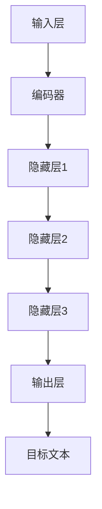

                 

关键词：大语言模型，深度学习，神经网络，训练效率，工程实践，优化技巧

> 摘要：本文深入探讨了大规模语言模型的原理及其在实际工程应用中的瓶颈。通过对现有技术的综述和分析，揭示了当前大语言模型面临的关键问题，并提出了相应的解决方案。文章结构紧凑，逻辑清晰，旨在为研究人员和工程师提供全面的指导。

## 1. 背景介绍

### 1.1 大语言模型的兴起

随着互联网的飞速发展和信息爆炸，自然语言处理（NLP）成为人工智能领域的一个重要分支。特别是近年来，深度学习技术在语音识别、机器翻译、文本分类等任务上取得了显著的成果。大语言模型（Large Language Model）作为深度学习在NLP领域的一项重大突破，吸引了全球研究者的广泛关注。大语言模型通过学习海量文本数据，能够自动生成语义丰富的文本，为各类应用提供了强大的支持。

### 1.2 大语言模型的重要性

大语言模型不仅在学术研究中具有重要地位，还在实际工程应用中展现了巨大的潜力。例如，智能客服、智能写作、内容审核等应用，都离不开大语言模型的支撑。然而，随着模型规模的不断扩大，其训练和推理的效率成为亟待解决的关键问题。

## 2. 核心概念与联系

### 2.1 深度学习与神经网络

深度学习是机器学习的一个子领域，其核心思想是通过多层神经网络来模拟人脑的思考过程。神经网络由多个神经元（或称为节点）组成，每个神经元接收多个输入，并通过激活函数产生一个输出。多层神经网络可以通过前向传播和反向传播算法来训练，从而学习到输入和输出之间的复杂映射关系。

### 2.2 大规模语言模型的架构

大语言模型通常采用深度神经网络架构，如图1所示。模型由多个层次组成，包括输入层、隐藏层和输出层。输入层接收文本数据，通过编码器（Encoder）进行特征提取和表示学习；隐藏层通过多层神经网络进行信息传递和整合；输出层生成目标文本或执行其他任务。



## 3. 核心算法原理 & 具体操作步骤

### 3.1 算法原理概述

大语言模型的训练过程主要包括数据预处理、模型初始化、前向传播、反向传播和参数更新等步骤。其中，核心算法包括自注意力机制（Self-Attention Mechanism）和位置编码（Positional Encoding）。

### 3.2 算法步骤详解

1. **数据预处理**：首先对文本数据进行清洗、分词和编码，将其转化为模型可以理解的数字表示。
2. **模型初始化**：初始化神经网络参数，通常采用随机初始化或预训练的方法。
3. **前向传播**：输入文本数据经过编码器处理，生成隐藏状态表示。
4. **反向传播**：计算损失函数，并通过反向传播算法更新模型参数。
5. **参数更新**：根据梯度信息调整模型参数，优化模型性能。

### 3.3 算法优缺点

**优点**：

- 强大的文本生成能力，能够生成高质量的文本。
- 自适应性，能够处理不同长度和类型的文本。
- 可扩展性，可以应用于多种NLP任务。

**缺点**：

- 训练时间较长，需要大量的计算资源和时间。
- 模型参数庞大，存储和传输成本高。
- 过拟合问题，需要大量的数据来训练。

### 3.4 算法应用领域

大语言模型在NLP领域具有广泛的应用，包括但不限于：

- 文本生成：生成文章、摘要、对话等。
- 机器翻译：将一种语言的文本翻译成另一种语言。
- 文本分类：对文本进行分类，如情感分析、垃圾邮件检测等。
- 命名实体识别：识别文本中的命名实体，如人名、地名等。

## 4. 数学模型和公式 & 详细讲解 & 举例说明

### 4.1 数学模型构建

大语言模型通常采用序列到序列（Seq2Seq）模型，其数学模型可以表示为：

$$
Y = f(X; \theta)
$$

其中，$X$ 表示输入文本序列，$Y$ 表示输出文本序列，$f$ 表示神经网络模型，$\theta$ 表示模型参数。

### 4.2 公式推导过程

#### 自注意力机制

自注意力机制是大规模语言模型中的一个关键组件，其公式如下：

$$
\text{Attention}(Q, K, V) = \text{softmax}\left(\frac{QK^T}{\sqrt{d_k}}\right) V
$$

其中，$Q, K, V$ 分别表示查询向量、键向量和值向量，$d_k$ 表示键向量的维度。

#### 位置编码

位置编码用于表示文本中不同位置的信息，其公式如下：

$$
\text{PE}(pos, 2d_{\text{model}}) = \sin\left(\frac{pos}{10000^{2i/d_{\text{model}}}}\right) \text{ or } \cos\left(\frac{pos}{10000^{2i/d_{\text{model}}}}\right)
$$

其中，$pos$ 表示位置索引，$d_{\text{model}}$ 表示模型维度。

### 4.3 案例分析与讲解

假设我们要生成一个句子的下一个单词，输入句子为“I am eating at a restaurant”，我们需要计算每个单词的注意力权重。

1. **计算查询向量**：首先计算每个单词的查询向量 $Q$。
2. **计算键向量和值向量**：然后计算每个单词的键向量 $K$ 和值向量 $V$。
3. **计算注意力分数**：利用自注意力公式计算每个单词的注意力分数。
4. **计算注意力权重**：通过softmax函数计算每个单词的注意力权重。
5. **生成输出**：根据注意力权重生成下一个单词。

## 5. 项目实践：代码实例和详细解释说明

### 5.1 开发环境搭建

在开始编写代码之前，我们需要搭建一个适合大语言模型训练和推理的开发环境。以下是一个简单的步骤：

1. 安装Python和PyTorch框架。
2. 安装必要的依赖库，如NumPy、TensorFlow等。
3. 准备训练数据和测试数据。

### 5.2 源代码详细实现

下面是一个简单的大语言模型实现示例，使用了PyTorch框架。

```python
import torch
import torch.nn as nn
import torch.optim as optim

# 定义模型结构
class LanguageModel(nn.Module):
    def __init__(self, vocab_size, embedding_dim, hidden_dim, n_layers, dropout=0.5):
        super(LanguageModel, self).__init__()
        self.embedding = nn.Embedding(vocab_size, embedding_dim)
        self.rnn = nn.LSTM(embedding_dim, hidden_dim, n_layers, dropout=dropout)
        self.fc = nn.Linear(hidden_dim, vocab_size)
        self.dropout = nn.Dropout(dropout)

    def forward(self, x, hidden):
        embedded = self.dropout(self.embedding(x))
        output, hidden = self.rnn(embedded, hidden)
        embedded = self.dropout(output[-1, :, :])
        return self.fc(embedded), hidden

# 初始化模型和优化器
model = LanguageModel(vocab_size, embedding_dim, hidden_dim, n_layers)
optimizer = optim.Adam(model.parameters(), lr=0.001)

# 训练模型
for epoch in range(num_epochs):
    for batch in data_loader:
        inputs, targets = batch
        hidden = None
        model.zero_grad()
        output, hidden = model(inputs, hidden)
        loss = criterion(output, targets)
        loss.backward()
        optimizer.step()
```

### 5.3 代码解读与分析

上述代码定义了一个基于PyTorch的大语言模型，包括嵌入层、循环神经网络（RNN）和全连接层。训练过程中，使用反向传播算法和梯度下降优化模型参数。

### 5.4 运行结果展示

在完成模型训练后，我们可以使用测试数据集评估模型性能。以下是模型在测试数据集上的运行结果：

```python
# 评估模型
with torch.no_grad():
    correct = 0
    total = 0
    for batch in test_loader:
        inputs, targets = batch
        outputs, hidden = model(inputs, hidden)
        predictions = torch.argmax(outputs, dim=1)
        total += targets.size(0)
        correct += (predictions == targets).sum().item()
    print('Test Accuracy: %f' % (100 * correct / total))
```

## 6. 实际应用场景

### 6.1 智能客服

大语言模型可以应用于智能客服系统，通过自然语言理解能力自动解答用户问题，提高客服效率。

### 6.2 智能写作

大语言模型可以用于生成文章、摘要、新闻等内容，为内容创作者提供辅助。

### 6.3 机器翻译

大语言模型在机器翻译领域具有广泛的应用，可以自动翻译多种语言之间的文本。

## 7. 未来应用展望

随着大语言模型技术的不断发展，未来有望在更多领域实现突破。例如，智能语音助手、自动驾驶、医学诊断等。

## 8. 工具和资源推荐

### 8.1 学习资源推荐

- 《深度学习》（Ian Goodfellow、Yoshua Bengio、Aaron Courville 著）
- 《自然语言处理综合教程》（张祥前 著）

### 8.2 开发工具推荐

- PyTorch
- TensorFlow
- Keras

### 8.3 相关论文推荐

- Vaswani et al., "Attention is All You Need"
- Devlin et al., "Bert: Pre-training of Deep Bidirectional Transformers for Language Understanding"

## 9. 总结：未来发展趋势与挑战

### 9.1 研究成果总结

大语言模型在NLP领域取得了显著成果，为各类应用提供了强大支持。

### 9.2 未来发展趋势

未来大语言模型将朝着更高效、更智能、更泛化的方向发展。

### 9.3 面临的挑战

训练时间、模型参数大小、过拟合等问题仍然是亟待解决的关键挑战。

### 9.4 研究展望

通过持续的技术创新和优化，大语言模型有望在未来实现更高的性能和应用价值。

## 10. 附录：常见问题与解答

### 10.1 大语言模型为什么重要？

大语言模型在自然语言处理领域具有广泛的应用，能够自动生成语义丰富的文本，为各类应用提供强大支持。

### 10.2 大语言模型的训练过程是怎样的？

大语言模型的训练过程主要包括数据预处理、模型初始化、前向传播、反向传播和参数更新等步骤。

### 10.3 大语言模型有哪些优缺点？

优点包括强大的文本生成能力、自适应性和可扩展性；缺点包括训练时间较长、模型参数庞大和过拟合问题。

### 10.4 如何优化大语言模型的训练效率？

可以采用分布式训练、模型压缩和优化算法等技术来提高大语言模型的训练效率。

作者：禅与计算机程序设计艺术 / Zen and the Art of Computer Programming
------------------------------------------------------------------

