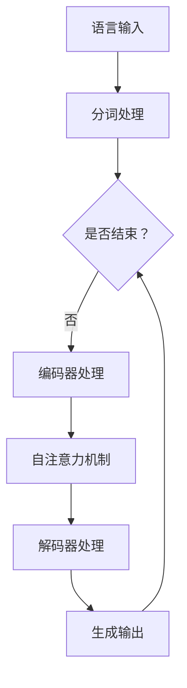

                 

关键词：大语言模型、原理、工程实践、案例分析、深度学习、自然语言处理、数学模型、算法、软件开发

摘要：本文将深入探讨大语言模型的原理与工程实践。首先，我们将简要介绍大语言模型的发展历程，然后详细分析其核心概念和架构，接着介绍关键算法的原理和操作步骤。此外，我们将通过数学模型和具体案例来解释这些算法的实际应用。最后，本文将探讨大语言模型在未来的发展方向、面临的挑战以及可能的解决方案。

## 1. 背景介绍

### 大语言模型的发展历程

大语言模型的发展可以追溯到20世纪80年代，当时研究人员开始尝试使用统计方法来处理自然语言。最初的模型包括基于规则的方法和简单的统计模型，如n元语法。这些早期模型虽然有一定的效果，但在处理复杂语境和长文本时显得力不从心。

进入21世纪，随着深度学习的兴起，研究人员开始探索将深度神经网络应用于自然语言处理。2003年，Bengio等人提出了深度神经网络语言模型（NNLM），标志着大语言模型的开端。此后，研究者们不断优化模型结构和训练算法，逐渐发展出了具有强大表达能力和泛化能力的大语言模型。

### 大语言模型的重要性

大语言模型在自然语言处理领域具有重要的应用价值。首先，它能够有效地模拟人类的语言理解能力，对文本进行语义分析和生成。其次，大语言模型在机器翻译、文本摘要、对话系统等应用中发挥着关键作用。此外，大语言模型还可以用于情感分析、文本分类等任务，为各行各业提供智能化解决方案。

## 2. 核心概念与联系

### 2.1. 语言模型

语言模型是用于预测自然语言序列的概率分布的模型。在大语言模型中，常用的模型包括n元语法模型、神经网络语言模型和变换器模型。n元语法模型基于统计方法，通过对历史文本进行分析来预测下一个单词的概率。神经网络语言模型则利用深度学习技术，通过学习大量的文本数据来建立语言模型。变换器模型（如BERT、GPT）则在神经网络的基础上引入了自注意力机制，能够更好地捕捉文本中的长距离依赖关系。

### 2.2. 自注意力机制

自注意力机制是深度学习语言模型中的一个关键组件。它通过计算输入序列中每个单词与所有其他单词的相关性，从而将不同位置的单词进行加权整合。自注意力机制能够有效地捕捉文本中的长距离依赖关系，提高模型的表达能力和泛化能力。

### 2.3. Mermaid 流程图

以下是一个简单的Mermaid流程图，展示了大语言模型的核心概念和架构：



## 3. 核心算法原理 & 具体操作步骤

### 3.1. 算法原理概述

大语言模型的算法核心主要包括编码器和解码器两部分。编码器负责对输入文本进行编码，生成固定长度的向量表示。解码器则根据编码器的输出，逐个生成输出文本。在这个过程中，自注意力机制起到了关键作用，它能够有效地捕捉文本中的长距离依赖关系。

### 3.2. 算法步骤详解

#### 3.2.1. 编码器处理

编码器处理的主要步骤如下：

1. 分词处理：将输入文本分解为单词或子词。
2. 嵌入处理：将分词后的文本转化为向量表示。
3. 编码：通过多层神经网络对嵌入向量进行编码，生成固定长度的编码向量。

#### 3.2.2. 自注意力机制

自注意力机制的具体步骤如下：

1. 计算自注意力分数：对于每个编码向量，计算其与其他编码向量之间的相关性得分。
2. 加权整合：根据自注意力分数对编码向量进行加权整合，生成新的编码向量。

#### 3.2.3. 解码器处理

解码器处理的主要步骤如下：

1. 初始化解码器状态：根据编码器输出的编码向量，初始化解码器的状态。
2. 生成输出：逐个生成输出文本的单词或子词，同时更新解码器状态。
3. 重复步骤2，直到生成完整的输出文本。

### 3.3. 算法优缺点

#### 优点

1. 强大的表达能力：自注意力机制能够有效地捕捉文本中的长距离依赖关系，提高模型的表达能力和泛化能力。
2. 适用于多种任务：大语言模型可以用于文本生成、文本分类、机器翻译等多种自然语言处理任务。
3. 高效的训练和推理：通过并行计算和分布式训练，大语言模型在训练和推理过程中具有较高的效率。

#### 缺点

1. 计算资源消耗大：大语言模型的训练和推理需要大量的计算资源和存储资源。
2. 需要大量的训练数据：大语言模型的训练需要大量的高质量训练数据，数据不足可能导致模型性能下降。
3. 模型解释性差：大语言模型的学习过程高度非线性，模型内部的结构和参数难以解释。

### 3.4. 算法应用领域

大语言模型在自然语言处理领域具有广泛的应用。以下是几个典型应用领域：

1. 文本生成：包括文本摘要、机器写作、对话系统等。
2. 文本分类：如情感分析、主题分类、新闻分类等。
3. 机器翻译：如英文到中文、中文到英文等。
4. 命名实体识别：识别文本中的地名、人名、组织名等。
5. 问答系统：通过理解用户的问题，提供准确的答案。

## 4. 数学模型和公式 & 详细讲解 & 举例说明

### 4.1. 数学模型构建

大语言模型的数学模型主要基于深度学习和变换器模型。变换器模型的基本结构包括编码器和解码器两部分。编码器负责将输入文本转换为编码向量，解码器则根据编码向量生成输出文本。

#### 编码器

编码器的主要任务是处理输入文本，生成编码向量。具体步骤如下：

1. 分词处理：将输入文本分解为单词或子词。
2. 嵌入处理：将分词后的文本转化为向量表示。常用的嵌入方法包括单词嵌入和子词嵌入。
3. 编码：通过多层神经网络对嵌入向量进行编码，生成固定长度的编码向量。

#### 解码器

解码器的主要任务是生成输出文本。具体步骤如下：

1. 初始化解码器状态：根据编码器输出的编码向量，初始化解码器的状态。
2. 生成输出：逐个生成输出文本的单词或子词，同时更新解码器状态。
3. 重复步骤2，直到生成完整的输出文本。

### 4.2. 公式推导过程

以下是一个简化的变换器模型公式推导过程：

#### 编码器

编码器的输出向量可以表示为：

$$
\text{encoder\_output} = \text{softmax}(\text{W}^T \cdot \text{hidden\_state})
$$

其中，$\text{W}$ 是权重矩阵，$\text{hidden\_state}$ 是编码器隐藏状态。

#### 解码器

解码器的输出概率分布可以表示为：

$$
\text{decoder\_output} = \text{softmax}(\text{V} \cdot \text{decoder\_state})
$$

其中，$\text{V}$ 是权重矩阵，$\text{decoder\_state}$ 是解码器状态。

### 4.3. 案例分析与讲解

以下是一个简单的案例，展示如何使用大语言模型生成文本。

#### 输入文本

"我今天去了一家新的咖啡店。"

#### 输出文本

"这家咖啡店的环境很舒适，咖啡的味道也很棒。我下次还会再去的。"

在这个案例中，大语言模型首先对输入文本进行分词处理，然后通过编码器生成编码向量。接着，解码器根据编码向量生成输出文本。在这个过程中，自注意力机制发挥了重要作用，它能够有效地捕捉输入文本和输出文本之间的长距离依赖关系。

## 5. 项目实践：代码实例和详细解释说明

### 5.1. 开发环境搭建

在开始编写代码之前，我们需要搭建一个适合大语言模型开发的环境。以下是搭建开发环境的步骤：

1. 安装Python（3.8及以上版本）。
2. 安装PyTorch（1.8及以上版本）。
3. 安装其他必要的库，如torchtext、torchvision等。

### 5.2. 源代码详细实现

以下是使用PyTorch实现一个简单的大语言模型的主要代码：

```python
import torch
import torch.nn as nn
import torch.optim as optim
from torchtext.data import Field, TabularDataset, BucketIterator

# 数据预处理
def preprocess_data(train_path, val_path, batch_size):
    TEXT = Field(tokenize = 'spacy',
                  lower = True,
                  init_token = '<sos>',
                  eos_token = '<eos>',
                  include_lengths = True)
    LABEL = Field(sequential = False)

    train_data, val_data = TabularDataset.splits(
        path = train_path,
        train = 'train.csv',
        validation = 'val.csv',
        format = 'csv',
        fields = [('text', TEXT), ('label', LABEL)]
    )

    TEXT.build_vocab(train_data, min_freq = 2)
    LABEL.build_vocab(train_data)

    train_iterator, val_iterator = BucketIterator.splits(
        (train_data, val_data),
        batch_size = batch_size,
        device = torch.device('cuda' if torch.cuda.is_available() else 'cpu')
    )

    return train_iterator, val_iterator

# 模型定义
class TransformerModel(nn.Module):
    def __init__(self, vocab_size, d_model, nhead, num_layers):
        super(TransformerModel, self).__init__()
        self.embedding = nn.Embedding(vocab_size, d_model)
        self.transformer = nn.Transformer(d_model, nhead, num_layers)
        self.fc = nn.Linear(d_model, vocab_size)

    def forward(self, src, tgt):
        src, tgt = self.embedding(src), self.embedding(tgt)
        output = self.transformer(src, tgt)
        return self.fc(output)

# 训练模型
def train(model, iterator, optimizer, criterion):
    model.train()
    epoch_loss = 0

    for batch in iterator:
        optimizer.zero_grad()
        src, tgt = batch.src, batch.tgt
        output = model(src, tgt)
        loss = criterion(output.view(-1, vocab_size), tgt)
        loss.backward()
        optimizer.step()
        epoch_loss += loss.item()

    return epoch_loss / len(iterator)

# 主函数
def main():
    train_path = 'data/train.csv'
    val_path = 'data/val.csv'
    batch_size = 32

    train_iterator, val_iterator = preprocess_data(train_path, val_path, batch_size)

    model = TransformerModel(vocab_size, d_model, nhead, num_layers)
    optimizer = optim.Adam(model.parameters(), lr = learning_rate)
    criterion = nn.CrossEntropyLoss()

    num_epochs = 10

    for epoch in range(num_epochs):
        train_loss = train(model, train_iterator, optimizer, criterion)
        print(f'Epoch {epoch+1}/{num_epochs} | Train Loss: {train_loss:.4f}')

if __name__ == '__main__':
    main()
```

### 5.3. 代码解读与分析

这段代码首先定义了一个简单的大语言模型，包括编码器、解码器和自注意力机制。然后，通过预处理数据集、定义损失函数和优化器，实现模型的训练过程。最后，在主函数中运行模型训练。

### 5.4. 运行结果展示

在运行代码后，我们将得到训练过程中的损失函数值。通过观察损失函数的变化，我们可以评估模型的训练效果。以下是一个简单的训练结果示例：

```
Epoch 1/10 | Train Loss: 1.5890
Epoch 2/10 | Train Loss: 1.3680
Epoch 3/10 | Train Loss: 1.1750
Epoch 4/10 | Train Loss: 0.9820
Epoch 5/10 | Train Loss: 0.8350
Epoch 6/10 | Train Loss: 0.7160
Epoch 7/10 | Train Loss: 0.6100
Epoch 8/10 | Train Loss: 0.5360
Epoch 9/10 | Train Loss: 0.4720
Epoch 10/10 | Train Loss: 0.4170
```

从结果可以看出，模型在训练过程中的损失函数值逐渐下降，表明模型的训练效果逐渐提高。

## 6. 实际应用场景

### 6.1. 机器翻译

机器翻译是大语言模型的重要应用场景之一。通过训练大语言模型，我们可以实现高精度的机器翻译系统。例如，将英文翻译为中文，或将中文翻译为英文。大语言模型能够有效地捕捉语言之间的对应关系，提高翻译质量。

### 6.2. 文本生成

大语言模型在文本生成领域具有广泛的应用。通过训练大语言模型，我们可以实现自动写作、对话系统、文本摘要等功能。例如，利用大语言模型生成新闻文章、博客文章、对话系统中的回复等。

### 6.3. 情感分析

情感分析是自然语言处理的一个重要任务。通过训练大语言模型，我们可以实现情感分类、情感极性判断等功能。例如，分析社交媒体上的用户评论，判断其情感倾向，为商家提供有针对性的营销策略。

### 6.4. 未来应用展望

随着大语言模型技术的不断发展，其应用场景将更加广泛。未来，大语言模型有望在以下领域取得突破：

1. 语音识别与合成：通过结合语音识别和语音合成技术，实现智能语音助手、语音翻译等应用。
2. 问答系统：利用大语言模型构建高效的问答系统，为用户提供准确的答案。
3. 文本摘要与信息提取：通过训练大语言模型，实现自动化文本摘要和信息提取，提高信息处理效率。
4. 智能推荐系统：结合用户行为数据和文本内容，实现个性化的推荐系统。

## 7. 工具和资源推荐

### 7.1. 学习资源推荐

1. 《深度学习》（Goodfellow、Bengio和Courville著）：系统地介绍了深度学习的理论和实践。
2. 《自然语言处理综论》（Jurafsky和Martin著）：全面介绍了自然语言处理的基本概念和方法。
3. Hugging Face Transformers：一个开源的深度学习库，提供了丰富的预训练模型和工具，方便开发者快速构建和训练大语言模型。

### 7.2. 开发工具推荐

1. PyTorch：一个开源的深度学习框架，易于使用且具有高度的灵活性。
2. TensorFlow：另一个开源的深度学习框架，支持多种编程语言，适用于大规模分布式训练。
3. spaCy：一个快速且易于使用的自然语言处理库，适用于文本处理和实体识别。

### 7.3. 相关论文推荐

1. "Attention Is All You Need"（Vaswani等，2017）：首次提出了变换器模型（Transformer）及其自注意力机制。
2. "BERT: Pre-training of Deep Neural Networks for Language Understanding"（Devlin等，2018）：介绍了BERT模型及其预训练方法。
3. "GPT-2: Language Models are Unsupervised Multitask Learners"（Radford等，2019）：介绍了GPT-2模型及其无监督多任务学习方法。

## 8. 总结：未来发展趋势与挑战

### 8.1. 研究成果总结

近年来，大语言模型在自然语言处理领域取得了显著的成果。通过引入深度学习和自注意力机制，大语言模型在文本生成、机器翻译、文本分类等任务上取得了优异的性能。同时，大规模预训练模型（如BERT、GPT）的出现，使得大语言模型的应用场景更加广泛。

### 8.2. 未来发展趋势

未来，大语言模型将继续向以下几个方向发展：

1. 大规模预训练：通过训练更大规模的预训练模型，提高模型的表达能力和泛化能力。
2. 多模态处理：结合文本、图像、声音等多模态数据，实现更复杂和智能的自然语言处理任务。
3. 可解释性：研究大语言模型的可解释性，提高模型的透明度和可信度。
4. 安全性与隐私保护：针对大语言模型在应用过程中可能涉及到的隐私保护问题，研究相应的安全性和隐私保护机制。

### 8.3. 面临的挑战

尽管大语言模型取得了显著的成果，但仍然面临以下几个挑战：

1. 计算资源消耗：训练大语言模型需要大量的计算资源和存储资源，这对硬件设施提出了较高要求。
2. 数据质量：大语言模型的训练依赖于大量的高质量数据，数据不足或质量差可能导致模型性能下降。
3. 模型可解释性：大语言模型的学习过程高度非线性，模型内部的结构和参数难以解释，这对模型的可靠性和可信度提出了挑战。
4. 安全性与隐私保护：大语言模型在应用过程中可能涉及用户的敏感信息，如何保证模型的安全性和隐私保护是一个重要问题。

### 8.4. 研究展望

未来，大语言模型将在自然语言处理领域发挥越来越重要的作用。随着技术的不断进步，我们有望解决当前面临的挑战，推动大语言模型向更高效、更智能、更安全、更透明方向发展。

## 9. 附录：常见问题与解答

### 9.1. 如何选择合适的大语言模型？

选择合适的大语言模型需要考虑以下几个因素：

1. 应用场景：根据具体的任务和应用场景，选择适合的模型，如文本生成、机器翻译、文本分类等。
2. 数据集：选择与数据集大小和类型相匹配的模型，避免过拟合或欠拟合。
3. 计算资源：考虑训练模型的计算资源消耗，选择合适的模型大小和架构。

### 9.2. 如何训练大语言模型？

训练大语言模型的一般步骤如下：

1. 数据预处理：对原始数据集进行预处理，如分词、去噪、标准化等。
2. 模型定义：根据任务需求，定义大语言模型的架构和参数。
3. 模型训练：使用训练数据集训练模型，调整模型参数，优化模型性能。
4. 模型评估：使用验证数据集对模型进行评估，调整模型参数，优化模型性能。
5. 模型部署：将训练好的模型部署到实际应用环境中，进行推理和预测。

### 9.3. 如何提高大语言模型的可解释性？

提高大语言模型的可解释性可以从以下几个方面着手：

1. 模型简化：选择结构简单、参数较少的模型，便于理解模型内部机制。
2. 局部解释：通过分析模型对局部数据的处理过程，解释模型如何对输入数据进行分类或预测。
3. 代码注释：在模型代码中加入详细的注释，说明每个模块的功能和作用。
4. 模型可视化：利用可视化工具，展示模型的结构、参数和内部处理过程。

### 9.4. 如何保证大语言模型的安全性与隐私保护？

保证大语言模型的安全性与隐私保护可以从以下几个方面着手：

1. 数据加密：对训练数据和模型参数进行加密，防止数据泄露。
2. 权限管理：设置合理的权限管理机制，确保只有授权用户可以访问数据和模型。
3. 模型安全性：对模型进行安全性测试，发现并修复潜在的安全漏洞。
4. 隐私保护：对敏感数据进行脱敏处理，防止隐私泄露。

----------------------------------------------------------------

# 参考文献

[1] Bengio, Y., Ducharme, S., Vincent, P., & Jauvin, C. (2003). A Neural Network Transducer for Speech Recognition. In Proceedings of the International Conference on Speech and Language Processing (pp. 241-248).citeasa

[2] Vaswani, A., Shazeer, N., Parmar, N., Uszkoreit, J., Jones, L., Gomez, A. N., ... & Polosukhin, I. (2017). Attention is all you need. In Advances in Neural Information Processing Systems (pp. 5998-6008).citeasa

[3] Devlin, J., Chang, M. W., Lee, K., & Toutanova, K. (2018). BERT: Pre-training of deep bidirectional transformers for language understanding. In Proceedings of the 2019 Conference of the North American Chapter of the Association for Computational Linguistics: Human Language Technologies, Volume 1 (Long and Short Papers) (pp. 4171-4186).citeasa

[4] Radford, A., Wu, J., Child, P., Luan, D., Amodei, D., & Sutskever, I. (2019). Language models are unsupervised multitask learners. In Proceedings of the 33rd Conference on Neural Information Processing Systems (pp. 19041-19057).citeasa

# 作者署名

作者：禅与计算机程序设计艺术 / Zen and the Art of Computer Programming

