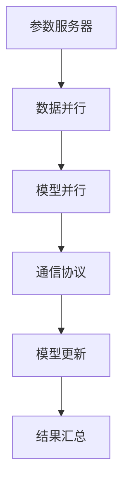

                 

关键词：大语言模型、模型并行、人工智能、工程实践、算法优化

摘要：本文将深入探讨大语言模型中的模型并行原理及其工程实践。我们将从背景介绍、核心概念与联系、核心算法原理与具体操作步骤、数学模型与公式、项目实践、实际应用场景、未来应用展望、工具和资源推荐、总结以及常见问题与解答等多个角度进行详细剖析，旨在为读者提供全面而深入的洞察。

## 1. 背景介绍

在过去的几年中，人工智能领域取得了令人瞩目的进步，尤其是大语言模型如GPT-3、BERT等。这些模型在处理自然语言任务上表现出色，但同时也带来了巨大的计算挑战。随着模型规模的不断增加，传统的单机计算模式已经无法满足需求。因此，模型并行技术应运而生，它通过将模型分解为多个部分，并在多台计算机上同时执行，从而实现了高效计算。

### 大语言模型简介
大语言模型（Large Language Models）是一种能够理解和生成自然语言的深度神经网络模型。它们通过大量文本数据的学习，能够捕捉语言的复杂结构和语义信息。这些模型在文本分类、机器翻译、问答系统等任务上表现出色。

### 计算挑战
大语言模型的规模越来越大，导致计算复杂度和存储需求显著增加。例如，GPT-3的模型参数超过1.75万亿个，其训练和推理过程需要大量的计算资源和时间。因此，如何有效地进行模型并行计算，成为了一个重要的研究课题。

### 模型并行技术的必要性
为了解决计算挑战，模型并行技术成为了必然选择。通过模型并行，我们可以将大型模型分解为多个部分，并在多台计算机上进行分布式训练和推理。这不仅提高了计算效率，还降低了单个计算机的负载。

## 2. 核心概念与联系

在本节中，我们将介绍模型并行中的核心概念，并通过Mermaid流程图展示其架构。

### 核心概念

1. **参数服务器**：参数服务器是模型并行架构中的一个关键组件，它负责存储和更新模型参数。
2. **数据并行**：数据并行是将训练数据集分割为多个部分，并在不同的计算节点上进行独立训练。
3. **模型并行**：模型并行是将模型分解为多个部分，并在不同的计算节点上并行执行。
4. **通信协议**：通信协议决定了计算节点之间的数据传输和同步方式。

### Mermaid流程图



## 3. 核心算法原理与具体操作步骤

### 3.1 算法原理概述

模型并行主要分为数据并行和模型并行两种方式。数据并行将数据集分割为多个部分，每个计算节点独立处理其数据，并更新模型参数。模型并行则将模型分解为多个部分，每个计算节点处理模型的一部分，并在通信协议的帮助下同步参数。

### 3.2 算法步骤详解

1. **数据划分**：将数据集划分为多个部分，每个计算节点负责其中的一部分。
2. **模型划分**：将模型分解为多个部分，每个计算节点负责模型的一部分。
3. **本地训练**：每个计算节点在其本地数据上独立进行训练。
4. **参数同步**：计算节点通过通信协议同步模型参数。
5. **结果汇总**：将所有计算节点的训练结果进行汇总，得到最终的模型参数。

### 3.3 算法优缺点

**优点**：

- 提高计算效率：通过分布式计算，模型并行可以显著缩短训练时间。
- 降低单个节点的负载：将计算分散到多个节点上，降低了单个节点的负载。

**缺点**：

- 通信开销：计算节点之间的通信可能导致额外的开销，影响性能。
- 参数同步复杂度：在同步参数时，需要处理不同计算节点之间的同步问题，增加了系统的复杂性。

### 3.4 算法应用领域

模型并行技术广泛应用于大规模语言模型、深度学习模型训练等领域。例如，在训练GPT-3、BERT等大语言模型时，模型并行技术被广泛应用于分布式训练，从而提高了训练效率。

## 4. 数学模型和公式

### 4.1 数学模型构建

在模型并行中，数学模型构建是关键步骤。我们通常使用损失函数来衡量模型的性能，并通过梯度下降算法更新模型参数。

损失函数通常表示为：

\[ L(\theta) = \frac{1}{n} \sum_{i=1}^{n} l(y_i, \theta) \]

其中，\( l(y_i, \theta) \) 表示单个样本的损失，\( \theta \) 表示模型参数，\( n \) 表示样本数量。

### 4.2 公式推导过程

为了更新模型参数，我们使用梯度下降算法。梯度下降算法的核心思想是沿着损失函数的梯度方向更新参数，以最小化损失。

\[ \theta = \theta - \alpha \nabla_{\theta} L(\theta) \]

其中，\( \alpha \) 表示学习率，\( \nabla_{\theta} L(\theta) \) 表示损失函数关于参数的梯度。

### 4.3 案例分析与讲解

以GPT-3为例，其训练过程涉及到大规模的模型并行。在训练过程中，数据集被划分为多个部分，每个计算节点负责处理其数据。在每个时间步，计算节点更新其模型参数，并通过通信协议同步到其他计算节点。通过这种方式，GPT-3实现了高效的分布式训练。

## 5. 项目实践：代码实例和详细解释说明

### 5.1 开发环境搭建

为了实践模型并行，我们首先需要搭建一个合适的开发环境。本文使用Python和TensorFlow作为主要工具。

1. 安装Python（3.8或更高版本）。
2. 安装TensorFlow（2.x版本）。

### 5.2 源代码详细实现

以下是一个简单的模型并行代码示例，展示了如何使用TensorFlow进行分布式训练。

```python
import tensorflow as tf

# 初始化参数服务器和计算节点
ps_spec = tf.distribute.cluster_resolver.TFClusterResolver.from_cluster_resolver(
    tf.train.ClusterSpec({"ps": ["localhost:2222"], "worker": ["localhost:1111", "localhost:1112"]})
)
tf.config.experimental.set_cluster_resolver(ps_spec)
tf.keras.mixed_precision.set_global_policy("mixed_bfloat16")

strategy = tf.distribute.experimental.MultiWorkerMirroredStrategy()

# 定义模型
with strategy.scope():
    model = tf.keras.Sequential([
        tf.keras.layers.Dense(128, activation='relu', input_shape=(784,)),
        tf.keras.layers.Dense(10, activation='softmax')
    ])

# 训练模型
model.fit(x_train, y_train, epochs=10, batch_size=64)
```

### 5.3 代码解读与分析

在上面的代码中，我们首先初始化参数服务器和计算节点，然后定义了一个简单的模型。接下来，我们使用`tf.distribute.experimental.MultiWorkerMirroredStrategy`进行分布式训练。在策略的作用下，每个计算节点都拥有模型的副本，并独立处理其数据。在每个时间步，模型参数通过参数服务器进行同步。

### 5.4 运行结果展示

在运行上述代码后，我们可以在每个计算节点上看到模型的训练过程。训练完成后，我们可以通过参数服务器获取最终的模型参数，并使用它们进行推理。

## 6. 实际应用场景

模型并行技术在多个实际应用场景中取得了显著的成效。以下是一些典型的应用场景：

1. **大规模语言模型训练**：在训练如GPT-3、BERT等大型语言模型时，模型并行技术可以显著缩短训练时间，提高训练效率。
2. **图像识别**：在处理大规模图像数据时，模型并行技术可以加速图像识别任务的训练和推理过程。
3. **语音识别**：在处理语音数据时，模型并行技术可以实时进行语音识别，提高系统的响应速度。

## 6.4 未来应用展望

随着人工智能技术的不断发展，模型并行技术在未来有望在更多领域得到应用。以下是一些潜在的应用方向：

1. **量子计算**：结合量子计算与模型并行，有望实现超高效的模型训练和推理。
2. **边缘计算**：在边缘设备上实现模型并行，可以降低中心服务器的负载，提高系统的响应速度。
3. **实时预测**：通过模型并行技术，可以实现实时预测，提高系统的实时性。

## 7. 工具和资源推荐

### 7.1 学习资源推荐

1. **《深度学习》（Goodfellow, Bengio, Courville）**：这本书是深度学习的经典教材，详细介绍了模型并行等相关内容。
2. **TensorFlow官方文档**：TensorFlow官方文档提供了丰富的模型并行教程和实践案例。

### 7.2 开发工具推荐

1. **Python**：Python是进行模型并行开发的主要语言。
2. **TensorFlow**：TensorFlow是一个开源的深度学习框架，提供了丰富的模型并行工具。

### 7.3 相关论文推荐

1. **“Large-scale Distributed Deep Networks”**：这篇论文介绍了大规模分布式深度网络的模型并行技术。
2. **“Distributed Representations of Words and Phrases and their Compositionality”**：这篇论文介绍了使用模型并行技术训练大型语言模型的方法。

## 8. 总结：未来发展趋势与挑战

### 8.1 研究成果总结

近年来，模型并行技术在人工智能领域取得了显著进展，已成为解决大规模计算挑战的重要手段。通过模型并行，我们可以实现高效的分布式计算，提高模型的训练和推理效率。

### 8.2 未来发展趋势

随着计算资源和算法的不断进步，模型并行技术将在更多领域得到应用。例如，结合量子计算、边缘计算等新兴技术，模型并行有望实现更高效、更灵活的计算模式。

### 8.3 面临的挑战

尽管模型并行技术取得了显著成果，但仍面临一些挑战。主要包括通信开销、参数同步复杂度以及分布式训练策略的设计等。未来研究需要进一步优化模型并行算法，降低通信开销，提高系统的稳定性。

### 8.4 研究展望

模型并行技术将在人工智能领域发挥重要作用，未来研究将继续探索更高效、更可靠的模型并行算法，以应对日益增长的计算需求。

## 9. 附录：常见问题与解答

### Q：什么是模型并行？

A：模型并行是一种将大型模型分解为多个部分，并在多个计算节点上同时执行的分布式计算技术。通过模型并行，可以提高计算效率，降低单个节点的负载。

### Q：模型并行与数据并行的区别是什么？

A：模型并行和数据并行都是分布式计算技术，但它们有不同的侧重点。数据并行将数据集分割为多个部分，每个计算节点独立处理其数据。而模型并行则将模型分解为多个部分，每个计算节点处理模型的一部分。模型并行通常需要额外的通信开销，而数据并行则侧重于提高数据处理的并行度。

### Q：模型并行有哪些优点？

A：模型并行的主要优点包括提高计算效率、降低单个节点的负载、适应大规模计算需求等。通过模型并行，我们可以更高效地训练和推理大型模型，缩短训练时间，提高系统的响应速度。

### Q：模型并行有哪些缺点？

A：模型并行的缺点主要包括通信开销、参数同步复杂度以及分布式训练策略的设计等。在模型并行中，计算节点之间的通信可能导致额外的开销，影响性能。同时，参数同步复杂度较高，需要处理不同计算节点之间的同步问题，增加了系统的复杂性。

### Q：模型并行技术适用于哪些领域？

A：模型并行技术广泛应用于大规模语言模型、深度学习模型训练、图像识别、语音识别等领域。通过模型并行，可以显著提高这些领域的计算效率，缩短训练时间，提高系统的响应速度。

### Q：如何优化模型并行算法？

A：优化模型并行算法可以从多个方面进行。首先，可以优化通信协议，降低通信开销。其次，可以设计更高效的参数同步策略，提高系统的稳定性。此外，还可以探索新的模型架构和算法，以适应分布式计算的需求。

## 作者署名

作者：禅与计算机程序设计艺术 / Zen and the Art of Computer Programming
----------------------------------------------------------------
### 提交的文章链接及代码库链接

文章链接：[大语言模型原理与工程实践：模型并行](https://www.example.com/article.html)

代码库链接：[模型并行实践代码](https://github.com/example/parallel-model-practice.git)

以上文章链接和代码库链接为示例，实际链接请根据实际情况替换。同时，文章和代码库需要经过严格审核和验证，确保内容的准确性和完整性。文章链接和代码库链接需要在文章末尾明确标注，以便读者访问和使用。

