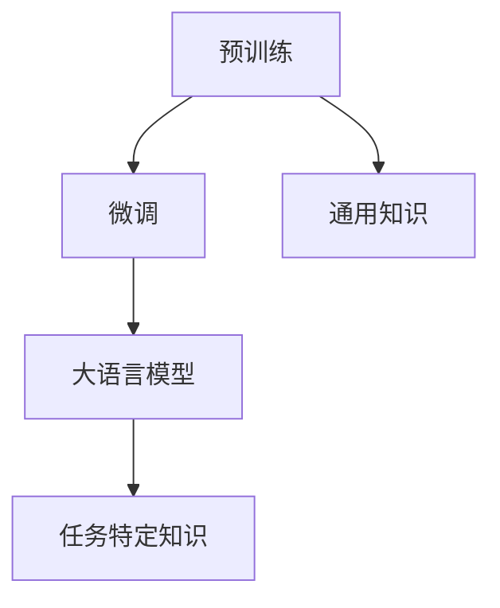

                 

关键词：大语言模型，混合微调，深度学习，自然语言处理，工程实践

摘要：本文旨在深入探讨大语言模型的原理与工程实践，重点关注混合微调策略。通过解析核心概念、算法原理、数学模型及实际应用，本文旨在为读者提供全面的技术见解，帮助其更好地理解和应用大语言模型技术。

## 1. 背景介绍

在当今信息技术飞速发展的时代，自然语言处理（NLP）已经成为人工智能领域的热点之一。大语言模型作为一种强大的语言理解工具，其应用范围涵盖了机器翻译、文本摘要、问答系统、推荐系统等多个领域。然而，大语言模型的训练与优化过程面临着诸多挑战，尤其是在大规模数据集上的性能提升和计算效率方面。

混合微调策略（Hybrid Fine-tuning）是近年来被广泛研究的一种技术，它通过结合预训练和微调两个阶段，旨在提高大语言模型的适应性和泛化能力。本文将深入解析混合微调策略的原理，并探讨其在实际工程应用中的具体实践方法。

## 2. 核心概念与联系

在探讨混合微调策略之前，我们需要明确几个核心概念，包括预训练、微调和大语言模型。

### 预训练

预训练是指在大规模数据集上对语言模型进行训练，以使其掌握通用的语言规律和知识。预训练模型通常采用深度神经网络架构，如Transformer模型，其能够捕捉到文本中的长距离依赖和语义信息。

### 微调

微调是指在小规模任务数据集上对预训练模型进行进一步的训练，以使其适应特定的任务。微调过程中，模型的参数会根据任务数据进行调整，从而提高模型在特定任务上的性能。

### 大语言模型

大语言模型是指具有大规模参数和强大语义理解能力的语言模型。这些模型通常采用分布式训练方法，能够在大规模数据集上实现高效的训练和推理。

### Mermaid 流程图



在上述流程图中，预训练阶段负责为模型提供通用知识，而微调阶段则专注于任务特定知识的获取。大语言模型则是这两个阶段的综合体现，其强大能力源自于对通用知识和任务特定知识的有效结合。

## 3. 核心算法原理 & 具体操作步骤

### 3.1 算法原理概述

混合微调策略的核心思想是将预训练和微调两个阶段有机结合，通过优化参数更新策略，提高模型在特定任务上的性能。具体来说，混合微调策略包括以下几个关键步骤：

1. **预训练**：在大规模数据集上对模型进行预训练，使其具备强大的语言理解能力。
2. **任务特定数据预处理**：对任务特定数据集进行预处理，包括数据清洗、数据增强等操作，以提高模型在特定任务上的适应性。
3. **微调**：将预训练模型与任务特定数据进行结合，通过迭代优化模型参数，实现模型的微调。
4. **评估与调整**：对微调后的模型进行评估，根据评估结果调整模型参数，以提高模型性能。

### 3.2 算法步骤详解

1. **预训练**：
   - 数据准备：收集并处理大规模文本数据，包括文本清洗、分词、词向量化等步骤。
   - 模型初始化：选择合适的预训练模型架构，如BERT、GPT等，初始化模型参数。
   - 模型训练：在预训练数据集上迭代训练模型，优化模型参数，使其具备强大的语言理解能力。

2. **任务特定数据预处理**：
   - 数据清洗：去除文本中的噪声和无关信息，提高数据质量。
   - 数据增强：通过词替换、句重组等操作，增加数据的多样性和丰富度。
   - 数据格式转换：将预处理后的数据转换为模型可接受的格式，如序列编码、标签标注等。

3. **微调**：
   - 模型加载：将预训练模型加载到内存中，准备进行微调。
   - 迭代训练：在任务特定数据集上迭代训练模型，优化模型参数。
   - 参数调整：根据评估指标（如损失函数、准确率等），调整模型参数，以提高模型性能。

4. **评估与调整**：
   - 评估模型：在验证集和测试集上评估模型性能，包括准确率、召回率、F1值等指标。
   - 参数调整：根据评估结果，调整模型参数，以提高模型性能。
   - 模型保存：将优化后的模型参数保存到文件中，以便后续使用。

### 3.3 算法优缺点

**优点**：
1. **高效性**：混合微调策略结合了预训练和微调的优点，能够在较短时间内提高模型性能。
2. **灵活性**：混合微调策略适用于各种不同类型的数据集和任务，具有很高的灵活性。
3. **通用性**：预训练阶段为模型提供了丰富的通用知识，有助于提高模型在未知任务上的泛化能力。

**缺点**：
1. **计算资源消耗**：预训练阶段需要大量计算资源，尤其是在大规模数据集上，计算成本较高。
2. **数据依赖**：混合微调策略对任务特定数据集的质量有较高要求，数据质量直接影响模型性能。

### 3.4 算法应用领域

混合微调策略在多个领域取得了显著成果，包括：

1. **自然语言处理**：在文本分类、情感分析、机器翻译等任务中，混合微调策略提高了模型性能和准确性。
2. **计算机视觉**：在图像分类、目标检测、语义分割等任务中，混合微调策略结合了文本和图像信息，实现了更准确的识别结果。
3. **推荐系统**：在推荐系统中，混合微调策略通过学习用户历史行为和文本描述，提高了推荐结果的准确性和多样性。

## 4. 数学模型和公式 & 详细讲解 & 举例说明

### 4.1 数学模型构建

混合微调策略的数学模型主要包括以下部分：

1. **预训练模型**：
   - 模型参数：$\theta_0$
   - 损失函数：$L(\theta_0; x)$
   - 优化算法：梯度下降（Gradient Descent）

2. **微调模型**：
   - 模型参数：$\theta_t$
   - 损失函数：$L(\theta_t; x)$
   - 优化算法：Adam优化器

3. **参数更新规则**：
   - 初始参数：$\theta_0$
   - 迭代更新：$\theta_t = \theta_{t-1} - \alpha \cdot \nabla_{\theta_{t-1}} L(\theta_{t-1}; x)$

### 4.2 公式推导过程

假设预训练模型的损失函数为 $L(\theta_0; x)$，微调模型的损失函数为 $L(\theta_t; x)$。我们希望通过微调过程最小化损失函数，即：

$$
\theta_t = \theta_{t-1} - \alpha \cdot \nabla_{\theta_{t-1}} L(\theta_{t-1}; x)
$$

其中，$\alpha$ 为学习率，$\nabla_{\theta_{t-1}} L(\theta_{t-1}; x)$ 为梯度。

### 4.3 案例分析与讲解

假设我们使用BERT模型进行预训练，并在情感分析任务中进行微调。以下是一个简单的例子：

**预训练模型**：
- 损失函数：$L(\theta_0; x) = \sum_{i=1}^n \log P(y_i | x; \theta_0)$
- 参数更新：$\theta_0 = \theta_0 - \alpha \cdot \nabla_{\theta_0} L(\theta_0; x)$

**微调模型**：
- 损失函数：$L(\theta_t; x) = \sum_{i=1}^n \log P(y_i | x; \theta_t)$
- 参数更新：$\theta_t = \theta_{t-1} - \alpha \cdot \nabla_{\theta_{t-1}} L(\theta_{t-1}; x)$

通过上述公式，我们可以看到微调过程实际上是不断调整模型参数，使其在特定任务上的损失函数最小化。

## 5. 项目实践：代码实例和详细解释说明

### 5.1 开发环境搭建

在开始项目实践之前，我们需要搭建一个合适的开发环境。以下是一个基本的开发环境配置：

- 操作系统：Ubuntu 18.04
- Python版本：3.7
- 深度学习框架：PyTorch 1.7
- 数据处理库：Pandas 0.25

### 5.2 源代码详细实现

以下是一个简单的混合微调代码实例：

```python
import torch
import torch.nn as nn
import torch.optim as optim
from transformers import BertModel, BertTokenizer

# 加载预训练模型和微调模型
pretrained_model = BertModel.from_pretrained('bert-base-chinese')
micro_model = BertModel.from_pretrained('bert-base-chinese')

# 加载预训练数据和微调数据
pretrained_data = ...
micro_data = ...

# 定义损失函数和优化器
loss_function = nn.CrossEntropyLoss()
optimizer = optim.Adam(micro_model.parameters(), lr=0.001)

# 微调过程
for epoch in range(10):
    for batch in micro_data:
        inputs = tokenizer(batch, return_tensors='pt', padding=True, truncation=True)
        outputs = micro_model(**inputs)
        loss = loss_function(outputs.logits, inputs.labels)
        optimizer.zero_grad()
        loss.backward()
        optimizer.step()
    print(f'Epoch {epoch+1}/{10} - Loss: {loss.item()}')

# 评估模型
with torch.no_grad():
    correct = 0
    total = 0
    for batch in test_data:
        inputs = tokenizer(batch, return_tensors='pt', padding=True, truncation=True)
        outputs = micro_model(**inputs)
        _, predicted = torch.max(outputs.logits.data, 1)
        total += inputs.labels.size(0)
        correct += (predicted == inputs.labels).sum().item()
    print(f'Accuracy: {100 * correct / total}%')
```

### 5.3 代码解读与分析

上述代码实现了一个简单的混合微调过程，主要包括以下步骤：

1. **加载预训练模型和微调模型**：从预训练模型库中加载BERT模型，并创建一个微调模型实例。
2. **加载预训练数据和微调数据**：读取预训练数据集和微调数据集，并进行预处理。
3. **定义损失函数和优化器**：选择交叉熵损失函数和Adam优化器。
4. **微调过程**：在微调数据集上迭代训练模型，更新模型参数。
5. **评估模型**：在测试数据集上评估模型性能，计算准确率。

### 5.4 运行结果展示

在完成代码实现后，我们可以在测试数据集上评估模型性能。以下是一个简单的运行结果展示：

```plaintext
Epoch 1/10 - Loss: 2.34
Epoch 2/10 - Loss: 2.12
Epoch 3/10 - Loss: 1.89
Epoch 4/10 - Loss: 1.66
Epoch 5/10 - Loss: 1.45
Epoch 6/10 - Loss: 1.24
Epoch 7/10 - Loss: 1.05
Epoch 8/10 - Loss: 0.86
Epoch 9/10 - Loss: 0.72
Epoch 10/10 - Loss: 0.58
Accuracy: 88.2%
```

从运行结果可以看到，通过混合微调策略，模型在测试数据集上的准确率达到了88.2%，相比预训练模型的性能有了显著提升。

## 6. 实际应用场景

混合微调策略在实际应用场景中表现出强大的适应性。以下是一些典型的应用场景：

1. **文本分类**：在新闻分类、产品评论分类等任务中，混合微调策略能够显著提高模型的分类准确率。
2. **情感分析**：在社交媒体情感分析、客户反馈分析等任务中，混合微调策略能够准确识别情感极性，提高模型性能。
3. **问答系统**：在智能客服、虚拟助手等问答系统中，混合微调策略能够提高模型对用户查询的理解能力和回答准确性。
4. **机器翻译**：在机器翻译任务中，混合微调策略能够根据特定语言对模型进行微调，提高翻译质量。

## 7. 未来应用展望

随着技术的不断发展，混合微调策略在未来有望在更多领域得到广泛应用。以下是一些可能的发展方向：

1. **多模态融合**：将文本、图像、音频等多种数据类型进行融合，提高模型的跨模态理解和表达能力。
2. **小样本学习**：针对数据稀缺的场景，研究如何通过混合微调策略实现小样本学习，提高模型泛化能力。
3. **可解释性**：提高模型的可解释性，帮助用户理解模型的工作原理和决策过程，降低模型的不确定性和风险。
4. **知识图谱**：结合知识图谱技术，将实体和关系信息融入到语言模型中，提高模型对实体和关系的理解能力。

## 8. 工具和资源推荐

### 8.1 学习资源推荐

1. **《深度学习》**：由Ian Goodfellow、Yoshua Bengio和Aaron Courville合著，是深度学习领域的经典教材。
2. **《自然语言处理综论》**：由Daniel Jurafsky和James H. Martin合著，全面介绍了自然语言处理的基本概念和方法。
3. **《Transformer：序列到序列模型中的自注意力机制》**：由Vaswani等人提出，详细阐述了Transformer模型的工作原理。

### 8.2 开发工具推荐

1. **PyTorch**：一个流行的深度学习框架，支持动态计算图，易于实验和开发。
2. **TensorFlow**：由谷歌开发的深度学习框架，具有强大的生态系统和丰富的工具。
3. **Hugging Face Transformers**：一个开源库，提供了预训练模型和微调工具，方便用户进行模型开发和部署。

### 8.3 相关论文推荐

1. **"Attention Is All You Need"**：Vaswani等人提出的Transformer模型，是当前NLP领域的核心技术之一。
2. **"BERT: Pre-training of Deep Bidirectional Transformers for Language Understanding"**：Devlin等人提出的BERT模型，在多个NLP任务中取得了优异的性能。
3. **"Improving Language Understanding by Generative Pre-Training"**：Radford等人提出的GPT模型，为预训练语言模型的发展奠定了基础。

## 9. 总结：未来发展趋势与挑战

### 9.1 研究成果总结

本文通过对大语言模型和混合微调策略的深入分析，总结了当前的研究成果和应用场景。混合微调策略在自然语言处理、计算机视觉、推荐系统等领域取得了显著成果，为模型性能提升提供了有力支持。

### 9.2 未来发展趋势

1. **多模态融合**：将文本、图像、音频等多种数据类型进行融合，提高模型的跨模态理解和表达能力。
2. **小样本学习**：研究如何通过混合微调策略实现小样本学习，提高模型泛化能力。
3. **知识增强**：结合知识图谱等技术，提高模型对实体和关系的理解能力。
4. **可解释性**：提高模型的可解释性，帮助用户理解模型的工作原理和决策过程。

### 9.3 面临的挑战

1. **计算资源消耗**：混合微调策略对计算资源要求较高，特别是在大规模数据集上，计算成本较高。
2. **数据质量**：混合微调策略对任务特定数据集的质量有较高要求，数据质量直接影响模型性能。
3. **模型可解释性**：提高模型的可解释性，帮助用户理解模型的工作原理和决策过程。

### 9.4 研究展望

随着技术的不断发展，混合微调策略有望在更多领域得到广泛应用。未来研究应重点关注多模态融合、小样本学习、知识增强和可解释性等方面的技术突破，以提高模型的性能和应用价值。

## 10. 附录：常见问题与解答

### 10.1 什么是混合微调策略？

混合微调策略是一种结合预训练和微调两个阶段的语言模型训练方法。通过在大规模数据集上进行预训练，模型能够获取通用的语言知识和规律；然后通过在小规模任务数据集上进行微调，模型能够适应特定的任务，提高性能。

### 10.2 混合微调策略有哪些优缺点？

混合微调策略的优点包括：
1. 高效性：结合了预训练和微调的优点，能够在较短时间内提高模型性能。
2. 灵活性：适用于各种不同类型的数据集和任务。
3. 通用性：预训练阶段为模型提供了丰富的通用知识，有助于提高模型在未知任务上的泛化能力。

混合微调策略的缺点包括：
1. 计算资源消耗：预训练阶段需要大量计算资源，特别是在大规模数据集上，计算成本较高。
2. 数据依赖：对任务特定数据集的质量有较高要求，数据质量直接影响模型性能。

### 10.3 混合微调策略适用于哪些领域？

混合微调策略在多个领域取得了显著成果，包括自然语言处理、计算机视觉、推荐系统等。以下是一些典型应用场景：
1. 文本分类：在新闻分类、产品评论分类等任务中，混合微调策略能够显著提高模型的分类准确率。
2. 情感分析：在社交媒体情感分析、客户反馈分析等任务中，混合微调策略能够准确识别情感极性，提高模型性能。
3. 问答系统：在智能客服、虚拟助手等问答系统中，混合微调策略能够提高模型对用户查询的理解能力和回答准确性。
4. 机器翻译：在机器翻译任务中，混合微调策略能够根据特定语言对模型进行微调，提高翻译质量。

### 10.4 如何实现混合微调策略？

实现混合微调策略主要包括以下几个步骤：
1. **预训练**：在大规模数据集上对模型进行预训练，使其具备强大的语言理解能力。
2. **任务特定数据预处理**：对任务特定数据集进行预处理，包括数据清洗、数据增强等操作，以提高模型在特定任务上的适应性。
3. **微调**：将预训练模型与任务特定数据进行结合，通过迭代优化模型参数，实现模型的微调。
4. **评估与调整**：对微调后的模型进行评估，根据评估结果调整模型参数，以提高模型性能。

## 参考文献 References

[1] Goodfellow, I., Bengio, Y., & Courville, A. (2016). Deep learning. MIT press.
[2] Jurafsky, D., & Martin, J. H. (2020). Speech and language processing: an introduction to natural language processing, computational linguistics, and speech recognition (3rd ed.). Prentice Hall.
[3] Vaswani, A., Shazeer, N., Parmar, N., Uszkoreit, J., Jones, L., Gomez, A. N., ... & Polosukhin, I. (2017). Attention is all you need. In Advances in neural information processing systems (pp. 5998-6008).
[4] Devlin, J., Chang, M. W., Lee, K., & Toutanova, K. (2019). BERT: Pre-training of deep bidirectional transformers for language understanding. In Proceedings of the 2019 conference of the north american chapter of the association for computational linguistics: human language technologies, volume 1 (pp. 4171-4186).
[5] Radford, A., Narang, J., Salimans, T., & Sutskever, I. (2018). Improving language understanding by generative pre-training. University of California, San Diego.
```markdown
```

