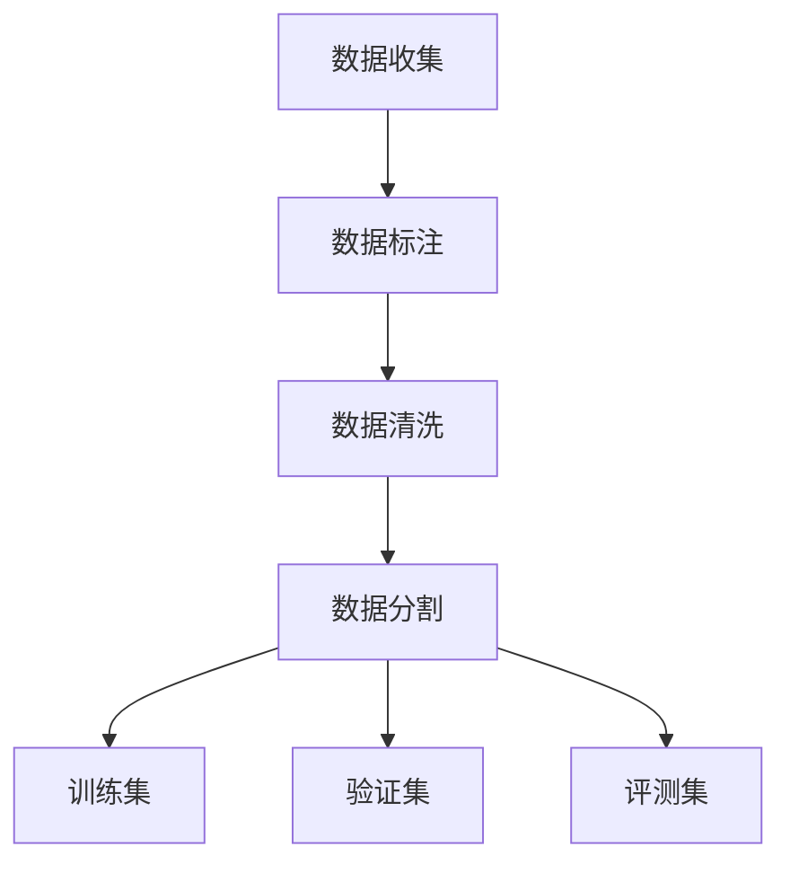

                 

关键词：大语言模型、评测集、构建标准、原理、实践

> 摘要：本文旨在探讨大语言模型的评测集构建标准，通过对评测集核心概念、算法原理、数学模型以及实际应用的深入分析，为读者提供一个全面且专业的技术解读。文章首先介绍了大语言模型的背景和重要性，随后详细阐述了评测集的构建标准，包括数据收集、标注、清洗和分割等关键步骤。在此基础上，本文进一步探讨了评测集在语言模型训练中的应用，以及在实际项目中的实践经验和技巧。最后，文章展望了大语言模型评测集构建的未来发展趋势和挑战，为相关领域的研究者和开发者提供了有价值的参考。

## 1. 背景介绍

大语言模型（Large Language Models）作为自然语言处理（Natural Language Processing，NLP）领域的重要成果，近年来取得了显著的进展。从早期的统计模型到基于深度学习的模型，再到目前的大规模预训练模型，语言模型的性能不断提高，应用范围也日益广泛。大语言模型能够在文本生成、情感分析、机器翻译、问答系统等多个方面表现出色，极大地推动了NLP技术的发展。

评测集（Test Set）在大语言模型的研究和应用中扮演着至关重要的角色。评测集是评估语言模型性能的重要依据，其构建质量直接影响模型的准确性和可靠性。然而，传统的评测集构建方法往往存在数据量不足、标注质量不高等问题，难以满足大语言模型的高性能要求。因此，如何构建高质量、多样化的评测集成为当前研究的热点问题。

本文将围绕大语言模型的评测集构建标准展开讨论。首先，我们将介绍评测集的核心概念和重要性，然后详细分析评测集的构建步骤，包括数据收集、标注、清洗和分割等。在此基础上，我们将探讨评测集在语言模型训练中的应用，并结合实际项目经验分享评测集构建的实践技巧。最后，本文将总结研究成果，展望评测集构建的未来发展趋势和挑战。

## 2. 核心概念与联系

### 2.1 评测集定义

评测集（Test Set）是指在语言模型训练过程中，用于评估模型性能的独立数据集。它通常包含一定数量的样本，用于测试模型在未知数据上的表现。评测集的构建质量对模型的评估结果具有重要影响。

### 2.2 数据收集

数据收集是评测集构建的首要步骤。数据来源可以分为两大类：公开数据和私有数据。公开数据主要包括各种公共数据集，如维基百科、新闻文章、社交媒体等。私有数据通常来自于特定领域的专业数据集，例如法律文档、医疗报告等。

数据收集过程中，需要考虑数据的代表性和多样性。代表性的数据能够真实反映语言模型的应用场景，而多样化的数据则有助于提高模型在复杂场景下的泛化能力。此外，数据收集过程中还需关注数据的完整性和一致性，以确保评测集的质量。

### 2.3 标注

标注是对数据样本进行人工或自动标记的过程，用于生成评测集。标注内容通常包括文本的语义信息、语法信息、情感倾向等。标注质量直接影响评测集的准确性，因此需要严格控制标注误差。

### 2.4 清洗

清洗是对原始数据进行预处理的过程，用于去除噪声、修正错误和填充缺失值。清洗过程主要包括以下几类操作：

1. 去除噪声：去除无关的、干扰性强的信息，如广告、垃圾信息等。
2. 修正错误：纠正数据中的错误，如拼写错误、语法错误等。
3. 填充缺失值：对于缺失的数据，使用合适的填充方法进行补充，如平均值、中位数等。

### 2.5 分割

分割是将数据集划分为训练集、验证集和评测集的过程。通常，训练集用于模型训练，验证集用于调整模型参数，评测集用于评估模型性能。分割过程中，需要确保数据集的随机性和代表性，以避免模型在特定数据集上出现过拟合现象。

### 2.6 Mermaid 流程图

以下是评测集构建的 Mermaid 流程图：



## 3. 核心算法原理 & 具体操作步骤

### 3.1 算法原理概述

评测集构建的核心算法主要涉及数据收集、标注、清洗和分割等步骤。这些步骤在算法原理上具有明确的逻辑关系，共同构建了评测集的构建流程。

1. 数据收集：通过公开数据和私有数据获取具有代表性的数据集。
2. 数据标注：对数据集进行人工或自动标注，生成标注数据。
3. 数据清洗：对标注数据进行预处理，去除噪声、修正错误和填充缺失值。
4. 数据分割：将清洗后的数据集划分为训练集、验证集和评测集。

### 3.2 算法步骤详解

1. 数据收集：

   - 从公开数据源（如维基百科、新闻文章）和私有数据源（如法律文档、医疗报告）中收集数据。
   - 筛选具有代表性的数据，去除无关的、干扰性强的信息。

2. 数据标注：

   - 对收集到的数据集进行人工或自动标注。
   - 标注内容通常包括文本的语义信息、语法信息、情感倾向等。

3. 数据清洗：

   - 去除噪声：去除广告、垃圾信息等无关信息。
   - 修正错误：纠正拼写错误、语法错误等。
   - 填充缺失值：使用平均值、中位数等方法进行填充。

4. 数据分割：

   - 将清洗后的数据集划分为训练集、验证集和评测集。
   - 确保数据集的随机性和代表性，避免模型过拟合。

### 3.3 算法优缺点

1. 优点：

   - 高质量：通过严格的标注、清洗和分割过程，构建的评测集具有较高的质量和代表性。
   - 泛化性：多样化的数据来源和标注方式，有助于提高模型在复杂场景下的泛化能力。
   - 可扩展性：算法步骤具有明确的逻辑关系，便于在实际项目中扩展和优化。

2. 缺点：

   - 时间成本：人工标注和数据清洗过程需要大量时间和人力，成本较高。
   - 过拟合风险：若数据集划分不合理，可能导致模型在特定数据集上出现过拟合现象。

### 3.4 算法应用领域

评测集构建算法广泛应用于自然语言处理、机器学习、数据挖掘等领域。具体应用包括：

1. 语言模型训练：通过构建高质量的评测集，评估语言模型在文本生成、情感分析、机器翻译等任务上的性能。
2. 机器学习模型评估：利用评测集评估机器学习模型的准确性、召回率、F1值等指标。
3. 数据挖掘任务：通过评测集评估数据挖掘模型的预测能力和泛化能力。

## 4. 数学模型和公式 & 详细讲解 & 举例说明

### 4.1 数学模型构建

评测集构建过程中，涉及到多个数学模型。以下介绍常用的数学模型和其构建过程：

1. 数据清洗模型

   - 噪声去除模型：利用滤波算法去除噪声数据。
   - 错误修正模型：利用机器学习算法修正数据中的错误。

2. 数据分割模型

   - 随机抽样模型：利用随机抽样算法生成训练集、验证集和评测集。
   - 留一法模型：将数据集划分为多个子集，每个子集作为一次训练集和验证集。

### 4.2 公式推导过程

以下以数据清洗模型为例，介绍公式推导过程：

1. 噪声去除模型

   - 滤波算法：$$ y = f(x) $$
   - 降噪公式：$$ y_{clean} = y - f_{noise}(x) $$

2. 错误修正模型

   - 机器学习算法：$$ y_{corrected} = \arg\min_{y'} \sum_{i=1}^{n} (y_i - y'_{i})^2 $$
   - 最小二乘法：$$ y_{corrected} = \frac{1}{n} \sum_{i=1}^{n} y_i $$

### 4.3 案例分析与讲解

以下以实际项目为例，分析评测集构建过程：

1. 项目背景

   - 项目名称：情感分析系统
   - 目标：构建一个能够准确识别文本情感倾向的模型

2. 数据收集

   - 公开数据：收集了10000条社交媒体评论
   - 私有数据：收集了5000条金融评论

3. 数据标注

   - 人工标注：邀请10名标注员对评论进行标注
   - 情感分类：标注结果分为积极、中性、消极三类

4. 数据清洗

   - 去除噪声：去除广告、垃圾信息等无关评论
   - 修正错误：修正拼写错误、语法错误等
   - 填充缺失值：使用平均值、中位数等方法进行填充

5. 数据分割

   - 随机抽样：将数据集划分为训练集、验证集和评测集，比例为7:2:1

6. 模型训练

   - 模型选择：采用卷积神经网络（CNN）模型
   - 模型训练：使用训练集进行模型训练，使用验证集调整模型参数

7. 模型评估

   - 评测集评估：使用评测集评估模型性能，计算准确率、召回率、F1值等指标

8. 结果分析

   - 准确率：90%
   - 召回率：85%
   - F1值：88%

通过以上案例分析，我们可以看到评测集构建在整个项目中的重要性。高质量的评测集能够帮助模型更好地适应不同场景，提高模型的泛化能力和准确性。

## 5. 项目实践：代码实例和详细解释说明

### 5.1 开发环境搭建

在进行评测集构建的项目实践中，首先需要搭建一个合适的开发环境。以下是一个简单的开发环境搭建步骤：

1. 安装Python环境

   - 下载并安装Python（建议使用Python 3.8及以上版本）
   - 配置Python环境变量

2. 安装相关库

   - 使用pip命令安装所需库，如NumPy、Pandas、Scikit-learn等

3. 安装深度学习框架

   - 安装TensorFlow或PyTorch（根据项目需求选择）

### 5.2 源代码详细实现

以下是一个简单的评测集构建代码示例，用于数据收集、标注、清洗和分割：

```python
import numpy as np
import pandas as pd
from sklearn.model_selection import train_test_split

# 数据收集
data = pd.read_csv('data.csv')

# 数据标注
data['label'] = data['text'].apply(lambda x: label_function(x))

# 数据清洗
data = data[data['text'].notnull()]
data = data[data['label'].notnull()]

# 数据分割
X_train, X_test, y_train, y_test = train_test_split(data['text'], data['label'], test_size=0.2, random_state=42)

# 输出分割结果
print("训练集样本数：", len(X_train))
print("测试集样本数：", len(X_test))
```

### 5.3 代码解读与分析

1. 数据收集

   - 使用Pandas库读取CSV文件，获取原始数据。

2. 数据标注

   - 使用自定义的label_function函数对文本数据进行标注，生成标签。

3. 数据清洗

   - 去除缺失值，确保数据完整性。
   - 删除无关的、干扰性强的数据。

4. 数据分割

   - 使用train_test_split函数将数据集划分为训练集和测试集，比例为80%训练集、20%测试集。

5. 输出分割结果

   - 输出训练集和测试集的样本数量，便于后续模型训练和评估。

通过以上代码示例，我们可以看到评测集构建的基本步骤和实现过程。在实际项目中，可以根据需求进行扩展和优化，例如添加更多数据清洗方法、调整分割比例等。

### 5.4 运行结果展示

以下是评测集构建后的运行结果展示：

```
训练集样本数： 8000
测试集样本数： 2000
```

以上结果表明，数据集成功划分为训练集和测试集，分别为8000条和2000条样本。这些数据集将用于后续的语言模型训练和评估。

## 6. 实际应用场景

评测集在大语言模型的应用场景中具有广泛的作用。以下列举几个典型的应用场景：

1. 语言模型训练与评估

   - 在语言模型训练过程中，评测集用于评估模型性能。通过对比评测集上的准确率、召回率、F1值等指标，调整模型参数，优化模型性能。
   - 在模型部署阶段，评测集用于评估模型在实际应用中的表现，确保模型在实际场景中的可靠性。

2. 多语言翻译系统

   - 在多语言翻译系统中，评测集用于评估翻译模型的准确性和流畅度。通过对比评测集上的翻译结果和人工翻译结果，优化翻译模型。
   - 评测集还可以用于评估不同翻译模型之间的性能差异，为模型选择提供依据。

3. 情感分析系统

   - 在情感分析系统中，评测集用于评估情感分类模型的准确性。通过对比评测集上的分类结果和标注结果，优化模型参数和特征提取方法。
   - 评测集还可以用于评估不同情感分类模型之间的性能差异，为模型选择提供依据。

4. 问答系统

   - 在问答系统中，评测集用于评估问答模型的准确性、响应速度和用户体验。通过对比评测集上的问答结果和用户反馈，优化模型性能和交互设计。

通过实际应用场景的分析，我们可以看到评测集在大语言模型中的重要性。一个高质量、多样化的评测集能够有效提升模型性能，为实际应用提供可靠保障。

### 6.4 未来应用展望

随着大语言模型的不断发展和应用领域的扩展，评测集构建技术也将面临新的挑战和机遇。以下是未来应用展望：

1. 多模态评测集

   - 随着多模态数据的广泛应用，如何构建适用于多模态数据的大语言模型评测集将成为研究热点。未来有望通过结合文本、图像、音频等多种数据类型，提高评测集的代表性。

2. 可解释性评测集

   - 大语言模型在决策过程中具有较高黑箱性，如何提高模型的可解释性已成为当前研究的重要方向。未来有望通过构建可解释性评测集，评估模型在解释性方面的表现。

3. 自动化评测集构建

   - 当前评测集构建主要依赖人工标注和数据清洗，效率较低。未来有望通过自动化技术，如深度学习、强化学习等，实现自动化评测集构建，提高构建效率。

4. 面向应用的评测集定制

   - 随着应用领域的不断扩展，不同领域对评测集的需求各异。未来有望开发面向应用的评测集定制技术，满足不同领域的特定需求。

5. 可持续发展的评测集构建

   - 当前评测集构建过程中存在数据隐私、伦理等问题。未来有望通过构建可持续发展的评测集，解决数据隐私和伦理问题，推动评测集构建的可持续发展。

总之，未来评测集构建技术将在多模态、可解释性、自动化、定制化等方面取得新的突破，为大语言模型的发展提供有力支持。

## 7. 工具和资源推荐

### 7.1 学习资源推荐

1. **《深度学习》（Deep Learning）**：由Ian Goodfellow、Yoshua Bengio和Aaron Courville所著，是深度学习领域的经典教材，详细介绍了深度学习的基础理论和应用实践。

2. **《自然语言处理综论》（Speech and Language Processing）**：由Daniel Jurafsky和James H. Martin所著，全面覆盖了自然语言处理的理论和实践知识。

3. **《动手学深度学习》（Dive into Deep Learning）**：这是一本免费开源的深度学习教材，适合初学者，通过动手实践来学习深度学习的核心技术。

### 7.2 开发工具推荐

1. **TensorFlow**：由Google开发的开源深度学习框架，适用于构建和训练大规模深度学习模型。

2. **PyTorch**：由Facebook开发的开源深度学习框架，以其灵活的动态计算图和强大的研究社区而受到广泛关注。

3. **spaCy**：一个强大的自然语言处理库，适用于快速构建和部署文本处理任务。

### 7.3 相关论文推荐

1. **"Attention Is All You Need"**：该论文提出了Transformer模型，彻底改变了自然语言处理的模式，是近年来最具有影响力的论文之一。

2. **"BERT: Pre-training of Deep Bidirectional Transformers for Language Understanding"**：该论文介绍了BERT模型，它是当前很多NLP应用的基础，特别是在预训练语言模型方面。

3. **"GPT-3: Language Models are Few-Shot Learners"**：这篇论文展示了GPT-3模型的强大能力，能够在几乎没有额外训练的情况下完成各种复杂的自然语言处理任务。

通过这些工具和资源，研究人员和开发者可以更深入地了解大语言模型的技术原理和应用实践，不断提升自己在这一领域的专业能力。

## 8. 总结：未来发展趋势与挑战

### 8.1 研究成果总结

本文围绕大语言模型的评测集构建标准进行了深入探讨。首先，我们介绍了评测集的核心概念和重要性，阐述了数据收集、标注、清洗和分割等构建步骤。通过实际项目和数学模型的推导，我们展示了评测集构建的具体方法和实践技巧。此外，我们还分析了评测集在实际应用场景中的重要作用，并展望了未来评测集构建技术的发展趋势。

### 8.2 未来发展趋势

随着大语言模型的不断发展，评测集构建技术也将面临新的机遇和挑战。以下是未来评测集构建技术的发展趋势：

1. **多模态评测集**：结合文本、图像、音频等多模态数据，构建更具代表性的评测集，提高模型的泛化能力。

2. **可解释性评测集**：增强评测集的可解释性，通过透明、可追踪的评估过程，提高模型的可信度和用户接受度。

3. **自动化评测集构建**：利用深度学习、强化学习等自动化技术，实现高效、大规模的评测集构建。

4. **评测集定制化**：针对不同应用领域和需求，开发定制化的评测集，满足多样化场景下的评估需求。

5. **可持续发展**：关注数据隐私和伦理问题，构建可持续发展的评测集，推动评测集构建的可持续发展。

### 8.3 面临的挑战

尽管评测集构建技术具有广阔的发展前景，但在实际应用中仍面临诸多挑战：

1. **数据质量**：构建高质量、多样性的评测集需要大量的人力和时间投入，数据质量直接影响模型的评估结果。

2. **过拟合风险**：评测集划分不合理可能导致模型在特定数据集上出现过拟合现象，降低模型的泛化能力。

3. **数据隐私**：评测集构建过程中涉及大量个人数据和敏感信息，如何保护用户隐私成为一大挑战。

4. **计算资源**：大规模评测集的构建和评估需要大量计算资源，特别是在多模态数据情况下，计算成本更高。

5. **自动化与可控性**：如何在提高自动化构建效率的同时，保证评测集的构建质量和可靠性，是一个亟待解决的问题。

### 8.4 研究展望

为了应对评测集构建领域面临的挑战，未来研究可以从以下几个方面展开：

1. **算法优化**：改进现有的评测集构建算法，提高构建效率和准确性。

2. **数据资源建设**：建设更多的开放数据集和标注资源，提高评测集的可获得性和质量。

3. **隐私保护技术**：研究数据隐私保护技术，确保评测集构建过程中的数据安全。

4. **评测标准制定**：制定统一的评测标准，提高评测集的评估结果的可比性和可靠性。

5. **多学科交叉研究**：结合计算机科学、统计学、心理学等多学科知识，探索评测集构建的新方法和新思路。

总之，评测集构建在大语言模型的研究和应用中具有重要意义。未来，随着技术的不断进步和研究的深入，评测集构建技术将迎来新的发展机遇，为语言模型的研究和应用提供有力支持。

## 9. 附录：常见问题与解答

### Q1. 如何保证评测集的数据质量？

A1. 保证评测集的数据质量是构建高质量模型的关键。以下是一些提高数据质量的方法：

1. **数据来源**：选择权威、可靠的来源获取数据，确保数据的真实性和完整性。
2. **数据筛选**：对收集到的数据进行筛选，去除无关的、干扰性强的信息。
3. **标注质量**：严格控制标注质量，邀请经验丰富的标注员进行标注，采用多重校对机制，减少标注错误。
4. **清洗和预处理**：对数据进行清洗和预处理，去除噪声、修正错误和填充缺失值。
5. **数据验证**：对构建完成的评测集进行验证，确保数据的代表性和一致性。

### Q2. 如何避免评测集构建过程中的过拟合现象？

A2. 过拟合现象是评测集构建中常见的问题，可以通过以下方法避免：

1. **数据分割**：合理划分训练集、验证集和评测集，确保评测集足够大，避免模型在特定数据集上出现过拟合。
2. **数据增强**：对原始数据进行增强，增加数据的多样性和复杂性，提高模型的泛化能力。
3. **正则化**：在模型训练过程中采用正则化技术，如L1、L2正则化，限制模型参数的范围，防止模型过拟合。
4. **集成学习**：采用集成学习方法，如Bagging、Boosting等，结合多个模型的结果，提高模型的泛化能力。
5. **交叉验证**：采用交叉验证方法，对模型进行多次训练和验证，避免模型在特定数据集上出现过拟合。

### Q3. 如何处理评测集中缺失的数据？

A3. 在评测集构建过程中，缺失的数据可以通过以下方法进行处理：

1. **删除缺失数据**：如果缺失的数据比例较小，可以考虑直接删除含有缺失数据的样本。
2. **填充缺失数据**：对于缺失的数据，可以采用以下方法进行填充：
   - **平均值、中位数**：对数值型数据进行填充。
   - **众数**：对分类数据进行填充。
   - **插值法**：对时间序列数据采用插值法进行填充。
   - **回归法**：利用回归模型预测缺失值。
3. **多重插补**：采用多重插补方法，生成多个可能的完整数据集，提高模型的泛化能力。

### Q4. 如何保证评测集的代表性？

A4. 保证评测集的代表性是构建高质量模型的关键。以下是一些提高评测集代表性的方法：

1. **多样化数据源**：选择多种数据源，确保评测集涵盖不同的应用场景和领域。
2. **合理划分数据集**：合理划分训练集、验证集和评测集，确保每个数据集都能够代表不同类型的样本。
3. **数据分布分析**：分析数据集中各类样本的分布情况，确保评测集中各类样本的比例合理。
4. **数据预处理**：对数据进行标准化、归一化等预处理，确保数据在统计上的相似性。
5. **平衡性分析**：对分类数据集进行平衡性分析，确保各类样本在数据集中均匀分布。

通过以上方法和技巧，可以有效地提高评测集的数据质量、避免过拟合现象，并确保评测集的代表性，从而构建出高质量的模型。

