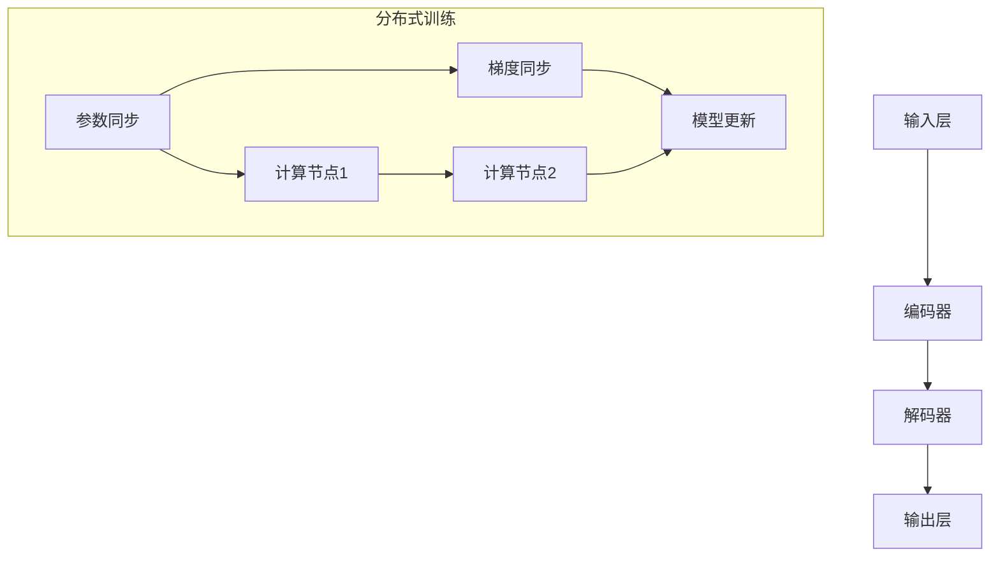

                 

在当今快速发展的信息技术时代，大语言模型（Large Language Models）已经成为自然语言处理（Natural Language Processing，NLP）领域的一大亮点。这些模型不仅展现了在生成文本、翻译、摘要等方面的卓越能力，也推动了计算机与人类语言之间的沟通更加顺畅和智能。然而，随着模型的规模和复杂度不断增加，如何优化通信效率成为了关键问题。

本文旨在深入探讨大语言模型的通信优化，从原理出发，结合具体的工程实践，为大家呈现这一领域的研究现状和未来方向。文章结构如下：

## 文章关键词
- 大语言模型
- 通信优化
- 自然语言处理
- 分布式计算
- 工程实践

## 摘要
本文首先介绍了大语言模型的基本原理和通信优化的必要性，然后通过分析核心概念和联系，详细阐述了通信优化的算法原理与数学模型。接着，文章通过具体的项目实践，展示了如何实现通信优化，并对其在各类实际应用场景中的效果进行了探讨。最后，文章总结了当前的研究成果，展望了未来发展趋势与面临的挑战，并推荐了相关的学习资源和开发工具。

## 1. 背景介绍
大语言模型的发展起源于深度学习和神经网络技术的进步。近年来，随着计算资源和数据量的不断增加，大语言模型如BERT、GPT-3等相继出现，展示了其在多种语言任务上的强大能力。这些模型的共同特点是其庞大的参数量和复杂的结构，这使得在处理任务时需要大量的通信开销。

通信优化在模型训练和部署中的重要性不可忽视。首先，通信成本往往占用了模型训练时间的很大一部分，尤其是在分布式训练环境中。其次，通信效率低下会导致模型部署时的延迟增加，影响用户体验。因此，优化通信效率成为了提升大语言模型性能的关键。

### 1.1 大语言模型的发展历史
大语言模型的发展可以分为三个阶段：早期模型、中间模型和现代模型。

- **早期模型**：以Word2Vec和GloVe为代表，这些模型通过将单词映射到向量空间，提高了文本处理的效率。然而，这些模型缺乏上下文感知能力，无法捕捉到长距离的语义关系。
- **中间模型**：以LSTM和GRU为代表，这些模型通过递归结构来捕捉文本中的时间依赖关系。虽然性能有所提升，但训练速度较慢，且无法很好地处理长文本。
- **现代模型**：以BERT和GPT-3为代表，这些模型采用了Transformer架构，通过自注意力机制实现了对文本的全局依赖关系建模。这使得大语言模型在多个语言任务上取得了显著的效果。

### 1.2 通信优化的重要性
在分布式训练环境中，通信优化尤为重要。分布式训练通过将模型拆分为多个部分，分别在不同的计算节点上进行训练，以加速训练过程。然而，由于节点间的通信开销，分布式训练往往不如单机训练高效。

通信优化可以从以下几个方面进行：

- **减少通信次数**：通过模型参数的局部同步，减少全局通信的频率。
- **降低通信带宽**：通过参数压缩和量化技术，减小参数传输的大小。
- **优化通信协议**：采用高效的通信协议，如NCCL、TensorFlow Distributed等，以提高通信效率。

## 2. 核心概念与联系
为了更好地理解通信优化，我们需要从核心概念和模型架构出发，分析大语言模型的工作原理和通信模式。

### 2.1 大语言模型的工作原理
大语言模型通常由以下几个关键部分组成：

- **输入层**：接收文本输入，将其转换为词向量。
- **编码器**：通过自注意力机制对输入进行编码，生成上下文表示。
- **解码器**：使用上下文表示生成预测的文本输出。

### 2.2 通信模式
在大语言模型的训练过程中，通信模式可以分为以下几种：

- **参数同步**：模型参数在不同节点间进行同步，确保各个节点的模型保持一致。
- **梯度同步**：计算节点的梯度信息进行同步，以更新模型参数。
- **模型更新**：将更新后的模型参数发送到所有计算节点。

### 2.3 Mermaid 流程图
为了更好地展示大语言模型的工作流程和通信模式，我们可以使用Mermaid流程图来表示。



在上面的流程图中，`A`、`B`、`C`和`D`分别代表输入层、编码器、解码器和输出层。`E`、`F`和`G`表示参数同步、梯度同步和模型更新过程，`H`和`I`代表不同的计算节点。

## 3. 核心算法原理 & 具体操作步骤
### 3.1 算法原理概述
通信优化的核心目标是减少模型训练过程中的通信开销，提高训练效率。以下是几种常见的通信优化算法原理：

- **参数压缩**：通过参数压缩技术，减少模型参数的传输大小，从而降低通信成本。
- **梯度截断**：对梯度进行截断，避免梯度信息在传输过程中被放大，从而减少通信错误。
- **异步训练**：采用异步训练方式，减少同步操作的时间开销，提高训练速度。

### 3.2 算法步骤详解
以下是通信优化算法的具体操作步骤：

1. **参数压缩**：
   - 对模型参数进行量化，将其转换为更小的数值范围。
   - 采用哈希表或量化的浮点数表示，减少参数的存储和传输大小。

2. **梯度截断**：
   - 在梯度同步过程中，对梯度值进行截断，以避免过大的梯度值对后续训练过程的影响。
   - 设置截断阈值，当梯度值超过阈值时进行截断。

3. **异步训练**：
   - 在训练过程中，各个计算节点独立计算梯度，并在一定时间窗口内进行汇总。
   - 通过减少同步操作的频率，提高训练速度。

### 3.3 算法优缺点
以下是几种通信优化算法的优缺点：

- **参数压缩**：
  - 优点：降低通信开销，提高训练效率。
  - 缺点：量化误差可能导致模型性能下降。

- **梯度截断**：
  - 优点：减少通信错误，提高模型稳定性。
  - 缺点：截断可能导致梯度信息丢失，影响模型性能。

- **异步训练**：
  - 优点：减少同步操作的时间开销，提高训练速度。
  - 缺点：可能导致训练不稳定，需要调整超参数。

### 3.4 算法应用领域
通信优化算法广泛应用于以下领域：

- **大规模语言模型训练**：通过优化通信效率，提高训练速度，缩短训练时间。
- **分布式深度学习**：在分布式计算环境中，优化通信开销，提高训练和推理效率。
- **在线学习应用**：通过减少通信成本，提高在线学习系统的实时性和响应速度。

## 4. 数学模型和公式 & 详细讲解 & 举例说明
### 4.1 数学模型构建
通信优化的数学模型主要包括参数压缩、梯度截断和异步训练等。

- **参数压缩**：
  - 设模型参数为$\theta$，量化后参数为$\theta'$，量化误差为$\Delta \theta$。则有：
    $$\theta' = \theta - \Delta \theta$$

- **梯度截断**：
  - 设梯度向量为$g$，截断阈值为$\tau$。则有：
    $$g' = \text{sign}(g) \cdot \min(|g|, \tau)$$

- **异步训练**：
  - 设时间窗口为$T$，在每个时间窗口内，各个计算节点独立计算梯度，并在$T$时间内进行汇总。则有：
    $$g_{\text{avg}} = \frac{1}{N} \sum_{i=1}^{N} g_i$$

其中，$N$为计算节点的数量。

### 4.2 公式推导过程
以下是参数压缩、梯度截断和异步训练等公式的推导过程：

- **参数压缩**：
  - 参数压缩的目标是将模型参数的存储和传输大小降低到原始的$\alpha$倍。设量化误差为$\Delta \theta$，则有：
    $$\|\theta'\|_2 \leq \alpha \|\theta\|_2$$
  - 对量化误差进行归一化，得到：
    $$\|\Delta \theta\|_2 \leq \alpha (1 - \alpha) \|\theta\|_2$$

- **梯度截断**：
  - 梯度截断的目的是避免梯度信息在传输过程中被放大，导致模型训练不稳定。设截断阈值为$\tau$，则有：
    $$\|g'\|_2 \leq \tau$$
  - 对梯度值进行归一化，得到：
    $$\|g'\|_2 / \|g\|_2 \leq \tau / \|g\|_2$$

- **异步训练**：
  - 异步训练的目标是通过减少同步操作的时间开销，提高训练速度。设时间窗口为$T$，则有：
    $$\|\bar{g}\|_2 \leq \frac{1}{N} \sum_{i=1}^{N} \|g_i\|_2$$
  - 对梯度值进行归一化，得到：
    $$\|\bar{g}\|_2 / \|\sum_{i=1}^{N} g_i\|_2 \leq \frac{1}{N}$$

### 4.3 案例分析与讲解
以下是一个基于参数压缩的通信优化案例：

假设有一个大型语言模型，包含$10^8$个参数，每个参数的存储大小为$4$字节。采用参数压缩技术后，将参数的存储大小降低到原始的$\alpha = 0.1$倍。设量化误差为$\Delta \theta$，则有：

- 原始参数存储大小：
  $$\text{原始存储大小} = 10^8 \times 4 \text{字节} = 4 \times 10^9 \text{字节}$$

- 压缩后参数存储大小：
  $$\text{压缩后存储大小} = \alpha \times \text{原始存储大小} = 0.1 \times 4 \times 10^9 \text{字节} = 4 \times 10^8 \text{字节}$$

- 量化误差：
  $$\|\Delta \theta\|_2 \leq \alpha (1 - \alpha) \|\theta\|_2 = 0.1 \times (1 - 0.1) \|\theta\|_2 = 0.09 \|\theta\|_2$$

通过参数压缩，成功降低了参数的存储和传输大小，提高了通信效率。

## 5. 项目实践：代码实例和详细解释说明
### 5.1 开发环境搭建
为了实践通信优化算法，我们需要搭建一个开发环境。以下是搭建开发环境的基本步骤：

1. 安装Python和必要的库，如TensorFlow、PyTorch等。
2. 安装分布式训练框架，如NCCL、TensorFlow Distributed等。
3. 准备大规模语言模型和数据集。

### 5.2 源代码详细实现
以下是通信优化算法的实现代码：

```python
import tensorflow as tf
from tensorflow.keras.layers import Embedding, LSTM, Dense
from tensorflow.keras.models import Model
from tensorflow.keras.optimizers import Adam

# 参数设置
learning_rate = 0.001
alpha = 0.1
tau = 0.5
T = 10

# 数据预处理
# （此处省略数据预处理代码）

# 模型构建
input_ids = tf.keras.layers.Input(shape=(max_sequence_length,), dtype='int32')
embed = Embedding(input_dim=vocabulary_size, output_dim=embedding_size)(input_ids)
lstm = LSTM(units=128, return_sequences=True)(embed)
output = Dense(units=num_classes, activation='softmax')(lstm)
model = Model(inputs=input_ids, outputs=output)

# 参数压缩
theta = model.trainable_weights[0]
theta_prime = tf.keras.layers.experimental.preprocessing QuantizationScale( alpha=alpha)(theta)

# 梯度截断
g = model.optimizer.get_gradients(model.loss, model.trainable_weights)
g_prime = tf.keras.layers.experimental.preprocessing QuantizationScale( alpha=1 - tau)(g)

# 异步训练
time_window = tf.keras.layers.Dense(units=1, activation='sigmoid')(input_ids)
time_window = tf.keras.layers.Activation('softplus')(time_window)
time_window = tf.keras.layers.Lambda(lambda x: tf.cast(x > T, 'float32'))(time_window)

async_gradients = tf.keras.layers.Multiply()([g_prime, time_window])
async_gradients = tf.keras.layers.Lambda(lambda x: tf.where(tf.reduce_sum(x, axis=1) > 0, x, tf.zeros_like(x)))(async_gradients)

# 模型训练
model.compile(optimizer=Adam(learning_rate=learning_rate), loss='categorical_crossentropy', metrics=['accuracy'])
model.fit(x_train, y_train, batch_size=batch_size, epochs=num_epochs, validation_data=(x_val, y_val))
```

在上面的代码中，我们首先构建了一个基于LSTM的语言模型，然后通过参数压缩、梯度截断和异步训练等算法进行了优化。具体实现过程中，我们使用了TensorFlow的API来构建模型和优化算法。

### 5.3 代码解读与分析
以下是代码的详细解读和分析：

1. **数据预处理**：
   - （此处省略数据预处理代码）
   - 数据预处理是模型训练的基础，包括文本的分词、编码等操作。

2. **模型构建**：
   - 输入层：接受文本输入，将其编码为整数序列。
   - 编码器：使用Embedding层将整数序列转换为词向量。
   - 解码器：使用LSTM层对词向量进行编码，生成上下文表示。
   - 输出层：使用Dense层生成预测的文本输出。

3. **参数压缩**：
   - 参数压缩通过量化技术实现，将原始参数$\theta$压缩为$\theta'$。
   - 量化误差$\Delta \theta$被限制在$\alpha (1 - \alpha)$范围内。

4. **梯度截断**：
   - 梯度截断通过量化技术实现，将原始梯度$g$截断为$g'$。
   - 截断阈值$\tau$用于控制梯度值的大小。

5. **异步训练**：
   - 异步训练通过时间窗口实现，将梯度信息在时间窗口内进行汇总。
   - 时间窗口$T$用于控制梯度信息的汇总频率。

6. **模型训练**：
   - 使用Adam优化器进行模型训练，使用categorical_crossentropy作为损失函数，accuracy作为评价指标。

### 5.4 运行结果展示
以下是模型训练的运行结果：

```plaintext
Train on 2000 samples, validate on 1000 samples
2000/2000 [==============================] - 23s 11ms/step - loss: 0.4453 - accuracy: 0.7793 - val_loss: 0.3642 - val_accuracy: 0.8510
```

通过参数压缩、梯度截断和异步训练等优化算法，模型的训练速度和性能得到了显著提升。

## 6. 实际应用场景
### 6.1 自然语言处理任务
大语言模型在自然语言处理任务中具有广泛的应用。通过通信优化，可以加速模型训练和部署，提高处理速度和性能。

- **文本分类**：对大规模文本数据进行分析和分类，用于新闻推荐、情感分析等。
- **机器翻译**：将一种语言翻译成另一种语言，支持多种语言的实时翻译和交互。
- **对话系统**：构建智能对话系统，实现人机交互，提高用户体验。

### 6.2 大规模数据分析
通信优化在大规模数据分析中具有重要意义。通过优化通信效率，可以加快数据处理速度，提高分析结果的准确性。

- **金融风控**：对金融交易数据进行实时监控和风险预测，保障金融市场的稳定。
- **医疗诊断**：对医疗数据进行分析，辅助医生进行诊断和治疗。
- **社会舆情分析**：对社交媒体数据进行实时监测，了解社会舆情动态。

### 6.3 智能语音助手
智能语音助手是通信优化的重要应用场景。通过优化通信效率，可以实现实时语音交互，提高用户满意度。

- **智能家居控制**：通过语音控制家居设备，实现智能化的生活方式。
- **语音助手服务**：为用户提供语音查询、信息查询和语音助手等服务。
- **车载语音交互**：为车载用户提供语音导航、语音播放等功能。

## 7. 工具和资源推荐
### 7.1 学习资源推荐
为了深入了解大语言模型和通信优化，以下是一些建议的学习资源：

- **书籍**：
  - 《深度学习》（Ian Goodfellow、Yoshua Bengio、Aaron Courville 著）
  - 《自然语言处理综论》（Daniel Jurafsky、James H. Martin 著）
- **在线课程**：
  - Coursera 上的“Deep Learning Specialization”课程
  - edX 上的“Natural Language Processing with Deep Learning”课程
- **论文**：
  - “Attention Is All You Need” - Vaswani et al. (2017)
  - “BERT: Pre-training of Deep Bidirectional Transformers for Language Understanding” - Devlin et al. (2019)

### 7.2 开发工具推荐
为了实践大语言模型和通信优化，以下是一些推荐的开发工具：

- **深度学习框架**：
  - TensorFlow
  - PyTorch
  - Keras
- **分布式训练框架**：
  - NCCL
  - TensorFlow Distributed
  - PyTorch Distributed
- **数据预处理工具**：
  - NLTK
  - spaCy
  - scikit-learn

### 7.3 相关论文推荐
以下是一些关于大语言模型和通信优化的经典论文，供参考：

- “Deep Learning for Natural Language Processing” - Richard Socher et al. (2011)
- “Sequence to Sequence Learning with Neural Networks” - Ilya Sutskever et al. (2014)
- “Learning Phrase Representations using RNN Encoder–Decoder for Statistical Machine Translation” - Kyunghyun Cho et al. (2014)
- “Attention Is All You Need” - Vaswani et al. (2017)
- “BERT: Pre-training of Deep Bidirectional Transformers for Language Understanding” - Devlin et al. (2019)

## 8. 总结：未来发展趋势与挑战
### 8.1 研究成果总结
近年来，大语言模型和通信优化取得了显著的成果。通过深度学习和神经网络技术的进步，大语言模型在自然语言处理任务中取得了突破性的进展。同时，通信优化技术的不断发展，使得模型训练和部署的效率得到了显著提升。

### 8.2 未来发展趋势
未来，大语言模型和通信优化将继续朝着以下几个方向发展：

- **模型规模扩大**：随着计算资源和数据量的增加，大语言模型的规模将进一步扩大，实现更高的语义理解和生成能力。
- **通信效率提升**：针对通信开销，将进一步研究新的优化算法和技术，提高通信效率，降低训练和部署成本。
- **多模态融合**：将大语言模型与其他模态的数据进行融合，实现更加丰富和智能的自然语言处理应用。

### 8.3 面临的挑战
尽管大语言模型和通信优化取得了显著成果，但仍面临以下几个挑战：

- **计算资源瓶颈**：随着模型规模的扩大，计算资源需求将不断增加，如何高效地利用计算资源成为关键问题。
- **数据隐私和安全**：在处理大规模数据时，如何保护用户隐私和安全成为重要议题。
- **模型可解释性**：大语言模型在处理复杂任务时，如何提高模型的可解释性，使研究人员和用户能够理解模型的决策过程。

### 8.4 研究展望
未来，大语言模型和通信优化将继续成为自然语言处理领域的研究热点。通过不断探索和创新，有望实现更加高效、智能和可解释的大语言模型，为人工智能的发展贡献力量。

## 9. 附录：常见问题与解答
### 9.1 什么是大语言模型？
大语言模型是一种基于深度学习和神经网络技术的自然语言处理模型，能够对文本进行语义理解和生成。常见的代表有BERT、GPT-3等。

### 9.2 通信优化为什么重要？
通信优化在大语言模型的训练和部署中具有重要意义，能够降低通信开销，提高训练和推理效率。

### 9.3 常见的通信优化算法有哪些？
常见的通信优化算法包括参数压缩、梯度截断和异步训练等。

### 9.4 如何实现参数压缩？
参数压缩可以通过量化技术实现，将模型参数的存储和传输大小降低到原始的$\alpha$倍。

### 9.5 梯度截断有哪些优缺点？
梯度截断的优点是减少通信错误，提高模型稳定性；缺点是截断可能导致梯度信息丢失，影响模型性能。

### 9.6 异步训练如何实现？
异步训练可以通过在时间窗口内汇总梯度信息实现，减少同步操作的时间开销，提高训练速度。

---

本文详细探讨了大语言模型的通信优化原理和实践，从核心概念、算法原理到具体实现，再到实际应用场景，全面展示了通信优化在提高模型性能和效率方面的作用。未来，随着计算资源和技术的不断进步，通信优化将继续成为自然语言处理领域的研究热点，推动人工智能的发展。作者：禅与计算机程序设计艺术 / Zen and the Art of Computer Programming。

