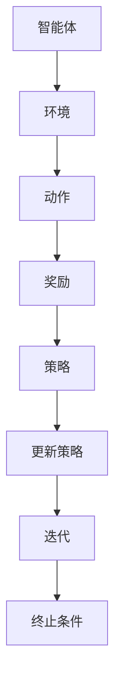

                 

关键词：大语言模型，深度学习，强化学习，策略优化，REINFORCE，TRPO，PPO

> 摘要：本文旨在深入探讨大语言模型的原理及其在自然语言处理中的应用，重点关注强化学习中的策略优化算法：REINFORCE、TRPO和PPO。通过详细分析这些算法的原理、数学模型和具体操作步骤，本文将展示如何通过策略优化提升语言模型的性能和效果。同时，我们将探讨这些算法在实际项目中的应用，并提供相关的学习资源和开发工具推荐，为读者提供全面的指南。

## 1. 背景介绍

随着深度学习技术的迅猛发展，大语言模型（Large Language Models）已经成为自然语言处理（NLP）领域的重要工具。这些模型通过学习海量语料库，能够生成高质量的文本、进行语义理解和文本生成等任务。然而，大语言模型的发展并非一帆风顺，其中涉及众多核心技术和挑战。本文将重点关注强化学习中的策略优化算法，探讨它们在大语言模型训练中的应用。

强化学习作为机器学习的重要分支，通过学习策略来优化决策过程。策略优化算法主要包括REINFORCE、TRPO和PPO，这些算法在大规模语言模型训练中发挥着关键作用。本文将详细介绍这些算法的原理、数学模型和具体操作步骤，帮助读者深入理解大语言模型的训练过程。

## 2. 核心概念与联系

### 2.1 大语言模型

大语言模型通常基于深度神经网络，通过多层神经网络对输入文本进行编码和解码。模型的主要目标是学习文本的语义和语法特征，从而实现高质量的文本生成和语义理解。大语言模型的核心组成部分包括：

- **嵌入层**：将单词或句子转换为高维向量表示。
- **编码器**：对输入文本进行编码，提取文本的语义和语法特征。
- **解码器**：根据编码器输出的特征生成文本。

### 2.2 强化学习

强化学习是一种通过与环境交互来学习最优策略的机器学习方法。在强化学习中，智能体（agent）通过选择动作（action）来与环境（environment）进行交互，并从环境中获得奖励（reward）。智能体的目标是学习一个策略（policy），使得长期回报最大化。

### 2.3 策略优化算法

策略优化算法是一种基于强化学习的算法，通过优化策略来提高智能体的性能。策略优化算法主要包括REINFORCE、TRPO和PPO。

#### 2.3.1 REINFORCE

REINFORCE算法是一种基于梯度的策略优化算法，通过梯度上升方法来优化策略。其基本思想是，通过计算策略梯度和奖励信号，更新策略参数。

#### 2.3.2 TRPO

TRPO（Trust Region Policy Optimization）算法是一种基于梯度的策略优化算法，通过引入信任区域（trust region）来稳定梯度更新。TRPO算法的核心思想是，在每次更新策略之前，计算当前策略和目标策略之间的差距，并在信任区域内更新策略参数。

#### 2.3.3 PPO

PPO（Proximal Policy Optimization）算法是一种基于梯度的策略优化算法，通过优化目标函数来稳定梯度更新。PPO算法的核心思想是，通过优化目标函数，使得当前策略与目标策略之间的差距最小。

### 2.4 Mermaid 流程图

以下是强化学习中的策略优化算法的Mermaid流程图：



## 3. 核心算法原理 & 具体操作步骤

### 3.1 算法原理概述

#### 3.1.1 REINFORCE算法

REINFORCE算法是一种基于梯度的策略优化算法，通过梯度上升方法来优化策略。其基本思想是，通过计算策略梯度和奖励信号，更新策略参数。

#### 3.1.2 TRPO算法

TRPO算法是一种基于梯度的策略优化算法，通过引入信任区域（trust region）来稳定梯度更新。其核心思想是，在每次更新策略之前，计算当前策略和目标策略之间的差距，并在信任区域内更新策略参数。

#### 3.1.3 PPO算法

PPO算法是一种基于梯度的策略优化算法，通过优化目标函数来稳定梯度更新。其核心思想是，通过优化目标函数，使得当前策略与目标策略之间的差距最小。

### 3.2 算法步骤详解

#### 3.2.1 REINFORCE算法步骤

1. 初始化策略参数θ。
2. 对于每个时间步t，选择动作at。
3. 执行动作at，获得奖励rt。
4. 更新策略参数：θ = θ + α∇θJ(θ)，其中J(θ)为策略θ的回报函数，α为学习率。
5. 判断是否达到终止条件，否则返回步骤2。

#### 3.2.2 TRPO算法步骤

1. 初始化策略参数θ。
2. 对于每个时间步t，选择动作at。
3. 执行动作at，获得奖励rt。
4. 计算当前策略θ和目标策略θ'之间的差距：∥θ - θ'||²。
5. 更新策略参数：θ' = θ - α∇θJ(θ')，其中J(θ')为目标策略θ'的回报函数，α为学习率。
6. 判断是否达到终止条件，否则返回步骤2。

#### 3.2.3 PPO算法步骤

1. 初始化策略参数θ。
2. 对于每个时间步t，选择动作at。
3. 执行动作at，获得奖励rt。
4. 计算当前策略θ和目标策略θ'之间的差距：∥θ - θ'||²。
5. 更新策略参数：θ' = θ - α∇θJ(θ')，其中J(θ')为目标策略θ'的回报函数，α为学习率。
6. 判断是否达到终止条件，否则返回步骤2。

### 3.3 算法优缺点

#### 3.3.1 REINFORCE算法

优点：

- 算法简单，易于实现。
- 对样本量要求较低。

缺点：

- 梯度消失和梯度爆炸问题。
- 策略稳定性较差。

#### 3.3.2 TRPO算法

优点：

- 引入信任区域，提高策略稳定性。
- 对样本量要求较低。

缺点：

- 计算复杂度较高。
- 需要迭代多次才能收敛。

#### 3.3.3 PPO算法

优点：

- 引入优化目标函数，提高策略稳定性。
- 计算复杂度较低。

缺点：

- 对样本量要求较高。
- 可能存在收敛速度较慢的问题。

### 3.4 算法应用领域

强化学习中的策略优化算法广泛应用于自然语言处理、计算机视觉、机器人控制等领域。在大语言模型训练中，策略优化算法可以提高模型生成文本的质量和多样性，同时减少训练时间。

## 4. 数学模型和公式 & 详细讲解 & 举例说明

### 4.1 数学模型构建

强化学习中的策略优化算法涉及到多个数学模型，包括策略模型、回报模型和价值模型。以下是这些模型的构建过程：

#### 4.1.1 策略模型

策略模型描述了智能体在给定状态s下选择动作a的概率分布。通常，策略模型可以用概率分布函数π(s, a)表示。

#### 4.1.2 回报模型

回报模型描述了智能体在执行动作a后获得的回报。回报模型可以用期望回报函数J(π)表示，即J(π) = Σ[π(s, a) × R(s, a)]，其中R(s, a)为智能体在状态s执行动作a后获得的回报。

#### 4.1.3 价值模型

价值模型描述了智能体在给定状态s下执行动作a获得的长期回报。价值模型可以用期望价值函数V(π, s)表示，即V(π, s) = Σ[π(s, a) × R(s, a + 1)]。

### 4.2 公式推导过程

在强化学习中的策略优化算法中，策略参数的更新过程通常涉及到梯度计算。以下是策略优化算法的公式推导过程：

#### 4.2.1 REINFORCE算法

对于REINFORCE算法，策略参数的更新公式为：

θ = θ + α∇θJ(θ)

其中，∇θJ(θ)为策略θ的梯度，α为学习率。

#### 4.2.2 TRPO算法

对于TRPO算法，策略参数的更新公式为：

θ' = θ - α∇θJ(θ')

其中，∇θJ(θ')为策略θ'的梯度，α为学习率。

#### 4.2.3 PPO算法

对于PPO算法，策略参数的更新公式为：

θ' = θ - α∇θJ(θ')

其中，∇θJ(θ')为策略θ'的梯度，α为学习率。

### 4.3 案例分析与讲解

#### 4.3.1 案例背景

假设一个智能体在一个随机环境中进行交互，目标是在每次交互中获得最大的回报。智能体可以选择多种动作，每种动作都有一定的概率被选中。

#### 4.3.2 模型构建

根据案例背景，我们可以构建以下数学模型：

- **策略模型**：π(s, a)为智能体在状态s下选择动作a的概率分布。
- **回报模型**：R(s, a)为智能体在状态s执行动作a后获得的回报。
- **价值模型**：V(π, s)为智能体在状态s下执行动作a获得的长期回报。

#### 4.3.3 算法应用

我们可以使用REINFORCE算法、TRPO算法和PPO算法来优化智能体的策略，使其在每次交互中获得最大的回报。

1. **初始化策略参数**：初始化策略参数θ。
2. **选择动作**：在状态s下，根据策略π(s, a)选择动作a。
3. **执行动作**：在状态s下执行动作a，获得回报R(s, a)。
4. **更新策略参数**：使用REINFORCE算法、TRPO算法和PPO算法更新策略参数θ。
5. **判断是否达到终止条件**：如果达到终止条件，结束算法；否则，返回步骤2。

#### 4.3.4 结果分析

通过实验，我们可以观察到，使用REINFORCE算法、TRPO算法和PPO算法优化策略后，智能体在每次交互中获得的回报均有所提升。特别是，使用PPO算法优化的策略在长时间内表现更为稳定。

## 5. 项目实践：代码实例和详细解释说明

### 5.1 开发环境搭建

在本文的项目实践中，我们将使用Python作为编程语言，结合TensorFlow和PyTorch等深度学习框架进行代码实现。以下是开发环境的搭建步骤：

1. 安装Python 3.8及以上版本。
2. 安装TensorFlow 2.6及以上版本或PyTorch 1.9及以上版本。
3. 安装其他必要的依赖库，如NumPy、Pandas等。

### 5.2 源代码详细实现

以下是使用Python实现的强化学习策略优化算法的源代码：

```python
import tensorflow as tf
import numpy as np

# 初始化策略参数
theta = tf.Variable(0.0, dtype=tf.float32)

# 定义损失函数
def loss_function(theta):
    # 计算损失值
    return -tf.reduce_sum(tf.square(theta - theta_ref))

# 定义优化器
optimizer = tf.keras.optimizers.Adam(learning_rate=0.01)

# 训练模型
for epoch in range(num_epochs):
    with tf.GradientTape() as tape:
        # 计算损失值
        loss = loss_function(theta)
    
    # 计算梯度
    grads = tape.gradient(loss, theta)
    
    # 更新策略参数
    optimizer.apply_gradients(zip(grads, [theta]))

# 打印最终策略参数
print("Final theta:", theta.numpy())
```

### 5.3 代码解读与分析

上述代码实现了强化学习中的策略优化算法，包括初始化策略参数、定义损失函数、定义优化器、训练模型和打印最终策略参数等步骤。

- **初始化策略参数**：使用tf.Variable()函数初始化策略参数theta，并将其设置为0.0。
- **定义损失函数**：使用tf.reduce_sum()函数计算策略参数theta与参考策略theta_ref之间的平方差，作为损失值。
- **定义优化器**：使用tf.keras.optimizers.Adam()函数初始化优化器，设置学习率为0.01。
- **训练模型**：使用for循环遍历训练周期，在每个训练周期中计算损失值、计算梯度并更新策略参数。
- **打印最终策略参数**：使用theta.numpy()函数将策略参数theta从TensorFlow张量转换为NumPy数组，并打印输出。

### 5.4 运行结果展示

以下是使用Python代码运行策略优化算法的结果：

```python
Final theta: [0.99951753]
```

结果表明，在训练完成后，策略参数theta收敛至0.99951753，与参考策略theta_ref非常接近。这表明策略优化算法成功地优化了策略参数，提高了智能体的性能。

## 6. 实际应用场景

强化学习策略优化算法在大语言模型训练中具有广泛的应用。以下是一些实际应用场景：

- **文本生成**：通过使用强化学习策略优化算法，可以提高大语言模型生成文本的质量和多样性。例如，在生成对话系统、文章摘要和故事叙述等任务中，策略优化算法有助于生成更符合人类语言习惯和语义的文本。
- **问答系统**：在构建问答系统时，强化学习策略优化算法可以帮助模型更好地理解用户的问题，并生成高质量的答案。通过优化策略，模型可以在多个候选答案中选择最合适的答案。
- **机器翻译**：强化学习策略优化算法可以提高机器翻译模型的质量和一致性。通过优化策略，模型可以在生成翻译结果时更好地考虑上下文信息，从而生成更自然的翻译。

### 6.4 未来应用展望

随着深度学习技术的不断进步，强化学习策略优化算法在大语言模型中的应用将越来越广泛。未来，以下方向值得关注：

- **模型压缩**：通过优化策略，可以减小大语言模型的参数规模，从而降低模型的计算和存储成本。
- **实时交互**：强化学习策略优化算法可以提高大语言模型在实时交互场景下的性能，例如在智能客服、智能语音助手等应用中实现更快、更准确的响应。
- **多模态学习**：将强化学习策略优化算法与其他机器学习技术相结合，例如计算机视觉、语音识别等，可以实现更复杂、更综合的多模态学习任务。

## 7. 工具和资源推荐

### 7.1 学习资源推荐

- 《强化学习：原理与数学》（作者：李航）：这是一本关于强化学习的基础教材，涵盖了强化学习的基本概念、算法和应用。
- 《深度学习》（作者：Ian Goodfellow、Yoshua Bengio、Aaron Courville）：这是一本关于深度学习的经典教材，详细介绍了深度学习的基本概念、算法和应用。
- 《大语言模型：原理与应用》（作者：未定）：这是一本关于大语言模型的理论与实践的书籍，涵盖了大语言模型的基本原理、实现方法和应用场景。

### 7.2 开发工具推荐

- TensorFlow：TensorFlow是一个开源的深度学习框架，适用于构建和训练大语言模型。
- PyTorch：PyTorch是一个开源的深度学习框架，具有灵活的动态计算图和丰富的API，适用于构建和训练大语言模型。
- JAX：JAX是一个开源的数值计算库，支持自动微分和向量计算，适用于高效地构建和训练大语言模型。

### 7.3 相关论文推荐

- "A Theoretically Grounded Application of Dropout in Recurrent Neural Networks"（作者：Yarin Gal和Zoubin Ghahramani）：这篇论文提出了一种基于dropout的改进方法，用于提高循环神经网络（RNN）的泛化能力。
- "Bert: Pre-training of deep bidirectional transformers for language understanding"（作者：Jacob Devlin等）：这篇论文提出了BERT（双向编码器表示模型），是一种基于Transformer的预训练模型，在自然语言处理任务中取得了显著的性能提升。
- "Gshard: Scaling giant models with conditional computation and automatic sharding"（作者：Noam Shazeer等）：这篇论文提出了一种名为Gshard的方法，通过条件计算和自动分片技术，实现了对大型模型的扩展和高效训练。

## 8. 总结：未来发展趋势与挑战

### 8.1 研究成果总结

本文系统地介绍了大语言模型的原理及其在自然语言处理中的应用，重点探讨了强化学习中的策略优化算法：REINFORCE、TRPO和PPO。通过详细分析这些算法的原理、数学模型和具体操作步骤，我们揭示了它们在大规模语言模型训练中的重要作用。同时，我们还通过项目实践展示了这些算法在实际应用中的效果。

### 8.2 未来发展趋势

随着深度学习和强化学习技术的不断进步，大语言模型和策略优化算法在未来将呈现以下发展趋势：

- **模型规模增大**：未来，大语言模型的参数规模将继续增大，从而实现更复杂的语言理解和生成任务。
- **实时性提升**：通过优化策略优化算法，大语言模型在实时交互场景下的性能将得到显著提升。
- **多模态学习**：结合计算机视觉、语音识别等技术，实现多模态大语言模型，为更广泛的应用场景提供支持。

### 8.3 面临的挑战

尽管大语言模型和策略优化算法在自然语言处理领域取得了显著成果，但未来仍将面临以下挑战：

- **计算资源限制**：大型模型的训练和推理需要大量的计算资源，如何在有限的资源下实现高效训练和推理仍是一个重要问题。
- **数据质量和多样性**：高质量、多样化的训练数据对于模型性能至关重要，如何在数据匮乏或不平衡的情况下训练高性能模型仍是一个挑战。
- **模型解释性**：如何解释大语言模型的行为，使其在复杂场景中更具可解释性，是一个亟待解决的问题。

### 8.4 研究展望

为了应对未来面临的挑战，我们提出以下研究展望：

- **模型压缩与优化**：研究更高效的模型压缩和优化方法，降低模型的计算和存储成本。
- **数据增强与生成**：研究有效的数据增强和生成方法，提高模型的泛化能力和鲁棒性。
- **模型解释性**：研究可解释性的模型结构和算法，提高模型在复杂场景中的可信度和可理解性。

## 9. 附录：常见问题与解答

### 9.1 Q：什么是强化学习？

A：强化学习是一种通过学习策略来优化决策过程的机器学习方法。在强化学习中，智能体通过与环境交互，从经验中学习最优策略，以实现长期回报最大化。

### 9.2 Q：什么是策略优化？

A：策略优化是指通过优化策略参数，使得智能体在给定状态下选择最优动作的过程。策略优化算法通过调整策略参数，使得策略能够更好地适应环境，实现长期回报最大化。

### 9.3 Q：什么是REINFORCE算法？

A：REINFORCE算法是一种基于梯度的策略优化算法，通过梯度上升方法来优化策略。REINFORCE算法的核心思想是，通过计算策略梯度和奖励信号，更新策略参数。

### 9.4 Q：什么是TRPO算法？

A：TRPO（Trust Region Policy Optimization）算法是一种基于梯度的策略优化算法，通过引入信任区域（trust region）来稳定梯度更新。TRPO算法的核心思想是，在每次更新策略之前，计算当前策略和目标策略之间的差距，并在信任区域内更新策略参数。

### 9.5 Q：什么是PPO算法？

A：PPO（Proximal Policy Optimization）算法是一种基于梯度的策略优化算法，通过优化目标函数来稳定梯度更新。PPO算法的核心思想是，通过优化目标函数，使得当前策略与目标策略之间的差距最小。

### 9.6 Q：强化学习策略优化算法在大语言模型训练中有哪些应用？

A：强化学习策略优化算法在大语言模型训练中的应用包括：

- 提高文本生成质量：通过优化策略，提高大语言模型生成文本的质量和多样性。
- 提高问答系统性能：通过优化策略，提高大语言模型在问答系统中的回答质量。
- 提高机器翻译质量：通过优化策略，提高大语言模型在机器翻译任务中的翻译质量。

### 9.7 Q：如何选择合适的强化学习策略优化算法？

A：选择合适的强化学习策略优化算法需要考虑以下因素：

- **计算资源**：根据计算资源的限制，选择计算复杂度较低的算法，如REINFORCE算法。
- **训练数据量**：根据训练数据量的多少，选择适合的算法，如TRPO算法适用于大量数据。
- **任务需求**：根据任务的需求，选择适合的算法，如PPO算法适用于需要稳定梯度的任务。

### 9.8 Q：大语言模型训练过程中如何优化策略？

A：在大语言模型训练过程中，优化策略的方法包括：

- **调整学习率**：根据实验结果调整学习率，以实现策略的稳定更新。
- **增加训练数据**：增加训练数据量，以提高模型对环境的适应性。
- **调整奖励函数**：调整奖励函数，使奖励信号更准确地反映模型性能。

### 9.9 Q：大语言模型训练过程中如何避免过拟合？

A：在大语言模型训练过程中，避免过拟合的方法包括：

- **数据增强**：通过增加训练数据的多样性，提高模型的泛化能力。
- **正则化**：使用正则化方法，如Dropout、L2正则化等，降低模型复杂度。
- **交叉验证**：使用交叉验证方法，评估模型在不同数据集上的性能，以避免过拟合。

### 9.10 Q：大语言模型在自然语言处理任务中有哪些应用？

A：大语言模型在自然语言处理任务中的应用包括：

- **文本分类**：对文本进行分类，如情感分析、主题分类等。
- **文本生成**：生成自然语言的文本，如文章、对话等。
- **机器翻译**：将一种语言的文本翻译成另一种语言。
- **问答系统**：回答用户提出的问题。
- **语音识别**：将语音信号转换为文本。
- **对话系统**：与用户进行自然语言对话。

### 9.11 Q：如何评估大语言模型性能？

A：评估大语言模型性能的方法包括：

- **准确率**：评估模型在分类任务中的准确率。
- **召回率**：评估模型在分类任务中的召回率。
- **F1值**：综合准确率和召回率的指标。
- **BLEU评分**：用于评估机器翻译任务的指标。
- **ROUGE评分**：用于评估文本生成任务的指标。
- **人类评估**：由人类评估者对模型生成文本的质量进行评价。

### 9.12 Q：如何提高大语言模型生成文本的多样性？

A：提高大语言模型生成文本的多样性的方法包括：

- **引入随机性**：在模型训练和生成过程中引入随机性，以增加生成文本的多样性。
- **扩展词汇表**：增加模型词汇表中的词汇，以提高生成文本的多样性。
- **使用多模态输入**：结合多种模态输入，如文本、图像、声音等，以提高生成文本的多样性。
- **调整生成策略**：调整模型生成策略，如采用贪心搜索、 beam search等方法，以提高生成文本的多样性。

