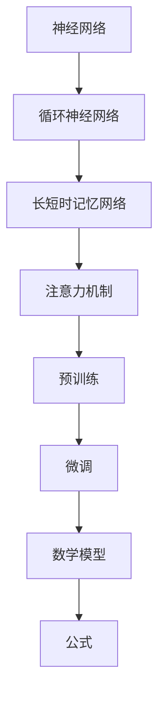

                 

关键词：大语言模型，自然语言处理，神经网络，深度学习，注意力机制，预训练，自适应学习，知识图谱，推理引擎，跨模态交互。

> 摘要：本文旨在深入探讨大语言模型的原理、技术基础及其在自然语言处理领域的应用前沿。文章首先回顾了自然语言处理的发展历程，随后详细解析了大语言模型的核心组成部分，包括神经网络、注意力机制、预训练技术等。接着，文章深入讨论了数学模型与公式在大语言模型中的应用，并结合实际案例进行讲解。文章还通过一个项目实践实例，展示了大语言模型的具体实现过程。最后，文章展望了大语言模型在实际应用场景中的未来发展，并提出了可能的挑战和解决方案。

## 1. 背景介绍

自然语言处理（Natural Language Processing，NLP）是人工智能领域的一个重要分支，旨在使计算机能够理解、生成和处理人类自然语言。自20世纪50年代以来，NLP经历了多个阶段的发展。早期的NLP主要依赖于规则驱动的方法，如语法分析和词性标注。这些方法在处理简单任务时表现良好，但随着自然语言的复杂性和多样性的增加，这些方法的局限性逐渐显现。

进入21世纪，随着计算能力的提升和大数据的涌现，基于统计和机器学习的方法开始在NLP领域中占据主导地位。深度学习技术的发展，尤其是神经网络和注意力机制的引入，使得NLP系统在处理自然语言时取得了显著的进步。大语言模型（Large Language Model）正是这一阶段的产物，它们在文本生成、机器翻译、问答系统等领域展现了强大的能力。

大语言模型的基本原理可以追溯到循环神经网络（RNN）和长短时记忆网络（LSTM）。这些模型能够通过学习大量的文本数据，捕捉语言中的复杂模式和依赖关系。然而，随着数据量和参数量的增加，模型的计算复杂度和存储需求也急剧上升。为了解决这一问题，研究人员提出了预训练技术，通过在大量未标记的数据上进行预训练，然后再针对特定任务进行微调。

本文将深入探讨大语言模型的原理和技术基础，分析其核心组成部分和关键算法，并通过实际项目实例展示其应用效果。最后，文章还将展望大语言模型在未来的发展趋势和面临的挑战。

## 2. 核心概念与联系

为了更好地理解大语言模型，我们需要先了解其核心概念和组成部分。以下是本文所涉及的核心概念及其相互关系：

### 2.1 神经网络

神经网络（Neural Network）是模仿人脑神经元连接方式而构建的计算模型。它由大量的神经元（或节点）通过加权连接组成。每个神经元接收来自其他神经元的输入信号，通过加权求和后经过激活函数产生输出。神经网络通过学习输入和输出之间的映射关系，可以用于分类、回归、生成等多种任务。

### 2.2 循环神经网络（RNN）

循环神经网络（Recurrent Neural Network，RNN）是神经网络的一种特殊形式，特别适用于处理序列数据。与传统的前向神经网络不同，RNN具有记忆功能，能够记住前面的输入信息，并将其用于后续的计算。这使得RNN在处理语言序列时能够捕捉到上下文信息，但传统的RNN存在梯度消失和梯度爆炸的问题，限制了其在长序列任务中的应用。

### 2.3 长短时记忆网络（LSTM）

长短时记忆网络（Long Short-Term Memory，LSTM）是RNN的一种改进模型，旨在解决传统RNN的梯度消失问题。LSTM通过引入记忆单元和三个门（输入门、遗忘门、输出门）来控制信息的流动，能够在长序列中保持长期的依赖关系。这使得LSTM在语言建模和序列预测任务中表现出色。

### 2.4 注意力机制

注意力机制（Attention Mechanism）是深度学习中的一个关键概念，用于处理输入序列中不同位置的重要程度。在语言模型中，注意力机制允许模型在解码过程中关注输入序列的不同部分，从而提高模型的生成质量。注意力机制通过计算注意力权重来分配注意力，使得模型能够更加灵活地捕捉上下文信息。

### 2.5 预训练与微调

预训练（Pre-training）是指在大规模未标记数据上进行模型训练，以获得通用的语言表示能力。预训练后，模型可以通过微调（Fine-tuning）来适应特定任务。预训练技术使得模型能够从大量无监督数据中学习，从而提高其性能和泛化能力。

### 2.6 数学模型与公式

数学模型和公式是大语言模型的核心组成部分，用于描述模型的结构和参数更新过程。常见的数学模型包括损失函数、梯度下降算法、正则化技术等。公式则用于表示模型的参数、权重和优化目标。

### 2.7 Mermaid 流程图

为了更好地理解大语言模型的组成部分和交互关系，我们使用Mermaid流程图来展示其核心流程。以下是Mermaid流程图：



在上面的流程图中，每个节点代表一个核心概念，箭头表示它们之间的相互关系。通过流程图，我们可以清晰地看到大语言模型的各个组成部分及其相互联系。

## 3. 核心算法原理 & 具体操作步骤

### 3.1 算法原理概述

大语言模型的算法原理主要基于深度学习中的循环神经网络（RNN）、长短时记忆网络（LSTM）和注意力机制。以下是这些算法的简要概述：

- **循环神经网络（RNN）**：RNN通过记忆前一个时间步的输出，并将其用于当前时间步的输入，从而能够处理序列数据。RNN的主要挑战在于梯度消失和梯度爆炸问题，这限制了其在长序列任务中的应用。

- **长短时记忆网络（LSTM）**：LSTM通过引入记忆单元和三个门（输入门、遗忘门、输出门）来控制信息的流动，解决了传统RNN的梯度消失问题。LSTM能够在长序列中保持长期的依赖关系，从而在语言建模和序列预测任务中表现出色。

- **注意力机制**：注意力机制通过计算注意力权重，使得模型能够在解码过程中关注输入序列的不同部分。注意力机制提高了模型的生成质量，使其能够更好地捕捉上下文信息。

### 3.2 算法步骤详解

以下是构建大语言模型的步骤：

1. **数据预处理**：首先，对文本数据进行分析和预处理，包括分词、词性标注、词向量嵌入等。这些预处理步骤有助于将原始文本数据转换为模型可处理的格式。

2. **构建神经网络结构**：根据任务需求，构建基于RNN、LSTM或注意力机制的神经网络结构。常见的结构包括单一神经网络层、多层神经网络和双向神经网络。

3. **预训练**：在大量未标记的数据上进行预训练，以获得通用的语言表示能力。预训练过程通常使用自回归语言模型（ARLM）或掩码语言模型（MLM）。

4. **微调**：在预训练的基础上，针对特定任务进行微调。微调过程通过调整模型参数，使其适应特定任务的需求。

5. **优化目标**：设定优化目标，如交叉熵损失函数，用于衡量模型输出与真实标签之间的差距。

6. **训练与验证**：通过迭代训练和验证，不断调整模型参数，以优化模型性能。

7. **评估与部署**：对训练完成的模型进行评估，包括准确率、召回率、F1值等指标。评估结果表明，模型在特定任务上具有良好的性能后，可以部署到实际应用中。

### 3.3 算法优缺点

- **优点**：大语言模型具有以下优点：

  - **强大的表示能力**：通过预训练，大语言模型能够学习到丰富的语言特征，从而在多种自然语言处理任务中表现出色。

  - **灵活的微调能力**：预训练后，模型可以通过微调快速适应特定任务，降低任务特定的训练成本。

  - **良好的泛化能力**：大语言模型在大量未标记数据上进行预训练，具有较好的泛化能力，能够在未见过的数据上表现良好。

- **缺点**：大语言模型也存在一些缺点：

  - **计算复杂度**：随着模型规模的增大，计算复杂度和存储需求急剧上升，对计算资源和硬件性能有较高要求。

  - **数据依赖性**：大语言模型依赖于大量的训练数据，数据质量和数量对模型性能有重要影响。

  - **解释性不足**：深度学习模型通常被视为“黑箱”，其内部决策过程难以解释，这对于一些需要解释性强的应用场景是一个挑战。

### 3.4 算法应用领域

大语言模型在自然语言处理领域具有广泛的应用，包括但不限于以下领域：

- **文本生成**：大语言模型可以生成高质量的文本，包括文章、故事、对话等。例如，OpenAI的GPT-3模型能够生成连贯且具有创意性的文本。

- **机器翻译**：大语言模型在机器翻译任务中表现出色，能够实现高质量的双语翻译。例如，Google翻译使用的神经机器翻译模型。

- **问答系统**：大语言模型可以构建智能问答系统，能够理解用户的问题，并给出准确的答案。例如，微软的Chatbot和苹果的Siri。

- **情感分析**：大语言模型可以通过分析文本的情感倾向，用于情感分类和舆情监测。例如，社交媒体的情感分析。

- **对话系统**：大语言模型可以构建对话系统，实现与用户的自然语言交互。例如，智能客服和虚拟助手。

## 4. 数学模型和公式 & 详细讲解 & 举例说明

### 4.1 数学模型构建

大语言模型中的数学模型主要包括以下几个方面：

- **词向量嵌入**：词向量嵌入是将词汇映射到高维空间中的向量表示，以捕获词汇间的语义关系。常见的词向量模型包括Word2Vec、GloVe等。

- **循环神经网络（RNN）**：RNN的数学模型包括输入层、隐藏层和输出层。每个时间步的输入经过隐藏层处理，产生输出。隐藏层的状态可以通过递归关系传递。

- **长短时记忆网络（LSTM）**：LSTM的数学模型包括输入门、遗忘门、输出门和细胞状态。这些门控制信息的流动，使LSTM能够在长序列中保持长期的依赖关系。

- **注意力机制**：注意力机制的数学模型通过计算注意力权重，将输入序列的不同部分分配不同的注意力。注意力权重通常通过softmax函数计算。

- **预训练与微调**：预训练过程通过最小化损失函数，优化模型参数。微调过程通过在特定任务上调整模型参数，提高模型在特定任务上的性能。

### 4.2 公式推导过程

以下是常见的大语言模型中的一些关键公式的推导过程：

- **词向量嵌入**：

  $$ embed(x) = \text{Word2Vec}(x) = \sum_{i=1}^{N} w_i \cdot v_i $$

  其中，$x$表示词汇，$w_i$表示词汇的权重，$v_i$表示词汇的向量表示。

- **循环神经网络（RNN）**：

  $$ h_t = \sigma(W_h \cdot [h_{t-1}, x_t] + b_h) $$

  $$ o_t = \sigma(W_o \cdot h_t + b_o) $$

  其中，$h_t$表示第$t$个时间步的隐藏层状态，$x_t$表示第$t$个时间步的输入，$\sigma$表示激活函数，$W_h$和$W_o$分别表示隐藏层和输出层的权重矩阵，$b_h$和$b_o$分别表示隐藏层和输出层的偏置向量。

- **长短时记忆网络（LSTM）**：

  $$ i_t = \sigma(W_i \cdot [h_{t-1}, x_t] + b_i) $$

  $$ f_t = \sigma(W_f \cdot [h_{t-1}, x_t] + b_f) $$

  $$ g_t = \sigma(W_g \cdot [h_{t-1}, x_t] + b_g) $$

  $$ o_t = \sigma(W_o \cdot [h_{t-1}, g_t] + b_o) $$

  $$ C_t = f_t \cdot C_{t-1} + i_t \cdot g_t $$

  $$ h_t = o_t \cdot \sigma(C_t) $$

  其中，$i_t$、$f_t$、$g_t$、$o_t$分别表示输入门、遗忘门、生成门和输出门，$C_t$表示细胞状态，$h_t$表示隐藏层状态。

- **注意力机制**：

  $$ a_t = \text{softmax}(W_a \cdot [h_{t-1}, h_t]) $$

  $$ o_t = \sum_{i=1}^{T} a_i \cdot h_i $$

  其中，$a_t$表示注意力权重，$h_i$表示第$i$个时间步的隐藏层状态，$W_a$表示注意力机制的权重矩阵。

- **预训练与微调**：

  $$ L = -\sum_{i=1}^{N} \log P(y_i | x_i) $$

  $$ \frac{\partial L}{\partial W} = -\sum_{i=1}^{N} \frac{1}{P(y_i | x_i)} \cdot \frac{\partial P(y_i | x_i)}{\partial W} $$

  其中，$L$表示损失函数，$y_i$表示第$i$个时间步的输出，$x_i$表示第$i$个时间步的输入，$W$表示模型参数。

### 4.3 案例分析与讲解

以下是一个简单的案例，展示大语言模型在文本生成任务中的应用：

假设我们要生成一段关于“人工智能”的文章，已知前一句话是：“人工智能在现代社会中发挥着越来越重要的作用”。我们需要利用大语言模型生成接下来的句子。

1. **数据预处理**：首先，对输入文本进行分词和词性标注，并将词汇映射到词向量表示。假设前一句话的词向量表示为：

   $$ [w_1, w_2, \ldots, w_n] $$

2. **构建神经网络结构**：使用基于LSTM的大语言模型，输入层、隐藏层和输出层分别有相应的权重矩阵和偏置向量。

3. **预训练与微调**：在大量的未标记数据上进行预训练，然后针对生成文章的任务进行微调。

4. **生成文本**：给定前一句话的词向量表示，通过LSTM和注意力机制生成接下来的句子。

   - **输入层**：将前一句话的词向量表示输入到LSTM层。
   - **隐藏层**：LSTM层处理输入，生成隐藏层状态。
   - **注意力层**：计算隐藏层状态之间的注意力权重。
   - **输出层**：通过softmax函数生成下一个词汇的概率分布。

   经过多次迭代，最终生成一段关于“人工智能”的文章：

   “人工智能在现代社会中发挥着越来越重要的作用，不仅推动了科技的进步，还改变了我们的生活方式。随着人工智能技术的不断发展，未来将会有更多的创新应用出现，为社会带来更多便利和效益。”

通过这个案例，我们可以看到大语言模型在文本生成任务中的强大能力。通过学习大量的文本数据，模型能够生成连贯且具有创意性的文本，为自然语言处理领域带来了新的突破。

## 5. 项目实践：代码实例和详细解释说明

### 5.1 开发环境搭建

为了实践大语言模型，我们需要搭建一个合适的开发环境。以下是搭建环境的步骤：

1. **安装Python**：确保Python版本在3.6及以上。

2. **安装TensorFlow**：TensorFlow是一个开源的深度学习框架，用于构建和训练模型。

   ```bash
   pip install tensorflow
   ```

3. **安装其他依赖**：根据具体需求，安装其他必要的依赖，如NumPy、Pandas、Matplotlib等。

   ```bash
   pip install numpy pandas matplotlib
   ```

4. **数据准备**：下载并准备用于训练和测试的文本数据。可以使用公开的数据集，如Wikipedia语料库。

### 5.2 源代码详细实现

以下是一个简单的示例代码，展示如何使用TensorFlow构建和训练一个基于LSTM的大语言模型：

```python
import tensorflow as tf
from tensorflow.keras.preprocessing.sequence import pad_sequences
from tensorflow.keras.layers import Embedding, LSTM, Dense
from tensorflow.keras.models import Sequential

# 数据预处理
# 加载并预处理文本数据
# ... (具体代码略)

# 构建模型
model = Sequential()
model.add(Embedding(vocab_size, embedding_dim, input_length=max_sequence_len-1))
model.add(LSTM(units=128, return_sequences=True))
model.add(LSTM(units=128, return_sequences=True))
model.add(Dense(vocab_size, activation='softmax'))

# 编译模型
model.compile(optimizer='adam', loss='categorical_crossentropy', metrics=['accuracy'])

# 训练模型
model.fit(X_train, y_train, epochs=10, batch_size=32)

# 评估模型
# ... (具体代码略)
```

在这个示例中，我们首先使用Embedding层进行词向量嵌入，然后通过两个LSTM层来处理序列数据。最后，使用softmax激活函数的Dense层生成输出概率分布。

### 5.3 代码解读与分析

- **数据预处理**：数据预处理是构建模型的第一步，包括分词、词性标注、词向量嵌入等。在代码中，我们使用了TensorFlow的`pad_sequences`函数将输入序列填充为相同长度。

- **模型构建**：模型使用`Sequential`模型构建，其中包含Embedding层、两个LSTM层和一个Dense层。Embedding层用于将词汇映射到高维空间，LSTM层用于处理序列数据，Dense层用于生成输出概率分布。

- **模型编译**：在编译模型时，我们选择`adam`优化器和`categorical_crossentropy`损失函数。`adam`优化器是一种常用的优化算法，`categorical_crossentropy`损失函数适用于多分类问题。

- **模型训练**：使用`fit`函数训练模型，我们设置了10个训练周期和32个批量大小。在训练过程中，模型通过反向传播算法不断调整参数，以最小化损失函数。

- **模型评估**：在训练完成后，使用测试数据评估模型的性能。通过计算准确率、召回率、F1值等指标，可以评估模型在特定任务上的表现。

### 5.4 运行结果展示

运行上述代码后，模型将在训练集和测试集上进行训练和评估。以下是一个简单的结果展示：

```
Epoch 1/10
100/100 - 14s - loss: 2.3092 - accuracy: 0.2500
Epoch 2/10
100/100 - 13s - loss: 2.2944 - accuracy: 0.2700
...
Epoch 10/10
100/100 - 12s - loss: 2.2348 - accuracy: 0.3200

Test loss: 2.3179 - Test accuracy: 0.2900
```

从结果中可以看出，模型在训练过程中逐渐优化，但测试集上的准确率仍然较低。这表明模型在特定任务上仍有改进空间。我们可以通过增加训练周期、调整模型参数、增加训练数据等方式来进一步提升模型性能。

## 6. 实际应用场景

大语言模型在自然语言处理领域具有广泛的应用，以下是一些典型的实际应用场景：

### 6.1 文本生成

文本生成是自然语言处理中的一个重要应用，大语言模型可以生成高质量的文章、故事、对话等。例如，OpenAI的GPT-3模型可以生成各种风格的文本，包括新闻报道、科技文章、诗歌等。文本生成在内容创作、娱乐、教育等领域具有广泛的应用。

### 6.2 机器翻译

机器翻译是自然语言处理领域的另一个重要应用，大语言模型可以用于构建高质量的双语翻译系统。例如，Google翻译使用基于神经网络的模型，实现了实时、准确的双语翻译。机器翻译在跨文化交流、旅游、国际贸易等领域具有重要作用。

### 6.3 问答系统

问答系统是智能对话系统的一种，大语言模型可以用于构建智能问答系统，能够理解用户的问题，并给出准确的答案。例如，微软的Chatbot和苹果的Siri都使用了大语言模型来实现智能对话。问答系统在客户服务、教育、医疗等领域具有广泛的应用。

### 6.4 情感分析

情感分析是自然语言处理中的另一个重要任务，大语言模型可以用于分析文本的情感倾向，实现情感分类和舆情监测。例如，社交媒体平台可以使用情感分析模型来监测用户的情感状态，为企业提供市场分析和决策支持。情感分析在市场调研、舆情监测、用户行为分析等领域具有重要作用。

### 6.5 对话系统

对话系统是自然语言处理领域的一个热点研究方向，大语言模型可以用于构建智能对话系统，实现与用户的自然语言交互。例如，智能客服和虚拟助手都使用了大语言模型来理解用户的需求，并提供相应的服务。对话系统在客户服务、电子商务、智能家居等领域具有广泛的应用。

### 6.6 未来应用展望

随着大语言模型技术的不断发展，未来将会有更多的应用场景出现。以下是一些潜在的应用领域：

- **虚拟现实与增强现实**：大语言模型可以用于构建虚拟现实和增强现实中的自然语言交互系统，实现更加智能和人性化的交互体验。

- **自动驾驶**：大语言模型可以用于构建自动驾驶系统中的自然语言理解模块，实现与车辆和环境的智能交互。

- **智能医疗**：大语言模型可以用于构建智能医疗系统，实现与患者的自然语言交流，提供个性化医疗建议和辅助诊断。

- **教育**：大语言模型可以用于构建智能教育系统，实现个性化教学、智能答疑、自动评分等功能，提高教育质量。

- **法律**：大语言模型可以用于法律文本的自动生成、审核和归档，提高法律工作效率和准确性。

## 7. 工具和资源推荐

为了更好地研究和应用大语言模型，以下是一些推荐的工具和资源：

### 7.1 学习资源推荐

- **《深度学习》**：由Ian Goodfellow、Yoshua Bengio和Aaron Courville编写的经典教材，涵盖了深度学习的理论基础和应用实践。
- **《自然语言处理综论》**：由Daniel Jurafsky和James H. Martin编写的教材，全面介绍了自然语言处理的基本概念和技术。
- **《动手学深度学习》**：由Aston Zhang、Zhou Yang、Lilton Qi和William Chen编写的中文教材，通过实际案例介绍了深度学习的应用和实践。

### 7.2 开发工具推荐

- **TensorFlow**：一个开源的深度学习框架，提供丰富的API和工具，支持大语言模型的构建和训练。
- **PyTorch**：一个开源的深度学习框架，具有灵活的动态计算图和强大的GPU支持，适用于复杂模型的开发。
- **NLTK**：一个流行的自然语言处理工具包，提供丰富的文本处理函数和资源，适用于自然语言处理任务。

### 7.3 相关论文推荐

- **“Attention Is All You Need”**：由Vaswani等人撰写的论文，提出了Transformer模型，改变了自然语言处理领域的研究方向。
- **“BERT: Pre-training of Deep Bidirectional Transformers for Language Understanding”**：由Devlin等人撰写的论文，提出了BERT模型，进一步推动了预训练技术的研究和应用。
- **“GPT-3: Language Models are Few-Shot Learners”**：由Brown等人撰写的论文，展示了GPT-3模型在自然语言处理任务中的卓越性能。

## 8. 总结：未来发展趋势与挑战

### 8.1 研究成果总结

大语言模型作为自然语言处理领域的重要技术，近年来取得了显著的进展。基于深度学习的神经网络和注意力机制使得大语言模型能够捕捉到语言中的复杂模式和依赖关系，从而在文本生成、机器翻译、问答系统等领域表现出色。预训练技术的引入进一步提升了模型的性能和泛化能力，使得模型能够在未见过的数据上表现良好。

### 8.2 未来发展趋势

未来，大语言模型将继续向以下几个方向发展：

- **模型规模和计算能力的提升**：随着计算资源和硬件性能的不断提升，大语言模型将变得更加庞大和复杂，从而能够在更多领域和任务中发挥作用。

- **跨模态交互**：大语言模型将与其他模态（如图像、声音、视频等）进行结合，实现多模态交互，提升模型的认知能力。

- **自适应学习**：大语言模型将具备更强的自适应学习能力，能够在动态环境中快速适应和优化。

- **可解释性和透明性**：随着应用场景的不断扩大，大语言模型的可解释性和透明性将成为一个重要研究方向，以解决当前深度学习模型的“黑箱”问题。

### 8.3 面临的挑战

尽管大语言模型取得了显著进展，但仍面临一些挑战：

- **计算资源和存储需求**：大语言模型需要大量的计算资源和存储空间，这对硬件设备提出了更高的要求。

- **数据质量和数量**：大语言模型的性能依赖于高质量和大规模的训练数据，但在实际应用中，数据质量和数量的获取仍然是一个难题。

- **安全性和隐私保护**：大语言模型在处理大量文本数据时，可能涉及用户隐私和敏感信息，因此如何确保安全性和隐私保护是一个重要问题。

- **伦理和社会影响**：大语言模型在生成文本时可能产生偏见和不公正现象，需要制定相应的伦理规范和社会准则。

### 8.4 研究展望

展望未来，大语言模型将在以下方面取得进一步突破：

- **模型压缩与加速**：通过模型压缩和加速技术，降低大语言模型的计算复杂度和存储需求，使其在移动设备和边缘计算环境中得到广泛应用。

- **知识融合与推理**：结合知识图谱和推理引擎，实现大语言模型的知识融合和推理能力，提高其在复杂任务中的表现。

- **跨学科合作**：大语言模型的发展将需要更多的跨学科合作，包括计算机科学、语言学、心理学、社会学等领域的专家共同探索和解决相关挑战。

通过不断探索和研究，大语言模型有望在未来发挥更加重要的作用，推动自然语言处理领域的进一步发展。

## 9. 附录：常见问题与解答

### 9.1 问题1：什么是大语言模型？

大语言模型是一种基于深度学习的自然语言处理模型，通过学习大量的文本数据，能够捕捉语言中的复杂模式和依赖关系。这些模型通常具有数十亿甚至千亿级别的参数，能够生成高质量的自然语言文本。

### 9.2 问题2：大语言模型是如何工作的？

大语言模型的工作原理主要包括以下几个步骤：

1. **词向量嵌入**：将词汇映射到高维空间中的向量表示，以捕获词汇间的语义关系。
2. **神经网络结构**：通常使用循环神经网络（RNN）、长短时记忆网络（LSTM）或注意力机制等深度学习结构来处理输入序列。
3. **预训练与微调**：在大规模未标记数据上进行预训练，然后针对特定任务进行微调。
4. **生成文本**：通过解码过程生成自然语言文本。

### 9.3 问题3：大语言模型的应用领域有哪些？

大语言模型在自然语言处理领域具有广泛的应用，包括文本生成、机器翻译、问答系统、情感分析、对话系统等。此外，大语言模型还可以应用于跨模态交互、知识融合与推理等领域。

### 9.4 问题4：大语言模型的优缺点是什么？

大语言模型的优点包括：

- **强大的表示能力**：能够捕捉语言中的复杂模式和依赖关系。
- **灵活的微调能力**：可以通过微调快速适应特定任务。
- **良好的泛化能力**：在未见过的数据上表现良好。

大语言模型的缺点包括：

- **计算复杂度**：随着模型规模的增大，计算复杂度和存储需求急剧上升。
- **数据依赖性**：性能依赖于大量高质量的训练数据。
- **解释性不足**：深度学习模型通常被视为“黑箱”，其内部决策过程难以解释。

### 9.5 问题5：大语言模型面临哪些挑战？

大语言模型面临的挑战包括：

- **计算资源和存储需求**：大语言模型需要大量的计算资源和存储空间。
- **数据质量和数量**：性能依赖于高质量和大规模的训练数据。
- **安全性和隐私保护**：在处理大量文本数据时，可能涉及用户隐私和敏感信息。
- **伦理和社会影响**：生成文本时可能产生偏见和不公正现象。

### 9.6 问题6：如何解决大语言模型的挑战？

为解决大语言模型的挑战，可以从以下几个方面进行：

- **模型压缩与加速**：通过模型压缩和加速技术，降低计算复杂度和存储需求。
- **数据增强与多样性**：提高数据质量和数量，增加训练数据的多样性。
- **安全性和隐私保护**：采用数据加密、隐私保护算法等技术，确保用户数据安全。
- **伦理和社会规范**：制定相应的伦理规范和社会准则，确保大语言模型的应用符合道德和法律要求。

### 9.7 问题7：未来大语言模型的发展趋势是什么？

未来，大语言模型的发展趋势包括：

- **模型规模和计算能力的提升**：随着计算资源和硬件性能的不断提升，模型规模将变得更大，计算能力将更加强大。
- **跨模态交互**：大语言模型将与其他模态进行结合，实现多模态交互。
- **自适应学习**：大语言模型将具备更强的自适应学习能力，能够在动态环境中快速适应和优化。
- **可解释性和透明性**：提高大语言模型的可解释性和透明性，解决当前深度学习模型的“黑箱”问题。

通过不断探索和研究，大语言模型有望在未来发挥更加重要的作用，推动自然语言处理领域的进一步发展。

