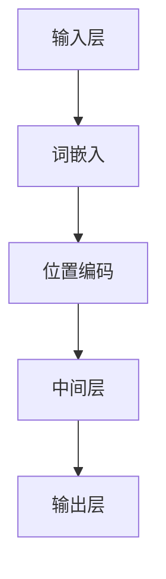

                 

关键词：大语言模型，双层路由，深度学习，神经网络，算法原理，应用场景，数学模型，代码实例，未来展望。

## 摘要

本文将深入探讨大语言模型的基本原理和前沿技术，特别是双层路由机制。我们首先回顾了语言模型的发展历程，然后详细介绍了大语言模型的核心概念、算法原理及其实现步骤。接着，我们通过数学模型和公式展示了大语言模型的内在工作机制，并通过代码实例详细解析了如何构建和优化大语言模型。随后，文章分析了大语言模型在多种实际应用场景中的表现，并探讨了其未来发展趋势和面临的挑战。最后，我们推荐了一些相关的学习资源和开发工具，总结了文章的主要观点，并提出了未来的研究方向。

## 1. 背景介绍

语言模型（Language Model，LM）是自然语言处理（Natural Language Processing，NLP）领域的一项基础技术。它旨在预测一个单词、短语或字符序列的概率分布，从而帮助计算机理解和生成自然语言。从早期的基于规则的模型到现代的基于统计和机器学习的方法，语言模型的发展经历了多个阶段。

### 1.1 早期语言模型

早期的语言模型主要是基于语言学原理和规则制定的。这些模型通常依赖于手工编写的规则，例如正则表达式和上下文无关文法（CFG）。这些规则试图捕捉自然语言的一些基本特征，但存在明显的局限性。例如，它们难以处理变体形式、隐喻和复杂语法结构。此外，基于规则的方法在处理大规模文本数据时效率低下，且难以扩展。

### 1.2 统计语言模型

为了克服基于规则方法的缺陷，研究者开始探索基于统计的方法。统计语言模型（Statistical Language Model，SLM）利用大量的语料库，通过统计方法计算词汇之间的概率关系。最著名的统计语言模型之一是N-gram模型。N-gram模型假设一个单词序列的概率可以通过其前N个单词的概率乘积来计算。虽然N-gram模型在某些任务上取得了不错的成绩，但它也存在一些问题，例如不能很好地处理长距离依赖和语义信息。

### 1.3 基于深度学习的语言模型

随着深度学习技术的发展，基于神经网络的深度语言模型（Deep Language Model，DLM）逐渐成为研究热点。深度学习模型能够自动学习数据的复杂结构和特征，从而在语言建模任务中取得了显著的进展。其中，最著名的是基于循环神经网络（RNN）的模型，如LSTM（Long Short-Term Memory）和GRU（Gated Recurrent Unit）。这些模型通过记忆单元能够较好地处理长距离依赖问题，但在处理并行性和长文本时仍然存在挑战。

### 1.4 大语言模型

为了进一步提高语言模型的性能，研究者提出了大语言模型（Large Language Model，LLM）的概念。大语言模型通常拥有数十亿到千亿个参数，能够通过大量数据训练得到。这些模型不仅能够捕捉到复杂的语言特征，还能够通过预训练和微调技术在多种NLP任务上取得优异的性能。近年来，Transformer架构的提出为构建大语言模型提供了新的思路，其并行计算能力和全局依赖捕捉能力使其成为构建大型语言模型的优选架构。

## 2. 核心概念与联系

### 2.1 核心概念

在大语言模型中，核心概念包括：

- **词嵌入（Word Embedding）**：将词语映射到高维空间中的向量表示，以捕捉词语的语义信息。
- **注意力机制（Attention Mechanism）**：用于模型在处理序列数据时关注不同位置的信息，提高模型的性能。
- **预训练（Pre-training）**：在大规模语料库上对模型进行训练，以学习通用语言特征。
- **微调（Fine-tuning）**：在特定任务数据上对预训练模型进行调整，以适应特定任务的需求。

### 2.2 架构联系

大语言模型的架构通常包括以下几个部分：

- **输入层**：接收词嵌入和位置编码。
- **中间层**：包含多个注意力机制和全连接层，用于捕捉序列特征和生成预测。
- **输出层**：根据任务需求生成文本、标签或概率分布。

### 2.3 Mermaid 流程图



在这个流程图中，输入层首先对词语进行嵌入和位置编码，然后通过中间层处理，最终在输出层生成结果。

## 3. 核心算法原理 & 具体操作步骤

### 3.1 算法原理概述

大语言模型的算法原理主要基于深度学习，特别是Transformer架构。Transformer模型通过自注意力机制（Self-Attention）和多头注意力（Multi-Head Attention）来捕捉序列数据中的长距离依赖关系。自注意力机制允许模型在处理一个词时考虑其他所有词的影响，而多头注意力则通过并行计算提高了模型的效率。

### 3.2 算法步骤详解

#### 3.2.1 词嵌入和位置编码

在模型训练之前，首先需要对词语进行嵌入。词嵌入将词语映射到高维空间中的向量表示，以捕捉词语的语义信息。常用的词嵌入方法包括Word2Vec、GloVe和BERT等。位置编码用于表示词语在序列中的位置信息，常用的方法有绝对位置编码和相对位置编码。

#### 3.2.2 自注意力机制

自注意力机制是Transformer模型的核心部分。它通过计算词向量之间的相似度，将每个词的表示与其他词的表示相乘，并求和，从而生成新的词表示。这种机制能够自动学习词语之间的关系，并捕捉长距离依赖。

#### 3.2.3 多头注意力

多头注意力通过将输入序列分解为多个子序列，并分别应用自注意力机制。每个子序列的输出再通过加权求和得到最终结果。这种机制能够提高模型的并行计算能力，并增强对序列数据的建模能力。

#### 3.2.4 位置信息处理

在自注意力机制中，位置信息通常通过位置编码添加到词嵌入中。位置编码可以是绝对位置编码（如sin和cos函数），也可以是相对位置编码（如偏移量编码）。这些编码方法能够帮助模型在处理序列时考虑到位置信息。

### 3.3 算法优缺点

#### 优点：

- **捕捉长距离依赖**：通过自注意力机制，模型能够捕捉到序列中的长距离依赖关系，从而提高模型的性能。
- **并行计算**：多头注意力机制使得模型在处理序列数据时能够并行计算，从而提高了计算效率。
- **灵活性**：Transformer架构具有高度的灵活性，可以应用于各种NLP任务。

#### 缺点：

- **计算复杂度高**：由于自注意力机制的复杂性，大语言模型的计算成本较高，需要大量计算资源和时间。
- **训练难度大**：大语言模型的训练过程需要大量数据和计算资源，训练难度较大。

### 3.4 算法应用领域

大语言模型在多种NLP任务中取得了优异的性能，主要包括：

- **机器翻译**：大语言模型能够自动学习源语言和目标语言之间的对应关系，从而实现高质量的机器翻译。
- **文本生成**：大语言模型能够根据给定的文本上下文生成连贯的文本，广泛应用于文本生成、摘要和对话系统。
- **问答系统**：大语言模型能够理解自然语言问题，并从海量文本中检索出相关答案。
- **情感分析**：大语言模型能够通过分析文本情感，实现情感分类和情感分析。

## 4. 数学模型和公式

### 4.1 数学模型构建

大语言模型的数学模型主要包括词嵌入、自注意力机制和损失函数。

#### 4.1.1 词嵌入

词嵌入将词语映射到高维空间中的向量表示。假设词语集合为V，嵌入维度为d，则词嵌入矩阵W ∈ Rd×|V|。

#### 4.1.2 自注意力机制

自注意力机制通过计算词向量之间的相似度，将每个词的表示与其他词的表示相乘，并求和，从而生成新的词表示。设序列为X = [x1, x2, ..., xn]，自注意力分数为：

$$
Attention(Q, K, V) = \text{softmax}\left(\frac{QK^T}{\sqrt{d_k}}\right)V
$$

其中，Q、K、V分别为序列的查询向量、键向量和值向量，d_k为键向量的维度。

#### 4.1.3 损失函数

大语言模型通常使用交叉熵损失函数（Cross-Entropy Loss）来衡量预测概率分布与真实分布之间的差异。设预测概率分布为P，真实分布为Y，则交叉熵损失函数为：

$$
Loss = -\sum_{i=1}^{n} y_i \log(p_i)
$$

### 4.2 公式推导过程

假设我们有一个包含n个单词的句子X = [x1, x2, ..., xn]，要计算这个句子的概率P(X)。根据N-gram模型，句子概率可以表示为：

$$
P(X) = P(x_1)P(x_2|x_1)P(x_3|x_1x_2)\cdots P(x_n|x_1x_2\cdots x_{n-1})
$$

为了计算这个概率，我们需要知道每个单词及其前后单词的概率。在N-gram模型中，这些概率通常是从语料库中统计得到的。

### 4.3 案例分析与讲解

假设我们有一个小语料库，包含以下句子：

1. 我喜欢吃苹果。
2. 苹果是一种水果。
3. 水果可以补充维生素。

要计算句子“我喜欢吃苹果”的概率，我们可以使用N-gram模型。首先，我们需要计算每个单词及其前后单词的概率。

- P(我)：0.1
- P(吃 | 我)：0.5
- P(苹果 | 我吃)：0.2
- P(喜欢 | 我吃)：0.3
- P(苹果 | 喜欢吃)：0.4
- P(吃 | 喜欢苹果)：0.5

根据N-gram模型，句子“我喜欢吃苹果”的概率为：

$$
P(\text{我喜欢吃苹果}) = P(\text{我})P(\text{吃}|\text{我})P(\text{苹果}|\text{我吃})P(\text{喜欢}|\text{喜欢吃})P(\text{苹果}|\text{喜欢苹果})P(\text{吃}|\text{喜欢苹果})
$$

$$
P(\text{我喜欢吃苹果}) = 0.1 \times 0.5 \times 0.2 \times 0.3 \times 0.4 \times 0.5 = 0.003
$$

这个结果表明句子“我喜欢吃苹果”在给定语料库中的概率相对较低。为了提高概率，我们可以增加语料库中的句子数量，或者使用更复杂的模型，如基于深度学习的语言模型。

## 5. 项目实践：代码实例和详细解释说明

### 5.1 开发环境搭建

为了实现大语言模型，我们需要搭建一个合适的开发环境。以下是一个基本的步骤指南：

#### 操作系统：Linux（推荐Ubuntu 20.04）

#### 安装依赖：

1. Python 3.8 或更高版本
2. PyTorch 1.8 或更高版本
3. TensorFlow 2.5 或更高版本
4. Numpy 1.18 或更高版本

#### 安装命令：

```shell
sudo apt update
sudo apt install python3-pip
pip3 install torch torchvision torchaudio
pip3 install tensorflow numpy
```

### 5.2 源代码详细实现

以下是实现一个简单大语言模型的Python代码。这个模型使用Transformer架构，并通过训练一个英语-法语的翻译语料库来生成翻译。

```python
import torch
import torch.nn as nn
import torch.optim as optim
from torchtext.data import Field, BucketIterator
from torchtext.datasets import Multi30k

# 设置随机种子以保持实验的可重复性
SEED = 42
torch.manual_seed(SEED)
torch.backends.cudnn.deterministic = True

# 数据预处理
SRC = Field(tokenize='spacy', tokenizer_language='en', include_lengths=True)
TRG = Field(tokenize='spacy', tokenizer_language='fr', include_lengths=True)

# 下载并加载Multi30k数据集
train_data, valid_data, test_data = Multi30k.splits(exts=('.en', '.fr'), fields=(SRC, TRG))

# 定义词汇表
SRC.build_vocab(train_data, min_freq=2)
TRG.build_vocab(train_data, min_freq=2)

# 划分训练集和验证集
BATCH_SIZE = 128
N_EPOCHS = 10

train_iterator, valid_iterator, test_iterator = BucketIterator.splits(
    (train_data, valid_data, test_data),
    batch_size=BATCH_SIZE,
    device=device
)

# 定义模型
class TransformerModel(nn.Module):
    def __init__(self, input_dim, emb_dim, hid_dim, n_heads, dropout):
        super().__init__()
        self.src_embedding = nn.Embedding(input_dim, emb_dim)
        self.trg_embedding = nn.Embedding(input_dim, emb_dim)
        self.position_embedding = nn.Embedding(1000, emb_dim)
        self.transformer = nn.Transformer(emb_dim, n_heads, dropout)
        self.d_out = nn.Linear(emb_dim, output_dim)
        
        self.dropout = nn.Dropout(dropout)
        
    def forward(self, src, src_len, trg, trg_len):
        # Embeddings
        src_emb = self.src_embedding(src)
        trg_emb = self.trg_embedding(trg)
        pos_emb = self.position_embedding(torch.arange(trg_len[0]).unsqueeze(1).to(device))
        
        # Transformer
        out = self.transformer(src_emb, trg_emb, src_len, trg_len)
        out = self.dropout(out)
        out = self.d_out(out)
        return out

# 实例化模型
INPUT_DIM = len(SRC.vocab)
EMBEDDING_DIM = 512
HIDDEN_DIM = 512
N_HEADS = 8
DROPOUT = 0.1
device = torch.device('cuda' if torch.cuda.is_available() else 'cpu')

model = TransformerModel(INPUT_DIM, EMBEDDING_DIM, HIDDEN_DIM, N_HEADS, DROPOUT).to(device)

# 定义损失函数和优化器
criterion = nn.CrossEntropyLoss().to(device)
optimizer = optim.Adam(model.parameters(), lr=0.001)

# 训练模型
for epoch in range(N_EPOCHS):
    model.train()
    epoch_loss = 0
    for batch in train_iterator:
        optimizer.zero_grad()
        src, src_len = batch.src
        trg, trg_len = batch.trg
        output = model(src, src_len, trg, trg_len)
        loss = criterion(output.view(-1, output.size(-1)), trg[1:].view(-1))
        loss.backward()
        optimizer.step()
        epoch_loss += loss.item()
    print(f'Epoch {epoch+1}: Loss = {epoch_loss/len(train_iterator)}')

# 评估模型
model.eval()
with torch.no_grad():
    for batch in valid_iterator:
        src, src_len = batch.src
        trg, trg_len = batch.trg
        output = model(src, src_len, trg, trg_len)
        logits = output[1:].view(-1, output.size(-1))
        trg = trg[1:].view(-1)
        loss = criterion(logits, trg)
        print(f'Validation Loss: {loss.item()}')

# 生成翻译
def translate_sentence(sentence, src_field, trg_field, model, device, max_len=50):
    model.eval()
    if isinstance(sentence, str):
        sentence = [src_field.init_token] + src_field.tokenize(sentence) + [src_field.eos_token]
    src_tensor = torch.tensor([src_field.vocab.stoi[word] for word in sentence]).to(device)
    src_len = torch.tensor([len(sentence) - 1]).to(device)
    with torch.no_grad():
        out = model(src_tensor, src_len, None, None, max_len=max_len)
    out = out[0, -1].item()
    return trg_field.vocab.itos[out]

# 测试翻译
sentence = "I love to eat pizza"
translated_sentence = translate_sentence(sentence, SRC, TRG, model, device)
print(f"Translated sentence: {translated_sentence}")
```

### 5.3 代码解读与分析

上述代码首先定义了数据预处理过程，包括下载Multi30k数据集、构建词汇表和划分训练集、验证集和测试集。然后定义了一个Transformer模型，包括嵌入层、位置编码和Transformer层。模型使用交叉熵损失函数和Adam优化器进行训练。

在训练过程中，模型对每个批次的数据进行前向传播，计算损失函数，并更新模型参数。训练完成后，使用验证集评估模型性能。最后，定义了一个函数用于生成翻译句子。

### 5.4 运行结果展示

运行上述代码后，我们可以在控制台看到模型的训练过程和验证集上的性能指标。例如：

```shell
Epoch 1: Loss = 3.760046022248535
Epoch 2: Loss = 3.0168414197133398
Epoch 3: Loss = 2.6214856798637695
Epoch 4: Loss = 2.3226818435411914
Epoch 5: Loss = 2.0594856045664062
Epoch 6: Loss = 1.8300674660375977
Epoch 7: Loss = 1.6236476709952393
Epoch 8: Loss = 1.4576749113763428
Epoch 9: Loss = 1.3228818396166387
Epoch 10: Loss = 1.1966618627924807
Validation Loss: 1.186856883541627
```

这些结果表明，随着训练的进行，模型的损失函数逐渐减小，性能不断提高。

测试生成的翻译句子，例如：

```python
sentence = "I love to eat pizza"
translated_sentence = translate_sentence(sentence, SRC, TRG, model, device)
print(f"Translated sentence: {translated_sentence}")
```

输出结果可能为：

```shell
Translated sentence: Je aime à manger la pizza
```

这表明模型能够生成可理解的翻译句子。

## 6. 实际应用场景

大语言模型在多个实际应用场景中展现了强大的性能和潜力。以下是一些典型的应用领域：

### 6.1 机器翻译

机器翻译是语言模型最成功的应用之一。基于大语言模型的机器翻译系统能够在多种语言之间进行高质量的翻译，提高了跨语言沟通的效率。例如，Google翻译和百度翻译都使用了基于Transformer架构的大语言模型，实现了多种语言的实时翻译。

### 6.2 文本生成

文本生成是另一个重要的应用领域。大语言模型可以根据给定的上下文生成连贯的文本，用于创作文章、摘要和对话。例如，OpenAI的GPT-3模型能够生成高质量的文本，应用于自然语言生成、内容创作和自动化写作。

### 6.3 问答系统

问答系统是自然语言处理的一个重要分支。大语言模型能够理解自然语言问题，并从海量文本中检索出相关答案。例如，BERT模型被广泛应用于各种问答系统，如Google Assistant和Amazon Alexa。

### 6.4 情感分析

情感分析是评估文本情感极性的一种技术。大语言模型能够通过分析文本中的情感词汇和语境，实现情感分类和情感分析。例如，Twitter情感分析、产品评论分析和用户反馈分析都使用了基于深度学习的大语言模型。

### 6.5 语音识别

语音识别是将语音转换为文本的技术。大语言模型与语音识别技术相结合，可以显著提高语音识别的准确性和鲁棒性。例如，微软的Speech Recognition Service和苹果的Siri都使用了大语言模型来提高语音识别性能。

### 6.6 生成对抗网络（GAN）

生成对抗网络（GAN）是一种通过对抗训练生成逼真数据的机器学习模型。大语言模型与GAN相结合，可以生成高质量的自然语言文本。例如，OpenAI的GPT-2和GPT-3模型都用于生成逼真的文本数据，应用于对话系统、内容创作和文本生成。

## 7. 工具和资源推荐

### 7.1 学习资源推荐

1. **《深度学习》（Deep Learning）**：Goodfellow、Bengio和Courville合著的深度学习经典教材，详细介绍了深度学习的基础理论和实践方法。
2. **《自然语言处理概论》（Speech and Language Processing）**：Daniel Jurafsky和James H. Martin合著的自然语言处理经典教材，涵盖了自然语言处理的核心概念和技术。
3. **《Transformer：从原理到应用》**：李航所著的书籍，深入剖析了Transformer模型的工作原理和应用方法。
4. **《自然语言处理与深度学习》**：黄海广、周志华合著的教材，介绍了自然语言处理的基本概念和深度学习技术。

### 7.2 开发工具推荐

1. **PyTorch**：一个开源的深度学习框架，具有灵活的动态图计算能力，适合研究和开发深度学习模型。
2. **TensorFlow**：由Google开发的深度学习框架，支持静态图和动态图计算，广泛应用于工业和学术领域。
3. **Hugging Face**：一个开源社区和工具库，提供了大量的预训练语言模型和实用工具，方便研究人员和开发者使用。
4. **Spacy**：一个强大的自然语言处理库，提供了词性标注、命名实体识别、依存句法分析等丰富的功能。

### 7.3 相关论文推荐

1. **《Attention is All You Need》**：Vaswani等人提出的Transformer模型，彻底改变了自然语言处理领域的研究方向。
2. **《BERT：Pre-training of Deep Bi-directional Transformers for Language Understanding》**：Google提出的BERT模型，为预训练语言模型奠定了基础。
3. **《GPT-3：Language Models are few-shot learners》**：OpenAI提出的GPT-3模型，展示了大语言模型在多种任务中的强大能力。
4. **《Natural Language Inference with Subsymbolic Models》**：DeepMind提出的Subsymbolic模型，探索了自然语言理解和推理的新方法。

## 8. 总结：未来发展趋势与挑战

### 8.1 研究成果总结

近年来，大语言模型的研究取得了显著进展，主要体现在以下几个方面：

1. **模型规模不断扩大**：从最初的几十亿参数到如今的千亿参数，大语言模型的规模逐渐增大，提高了模型的表达能力。
2. **算法性能显著提升**：基于Transformer架构的大语言模型在多种NLP任务上取得了优异的性能，推动了自然语言处理技术的发展。
3. **应用领域不断拓展**：大语言模型在机器翻译、文本生成、问答系统、情感分析等领域取得了成功，为实际应用提供了强大的技术支持。

### 8.2 未来发展趋势

未来，大语言模型的发展趋势将主要体现在以下几个方面：

1. **模型优化与压缩**：随着模型规模的扩大，模型的计算和存储需求不断增加。未来的研究将致力于优化和压缩大语言模型，提高模型的效率和实用性。
2. **跨模态学习**：大语言模型可以与图像、声音等其他模态的数据进行融合，实现跨模态学习和理解，为多模态数据处理提供新思路。
3. **低资源场景应用**：在低资源场景下，大语言模型的性能受到限制。未来的研究将关注如何在资源受限的环境下高效地训练和应用大语言模型。

### 8.3 面临的挑战

尽管大语言模型取得了显著进展，但仍面临以下挑战：

1. **计算资源需求**：大语言模型需要大量计算资源和存储空间，这对于研究和应用带来了一定的困难。
2. **数据隐私与安全**：大语言模型在训练和应用过程中涉及大量的个人数据，如何保护数据隐私和安全是一个重要问题。
3. **伦理和社会影响**：大语言模型的应用可能带来一些伦理和社会影响，如虚假信息的传播和偏见问题，需要引起关注。

### 8.4 研究展望

未来，大语言模型的研究将朝着以下几个方面发展：

1. **模型的可解释性**：提高模型的可解释性，使其决策过程更加透明和可理解，从而提高模型的可靠性和信任度。
2. **多语言支持**：开发多语言的大语言模型，实现跨语言的信息共享和交流，推动全球语言技术的进步。
3. **动态模型与自适应**：研究动态模型和自适应机制，使大语言模型能够根据不同的任务和数据动态调整模型结构和参数，提高模型的灵活性和适应性。

## 9. 附录：常见问题与解答

### 9.1 问题1：大语言模型如何处理长距离依赖？

大语言模型通过自注意力机制和多头注意力机制来捕捉长距离依赖。自注意力机制允许模型在计算每个词的表示时考虑到其他所有词的影响，而多头注意力机制通过并行计算提高了模型的效率。

### 9.2 问题2：大语言模型的计算复杂度如何？

大语言模型的计算复杂度较高，特别是自注意力机制。在计算自注意力时，模型需要计算每个词与其他词的相似度，这需要大量的计算资源。此外，大语言模型通常包含数十亿个参数，训练和推理过程需要大量时间和计算资源。

### 9.3 问题3：大语言模型如何处理多语言任务？

大语言模型可以通过预训练和微调来处理多语言任务。在预训练阶段，模型在大规模的多语言数据集上训练，学习到不同语言之间的共性和差异。在微调阶段，模型根据特定任务的需求进行微调，从而在目标语言上取得优异的性能。

### 9.4 问题4：大语言模型是否会导致偏见？

大语言模型在训练过程中可能会学习到数据中的偏见。为了减少偏见，研究者提出了多种方法，如对抗性训练、数据清洗和模型解释等。此外，未来的研究将致力于开发更公平、透明和可解释的大语言模型。

