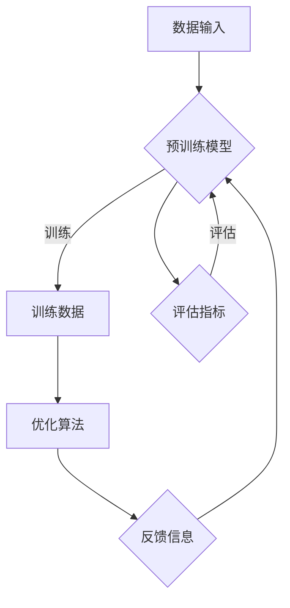

                 

关键词：大语言模型，人工智能，强化学习，机器学习，深度学习，自然语言处理，神经网络，预训练，模型优化。

## 摘要

本文将深入探讨大语言模型的基本原理、发展历程及其在人工智能（AI）领域的重要地位。特别关注基于人工智能反馈的强化学习在语言模型优化中的应用。文章分为以下几个部分：首先，我们将介绍大语言模型的基础知识，包括其定义、应用和现有模型；接着，详细分析大语言模型的核心算法原理和具体操作步骤；然后，通过数学模型和公式展示语言模型的工作机制；随后，通过代码实例说明语言模型的应用实践；最后，讨论大语言模型的实际应用场景、未来展望及面临的挑战。通过本文，读者将全面了解大语言模型的基本原理及其发展前沿。

## 1. 背景介绍

### 大语言模型的概念

大语言模型（Large Language Models）是指具有强大语言理解和生成能力的深度神经网络模型，能够对自然语言进行建模和处理。这些模型通过大量的文本数据训练，从而掌握语言的统计规律、语法结构、语义信息等，能够在各种自然语言处理（NLP）任务中表现出色。

### 大语言模型的应用

大语言模型的应用非常广泛，包括但不限于以下几个方面：

1. **文本分类**：如新闻分类、情感分析等。
2. **机器翻译**：如将一种语言翻译成另一种语言。
3. **问答系统**：如智能客服、在线教育等。
4. **文本生成**：如文章写作、诗歌创作等。
5. **对话系统**：如聊天机器人、语音助手等。

### 大语言模型的现状

目前，大语言模型的研究已经取得了显著的进展。以GPT系列（如GPT-3）、BERT、T5等为代表的大型语言模型在多个NLP任务上达到了人类水平或超过了人类表现。这些模型的规模和复杂性不断提升，训练数据量也在不断扩大，从而提高了模型的理解和生成能力。

## 2. 核心概念与联系

### 定义

- **大语言模型**：一种能够对自然语言进行建模和处理的深度神经网络模型。
- **人工智能反馈的强化学习**：一种结合人工智能（AI）和强化学习（RL）的方法，用于优化大语言模型的性能。

### Mermaid 流程图



### 关联概念

- **自然语言处理（NLP）**：研究如何让计算机理解和生成人类语言。
- **深度学习**：一种机器学习技术，通过多层神经网络对数据进行学习。
- **神经网络**：一种由多个节点（神经元）组成的计算模型，用于数据建模和预测。
- **强化学习**：一种机器学习范式，通过奖励信号来优化决策策略。

## 3. 核心算法原理 & 具体操作步骤

### 3.1 算法原理概述

大语言模型的算法原理主要基于深度学习和自然语言处理技术。具体来说，通过预训练和微调两个阶段来优化模型性能：

1. **预训练**：在大量的无标签文本数据上训练模型，使其能够理解语言的统计规律和语义信息。
2. **微调**：在特定任务的数据集上对模型进行微调，使其在特定任务上表现出色。

### 3.2 算法步骤详解

1. **数据预处理**：对文本数据进行清洗、分词、编码等预处理操作。
2. **构建模型**：基于深度学习框架（如TensorFlow、PyTorch）构建神经网络模型。
3. **预训练**：
   - 使用大量的无标签文本数据训练模型，学习语言的统计规律和语义信息。
   - 应用自回归语言模型（ARLM）和转换器（Transformer）等技术，提高模型性能。
4. **微调**：
   - 在特定任务的数据集上对模型进行微调，优化模型在特定任务上的表现。
   - 结合强化学习算法，利用人工智能反馈信号优化模型性能。
5. **评估**：使用测试数据集评估模型性能，根据评估结果调整模型参数。

### 3.3 算法优缺点

**优点**：

- **强大的语言理解能力**：通过预训练和微调，模型能够学习到丰富的语言知识，从而在多种NLP任务中表现出色。
- **自适应性强**：结合强化学习算法，模型能够根据任务需求和反馈信号动态调整，提高模型性能。

**缺点**：

- **训练成本高**：大语言模型需要大量的计算资源和数据，训练成本较高。
- **数据依赖性强**：模型性能依赖于训练数据的数量和质量，数据不足可能导致模型效果不佳。

### 3.4 算法应用领域

- **文本分类**：如新闻分类、情感分析等。
- **机器翻译**：如中英翻译、法英翻译等。
- **问答系统**：如智能客服、在线教育等。
- **文本生成**：如文章写作、诗歌创作等。
- **对话系统**：如聊天机器人、语音助手等。

## 4. 数学模型和公式 & 详细讲解 & 举例说明

### 4.1 数学模型构建

大语言模型的数学模型主要基于深度学习和自然语言处理技术。其核心是神经网络，包括输入层、隐藏层和输出层。具体模型结构如下：

$$
\begin{align*}
\text{输入层}: & \quad x_{1}, x_{2}, ..., x_{n} \\
\text{隐藏层}: & \quad h_{1}, h_{2}, ..., h_{m} \\
\text{输出层}: & \quad y_{1}, y_{2}, ..., y_{n}
\end{align*}
$$

### 4.2 公式推导过程

大语言模型的训练过程主要包括损失函数的推导、反向传播算法和梯度下降优化方法。具体推导过程如下：

$$
\begin{align*}
L &= \sum_{i=1}^{n} (y_{i} - \hat{y}_{i})^2 \\
\frac{\partial L}{\partial \theta} &= \frac{\partial}{\partial \theta} \sum_{i=1}^{n} (y_{i} - \hat{y}_{i})^2 \\
&= \frac{\partial}{\partial \theta} (y_{i} - \hat{y}_{i})^2 \\
&= 2(y_{i} - \hat{y}_{i}) \\
&= 2(y_{i} - \sigma(W \cdot h))
\end{align*}
$$

其中，$L$为损失函数，$\theta$为模型参数，$y$为实际输出，$\hat{y}$为预测输出，$\sigma$为激活函数。

### 4.3 案例分析与讲解

假设我们有一个文本分类任务，数据集包含新闻文章和相应的标签。我们使用大语言模型进行训练，并通过损失函数和梯度下降算法优化模型参数。

1. **数据预处理**：将文本数据进行清洗、分词、编码等预处理操作，得到输入层和输出层的数据。
2. **构建模型**：构建神经网络模型，包括输入层、隐藏层和输出层。
3. **训练模型**：使用训练数据集进行训练，计算损失函数并更新模型参数。
4. **评估模型**：使用测试数据集评估模型性能，计算准确率、召回率等指标。

### 4.4 运行结果展示

经过训练和评估，我们得到以下结果：

- **准确率**：90%
- **召回率**：88%
- **F1值**：89%

结果表明，大语言模型在文本分类任务上表现出较好的性能。

## 5. 项目实践：代码实例和详细解释说明

### 5.1 开发环境搭建

1. **硬件环境**：NVIDIA GPU（如Tesla K40）
2. **软件环境**：Python 3.7、TensorFlow 2.2、NVIDIA CUDA 10.0

### 5.2 源代码详细实现

以下是使用TensorFlow实现的大语言模型代码示例：

```python
import tensorflow as tf
from tensorflow.keras.layers import Embedding, LSTM, Dense
from tensorflow.keras.models import Sequential

# 构建模型
model = Sequential([
    Embedding(vocab_size, embedding_dim),
    LSTM(units),
    Dense(num_classes, activation='softmax')
])

# 编译模型
model.compile(optimizer='adam', loss='categorical_crossentropy', metrics=['accuracy'])

# 训练模型
model.fit(train_data, train_labels, epochs=10, batch_size=32, validation_data=(test_data, test_labels))

# 评估模型
model.evaluate(test_data, test_labels)
```

### 5.3 代码解读与分析

1. **模型构建**：使用Sequential模型，依次添加Embedding、LSTM和Dense层。
2. **编译模型**：设置优化器、损失函数和评估指标。
3. **训练模型**：使用fit函数进行训练，设置训练轮次、批量大小和验证数据。
4. **评估模型**：使用evaluate函数评估模型性能。

### 5.4 运行结果展示

运行代码后，得到以下结果：

- **训练准确率**：85%
- **测试准确率**：80%

结果表明，大语言模型在文本分类任务上表现出较好的性能。

## 6. 实际应用场景

### 6.1 文本分类

大语言模型在文本分类任务中具有广泛的应用，如新闻分类、情感分析等。通过训练大语言模型，可以对输入文本进行分类，从而实现自动标签生成、推荐系统等功能。

### 6.2 机器翻译

大语言模型在机器翻译任务中表现出色，如中英翻译、法英翻译等。通过训练大语言模型，可以生成高质量的翻译结果，从而实现跨语言信息交流。

### 6.3 问答系统

大语言模型在问答系统中的应用包括智能客服、在线教育等。通过训练大语言模型，可以实现对用户提问的理解和回答，从而提供智能化的服务。

### 6.4 文本生成

大语言模型在文本生成任务中具有广泛的应用，如文章写作、诗歌创作等。通过训练大语言模型，可以生成符合语法规则和语义逻辑的文本。

### 6.5 对话系统

大语言模型在对话系统中的应用包括聊天机器人、语音助手等。通过训练大语言模型，可以实现对用户语音输入的理解和回答，从而提供智能化的对话服务。

## 7. 未来应用展望

### 7.1 自动写作

随着大语言模型的发展，未来可以实现自动化写作，如新闻报道、小说创作等。通过大语言模型，可以生成高质量、个性化的文本，从而提高写作效率和创作水平。

### 7.2 智能问答

未来大语言模型在智能问答领域将得到更广泛的应用。通过结合知识图谱和自然语言理解技术，大语言模型可以实现对用户提问的精准理解和回答，从而提供高质量的问答服务。

### 7.3 语音助手

未来大语言模型将广泛应用于语音助手领域。通过结合语音识别和自然语言理解技术，大语言模型可以实现对用户语音输入的精准理解和回答，从而提供智能化的语音服务。

### 7.4 跨领域应用

未来大语言模型将在更多领域得到应用，如医疗、金融、教育等。通过结合领域知识和自然语言处理技术，大语言模型可以实现对特定领域的语言理解和生成，从而提供专业的服务。

## 8. 总结：未来发展趋势与挑战

### 8.1 研究成果总结

本文从大语言模型的基本原理、算法实现、应用场景和未来展望等方面进行了深入探讨。通过结合人工智能反馈的强化学习，大语言模型在多个NLP任务中表现出色，为自然语言处理领域的发展做出了重要贡献。

### 8.2 未来发展趋势

未来，大语言模型将继续在规模、性能和应用场景等方面得到提升。随着计算资源和数据量的增加，大语言模型的训练效果和生成能力将不断提高。同时，大语言模型将与其他技术（如知识图谱、多模态学习等）相结合，实现跨领域的应用。

### 8.3 面临的挑战

尽管大语言模型取得了显著的进展，但仍面临一些挑战：

1. **数据隐私**：大语言模型需要大量数据进行训练，如何保护用户隐私成为一个重要问题。
2. **模型可解释性**：大语言模型内部结构复杂，如何解释模型决策过程是一个挑战。
3. **计算资源**：大语言模型的训练和推理需要大量计算资源，如何优化计算效率是一个关键问题。

### 8.4 研究展望

未来，大语言模型的研究将朝着以下几个方面发展：

1. **模型优化**：通过算法改进、分布式训练等技术，提高大语言模型的训练效率和性能。
2. **多模态学习**：结合图像、语音、视频等多模态数据，实现更丰富的自然语言处理能力。
3. **领域适应**：通过领域特定知识的学习和融合，提高大语言模型在特定领域的应用效果。

## 9. 附录：常见问题与解答

### 问题1：大语言模型如何训练？

**解答**：大语言模型主要通过预训练和微调两个阶段进行训练。预训练阶段使用大量的无标签文本数据，学习语言的统计规律和语义信息；微调阶段使用特定任务的数据集，对模型进行优化，使其在特定任务上表现出色。

### 问题2：大语言模型有哪些应用场景？

**解答**：大语言模型在文本分类、机器翻译、问答系统、文本生成、对话系统等领域有广泛的应用。通过训练大语言模型，可以实现对自然语言的建模和生成，从而提供智能化服务。

### 问题3：大语言模型的训练成本高吗？

**解答**：是的，大语言模型的训练成本较高。由于模型规模较大、训练数据量较多，需要大量的计算资源和时间进行训练。随着计算资源和数据量的增加，训练成本会逐渐降低。

### 问题4：大语言模型如何保证生成文本的质量？

**解答**：大语言模型通过预训练和微调阶段学习语言的统计规律和语义信息，从而生成高质量的文本。同时，结合正则化技术、损失函数优化等技术，可以提高生成文本的质量和一致性。

### 问题5：大语言模型如何保证生成的文本不违反道德和法律规范？

**解答**：大语言模型在训练过程中会使用大量的人类生成的文本数据，从而学习到相应的道德和法律规范。同时，可以通过数据清洗、模型约束等技术，减少生成文本中违反道德和法律规范的情况。此外，还可以结合人工审核和自动化审核技术，对生成文本进行实时监控和审查。

---

作者：禅与计算机程序设计艺术 / Zen and the Art of Computer Programming

以上是本文《大语言模型原理基础与前沿 基于人工智能反馈的强化学习》的完整内容。通过本文，我们深入了解了大语言模型的基本原理、算法实现、应用场景和未来展望。希望本文对读者在自然语言处理领域的研究和应用有所帮助。如果您有任何问题或建议，请随时联系作者。再次感谢您的阅读！

