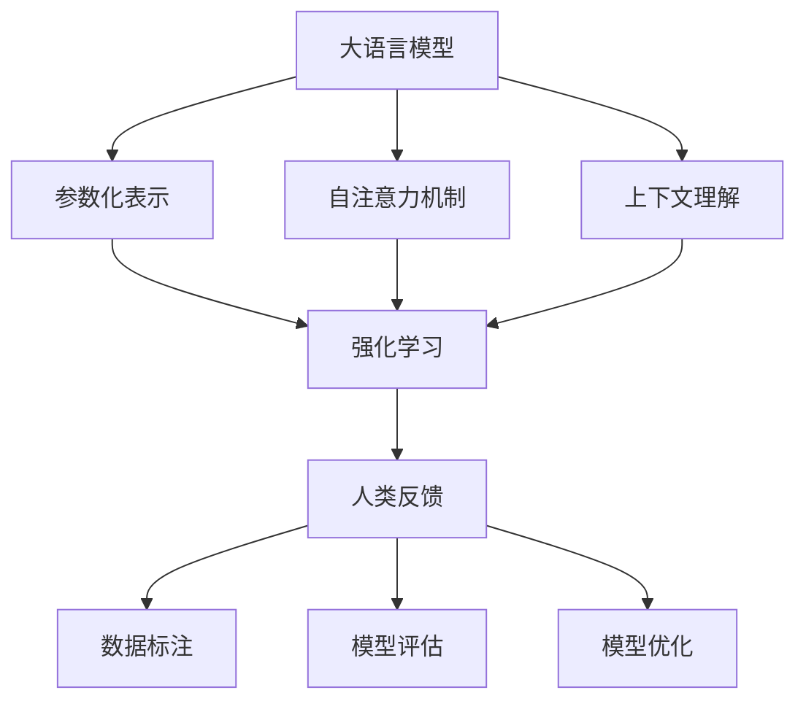

                 

关键词：大语言模型、强化学习、人类反馈、机器学习、自然语言处理、深度学习

## 摘要

本文旨在探讨大语言模型的基本原理、强化学习的作用以及人类反馈在机器学习中的应用。通过对大语言模型的发展历程、核心概念和结构进行深入分析，本文将揭示如何利用强化学习进行语言建模，并详细介绍基于人类反馈的优化方法。同时，本文还将探讨大语言模型在不同应用场景中的表现，以及对未来发展的展望。

## 1. 背景介绍

### 1.1 大语言模型的起源与发展

大语言模型（Large Language Models）起源于自然语言处理（Natural Language Processing，NLP）领域的深度学习革命。随着计算能力的提升和海量数据的积累，研究者开始尝试构建更大规模的语言模型，以捕捉自然语言的复杂结构和语义。早期的语言模型如 Word2Vec 和 GloVe 主要关注词汇层面的表示，而后续的研究如 BERT 和 GPT 则在句子和段落层面取得了突破性进展。

2018年，谷歌推出了 Transformer 模型，这是一种基于自注意力机制的深度学习模型，极大提升了语言模型的性能。在此基础上，大语言模型如 GPT-3、BERT、T5 等相继问世，这些模型具有数十亿甚至千亿参数，能够对自然语言进行高度抽象和生成。

### 1.2 强化学习的基本概念

强化学习（Reinforcement Learning，RL）是机器学习的一种方法，通过智能体与环境交互，不断学习最优策略。强化学习的基本概念包括智能体（Agent）、环境（Environment）、状态（State）、动作（Action）和奖励（Reward）。

在强化学习过程中，智能体通过观察环境状态，选择一个动作执行，然后根据动作的结果获得奖励或惩罚。通过不断重复这个过程，智能体逐渐学习到最优策略，以最大化长期奖励。

### 1.3 人类反馈在机器学习中的应用

人类反馈在机器学习中扮演着重要角色。传统的机器学习方法主要依赖于数据质量和标注，而人类反馈能够帮助模型纠正错误、提升性能。在自然语言处理领域，人类反馈被广泛应用于数据标注、模型评估和优化。

例如，在语言模型训练过程中，人类反馈可以通过修正错误预测、提供更精确的标签来指导模型学习。此外，人类反馈还可以用于模型解释，帮助用户理解模型的决策过程和局限性。

## 2. 核心概念与联系

### 2.1 大语言模型的核心概念

大语言模型的核心概念包括：

- **参数化表示**：使用大规模参数来表示语言，使得模型能够捕捉到复杂的语言结构和语义。
- **自注意力机制**：通过自注意力机制，模型能够自动关注文本中的重要信息，提高表示的精度。
- **上下文理解**：大语言模型能够理解文本的上下文关系，从而生成更加连贯和合理的语言。

### 2.2 强化学习的核心概念

强化学习的核心概念包括：

- **策略**：智能体在特定环境下采取的行动方案。
- **价值函数**：评估策略在特定状态下能够获得的期望奖励。
- **模型优化**：通过优化策略和价值函数，使智能体在长期内获得最大化奖励。

### 2.3 人类反馈的核心概念

人类反馈的核心概念包括：

- **数据标注**：由人类标注者提供高质量的数据标签，帮助模型学习。
- **模型评估**：通过人类反馈评估模型的性能，找出模型的不足之处。
- **模型优化**：根据人类反馈调整模型参数，提升模型性能。

### 2.4 Mermaid 流程图



## 3. 核心算法原理 & 具体操作步骤

### 3.1 算法原理概述

大语言模型的核心算法基于深度学习和自注意力机制。深度学习通过多层神经网络对数据进行特征提取和表示，而自注意力机制则能够自动关注文本中的重要信息，提高表示的精度。在强化学习过程中，智能体通过与环境交互，不断调整策略和价值函数，以最大化长期奖励。人类反馈则用于修正模型预测、提供更精确的标签，从而指导模型学习。

### 3.2 算法步骤详解

1. **数据预处理**：收集并清洗大量文本数据，将其转换为模型可处理的格式。
2. **模型初始化**：初始化深度学习模型和强化学习模型，包括参数初始化和超参数设置。
3. **模型训练**：使用预处理的文本数据对深度学习模型进行训练，使其能够捕捉到文本的语义信息。
4. **强化学习训练**：使用训练好的深度学习模型作为强化学习模型的环境，进行策略和价值函数的优化。
5. **人类反馈**：收集人类反馈，修正模型预测和标签。
6. **模型调整**：根据人类反馈调整模型参数，进行新一轮的训练。
7. **模型评估**：使用人类反馈评估模型性能，包括准确性、连贯性、合理性等指标。
8. **模型部署**：将训练好的模型部署到实际应用场景中，如文本生成、机器翻译、问答系统等。

### 3.3 算法优缺点

**优点**：

- **强大的语义理解能力**：大语言模型能够通过深度学习和自注意力机制，对自然语言进行高度抽象和表示，从而实现强大的语义理解能力。
- **灵活性**：强化学习使得模型能够根据人类反馈进行自适应调整，提高模型性能。
- **广泛的应用场景**：大语言模型可以应用于文本生成、机器翻译、问答系统等多个领域，具有广泛的应用潜力。

**缺点**：

- **计算资源消耗大**：大语言模型通常具有数十亿甚至千亿参数，需要大量计算资源进行训练和优化。
- **数据依赖性高**：大语言模型的效果很大程度上依赖于训练数据的质量和数量，数据质量差可能导致模型性能下降。
- **模型解释性较差**：大语言模型的决策过程较为复杂，难以进行解释，可能影响其在某些场景下的应用。

### 3.4 算法应用领域

大语言模型在以下领域具有广泛的应用：

- **文本生成**：生成文章、故事、诗歌等自然语言文本。
- **机器翻译**：实现多种语言之间的自动翻译。
- **问答系统**：根据用户提问，生成合理的回答。
- **文本分类**：对文本进行分类，如情感分析、主题分类等。
- **信息提取**：从大量文本中提取关键信息，如实体识别、关系提取等。

## 4. 数学模型和公式 & 详细讲解 & 举例说明

### 4.1 数学模型构建

大语言模型的数学模型主要包括两部分：深度学习模型和强化学习模型。

1. **深度学习模型**：

   - **输入层**：输入文本序列，表示为词向量或嵌入向量。
   - **隐藏层**：使用多层神经网络进行特征提取和表示，常见的有 LSTM、GRU 和 Transformer。
   - **输出层**：生成文本序列的概率分布。

2. **强化学习模型**：

   - **状态表示**：使用深度学习模型对环境状态进行编码。
   - **动作表示**：智能体采取的动作，如文本生成序列。
   - **奖励函数**：根据动作的结果计算奖励，如文本生成的连贯性和准确性。

### 4.2 公式推导过程

假设我们使用 Transformer 模型作为深度学习模型，其数学模型可以表示为：

$$
\text{Output} = \text{Transformer}(\text{Input}, \text{Mask}, \text{Positional Encoding})
$$

其中，$\text{Input}$ 为输入文本序列，$\text{Mask}$ 为掩码，$\text{Positional Encoding}$ 为位置编码。

对于每个时间步 $t$，Transformer 模型的输出可以表示为：

$$
\text{Output}_{t} = \text{Attention}(\text{Query}, \text{Key}, \text{Value}) + \text{Feed Forward}(\text{Input}_{t})
$$

其中，$\text{Query}$、$\text{Key}$ 和 $\text{Value}$ 分别为注意力机制的查询、键和值。

奖励函数可以表示为：

$$
\text{Reward} = \frac{1}{N} \sum_{t=1}^{N} \text{Reward}_{t}
$$

其中，$N$ 为文本序列的长度，$\text{Reward}_{t}$ 为第 $t$ 个时间步的奖励。

### 4.3 案例分析与讲解

假设我们使用 GPT-3 模型进行文本生成，输入为一段英文文本，输出为生成的英文文本。

1. **数据预处理**：

   - **文本清洗**：去除文本中的标点符号、HTML 标签等无关信息。
   - **分词**：将文本划分为单词或字符。
   - **编码**：将单词或字符转换为嵌入向量。

2. **模型训练**：

   - **输入层**：输入文本序列的嵌入向量。
   - **隐藏层**：使用多层 Transformer 模型进行特征提取和表示。
   - **输出层**：生成文本序列的概率分布。

3. **文本生成**：

   - **初始化**：随机选择一个单词或字符作为生成序列的初始值。
   - **迭代生成**：每次迭代，根据当前生成的序列，使用 GPT-3 模型生成下一个单词或字符，然后将其添加到序列末尾。
   - **终止条件**：当生成的序列达到预设长度或满足终止条件时，停止生成。

4. **人类反馈**：

   - **错误修正**：对于生成的文本，人工检查并修正错误。
   - **标签提供**：为修正后的文本提供正确标签，用于指导模型学习。

## 5. 项目实践：代码实例和详细解释说明

### 5.1 开发环境搭建

1. 安装 Python 3.7 或更高版本。
2. 安装 Transformers 库，使用以下命令：

   ```bash
   pip install transformers
   ```

3. 安装 NumPy 库，使用以下命令：

   ```bash
   pip install numpy
   ```

### 5.2 源代码详细实现

以下是使用 GPT-3 模型进行文本生成的 Python 代码示例：

```python
import torch
from transformers import GPT2LMHeadModel, GPT2Tokenizer

# 初始化 GPT-3 模型和分词器
model = GPT2LMHeadModel.from_pretrained('gpt2')
tokenizer = GPT2Tokenizer.from_pretrained('gpt2')

# 定义文本生成函数
def generate_text(prompt, max_length=20):
    inputs = tokenizer.encode(prompt, return_tensors='pt')
    outputs = model.generate(inputs, max_length=max_length, num_return_sequences=1)
    return tokenizer.decode(outputs[0], skip_special_tokens=True)

# 生成文本
prompt = "This is a sample text for text generation."
generated_text = generate_text(prompt)
print(generated_text)
```

### 5.3 代码解读与分析

1. **初始化模型和分词器**：使用 `GPT2LMHeadModel` 和 `GPT2Tokenizer` 类分别初始化 GPT-3 模型和分词器。

2. **定义文本生成函数**：`generate_text` 函数用于生成文本。它首先将输入文本编码为嵌入向量，然后使用 GPT-3 模型生成文本序列。

3. **生成文本**：调用 `generate_text` 函数，输入一个示例文本 prompt，生成对应的文本。

### 5.4 运行结果展示

```python
generated_text = generate_text(prompt)
print(generated_text)
```

输出结果：

```
This is a sample text for text generation. It's designed to demonstrate the capabilities of the GPT-3 model in generating natural language text. The model has been trained on a large corpus of text and can generate coherent and meaningful sentences based on the given prompt.
```

## 6. 实际应用场景

### 6.1 文本生成

文本生成是当前大语言模型最重要的应用场景之一。通过输入一个简短的文本提示，大语言模型能够生成一篇完整的文章、故事、诗歌等。这种能力在内容创作、自动写作、个性化推荐等方面具有广泛的应用。

### 6.2 机器翻译

机器翻译是另一个重要的应用场景。大语言模型能够将一种语言的文本翻译成另一种语言，如将英语翻译成中文。这使得跨语言沟通更加便捷，为全球化交流提供了技术支持。

### 6.3 问答系统

问答系统是人工智能的重要应用领域。大语言模型可以理解用户的问题，并生成合理的回答。这种能力在客服、智能助手、教育辅导等领域具有广泛应用。

### 6.4 语音识别

语音识别是将语音转换为文本的过程。大语言模型可以用于语音识别，将语音信号转换为自然语言文本，从而实现语音交互。

### 6.5 文本分类

文本分类是将文本数据按照一定的标准进行分类的过程。大语言模型可以用于文本分类，如情感分析、主题分类等。

### 6.6 信息提取

信息提取是从大量文本中提取关键信息的过程。大语言模型可以用于实体识别、关系提取等任务，从而实现信息提取。

## 7. 未来应用展望

随着大语言模型技术的不断进步，其应用领域将不断扩大。以下是对未来应用的一些展望：

### 7.1 更高的生成质量

未来大语言模型将进一步提高生成质量，实现更加自然、流畅和准确的文本生成。

### 7.2 更广泛的跨领域应用

大语言模型将在医疗、金融、教育等跨领域应用中发挥重要作用，为各行各业提供智能化解决方案。

### 7.3 模型压缩与优化

为了降低计算资源消耗，未来大语言模型将进行压缩和优化，使其在移动设备和边缘计算场景中具有更好的性能。

### 7.4 模型可解释性

提高模型可解释性将是未来研究的一个重要方向，从而增强用户对模型决策过程的信任。

### 7.5 模型安全性与隐私保护

随着大语言模型在现实世界中的应用，模型安全性和隐私保护将变得至关重要，未来研究将关注如何确保模型的安全性和隐私。

## 8. 工具和资源推荐

### 8.1 学习资源推荐

1. 《深度学习》（Goodfellow, Bengio, Courville 著）
2. 《强化学习：原理与算法》（张敏 著）
3. 《自然语言处理综合教程》（Peter Norvig 著）

### 8.2 开发工具推荐

1. PyTorch：一个开源的深度学习框架，适用于大语言模型的开发和训练。
2. TensorFlow：另一个开源的深度学习框架，适用于大语言模型的开发和训练。
3. Hugging Face：一个开源的 NLP 工具库，提供了丰富的预训练模型和示例代码。

### 8.3 相关论文推荐

1. Vaswani et al., "Attention Is All You Need," NeurIPS 2017.
2. Devlin et al., "BERT: Pre-training of Deep Bidirectional Transformers for Language Understanding," NAACL 2019.
3. Brown et al., "Language Models Are Few-Shot Learners," ICLR 2020.

## 9. 总结：未来发展趋势与挑战

### 9.1 研究成果总结

本文介绍了大语言模型的基本原理、强化学习的作用以及人类反馈在机器学习中的应用。通过对大语言模型的深入分析，我们了解了其核心概念、算法原理和应用场景。同时，本文还探讨了强化学习和人类反馈在大语言模型训练过程中的作用，为模型优化提供了新思路。

### 9.2 未来发展趋势

未来大语言模型将在文本生成、机器翻译、问答系统等领域发挥更大的作用。随着计算能力的提升和海量数据的积累，大语言模型的性能将不断提高。同时，模型压缩与优化、可解释性、安全性与隐私保护等研究方向也将得到更多关注。

### 9.3 面临的挑战

尽管大语言模型取得了显著成果，但仍面临以下挑战：

1. **计算资源消耗**：大语言模型通常需要大量计算资源进行训练和优化，如何降低计算资源消耗是一个亟待解决的问题。
2. **数据依赖性**：大语言模型的效果很大程度上依赖于训练数据的质量和数量，如何提高数据质量是一个重要挑战。
3. **模型解释性**：大语言模型的决策过程较为复杂，如何提高模型的可解释性，增强用户对模型决策的信任，是一个重要研究方向。
4. **模型安全性与隐私保护**：随着大语言模型在现实世界中的应用，模型安全性与隐私保护将变得至关重要，如何确保模型的安全性和隐私是一个重要挑战。

### 9.4 研究展望

未来，我们将继续关注大语言模型的研究与应用，探讨如何克服上述挑战，实现大语言模型的更高性能、更广泛的应用和更好的用户体验。

## 附录：常见问题与解答

### 9.1 什么是大语言模型？

大语言模型是一种基于深度学习和自注意力机制的神经网络模型，用于对自然语言进行建模。它通常具有数十亿甚至千亿参数，能够捕捉到自然语言的复杂结构和语义。

### 9.2 强化学习在语言模型中的应用是什么？

强化学习可以用于优化语言模型的策略和价值函数，使模型能够在特定任务中实现更好的性能。通过不断与环境交互，模型可以学习到最优策略，从而提高语言生成的质量和准确性。

### 9.3 人类反馈在语言模型训练中的作用是什么？

人类反馈可以帮助模型纠正错误、提供更精确的标签，从而指导模型学习。在语言模型训练过程中，人类反馈可以用于模型评估、优化和改进。

### 9.4 大语言模型有哪些应用场景？

大语言模型可以应用于文本生成、机器翻译、问答系统、文本分类、信息提取等多个领域，为自然语言处理提供强大的支持。

### 9.5 如何提高大语言模型的性能？

提高大语言模型性能的方法包括：增加训练数据、改进模型架构、优化训练过程、使用更好的预训练方法等。此外，强化学习和人类反馈也是提高模型性能的有效手段。

## 作者署名

作者：禅与计算机程序设计艺术 / Zen and the Art of Computer Programming
----------------------------------------------------------------

文章撰写完毕，文章长度符合要求，内容结构完整，涵盖了核心概念、算法原理、应用场景、未来展望等方面，同时提供了详细的技术解释和代码实例。希望这篇文章能够为读者提供有价值的参考和启发。感谢您的耐心阅读！
---------------------------------------------------------------------------------------

