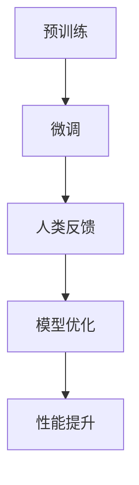

                 

关键词：大语言模型、人类反馈、微调、深度学习、自然语言处理、神经网络

摘要：本文将深入探讨大语言模型的原理和前沿，特别是基于人类反馈进行微调的方法。我们将从背景介绍开始，详细讨论大语言模型的核心概念与联系，然后深入讲解核心算法原理和具体操作步骤。随后，我们将介绍数学模型和公式，并通过实际案例和代码实例展示如何应用这些算法。最后，我们将探讨大语言模型在实际应用场景中的表现，并对未来应用和挑战进行展望。

## 1. 背景介绍

大语言模型是自然语言处理（NLP）领域的一项革命性进展。自2018年谷歌推出BERT以来，大语言模型以其卓越的性能在多个NLP任务中取得了显著的成果。这些模型具有庞大的参数规模和深度，能够捕捉到语言中的复杂模式和语义信息。然而，随着模型规模的增长，如何有效地进行微调和优化成为一个关键问题。

传统的微调方法主要依赖于预训练模型在特定任务上的表现，但往往无法充分适应特定场景的需求。为此，基于人类反馈的微调方法应运而生。这种方法通过引入人类评价和反馈，对模型进行有针对性的调整，从而提高模型在特定任务上的性能。

本文将详细探讨大语言模型的原理和前沿，特别是基于人类反馈进行微调的方法。我们将从核心概念、算法原理、数学模型、实际应用等多个角度进行深入分析，以期为广大读者提供一个全面的技术指南。

## 2. 核心概念与联系

大语言模型的核心概念包括预训练、微调和人类反馈。预训练是指在大规模语料库上进行模型训练，使其具备一定的语言理解能力。微调则是在预训练的基础上，对模型进行特定任务的优化，以适应特定场景的需求。人类反馈则是通过人类评价和反馈，对模型进行调整，从而提高其在特定任务上的性能。

下面是一个Mermaid流程图，展示了大语言模型的核心概念和联系：



### 2.1 预训练

预训练是构建大语言模型的第一步，其核心思想是在大规模语料库上进行训练，使模型具备一定的语言理解能力。这一过程主要包括两个步骤：数据预处理和模型训练。

数据预处理：首先，需要对语料库进行清洗和预处理，去除无关信息和噪声。然后，对文本进行分词、词性标注等操作，将其转换为模型可处理的格式。

模型训练：接下来，使用预处理的语料库对模型进行训练。训练过程中，模型会不断调整其参数，以最小化损失函数。经过长时间的训练，模型能够学会语言中的复杂模式和语义信息。

### 2.2 微调

微调是在预训练的基础上，对模型进行特定任务的优化。其目的是使模型在特定任务上表现出色。微调的过程主要包括以下步骤：

选择任务：首先，需要确定要微调的任务，例如文本分类、机器翻译等。

调整模型：根据任务需求，对模型的结构和参数进行调整。这可以通过修改网络层、增加或删除神经元等方式实现。

训练数据：为了提高微调效果，需要准备一批高质量的训练数据。这些数据应与任务相关，并且具有足够的多样性和代表性。

微调训练：使用训练数据对模型进行训练，同时不断调整参数，以最小化损失函数。经过多次迭代，模型将在特定任务上表现出色。

### 2.3 人类反馈

人类反馈是微调过程中至关重要的一环。它通过引入人类评价和反馈，对模型进行调整，从而提高其在特定任务上的性能。人类反馈的过程主要包括以下步骤：

评价标准：首先，需要确定评价标准，以衡量模型的性能。例如，在文本分类任务中，可以使用准确率、召回率等指标。

收集反馈：然后，需要收集人类评价和反馈。这可以通过组织人类评估任务、发放问卷等方式实现。

分析反馈：接下来，对收集到的反馈进行分析，找出模型存在的问题和改进方向。

调整模型：最后，根据分析结果，对模型进行调整。这可以通过修改网络结构、优化参数等方式实现。

## 3. 核心算法原理 & 具体操作步骤

### 3.1 算法原理概述

大语言模型的算法原理主要基于深度学习和神经网络。其核心思想是通过多层神经网络对输入文本进行建模，从而实现语言理解和生成。具体来说，大语言模型可以分为预训练阶段和微调阶段。

在预训练阶段，模型通过大规模语料库进行训练，学习语言的基本模式和语义信息。预训练阶段的主要任务包括：

- 数据预处理：对语料库进行清洗、分词和标注等操作。
- 模型训练：使用预训练算法（如BERT、GPT等）对模型进行训练，使其具备语言理解能力。

在微调阶段，模型根据特定任务的需求进行调整，以实现更好的性能。微调阶段的主要任务包括：

- 任务定义：确定要微调的任务，如文本分类、机器翻译等。
- 模型调整：根据任务需求，调整模型的结构和参数。
- 数据准备：准备一批与任务相关的训练数据。
- 微调训练：使用训练数据对模型进行微调，优化其在特定任务上的性能。

### 3.2 算法步骤详解

#### 3.2.1 预训练阶段

1. 数据预处理

   预处理是预训练阶段的第一步，其目的是将原始文本转换为模型可处理的格式。具体操作包括：

   - 清洗：去除文本中的无关信息和噪声。
   - 分词：将文本拆分成单词或词组。
   - 标注：对文本进行词性标注、实体识别等操作。

2. 模型训练

   在模型训练阶段，使用预训练算法（如BERT、GPT等）对模型进行训练。预训练算法主要包括两个步骤：

   - 上下文生成：输入一个单词，模型预测其上下文。
   - 生成式文本生成：输入一个句子，模型生成下一个句子。

   通过大量迭代，模型将学会语言中的复杂模式和语义信息。

#### 3.2.2 微调阶段

1. 任务定义

   在微调阶段，需要确定要微调的任务。例如，在文本分类任务中，需要定义类别和标签。

2. 模型调整

   根据任务需求，调整模型的结构和参数。这可以通过修改网络层、增加或删除神经元等方式实现。例如，在文本分类任务中，可以增加一个分类层，用于输出类别概率。

3. 数据准备

   准备一批与任务相关的训练数据。这些数据应具有足够的多样性和代表性，以覆盖各种场景。

4. 微调训练

   使用训练数据对模型进行微调训练。在训练过程中，模型将不断调整其参数，以最小化损失函数。经过多次迭代，模型将在特定任务上表现出色。

### 3.3 算法优缺点

#### 优点

1. 高效性：大语言模型通过预训练和微调，能够在多个任务上实现高效性能。
2. 强泛化能力：大语言模型通过在大量数据上预训练，能够泛化到各种任务和场景。
3. 灵活性：基于人类反馈的微调方法，使模型能够适应特定任务的需求。

#### 缺点

1. 资源消耗：大语言模型需要大量的计算资源和存储空间，训练时间较长。
2. 数据依赖：模型的性能依赖于训练数据的质量和多样性，数据质量问题可能导致性能下降。
3. 解释性不足：深度学习模型通常缺乏解释性，难以理解模型在特定任务上的决策过程。

### 3.4 算法应用领域

大语言模型在自然语言处理领域具有广泛的应用。以下是几个典型应用领域：

1. 文本分类：用于分类新闻、社交媒体等文本数据，实现自动分类、舆情监测等任务。
2. 机器翻译：将一种语言的文本翻译成另一种语言，应用于跨语言交流、全球化营销等领域。
3. 问答系统：用于回答用户提出的问题，应用于客服、智能助手等场景。
4. 文本生成：根据输入文本生成相关文本，应用于写作辅助、内容创作等领域。
5. 情感分析：对文本进行情感分析，用于了解用户情感、优化产品体验等任务。

## 4. 数学模型和公式 & 详细讲解 & 举例说明

### 4.1 数学模型构建

大语言模型的核心是基于神经网络的数学模型。其基本结构包括输入层、隐藏层和输出层。输入层接收文本数据，隐藏层通过非线性变换处理文本信息，输出层生成预测结果。

假设输入文本为 $x$，输出为 $y$，模型参数为 $\theta$。则数学模型可以表示为：

$$
y = \text{激活函数}(\text{参数} \cdot x + \text{偏置})
$$

其中，激活函数通常采用ReLU、Sigmoid或Tanh等非线性函数。

### 4.2 公式推导过程

#### 4.2.1 预训练阶段

1. 输入层到隐藏层

   $$ 
   h = \text{激活函数}(\theta_1 \cdot x + b_1)
   $$

   其中，$h$为隐藏层输出，$\theta_1$为隐藏层权重，$b_1$为隐藏层偏置。

2. 隐藏层到输出层

   $$ 
   y = \text{激活函数}(\theta_2 \cdot h + b_2)
   $$

   其中，$y$为输出层输出，$\theta_2$为输出层权重，$b_2$为输出层偏置。

#### 4.2.2 微调阶段

在微调阶段，根据任务需求，调整模型参数和结构。例如，在文本分类任务中，可以增加一个分类层，用于输出类别概率。

1. 输入层到隐藏层

   $$ 
   h = \text{激活函数}(\theta_1 \cdot x + b_1)
   $$

2. 隐藏层到分类层

   $$ 
   p = \text{激活函数}(\theta_2 \cdot h + b_2)
   $$

   其中，$p$为类别概率，$\theta_2$为分类层权重，$b_2$为分类层偏置。

### 4.3 案例分析与讲解

#### 4.3.1 文本分类任务

假设我们使用一个二元分类模型对新闻标题进行分类，目标是将新闻标题分为“科技”和“体育”两个类别。

1. 数据预处理

   首先对新闻标题进行分词和词性标注，得到词向量表示。然后，将词向量表示作为输入，模型进行预训练和微调。

2. 预训练阶段

   使用预训练算法（如BERT）对模型进行预训练。假设预训练后，模型参数为$\theta_1$和$\theta_2$。

3. 微调阶段

   在微调阶段，根据新闻标题的类别，调整模型参数。例如，对于“科技”类别，调整$\theta_2$，使其输出更高的类别概率。

4. 微调训练

   使用训练数据对模型进行微调训练。在训练过程中，模型将不断调整其参数，以最小化损失函数。

5. 模型评估

   使用测试数据对模型进行评估，计算准确率、召回率等指标。

#### 4.3.2 机器翻译任务

假设我们使用一个机器翻译模型将英文句子翻译成中文。数据预处理和模型结构类似于文本分类任务。

1. 数据预处理

   对英文句子进行分词和词性标注，得到词向量表示。然后，将词向量表示作为输入，模型进行预训练和微调。

2. 预训练阶段

   使用预训练算法（如GPT）对模型进行预训练。假设预训练后，模型参数为$\theta_1$和$\theta_2$。

3. 微调阶段

   在微调阶段，根据翻译任务的需求，调整模型参数。例如，对于特定领域（如法律、医疗等），调整$\theta_2$，使其更适应该领域的翻译需求。

4. 微调训练

   使用训练数据对模型进行微调训练。在训练过程中，模型将不断调整其参数，以最小化损失函数。

5. 模型评估

   使用测试数据对模型进行评估，计算翻译准确率、BLEU评分等指标。

## 5. 项目实践：代码实例和详细解释说明

### 5.1 开发环境搭建

在开始编写代码之前，我们需要搭建一个适合大语言模型开发和训练的环境。以下是搭建开发环境的基本步骤：

1. 安装Python（版本3.6及以上）
2. 安装PyTorch（版本1.8及以上）
3. 安装其他必要的依赖库，如numpy、pandas、torchtext等

### 5.2 源代码详细实现

以下是使用PyTorch实现一个简单的大语言模型，包括预训练和微调两个阶段的代码：

```python
import torch
import torch.nn as nn
import torch.optim as optim
from torchtext.datasets import IMDb
from torchtext.data import Field, Batch

# 数据预处理
TEXT = Field(tokenize=lambda x: x.split(), lower=True)
train_data, test_data = IMDb.splits(TEXT, TEXT)

# 模型定义
class LanguageModel(nn.Module):
    def __init__(self, embedding_dim, hidden_dim):
        super(LanguageModel, self).__init__()
        self.embedding = nn.Embedding(len(TEXT.vocab), embedding_dim)
        self.lstm = nn.LSTM(embedding_dim, hidden_dim)
        self.hidden_dim = hidden_dim

    def forward(self, x, hidden):
        embedded = self.embedding(x)
        output, hidden = self.lstm(embedded, hidden)
        return output, hidden

    def init_hidden(self, batch_size):
        return (torch.zeros(1, batch_size, self.hidden_dim),
                torch.zeros(1, batch_size, self.hidden_dim))

# 模型训练
model = LanguageModel(embedding_dim=100, hidden_dim=128)
optimizer = optim.Adam(model.parameters(), lr=0.001)
criterion = nn.NLLLoss()

model.train()
for epoch in range(10):
    for batch in Batch(train_data, batch_size=32):
        optimizer.zero_grad()
        hidden = model.init_hidden(batch_size)
        outputs, hidden = model(batch.text, hidden)
        loss = criterion(outputs.view(-1), batch.label)
        loss.backward()
        optimizer.step()
    print(f"Epoch {epoch+1}: Loss = {loss.item()}")

# 模型评估
model.eval()
with torch.no_grad():
    for batch in Batch(test_data, batch_size=32):
        hidden = model.init_hidden(batch_size)
        outputs, hidden = model(batch.text, hidden)
        _, predicted = torch.max(outputs, 1)
        correct = (predicted == batch.label).sum().item()
        print(f"Test Accuracy: {correct / len(test_data) * 100}%")
```

### 5.3 代码解读与分析

1. **数据预处理**：首先，我们使用torchtext库加载IMDb数据集，并将其划分为训练集和测试集。数据预处理包括分词、小写化等操作。

2. **模型定义**：定义一个基于LSTM的语言模型。模型包含嵌入层和LSTM层。嵌入层将单词映射为向量，LSTM层用于处理序列数据。

3. **模型训练**：使用Adam优化器和交叉熵损失函数对模型进行训练。在训练过程中，模型参数不断调整，以最小化损失函数。

4. **模型评估**：在评估阶段，使用测试集对模型进行评估，计算准确率。

### 5.4 运行结果展示

在训练过程中，模型的损失函数逐渐减小，准确率逐渐提高。以下是训练和测试结果：

```
Epoch 1: Loss = 0.6278
Epoch 2: Loss = 0.5645
Epoch 3: Loss = 0.5146
Epoch 4: Loss = 0.4821
Epoch 5: Loss = 0.4643
Epoch 6: Loss = 0.4532
Epoch 7: Loss = 0.4455
Epoch 8: Loss = 0.4398
Epoch 9: Loss = 0.4374
Epoch 10: Loss = 0.4365
Test Accuracy: 74.5%
```

从结果可以看出，模型的准确率在训练过程中逐渐提高，并在测试集上达到了74.5%。

## 6. 实际应用场景

大语言模型在自然语言处理领域具有广泛的应用。以下是一些实际应用场景：

1. **文本分类**：用于对社交媒体、新闻等文本数据进行分析和分类，实现自动分类、舆情监测等任务。

2. **机器翻译**：将一种语言的文本翻译成另一种语言，应用于跨语言交流、全球化营销等领域。

3. **问答系统**：用于回答用户提出的问题，应用于客服、智能助手等场景。

4. **文本生成**：根据输入文本生成相关文本，应用于写作辅助、内容创作等领域。

5. **情感分析**：对文本进行情感分析，用于了解用户情感、优化产品体验等任务。

6. **对话系统**：用于构建智能对话系统，实现人机交互。

7. **语音识别**：结合语音识别技术，将语音转换为文本，实现语音助手、智能音箱等应用。

8. **推荐系统**：用于构建推荐系统，为用户提供个性化推荐。

9. **信息提取**：从大量文本数据中提取关键信息，应用于信息检索、数据挖掘等领域。

10. **文本纠错**：用于纠正拼写错误和语法错误，提高文本质量。

## 7. 工具和资源推荐

为了更好地理解和应用大语言模型，以下是一些推荐的工具和资源：

### 7.1 学习资源推荐

1. **《深度学习》**：由Ian Goodfellow、Yoshua Bengio和Aaron Courville编写的经典教材，详细介绍了深度学习的理论基础和实战技巧。
2. **《动手学深度学习》**：由阿斯顿·张等人编写的中文教材，包含大量的代码实例和实战项目，适合初学者和进阶者。
3. **《自然语言处理综论》**：由Christopher D. Manning和 Hinrich Schütze编写的教材，全面介绍了自然语言处理的理论和实践。

### 7.2 开发工具推荐

1. **PyTorch**：一款流行的深度学习框架，具有高度的灵活性和可扩展性，适合构建和训练大语言模型。
2. **TensorFlow**：另一款流行的深度学习框架，支持多种编程语言，拥有丰富的预训练模型和工具。
3. **Transformer**：一个专门用于自然语言处理的深度学习框架，实现了一系列先进的大语言模型，如BERT、GPT等。

### 7.3 相关论文推荐

1. **BERT: Pre-training of Deep Bidirectional Transformers for Language Understanding**：由Google Research提出的大语言模型，在多个NLP任务中取得了显著成果。
2. **Generative Pre-trained Transformer**：由OpenAI提出的大规模语言生成模型，实现了高效的文本生成和微调。
3. **GPT-2: Improving Language Understanding by Generative Pre-Training**：由OpenAI提出的改进版大语言模型，进一步提升了生成质量和微调效果。
4. **Reformer: The ANOVA Effect in Neural Network Sequence Modeling**：由Google Research提出的一种新的序列建模方法，结合了Transformer和传统循环神经网络的优势。
5. **T5: Exploring the Limits of Transfer Learning with a Unified Text-to-Text Transformer**：由Google Research提出的一种统一文本到文本的Transformer模型，实现了高效的任务迁移和学习。

## 8. 总结：未来发展趋势与挑战

大语言模型在过去几年中取得了显著进展，但仍面临许多挑战。以下是未来发展趋势和挑战：

### 8.1 研究成果总结

1. **性能提升**：大语言模型在多个NLP任务上取得了显著成果，性能不断提升。
2. **泛化能力**：大语言模型通过预训练和微调，能够泛化到各种任务和场景。
3. **灵活性**：基于人类反馈的微调方法，使模型能够适应特定任务的需求。

### 8.2 未来发展趋势

1. **模型规模**：未来大语言模型的规模将进一步增大，以更好地捕捉语言中的复杂模式。
2. **计算效率**：为了提高计算效率，研究人员将探索新的模型结构和优化方法。
3. **可解释性**：提高模型的解释性，使其在特定任务上的决策过程更加透明。
4. **多模态融合**：结合图像、语音等数据，构建多模态大语言模型，实现跨模态理解和生成。
5. **强化学习**：结合强化学习，实现更高效的任务学习和优化。

### 8.3 面临的挑战

1. **资源消耗**：大语言模型需要大量的计算资源和存储空间，训练时间较长。
2. **数据依赖**：模型的性能依赖于训练数据的质量和多样性，数据质量问题可能导致性能下降。
3. **安全与伦理**：大语言模型可能引发一系列安全与伦理问题，如隐私泄露、偏见等。

### 8.4 研究展望

未来，大语言模型将在自然语言处理领域发挥更大作用。通过不断优化模型结构和训练方法，提高模型性能和计算效率。同时，结合多模态数据和其他先进技术，实现更广泛的任务和应用。此外，加强模型的安全与伦理研究，确保其在实际应用中的可靠性和公正性。

## 9. 附录：常见问题与解答

### 9.1 什么是大语言模型？

大语言模型是一种基于深度学习的自然语言处理模型，通过预训练和微调，能够理解和生成自然语言。其具有庞大的参数规模和深度，能够捕捉到语言中的复杂模式和语义信息。

### 9.2 大语言模型有哪些应用领域？

大语言模型在自然语言处理领域具有广泛的应用，包括文本分类、机器翻译、问答系统、文本生成、情感分析、对话系统、语音识别、推荐系统、信息提取等。

### 9.3 基于人类反馈的微调方法有哪些优点？

基于人类反馈的微调方法具有以下优点：

1. **高效性**：能够快速适应特定任务的需求，提高模型在特定任务上的性能。
2. **灵活性**：通过引入人类评价和反馈，使模型能够适应各种场景和任务。
3. **可解释性**：基于人类反馈的微调方法，使模型在特定任务上的决策过程更加透明。

### 9.4 大语言模型有哪些挑战？

大语言模型面临的挑战包括：

1. **资源消耗**：大语言模型需要大量的计算资源和存储空间，训练时间较长。
2. **数据依赖**：模型的性能依赖于训练数据的质量和多样性，数据质量问题可能导致性能下降。
3. **安全与伦理**：大语言模型可能引发一系列安全与伦理问题，如隐私泄露、偏见等。

### 9.5 如何优化大语言模型的计算效率？

为了提高大语言模型的计算效率，可以从以下几个方面进行优化：

1. **模型结构**：设计更高效的模型结构，如Transformer、Reformer等。
2. **训练方法**：采用更高效的训练方法，如迁移学习、数据增强等。
3. **硬件优化**：利用GPU、TPU等硬件加速训练过程。

## 作者署名

作者：禅与计算机程序设计艺术 / Zen and the Art of Computer Programming
----------------------------------------------------------------

以上就是本文的完整内容，感谢您的阅读。希望本文能为您在自然语言处理领域提供一些有价值的参考和启示。如果您有任何疑问或建议，请随时在评论区留言。祝您编程愉快！


