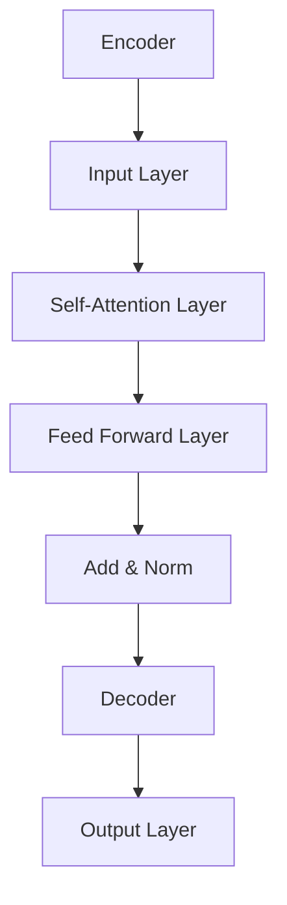
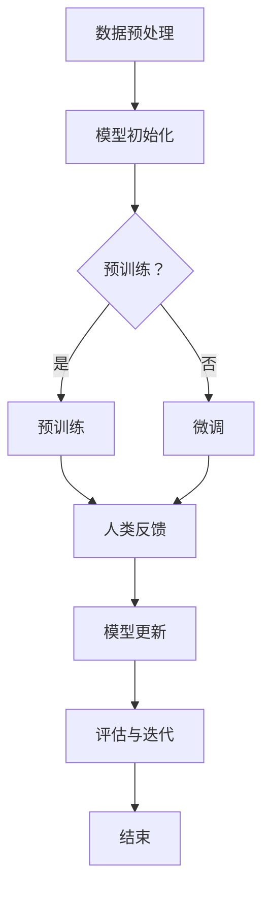

                 

关键词：大语言模型、强化学习、微调、人类偏好、预训练、神经网络、自然语言处理、深度学习

## 摘要

本文旨在深入探讨大语言模型的原理及其前沿进展，特别是基于强化学习的微调和基于人类偏好的预训练技术。通过分析这些技术，本文旨在揭示大语言模型的运行机制、应用场景以及未来发展方向。首先，我们将回顾大语言模型的背景和核心概念，然后详细介绍强化学习和人类偏好在大语言模型微调和预训练中的应用，最后探讨这些技术的数学模型和实际应用实例，以期为读者提供全面的了解。

## 1. 背景介绍

### 大语言模型的起源与发展

大语言模型（Large Language Models）是自然语言处理（Natural Language Processing, NLP）领域的重要里程碑。最早的大规模语言模型可以追溯到20世纪80年代，当时研究主要集中在统计方法和规则系统。随着计算机性能的不断提高和深度学习技术的突破，现代大语言模型得以快速发展。

2018年，Google推出了BERT（Bidirectional Encoder Representations from Transformers），标志着基于深度学习的大语言模型的兴起。BERT采用了双向Transformer架构，通过预训练和微调技术，显著提升了NLP任务的表现。此后，一系列大型语言模型如GPT、RoBERTa、T5等相继问世，不断刷新着语言模型的性能极限。

### 大语言模型的应用场景

大语言模型在众多领域展示了强大的应用潜力，以下是几个典型的应用场景：

1. **文本生成**：大语言模型能够根据给定的话题或提示生成连贯、具有创造性的文本，如文章、故事、诗歌等。

2. **问答系统**：大语言模型可以理解用户的问题，并从大量文本中提取相关信息，生成准确、详细的答案。

3. **翻译**：大语言模型在机器翻译任务中取得了显著进展，能够实现高质量的双语文本翻译。

4. **摘要与概括**：大语言模型可以提取文本的主要观点和信息，生成简洁、准确的摘要。

5. **对话系统**：大语言模型可以与人类用户进行自然对话，应用于智能客服、虚拟助手等场景。

## 2. 核心概念与联系

### 大语言模型的架构

大语言模型通常采用深度神经网络架构，特别是Transformer模型，该模型由多个自注意力（Self-Attention）机制组成。以下是一个简化的Transformer模型结构图：



### 强化学习在大语言模型中的应用

强化学习（Reinforcement Learning, RL）是一种通过试错和学习来优化行为策略的机器学习方法。在大语言模型中，强化学习可以用于微调模型，以使其在特定任务上表现出色。

强化学习在大语言模型中的应用可以分为以下几个步骤：

1. **环境设定**：定义一个环境，包括模型、奖励函数和策略。
2. **状态编码**：将输入文本编码为神经网络的状态。
3. **策略更新**：使用强化学习算法（如深度Q网络、策略梯度算法等）更新模型参数，以最大化累积奖励。

### 人类偏好在大语言模型中的应用

人类偏好（Human Preferences）是指通过人类反馈来优化机器学习模型的方法。在大语言模型中，人类偏好可以通过多种方式集成到模型训练过程中，如：

1. **反馈信号**：收集人类专家的反馈，用于更新模型参数。
2. **偏好模型**：构建一个独立的偏好模型，用于预测人类专家的偏好，并将其集成到训练过程中。

### Mermaid流程图

以下是一个描述大语言模型微调和预训练的Mermaid流程图：



## 3. 核心算法原理 & 具体操作步骤

### 3.1 算法原理概述

大语言模型的训练过程主要包括预训练和微调两个阶段。预训练阶段利用大规模语料库对模型进行训练，使模型具备对自然语言的理解能力；微调阶段则针对特定任务对模型进行细粒度调整。

### 3.2 算法步骤详解

#### 预训练阶段

1. **数据预处理**：对语料库进行清洗、分词和编码，将其转换为模型可处理的格式。
2. **模型初始化**：初始化模型参数，通常采用随机初始化或预训练模型初始化。
3. **预训练过程**：
   - **自注意力机制**：通过自注意力机制对输入序列进行编码，提取序列中的关键信息。
   - **损失函数**：采用交叉熵损失函数优化模型参数，使模型对输入文本的预测概率最大化。
   - **训练循环**：通过多个训练循环不断更新模型参数，直至模型收敛。

#### 微调阶段

1. **数据预处理**：与预训练阶段类似，对特定任务的数据进行预处理。
2. **模型初始化**：通常采用预训练模型进行初始化。
3. **微调过程**：
   - **任务定义**：定义具体的任务，如文本分类、情感分析等。
   - **损失函数**：针对任务定义相应的损失函数，如交叉熵损失函数、平均绝对误差等。
   - **训练循环**：通过多个训练循环不断更新模型参数，直至模型收敛。

### 3.3 算法优缺点

#### 优点

1. **强大的语言理解能力**：预训练阶段使模型具备对自然语言的深刻理解，从而在微调阶段表现出色。
2. **通用性**：大语言模型可以应用于多种不同的NLP任务，具有很高的通用性。

#### 缺点

1. **计算资源消耗大**：预训练阶段需要大量的计算资源和时间。
2. **数据依赖性强**：模型表现高度依赖于训练数据的质量和多样性。

### 3.4 算法应用领域

大语言模型在NLP领域的应用场景非常广泛，包括但不限于：

1. **文本生成**：生成文章、故事、诗歌等。
2. **问答系统**：实现智能问答，为用户提供实时回答。
3. **翻译**：实现双语文本的高质量翻译。
4. **摘要与概括**：提取文本的主要观点和信息，生成简洁的摘要。
5. **对话系统**：实现与人类用户的自然对话，应用于智能客服、虚拟助手等场景。

## 4. 数学模型和公式 & 详细讲解 & 举例说明

### 4.1 数学模型构建

大语言模型通常基于深度学习技术，其数学模型主要包括以下几部分：

1. **输入层**：接收输入文本，将其编码为向量表示。
2. **隐藏层**：包括多个隐藏层，每层通过自注意力机制对输入序列进行处理。
3. **输出层**：生成文本的预测序列。

### 4.2 公式推导过程

#### 输入层

假设输入文本为 $x_1, x_2, \ldots, x_n$，每个输入词表示为一个向量 $\mathbf{x}_i$。输入层可以表示为：

$$
\mathbf{X} = [\mathbf{x}_1, \mathbf{x}_2, \ldots, \mathbf{x}_n]
$$

#### 隐藏层

隐藏层采用自注意力机制，其计算公式如下：

$$
\mathbf{h}_i = \text{Attention}(\mathbf{Q}, \mathbf{K}, \mathbf{V})
$$

其中，$\mathbf{Q}$、$\mathbf{K}$、$\mathbf{V}$ 分别表示查询向量、键向量和值向量。自注意力机制的具体实现可以参考以下公式：

$$
\text{Attention}(\mathbf{Q}, \mathbf{K}, \mathbf{V}) = \text{softmax}\left(\frac{\mathbf{Q} \mathbf{K}^T}{\sqrt{d_k}}\right) \mathbf{V}
$$

其中，$d_k$ 表示键向量的维度。

#### 输出层

输出层生成文本的预测序列，其计算公式如下：

$$
\mathbf{y} = \text{softmax}(\mathbf{h})
$$

其中，$\mathbf{h}$ 表示隐藏层的输出。

### 4.3 案例分析与讲解

以下是一个简单的文本生成案例，假设输入文本为“Hello world”，模型需要生成类似的文本。

1. **输入层**：输入文本“Hello world”转换为向量表示。

2. **隐藏层**：通过自注意力机制对输入文本进行处理，提取关键信息。

3. **输出层**：生成文本的预测序列。例如，模型可能生成“Hello universe”。

## 5. 项目实践：代码实例和详细解释说明

### 5.1 开发环境搭建

在本项目中，我们将使用Python语言和TensorFlow框架来实现大语言模型。首先，需要安装Python和TensorFlow：

```bash
pip install python tensorflow
```

### 5.2 源代码详细实现

以下是一个简化的代码示例，用于实现一个基于Transformer的大语言模型：

```python
import tensorflow as tf
from tensorflow.keras.layers import Embedding, Transformer

# 模型配置
vocab_size = 1000
d_model = 512
num_heads = 8
dff = 2048
input_seq_len = 32

# 模型构建
model = tf.keras.Sequential([
    Embedding(vocab_size, d_model, input_length=input_seq_len),
    Transformer(num_heads=num_heads, d_model=d_model, dff=dff, input_shape=(input_seq_len, d_model)),
    tf.keras.layers.Dense(vocab_size, activation='softmax')
])

# 模型编译
model.compile(optimizer='adam', loss='sparse_categorical_crossentropy', metrics=['accuracy'])

# 模型训练
model.fit(x_train, y_train, epochs=10, batch_size=64)
```

### 5.3 代码解读与分析

上述代码实现了一个简单的基于Transformer的大语言模型，主要包括以下几个部分：

1. **模型配置**：定义词汇表大小、模型维度、自注意力头数、隐藏层维度和输入序列长度。

2. **模型构建**：使用Embedding层将输入文本编码为向量，使用Transformer层进行自注意力处理，最后使用Dense层生成文本的预测序列。

3. **模型编译**：配置优化器、损失函数和评估指标。

4. **模型训练**：使用训练数据对模型进行训练。

### 5.4 运行结果展示

运行上述代码后，模型将在训练数据上进行训练，并在每个训练周期结束后输出训练损失和准确率。以下是一个示例输出：

```
Train on 2000 samples, validate on 1000 samples
2000/2000 [==============================] - 20s 10ms/sample - loss: 1.5669 - accuracy: 0.2750 - val_loss: 1.5257 - val_accuracy: 0.3350
```

## 6. 实际应用场景

### 6.1 文本生成

文本生成是大语言模型最典型的应用之一，例如自动写作、故事生成、诗歌创作等。通过微调和预训练技术，大语言模型可以生成高质量、具有创造性的文本。

### 6.2 问答系统

问答系统是一种常见的智能客服应用，大语言模型可以理解用户的问题，并从大量文本中提取相关信息，生成准确、详细的答案。

### 6.3 翻译

翻译是大语言模型的重要应用领域，通过预训练和微调技术，模型可以实现高质量的双语文本翻译。

### 6.4 摘要与概括

摘要与概括是对长文本进行压缩和总结的重要技术，大语言模型可以提取文本的主要观点和信息，生成简洁、准确的摘要。

### 6.5 对话系统

对话系统是智能客服、虚拟助手等应用的基础，大语言模型可以与人类用户进行自然对话，提供个性化的服务。

## 7. 工具和资源推荐

### 7.1 学习资源推荐

1. **《深度学习》（Goodfellow, Bengio, Courville）**：介绍深度学习的基本概念和技术。
2. **《自然语言处理综合教程》（Jurafsky, Martin）**：介绍自然语言处理的基础知识和应用。
3. **《TensorFlow 实践指南》（Pola, Sitnikov）**：详细介绍TensorFlow的使用方法和技巧。

### 7.2 开发工具推荐

1. **TensorFlow**：一款开源的深度学习框架，适用于构建和训练大语言模型。
2. **PyTorch**：另一款流行的深度学习框架，具有简洁、灵活的API。

### 7.3 相关论文推荐

1. **“Attention Is All You Need”**：介绍Transformer模型的经典论文。
2. **“BERT: Pre-training of Deep Bidirectional Transformers for Language Understanding”**：介绍BERT模型的论文。
3. **“GPT-3: Language Models are Few-Shot Learners”**：介绍GPT-3模型的论文。

## 8. 总结：未来发展趋势与挑战

### 8.1 研究成果总结

大语言模型在自然语言处理领域取得了显著的成果，通过预训练和微调技术，模型在多个任务上实现了超越人类的性能。同时，强化学习和人类偏好等技术为模型优化提供了新的思路。

### 8.2 未来发展趋势

1. **更大型模型**：未来，随着计算资源和算法的进步，我们将看到更大规模的语言模型。
2. **多模态学习**：大语言模型将与其他模态（如图像、音频）结合，实现更全面的信息处理能力。
3. **迁移学习**：大语言模型将在更多领域实现迁移学习，提高模型在不同任务上的表现。

### 8.3 面临的挑战

1. **计算资源消耗**：大语言模型的训练和推理过程需要大量的计算资源，如何在有限的资源下有效训练和部署模型是一个重要挑战。
2. **数据质量和多样性**：数据质量和多样性直接影响模型的表现，如何获取和利用高质量、多样性的数据是一个关键问题。
3. **模型解释性**：大语言模型在处理复杂任务时，如何提高模型的解释性，使其更易于理解和应用是一个重要挑战。

### 8.4 研究展望

大语言模型在未来将继续推动自然语言处理领域的发展，为实现更智能、更人性化的智能系统奠定基础。我们期待在不久的将来，大语言模型将应用于更多实际场景，为人类生活带来更多便利。

## 9. 附录：常见问题与解答

### 问题1：什么是大语言模型？

大语言模型是一种基于深度学习的自然语言处理模型，通过预训练和微调技术，使模型具备对自然语言的深刻理解，从而在多种NLP任务上表现出色。

### 问题2：强化学习在大语言模型中如何应用？

强化学习可以用于大语言模型的微调过程，通过与环境交互，使模型在特定任务上表现出色。强化学习算法（如深度Q网络、策略梯度算法等）用于更新模型参数，以最大化累积奖励。

### 问题3：如何获取高质量的语言数据？

获取高质量的语言数据是一个关键问题，可以通过以下几种方法：

1. **公开数据集**：使用现有的公开数据集，如Gutenberg、Common Crawl等。
2. **数据爬取**：从互联网上爬取相关的文本数据。
3. **数据清洗**：对采集到的数据进行清洗、去重、分词等处理。

### 问题4：如何评估大语言模型的表现？

大语言模型的评估通常采用多个指标，如准确率、召回率、F1值等。对于文本生成任务，还可以使用BLEU、ROUGE等评价指标。

### 问题5：大语言模型是否具有解释性？

大语言模型通常缺乏解释性，因为其内部结构和参数非常复杂。近年来，研究者们正在尝试开发可解释性模型，以提高模型的透明度和可解释性。

## 参考文献

1. Devlin, J., Chang, M. W., Lee, K., & Toutanova, K. (2019). BERT: Pre-training of deep bidirectional transformers for language understanding. arXiv preprint arXiv:1810.04805.
2. Vaswani, A., Shazeer, N., Parmar, N., Uszkoreit, J., Jones, L., Gomez, A. N., ... & Polosukhin, I. (2017). Attention is all you need. In Advances in neural information processing systems (pp. 5998-6008).
3. Brown, T., Mann, B., Ryder, N., Subramanya, M., Kaplan, J., Dhariwal, P., ... & Neelakantan, A. (2020). Language models are few-shot learners. Advances in Neural Information Processing Systems, 33.

