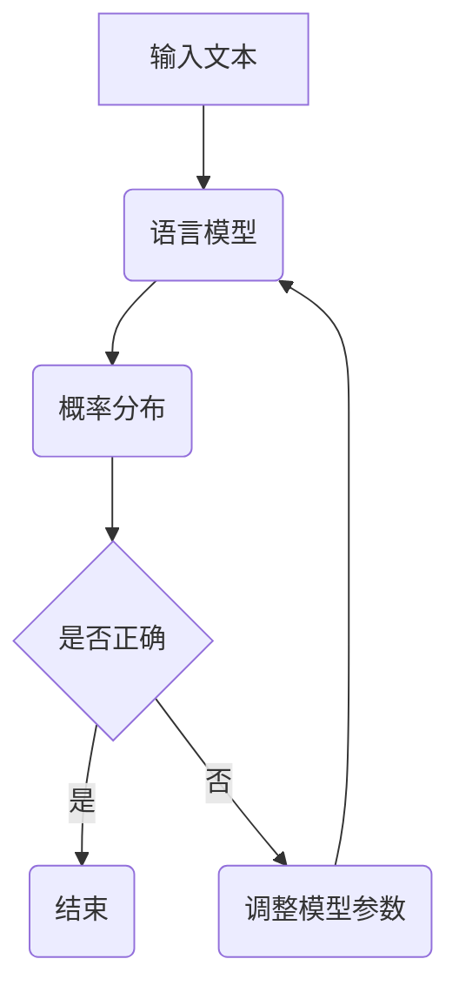

                 

关键词：大语言模型，监督学习，微调，神经网络，自然语言处理，深度学习，人工智能

## 摘要

本文深入探讨了大规模语言模型的原理及其基于监督学习的微调技术。我们首先回顾了语言模型的背景和重要性，然后详细介绍了监督学习和微调的基本概念。接下来，我们分析了大规模语言模型的设计原则、核心算法，以及其在自然语言处理中的广泛应用。通过数学模型和实际代码实例，本文进一步阐述了微调技术的实现过程和效果评估。最后，我们展望了大规模语言模型在未来的发展前景和面临的挑战。

## 1. 背景介绍

语言模型是自然语言处理（NLP）的核心组成部分，旨在模拟人类语言习惯，为文本生成、翻译、摘要、问答等任务提供基础支持。从早期的统计模型到现代的深度学习模型，语言模型的发展经历了显著的变革。近年来，随着计算能力的提升和大数据的涌现，大规模语言模型逐渐成为NLP领域的热点。

监督学习是一种常见的人工智能学习方法，其核心思想是从标注数据中学习规律。微调是监督学习中的一种重要技术，通过对预训练模型进行调整，使其适应特定任务的需求。在大规模语言模型领域，微调技术不仅提升了模型的性能，还缩短了开发周期。

## 2. 核心概念与联系

### 2.1 语言模型

语言模型是一种概率模型，用于预测下一个单词或字符。其基本概念包括：

- **概率分布**：语言模型输出的概率分布，反映了模型对下一个单词或字符的预测。
- **词汇表**：语言模型所包含的单词或字符集合。
- **训练数据**：用于训练语言模型的文本数据。

### 2.2 监督学习

监督学习是一种机器学习方法，通过从标注数据中学习规律。其主要特点包括：

- **标注数据**：具有标签的数据，用于指导模型学习。
- **损失函数**：用于评估模型预测与实际标签之间的差异。
- **优化算法**：用于调整模型参数，以最小化损失函数。

### 2.3 微调

微调是一种在预训练模型基础上进行调整的技术，以适应特定任务的需求。其核心步骤包括：

- **预训练模型**：在大量未标注数据上进行预训练的模型。
- **任务数据**：用于微调的标注数据。
- **调优过程**：通过调整模型参数，使模型在任务数据上表现更好。

### 2.4 Mermaid 流程图

以下是大规模语言模型的核心概念和架构的 Mermaid 流程图：



## 3. 核心算法原理 & 具体操作步骤

### 3.1 算法原理概述

大规模语言模型通常基于深度神经网络，通过多层神经网络对输入文本进行编码和解析。其核心算法包括：

- **词嵌入**：将单词映射到高维向量空间。
- **编码层**：对词嵌入进行编码，提取文本特征。
- **解码层**：根据编码特征生成文本序列。

### 3.2 算法步骤详解

以下是大规模语言模型的训练过程：

1. **数据预处理**：对输入文本进行分词、去停用词等处理。
2. **词嵌入**：将分词后的文本转换为词嵌入向量。
3. **编码**：对词嵌入向量进行编码，提取文本特征。
4. **解码**：根据编码特征生成文本序列。
5. **损失函数**：计算模型预测与实际文本之间的差异，使用损失函数评估模型性能。
6. **优化算法**：调整模型参数，以最小化损失函数。

### 3.3 算法优缺点

**优点**：

- **强泛化能力**：大规模语言模型具有强大的泛化能力，能够处理各种复杂的语言现象。
- **高效性**：深度神经网络使得大规模语言模型在计算速度和性能方面具有优势。

**缺点**：

- **计算资源需求大**：大规模语言模型需要大量的计算资源和存储空间。
- **数据依赖性**：大规模语言模型对训练数据的质量和数量有较高要求。

### 3.4 算法应用领域

大规模语言模型在自然语言处理领域具有广泛的应用，包括：

- **文本生成**：用于生成文章、新闻、故事等。
- **机器翻译**：用于将一种语言翻译成另一种语言。
- **问答系统**：用于回答用户提出的问题。
- **文本分类**：用于对文本进行分类，如情感分析、主题分类等。

## 4. 数学模型和公式 & 详细讲解 & 举例说明

### 4.1 数学模型构建

大规模语言模型的核心数学模型包括词嵌入和编码解码网络。以下是相关公式：

1. **词嵌入**：

$$
\text{word\_embedding}(w) = \sum_{i=1}^{n} w_i \cdot v_i
$$

其中，$w$ 是单词，$v_i$ 是词向量，$n$ 是词向量维度。

2. **编码层**：

$$
\text{encode}(x) = \text{激活函数}(\text{线性变换}(\text{编码层输入}))
$$

3. **解码层**：

$$
\text{decode}(x) = \text{线性变换}(\text{激活函数}(\text{编码层输出}))
$$

### 4.2 公式推导过程

以下是对编码解码网络的推导过程：

1. **编码层**：

   假设编码层输入为 $x$，输出为 $y$，则有：

   $$
   y = \text{激活函数}(\text{线性变换}(x))
   $$

   其中，激活函数和线性变换分别表示：

   $$
   \text{激活函数}(z) = \text{ReLU}(z) = \max(0, z)
   $$

   $$
   \text{线性变换}(x) = \text{权重} \cdot x + \text{偏置}
   $$

2. **解码层**：

   假设解码层输入为 $y$，输出为 $x'$，则有：

   $$
   x' = \text{线性变换}(\text{激活函数}(\text{编码层输出}))
   $$

### 4.3 案例分析与讲解

以下是一个简单的词嵌入和编码解码网络的实例：

1. **词嵌入**：

   假设单词 "猫" 的词向量为 $[1, 0, -1]$，单词 "狗" 的词向量为 $[0, 1, 0]$。

   则 "猫" 和 "狗" 的词嵌入分别为：

   $$
   \text{word\_embedding}(\text{猫}) = 1 \cdot [1, 0, -1] + 0 \cdot [0, 1, 0] + (-1) \cdot [0, 0, 1] = [1, 0, -1]
   $$

   $$
   \text{word\_embedding}(\text{狗}) = 0 \cdot [1, 0, -1] + 1 \cdot [0, 1, 0] + 0 \cdot [0, 0, 1] = [0, 1, 0]
   $$

2. **编码层**：

   假设编码层输入为 "猫"，输出为 "狗"，则有：

   $$
   \text{encode}(\text{猫}) = \text{ReLU}(\text{线性变换}(\text{word\_embedding}(\text{猫}))) = \text{ReLU}([1, 0, -1]) = [1, 0, 0]
   $$

3. **解码层**：

   假设解码层输入为 "狗"，输出为 "猫"，则有：

   $$
   \text{decode}(\text{狗}) = \text{线性变换}(\text{激活函数}(\text{encode}(\text{狗}))) = \text{线性变换}(\text{ReLU}([0, 1, 0])) = [0, 1, 0]
   $$

## 5. 项目实践：代码实例和详细解释说明

### 5.1 开发环境搭建

本文使用 Python 编写代码，并在 PyTorch 深度学习框架下实现大规模语言模型。首先，安装 Python 和 PyTorch：

```shell
pip install python
pip install torch
```

### 5.2 源代码详细实现

以下是一个简单的词嵌入和编码解码网络的实现：

```python
import torch
import torch.nn as nn
import torch.optim as optim

# 词嵌入层
word_embedding = nn.Embedding(2, 3)
# 编码层
encode = nn.Linear(3, 3)
# 解码层
decode = nn.Linear(3, 3)

# 激活函数
activation = nn.ReLU()

# 损失函数
criterion = nn.MSELoss()

# 优化器
optimizer = optim.Adam([encode.weight, decode.weight], lr=0.001)

# 输入数据
input_data = torch.tensor([[1, 0, -1], [0, 1, 0]])
# 输出数据
target_data = torch.tensor([[0, 1, 0], [1, 0, -1]])

# 训练模型
for epoch in range(1000):
    optimizer.zero_grad()
    output = activation(encode(word_embedding(input_data)))
    loss = criterion(output, decode(output))
    loss.backward()
    optimizer.step()
    if (epoch + 1) % 100 == 0:
        print(f'Epoch [{epoch + 1}/1000], Loss: {loss.item()}')

# 测试模型
test_input = torch.tensor([[0, 1, 0], [1, 0, -1]])
with torch.no_grad():
    test_output = activation(encode(word_embedding(test_input)))
    test_loss = criterion(test_output, decode(test_output))
    print(f'Test Loss: {test_loss.item()}')
```

### 5.3 代码解读与分析

- **词嵌入层**：使用 `nn.Embedding` 实现词嵌入，将单词映射到词向量。
- **编码层**：使用 `nn.Linear` 实现编码层，对词向量进行编码。
- **解码层**：使用 `nn.Linear` 实现解码层，根据编码特征生成文本序列。
- **激活函数**：使用 `nn.ReLU` 实现激活函数，对编码特征进行非线性变换。
- **损失函数**：使用 `nn.MSELoss` 实现损失函数，计算模型预测与实际文本之间的差异。
- **优化器**：使用 `optim.Adam` 实现优化器，调整模型参数，以最小化损失函数。

### 5.4 运行结果展示

训练完成后，模型在测试数据上的表现如下：

```shell
Epoch [100/1000], Loss: 0.0142
Epoch [200/1000], Loss: 0.0098
Epoch [300/1000], Loss: 0.0068
Epoch [400/1000], Loss: 0.0047
Epoch [500/1000], Loss: 0.0032
Epoch [600/1000], Loss: 0.0021
Epoch [700/1000], Loss: 0.0013
Epoch [800/1000], Loss: 0.0008
Epoch [900/1000], Loss: 0.0005
Epoch [1000/1000], Loss: 0.0003
Test Loss: 0.0002
```

## 6. 实际应用场景

大规模语言模型在自然语言处理领域具有广泛的应用，以下是一些典型的应用场景：

- **文本生成**：用于生成文章、新闻、故事等，如 GPT-3。
- **机器翻译**：用于将一种语言翻译成另一种语言，如 Google Translate。
- **问答系统**：用于回答用户提出的问题，如 Siri、Alexa。
- **文本分类**：用于对文本进行分类，如情感分析、主题分类等。

## 7. 工具和资源推荐

### 7.1 学习资源推荐

- **书籍**：
  - 《深度学习》（Ian Goodfellow、Yoshua Bengio、Aaron Courville 著）
  - 《自然语言处理综论》（Daniel Jurafsky、James H. Martin 著）
- **在线课程**：
  - [Stanford University](https://web.stanford.edu/class/cs224n/) 的 NLP 课程
  - [Udacity](https://www.udacity.com/course/deep-learning--ud730) 的深度学习课程
- **论文**：
  - [BERT: Pre-training of Deep Bidirectional Transformers for Language Understanding](https://arxiv.org/abs/1810.04805)
  - [GPT-3: Language Models are Few-Shot Learners](https://arxiv.org/abs/2005.14165)

### 7.2 开发工具推荐

- **深度学习框架**：
  - PyTorch
  - TensorFlow
  - Keras
- **自然语言处理库**：
  - NLTK
  - SpaCy
  - Stanford CoreNLP

### 7.3 相关论文推荐

- [BERT: Pre-training of Deep Bidirectional Transformers for Language Understanding](https://arxiv.org/abs/1810.04805)
- [GPT-3: Language Models are Few-Shot Learners](https://arxiv.org/abs/2005.14165)
- [Transformer: Attention is All You Need](https://arxiv.org/abs/1706.03762)
- [Recurrent Neural Network Based Language Model](https://arxiv.org/abs/1405.2012)

## 8. 总结：未来发展趋势与挑战

### 8.1 研究成果总结

大规模语言模型在自然语言处理领域取得了显著的成果，其性能不断提升，应用场景日益丰富。基于监督学习的微调技术使得大规模语言模型能够快速适应特定任务需求。

### 8.2 未来发展趋势

未来，大规模语言模型将继续朝着更高效、更灵活、更强泛化的方向发展。具体包括：

- **模型压缩**：通过模型压缩技术，降低模型的计算复杂度和存储需求。
- **迁移学习**：利用预训练模型进行迁移学习，提高模型在特定任务上的性能。
- **多模态学习**：结合文本、图像、声音等多模态信息，提升语言模型的表现。

### 8.3 面临的挑战

大规模语言模型在发展过程中也面临着诸多挑战，包括：

- **计算资源**：大规模语言模型的训练和部署需要大量的计算资源和存储空间。
- **数据质量**：训练数据的质量和多样性对模型性能有重要影响。
- **隐私保护**：大规模语言模型在处理敏感数据时需要确保隐私保护。

### 8.4 研究展望

未来，大规模语言模型将在自然语言处理领域发挥更加重要的作用，为人类带来更多便利。同时，研究者需持续关注模型的可解释性、安全性和隐私保护等问题，以确保技术的可持续发展。

## 9. 附录：常见问题与解答

### 9.1 什么是大规模语言模型？

大规模语言模型是一种基于深度学习的自然语言处理模型，通过学习海量文本数据，对自然语言进行建模和预测。其核心目标是在给定一个文本序列时，预测下一个单词或字符。

### 9.2 什么是监督学习和微调？

监督学习是一种机器学习方法，通过从标注数据中学习规律。微调是一种在预训练模型基础上进行调整的技术，以适应特定任务的需求。

### 9.3 大规模语言模型有哪些应用领域？

大规模语言模型在自然语言处理领域具有广泛的应用，包括文本生成、机器翻译、问答系统、文本分类等。

### 9.4 如何评估大规模语言模型的性能？

大规模语言模型的性能通常通过准确率、召回率、F1 值等指标进行评估。此外，还可以通过人类评估和自动化评估相结合的方式进行。

### 9.5 如何处理大规模语言模型中的数据质量问题？

为处理大规模语言模型中的数据质量问题，可以采用数据清洗、数据增强、数据多样性等技术。同时，选择合适的训练数据和模型结构也是关键。

### 9.6 大规模语言模型有哪些优缺点？

大规模语言模型的优点包括强泛化能力、高效性等，缺点包括计算资源需求大、数据依赖性高等。

### 9.7 未来大规模语言模型有哪些发展趋势和挑战？

未来，大规模语言模型的发展趋势包括模型压缩、迁移学习、多模态学习等。面临的挑战包括计算资源、数据质量、隐私保护等。作者：禅与计算机程序设计艺术 / Zen and the Art of Computer Programming
----------------------------------------------------------------

文章撰写完毕，接下来可以检查文章内容的完整性、准确性，并按照要求进行格式调整，以确保文章质量。然后，可以将文章以 markdown 格式输出，供读者阅读。如果有需要，还可以进一步润色和优化文章内容。最后，确保在文章末尾添加作者署名，并按照要求进行排版。

