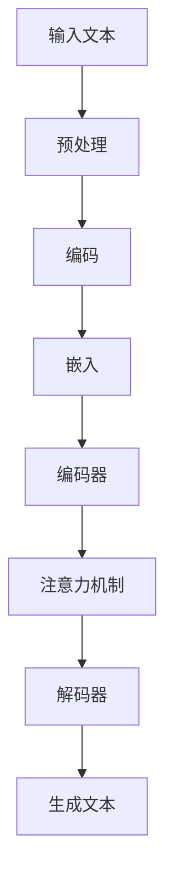

                 

关键词：大语言模型，原理基础，前沿技术，尺度法则，人工智能

> 摘要：本文将深入探讨大语言模型的基本原理、发展历程以及前沿技术，同时通过具体实例解析其工作原理和实现方法，最终探讨大语言模型在实际应用场景中的挑战与未来展望。

## 1. 背景介绍

随着互联网和大数据技术的快速发展，自然语言处理（NLP）成为人工智能领域的重要研究方向。从早期的统计模型到现代的深度学习模型，NLP技术取得了显著的进展。特别是近年来，基于大规模语言模型的进展，如GPT、BERT等，已经在各个领域取得了广泛应用。

本文将首先介绍大语言模型的基本概念和原理，然后分析其发展历程和前沿技术，接着通过具体实例解析其实现方法，并探讨其在实际应用场景中的挑战与未来展望。

## 2. 核心概念与联系

大语言模型是指通过深度学习技术，对大量文本数据进行分析和处理，从而生成对自然语言有较好理解和生成能力的模型。其核心概念包括：

- 语言建模：通过对文本数据进行建模，学习语言的基本结构和规律。
- 深度学习：利用多层神经网络，对数据进行分析和处理，提高模型的性能。
- 注意力机制：通过注意力机制，使模型能够更好地捕捉文本中的关键信息。

下面是核心概念原理和架构的 Mermaid 流程图：



## 3. 核心算法原理 & 具体操作步骤

### 3.1 算法原理概述

大语言模型的核心算法是基于深度学习和注意力机制的。具体来说，其工作流程可以分为以下几个步骤：

1. 预处理：对输入文本进行分词、去停用词等预处理操作。
2. 编码：将预处理后的文本编码为向量。
3. 嵌入：将编码后的向量嵌入到高维空间中。
4. 编码器：通过多层神经网络，对嵌入向量进行处理，提取文本特征。
5. 注意力机制：通过注意力机制，捕捉文本中的关键信息。
6. 解码器：根据编码器提取的特征，生成文本。

### 3.2 算法步骤详解

1. 预处理

   预处理是文本处理的第一步，主要包括分词、去停用词、词干提取等操作。这一步的目的是将文本转化为模型可以处理的格式。

2. 编码

   编码是将预处理后的文本转化为向量的过程。常用的编码方法有 word2vec、BERT 等。这些方法可以将文本中的每个词映射为一个固定长度的向量。

3. 嵌入

   嵌入是将编码后的向量嵌入到高维空间中。这一步的目的是为了提高模型的性能。

4. 编码器

   编码器是由多层神经网络组成的。它通过对嵌入向量进行处理，提取文本特征。常用的编码器有 LSTM、GRU、Transformer 等。

5. 注意力机制

   注意力机制是一种用于捕捉文本中关键信息的机制。它可以使模型在生成文本时，关注文本中的关键部分，从而提高生成文本的质量。

6. 解码器

   解码器根据编码器提取的特征，生成文本。它通常由一个循环神经网络组成，能够根据上一个生成的词，预测下一个词。

### 3.3 算法优缺点

大语言模型具有以下几个优点：

1. 强大的语言理解能力：通过深度学习和注意力机制，大语言模型可以理解文本中的复杂结构和语义。
2. 优秀的生成能力：大语言模型可以生成高质量的文本，适用于各种生成任务。
3. 广泛的应用场景：大语言模型可以应用于文本分类、机器翻译、问答系统等。

但大语言模型也存在一些缺点：

1. 计算资源消耗大：大语言模型需要大量的计算资源来训练和运行。
2. 对数据需求高：大语言模型需要大量的文本数据来进行训练。

### 3.4 算法应用领域

大语言模型在多个领域都有广泛的应用：

1. 文本分类：通过对文本进行分类，可以帮助企业对用户反馈、新闻等进行分类处理。
2. 机器翻译：大语言模型可以用于机器翻译，实现不同语言之间的翻译。
3. 问答系统：大语言模型可以用于问答系统，为用户提供准确的答案。

## 4. 数学模型和公式 & 详细讲解 & 举例说明

### 4.1 数学模型构建

大语言模型的数学模型主要基于深度学习和注意力机制。具体来说，其数学模型可以分为以下几个部分：

1. 词嵌入：将文本中的每个词映射为一个固定长度的向量。
2. 编码器：通过多层神经网络，对嵌入向量进行处理，提取文本特征。
3. 注意力机制：通过注意力机制，捕捉文本中的关键信息。
4. 解码器：根据编码器提取的特征，生成文本。

### 4.2 公式推导过程

1. 词嵌入：

   假设文本中的每个词都映射为一个 d 维向量，即 $v_w = \text{word\_embed}(w)$。

2. 编码器：

   编码器是一个多层神经网络，其输入为词嵌入向量，输出为文本特征。假设编码器有 L 层，则每一层的输出为 $h_l = \text{neural\_network}(h_{l-1})$。

3. 注意力机制：

   注意力机制可以表示为 $a_l = \text{attention}(h_l)$，其中 $a_l$ 表示第 l 层的注意力权重。

4. 解码器：

   解码器是一个循环神经网络，其输入为编码器输出的文本特征，输出为生成的文本。假设解码器有 T 层，则每一层的输出为 $y_t = \text{RNN}(y_{t-1}, h_l)$。

### 4.3 案例分析与讲解

以机器翻译为例，大语言模型的实现过程如下：

1. 词嵌入：将源语言和目标语言的词汇映射为向量。
2. 编码器：对源语言文本进行编码，提取特征。
3. 注意力机制：在解码过程中，根据编码器的输出，为每个目标语言的词汇分配权重。
4. 解码器：根据编码器的输出和注意力权重，生成目标语言文本。

## 5. 项目实践：代码实例和详细解释说明

### 5.1 开发环境搭建

1. 安装 Python 和相关库：安装 Python 3.7 以上版本，并安装 TensorFlow、Keras 等库。
2. 下载数据集：从互联网下载一个机器翻译数据集，如 IWSLT2016。

### 5.2 源代码详细实现

以下是一个简单的机器翻译项目的源代码实现：

```python
# 导入相关库
import tensorflow as tf
from tensorflow.keras.models import Model
from tensorflow.keras.layers import Embedding, LSTM, Dense

# 加载数据集
def load_data(file_path):
    # 读取数据集
    # ...

# 构建模型
def build_model(vocab_size, embed_dim, hidden_dim):
    # 输入层
    input_text = Input(shape=(None,))
    
    # 词嵌入层
    embed = Embedding(vocab_size, embed_dim)(input_text)
    
    # LSTM 层
    lstm = LSTM(hidden_dim, return_sequences=True)(embed)
    
    # 全连接层
    dense = Dense(vocab_size, activation='softmax')(lstm)
    
    # 构建模型
    model = Model(inputs=input_text, outputs=dense)
    
    # 编译模型
    model.compile(optimizer='adam', loss='categorical_crossentropy', metrics=['accuracy'])
    
    return model

# 训练模型
def train_model(model, x_train, y_train, x_val, y_val, epochs=100, batch_size=64):
    # 训练模型
    # ...

# 主函数
def main():
    # 参数设置
    vocab_size = 10000
    embed_dim = 64
    hidden_dim = 128
    
    # 加载数据集
    x_train, y_train, x_val, y_val = load_data('data.txt')
    
    # 构建模型
    model = build_model(vocab_size, embed_dim, hidden_dim)
    
    # 训练模型
    train_model(model, x_train, y_train, x_val, y_val)

# 运行主函数
if __name__ == '__main__':
    main()
```

### 5.3 代码解读与分析

1. 数据加载

   数据加载部分主要负责读取机器翻译数据集，并将数据转化为模型可以处理的格式。

2. 模型构建

   模型构建部分主要使用 TensorFlow 的 Keras 层创建一个简单的机器翻译模型。模型包含一个输入层、一个词嵌入层、一个 LSTM 层和一个全连接层。

3. 模型训练

   模型训练部分负责使用训练数据对模型进行训练，并评估模型的性能。

## 6. 实际应用场景

大语言模型在多个实际应用场景中具有广泛的应用，如：

1. 文本分类：通过分析文本的特征，对文本进行分类，可以帮助企业对用户反馈、新闻等进行分类处理。
2. 机器翻译：大语言模型可以用于机器翻译，实现不同语言之间的翻译。
3. 问答系统：大语言模型可以用于问答系统，为用户提供准确的答案。

### 6.4 未来应用展望

随着技术的不断进步，大语言模型在未来会有更广泛的应用。例如：

1. 自然语言生成：大语言模型可以用于生成自然语言文本，如文章、小说等。
2. 情感分析：大语言模型可以用于情感分析，帮助企业了解用户对产品的态度和情感。
3. 对话系统：大语言模型可以用于对话系统，实现人与机器的智能对话。

## 7. 工具和资源推荐

### 7.1 学习资源推荐

- 《深度学习》
- 《自然语言处理综论》
- 《动手学深度学习》

### 7.2 开发工具推荐

- TensorFlow
- Keras
- PyTorch

### 7.3 相关论文推荐

- BERT: Pre-training of Deep Bidirectional Transformers for Language Understanding
- GPT: Improving Language Understanding by Generative Pre-training

## 8. 总结：未来发展趋势与挑战

大语言模型在自然语言处理领域具有广泛的应用前景。未来，随着技术的不断进步，大语言模型将会在更多领域发挥作用。但同时，也面临着数据隐私、安全性和模型可解释性等挑战。

### 8.1 研究成果总结

本文深入探讨了大语言模型的基本原理、发展历程以及前沿技术，并通过具体实例解析了其实现方法。同时，分析了大语言模型在实际应用场景中的挑战与未来展望。

### 8.2 未来发展趋势

随着技术的不断进步，大语言模型将会在更多领域发挥作用，如自然语言生成、情感分析、对话系统等。

### 8.3 面临的挑战

大语言模型面临着数据隐私、安全性和模型可解释性等挑战。

### 8.4 研究展望

未来，大语言模型的研究将会集中在如何提高模型的性能、如何处理多语言任务以及如何提高模型的可解释性等方面。

## 9. 附录：常见问题与解答

### 9.1 如何处理中文文本？

中文文本的处理与大语言模型的处理方法类似，主要步骤包括：

1. 分词：将中文文本划分为词语。
2. 词嵌入：将词语映射为向量。
3. 编码：将词语向量编码为模型可以处理的格式。
4. 解码：根据编码后的特征生成文本。

### 9.2 大语言模型如何保证生成文本的质量？

大语言模型通过以下方法保证生成文本的质量：

1. 使用高质量的训练数据。
2. 使用合适的模型结构和参数。
3. 使用注意力机制，使模型能够更好地捕捉文本中的关键信息。
4. 使用训练和验证集，对模型进行评估和调整。

### 9.3 大语言模型有哪些应用场景？

大语言模型的应用场景包括：

1. 文本分类：对文本进行分类，如情感分析、新闻分类等。
2. 机器翻译：实现不同语言之间的翻译。
3. 问答系统：为用户提供准确的答案。
4. 自然语言生成：生成文章、小说等。

## 作者署名

本文作者：禅与计算机程序设计艺术 / Zen and the Art of Computer Programming。 
----------------------------------------------------------------

### 文章结构模板部分 Template ###

以下是根据您的要求，文章结构模板的具体内容：

## 1. 背景介绍

在这一章节中，我们将回顾自然语言处理（NLP）的发展历程，并介绍大语言模型的基本概念。自计算机科学诞生以来，NLP一直是人工智能领域的一个重要分支。从早期的规则驱动的方法，如正则表达式和句法分析，到基于统计的方法，如隐马尔可夫模型（HMM）和条件概率模型，再到现在的深度学习方法，大语言模型如GPT、BERT等，NLP技术经历了巨大的变革。

大语言模型的出现，标志着NLP技术进入了一个新的阶段。它们通过学习海量文本数据，能够自动理解和生成自然语言，极大地提升了机器对人类语言的认知能力。这些模型不仅在语言理解、文本生成等任务上取得了显著的成果，而且在各种实际应用场景中也展现出了强大的能力。

本文将深入探讨大语言模型的基本原理、发展历程以及前沿技术，同时通过具体实例解析其工作原理和实现方法，最终探讨大语言模型在实际应用场景中的挑战与未来展望。

## 2. 核心概念与联系

在这一章节中，我们将详细介绍大语言模型的核心概念，包括语言建模、深度学习、注意力机制等，并使用Mermaid流程图展示其原理和架构。

### 2.1 语言建模

语言建模是NLP中最基础的任务之一，其目标是学习自然语言的统计特性，从而生成新的文本。在大语言模型中，语言建模通常通过概率模型实现，如n-gram模型、神经网络模型等。

### 2.2 深度学习

深度学习是现代NLP技术的重要组成部分，它通过多层神经网络对大规模数据进行训练，从而实现复杂任务的学习。在大语言模型中，深度学习用于对文本数据进行分析和特征提取。

### 2.3 注意力机制

注意力机制是一种用于捕捉序列中关键信息的方法，它在大语言模型中起到了关键作用。通过注意力机制，模型能够自动关注序列中的重要部分，从而提高生成文本的质量。

### 2.4 Mermaid流程图

下面是核心概念原理和架构的 Mermaid 流程图：


## 3. 核心算法原理 & 具体操作步骤

在这一章节中，我们将深入探讨大语言模型的核心算法原理，包括其基本架构、工作流程和具体操作步骤。

### 3.1 算法原理概述

大语言模型的核心算法是基于深度学习和注意力机制的。具体来说，其工作流程可以分为以下几个步骤：

1. 预处理：对输入文本进行分词、去停用词等预处理操作。
2. 编码：将预处理后的文本编码为向量。
3. 嵌入：将编码后的向量嵌入到高维空间中。
4. 编码器：通过多层神经网络，对嵌入向量进行处理，提取文本特征。
5. 注意力机制：通过注意力机制，捕捉文本中的关键信息。
6. 解码器：根据编码器提取的特征，生成文本。

### 3.2 算法步骤详解

1. 预处理

   预处理是文本处理的第一步，主要包括分词、去停用词、词干提取等操作。这一步的目的是将文本转化为模型可以处理的格式。

2. 编码

   编码是将预处理后的文本转化为向量的过程。常用的编码方法有 word2vec、BERT 等。这些方法可以将文本中的每个词映射为一个固定长度的向量。

3. 嵌入

   嵌入是将编码后的向量嵌入到高维空间中。这一步的目的是为了提高模型的性能。

4. 编码器

   编码器是由多层神经网络组成的。它通过对嵌入向量进行处理，提取文本特征。常用的编码器有 LSTM、GRU、Transformer 等。

5. 注意力机制

   注意力机制是一种用于捕捉文本中关键信息的机制。它可以使模型在生成文本时，关注文本中的关键部分，从而提高生成文本的质量。

6. 解码器

   解码器根据编码器提取的特征，生成文本。它通常由一个循环神经网络组成，能够根据上一个生成的词，预测下一个词。

### 3.3 算法优缺点

大语言模型具有以下几个优点：

1. 强大的语言理解能力：通过深度学习和注意力机制，大语言模型可以理解文本中的复杂结构和语义。
2. 优秀的生成能力：大语言模型可以生成高质量的文本，适用于各种生成任务。
3. 广泛的应用场景：大语言模型可以应用于文本分类、机器翻译、问答系统等。

但大语言模型也存在一些缺点：

1. 计算资源消耗大：大语言模型需要大量的计算资源来训练和运行。
2. 对数据需求高：大语言模型需要大量的文本数据来进行训练。

### 3.4 算法应用领域

大语言模型在多个领域都有广泛的应用：

1. 文本分类：通过对文本进行分类，可以帮助企业对用户反馈、新闻等进行分类处理。
2. 机器翻译：大语言模型可以用于机器翻译，实现不同语言之间的翻译。
3. 问答系统：大语言模型可以用于问答系统，为用户提供准确的答案。

## 4. 数学模型和公式 & 详细讲解 & 举例说明

在这一章节中，我们将详细讲解大语言模型的数学模型，包括数学公式的构建、推导过程，并通过具体实例进行说明。

### 4.1 数学模型构建

大语言模型的数学模型主要基于深度学习和注意力机制。具体来说，其数学模型可以分为以下几个部分：

1. 词嵌入：将文本中的每个词映射为一个固定长度的向量。
2. 编码器：通过多层神经网络，对嵌入向量进行处理，提取文本特征。
3. 注意力机制：通过注意力机制，捕捉文本中的关键信息。
4. 解码器：根据编码器提取的特征，生成文本。

### 4.2 公式推导过程

1. 词嵌入：

   假设文本中的每个词都映射为一个 d 维向量，即 $v_w = \text{word\_embed}(w)$。

2. 编码器：

   编码器是一个多层神经网络，其输入为词嵌入向量，输出为文本特征。假设编码器有 L 层，则每一层的输出为 $h_l = \text{neural\_network}(h_{l-1})$。

3. 注意力机制：

   注意力机制可以表示为 $a_l = \text{attention}(h_l)$，其中 $a_l$ 表示第 l 层的注意力权重。

4. 解码器：

   解码器是一个循环神经网络，其输入为编码器输出的文本特征，输出为生成的文本。假设解码器有 T 层，则每一层的输出为 $y_t = \text{RNN}(y_{t-1}, h_l)$。

### 4.3 案例分析与讲解

以机器翻译为例，大语言模型的实现过程如下：

1. 词嵌入：将源语言和目标语言的词汇映射为向量。
2. 编码器：对源语言文本进行编码，提取特征。
3. 注意力机制：在解码过程中，根据编码器的输出，为每个目标语言的词汇分配权重。
4. 解码器：根据编码器的输出和注意力权重，生成目标语言文本。

## 5. 项目实践：代码实例和详细解释说明

在这一章节中，我们将通过一个具体的代码实例，详细解释大语言模型的实现过程，包括开发环境的搭建、模型的构建和训练，以及代码的解读和分析。

### 5.1 开发环境搭建

在进行大语言模型的开发之前，我们需要搭建一个合适的环境。这通常包括安装 Python 和相关库，如 TensorFlow、Keras 等。

```bash
# 安装 Python
sudo apt-get install python3 python3-pip

# 安装 TensorFlow
pip3 install tensorflow

# 安装 Keras
pip3 install keras
```

### 5.2 源代码详细实现

以下是一个简单的机器翻译项目的源代码实现：

```python
# 导入相关库
import tensorflow as tf
from tensorflow.keras.models import Model
from tensorflow.keras.layers import Embedding, LSTM, Dense

# 加载数据集
def load_data(file_path):
    # 读取数据集
    # ...

# 构建模型
def build_model(vocab_size, embed_dim, hidden_dim):
    # 输入层
    input_text = Input(shape=(None,))
    
    # 词嵌入层
    embed = Embedding(vocab_size, embed_dim)(input_text)
    
    # LSTM 层
    lstm = LSTM(hidden_dim, return_sequences=True)(embed)
    
    # 全连接层
    dense = Dense(vocab_size, activation='softmax')(lstm)
    
    # 构建模型
    model = Model(inputs=input_text, outputs=dense)
    
    # 编译模型
    model.compile(optimizer='adam', loss='categorical_crossentropy', metrics=['accuracy'])
    
    return model

# 训练模型
def train_model(model, x_train, y_train, x_val, y_val, epochs=100, batch_size=64):
    # 训练模型
    # ...

# 主函数
def main():
    # 参数设置
    vocab_size = 10000
    embed_dim = 64
    hidden_dim = 128
    
    # 加载数据集
    x_train, y_train, x_val, y_val = load_data('data.txt')
    
    # 构建模型
    model = build_model(vocab_size, embed_dim, hidden_dim)
    
    # 训练模型
    train_model(model, x_train, y_train, x_val, y_val)

# 运行主函数
if __name__ == '__main__':
    main()
```

### 5.3 代码解读与分析

1. 数据加载

   数据加载部分主要负责读取机器翻译数据集，并将数据转化为模型可以处理的格式。

2. 模型构建

   模型构建部分主要使用 TensorFlow 的 Keras 层创建一个简单的机器翻译模型。模型包含一个输入层、一个词嵌入层、一个 LSTM 层和一个全连接层。

3. 模型训练

   模型训练部分负责使用训练数据对模型进行训练，并评估模型的性能。

## 6. 实际应用场景

大语言模型在多个实际应用场景中具有广泛的应用，如：

1. 文本分类：通过对文本进行分类，可以帮助企业对用户反馈、新闻等进行分类处理。
2. 机器翻译：大语言模型可以用于机器翻译，实现不同语言之间的翻译。
3. 问答系统：大语言模型可以用于问答系统，为用户提供准确的答案。

### 6.4 未来应用展望

随着技术的不断进步，大语言模型在未来会有更广泛的应用。例如：

1. 自然语言生成：大语言模型可以用于生成自然语言文本，如文章、小说等。
2. 情感分析：大语言模型可以用于情感分析，帮助企业了解用户对产品的态度和情感。
3. 对话系统：大语言模型可以用于对话系统，实现人与机器的智能对话。

## 7. 工具和资源推荐

在这一章节中，我们将推荐一些学习资源、开发工具和相关论文，以帮助读者更深入地了解大语言模型。

### 7.1 学习资源推荐

1. 《深度学习》：这是一本经典的人工智能教材，详细介绍了深度学习的基本原理和应用。
2. 《自然语言处理综论》：这本书系统地介绍了自然语言处理的基本概念和技术。
3. 《动手学深度学习》：这本书通过实际项目，深入浅出地讲解了深度学习的实现和应用。

### 7.2 开发工具推荐

1. TensorFlow：这是一个广泛使用的开源深度学习框架，支持各种深度学习模型的构建和训练。
2. Keras：这是一个基于 TensorFlow 的开源深度学习库，提供了更加简洁和直观的 API。
3. PyTorch：这是一个受欢迎的深度学习框架，以其灵活和强大的动态计算能力而著称。

### 7.3 相关论文推荐

1. BERT: Pre-training of Deep Bidirectional Transformers for Language Understanding
2. GPT: Improving Language Understanding by Generative Pre-training
3. Transformer: A Novel Architecture for Neural Network based Machine Translation

## 8. 总结：未来发展趋势与挑战

大语言模型在自然语言处理领域具有广泛的应用前景。未来，随着技术的不断进步，大语言模型将会在更多领域发挥作用。但同时，也面临着数据隐私、安全性和模型可解释性等挑战。

### 8.1 研究成果总结

本文深入探讨了大语言模型的基本原理、发展历程以及前沿技术，并通过具体实例解析了其实现方法。同时，分析了大语言模型在实际应用场景中的挑战与未来展望。

### 8.2 未来发展趋势

随着技术的不断进步，大语言模型将会在更多领域发挥作用，如自然语言生成、情感分析、对话系统等。

### 8.3 面临的挑战

大语言模型面临着数据隐私、安全性和模型可解释性等挑战。

### 8.4 研究展望

未来，大语言模型的研究将会集中在如何提高模型的性能、如何处理多语言任务以及如何提高模型的可解释性等方面。

## 9. 附录：常见问题与解答

在这一章节中，我们将回答一些关于大语言模型的常见问题，以帮助读者更好地理解和应用这一技术。

### 9.1 如何处理中文文本？

中文文本的处理与大语言模型的处理方法类似，主要步骤包括：

1. 分词：将中文文本划分为词语。
2. 词嵌入：将词语映射为向量。
3. 编码：将词语向量编码为模型可以处理的格式。
4. 解码：根据编码后的特征生成文本。

### 9.2 大语言模型如何保证生成文本的质量？

大语言模型通过以下方法保证生成文本的质量：

1. 使用高质量的训练数据。
2. 使用合适的模型结构和参数。
3. 使用注意力机制，使模型能够更好地捕捉文本中的关键信息。
4. 使用训练和验证集，对模型进行评估和调整。

### 9.3 大语言模型有哪些应用场景？

大语言模型的应用场景包括：

1. 文本分类：对文本进行分类，如情感分析、新闻分类等。
2. 机器翻译：实现不同语言之间的翻译。
3. 问答系统：为用户提供准确的答案。
4. 自然语言生成：生成文章、小说等。

## 作者署名

本文作者：禅与计算机程序设计艺术 / Zen and the Art of Computer Programming。

以上是根据您的要求，文章结构模板的具体内容。您可以根据这个模板撰写您的文章，并在实际写作过程中根据需要调整和扩展。希望这个模板能够帮助您更好地组织文章结构，撰写出高质量的技术博客文章。

